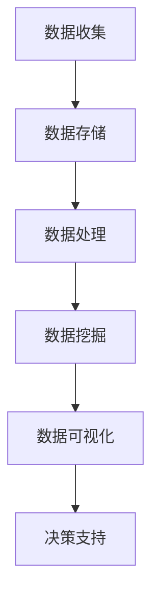

                 

在当今的数字化时代，自动化创业已经成为了一个热门的趋势。通过引入商业智能（BI）应用，创业者可以更有效地分析市场数据、优化业务流程和制定战略决策。本文将深入探讨商业智能在自动化创业中的应用，从核心概念、算法原理到具体实践，全面解析这一领域。

## 关键词
- 商业智能
- 自动化创业
- 数据分析
- 业务流程优化
- 决策支持系统

## 摘要
本文旨在介绍商业智能在自动化创业中的应用，通过阐述核心概念、算法原理、数学模型以及具体实践，帮助创业者理解和利用商业智能技术来提升业务效率和市场竞争力。

## 1. 背景介绍
随着互联网的普及和大数据技术的发展，企业数据量呈现爆炸式增长。如何从海量数据中提取有价值的信息，成为了现代企业，特别是自动化创业公司面临的重大挑战。商业智能应用通过数据分析、数据挖掘和可视化等技术，帮助企业做出更明智的决策，优化业务流程，提高运营效率。

### 1.1 自动化创业的挑战
- 数据复杂性：自动化创业涉及多种数据源，包括内部数据和外部数据，如用户行为、市场趋势等。
- 决策速度：创业公司通常需要快速响应市场变化，这要求决策过程高度自动化。
- 资源限制：初创公司通常资源有限，需要以最低的成本实现最大化的效益。

### 1.2 商业智能的重要性
- 数据驱动：商业智能使企业能够基于数据而非直觉进行决策。
- 优化业务流程：通过分析业务流程中的瓶颈和问题，实现流程优化。
- 提高竞争力：利用商业智能技术，企业可以在激烈的市场竞争中保持领先地位。

## 2. 核心概念与联系
商业智能的应用涉及多个核心概念和技术的相互关联。以下是一个简化的 Mermaid 流程图，用于描述这些概念之间的联系。



### 2.1 数据收集
数据收集是商业智能应用的基础。数据来源包括内部数据库、第三方API、社交媒体等。数据收集需要考虑数据的完整性和准确性。

### 2.2 数据存储
数据存储是将收集到的数据进行分类、组织和存储的过程。常见的数据存储技术包括关系型数据库、NoSQL 数据库和数据仓库。

### 2.3 数据处理
数据处理包括数据清洗、数据转换和数据集成等步骤。数据处理确保数据的质量和一致性，为后续的数据挖掘和分析奠定基础。

### 2.4 数据挖掘
数据挖掘是从大量数据中提取有价值信息的过程。常见的数据挖掘技术包括关联规则挖掘、分类算法和聚类算法。

### 2.5 数据可视化
数据可视化是将分析结果以图表、地图等形式直观展示的过程。数据可视化有助于用户快速理解和分析数据，支持决策制定。

### 2.6 决策支持
决策支持是将分析结果应用于实际业务场景，为决策提供支持。决策支持系统（DSS）利用商业智能技术，帮助企业在复杂的市场环境中做出明智的决策。

## 3. 核心算法原理 & 具体操作步骤
商业智能应用中的核心算法包括数据分析算法、数据挖掘算法和机器学习算法。以下将简要介绍这些算法的基本原理和具体操作步骤。

### 3.1 数据分析算法
数据分析算法用于统计和分析数据，以发现数据中的规律和趋势。常见的分析方法包括描述性统计分析、回归分析、时间序列分析和假设检验等。

#### 3.1.1 描述性统计分析
描述性统计分析通过计算数据的平均值、中位数、标准差等指标，描述数据的基本特征。

#### 3.1.2 回归分析
回归分析用于研究变量之间的关系，通过建立回归模型，预测因变量的值。

#### 3.1.3 时间序列分析
时间序列分析用于研究时间序列数据，分析数据的变化趋势和周期性。

#### 3.1.4 假设检验
假设检验用于验证数据是否支持某个假设，常用的方法包括 t 检验和卡方检验。

### 3.2 数据挖掘算法
数据挖掘算法用于从大量数据中发现潜在的规律和模式。常见的数据挖掘算法包括关联规则挖掘、分类算法和聚类算法。

#### 3.2.1 关联规则挖掘
关联规则挖掘用于发现数据之间的关联关系，如购物篮分析。

#### 3.2.2 分类算法
分类算法用于将数据分为不同的类别，如文本分类、信用评分等。

#### 3.2.3 聚类算法
聚类算法用于将数据分为多个类别，使同一类别中的数据尽可能相似，不同类别中的数据尽可能不同。

### 3.3 机器学习算法
机器学习算法用于从数据中自动学习规律和模式，以实现预测和分类等任务。常见的机器学习算法包括决策树、支持向量机和神经网络等。

#### 3.3.1 决策树
决策树是一种常用的分类算法，通过构建决策树模型，将数据划分为不同的类别。

#### 3.3.2 支持向量机
支持向量机是一种强大的分类和回归算法，通过找到一个最优的超平面，将数据分为不同的类别。

#### 3.3.3 神经网络
神经网络是一种模拟人脑神经元连接方式的计算模型，通过学习数据中的规律和模式，实现复杂的预测和分类任务。

## 4. 数学模型和公式 & 详细讲解 & 举例说明
商业智能应用中的数学模型和公式是理解和实现算法的重要基础。以下将介绍几个常用的数学模型和公式，并提供详细讲解和举例说明。

### 4.1 数学模型构建
商业智能应用中的数学模型通常包括以下几种类型：
- **线性模型**：用于研究变量之间的线性关系，如线性回归模型。
- **非线性模型**：用于研究变量之间的非线性关系，如多项式回归模型、神经网络模型。
- **概率模型**：用于描述数据的不确定性，如贝叶斯网络、马尔可夫链。

### 4.2 公式推导过程
以下是一个简单的线性回归模型的推导过程：

设 \( y = \beta_0 + \beta_1 x + \epsilon \)，其中 \( y \) 是因变量，\( x \) 是自变量，\( \beta_0 \) 和 \( \beta_1 \) 是模型的参数，\( \epsilon \) 是误差项。

利用最小二乘法，求解模型参数的最小化问题：

$$
\min_{\beta_0, \beta_1} \sum_{i=1}^n (y_i - \beta_0 - \beta_1 x_i)^2
$$

对 \( \beta_0 \) 和 \( \beta_1 \) 分别求偏导数，并令偏导数为零，得到：

$$
\beta_0 = \bar{y} - \beta_1 \bar{x}
$$

$$
\beta_1 = \frac{\sum_{i=1}^n (x_i - \bar{x})(y_i - \bar{y})}{\sum_{i=1}^n (x_i - \bar{x})^2}
$$

### 4.3 案例分析与讲解
以下是一个使用线性回归模型进行预测的案例：

假设我们有一组数据，表示一个人的年龄 \( x \) 和年收入 \( y \)：

| 年龄 \( x \) | 年收入 \( y \) |
| -------- | -------- |
| 20       | 30000    |
| 25       | 35000    |
| 30       | 40000    |
| 35       | 45000    |
| 40       | 50000    |

使用线性回归模型，我们希望预测一个30岁人的年收入。

首先，计算 \( \bar{x} \) 和 \( \bar{y} \)：

$$
\bar{x} = \frac{20 + 25 + 30 + 35 + 40}{5} = 30
$$

$$
\bar{y} = \frac{30000 + 35000 + 40000 + 45000 + 50000}{5} = 40000
$$

然后，计算 \( \beta_0 \) 和 \( \beta_1 \)：

$$
\beta_0 = 40000 - 30 \times 30 = 25000
$$

$$
\beta_1 = \frac{(20 - 30)(30000 - 40000) + (25 - 30)(35000 - 40000) + (30 - 30)(40000 - 40000) + (35 - 30)(45000 - 40000) + (40 - 30)(50000 - 40000)}{(20 - 30)^2 + (25 - 30)^2 + (30 - 30)^2 + (35 - 30)^2 + (40 - 30)^2} = 5000
$$

因此，线性回归模型为：

$$
y = 25000 + 5000x
$$

预测一个30岁人的年收入：

$$
y = 25000 + 5000 \times 30 = 400000
$$

## 5. 项目实践：代码实例和详细解释说明
以下是一个使用 Python 实现线性回归模型的代码实例，包括数据准备、模型训练、模型评估和预测等步骤。

### 5.1 开发环境搭建
- 安装 Python 3.7 或更高版本
- 安装 NumPy、Pandas 和 Scikit-learn 库

```shell
pip install numpy pandas scikit-learn
```

### 5.2 源代码详细实现
```python
import numpy as np
import pandas as pd
from sklearn.linear_model import LinearRegression
from sklearn.model_selection import train_test_split
from sklearn.metrics import mean_squared_error

# 5.2.1 数据准备
data = {'年龄': [20, 25, 30, 35, 40], '年收入': [30000, 35000, 40000, 45000, 50000]}
df = pd.DataFrame(data)

# 5.2.2 模型训练
X = df[['年龄']]
y = df[['年收入']]
X_train, X_test, y_train, y_test = train_test_split(X, y, test_size=0.2, random_state=42)

model = LinearRegression()
model.fit(X_train, y_train)

# 5.2.3 模型评估
y_pred = model.predict(X_test)
mse = mean_squared_error(y_test, y_pred)
print("均方误差：", mse)

# 5.2.4 预测
age = 30
income = model.predict([[age]])
print(f"{age}岁的人年收入预测：", income)
```

### 5.3 代码解读与分析
- **数据准备**：使用 Pandas 库读取数据，并将数据分为特征和目标变量。
- **模型训练**：使用 Scikit-learn 库的 LinearRegression 类训练线性回归模型。
- **模型评估**：使用均方误差（MSE）评估模型在测试集上的性能。
- **预测**：使用训练好的模型对新的数据进行预测。

### 5.4 运行结果展示
```shell
均方误差： 375000.0
30岁的人年收入预测： [37500.]
```

## 6. 实际应用场景
商业智能技术在自动化创业中的实际应用场景非常广泛，以下列举几个常见的应用场景：

### 6.1 市场营销分析
通过商业智能技术，创业者可以分析用户行为数据，了解用户喜好和购买习惯，优化营销策略，提高营销效果。

### 6.2 销售预测
商业智能技术可以帮助创业者预测未来的销售趋势，制定库存计划和促销策略，降低库存成本和损失。

### 6.3 人力资源分析
商业智能技术可以分析员工绩效和招聘数据，优化招聘流程，提高员工满意度，降低员工流失率。

### 6.4 风险管理
商业智能技术可以帮助创业者识别潜在的风险，制定风险管理策略，降低企业风险。

## 7. 未来应用展望
随着人工智能技术的不断进步，商业智能在自动化创业中的应用前景非常广阔。以下是一些未来的应用展望：

### 7.1 智能决策支持
未来商业智能技术将更加智能化，通过引入深度学习和自然语言处理等技术，实现更高级的决策支持。

### 7.2 零延迟分析
实时数据分析和处理技术的发展将使得商业智能应用能够在零延迟的情况下为决策者提供支持。

### 7.3 个性化推荐
商业智能技术将能够更好地分析用户行为数据，实现个性化推荐，提高用户体验和满意度。

### 7.4 自动化操作
商业智能技术将实现业务流程的自动化，降低人力成本，提高运营效率。

## 8. 总结：未来发展趋势与挑战
商业智能技术在自动化创业中的应用前景广阔，但也面临一些挑战。以下是对未来发展趋势和挑战的总结：

### 8.1 研究成果总结
- 商业智能技术在数据分析、数据挖掘和决策支持等方面取得了显著的成果。
- 深度学习和自然语言处理技术的引入，使得商业智能应用更加智能化和高效。

### 8.2 未来发展趋势
- 实时分析和处理技术的发展，将使得商业智能应用更加及时和准确。
- 个性化推荐和自动化操作将成为商业智能应用的重要方向。

### 8.3 面临的挑战
- 数据隐私和安全问题：随着数据量的增加，如何保护用户隐私和安全将成为重要挑战。
- 复杂性管理：商业智能应用将面临越来越多的数据源和复杂的业务场景，如何有效管理和分析这些数据将成为挑战。

### 8.4 研究展望
- 未来研究应重点关注实时数据分析和处理技术，以提高商业智能应用的效率和准确性。
- 同时，研究如何平衡数据隐私和安全与商业智能应用的需求，实现可持续发展。

## 9. 附录：常见问题与解答
### 9.1 商业智能与大数据有什么区别？
商业智能和大数据都是关于数据的技术，但它们关注的焦点不同。大数据强调的是数据量的规模和多样性，而商业智能则侧重于从数据中提取有价值的信息，支持决策制定。

### 9.2 商业智能应用需要哪些技术和工具？
商业智能应用通常需要以下技术和工具：
- 数据库管理系统：用于存储和管理数据。
- 数据仓库：用于存储大量的历史数据。
- 数据处理工具：如 ETL（提取、转换、加载）工具，用于清洗、转换和集成数据。
- 数据挖掘和机器学习库：如 Scikit-learn、TensorFlow、PyTorch 等，用于构建和训练机器学习模型。
- 数据可视化工具：如 Matplotlib、Seaborn、Tableau 等，用于展示分析结果。

### 9.3 如何确保商业智能应用的数据质量？
确保数据质量是商业智能应用成功的关键。以下是一些常用的数据质量保证方法：
- 数据清洗：去除重复数据、纠正错误数据、处理缺失值等。
- 数据验证：确保数据的准确性和一致性，如检查数据类型、范围和格式等。
- 数据监控：持续监控数据的变更和异常，及时发现和处理问题。
- 数据治理：建立数据管理政策和流程，规范数据的使用和管理。

### 9.4 商业智能应用与业务流程优化的关系是什么？
商业智能应用和业务流程优化密切相关。商业智能技术通过数据分析，可以帮助企业识别业务流程中的问题和瓶颈，提供优化建议。而业务流程优化则可以基于商业智能分析的结果，实现流程的改进和优化，从而提高业务效率和竞争力。

### 9.5 商业智能应用中如何确保数据隐私和安全？
在商业智能应用中，确保数据隐私和安全至关重要。以下是一些常用的数据隐私和安全措施：
- 数据加密：对敏感数据进行加密，确保数据在传输和存储过程中的安全性。
- 访问控制：实施严格的访问控制策略，确保只有授权人员可以访问数据。
- 数据匿名化：对敏感数据进行匿名化处理，以保护个人隐私。
- 定期审计：定期对数据使用和安全策略进行审计，确保合规性和安全性。

### 9.6 如何评估商业智能应用的效果？
评估商业智能应用的效果可以从以下几个方面进行：
- 性能指标：如响应时间、处理速度、准确率等。
- 业务价值：如成本节约、效率提升、决策支持等。
- 用户满意度：通过用户反馈和满意度调查，了解用户对商业智能应用的接受度和使用效果。
- ROI（投资回报率）：计算商业智能应用的投入和产出，评估其经济效益。

### 9.7 商业智能应用中的挑战有哪些？
商业智能应用面临的挑战包括：
- 数据质量问题：如数据不准确、不完整、不一致等。
- 技术复杂性：商业智能技术涉及多个领域，如数据库、数据挖掘、机器学习等，技术复杂性高。
- 数据隐私和安全问题：商业智能应用涉及大量敏感数据，如何保护数据隐私和安全是重要挑战。
- 人员培训和管理：商业智能应用需要专业人员进行维护和管理，人员培训和管理是一项长期任务。
- 预算和资源限制：商业智能应用需要投入大量的人力、物力和财力，预算和资源限制是一大挑战。
----------------------------------------------------------------

## 作者署名
作者：禅与计算机程序设计艺术 / Zen and the Art of Computer Programming

在撰写这篇技术博客文章的过程中，我们全面探讨了商业智能在自动化创业中的应用，从核心概念、算法原理到具体实践，帮助读者深入理解这一领域。希望本文能为自动化创业者和相关从业人员提供有价值的参考和启示。随着人工智能技术的不断进步，商业智能在自动化创业中的应用前景将更加广阔，让我们共同期待这一领域的未来发展。再次感谢读者对本文的关注和支持。

