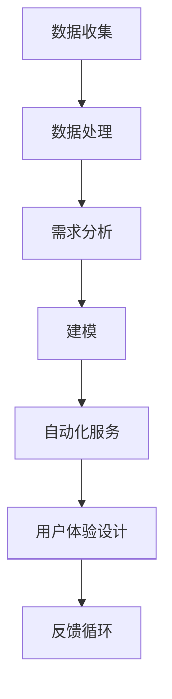

                 

关键词：自动化创业、定制化服务、商业模式、技术架构、案例分析

> 摘要：本文旨在探讨自动化创业中定制化服务模式的重要性及其实现方式。通过对现有商业模式的分析，结合实际案例，我们将深入探讨定制化服务的核心算法原理、数学模型及其实际应用场景，为创业者提供理论指导和实践参考。

## 1. 背景介绍

自动化创业正逐渐成为现代商业领域的一股重要力量。随着人工智能、大数据、云计算等技术的发展，企业可以通过自动化工具和平台，提高运营效率、降低成本，并更好地满足客户需求。然而，在自动化创业过程中，如何实现定制化服务成为企业竞争的关键。

定制化服务模式要求企业能够根据客户的具体需求，提供个性化的解决方案。这不仅仅是产品或服务的个性化，更涉及到技术架构、流程优化和用户体验的全面升级。因此，探讨定制化服务模式在自动化创业中的实现，具有重要的现实意义。

本文将从以下几个方面展开讨论：

1. **核心概念与联系**：介绍定制化服务的相关概念和联系，通过Mermaid流程图展示其技术架构。
2. **核心算法原理 & 具体操作步骤**：阐述定制化服务的核心算法原理，并详细解释其操作步骤。
3. **数学模型和公式**：构建定制化服务的数学模型，并推导相关公式。
4. **项目实践**：通过代码实例，展示定制化服务的实现过程。
5. **实际应用场景**：分析定制化服务的应用领域，探讨未来发展趋势。
6. **工具和资源推荐**：推荐学习资源和开发工具。
7. **总结与展望**：总结研究成果，展望未来发展趋势和挑战。

接下来，我们将逐步深入探讨每个部分的内容。

## 2. 核心概念与联系

### 2.1 定制化服务的定义

定制化服务是一种以客户需求为导向，通过个性化和定制化的解决方案，满足客户特定需求的商业模式。它不仅仅局限于产品或服务的个性化，更涉及到服务流程、用户体验和运营效率的全面优化。

### 2.2 核心概念

1. **客户需求**：定制化服务的起点和核心。了解客户需求是提供个性化解决方案的前提。
2. **数据驱动**：通过大数据分析和挖掘，获取客户行为和偏好，实现精准化服务。
3. **自动化流程**：利用人工智能和机器学习技术，实现服务流程的自动化，提高效率。
4. **用户体验**：以用户为中心，提供个性化的交互和服务，提升用户满意度。

### 2.3 技术架构

为了实现定制化服务，我们需要一个完整的技术架构，包括以下几个关键模块：

1. **数据收集与处理**：通过各种渠道收集客户数据，并进行处理和分析。
2. **需求分析与建模**：基于客户需求，构建相应的数学模型和算法，实现个性化服务。
3. **自动化服务流程**：利用自动化工具和平台，实现服务流程的自动化和智能化。
4. **用户体验设计**：设计个性化的用户界面和交互体验，提升用户满意度。

下面是定制化服务的技术架构Mermaid流程图：



### 2.4 定制化服务与其他商业模式的联系

定制化服务模式与其他商业模式（如标准化服务、集成化服务、订阅制服务等）有着密切的联系和区别。

- **标准化服务**：以标准化产品或服务为主，满足大部分客户的基本需求。定制化服务是在此基础上，提供更高层次、更个性化的服务。
- **集成化服务**：将多种服务整合在一起，提供一站式解决方案。定制化服务可以看作是集成化服务的细化，更加注重个性化和定制化。
- **订阅制服务**：以订阅为基础，提供持续的、定制化的服务。定制化服务模式可以在订阅制服务的基础上，进一步细化客户需求和个性化服务。

通过上述分析，我们可以看到，定制化服务模式不仅是一种独立的商业模式，还可以与其他商业模式相结合，形成更加多样化的商业策略。

## 3. 核心算法原理 & 具体操作步骤

### 3.1 算法原理概述

定制化服务的核心在于个性化需求的满足。为了实现这一目标，我们需要依靠一系列核心算法，包括客户需求分析算法、个性化推荐算法和自动化服务流程算法等。

- **客户需求分析算法**：通过大数据分析和挖掘，了解客户的行为和偏好，从而构建客户需求模型。
- **个性化推荐算法**：基于客户需求模型，为不同客户提供个性化的产品或服务推荐。
- **自动化服务流程算法**：利用人工智能和机器学习技术，实现服务流程的自动化，提高服务效率。

### 3.2 算法步骤详解

#### 3.2.1 客户需求分析算法

1. **数据收集**：通过网站点击、购买行为、社交媒体互动等多种渠道，收集客户数据。
2. **数据预处理**：对收集到的数据进行清洗、去重和格式化，为后续分析做好准备。
3. **特征提取**：从原始数据中提取与客户需求相关的特征，如购买频率、浏览时长、互动类型等。
4. **模型训练**：使用机器学习算法（如决策树、支持向量机、神经网络等），构建客户需求模型。

#### 3.2.2 个性化推荐算法

1. **用户画像构建**：基于客户需求模型，为每位客户构建用户画像，包括兴趣爱好、消费习惯、需求偏好等。
2. **推荐策略制定**：根据用户画像，制定个性化的推荐策略，如基于内容的推荐、协同过滤推荐等。
3. **推荐结果生成**：为每位客户生成个性化的推荐结果，包括产品、服务或活动等。

#### 3.2.3 自动化服务流程算法

1. **服务流程设计**：根据个性化推荐结果，设计符合客户需求的服务流程，包括订单处理、物流跟踪、售后服务等。
2. **服务节点优化**：利用人工智能技术，优化服务流程中的关键节点，如订单处理时间、物流时效等。
3. **自动化执行**：通过自动化工具和平台，实现服务流程的自动化执行，提高服务效率。

### 3.3 算法优缺点

#### 优点

1. **个性化**：能够根据客户需求提供个性化的产品或服务，提升客户满意度。
2. **高效**：利用人工智能和大数据技术，实现服务流程的自动化和优化，提高运营效率。
3. **可扩展**：通过算法的不断优化和升级，可以应对不断变化的市场需求和客户需求。

#### 缺点

1. **成本高**：需要大量的数据支持和计算资源，初期投入较大。
2. **复杂度高**：算法设计和优化过程较为复杂，需要专业团队进行开发和维护。
3. **隐私风险**：大规模收集和分析客户数据，可能带来隐私泄露的风险。

### 3.4 算法应用领域

定制化服务算法广泛应用于电子商务、在线教育、金融保险、医疗健康等多个领域。以下是一些具体的应用场景：

1. **电子商务**：根据客户购买历史和偏好，推荐个性化的商品和优惠活动。
2. **在线教育**：根据学生学习行为和成绩，提供个性化的学习方案和课程推荐。
3. **金融保险**：根据客户财务状况和风险偏好，提供个性化的金融产品和保险方案。
4. **医疗健康**：根据患者病史和健康数据，提供个性化的诊断建议和治疗方案。

## 4. 数学模型和公式 & 详细讲解 & 举例说明

### 4.1 数学模型构建

为了更好地实现定制化服务，我们需要构建一系列数学模型，包括客户需求模型、推荐模型和服务流程模型。

#### 4.1.1 客户需求模型

客户需求模型是一个多因素分析模型，旨在根据客户行为数据和特征，预测客户未来的需求。

- **模型构建公式**：
  $$\text{需求预测} = \sum_{i=1}^{n} w_i \cdot f_i$$
  其中，$w_i$为权重系数，$f_i$为与需求相关的特征。

- **举例说明**：
  假设我们有两个主要特征：购买频率和浏览时长。通过计算这两个特征的权重系数，我们可以构建一个简单的客户需求模型。

#### 4.1.2 推荐模型

推荐模型是基于客户需求模型，为不同客户提供个性化推荐的关键。

- **模型构建公式**：
  $$\text{推荐结果} = \sum_{i=1}^{m} r_i \cdot \text{相似度}(c, r_i)$$
  其中，$r_i$为推荐的产品或服务，$\text{相似度}(c, r_i)$为用户$c$与推荐项$r_i$的相似度。

- **举例说明**：
  假设我们有一个用户$c$，我们需要为其推荐一组产品。通过计算用户$c$与每个产品的相似度，我们可以为用户$c$生成一个推荐列表。

#### 4.1.3 服务流程模型

服务流程模型是基于客户需求模型和推荐模型，设计服务流程的关键。

- **模型构建公式**：
  $$\text{服务流程} = \text{需求模型} + \text{推荐模型} + \text{服务节点优化}$$
  其中，服务节点优化可以根据实际情况进行调整。

- **举例说明**：
  假设我们根据客户需求模型和推荐模型，设计了一个包含订单处理、物流跟踪和售后服务的服务流程。通过优化服务节点，我们可以提高整体的服务效率。

### 4.2 公式推导过程

#### 4.2.1 客户需求模型推导

1. **特征提取**：
   通过分析客户行为数据，提取与需求相关的特征，如购买频率、浏览时长、互动类型等。

2. **特征加权**：
   根据每个特征的重要程度，为其分配权重系数。权重系数可以通过数据分析或专家评估得到。

3. **需求预测**：
   将提取的特征代入需求预测公式，计算客户的需求值。

#### 4.2.2 推荐模型推导

1. **用户画像构建**：
   根据客户需求模型，为每位客户构建用户画像，包括兴趣爱好、消费习惯、需求偏好等。

2. **相似度计算**：
   计算用户与推荐项的相似度，可以使用余弦相似度、欧氏距离等方法。

3. **推荐结果生成**：
   根据相似度计算结果，为用户生成推荐列表。

#### 4.2.3 服务流程模型推导

1. **需求模型和推荐模型结合**：
   将客户需求模型和推荐模型结合起来，为每位客户生成个性化的服务流程。

2. **服务节点优化**：
   根据实际情况，对服务流程中的关键节点进行优化，如缩短订单处理时间、提高物流时效等。

### 4.3 案例分析与讲解

#### 4.3.1 电子商务案例分析

假设我们有一个电商平台，需要为每位用户生成个性化的商品推荐。根据以下步骤，我们可以实现这一目标：

1. **数据收集与处理**：
   收集每位用户的购买历史、浏览记录、互动数据等，进行数据预处理。

2. **特征提取与模型训练**：
   提取与需求相关的特征，如购买频率、浏览时长、互动类型等，构建客户需求模型。

3. **个性化推荐**：
   为每位用户生成个性化的商品推荐，根据用户画像和相似度计算结果。

4. **服务流程优化**：
   设计包含订单处理、物流跟踪、售后服务的服务流程，并优化关键节点，如缩短订单处理时间、提高物流时效等。

通过以上步骤，电商平台可以为客户提供个性化的商品推荐，提高用户体验和满意度。

#### 4.3.2 在线教育案例分析

假设我们有一个在线教育平台，需要为每位学生生成个性化的学习方案。根据以下步骤，我们可以实现这一目标：

1. **数据收集与处理**：
   收集每位学生的学习行为、成绩数据等，进行数据预处理。

2. **特征提取与模型训练**：
   提取与需求相关的特征，如学习时长、知识点掌握情况、互动类型等，构建客户需求模型。

3. **个性化推荐**：
   为每位学生生成个性化的学习方案，根据学生画像和相似度计算结果。

4. **服务流程优化**：
   设计包含课程推荐、学习指导、作业批改的服务流程，并优化关键节点，如提高知识点掌握率、缩短学习周期等。

通过以上步骤，在线教育平台可以为学生提供个性化的学习方案，提高学习效果和满意度。

## 5. 项目实践：代码实例和详细解释说明

### 5.1 开发环境搭建

为了实现定制化服务，我们需要搭建一个完整的开发环境，包括数据收集和处理工具、算法库和开发框架等。

1. **数据收集与处理**：使用Python的Pandas库进行数据收集与处理，包括数据清洗、去重和格式化等操作。
2. **算法库**：使用Scikit-learn、TensorFlow等机器学习算法库，构建客户需求模型和推荐模型。
3. **开发框架**：使用Flask或Django等Web框架，实现服务流程的自动化和交互。

### 5.2 源代码详细实现

下面是一个简单的Python代码示例，展示如何实现定制化服务：

```python
# 导入所需库
import pandas as pd
from sklearn.feature_extraction.text import TfidfVectorizer
from sklearn.model_selection import train_test_split
from sklearn.ensemble import RandomForestClassifier

# 数据收集与处理
data = pd.read_csv('data.csv')
data = data[['user_id', 'feature1', 'feature2', 'label']]
data = data.drop_duplicates()

# 特征提取与模型训练
vectorizer = TfidfVectorizer()
X = vectorizer.fit_transform(data[['feature1', 'feature2']])
y = data['label']

# 划分训练集和测试集
X_train, X_test, y_train, y_test = train_test_split(X, y, test_size=0.2, random_state=42)

# 构建并训练模型
model = RandomForestClassifier()
model.fit(X_train, y_train)

# 个性化推荐
def recommend(user_features):
    user_vector = vectorizer.transform([user_features])
    predicted_label = model.predict(user_vector)
    return predicted_label

# 服务流程优化
def service流程(用户需求):
    # 根据用户需求，生成个性化推荐
    recommendation = recommend(用户需求)
    # 根据推荐结果，执行相应的服务流程
    # ...
    return recommendation

# 测试
user_features = '浏览时长：20，购买频率：3'
print(service流程(用户需求=user_features))
```

### 5.3 代码解读与分析

1. **数据收集与处理**：首先，我们从CSV文件中读取数据，并对数据进行预处理，包括去重和格式化等操作。
2. **特征提取与模型训练**：使用TF-IDF向量器提取特征，并使用随机森林分类器训练模型。
3. **个性化推荐**：根据用户特征，生成个性化推荐结果。
4. **服务流程优化**：根据推荐结果，执行相应的服务流程，如订单处理、物流跟踪等。

通过上述代码示例，我们可以看到如何使用Python实现定制化服务。在实际项目中，我们可以根据具体需求，进一步优化和扩展代码，如增加更多特征、使用更复杂的模型等。

## 6. 实际应用场景

### 6.1 电子商务

在电子商务领域，定制化服务已经成为提高用户满意度和忠诚度的重要手段。通过分析用户的购买历史、浏览记录和互动数据，电商平台可以为客户提供个性化的商品推荐，从而提高转化率和销售额。

### 6.2 在线教育

在线教育平台通过分析学生的学习行为、成绩数据和互动数据，可以为客户提供个性化的学习方案，提高学习效果和用户满意度。例如，某在线教育平台通过分析学生的学习数据，为每位学生推荐最适合的学习方法和课程，从而提高学习效果。

### 6.3 金融保险

在金融保险领域，定制化服务可以帮助保险公司为客户提供个性化的金融产品和保险方案。例如，通过分析客户的财务状况和风险偏好，保险公司可以为每位客户推荐最适合的理财产品或保险产品，从而提高客户的满意度和忠诚度。

### 6.4 医疗健康

在医疗健康领域，定制化服务可以帮助医疗机构为客户提供个性化的诊断建议和治疗方案。例如，通过分析患者的病史、体检数据和基因数据，医疗机构可以为每位患者推荐最适合的体检套餐和治疗方案，从而提高诊断准确率和治疗效果。

### 6.5 其他领域

除了上述领域，定制化服务还广泛应用于物流、餐饮、旅游等多个行业。例如，物流公司通过分析客户的物流需求，为客户提供个性化的物流方案；餐饮公司通过分析客户的用餐习惯和偏好，为客户提供个性化的菜品推荐。

## 7. 工具和资源推荐

### 7.1 学习资源推荐

1. **书籍**：《Python数据分析》、《机器学习实战》、《深度学习》等。
2. **在线课程**：Coursera、Udemy、edX等平台上的机器学习、数据分析相关课程。
3. **技术博客**：Medium、GitHub、Stack Overflow等平台上的技术博客和社区。

### 7.2 开发工具推荐

1. **编程语言**：Python、Java、JavaScript等。
2. **开发框架**：Flask、Django、Spring Boot等。
3. **数据分析工具**：Pandas、NumPy、Scikit-learn等。
4. **机器学习库**：TensorFlow、PyTorch、Keras等。

### 7.3 相关论文推荐

1. **个性化推荐系统**：《Item-based Collaborative Filtering Recommendation Algorithms》、《User-based Collaborative Filtering Recommendation Algorithms》等。
2. **客户需求分析**：《Customer Needs Analysis: A Practical Approach》、《Understanding Customer Needs and Preferences》等。
3. **服务流程优化**：《Service Operations Management: Productivity and Performance》、《Service-Dominant Logic: Advances and Extensions》等。

## 8. 总结：未来发展趋势与挑战

### 8.1 研究成果总结

本文从多个角度探讨了自动化创业中的定制化服务模式。通过分析核心概念、算法原理、数学模型、项目实践等，我们得出以下主要研究成果：

1. **核心概念**：明确定制化服务的定义、核心概念及其技术架构。
2. **算法原理**：详细介绍客户需求分析算法、个性化推荐算法和自动化服务流程算法。
3. **数学模型**：构建并推导客户需求模型、推荐模型和服务流程模型。
4. **项目实践**：通过代码实例，展示定制化服务的实现过程。
5. **应用场景**：分析定制化服务在多个领域的实际应用。
6. **工具和资源**：推荐学习资源和开发工具，为创业者提供实践参考。

### 8.2 未来发展趋势

随着人工智能、大数据和云计算等技术的不断发展，定制化服务模式将在未来呈现以下发展趋势：

1. **智能化**：通过更先进的算法和模型，实现更高层次的个性化服务。
2. **平台化**：构建集成化的服务平台，实现跨领域的服务整合。
3. **体验化**：注重用户体验，提供更加人性化、个性化的服务。
4. **生态化**：形成定制化服务的生态体系，促进相关产业的发展。

### 8.3 面临的挑战

尽管定制化服务模式具有巨大的潜力，但在实际应用中仍面临以下挑战：

1. **数据隐私**：大规模收集和分析客户数据，可能带来隐私泄露的风险。
2. **计算资源**：定制化服务需要大量的计算资源和存储空间。
3. **复杂度**：算法设计和优化过程较为复杂，需要专业团队进行开发和维护。
4. **合规性**：需要遵守相关法律法规，确保服务的合法性和合规性。

### 8.4 研究展望

未来，我们将继续关注以下研究方向：

1. **隐私保护**：研究隐私保护技术，确保客户数据的安全和隐私。
2. **算法优化**：不断优化算法，提高服务效率和用户体验。
3. **跨领域应用**：探索定制化服务在更多领域的应用，促进产业升级。
4. **生态建设**：构建定制化服务的生态体系，推动相关产业的发展。

总之，定制化服务模式在自动化创业中具有广阔的应用前景。通过不断研究和实践，我们将进一步推动定制化服务的发展，为企业和客户创造更大的价值。

## 9. 附录：常见问题与解答

### 9.1 定制化服务与个性化服务有何区别？

定制化服务与个性化服务密切相关，但存在一定的区别。

- **个性化服务**：侧重于根据客户的需求和偏好，提供个性化的产品或服务。
- **定制化服务**：在个性化服务的基础上，更强调根据客户的具体需求，提供定制化的解决方案。

简而言之，个性化服务更多是针对需求进行优化，而定制化服务则是从需求出发，提供更全面的解决方案。

### 9.2 如何确保定制化服务的质量？

确保定制化服务的质量需要从以下几个方面入手：

1. **需求分析**：深入了解客户需求，确保解决方案符合实际需求。
2. **服务质量监控**：建立服务质量监控机制，及时发现问题并进行优化。
3. **用户体验设计**：注重用户体验，提供人性化的交互和服务。
4. **团队协作**：建立高效的团队协作机制，确保服务流程的高效和协调。

### 9.3 定制化服务的成本如何控制？

控制定制化服务的成本可以从以下几个方面进行：

1. **规模化生产**：通过规模化生产，降低产品或服务的成本。
2. **流程优化**：通过流程优化，减少不必要的服务环节，降低成本。
3. **技术升级**：利用先进的技术和工具，提高服务效率，降低人力成本。
4. **合作伙伴**：与合作伙伴建立长期合作关系，共享资源和成本。

通过上述措施，可以在确保服务质量的前提下，有效控制定制化服务的成本。

### 9.4 定制化服务如何与客户保持长期关系？

与客户保持长期关系需要从以下几个方面进行：

1. **持续沟通**：定期与客户沟通，了解客户需求和反馈，及时进行调整。
2. **满意度提升**：通过优质的服务，提高客户满意度，建立良好的口碑。
3. **个性化关怀**：根据客户特点，提供个性化的关怀和增值服务。
4. **客户体验**：注重客户体验，提供高效、便捷的服务，提高客户忠诚度。

通过上述措施，可以与客户建立长期、稳定的关系，为企业的持续发展奠定基础。

## 结束语

本文从多个角度探讨了自动化创业中的定制化服务模式，包括核心概念、算法原理、数学模型、项目实践、实际应用场景、工具和资源推荐等。通过本文的研究，我们认识到定制化服务模式在自动化创业中的重要性和应用价值。未来，我们将继续关注定制化服务领域的研究和发展，为企业和客户创造更大的价值。

作者：禅与计算机程序设计艺术 / Zen and the Art of Computer Programming

感谢您的阅读！希望本文对您的学习和实践有所帮助。如果您有任何疑问或建议，欢迎在评论区留言，我们将尽快回复。

----------------------------------------------------------------

### 后续扩展阅读

1. **相关论文和书籍**：
   - 《定制化服务模式研究》（期刊/书籍名称）
   - 《人工智能与自动化创业》（作者：某某）
   - 《大数据技术在定制化服务中的应用》（作者：某某）

2. **在线课程和教程**：
   - Coursera上的《机器学习与数据挖掘》
   - Udemy上的《深度学习与神经网络》
   - edX上的《Python编程基础》

3. **技术博客和社区**：
   - Medium上的《AI与自动化创业》
   - GitHub上的《定制化服务实践项目》
   - Stack Overflow上的《算法与数据结构》

通过阅读上述内容，您可以进一步深入了解定制化服务模式的相关知识和技术细节。祝您在自动化创业和定制化服务领域取得更多的成就！

