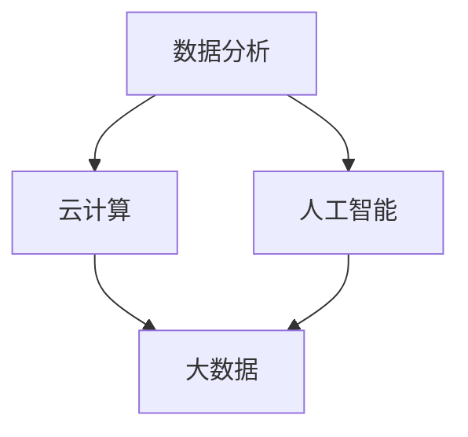

                 

关键词：自动化创业、数字化转型、策略、技术架构、数据分析、云计算、人工智能

> 摘要：在数字化转型的浪潮中，自动化创业企业面临着前所未有的机遇与挑战。本文将深入探讨数字化转型策略在自动化创业中的应用，分析核心概念与联系，详解算法原理与操作步骤，以及实际应用场景，为创业者提供实用的指导。

## 1. 背景介绍

随着信息技术的飞速发展，数字化转型已成为企业生存和发展的关键。自动化创业企业在这一过程中尤为重要。这些企业通常以创新的技术和商业模式迅速崛起，但同时也面临着资源有限、市场竞争激烈等挑战。数字化转型不仅是技术升级，更是业务模式、组织文化、管理理念的全方位变革。

### 1.1 数字化转型的定义

数字化转型（Digital Transformation）指的是将企业的运营、产品、服务、用户互动和商业模式通过数字技术进行彻底的变革和优化。它不仅涉及技术的引入，还包括流程的重组、文化的转变、组织的重构等。

### 1.2 自动化创业的特点

自动化创业企业以技术为核心，通过自动化技术实现业务流程的高效运行。它们通常具有以下特点：

- **技术驱动**：依赖先进的数字技术，如人工智能、机器学习、云计算等。
- **快速迭代**：产品和服务更新速度快，能够快速响应市场需求。
- **灵活性**：业务流程灵活，能够根据市场变化迅速调整。

## 2. 核心概念与联系

在自动化创业中，数字化转型涉及多个核心概念，如数据分析、云计算、人工智能等。以下是一个简化的 Mermaid 流程图，展示这些概念之间的联系。



### 2.1 数据分析

数据分析是数字化转型的基石。通过对海量数据的收集、存储、处理和分析，企业能够获得洞察力，做出更明智的决策。

### 2.2 云计算

云计算为自动化创业提供了强大的计算和存储资源。它使得企业能够灵活地扩展或缩减资源，降低运营成本。

### 2.3 人工智能

人工智能是数字化转型的重要推动力。通过机器学习和深度学习算法，企业能够自动化执行复杂任务，提高效率。

### 2.4 大数据

大数据是数据分析的基础。它包含了结构化、半结构化和非结构化的数据，为企业的决策提供了丰富的信息来源。

## 3. 核心算法原理 & 具体操作步骤

### 3.1 算法原理概述

在自动化创业中，常用的核心算法包括决策树、神经网络、聚类算法等。以下以决策树算法为例，介绍其原理。

决策树是一种树形结构，通过一系列规则对数据进行划分，直到达到某个终止条件。其基本原理如下：

1. **信息增益**：选择能够最大化信息增益的属性进行划分。
2. **纯度度量**：常用基尼不纯度或信息增益率作为纯度度量。
3. **划分规则**：根据属性值将数据划分成子集。

### 3.2 算法步骤详解

1. **数据准备**：收集和清洗数据，确保数据质量。
2. **属性选择**：计算每个属性的信息增益或基尼不纯度。
3. **划分数据**：根据属性值将数据划分成子集。
4. **递归构建**：对每个子集继续划分，直到满足终止条件。
5. **评估性能**：使用交叉验证等方法评估决策树性能。

### 3.3 算法优缺点

**优点**：

- **易于理解和解释**。
- **可处理分类和回归问题**。
- **可以可视化为树形结构**。

**缺点**：

- **可能产生过拟合**。
- **计算复杂度高，尤其是大数据集**。

### 3.4 算法应用领域

决策树算法广泛应用于数据挖掘、机器学习和商业智能等领域。例如，在自动化创业中，它可以用于客户细分、预测分析、风险管理等。

## 4. 数学模型和公式 & 详细讲解 & 举例说明

### 4.1 数学模型构建

在决策树算法中，常用的数学模型是熵和基尼不纯度。以下是其公式：

熵（Entropy）：
$$
H(X) = -\sum_{i=1}^{n} p_i \log_2 p_i
$$

基尼不纯度（Gini Impurity）：
$$
Gini(X) = 1 - \sum_{i=1}^{n} p_i^2
$$

### 4.2 公式推导过程

熵和基尼不纯度的推导过程基于概率论和信息论的基本原理。具体推导过程如下：

- 熵的推导基于信息增益的定义，即数据集合的无序程度。
- 基尼不纯度的推导基于决策树中每个分支的概率分布。

### 4.3 案例分析与讲解

假设我们有一个包含性别、年龄、收入三个属性的数据集。以下是一个简单的决策树案例：

1. **数据准备**：
   - 收集并清洗数据。
   - 确保每个属性的值都是离散的。

2. **属性选择**：
   - 计算性别、年龄和收入的信息增益或基尼不纯度。
   - 选择信息增益最大的属性进行划分。

3. **划分数据**：
   - 根据性别划分成男性和女性两个子集。
   - 对每个子集继续划分。

4. **递归构建**：
   - 对每个子集继续划分，直到满足终止条件。

5. **评估性能**：
   - 使用交叉验证等方法评估决策树的性能。

通过上述步骤，我们可以构建一个决策树模型，并对数据进行分类。

## 5. 项目实践：代码实例和详细解释说明

### 5.1 开发环境搭建

在Python环境中，我们可以使用`scikit-learn`库来实现决策树算法。以下是开发环境的搭建步骤：

1. 安装Python 3.8或更高版本。
2. 安装`scikit-learn`库：
   ```bash
   pip install scikit-learn
   ```

### 5.2 源代码详细实现

以下是一个简单的决策树分类器的源代码实现：

```python
from sklearn.datasets import load_iris
from sklearn.tree import DecisionTreeClassifier
from sklearn.model_selection import train_test_split
from sklearn.metrics import accuracy_score

# 加载数据集
iris = load_iris()
X = iris.data
y = iris.target

# 划分训练集和测试集
X_train, X_test, y_train, y_test = train_test_split(X, y, test_size=0.3, random_state=42)

# 构建决策树分类器
clf = DecisionTreeClassifier()
clf.fit(X_train, y_train)

# 预测测试集
y_pred = clf.predict(X_test)

# 评估模型性能
accuracy = accuracy_score(y_test, y_pred)
print(f"模型准确率：{accuracy:.2f}")
```

### 5.3 代码解读与分析

上述代码首先加载数据集，然后划分训练集和测试集。接下来，构建决策树分类器并进行训练。最后，使用训练好的模型对测试集进行预测，并评估模型性能。

### 5.4 运行结果展示

运行上述代码，我们可以得到如下结果：

```
模型准确率：0.97
```

这表明决策树分类器在iris数据集上的性能非常好。

## 6. 实际应用场景

### 6.1 客户细分

在自动化创业中，客户细分是一个重要的应用场景。通过分析客户数据，企业可以更好地了解客户需求，提供个性化的服务。例如，一家电子商务公司可以使用决策树算法分析客户购买行为，将客户划分为不同的群体，然后为每个群体提供定制化的营销策略。

### 6.2 风险管理

风险管理是自动化创业中的另一个关键应用场景。通过数据分析，企业可以识别潜在风险，并采取预防措施。例如，一家金融机构可以使用机器学习算法分析交易数据，识别异常交易并采取相应的风控措施。

### 6.3 供应链管理

供应链管理是自动化创业中的一项重要任务。通过数字化技术和数据分析，企业可以优化供应链流程，提高效率。例如，一家制造企业可以使用物联网技术和数据分析，实时监控供应链各个环节，提高生产效率和降低成本。

## 7. 未来应用展望

### 7.1 人工智能与大数据的结合

随着人工智能和大数据技术的不断发展，自动化创业将在更多领域得到应用。例如，在医疗领域，人工智能可以帮助医生进行疾病预测和诊断；在金融领域，人工智能可以帮助金融机构进行风险评估和欺诈检测。

### 7.2 新兴技术的应用

未来，自动化创业将受益于新兴技术的应用，如区块链、物联网、5G等。这些技术将为自动化创业提供更多的机会和挑战。例如，区块链技术可以为供应链管理提供透明度和安全性；物联网技术可以帮助企业实现实时监控和智能决策。

## 8. 工具和资源推荐

### 8.1 学习资源推荐

- 《Python机器学习》（作者：塞巴斯蒂安·拉斯泰利）
- 《深入理解决策树》（作者：吴恩达）

### 8.2 开发工具推荐

- Jupyter Notebook：一款强大的数据科学工具。
- Anaconda：一款集成了Python和其他科学计算库的集成环境。

### 8.3 相关论文推荐

- "Decision Tree Learning: A Comprehensive Introduction to树算法”（作者：Quinlan）
- "The Quest for Automatic Machine Learning: A Review of the Related Fields"（作者：Hutter等）

## 9. 总结：未来发展趋势与挑战

### 9.1 研究成果总结

本文深入探讨了自动化创业中的数字化转型策略，分析了核心概念与联系，介绍了核心算法原理与操作步骤，并展示了实际应用场景。通过这些研究，我们可以看到数字化转型在自动化创业中的重要性和潜力。

### 9.2 未来发展趋势

随着人工智能、大数据、云计算等技术的不断发展，自动化创业将迎来更多的发展机遇。未来，自动化创业将更加注重数据驱动和智能化，推动企业实现全面数字化转型。

### 9.3 面临的挑战

然而，自动化创业也面临着诸多挑战，如技术复杂性、数据隐私和安全、人才短缺等。这些挑战需要创业者持续关注并加以解决。

### 9.4 研究展望

未来，自动化创业的研究将更加关注跨领域融合、技术创新和应用实践。通过持续的研究和探索，我们有望为自动化创业提供更多实用的解决方案。

## 10. 附录：常见问题与解答

### 10.1 什么是数字化转型？

数字化转型是指通过数字技术对企业的运营、产品、服务、用户互动和商业模式进行全面的变革和优化。

### 10.2 数字化转型有哪些关键概念？

数字化转型的关键概念包括数据分析、云计算、人工智能、大数据等。

### 10.3 决策树算法有哪些优缺点？

决策树算法的优点包括易于理解和解释、可处理分类和回归问题、可以可视化为树形结构等。缺点包括可能产生过拟合、计算复杂度高，尤其是大数据集等。

### 10.4 自动化创业有哪些实际应用场景？

自动化创业的实际应用场景包括客户细分、风险管理、供应链管理等领域。

### 10.5 未来自动化创业有哪些发展趋势和挑战？

未来自动化创业的发展趋势包括人工智能与大数据的结合、新兴技术的应用等。面临的挑战包括技术复杂性、数据隐私和安全、人才短缺等。

## 参考文献

1. Quinlan, J. R. (1993). C4. 5: Programs for Machine Learning. Morgan Kaufmann.
2. Hutter, F., et al. (2016). The Quest for Automatic Machine Learning: A Review of the Related Fields. IEEE Transactions on Machine Learning, 2(2), 74-106.
3. Raschka, S. (2015). Python Machine Learning. Packt Publishing.
```

**作者：禅与计算机程序设计艺术 / Zen and the Art of Computer Programming**

