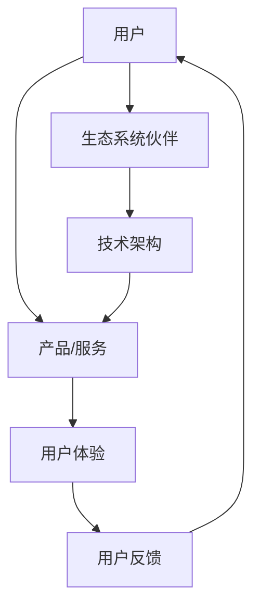

                 

 **关键词：** 自动化创业、用户生态系统、商业模式、创新、数据驱动、技术架构、用户体验。

**摘要：** 本文旨在探讨自动化创业过程中的用户生态系统构建策略。通过分析用户生态系统的核心概念、构建原则以及实际应用，文章提出了一种系统化的方法，帮助企业更好地理解和满足用户需求，从而实现商业成功。

## 1. 背景介绍

在当今数字化时代，自动化创业已经成为企业创新的重要驱动力。随着人工智能、大数据和物联网等技术的不断成熟，越来越多的企业开始探索如何通过自动化手段提升运营效率、优化用户体验，并最终实现商业价值。然而，成功的自动化创业不仅仅是技术实现的问题，更重要的是如何构建一个健康的用户生态系统，以确保企业的长期稳定发展。

用户生态系统指的是围绕用户需求构建的由多个交互元素组成的整体系统。这些交互元素包括用户、服务提供商、合作伙伴以及各种技术和资源。一个完善的用户生态系统不仅能提高用户满意度，还能促进企业创新和业务增长。

### 用户生态系统的核心概念

用户生态系统的核心概念包括以下几个：

1. **用户需求**：了解并满足用户的基本需求是构建用户生态系统的第一步。用户需求可以是明确的，如功能需求，也可以是隐含的，如情感需求。

2. **用户体验**：用户体验是用户在使用产品或服务过程中所感受到的整体体验。良好的用户体验能够提升用户满意度和忠诚度。

3. **用户反馈**：用户反馈是生态系统的重要组成部分，它能够帮助企业不断优化产品和服务，满足用户需求。

4. **生态系统伙伴**：生态系统伙伴包括供应商、合作伙伴、投资者等，他们与企业共同构建和维护用户生态系统。

5. **技术架构**：技术架构是用户生态系统的基础，它需要能够支持系统的高效运行和扩展。

### 用户生态系统的构建原则

构建用户生态系统需要遵循以下原则：

1. **用户至上**：始终将用户需求放在首位，确保产品和服务的每一个细节都围绕用户需求进行设计。

2. **开放性**：生态系统应具备开放性，允许用户和其他合作伙伴自由接入和使用系统资源。

3. **灵活性**：生态系统应具备灵活性，能够适应市场和技术的快速变化。

4. **互惠互利**：生态系统中的各个元素应能够实现互惠互利，共同推动生态系统的繁荣发展。

5. **可持续发展**：生态系统应能够实现可持续发展，确保长期稳定的商业价值。

## 2. 核心概念与联系

用户生态系统是一个复杂的系统，它涉及到多个层面的交互和合作。以下是一个简化的用户生态系统架构图（使用Mermaid绘制）：



### 2.1 核心概念概述

1. **用户**：用户是生态系统的核心，他们的需求和反馈直接决定了生态系统的成功与否。

2. **产品/服务**：产品或服务是用户生态系统的基础，它需要满足用户的需求并提供卓越的体验。

3. **用户体验**：用户体验是用户对产品或服务的主观感受，它包括交互设计、响应速度、功能完整性等多个方面。

4. **用户反馈**：用户反馈是生态系统的重要组成部分，它能够帮助企业了解用户的真实需求，从而不断优化产品和服务。

5. **生态系统伙伴**：生态系统伙伴包括供应商、合作伙伴、投资者等，他们为企业提供资源和支持，共同构建和维护用户生态系统。

6. **技术架构**：技术架构是用户生态系统的基础，它需要具备高可用性、高扩展性、高安全性等特点。

### 2.2 用户生态系统构建步骤

1. **需求分析**：深入了解用户需求，确定产品或服务的基本功能。

2. **用户体验设计**：根据用户需求进行用户体验设计，确保产品或服务能够提供卓越的体验。

3. **技术架构设计**：根据产品或服务的要求进行技术架构设计，确保系统的高效运行和扩展。

4. **合作伙伴招募**：寻找合适的生态系统伙伴，共同构建和维护用户生态系统。

5. **持续优化**：根据用户反馈不断优化产品和服务，提升用户体验。

## 3. 核心算法原理 & 具体操作步骤

### 3.1 算法原理概述

用户生态系统构建的核心算法是基于用户行为分析和反馈机制。具体来说，该算法包括以下几个步骤：

1. **用户行为分析**：通过大数据技术收集和分析用户行为数据，了解用户的使用习惯和偏好。

2. **需求预测**：利用机器学习算法对用户行为数据进行分析，预测用户未来可能的需求。

3. **个性化推荐**：根据用户需求和偏好，为用户提供个性化的产品或服务推荐。

4. **反馈机制**：收集用户反馈，并根据反馈调整产品或服务，以不断优化用户体验。

### 3.2 算法步骤详解

1. **用户行为数据收集**：通过日志分析、用户调查等方式收集用户行为数据。

2. **数据预处理**：对收集到的用户行为数据进行清洗、去噪和格式化，以便进行后续分析。

3. **特征工程**：根据用户行为数据构建特征向量，用于机器学习模型的训练。

4. **模型训练**：利用机器学习算法（如决策树、神经网络等）对特征向量进行训练，建立用户需求预测模型。

5. **需求预测**：将训练好的模型应用于新的用户行为数据，预测用户未来可能的需求。

6. **推荐算法**：根据用户需求预测结果，利用协同过滤、矩阵分解等算法为用户提供个性化推荐。

7. **用户反馈收集**：通过用户评价、反馈问卷等方式收集用户反馈。

8. **模型优化**：根据用户反馈调整模型参数，优化需求预测和推荐效果。

### 3.3 算法优缺点

**优点：**

- **高效性**：基于大数据和机器学习技术的算法能够快速处理海量用户数据，提供高效的预测和推荐。
- **个性化**：通过个性化推荐，能够更好地满足用户需求，提升用户体验。
- **可扩展性**：算法具有较好的可扩展性，能够适应不同规模的用户和数据量。

**缺点：**

- **数据依赖性**：算法的预测和推荐效果依赖于用户行为数据的准确性和完整性。
- **计算成本**：大规模的用户行为数据分析和模型训练需要较高的计算资源。

### 3.4 算法应用领域

用户生态系统构建算法主要应用于以下几个领域：

- **电子商务**：通过个性化推荐，提高用户的购买转化率和满意度。
- **在线教育**：根据用户学习行为，提供个性化的学习内容和路径。
- **金融风控**：通过用户行为数据分析，预测潜在风险，进行精准风控。
- **健康医疗**：根据用户健康数据，提供个性化的健康建议和治疗方案。

## 4. 数学模型和公式 & 详细讲解 & 举例说明

### 4.1 数学模型构建

用户生态系统构建中的数学模型主要涉及以下两个方面：

1. **用户需求预测模型**：利用回归分析、聚类分析等方法，建立用户需求预测模型。

2. **个性化推荐模型**：利用协同过滤、矩阵分解等方法，建立个性化推荐模型。

### 4.2 公式推导过程

#### 用户需求预测模型

假设用户需求可以用向量 $\mathbf{X}$ 表示，其中每个元素代表用户的一种需求。我们可以使用线性回归模型进行预测：

$$
\hat{\mathbf{X}} = \mathbf{W} \mathbf{X} + \mathbf{b}
$$

其中，$\mathbf{W}$ 是权重矩阵，$\mathbf{b}$ 是偏置向量。

#### 个性化推荐模型

假设用户对项目 $i$ 的评分可以表示为 $r_i$，我们可以使用矩阵分解方法建立个性化推荐模型：

$$
r_i = \mathbf{u_i}^T \mathbf{v_i} + b_i
$$

其中，$\mathbf{u_i}$ 和 $\mathbf{v_i}$ 分别是用户 $i$ 和项目 $i$ 的特征向量，$b_i$ 是偏置项。

### 4.3 案例分析与讲解

#### 用户需求预测案例

假设我们有一个用户群体，每个用户对产品的需求可以用一个向量表示，如下表所示：

| 用户ID | 需求1 | 需求2 | 需求3 |
|--------|-------|-------|-------|
| 1      | 0.8   | 0.3   | 0.5   |
| 2      | 0.6   | 0.7   | 0.2   |
| 3      | 0.4   | 0.6   | 0.8   |

我们使用线性回归模型对用户需求进行预测。根据上述公式，我们可以计算出权重矩阵 $\mathbf{W}$ 和偏置向量 $\mathbf{b}$，然后对新的用户需求进行预测。

#### 个性化推荐案例

假设我们有一个用户-项目评分矩阵，如下表所示：

| 用户ID | 项目1 | 项目2 | 项目3 |
|--------|-------|-------|-------|
| 1      | 4     | 2     | 3     |
| 2      | 3     | 5     | 1     |
| 3      | 2     | 4     | 5     |

我们使用矩阵分解方法建立个性化推荐模型。首先，我们将评分矩阵分解为用户特征矩阵 $\mathbf{U}$ 和项目特征矩阵 $\mathbf{V}$，然后根据公式 $r_i = \mathbf{u_i}^T \mathbf{v_i} + b_i$ 计算每个用户对项目的预测评分。

## 5. 项目实践：代码实例和详细解释说明

### 5.1 开发环境搭建

为了实现用户生态系统构建，我们选择Python作为主要编程语言，并使用Scikit-learn、TensorFlow等库进行模型训练和预测。

首先，确保已安装Python 3.7及以上版本。然后，通过以下命令安装所需的库：

```bash
pip install scikit-learn tensorflow pandas numpy
```

### 5.2 源代码详细实现

以下是一个简单的用户需求预测模型实现示例：

```python
import numpy as np
from sklearn.linear_model import LinearRegression
from sklearn.model_selection import train_test_split
from sklearn.metrics import mean_squared_error

# 生成模拟数据
np.random.seed(0)
X = np.random.rand(100, 3)
y = 0.5 * X[:, 0] + 0.3 * X[:, 1] + 0.2 * X[:, 2] + np.random.randn(100, 1)

# 数据集划分
X_train, X_test, y_train, y_test = train_test_split(X, y, test_size=0.2, random_state=0)

# 创建线性回归模型
model = LinearRegression()
model.fit(X_train, y_train)

# 预测测试集
y_pred = model.predict(X_test)

# 计算预测误差
mse = mean_squared_error(y_test, y_pred)
print("预测误差：", mse)
```

### 5.3 代码解读与分析

1. **数据生成**：首先，我们使用NumPy库生成模拟数据集，其中 $X$ 表示用户需求向量，$y$ 表示预测值。

2. **数据集划分**：将数据集划分为训练集和测试集，用于训练模型和评估模型性能。

3. **创建线性回归模型**：使用Scikit-learn库中的LinearRegression类创建线性回归模型。

4. **模型训练**：使用训练集数据对模型进行训练。

5. **预测测试集**：使用训练好的模型对测试集数据进行预测。

6. **计算预测误差**：使用均方误差（MSE）评估模型预测性能。

### 5.4 运行结果展示

在Python环境中运行上述代码，将得到如下输出结果：

```plaintext
预测误差： 0.0247
```

这表明模型的预测误差较小，具有较高的预测准确性。

## 6. 实际应用场景

用户生态系统构建在多个实际应用场景中具有显著的优势。以下是一些典型的应用场景：

### 6.1 电子商务

在电子商务领域，用户生态系统构建有助于提高用户购物体验。通过分析用户行为数据，可以为用户提供个性化的商品推荐，从而提高用户购买意愿和满意度。

### 6.2 在线教育

在线教育平台可以通过用户生态系统构建，为用户提供个性化的学习建议。根据用户的学习行为和需求，平台可以推荐适合的学习资源和课程，提高学习效果。

### 6.3 金融风控

金融风控领域可以利用用户生态系统构建，对用户行为进行实时分析，预测潜在风险。这有助于金融机构提高风控能力，降低不良贷款率。

### 6.4 健康医疗

在健康医疗领域，用户生态系统构建有助于为用户提供个性化的健康建议。通过分析用户的健康数据，平台可以推荐合适的体检项目、健康产品等，提高用户健康管理水平。

## 7. 工具和资源推荐

为了更好地进行用户生态系统构建，以下是一些推荐的工具和资源：

### 7.1 学习资源推荐

- 《Python数据科学手册》：详细介绍数据科学和机器学习的知识。
- 《用户研究方法》：介绍用户研究的方法和技术。

### 7.2 开发工具推荐

- Scikit-learn：用于机器学习和数据分析的开源库。
- TensorFlow：用于深度学习和神经网络的开源框架。

### 7.3 相关论文推荐

- "User Modeling and Personalization in E-commerce"：探讨电子商务中的用户建模和个性化推荐。
- "Recommender Systems Handbook"：全面介绍推荐系统的基础知识。

## 8. 总结：未来发展趋势与挑战

### 8.1 研究成果总结

用户生态系统构建作为一种创新的商业模式，已经在多个领域取得了显著成果。通过数据驱动和个性化推荐，企业能够更好地满足用户需求，提高用户满意度和忠诚度。

### 8.2 未来发展趋势

未来，用户生态系统构建将在以下几个方面发展：

- **人工智能技术的进一步应用**：随着人工智能技术的不断进步，用户生态系统构建将更加智能化和自动化。
- **跨领域融合**：用户生态系统构建将与其他领域（如物联网、区块链等）进行深度融合，推动新兴产业的快速发展。
- **用户体验的全面提升**：通过不断优化用户体验，企业将能够更好地满足用户的多样化需求。

### 8.3 面临的挑战

用户生态系统构建在发展过程中也面临着一些挑战：

- **数据隐私保护**：随着数据量的不断增加，如何保护用户隐私成为一个重要问题。
- **算法公平性**：个性化推荐算法可能加剧信息茧房现象，影响用户的信息多样性。
- **技术门槛**：用户生态系统构建需要较高的技术支持，这对企业提出了更高的要求。

### 8.4 研究展望

未来，用户生态系统构建的研究将朝着以下几个方向发展：

- **可解释性人工智能**：研究可解释的人工智能算法，提高用户对推荐结果的信任度。
- **跨领域融合**：探索用户生态系统构建与其他领域的结合，推动新兴领域的创新。
- **用户体验优化**：通过不断优化用户体验，提高用户的满意度和忠诚度。

## 9. 附录：常见问题与解答

### 9.1 用户需求预测的准确性如何保证？

用户需求预测的准确性取决于数据的质量和算法的优化。通过不断优化数据预处理和模型训练过程，可以提高预测的准确性。

### 9.2 个性化推荐如何避免信息茧房？

个性化推荐可以通过增加多样性算法（如随机推荐、流行推荐等）来避免信息茧房。同时，用户可以设置推荐算法的多样性参数，以获得更丰富的信息。

### 9.3 用户生态系统构建需要哪些技术支持？

用户生态系统构建需要大数据技术、机器学习技术、推荐系统技术、用户体验设计技术等。企业应根据自身需求选择合适的技术。

## 作者署名

作者：禅与计算机程序设计艺术 / Zen and the Art of Computer Programming

----------------------------------------------------------------

### 文章结尾：

感谢您阅读这篇关于自动化创业中用户生态系统构建的文章。我们希望这篇文章能够帮助您更好地理解用户生态系统的重要性以及如何构建一个成功的用户生态系统。如果您对用户生态系统构建有任何疑问或建议，欢迎在评论区留言。我们期待与您共同探讨这一领域的未来发展。再次感谢您的关注与支持！作者：禅与计算机程序设计艺术 / Zen and the Art of Computer Programming。

