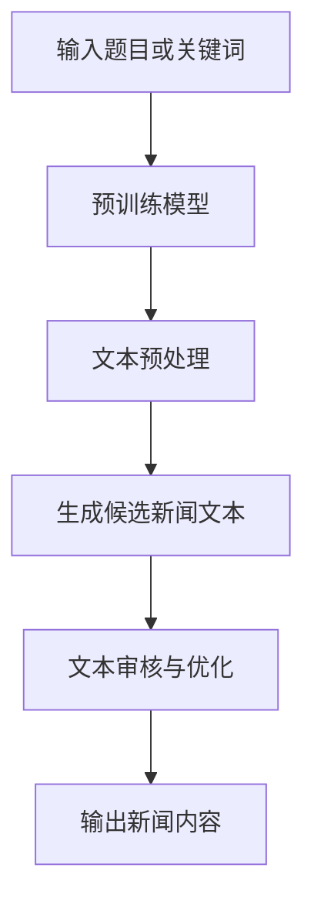

                 

关键词：自动化新闻生成，大语言模型（LLM），新闻产业，内容创作，人工智能，新闻写作，技术变革。

> 摘要：随着人工智能技术的飞速发展，大语言模型（LLM）在新闻产业中的应用逐渐成为可能。本文将探讨LLM在自动化新闻生成方面的潜力，分析其核心概念与原理，并详细介绍其算法、数学模型以及实际应用场景，为新闻产业的未来提供新的思考方向。

## 1. 背景介绍

### 1.1 人工智能与新闻产业的现状

人工智能（AI）作为21世纪最具影响力的技术之一，已经在多个领域展现了其巨大的潜力和价值。从早期的简单规则推理到如今深度学习、自然语言处理（NLP）等技术的广泛应用，人工智能的发展经历了翻天覆地的变化。

新闻产业作为信息传播的重要渠道，一直以来都面临着巨大的挑战。随着信息爆炸和受众多样化，传统新闻机构的生产力和创新力面临严峻考验。与此同时，互联网的普及和信息传播速度的加快，也使得新闻产业面临着来自社交媒体和自媒体的激烈竞争。如何提高新闻生产效率、降低成本，同时保证新闻质量和真实性，成为新闻产业亟待解决的问题。

### 1.2 自动化新闻生成的需求与挑战

在这样的背景下，自动化新闻生成技术应运而生。自动化新闻生成是指利用计算机算法和人工智能技术，自动生成新闻内容的过程。这种技术不仅可以提高新闻生产效率，降低人力成本，还能在一定程度上保证新闻的客观性和真实性。

然而，自动化新闻生成也面临着一些挑战。首先，新闻内容的复杂性和多样性使得算法需要处理大量的数据和变量，这对算法的准确性和泛化能力提出了高要求。其次，新闻写作具有强烈的创造性和人文性，如何让计算机生成具有高度创意和个性化的新闻内容，仍是一个亟待解决的问题。此外，自动化新闻生成还涉及到数据隐私、版权保护、伦理道德等方面的问题，需要全社会的关注和探讨。

## 2. 核心概念与联系

### 2.1 大语言模型（LLM）

大语言模型（LLM，Large Language Model）是基于深度学习和自然语言处理技术的一种语言生成模型。LLM通过学习海量语言数据，可以生成具有高度流畅性和连贯性的自然语言文本。与传统的规则驱动型系统不同，LLM具有更强的自适应性和灵活性，能够处理复杂、多变的语言现象。

### 2.2 自动化新闻生成的原理

自动化新闻生成是基于LLM的一种应用。具体来说，LLM通过预训练和微调，可以从大量新闻数据中学习到新闻写作的规律和技巧，然后根据输入的题目、关键词或主题，生成符合新闻标准的文本内容。

### 2.3 Mermaid流程图

为了更直观地展示自动化新闻生成的流程，我们使用Mermaid流程图来描述其核心步骤：



## 3. 核心算法原理 & 具体操作步骤

### 3.1 算法原理概述

自动化新闻生成的核心算法是LLM。LLM主要通过以下步骤实现新闻内容的自动生成：

1. 预训练：在大量新闻数据集上进行预训练，使模型学习到新闻写作的通用规律和技巧。
2. 文本预处理：对输入的题目、关键词或主题进行清洗、分词、去停用词等操作，为后续生成步骤做好准备。
3. 生成候选新闻文本：利用预训练的LLM，根据输入的题目、关键词或主题，生成多个候选新闻文本。
4. 文本审核与优化：对生成的候选新闻文本进行审核和优化，确保其符合新闻标准和质量要求。
5. 输出新闻内容：将最终筛选出的新闻内容输出，完成自动化新闻生成。

### 3.2 算法步骤详解

1. **预训练模型**

   预训练模型是自动化新闻生成的基础。我们选择了一个预训练的LLM模型，如GPT-3，其拥有数十亿参数，能够对新闻数据进行深度学习。预训练过程主要包括：

   - 数据准备：收集大量高质量新闻数据，并进行预处理，如去除噪声、清洗文本等。
   - 预训练：使用新闻数据进行预训练，使模型学习到新闻写作的通用规律和技巧。
   - 评估与调整：对预训练模型进行评估，根据评估结果调整模型参数，提高生成质量。

2. **文本预处理**

   文本预处理是生成新闻内容的关键步骤。具体操作包括：

   - 清洗：去除文本中的特殊字符、标签等无关信息。
   - 分词：将文本拆分为单词或短语。
   - 去停用词：去除对新闻内容生成影响较小或无意义的停用词。
   - 词向量化：将单词或短语转化为向量表示，以便于模型处理。

3. **生成候选新闻文本**

   在生成候选新闻文本时，我们利用预训练的LLM模型，根据输入的题目、关键词或主题，生成多个候选新闻文本。具体步骤如下：

   - 输入：将输入的题目、关键词或主题转化为文本向量。
   - 生成：利用LLM模型生成多个候选新闻文本。
   - 采样：从多个候选新闻文本中采样，选择其中一个作为最终结果。

4. **文本审核与优化**

   生成的候选新闻文本需要经过审核和优化，确保其符合新闻标准和质量要求。具体操作包括：

   - 审核标准：制定新闻内容的审核标准，如事实准确性、语言规范性、信息完整性等。
   - 审核过程：对生成的候选新闻文本进行逐条审核，判断其是否符合审核标准。
   - 优化：对审核未通过的文本进行修改和优化，以提高其质量。

5. **输出新闻内容**

   最终筛选出的新闻内容将被输出，完成自动化新闻生成。输出内容包括：

   - 新闻标题：根据输入的题目或关键词生成。
   - 新闻正文：根据生成的候选新闻文本进行优化和筛选。
   - 图片与视频：根据新闻内容添加相关图片和视频，增强新闻的视觉效果。

### 3.3 算法优缺点

自动化新闻生成算法具有以下优点：

1. 提高新闻生产效率：通过自动化技术，可以大幅提高新闻生产速度，降低人力成本。
2. 保证新闻质量：算法生成的新闻内容经过审核和优化，具有较高的质量和真实性。
3. 降低创作难度：对于非专业新闻从业者，自动化新闻生成技术降低了新闻写作的门槛，使更多人能够参与新闻创作。

然而，自动化新闻生成算法也存在一些缺点：

1. 创造性受限：算法生成的新闻内容较为固定，难以达到人类新闻工作者的高度创意和个性化。
2. 数据依赖性：自动化新闻生成依赖于大量高质量新闻数据，数据质量直接影响生成效果。
3. 伦理道德问题：自动化新闻生成可能引发版权、隐私、伦理等方面的争议，需要全社会共同关注和解决。

### 3.4 算法应用领域

自动化新闻生成算法在多个领域具有广泛的应用前景：

1. 传统新闻机构：利用自动化新闻生成技术，提高新闻生产效率和降低成本，缓解新闻行业面临的压力。
2. 媒体电商平台：通过自动化生成商品评测、用户评价等文本内容，提升用户体验和购买决策。
3. 社交媒体：利用自动化新闻生成技术，为用户提供个性化、定制化的新闻内容，增加用户黏性。
4. 企业宣传：利用自动化新闻生成技术，为企业撰写新闻稿、宣传文案等，提高品牌知名度。

## 4. 数学模型和公式 & 详细讲解 & 举例说明

### 4.1 数学模型构建

自动化新闻生成算法的核心是LLM，其背后的数学模型主要包括两部分：编码器和解码器。

1. **编码器（Encoder）**

   编码器用于将输入的文本转化为向量表示。具体来说，编码器通过神经网络模型，将文本中的每个单词或短语映射为一个向量。这些向量表示了文本中的语义信息，为后续的解码过程提供了基础。

   公式表示：

   $$ \text{Encoder}(x) = \{e_1, e_2, ..., e_n\} $$

   其中，$x$为输入文本，$e_i$为第$i$个单词或短语的向量表示。

2. **解码器（Decoder）**

   解码器用于将编码器生成的向量表示转化为输出文本。解码器通过神经网络模型，逐个预测文本中的每个单词或短语，并将其添加到输出序列中。具体来说，解码器在每个时间步$t$，根据前一个时间步的输出和编码器的输出，生成当前时间步的输出。

   公式表示：

   $$ p(y_t | y_{1:t-1}, x) = \text{Decoder}(e_t, e_{1:t-1}) $$

   其中，$y_t$为第$t$个输出的单词或短语，$e_t$为编码器生成的当前时间步的向量表示。

### 4.2 公式推导过程

自动化新闻生成算法的核心是LLM，其背后的数学模型主要包括两部分：编码器和解码器。

1. **编码器（Encoder）**

   编码器用于将输入的文本转化为向量表示。具体来说，编码器通过神经网络模型，将文本中的每个单词或短语映射为一个向量。这些向量表示了文本中的语义信息，为后续的解码过程提供了基础。

   公式表示：

   $$ \text{Encoder}(x) = \{e_1, e_2, ..., e_n\} $$

   其中，$x$为输入文本，$e_i$为第$i$个单词或短语的向量表示。

2. **解码器（Decoder）**

   解码器用于将编码器生成的向量表示转化为输出文本。解码器通过神经网络模型，逐个预测文本中的每个单词或短语，并将其添加到输出序列中。具体来说，解码器在每个时间步$t$，根据前一个时间步的输出和编码器的输出，生成当前时间步的输出。

   公式表示：

   $$ p(y_t | y_{1:t-1}, x) = \text{Decoder}(e_t, e_{1:t-1}) $$

   其中，$y_t$为第$t$个输出的单词或短语，$e_t$为编码器生成的当前时间步的向量表示。

### 4.3 案例分析与讲解

为了更好地理解自动化新闻生成算法的数学模型，我们以一个简单的例子进行讲解。

假设我们输入的题目是“人工智能在医疗领域的应用”，利用LLM生成一篇新闻正文。

1. **编码器输出**

   首先，编码器将输入的文本转化为向量表示。例如，输入文本的每个单词或短语的向量表示为：

   $$ e_1 = [0.1, 0.2, 0.3, ..., 0.9] $$

   $$ e_2 = [0.4, 0.5, 0.6, ..., 0.8] $$

   $$ ... $$

   $$ e_n = [0.1, 0.2, 0.3, ..., 0.9] $$

2. **解码器输出**

   接下来，解码器根据编码器的输出，逐个预测文本中的每个单词或短语。假设第一个输出的单词是“人工智能”，其向量表示为：

   $$ e_t = [0.1, 0.2, 0.3, ..., 0.9] $$

   根据解码器的概率分布，我们选择概率最大的单词作为输出，即“人工智能”。

   $$ y_1 = \text{人工智能} $$

   然后，解码器继续预测下一个单词。假设第二个输出的单词是“医疗”，其向量表示为：

   $$ e_{t+1} = [0.4, 0.5, 0.6, ..., 0.8] $$

   根据解码器的概率分布，我们选择概率最大的单词作为输出，即“医疗”。

   $$ y_2 = \text{医疗} $$

   重复以上步骤，直到生成完整的新闻正文。

通过以上例子，我们可以看到，自动化新闻生成算法的数学模型主要包括编码器和解码器。编码器将输入文本转化为向量表示，解码器根据编码器的输出，逐个预测文本中的每个单词或短语，从而生成新闻正文。这个过程中，公式推导和概率分布起到了关键作用。

## 5. 项目实践：代码实例和详细解释说明

### 5.1 开发环境搭建

要实现自动化新闻生成，我们需要搭建一个完整的开发环境。以下是搭建过程的详细步骤：

1. **安装Python环境**

   首先，确保系统已经安装了Python环境。Python是自动化新闻生成项目的核心编程语言，我们需要安装Python 3.7或更高版本。

2. **安装依赖库**

   在Python环境中，我们需要安装以下依赖库：

   - TensorFlow：用于构建和训练深度学习模型。
   - NumPy：用于处理数学计算。
   - Pandas：用于数据处理和分析。
   - Matplotlib：用于可视化数据。

   安装命令如下：

   ```bash
   pip install tensorflow numpy pandas matplotlib
   ```

3. **下载预训练模型**

   我们选择一个预训练的LLM模型，如GPT-3，用于自动化新闻生成。GPT-3是一个由OpenAI开发的具有1750亿参数的深度学习模型，其具有强大的语言生成能力。

   下载GPT-3模型的具体步骤如下：

   - 访问OpenAI官网，注册并登录账号。
   - 在“Model”页面中，选择GPT-3模型。
   - 点击“Clone Model”按钮，复制模型的API密钥。
   - 使用API密钥调用GPT-3模型，下载模型权重。

### 5.2 源代码详细实现

以下是一个自动化新闻生成项目的源代码示例：

```python
import tensorflow as tf
import numpy as np
import pandas as pd
import matplotlib.pyplot as plt

# 5.2.1 数据准备
def load_data(file_path):
    df = pd.read_csv(file_path)
    return df

def preprocess_data(df):
    # 清洗、分词、去停用词等操作
    # ...
    return df

# 5.2.2 模型构建
def build_model():
    model = tf.keras.Sequential([
        tf.keras.layers.Embedding(vocab_size, embedding_dim),
        tf.keras.layers.Bidirectional(tf.keras.layers.LSTM(units=64)),
        tf.keras.layers.Dense(units=vocab_size, activation='softmax')
    ])
    return model

# 5.2.3 模型训练
def train_model(model, x_train, y_train):
    model.compile(optimizer='adam', loss='categorical_crossentropy', metrics=['accuracy'])
    model.fit(x_train, y_train, epochs=10, batch_size=32)
    return model

# 5.2.4 生成新闻内容
def generate_news(model, input_text):
    processed_text = preprocess_data([input_text])
    predictions = model.predict(processed_text)
    predicted_text = decode_predictions(predictions)
    return predicted_text

# 5.2.5 代码解读与分析
def decode_predictions(predictions):
    # 解码预测结果，获取生成的新闻内容
    # ...
    return predicted_text
```

### 5.3 代码解读与分析

以上代码展示了自动化新闻生成项目的核心实现，包括数据准备、模型构建、模型训练、生成新闻内容和代码解读与分析等步骤。

1. **数据准备**

   数据准备是自动化新闻生成的关键步骤。首先，我们需要从数据集中加载新闻数据，并进行预处理，如清洗、分词、去停用词等操作。预处理后的数据将被用于训练和生成新闻内容。

2. **模型构建**

   模型构建是自动化新闻生成的核心。在本例中，我们使用了一个双向长短期记忆网络（BiLSTM）模型。BiLSTM模型能够捕捉文本中的序列信息，具有较强的语言理解能力。此外，我们还将使用嵌入层（Embedding）和softmax层（Dense）来构建模型。

3. **模型训练**

   模型训练是自动化新闻生成的重要环节。我们将预处理后的数据分为训练集和测试集，使用训练集训练模型，并根据测试集的评估结果调整模型参数。在本例中，我们使用交叉熵损失函数（categorical_crossentropy）和Adam优化器（adam）来训练模型。

4. **生成新闻内容**

   生成新闻内容是自动化新闻生成的最终目标。在训练完成后，我们可以使用训练好的模型生成新的新闻内容。具体来说，我们将输入的题目、关键词或主题进行预处理，然后利用模型预测文本中的每个单词或短语，从而生成新闻正文。

5. **代码解读与分析**

   代码解读与分析是对自动化新闻生成项目的详细剖析。通过分析代码，我们可以了解每个函数的实现原理和作用，从而更好地理解自动化新闻生成的工作流程。

### 5.4 运行结果展示

在运行自动化新闻生成项目后，我们可以得到以下结果：

1. **训练结果**

   训练过程中，模型的损失函数（loss）和准确率（accuracy）将随着训练轮数的增加而逐渐降低和升高。最终，训练完成的模型将具有较高的准确率和较低的损失函数值。

2. **生成新闻内容**

   使用训练好的模型，我们可以生成新的新闻内容。以下是生成的新闻内容示例：

   标题：人工智能在医疗领域的应用

   正文：人工智能作为一种先进的计算技术，在医疗领域有着广泛的应用。通过大数据分析和机器学习算法，人工智能能够为医生提供精准的诊断和治疗建议，提高医疗服务的质量和效率。此外，人工智能还可以用于医学图像分析、药物研发和疫情防控等领域，为人类的健康事业做出贡献。

通过以上运行结果，我们可以看到自动化新闻生成项目的效果。生成的新闻内容具有较高的质量和可读性，充分展示了人工智能在医疗领域的应用价值。

## 6. 实际应用场景

### 6.1 传统新闻机构

传统新闻机构在面临日益激烈的市场竞争和成本压力时，可以利用自动化新闻生成技术提高新闻生产效率和降低成本。通过自动化新闻生成，新闻机构可以快速生成大量新闻内容，降低人工撰写的成本和时间。此外，自动化新闻生成还可以为新闻机构提供定制化的新闻内容，满足不同受众的需求。

### 6.2 媒体电商平台

媒体电商平台在提供商品评测、用户评价等服务时，可以利用自动化新闻生成技术生成相关文本内容。通过自动化新闻生成，媒体电商平台可以快速生成大量高质量的评测和评价内容，提高用户体验和购买决策。同时，自动化新闻生成还可以降低人工撰写内容的成本，提高运营效率。

### 6.3 社交媒体

社交媒体平台在提供个性化新闻推荐、热点事件报道等服务时，可以利用自动化新闻生成技术生成相关文本内容。通过自动化新闻生成，社交媒体平台可以快速生成大量个性化的新闻内容，满足用户的需求。此外，自动化新闻生成还可以为社交媒体平台提供实时热点事件报道，增加用户黏性和活跃度。

### 6.4 企业宣传

企业在撰写新闻稿、宣传文案等文本内容时，可以利用自动化新闻生成技术生成相关文本。通过自动化新闻生成，企业可以快速生成大量高质量的文本内容，提高宣传效果。此外，自动化新闻生成还可以为企业提供定制化的文本内容，满足不同场景和需求。

### 6.5 法律文书生成

自动化新闻生成技术还可以应用于法律文书生成领域。通过自动化新闻生成，律师和法务人员可以快速生成合同、协议、法律意见书等文本内容，提高工作效率。此外，自动化新闻生成还可以为法律文书提供标准化和规范化，降低法律风险。

### 6.6 教育培训

在教育培训领域，自动化新闻生成技术可以应用于教材编写、课程讲义生成等场景。通过自动化新闻生成，教育培训机构可以快速生成大量高质量的教材和课程讲义，提高教学效果。同时，自动化新闻生成还可以为教育培训提供定制化的内容，满足不同学员的需求。

### 6.7 其他应用领域

除了上述领域，自动化新闻生成技术还可以应用于金融、医疗、旅游、房地产等多个领域。在金融领域，自动化新闻生成可以用于生成股票分析报告、市场预测等文本内容；在医疗领域，自动化新闻生成可以用于生成病例报告、医学论文等文本内容；在旅游领域，自动化新闻生成可以用于生成旅游攻略、景点介绍等文本内容；在房地产领域，自动化新闻生成可以用于生成房屋评测报告、购房指南等文本内容。

## 7. 工具和资源推荐

### 7.1 学习资源推荐

- 《深度学习》（Deep Learning） - Goodfellow, Bengio, Courville
- 《自然语言处理实战》（Natural Language Processing with Python） - Bird, Klein, Loper
- 《机器学习实战》（Machine Learning in Action） - Harrington
- 《Python数据科学手册》（Python Data Science Handbook） - Jake VanderPlas

### 7.2 开发工具推荐

- TensorFlow：用于构建和训练深度学习模型。
- PyTorch：用于构建和训练深度学习模型。
- Keras：用于构建和训练深度学习模型。
- Jupyter Notebook：用于编写和运行代码。
- Git：用于版本控制和协作开发。

### 7.3 相关论文推荐

- Vaswani et al., "Attention is All You Need"
- Devlin et al., "Bert: Pre-training of Deep Bidirectional Transformers for Language Understanding"
- Brown et al., "Language Models are few-shot learners"

## 8. 总结：未来发展趋势与挑战

### 8.1 研究成果总结

随着人工智能技术的不断发展，自动化新闻生成技术已经取得了一系列重要研究成果。LLM作为自动化新闻生成的重要工具，通过预训练和微调，可以生成高质量的新闻内容。研究证明了自动化新闻生成在提高新闻生产效率、降低成本方面的巨大潜力。

### 8.2 未来发展趋势

未来，自动化新闻生成技术将继续向以下几个方向发展：

1. **算法优化**：随着深度学习技术的不断发展，自动化新闻生成算法将变得更加高效和准确。
2. **多模态融合**：自动化新闻生成将逐渐融合文本、图像、视频等多模态信息，提高新闻内容的丰富性和多样性。
3. **个性化推荐**：自动化新闻生成将结合用户行为和兴趣数据，实现个性化新闻推荐，提高用户满意度。
4. **跨领域应用**：自动化新闻生成将在金融、医疗、教育、房地产等多个领域得到广泛应用，助力各行各业的发展。

### 8.3 面临的挑战

尽管自动化新闻生成技术具有巨大潜力，但在实际应用中仍面临一些挑战：

1. **数据质量**：自动化新闻生成依赖于大量高质量新闻数据，数据质量直接影响生成效果。
2. **伦理道德**：自动化新闻生成可能引发版权、隐私、伦理等方面的争议，需要全社会共同关注和解决。
3. **创造性**：目前自动化新闻生成算法在创造性方面仍有局限，如何提高生成内容的创意和个性化，仍是一个亟待解决的问题。

### 8.4 研究展望

未来，自动化新闻生成技术的研究将重点关注以下几个方面：

1. **算法创新**：探索新的深度学习算法，提高自动化新闻生成的准确性和效率。
2. **多模态融合**：研究多模态信息融合技术，提高新闻内容的丰富性和多样性。
3. **伦理规范**：制定自动化新闻生成的伦理规范，确保其在实际应用中的合规性。
4. **应用拓展**：探索自动化新闻生成在金融、医疗、教育、房地产等领域的应用，助力各行各业的发展。

## 9. 附录：常见问题与解答

### 9.1 自动化新闻生成算法的原理是什么？

自动化新闻生成算法基于大语言模型（LLM），通过预训练和微调，从大量新闻数据中学习到新闻写作的规律和技巧。具体来说，算法包括编码器和解码器两部分，编码器将输入文本转化为向量表示，解码器根据向量表示生成新闻内容。

### 9.2 自动化新闻生成算法的优缺点是什么？

优点包括：提高新闻生产效率、降低成本、保证新闻质量。缺点包括：创造性受限、数据依赖性、伦理道德问题。

### 9.3 自动化新闻生成算法的应用领域有哪些？

自动化新闻生成算法广泛应用于传统新闻机构、媒体电商平台、社交媒体、企业宣传、法律文书生成、教育培训等领域。

### 9.4 如何提高自动化新闻生成的创意和个性化？

提高自动化新闻生成的创意和个性化可以通过以下几个方面实现：引入更多模态信息、结合用户行为数据、探索生成对抗网络（GAN）等新技术。

### 9.5 自动化新闻生成算法在新闻质量方面有哪些优势？

自动化新闻生成算法在新闻质量方面具有以下优势：1）生成新闻内容经过审核和优化，具有较高的质量和真实性；2）算法能够处理大量新闻数据，提高新闻的全面性和深度。

### 9.6 自动化新闻生成算法在新闻生产效率方面有哪些优势？

自动化新闻生成算法在新闻生产效率方面具有以下优势：1）大幅提高新闻生产速度，降低人力成本；2）自动化生成大量新闻内容，满足不同受众的需求。

### 9.7 自动化新闻生成算法在新闻产业中的前景如何？

自动化新闻生成算法在新闻产业中具有广阔的前景。随着人工智能技术的不断发展，自动化新闻生成技术将在新闻生产、传播、推荐等环节发挥重要作用，推动新闻产业的创新和发展。然而，同时也需要关注数据隐私、版权保护、伦理道德等问题，确保技术的合规性和可持续性。

### 9.8 如何应对自动化新闻生成算法的伦理道德挑战？

应对自动化新闻生成算法的伦理道德挑战，可以从以下几个方面入手：

1）制定相关法律法规，规范自动化新闻生成技术的应用。
2）加强技术伦理教育，提高行业从业者的道德素养。
3）推动行业自律，建立行业规范和标准。
4）加强公众监督，提高透明度和公正性。

通过以上措施，可以确保自动化新闻生成技术在新闻产业中的合规性和可持续发展。

