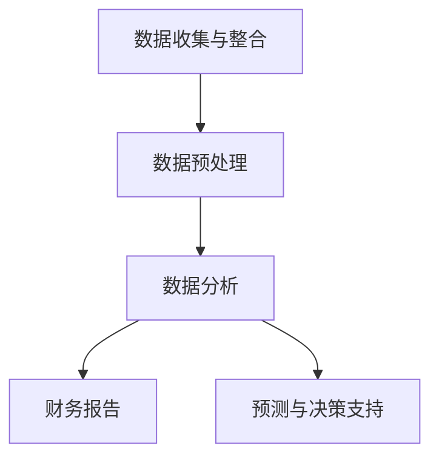

                 

关键词：自动化财务管理、创业者、人工智能、金融科技、算法优化、财务模型、金融分析、财务预测、风险管理

> 摘要：随着金融科技（FinTech）的迅猛发展，自动化财务管理成为现代创业者的强大工具。本文将深入探讨自动化财务管理的重要性、核心概念、算法原理、数学模型、实际应用，以及未来趋势和挑战，帮助创业者更好地掌握财务管理技巧，实现财务自由。

## 1. 背景介绍

在全球经济日益复杂的背景下，创业者面临着前所未有的挑战和机遇。财务管理的有效性直接关系到企业的生存与发展。传统财务管理方法依赖于人工处理大量数据，耗时耗力且容易出错。而自动化财务管理通过利用人工智能和金融科技，能够显著提高财务管理效率、准确性和前瞻性。

自动化财务管理不仅为企业提供了实时的财务数据监控，还能够通过大数据分析和机器学习预测未来的财务状况。这使得创业者能够提前做出决策，规避潜在风险，抓住市场机会。本文将详细探讨自动化财务管理在创业领域的应用，旨在为创业者提供实用的财务管理指南。

## 2. 核心概念与联系

### 2.1 自动化财务管理概述

自动化财务管理是指通过计算机技术和数据分析工具，对企业的财务数据进行自动收集、处理、分析和报告。其核心目的是提高财务管理的效率、准确性和智能化水平。

### 2.2 自动化财务管理的架构

自动化财务管理的架构通常包括以下几个主要模块：

- **数据收集与整合**：通过企业资源规划（ERP）系统、会计软件和其他财务系统收集数据，并进行整合。

- **数据预处理**：对收集到的数据进行清洗、标准化和转换，以确保数据质量。

- **数据分析**：利用大数据分析和机器学习技术对财务数据进行深度分析，发现数据中的规律和趋势。

- **财务报告**：自动生成各种财务报表，包括利润表、资产负债表和现金流量表等。

- **预测与决策支持**：基于历史数据和现有市场情况，预测未来的财务状况，为决策提供数据支持。

### 2.3 Mermaid 流程图

下面是一个简化的 Mermaid 流程图，展示自动化财务管理的基本流程：



## 3. 核心算法原理 & 具体操作步骤

### 3.1 算法原理概述

自动化财务管理的核心算法主要包括：

- **数据分析算法**：如聚类分析、关联规则挖掘、回归分析等。

- **机器学习算法**：如决策树、随机森林、神经网络等。

- **预测算法**：如时间序列分析、ARIMA 模型、LSTM 等深度学习模型。

### 3.2 算法步骤详解

1. **数据收集与整合**：
   - 从各个财务系统中收集数据，包括销售收入、成本、支出等。
   - 整合数据，确保数据的准确性和一致性。

2. **数据预处理**：
   - 清洗数据，去除重复和错误的数据。
   - 标准化数据，统一数据格式和度量单位。
   - 转换数据，将数据转换为适合分析的格式。

3. **数据分析**：
   - 使用聚类分析识别数据中的模式。
   - 使用关联规则挖掘发现数据中的关联性。
   - 使用回归分析分析变量之间的关系。

4. **财务报告**：
   - 根据分析结果生成各种财务报表。
   - 自动化生成报告，提高工作效率。

5. **预测与决策支持**：
   - 使用机器学习模型预测未来的财务状况。
   - 提供决策支持，帮助创业者做出更明智的决策。

### 3.3 算法优缺点

- **优点**：
  - 提高财务管理效率，减少人工工作量。
  - 提高数据分析的准确性和深度。
  - 提前发现潜在的风险和机会。

- **缺点**：
  - 需要专业的技术团队进行维护和操作。
  - 对数据质量和数据源的依赖性较高。

### 3.4 算法应用领域

- **财务管理**：包括成本控制、预算编制、利润分析等。
- **投资决策**：包括股票、债券、房地产等投资领域的分析。
- **风险管理**：识别和评估企业面临的各种风险。
- **财务预测**：预测未来的财务状况，为决策提供支持。

## 4. 数学模型和公式 & 详细讲解 & 举例说明

### 4.1 数学模型构建

自动化财务管理中的数学模型主要包括：

- **线性回归模型**：
  $$ y = \beta_0 + \beta_1x_1 + \beta_2x_2 + ... + \beta_nx_n $$

- **时间序列模型**：
  $$ y_t = \phi_0 + \phi_1y_{t-1} + \phi_2y_{t-2} + ... + \phi_ny_{t-n} $$

- **ARIMA 模型**：
  $$ y_t = c + \phi_1y_{t-1} + \theta_1\epsilon_{t-1} + \theta_2\epsilon_{t-2} + ... + \theta_n\epsilon_{t-n} $$

### 4.2 公式推导过程

以线性回归模型为例，推导过程如下：

1. **假设**：
   - 数据集 $D = \{x_1, x_2, ..., x_n\}$，每个数据点 $x_i$ 都是一个 $n$ 维向量。
   - 响应变量 $y_i$ 是一个标量。

2. **线性模型**：
   $$ y_i = \beta_0 + \beta_1x_{i1} + \beta_2x_{i2} + ... + \beta_nx_{in} $$

3. **目标函数**：
   $$ J(\beta) = \sum_{i=1}^{n}(y_i - \beta_0 - \beta_1x_{i1} - \beta_2x_{i2} - ... - \beta_nx_{in})^2 $$

4. **求导**：
   $$ \frac{\partial J(\beta)}{\partial \beta_j} = -2\sum_{i=1}^{n}(y_i - \beta_0 - \beta_1x_{i1} - \beta_2x_{i2} - ... - \beta_nx_{in})x_{ij} $$

5. **解方程**：
   $$ \beta_j = \frac{1}{n}\sum_{i=1}^{n}x_{ij}(y_i - \beta_0 - \beta_1x_{i1} - \beta_2x_{i2} - ... - \beta_{j-1}x_{i(j-1)} - \beta_{j+1}x_{ij} - ... - \beta_nx_{in}) $$

### 4.3 案例分析与讲解

以一家初创公司的销售收入预测为例，使用线性回归模型进行预测。

1. **数据集**：
   - $x_1$：月份
   - $x_2$：广告支出
   - $y$：销售收入

2. **数据预处理**：
   - 对数据进行标准化处理。

3. **模型训练**：
   - 使用训练数据集训练线性回归模型。

4. **模型评估**：
   - 使用测试数据集评估模型预测性能。

5. **预测**：
   - 输入新的数据点，预测未来的销售收入。

## 5. 项目实践：代码实例和详细解释说明

### 5.1 开发环境搭建

1. 安装 Python 环境。
2. 安装 NumPy、Pandas、Scikit-learn 等相关库。

### 5.2 源代码详细实现

```python
import numpy as np
import pandas as pd
from sklearn.linear_model import LinearRegression

# 数据预处理
data = pd.read_csv('sales_data.csv')
X = data[['month', 'ad spender']]
y = data['sales']

# 模型训练
model = LinearRegression()
model.fit(X, y)

# 模型评估
score = model.score(X, y)
print(f'Model R^2 Score: {score}')

# 预测
new_data = np.array([[12, 5000]])
prediction = model.predict(new_data)
print(f'Predicted Sales: {prediction[0]}')
```

### 5.3 代码解读与分析

1. **数据预处理**：
   - 从 CSV 文件中读取数据。
   - 将数据集分为特征集 X 和响应变量 y。

2. **模型训练**：
   - 使用 LinearRegression 类训练线性回归模型。

3. **模型评估**：
   - 使用 score 方法评估模型 R^2 得分。

4. **预测**：
   - 输入新的数据点，预测销售收入。

## 6. 实际应用场景

自动化财务管理在创业领域有着广泛的应用，以下是几个实际应用场景：

1. **预算编制**：
   - 根据历史数据预测未来支出，为预算编制提供支持。

2. **成本控制**：
   - 通过分析成本数据，识别成本节约机会。

3. **投资决策**：
   - 利用财务分析模型评估不同投资机会的盈利能力。

4. **风险管理**：
   - 通过预测模型评估企业面临的风险，制定风险管理策略。

5. **财务预测**：
   - 预测未来的财务状况，为业务决策提供支持。

## 7. 工具和资源推荐

### 7.1 学习资源推荐

- 《Python for Data Analysis》
- 《Machine Learning Mastery with Scikit-Learn》
- Coursera 上的《Financial Technology》课程

### 7.2 开发工具推荐

- Jupyter Notebook
- Anaconda
- PyCharm

### 7.3 相关论文推荐

- "Data-Driven Financial Planning and Forecasting" by Daniel J.-power
- "Automated Financial Reporting using Machine Learning" by Michael J. Goldstein

## 8. 总结：未来发展趋势与挑战

### 8.1 研究成果总结

自动化财务管理在过去几年取得了显著的成果，包括：

- 提高财务管理效率，减少人工工作量。
- 提高数据分析的准确性和深度。
- 开发各种自动化财务工具，如智能报表、预测模型等。

### 8.2 未来发展趋势

未来自动化财务管理的发展趋势包括：

- 更加智能化和自动化。
- 集成更多的金融科技应用，如区块链、加密货币等。
- 跨行业应用，如供应链金融、物联网金融等。

### 8.3 面临的挑战

自动化财务管理面临的主要挑战包括：

- 数据安全和隐私保护。
- 技术标准和规范的缺失。
- 对人才的需求。

### 8.4 研究展望

未来的研究工作可以重点关注：

- 开发更先进的预测模型和算法。
- 加强跨学科研究，如计算机科学、金融学等。
- 探索自动化财务管理在新兴领域的应用。

## 9. 附录：常见问题与解答

### 9.1 自动化财务管理与手工财务管理的区别？

自动化财务管理利用计算机技术和数据分析工具，能够提高财务管理的效率、准确性和智能化水平。与手工财务管理相比，自动化财务管理具有以下优势：

- 节省人力成本。
- 提高数据处理的准确性。
- 提供实时数据分析。
- 自动生成财务报告。

### 9.2 自动化财务管理对创业者的具体帮助？

自动化财务管理为创业者提供以下具体帮助：

- 提高财务管理效率，减轻创业者工作负担。
- 提供实时财务数据，帮助创业者做出更明智的决策。
- 预测未来财务状况，帮助创业者规划业务发展。
- 识别潜在风险和机会，帮助企业规避风险。

### 9.3 自动化财务管理需要哪些技能和工具？

自动化财务管理需要以下技能和工具：

- 编程技能，如 Python、R 等。
- 数据分析技能，如统计学、机器学习等。
- 数据库管理技能，如 SQL 等。
- 开发工具，如 Jupyter Notebook、PyCharm 等。
- 相关金融知识。

---

**作者：禅与计算机程序设计艺术 / Zen and the Art of Computer Programming** 
-------------------------------------------------------------------

