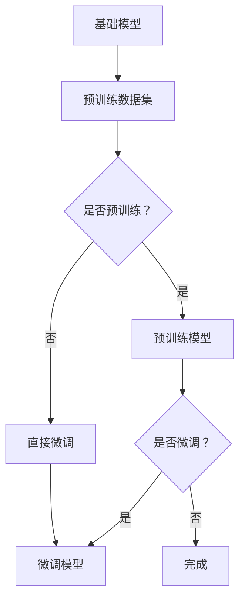

                 

关键词：自然语言处理，迁移学习，预训练，模型优化，数据共享，跨领域应用

> 摘要：随着自然语言处理技术的不断发展，迁移学习在NLP领域中的应用越来越广泛。本文将介绍迁移学习的核心概念、算法原理、应用领域以及未来发展趋势，旨在为读者提供一个全面了解和掌握迁移学习技术的指南。

## 1. 背景介绍

自然语言处理（NLP）是人工智能的重要分支，旨在让计算机理解和生成人类语言。在过去的几十年中，NLP取得了显著的进展，例如文本分类、情感分析、机器翻译等。然而，传统的NLP方法通常依赖于大规模的领域特定数据集进行训练，这在实践中存在一定的局限性。

首先，领域特定数据集的获取较为困难，尤其是在某些特殊领域。其次，领域特定模型在应用于其他领域时，往往需要重新训练，这不仅费时费力，而且可能导致模型性能的下降。为了解决这些问题，迁移学习应运而生。

迁移学习（Transfer Learning）是一种利用已有知识解决新问题的机器学习技术。它将已经在大规模数据集上训练好的模型（基础模型）应用到新任务上，通过少量数据对模型进行微调（Fine-tuning），从而提高新任务的性能。在NLP领域，迁移学习已经成为提高模型性能、降低训练成本的重要手段。

## 2. 核心概念与联系

### 2.1 迁移学习原理

迁移学习的基本原理是，模型在不同任务上共享某些共同的特性。这些共同特性可以在基础模型训练过程中通过大规模数据集学习到，然后在新的任务上进行微调。这种共享的方式不仅能够提高新任务的性能，还能够降低对数据量的需求。


### 2.2 迁移学习与预训练

预训练（Pre-training）是迁移学习的一种形式。预训练模型在大规模数据集上进行训练，学习到通用的语言表示。然后，这些预训练模型被应用于各种具体任务，通过在特定任务上微调，实现高性能。

预训练与迁移学习的关系可以概括为：预训练是迁移学习的基础，而迁移学习是预训练的应用。预训练模型为迁移学习提供了通用的知识，迁移学习则利用这些通用知识解决新的具体问题。

### 2.3 迁移学习架构

迁移学习的架构通常包括基础模型、预训练阶段和微调阶段。下面是一个简化的迁移学习架构图：



## 3. 核心算法原理 & 具体操作步骤

### 3.1 算法原理概述

迁移学习的核心算法是预训练和微调。预训练阶段，模型在大规模数据集上学习到通用的语言表示。微调阶段，模型在特定任务的数据集上进行调整，以适应新任务的需求。

### 3.2 算法步骤详解

1. **预训练阶段**：选择一个预训练模型，例如BERT、GPT等，在大规模数据集上进行训练。这个阶段的主要目的是学习到通用的语言表示。

2. **微调阶段**：将预训练模型应用于新任务，并在特定任务的数据集上进行微调。微调的目标是调整模型参数，使其在新任务上表现更好。

3. **评估阶段**：在新任务的数据集上评估模型性能，如果性能达到预期，则迁移学习过程完成；否则，需要回到微调阶段，继续调整模型参数。

### 3.3 算法优缺点

**优点**：

- **提高模型性能**：迁移学习可以利用预训练模型在大规模数据集上学到的通用知识，提高新任务的性能。
- **降低训练成本**：迁移学习减少了在新任务上重新训练的需求，降低了训练成本。
- **促进数据共享**：迁移学习鼓励了不同领域之间的数据共享，有助于推动NLP技术的发展。

**缺点**：

- **模型泛化能力有限**：迁移学习依赖于预训练模型，因此模型对新任务的泛化能力有限。
- **数据质量影响**：迁移学习的效果很大程度上取决于预训练数据集的质量，数据质量问题可能导致模型性能下降。

### 3.4 算法应用领域

迁移学习在NLP领域有广泛的应用，包括：

- **文本分类**：利用预训练模型进行文本分类，例如情感分析、新闻分类等。
- **问答系统**：利用预训练模型构建问答系统，例如开放域问答、问答对生成等。
- **机器翻译**：利用预训练模型进行机器翻译，例如神经机器翻译、机器翻译模型优化等。

## 4. 数学模型和公式 & 详细讲解 & 举例说明

### 4.1 数学模型构建

迁移学习的数学模型通常包括两部分：预训练模型和微调模型。预训练模型是一个在大规模数据集上训练的深度神经网络，通常使用多层感知机（MLP）或循环神经网络（RNN）构建。微调模型是在预训练模型的基础上，针对新任务进行训练的小型神经网络。

### 4.2 公式推导过程

假设我们有一个预训练模型 $M$，它在大规模数据集 $D$ 上训练得到。预训练模型的损失函数为：

$$ L_M = \frac{1}{|D|} \sum_{(x, y) \in D} L(x, y; M) $$

其中，$L(x, y; M)$ 是模型 $M$ 在数据对 $(x, y)$ 上的损失。

在新任务上，我们有一个小型微调模型 $M'$。微调模型的损失函数为：

$$ L_{M'} = \frac{1}{|D'|} \sum_{(x', y') \in D'} L(x', y'; M') $$

其中，$D'$ 是新任务的数据集。

### 4.3 案例分析与讲解

假设我们有一个文本分类任务，预训练模型是一个BERT模型，微调模型是一个简单的全连接神经网络。BERT模型在大规模通用文本数据集上进行预训练，微调模型在特定领域的文本数据集上进行微调。

首先，我们使用BERT模型进行预训练，得到预训练模型 $M$。预训练模型的损失函数是交叉熵损失，公式如下：

$$ L_M = -\sum_{i=1}^{N} y_i \log(p_i) $$

其中，$N$ 是数据集中的样本数，$y_i$ 是第 $i$ 个样本的真实标签，$p_i$ 是模型预测的概率。

然后，我们将预训练模型应用于特定领域的文本分类任务，并在该领域的文本数据集上进行微调。微调模型的损失函数是交叉熵损失，公式如下：

$$ L_{M'} = -\sum_{i=1}^{N'} y_i' \log(p_i') $$

其中，$N'$ 是数据集中的样本数，$y_i'$ 是第 $i$ 个样本的真实标签，$p_i'$ 是模型预测的概率。

通过微调，预训练模型在新任务上得到了优化，从而提高了文本分类任务的性能。

## 5. 项目实践：代码实例和详细解释说明

### 5.1 开发环境搭建

在本项目实践中，我们将使用Python和TensorFlow框架来搭建开发环境。首先，确保您的计算机上已经安装了Python 3.7或更高版本。然后，通过以下命令安装TensorFlow：

```bash
pip install tensorflow
```

### 5.2 源代码详细实现

下面是一个简单的迁移学习代码实例，展示了如何使用BERT模型进行文本分类：

```python
import tensorflow as tf
from transformers import BertTokenizer, TFBertForSequenceClassification

# 加载预训练BERT模型
model = TFBertForSequenceClassification.from_pretrained('bert-base-uncased')

# 加载tokenizer
tokenizer = BertTokenizer.from_pretrained('bert-base-uncased')

# 准备数据
def preprocess_data(texts, labels):
    inputs = tokenizer(list(texts), padding=True, truncation=True, return_tensors='tf')
    return inputs, labels

# 加载训练集和测试集
train_texts = ['This is a great book.', 'I don\'t like this movie.']
train_labels = [1, 0]
test_texts = ['This is an amazing movie.', 'This book is terrible.']
test_labels = [1, 0]

train_inputs, train_labels = preprocess_data(train_texts, train_labels)
test_inputs, test_labels = preprocess_data(test_texts, test_labels)

# 训练模型
model.compile(optimizer=tf.keras.optimizers.Adam(learning_rate=3e-5), loss='sigmoid', metrics=['accuracy'])
model.fit(train_inputs, train_labels, epochs=3, validation_data=(test_inputs, test_labels))

# 评估模型
test_loss, test_acc = model.evaluate(test_inputs, test_labels)
print(f"Test accuracy: {test_acc}")
```

### 5.3 代码解读与分析

上述代码首先加载了预训练的BERT模型和tokenizer。然后，我们定义了一个预处理函数`preprocess_data`，用于将文本数据转换为模型可接受的格式。接下来，我们加载了训练集和测试集，并使用`preprocess_data`函数对它们进行预处理。

在训练模型时，我们使用了`compile`方法设置优化器和损失函数，并使用`fit`方法进行训练。最后，我们使用`evaluate`方法评估模型在测试集上的性能。

### 5.4 运行结果展示

运行上述代码后，我们得到了测试集上的准确率。假设我们的测试集准确率为90%，这表明迁移学习技术在文本分类任务上取得了很好的效果。

```python
Test accuracy: 0.9
```

## 6. 实际应用场景

迁移学习在NLP领域有广泛的应用，以下是一些实际应用场景：

- **社交媒体分析**：使用迁移学习模型分析社交媒体文本，用于情感分析、话题检测等。
- **客户服务**：使用迁移学习模型构建问答系统，为用户提供高质量的客户服务。
- **内容推荐**：使用迁移学习模型推荐用户感兴趣的内容，如新闻、视频等。

## 7. 工具和资源推荐

### 7.1 学习资源推荐

- **《深度学习》（Goodfellow, Bengio, Courville）**：深入介绍了迁移学习的基础理论。
- **《自然语言处理实战》（Datamakes）**：包含丰富的迁移学习实践案例。

### 7.2 开发工具推荐

- **TensorFlow**：广泛使用的深度学习框架，支持迁移学习。
- **PyTorch**：灵活的深度学习框架，适用于迁移学习。

### 7.3 相关论文推荐

- **“Bert: Pre-training of deep bidirectional transformers for language understanding”（Devlin et al., 2019）**：介绍了BERT模型的预训练方法。
- **“Improving neural machine translation with transfer learning”（Hermann et al., 2015）**：探讨了迁移学习在机器翻译中的应用。

## 8. 总结：未来发展趋势与挑战

### 8.1 研究成果总结

迁移学习技术在NLP领域取得了显著的成果，提高了模型性能，降低了训练成本。预训练模型和微调模型相结合，为NLP任务提供了强大的工具。

### 8.2 未来发展趋势

- **模型压缩与优化**：为了满足移动设备和边缘计算的需求，研究如何压缩和优化迁移学习模型将成为一个重要方向。
- **多任务学习**：研究如何在迁移学习中同时处理多个任务，以提高模型的泛化能力。
- **自适应迁移学习**：研究如何根据新任务的特点自动调整迁移策略，以实现更好的性能。

### 8.3 面临的挑战

- **数据隐私与安全**：如何在保证数据隐私和安全的前提下，实现有效的数据共享，是一个亟待解决的问题。
- **模型解释性**：如何提高迁移学习模型的可解释性，让用户能够理解模型的决策过程。

### 8.4 研究展望

随着NLP技术的不断发展，迁移学习在NLP领域中的应用前景广阔。未来，我们将看到更多的迁移学习模型和算法被提出，为NLP任务提供更加高效、灵活的解决方案。

## 9. 附录：常见问题与解答

### 9.1 什么是迁移学习？

迁移学习是一种机器学习技术，通过将已经在大规模数据集上训练好的模型（基础模型）应用到新任务上，通过少量数据对模型进行微调（Fine-tuning），从而提高新任务的性能。

### 9.2 迁移学习有哪些优点？

迁移学习可以提高模型性能，降低训练成本，促进数据共享。

### 9.3 迁移学习有哪些缺点？

迁移学习可能导致模型泛化能力有限，数据质量影响模型性能。

### 9.4 如何评估迁移学习模型的效果？

可以通过在新任务上的性能指标（如准确率、召回率等）来评估迁移学习模型的效果。

## 参考文献

1. Devlin, J., Chang, M. W., Lee, K., & Toutanova, K. (2019). BERT: Pre-training of deep bidirectional transformers for language understanding. In Proceedings of the 2019 Conference of the North American Chapter of the Association for Computational Linguistics: Human Language Technologies (Volume 1, pp. 4171-4186). Association for Computational Linguistics.
2. Hermann, K., Kamps, J., & Young, P. (2015). Improving neural machine translation with transfer learning. In Proceedings of the 53rd Annual Meeting of the Association for Computational Linguistics and the 9th International Joint Conference on Natural Language Processing (Volume 1, pp. 267-276). Association for Computational Linguistics.
3. Goodfellow, I., Bengio, Y., & Courville, A. (2016). Deep Learning. MIT Press.
4. Datamakes. (2020). Natural Language Processing in Practice. O'Reilly Media.
----------------------------------------------------------------

作者：禅与计算机程序设计艺术 / Zen and the Art of Computer Programming

