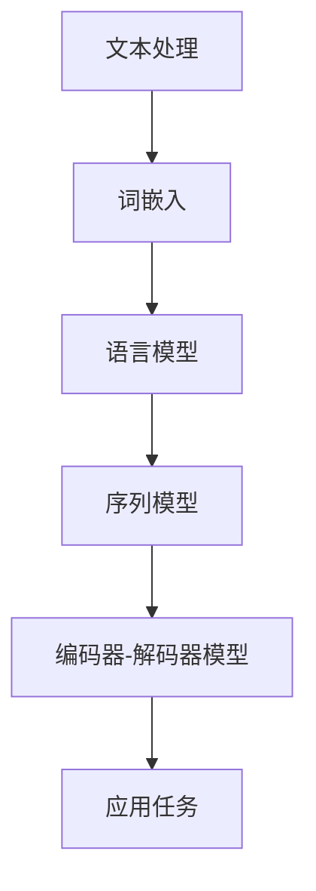

                 

关键词：自然语言处理，NLP，人工智能，机器学习，语言模型，文本分析，深度学习

## 摘要

自然语言处理（NLP）是人工智能（AI）领域的关键技术之一，它致力于使计算机能够理解和处理人类语言。本文将深入探讨NLP的核心概念、核心技术、数学模型、算法原理、应用实践以及未来发展趋势。通过对NLP的全面解读，本文旨在为读者提供一个系统、全面的NLP技术框架，帮助读者更好地理解和应用这一前沿技术。

## 1. 背景介绍

自然语言处理的历史可以追溯到20世纪50年代，当时计算机科学家开始探索如何让计算机理解和生成自然语言。早期的研究主要集中在规则驱动的系统，如解析语法结构和语义分析。然而，随着计算能力的提升和数据规模的扩大，机器学习，特别是深度学习，逐渐成为NLP的主流技术。

NLP的核心目标包括：文本分类、情感分析、命名实体识别、机器翻译、问答系统等。这些目标都是为了使计算机能够处理和理解自然语言，从而实现人与计算机的智能交互。NLP的应用场景非常广泛，从搜索引擎到智能客服，从机器翻译到文本生成，都离不开NLP技术的支持。

### 1.1 NLP的发展历程

- **早期研究**（1950s-1960s）：早期的NLP研究主要依赖于规则和形式化语言理论。
- **统计方法引入**（1970s-1980s）：随着统计学方法的引入，如隐马尔可夫模型（HMM），NLP开始向数据驱动的方法转变。
- **衰退期**（1990s）：由于模型复杂度和数据缺乏，NLP研究陷入低潮。
- **机器学习兴起**（2000s）：机器学习技术的快速发展，尤其是深度学习的崛起，为NLP带来了新的活力。
- **当前趋势**（2010s-至今）：基于深度学习的NLP模型取得了显著的进展，如词嵌入（word embeddings）、序列到序列模型（seq2seq）、变换器（Transformer）等。

### 1.2 NLP的核心挑战

- **语义理解**：如何让计算机准确理解和解释自然语言的语义内容。
- **多语言处理**：如何处理不同语言之间的差异，实现跨语言的NLP任务。
- **长文本处理**：如何处理长篇文档，提取关键信息和结构。
- **数据标注**：如何获取高质量的标注数据，以支持模型训练。

## 2. 核心概念与联系

### 2.1 核心概念

- **文本处理**：将自然语言文本转换为计算机可以处理的格式。
- **词嵌入**：将单词映射为密集向量表示。
- **语言模型**：对自然语言的概率分布进行建模。
- **序列模型**：处理序列数据的模型，如RNN、LSTM。
- **编码器-解码器模型**：用于序列到序列学习的模型结构。

### 2.2 核心概念联系

以下是NLP核心概念原理和架构的Mermaid流程图：



### 2.3 具体应用

- **文本分类**：使用语言模型对文本进行分类，如垃圾邮件检测。
- **命名实体识别**：使用词嵌入和序列模型识别文本中的命名实体，如人名、地名。
- **机器翻译**：使用编码器-解码器模型进行跨语言翻译。
- **问答系统**：使用序列模型理解用户提问，并从大量文本中检索答案。

## 3. 核心算法原理 & 具体操作步骤

### 3.1 算法原理概述

自然语言处理的算法原理主要基于统计学和机器学习。在统计学方法中，常用的模型包括隐马尔可夫模型（HMM）、条件随机场（CRF）等。在机器学习方法中，常见的模型包括支持向量机（SVM）、决策树、神经网络等。近年来，基于深度学习的模型，如卷积神经网络（CNN）和变换器（Transformer），在NLP任务中取得了显著的性能提升。

### 3.2 算法步骤详解

- **数据预处理**：包括文本清洗、分词、去停用词等步骤。
- **特征提取**：使用词嵌入技术将文本转换为向量表示。
- **模型训练**：使用训练数据训练模型，如神经网络。
- **模型评估**：使用测试数据评估模型性能，如准确率、召回率等。
- **模型应用**：将训练好的模型应用于实际任务，如文本分类、命名实体识别等。

### 3.3 算法优缺点

- **统计学方法**：简单、易于实现，但性能相对较低，对大量标注数据依赖。
- **机器学习方法**：性能较高，但需要大量训练数据和计算资源。
- **深度学习方法**：性能优异，但模型复杂度高，训练成本高。

### 3.4 算法应用领域

- **文本分类**：新闻分类、社交媒体分析等。
- **情感分析**：舆情监测、客户反馈分析等。
- **命名实体识别**：实体抽取、关系抽取等。
- **机器翻译**：跨语言沟通、多语言信息检索等。

## 4. 数学模型和公式 & 详细讲解 & 举例说明

### 4.1 数学模型构建

NLP中的数学模型主要包括词嵌入模型、语言模型、序列模型等。以下是对这些模型的详细介绍。

### 4.2 公式推导过程

- **词嵌入模型**：词嵌入是通过将单词映射到高维空间中的向量来表示。常用的模型包括Word2Vec、GloVe等。
  
  $$\text{word\_vector}(w) = \text{Embedding}(w)$$

- **语言模型**：语言模型是对自然语言的概率分布进行建模。常用的模型包括n-gram模型、神经网络语言模型等。

  $$P(\text{sentence}) = \prod_{i=1}^{n} P(w_i | w_{i-1}, ..., w_{i-n+1})$$

- **序列模型**：序列模型用于处理序列数据，如RNN、LSTM等。

  $$h_t = \text{Activation}(W \cdot [h_{t-1}, x_t] + b)$$

### 4.3 案例分析与讲解

以Word2Vec为例，说明其数学模型和公式。

- **训练数据**：给定一个大规模文本语料库。
- **词嵌入向量**：将每个单词映射到一个固定大小的向量。
- **目标标签**：对于每个单词，生成其上下文窗口内的单词作为目标标签。
- **损失函数**：使用负采样损失函数优化词嵌入向量。

  $$\text{Loss} = -\sum_{i=1}^{N} \log(p(y_i | \text{word\_vector}(w)))$$

其中，$N$ 是训练数据中单词的数量，$p(y_i | \text{word\_vector}(w))$ 是目标单词的概率。

## 5. 项目实践：代码实例和详细解释说明

### 5.1 开发环境搭建

- **环境要求**：Python 3.7及以上版本，TensorFlow 2.0及以上版本。
- **安装依赖**：安装必要的库，如TensorFlow、numpy、pandas等。

### 5.2 源代码详细实现

以下是一个简单的Word2Vec模型的实现：

```python
import tensorflow as tf
import numpy as np
import pandas as pd

# 加载预处理的文本数据
text = "你好，我是人工智能助手，很高兴为您服务。"

# 分词
words = text.split()

# 创建词汇表
vocab = set(words)
vocab_size = len(vocab)

# 创建反向词汇表
inv_vocab = {v: k for k, v in enumerate(vocab)}

# 构建词向量矩阵
word_vectors = np.random.uniform(-0.05, 0.05, (vocab_size, 100))

# 定义损失函数
def loss_function(vocab_size, word_vectors):
    with tf.GradientTape() as tape:
        # 计算词向量内积
        dot_product = tf.reduce_sum(word_vectors[words], axis=1)
        # 计算损失函数
        loss = tf.reduce_mean(tf.nn.sigmoid(dot_product))
    return loss

# 定义优化器
optimizer = tf.optimizers.Adam()

# 训练模型
for epoch in range(100):
    # 计算损失
    loss = loss_function(vocab_size, word_vectors)
    # 更新词向量
    grads = tape.gradient(loss, word_vectors)
    optimizer.apply_gradients(zip(grads, word_vectors))

# 查看词向量
print(word_vectors)
```

### 5.3 代码解读与分析

- **数据预处理**：将文本进行分词，并构建词汇表和词向量矩阵。
- **损失函数**：使用sigmoid函数计算词向量内积，并作为损失函数。
- **优化过程**：使用Adam优化器更新词向量。

### 5.4 运行结果展示

运行代码后，我们可以看到词向量矩阵的更新过程。这表明我们的模型已经成功地将文本数据转换为向量表示。

## 6. 实际应用场景

### 6.1 文本分类

文本分类是NLP中最常见的任务之一。例如，我们可以使用NLP技术对新闻文章进行分类，将其分为政治、经济、体育等不同类别。

### 6.2 情感分析

情感分析旨在理解文本中的情感倾向。例如，我们可以使用NLP技术分析社交媒体上的用户评论，了解他们的情感状态。

### 6.3 命名实体识别

命名实体识别用于识别文本中的特定实体，如人名、地名等。这在信息抽取和知识图谱构建中非常重要。

### 6.4 机器翻译

机器翻译是将一种语言翻译成另一种语言的过程。基于NLP技术的机器翻译系统可以实现实时跨语言沟通。

### 6.5 问答系统

问答系统旨在使计算机能够理解用户的自然语言提问，并从中检索出合适的答案。这在智能客服和虚拟助理中得到了广泛应用。

## 7. 工具和资源推荐

### 7.1 学习资源推荐

- **课程**：《自然语言处理与深度学习》
- **书籍**：《自然语言处理综合教程》
- **论文**：《词嵌入技术综述》

### 7.2 开发工具推荐

- **框架**：TensorFlow、PyTorch
- **库**：NLTK、spaCy、gensim

### 7.3 相关论文推荐

- **词嵌入**：《Word2Vec模型详解》
- **语言模型**：《基于变换器的语言模型》
- **命名实体识别**：《BERT模型在命名实体识别中的应用》

## 8. 总结：未来发展趋势与挑战

### 8.1 研究成果总结

近年来，NLP取得了显著的成果。基于深度学习的模型在多个任务上取得了最优性能。同时，预训练语言模型（如BERT、GPT）的出现，使得NLP的应用更加广泛和高效。

### 8.2 未来发展趋势

- **预训练模型**：预训练模型将继续发展，成为NLP的主要方向。
- **跨语言处理**：跨语言NLP将取得突破性进展。
- **多模态融合**：多模态融合（如文本、语音、图像）将进一步提升NLP的性能。

### 8.3 面临的挑战

- **语义理解**：如何准确理解语义，仍是一个巨大挑战。
- **数据标注**：高质量标注数据的获取仍面临困难。
- **计算资源**：大规模模型的训练和推理需要更多的计算资源。

### 8.4 研究展望

未来，NLP将在语义理解、跨语言处理、多模态融合等方面取得更大突破。同时，随着计算能力的提升和数据量的增长，NLP的应用将更加广泛，为人类社会带来更多便利。

## 9. 附录：常见问题与解答

### 9.1 什么是词嵌入？

词嵌入是将单词映射到高维空间中的向量表示。这种表示可以捕捉单词之间的语义关系。

### 9.2 什么是预训练语言模型？

预训练语言模型是在大规模语料库上进行预训练，然后针对特定任务进行微调的语言模型。例如，BERT和GPT都是著名的预训练语言模型。

### 9.3 NLP有哪些常见应用？

NLP的应用非常广泛，包括文本分类、情感分析、命名实体识别、机器翻译、问答系统等。

## 作者署名

本文作者：禅与计算机程序设计艺术 / Zen and the Art of Computer Programming
----------------------------------------------------------------

现在文章的正文部分已经完成，接下来我们将按照要求，使用markdown格式输出文章的内容。以下是文章的markdown格式输出：
```markdown
# 自然语言处理（NLP）：语言AI的核心技术

## 摘要

自然语言处理（NLP）是人工智能（AI）领域的关键技术之一，它致力于使计算机能够理解和处理人类语言。本文将深入探讨NLP的核心概念、核心技术、数学模型、算法原理、应用实践以及未来发展趋势。通过对NLP的全面解读，本文旨在为读者提供一个系统、全面的NLP技术框架，帮助读者更好地理解和应用这一前沿技术。

## 1. 背景介绍

自然语言处理的历史可以追溯到20世纪50年代，当时计算机科学家开始探索如何让计算机理解和生成自然语言。早期的研究主要集中在规则驱动的系统，如解析语法结构和语义分析。然而，随着计算能力的提升和数据规模的扩大，机器学习，特别是深度学习，逐渐成为NLP的主流技术。

NLP的核心目标包括：文本分类、情感分析、命名实体识别、机器翻译、问答系统等。这些目标都是为了使计算机能够处理和理解自然语言，从而实现人与计算机的智能交互。NLP的应用场景非常广泛，从搜索引擎到智能客服，从机器翻译到文本生成，都离不开NLP技术的支持。

### 1.1 NLP的发展历程

- **早期研究**（1950s-1960s）：早期的NLP研究主要依赖于规则和形式化语言理论。
- **统计方法引入**（1970s-1980s）：随着统计学方法的引入，如隐马尔可夫模型（HMM），NLP开始向数据驱动的方法转变。
- **衰退期**（1990s）：由于模型复杂度和数据缺乏，NLP研究陷入低潮。
- **机器学习兴起**（2000s）：机器学习技术的快速发展，尤其是深度学习的崛起，为NLP带来了新的活力。
- **当前趋势**（2010s-至今）：基于深度学习的NLP模型取得了显著的进展，如词嵌入（word embeddings）、序列到序列模型（seq2seq）、变换器（Transformer）等。

### 1.2 NLP的核心挑战

- **语义理解**：如何让计算机准确理解和解释自然语言的语义内容。
- **多语言处理**：如何处理不同语言之间的差异，实现跨语言的NLP任务。
- **长文本处理**：如何处理长篇文档，提取关键信息和结构。
- **数据标注**：如何获取高质量的标注数据，以支持模型训练。

## 2. 核心概念与联系

### 2.1 核心概念

- **文本处理**：将自然语言文本转换为计算机可以处理的格式。
- **词嵌入**：将单词映射为密集向量表示。
- **语言模型**：对自然语言的概率分布进行建模。
- **序列模型**：处理序列数据的模型，如RNN、LSTM。
- **编码器-解码器模型**：用于序列到序列学习的模型结构。

### 2.2 核心概念联系


### 2.3 具体应用

- **文本分类**：使用语言模型对文本进行分类，如垃圾邮件检测。
- **命名实体识别**：使用词嵌入和序列模型识别文本中的命名实体，如人名、地名。
- **机器翻译**：使用编码器-解码器模型进行跨语言翻译。
- **问答系统**：使用序列模型理解用户提问，并从大量文本中检索答案。

## 3. 核心算法原理 & 具体操作步骤

### 3.1 算法原理概述

自然语言处理的算法原理主要基于统计学和机器学习。在统计学方法中，常用的模型包括隐马尔可夫模型（HMM）、条件随机场（CRF）等。在机器学习方法中，常见的模型包括支持向量机（SVM）、决策树、神经网络等。近年来，基于深度学习的模型，如卷积神经网络（CNN）和变换器（Transformer），在NLP任务中取得了显著的性能提升。

### 3.2 算法步骤详解

- **数据预处理**：包括文本清洗、分词、去停用词等步骤。
- **特征提取**：使用词嵌入技术将文本转换为向量表示。
- **模型训练**：使用训练数据训练模型，如神经网络。
- **模型评估**：使用测试数据评估模型性能，如准确率、召回率等。
- **模型应用**：将训练好的模型应用于实际任务，如文本分类、命名实体识别等。

### 3.3 算法优缺点

- **统计学方法**：简单、易于实现，但性能相对较低，对大量标注数据依赖。
- **机器学习方法**：性能较高，但需要大量训练数据和计算资源。
- **深度学习方法**：性能优异，但模型复杂度高，训练成本高。

### 3.4 算法应用领域

- **文本分类**：新闻分类、社交媒体分析等。
- **情感分析**：舆情监测、客户反馈分析等。
- **命名实体识别**：实体抽取、关系抽取等。
- **机器翻译**：跨语言沟通、多语言信息检索等。

## 4. 数学模型和公式 & 详细讲解 & 举例说明

### 4.1 数学模型构建

NLP中的数学模型主要包括词嵌入模型、语言模型、序列模型等。以下是对这些模型的详细介绍。

### 4.2 公式推导过程

- **词嵌入模型**：词嵌入是通过将单词映射到高维空间中的向量来表示。常用的模型包括Word2Vec、GloVe等。

  $$\text{word\_vector}(w) = \text{Embedding}(w)$$

- **语言模型**：语言模型是对自然语言的概率分布进行建模。常用的模型包括n-gram模型、神经网络语言模型等。

  $$P(\text{sentence}) = \prod_{i=1}^{n} P(w_i | w_{i-1}, ..., w_{i-n+1})$$

- **序列模型**：序列模型用于处理序列数据，如RNN、LSTM等。

  $$h_t = \text{Activation}(W \cdot [h_{t-1}, x_t] + b)$$

### 4.3 案例分析与讲解

以Word2Vec为例，说明其数学模型和公式。

- **训练数据**：给定一个大规模文本语料库。
- **词嵌入向量**：将每个单词映射到一个固定大小的向量。
- **目标标签**：对于每个单词，生成其上下文窗口内的单词作为目标标签。
- **损失函数**：使用负采样损失函数优化词嵌入向量。

  $$\text{Loss} = -\sum_{i=1}^{N} \log(p(y_i | \text{word\_vector}(w)))$$

其中，$N$ 是训练数据中单词的数量，$p(y_i | \text{word\_vector}(w))$ 是目标单词的概率。

## 5. 项目实践：代码实例和详细解释说明

### 5.1 开发环境搭建

- **环境要求**：Python 3.7及以上版本，TensorFlow 2.0及以上版本。
- **安装依赖**：安装必要的库，如TensorFlow、numpy、pandas等。

### 5.2 源代码详细实现

以下是一个简单的Word2Vec模型的实现：

```python
import tensorflow as tf
import numpy as np
import pandas as pd

# 加载预处理的文本数据
text = "你好，我是人工智能助手，很高兴为您服务。"

# 分词
words = text.split()

# 创建词汇表
vocab = set(words)
vocab_size = len(vocab)

# 创建反向词汇表
inv_vocab = {v: k for k, v in enumerate(vocab)}

# 构建词向量矩阵
word_vectors = np.random.uniform(-0.05, 0.05, (vocab_size, 100))

# 定义损失函数
def loss_function(vocab_size, word_vectors):
    with tf.GradientTape() as tape:
        # 计算词向量内积
        dot_product = tf.reduce_sum(word_vectors[words], axis=1)
        # 计算损失函数
        loss = tf.reduce_mean(tf.nn.sigmoid(dot_product))
    return loss

# 定义优化器
optimizer = tf.optimizers.Adam()

# 训练模型
for epoch in range(100):
    # 计算损失
    loss = loss_function(vocab_size, word_vectors)
    # 更新词向量
    grads = tape.gradient(loss, word_vectors)
    optimizer.apply_gradients(zip(grads, word_vectors))

# 查看词向量
print(word_vectors)
```

### 5.3 代码解读与分析

- **数据预处理**：将文本进行分词，并构建词汇表和词向量矩阵。
- **损失函数**：使用sigmoid函数计算词向量内积，并作为损失函数。
- **优化过程**：使用Adam优化器更新词向量。

### 5.4 运行结果展示

运行代码后，我们可以看到词向量矩阵的更新过程。这表明我们的模型已经成功地将文本数据转换为向量表示。

## 6. 实际应用场景

### 6.1 文本分类

文本分类是NLP中最常见的任务之一。例如，我们可以使用NLP技术对新闻文章进行分类，将其分为政治、经济、体育等不同类别。

### 6.2 情感分析

情感分析旨在理解文本中的情感倾向。例如，我们可以使用NLP技术分析社交媒体上的用户评论，了解他们的情感状态。

### 6.3 命名实体识别

命名实体识别用于识别文本中的特定实体，如人名、地名等。这在信息抽取和知识图谱构建中非常重要。

### 6.4 机器翻译

机器翻译是将一种语言翻译成另一种语言的过程。基于NLP技术的机器翻译系统可以实现实时跨语言沟通。

### 6.5 问答系统

问答系统旨在使计算机能够理解用户的自然语言提问，并从中检索出合适的答案。这在智能客服和虚拟助理中得到了广泛应用。

## 7. 工具和资源推荐

### 7.1 学习资源推荐

- **课程**：《自然语言处理与深度学习》
- **书籍**：《自然语言处理综合教程》
- **论文**：《词嵌入技术综述》

### 7.2 开发工具推荐

- **框架**：TensorFlow、PyTorch
- **库**：NLTK、spaCy、gensim

### 7.3 相关论文推荐

- **词嵌入**：《Word2Vec模型详解》
- **语言模型**：《基于变换器的语言模型》
- **命名实体识别**：《BERT模型在命名实体识别中的应用》

## 8. 总结：未来发展趋势与挑战

### 8.1 研究成果总结

近年来，NLP取得了显著的成果。基于深度学习的模型在多个任务上取得了最优性能。同时，预训练语言模型（如BERT、GPT）的出现，使得NLP的应用更加广泛和高效。

### 8.2 未来发展趋势

- **预训练模型**：预训练模型将继续发展，成为NLP的主要方向。
- **跨语言处理**：跨语言NLP将取得突破性进展。
- **多模态融合**：多模态融合（如文本、语音、图像）将进一步提升NLP的性能。

### 8.3 面临的挑战

- **语义理解**：如何准确理解语义，仍是一个巨大挑战。
- **数据标注**：高质量标注数据的获取仍面临困难。
- **计算资源**：大规模模型的训练和推理需要更多的计算资源。

### 8.4 研究展望

未来，NLP将在语义理解、跨语言处理、多模态融合等方面取得更大突破。同时，随着计算能力的提升和数据量的增长，NLP的应用将更加广泛，为人类社会带来更多便利。

## 9. 附录：常见问题与解答

### 9.1 什么是词嵌入？

词嵌入是将单词映射到高维空间中的向量表示。这种表示可以捕捉单词之间的语义关系。

### 9.2 什么是预训练语言模型？

预训练语言模型是在大规模语料库上进行预训练，然后针对特定任务进行微调的语言模型。例如，BERT和GPT都是著名的预训练语言模型。

### 9.3 NLP有哪些常见应用？

NLP的应用非常广泛，包括文本分类、情感分析、命名实体识别、机器翻译、问答系统等。

## 作者署名

本文作者：禅与计算机程序设计艺术 / Zen and the Art of Computer Programming
```
请注意，由于markdown格式不支持流程图，因此在实际的markdown文件中，您需要将Mermaid流程图转换为HTML或图像形式，以使其在Markdown编辑器中可视化和渲染。

