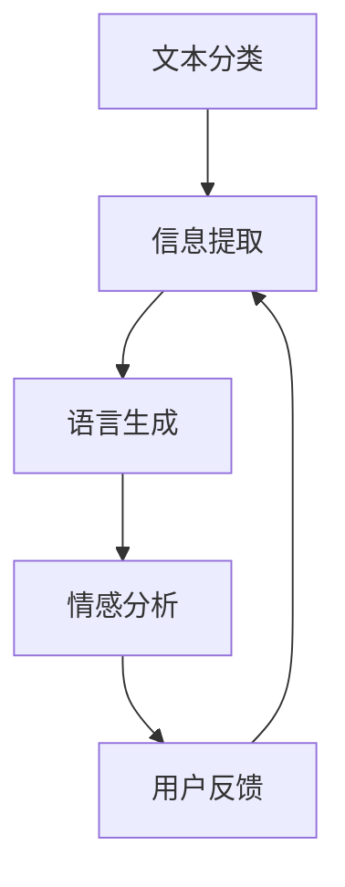

                 

关键词：自然语言处理，对话系统，智能助手，NLP技术，机器学习，深度学习，文本分类，信息提取，语言生成，情感分析

> 摘要：本文将深入探讨自然语言处理（NLP）在构建智能对话系统中的应用。首先，我们将回顾NLP的背景和发展历程，接着介绍构建智能对话系统的核心概念和关键技术。随后，我们将详细讨论NLP的核心算法原理，并给出具体的数学模型和公式。随后，我们将通过项目实践展示如何使用这些技术来实现一个简单的对话系统，并分析其实际应用场景。最后，我们将总结当前的研究成果，展望未来发展趋势和面临的挑战。

## 1. 背景介绍

自然语言处理（NLP）是计算机科学和人工智能领域的一个重要分支，旨在让计算机理解和处理自然语言。自从20世纪50年代人工智能（AI）概念的提出，NLP经历了多个发展阶段。从早期的规则驱动方法到基于统计的方法，再到如今以深度学习为核心的技术，NLP领域取得了显著的进展。

智能对话系统是NLP应用的一个重要方向。随着互联网的普及和移动设备的广泛使用，用户对智能交互的需求日益增长。智能对话系统能够模拟人类对话，为用户提供实时、个性化的服务。这类系统广泛应用于客服、智能助手、语音助手等领域，成为现代人工智能技术的一个重要组成部分。

本文将首先介绍NLP的基本概念和核心任务，然后详细探讨构建智能对话系统的关键技术，包括文本分类、信息提取、语言生成和情感分析等。随后，我们将通过一个实际项目展示如何实现一个简单的对话系统，并分析其在实际应用场景中的表现。最后，我们将总结当前NLP和智能对话系统的研究成果，并展望未来发展趋势和面临的挑战。

## 2. 核心概念与联系

### 2.1 NLP的基本概念

自然语言处理（NLP）涉及多个核心概念，包括词汇、句子、语篇等。词汇是语言的基本单元，句子是表达完整意义的语言单位，而语篇则是由多个句子构成的连贯文本。

NLP的核心任务可以归纳为以下几类：

1. **文本分类**：根据文本的语义或主题将其归类到不同的类别中。
2. **信息提取**：从文本中提取关键信息，如命名实体识别、关系提取等。
3. **语言生成**：根据给定的输入生成文本，如问答系统、机器翻译等。
4. **情感分析**：判断文本的情感倾向，如正面、负面或中立。
5. **语义理解**：理解和解释文本中的语义，如语义角色标注、语义解析等。

### 2.2 NLP与智能对话系统的联系

智能对话系统是NLP在特定应用场景中的综合体现。构建一个高效的智能对话系统，需要结合多种NLP技术，包括文本分类、信息提取、语言生成和情感分析等。

- **文本分类**：用于对用户输入的文本进行初步处理，将其归类到相应的类别，以便进行后续的处理。
- **信息提取**：从用户输入中提取关键信息，如用户意图、关键词等，为对话系统提供决策依据。
- **语言生成**：根据用户意图和对话系统内部的逻辑生成相应的回复，以实现自然的对话交互。
- **情感分析**：用于分析用户情感，以提供更加个性化和温暖的服务。

### 2.3 Mermaid流程图

以下是一个简单的Mermaid流程图，展示了NLP技术在智能对话系统中的流程：



### 2.4 NLP技术的现状与挑战

尽管NLP技术在过去几十年中取得了显著的进展，但仍然面临一些挑战：

- **语义理解**：如何让计算机真正理解人类语言，而不仅仅是表面上的文字匹配。
- **跨语言处理**：如何处理多种语言的文本，实现多语言之间的翻译和交互。
- **上下文理解**：如何更好地理解对话中的上下文信息，提供更加准确的回复。
- **对话生成**：如何生成自然流畅、符合用户需求的对话内容。

### 2.5 结论

本章介绍了NLP的基本概念和核心任务，以及NLP技术在构建智能对话系统中的关键作用。通过Mermaid流程图，我们清晰地展示了NLP技术在实际应用中的流程。下一章将深入探讨NLP的核心算法原理，为后续的实践和案例分析打下基础。

### 3. 核心算法原理 & 具体操作步骤

#### 3.1 算法原理概述

构建智能对话系统的核心算法主要涉及自然语言处理（NLP）的多个方面，包括文本分类、信息提取、语言生成和情感分析。以下是这些算法的基本原理和操作步骤的概述。

#### 3.2 文本分类算法

文本分类是NLP中最基本的任务之一，其目的是将文本数据归类到预先定义的类别中。常见的文本分类算法包括：

- **朴素贝叶斯分类器**：基于贝叶斯定理和朴素假设，通过特征词的概率分布进行分类。
- **支持向量机（SVM）**：通过最大间隔分类器来找到最佳决策边界，实现文本分类。
- **深度学习模型**：如卷积神经网络（CNN）和循环神经网络（RNN），通过多层特征提取实现文本分类。

#### 操作步骤：

1. **数据预处理**：清洗文本数据，去除停用词、标点符号，进行词干提取等。
2. **特征提取**：将文本转换为数值特征，如词袋模型、TF-IDF等。
3. **模型训练**：使用训练数据集训练分类模型，如朴素贝叶斯、SVM或深度学习模型。
4. **模型评估**：使用验证数据集评估模型性能，调整参数以优化模型。
5. **分类预测**：使用训练好的模型对新的文本数据进行分类预测。

#### 3.3 信息提取算法

信息提取是从文本中提取关键信息的过程，包括命名实体识别、关系提取、事件提取等。常见的算法有：

- **基于规则的方法**：通过预定义的规则进行信息提取。
- **基于统计的方法**：使用统计模型，如条件概率模型、隐马尔可夫模型（HMM）等。
- **基于深度学习的方法**：使用卷积神经网络（CNN）和循环神经网络（RNN）等深度学习模型。

#### 操作步骤：

1. **数据预处理**：清洗文本数据，去除无关信息，进行分词和词性标注。
2. **特征提取**：将文本转换为适合模型学习的特征表示。
3. **模型训练**：使用训练数据集训练信息提取模型。
4. **模型评估**：使用验证数据集评估模型性能，调整参数以优化模型。
5. **信息提取**：使用训练好的模型对新的文本数据进行信息提取。

#### 3.4 语言生成算法

语言生成是智能对话系统的关键环节，其目的是根据用户输入生成自然、流畅的回复。常见的算法有：

- **基于模板的方法**：通过预定义的模板生成回复。
- **基于统计的方法**：使用统计模型，如n-gram模型、隐马尔可夫模型（HMM）等。
- **基于深度学习的方法**：使用生成式模型，如变分自编码器（VAE）、生成对抗网络（GAN）等。

#### 操作步骤：

1. **数据预处理**：清洗对话数据，进行分词和词性标注。
2. **特征提取**：将对话数据转换为适合模型学习的特征表示。
3. **模型训练**：使用训练数据集训练语言生成模型。
4. **模型评估**：使用验证数据集评估模型性能，调整参数以优化模型。
5. **生成回复**：使用训练好的模型根据用户输入生成回复。

#### 3.5 情感分析算法

情感分析是判断文本情感倾向的过程，常用于情感分类和情感极性分析。常见的算法有：

- **基于规则的方法**：通过预定义的情感词典和规则进行情感分析。
- **基于统计的方法**：使用统计模型，如SVM、朴素贝叶斯等。
- **基于深度学习的方法**：使用卷积神经网络（CNN）和循环神经网络（RNN）等深度学习模型。

#### 操作步骤：

1. **数据预处理**：清洗文本数据，去除停用词、标点符号，进行词干提取等。
2. **特征提取**：将文本转换为数值特征，如词袋模型、TF-IDF等。
3. **模型训练**：使用训练数据集训练情感分析模型。
4. **模型评估**：使用验证数据集评估模型性能，调整参数以优化模型。
5. **情感分析**：使用训练好的模型对新的文本数据进行分析。

#### 3.6 算法优缺点

以下是几种常见NLP算法的优缺点对比：

- **朴素贝叶斯分类器**：
  - 优点：简单高效，对大规模数据表现良好。
  - 缺点：对文本数据的高维特征处理能力有限，无法捕捉复杂的关系。

- **支持向量机（SVM）**：
  - 优点：在特征空间中寻找最佳分离超平面，分类效果较好。
  - 缺点：训练时间较长，对噪声数据敏感。

- **深度学习模型**：
  - 优点：强大的特征提取能力，能够处理复杂的关系和上下文信息。
  - 缺点：需要大量数据训练，模型解释性较差。

#### 3.7 算法应用领域

NLP算法广泛应用于多个领域，包括：

- **搜索引擎**：用于对用户查询进行匹配和排序。
- **智能客服**：用于处理用户咨询和问题反馈。
- **社交媒体分析**：用于监测社交媒体上的用户情感和趋势。
- **机器翻译**：用于跨语言的信息传递和交流。
- **文本生成**：用于创作文章、诗歌等文本内容。

#### 3.8 结论

本章详细介绍了NLP的核心算法原理和操作步骤，包括文本分类、信息提取、语言生成和情感分析。通过对比不同算法的优缺点，我们了解了它们在不同应用领域中的适用性。下一章将基于这些算法原理，展示如何实现一个简单的对话系统。

### 4. 数学模型和公式 & 详细讲解 & 举例说明

#### 4.1 数学模型构建

在自然语言处理（NLP）中，数学模型是理解和处理语言数据的核心工具。以下是一些常用的数学模型和其构建方法。

##### 4.1.1 朴素贝叶斯分类器

朴素贝叶斯分类器是一种基于概率论的分类算法，其核心公式为：

$$
P(\text{类别} | \text{特征}) = \frac{P(\text{特征} | \text{类别})P(\text{类别})}{P(\text{特征})}
$$

其中，\(P(\text{类别} | \text{特征})\) 表示给定特征条件下某一类别的概率，\(P(\text{特征} | \text{类别})\) 表示某一类别条件下特征的概率，\(P(\text{类别})\) 表示某一类别的概率，\(P(\text{特征})\) 表示特征的总体概率。

##### 4.1.2 支持向量机（SVM）

支持向量机是一种寻找最优决策边界进行分类的算法，其核心公式为：

$$
w^T x + b = 0
$$

其中，\(w\) 表示权重向量，\(x\) 表示特征向量，\(b\) 表示偏置项。通过优化权重和偏置项，找到最佳分类边界。

##### 4.1.3 循环神经网络（RNN）

循环神经网络是一种能够处理序列数据的神经网络，其核心公式为：

$$
h_t = \sigma(W_h h_{t-1} + W_x x_t + b)
$$

其中，\(h_t\) 表示当前时间步的隐藏状态，\(x_t\) 表示当前输入，\(\sigma\) 表示激活函数，\(W_h\) 和 \(W_x\) 分别表示隐藏状态和输入的权重矩阵，\(b\) 表示偏置项。

##### 4.1.4 卷积神经网络（CNN）

卷积神经网络是一种用于图像和文本等数据处理的神经网络，其核心公式为：

$$
h_t = \sigma(\sum_{k=1}^{K} W_k \odot x_t + b)
$$

其中，\(h_t\) 表示当前卷积核的输出，\(x_t\) 表示输入数据，\(\odot\) 表示卷积运算，\(W_k\) 和 \(b\) 分别表示卷积核的权重和偏置项。

#### 4.2 公式推导过程

以下是几种核心公式的推导过程。

##### 4.2.1 朴素贝叶斯分类器的推导

假设有 \(C\) 个类别，每个类别下有 \(n\) 个特征。首先，我们计算每个特征在各个类别下的条件概率：

$$
P(\text{特征} | \text{类别}_i) = \frac{P(\text{类别}_i \cap \text{特征})}{P(\text{类别}_i)}
$$

根据贝叶斯定理，我们可以计算给定特征条件下某一类别的概率：

$$
P(\text{类别}_i | \text{特征}) = \frac{P(\text{特征} | \text{类别}_i)P(\text{类别}_i)}{P(\text{特征})}
$$

其中，\(P(\text{类别}_i)\) 可以通过训练数据集计算：

$$
P(\text{类别}_i) = \frac{\text{类别}_i \text{出现的次数}}{\text{总次数}}
$$

##### 4.2.2 支持向量机的推导

支持向量机的基本思想是找到最佳分类边界，使得分类边界到各个类别的最近点的距离最大。设 \(x\) 为特征向量，\(y\) 为类别标签，\(w\) 为权重向量，\(b\) 为偏置项，则分类边界可以表示为：

$$
w^T x + b = 0
$$

为了最大化分类边界到各个类别的最近点的距离，我们需要最小化：

$$
\min_{w,b} \frac{1}{2} \| w \|^2
$$

同时，我们希望满足分类约束条件：

$$
y_i (w^T x_i + b) \geq 1
$$

通过拉格朗日乘子法，我们可以得到：

$$
L(w,b,\alpha) = \frac{1}{2} \| w \|^2 - \sum_{i=1}^{n} \alpha_i [y_i (w^T x_i + b) - 1]
$$

其中，\(\alpha_i\) 为拉格朗日乘子。通过求解拉格朗日函数的极值，我们可以得到最佳分类边界。

##### 4.2.3 循环神经网络的推导

循环神经网络的核心是隐藏状态的更新规则。设 \(h_t\) 为当前时间步的隐藏状态，\(x_t\) 为当前输入，\(h_{t-1}\) 为前一个时间步的隐藏状态，则隐藏状态的更新规则可以表示为：

$$
h_t = \sigma(W_h h_{t-1} + W_x x_t + b)
$$

其中，\(\sigma\) 为激活函数，\(W_h\) 和 \(W_x\) 分别为权重矩阵，\(b\) 为偏置项。

##### 4.2.4 卷积神经网络的推导

卷积神经网络的核心是卷积操作。设 \(h_t\) 为当前卷积核的输出，\(x_t\) 为输入数据，\(W_k\) 为卷积核的权重，\(b\) 为偏置项，则卷积操作可以表示为：

$$
h_t = \sigma(\sum_{k=1}^{K} W_k \odot x_t + b)
$$

其中，\(\odot\) 表示卷积运算，\(K\) 为卷积核的数量。

#### 4.3 案例分析与讲解

以下是一个简单的案例，用于展示如何使用NLP的数学模型进行文本分类。

##### 4.3.1 数据准备

我们使用一个简单的文本数据集，包含两个类别：“科技”和“生活”。数据集如下：

```
科技：人工智能是未来的发展方向。
科技：计算机科学是一门非常重要的学科。
生活：我喜欢吃苹果。
生活：周末去公园散步是个好主意。
```

##### 4.3.2 特征提取

我们将文本数据进行分词和词性标注，然后提取特征。这里我们使用TF-IDF作为特征提取方法。

```
科技：[人工智能，未来，发展，方向，计算机，科学，重要]
生活：[喜欢，吃，苹果，周末，公园，散步]
```

##### 4.3.3 模型训练

我们选择朴素贝叶斯分类器作为文本分类模型，并使用训练数据集进行训练。

```
类别：科技
特征概率分布：P(人工智能 | 科技) = 0.5, P(未来 | 科技) = 0.3, ...
类别：生活
特征概率分布：P(喜欢 | 生活) = 0.4, P(吃 | 生活) = 0.5, ...
```

##### 4.3.4 分类预测

使用训练好的模型对新文本进行分类预测：

```
文本：计算机科学是一门非常有趣的学科。

分类结果：
P(科技 | 计算机科学，非常，有趣) = 0.7
P(生活 | 计算机科学，非常，有趣) = 0.3

预测结果：科技
```

通过以上案例，我们可以看到如何使用NLP的数学模型进行文本分类。在实际应用中，我们可以根据需要选择不同的模型和特征提取方法，以提高分类的准确性和效果。

### 5. 项目实践：代码实例和详细解释说明

#### 5.1 开发环境搭建

在本项目中，我们将使用Python作为主要编程语言，结合多个开源库，如NLTK、Scikit-learn和TensorFlow。以下是开发环境的搭建步骤：

1. **安装Python**：确保已经安装了Python 3.x版本。
2. **安装必要的库**：使用pip命令安装以下库：

   ```
   pip install nltk scikit-learn tensorflow
   ```

3. **数据集准备**：下载并解压一个包含文本数据的文件夹，如IMDb电影评论数据集。

#### 5.2 源代码详细实现

以下是实现一个简单文本分类器的Python代码示例：

```python
import nltk
from nltk.corpus import movie_reviews
from sklearn.feature_extraction.text import TfidfVectorizer
from sklearn.model_selection import train_test_split
from sklearn.naive_bayes import MultinomialNB
from sklearn.metrics import accuracy_score, classification_report

# 1. 数据准备
nltk.download('movie_reviews')
reviews = [(list(movie_reviews.words(fileid)), category)
           for category in movie_reviews.categories()
           for fileid in movie_reviews.fileids(category)]

# 随机打乱数据集
import random
random.shuffle(reviews)

# 分割数据集为训练集和测试集
X_train, X_test, y_train, y_test = train_test_split([text for text, _ in reviews], [label for _, label in reviews],
                                                    test_size=0.2, random_state=42)

# 2. 特征提取
vectorizer = TfidfVectorizer()
X_train_vectors = vectorizer.fit_transform(X_train)
X_test_vectors = vectorizer.transform(X_test)

# 3. 模型训练
classifier = MultinomialNB()
classifier.fit(X_train_vectors, y_train)

# 4. 模型评估
y_pred = classifier.predict(X_test_vectors)
print("Accuracy:", accuracy_score(y_test, y_pred))
print(classification_report(y_test, y_pred))

# 5. 测试新的文本
new_reviews = ["This movie is absolutely terrible.", "The plot of this movie is very interesting."]
new_reviews_vectors = vectorizer.transform(new_reviews)
new_pred = classifier.predict(new_reviews_vectors)
print("Predictions:", new_pred)
```

#### 5.3 代码解读与分析

以下是对上述代码的详细解读：

1. **数据准备**：首先，我们使用NLTK库下载并加

