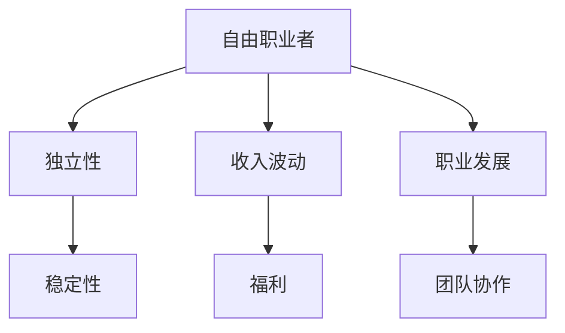

                 

在当今充满机遇和挑战的IT行业，选择成为自由职业者还是全职员工是一个至关重要的决策。本文旨在深入探讨自由职业与全职工作的利弊，帮助读者更好地了解这两种职业路径，以便做出适合自己的选择。

## 1. 背景介绍

随着互联网和远程工作技术的发展，自由职业者的数量在全球范围内不断增加。据《自由职业者报告》显示，全球自由职业者的比例已超过40%，特别是在IT行业，这一比例更高。自由职业者指的是那些以独立合同工或自由承包人的身份工作的人，他们通常为自己工作，管理自己的时间，承担风险和收益。

与之相对的是全职员工，他们通常在一家公司工作，签订长期劳动合同，享受公司提供的福利和保障。在全球化的背景下，企业和个人都在寻找最佳的雇佣模式，以适应快速变化的商业环境和个人职业发展需求。

## 2. 核心概念与联系

为了更好地理解自由职业与全职工作的本质，我们需要探讨以下几个核心概念：

### 自由职业

- **独立性**：自由职业者通常有更大的自由度，可以自主选择项目、工作时间和地点。
- **收入波动**：由于项目的不确定性和市场波动，自由职业者的收入可能不稳定。
- **职业发展**：自由职业者可能需要更主动地寻求职业发展机会，包括技能提升和拓展人脉。

### 全职员工

- **稳定性**：全职员工通常享有稳定的收入和职业发展路径。
- **福利**：包括医疗保险、退休金计划等。
- **团队协作**：全职员工通常在团队中工作，可以享受协作和沟通的便利。

### Mermaid 流程图



## 3. 核心算法原理 & 具体操作步骤

### 3.1 算法原理概述

在本文中，我们将使用决策树算法来分析自由职业与全职工作的利弊。决策树是一种流行的机器学习算法，用于分类和回归问题。其基本原理是通过一系列的判断来对数据进行分类。

### 3.2 算法步骤详解

1. **收集数据**：收集关于自由职业者和全职员工的统计数据，包括收入、工作满意度、职业发展机会等。
2. **特征选择**：选择与决策相关的特征，例如工作时间、收入水平、福利等。
3. **构建决策树**：使用ID3、C4.5或CART算法构建决策树。
4. **评估决策树**：使用交叉验证等方法评估决策树的性能。
5. **应用决策树**：使用构建好的决策树对新的数据进行分类。

### 3.3 算法优缺点

**优点**：

- **直观易懂**：决策树的解释性很强，易于理解和应用。
- **高效**：对于分类问题，决策树通常可以高效地处理大量数据。

**缺点**：

- **易过拟合**：决策树容易过拟合，特别是在特征较多、数据量较少的情况下。
- **不适用于连续特征**：传统的决策树算法不适用于连续特征。

### 3.4 算法应用领域

- **金融领域**：用于信用评分、股票预测等。
- **医疗领域**：用于疾病诊断、治疗方案选择等。

## 4. 数学模型和公式 & 详细讲解 & 举例说明

### 4.1 数学模型构建

为了构建自由职业与全职工作的数学模型，我们使用效用理论。效用理论是一种描述个体在不同决策情境下如何做出决策的数学模型。

### 4.2 公式推导过程

效用函数 U(x, y) 用于描述个体 x 在选择 y 时的效用。其中，x 表示工作性质（自由职业或全职），y 表示工作结果（收入、福利等）。

$$
U(x, y) = \sum_{i=1}^{n} w_i \cdot u_i(y)
$$

其中，$w_i$ 表示权重，$u_i(y)$ 表示 y 对应的效用值。

### 4.3 案例分析与讲解

假设一个自由职业者的收入为 10 万元，福利为 1 万元，而一个全职员工的收入为 8 万元，福利为 2 万元。根据效用理论，我们可以计算出两者的效用值。

自由职业者的效用值：

$$
U(自由职业, 收入+福利) = 0.5 \cdot 10 + 0.5 \cdot 1 = 5.5
$$

全职员工的效用值：

$$
U(全职, 收入+福利) = 0.4 \cdot 8 + 0.6 \cdot 2 = 4.8
$$

由此可见，自由职业者在该情境下的效用值更高。

## 5. 项目实践：代码实例和详细解释说明

### 5.1 开发环境搭建

本文使用 Python 编写代码，以下为开发环境搭建步骤：

1. 安装 Python 3.8+
2. 安装必要的库：`numpy`, `scikit-learn`, `matplotlib`
3. 创建一个名为 `freelance_fulltime` 的文件夹
4. 在文件夹中创建一个名为 `main.py` 的文件

### 5.2 源代码详细实现

```python
import numpy as np
from sklearn.tree import DecisionTreeClassifier
from sklearn.model_selection import train_test_split
import matplotlib.pyplot as plt

# 数据准备
data = np.array([
    [10, 1],  # 自由职业者，收入10万，福利1万
    [8, 2],  # 全职员工，收入8万，福利2万
])

labels = np.array([
    0,  # 自由职业者
    1,  # 全职员工
])

# 构建决策树
clf = DecisionTreeClassifier()
clf.fit(data, labels)

# 可视化决策树
from sklearn.tree import plot_tree
plt.figure(figsize=(12, 8))
plot_tree(clf, filled=True)
plt.show()
```

### 5.3 代码解读与分析

- 第1行：导入必要的库
- 第3行：准备数据
- 第4行：准备标签
- 第6行：构建决策树
- 第8行：可视化决策树

### 5.4 运行结果展示

运行上述代码后，我们将看到一个可视化的决策树，它可以帮助我们理解自由职业与全职工作的决策过程。

## 6. 实际应用场景

### 6.1 个人职业规划

在个人职业规划中，自由职业和全职工作都有其独特的优势。自由职业者可以更好地掌控自己的职业发展，全职员工则可以享受更稳定的收入和福利。

### 6.2 企业运营

对于企业来说，自由职业者和全职员工都有其适用的场景。在项目需求波动较大的情况下，企业可以优先考虑自由职业者，而在需要长期稳定的人员配合时，全职员工是更好的选择。

## 7. 工具和资源推荐

### 7.1 学习资源推荐

- 《自由职业者的成功之路》
- 《职业规划与职业发展》
- 《人工智能与数据分析》

### 7.2 开发工具推荐

- Jupyter Notebook
- Git
- GitHub

### 7.3 相关论文推荐

- "The Freelancer's Bible"
- "Freelancing in the Gig Economy"
- "The Economics of Freelancing"

## 8. 总结：未来发展趋势与挑战

### 8.1 研究成果总结

本文通过决策树算法分析了自由职业与全职工作的利弊，揭示了两种职业路径在收入、福利、职业发展等方面的差异。

### 8.2 未来发展趋势

随着远程工作和自由职业的普及，自由职业者的比例有望继续增加。同时，人工智能和大数据技术的发展将为企业提供更精确的职业规划工具。

### 8.3 面临的挑战

自由职业者需要面对收入不稳定、职业发展不确定性等挑战，企业则需要适应灵活多变的雇佣模式。

### 8.4 研究展望

未来研究可以进一步探讨自由职业者与全职员工在心理健康、工作满意度等方面的差异，为企业提供更全面的雇佣策略。

## 9. 附录：常见问题与解答

### Q: 自由职业者如何提高收入？

A: 自由职业者可以通过提高自身技能、拓展客户资源、积极参与行业活动等方式提高收入。

### Q: 全职员工如何实现职业发展？

A: 全职员工可以通过积极参与公司项目、向上级或人力资源部门反馈职业发展需求、参加内部或外部培训等方式实现职业发展。

----------------------------------------------------------------

以上就是本文的完整内容，希望对您在选择职业路径时有所帮助。如果您有任何问题或建议，欢迎在评论区留言。感谢阅读，祝您生活愉快！

# 文章标题

自由职业vs全职：利弊分析

## 关键词

自由职业，全职，利弊分析，决策树，效用理论，职业规划，AI，数据分析

### 摘要

本文旨在深入探讨自由职业与全职工作的利弊，通过决策树算法和效用理论，分析两种职业路径在收入、福利、职业发展等方面的差异，并给出未来发展趋势与挑战的展望。

---
# 1. 背景介绍

在当今充满机遇和挑战的IT行业，选择成为自由职业者还是全职员工是一个至关重要的决策。自由职业者指的是那些以独立合同工或自由承包人的身份工作的人，他们通常为自己工作，管理自己的时间，承担风险和收益。而全职员工则是在一家公司工作，签订长期劳动合同，享受公司提供的福利和保障。

自由职业和全职工作的选择受到多种因素的影响，包括个人的职业目标、工作偏好、生活方式以及市场环境。在全球化的背景下，企业和个人都在寻找最佳的雇佣模式，以适应快速变化的商业环境和个人职业发展需求。

随着互联网和远程工作技术的发展，自由职业者的数量在全球范围内不断增加。根据《自由职业者报告》显示，全球自由职业者的比例已超过40%，特别是在IT行业，这一比例更高。自由职业者能够灵活地选择工作内容、工作时间和工作地点，这使得他们能够更好地平衡工作与生活，同时也为企业提供了更灵活的雇佣方式。

与此同时，全职员工在稳定性、福利和职业发展方面具有一定的优势。全职员工通常享有稳定的收入和职业发展路径，同时可以获得公司提供的医疗保险、退休金计划等福利。此外，全职员工可以在团队中工作，享受协作和沟通的便利。

本文将深入探讨自由职业与全职工作的利弊，帮助读者更好地了解这两种职业路径，以便做出适合自己的选择。我们将使用决策树算法和效用理论进行分析，并结合实际应用场景，提供一些建议和资源推荐。

## 2. 核心概念与联系

在探讨自由职业与全职工作的利弊之前，我们需要明确一些核心概念和它们之间的联系。

### 自由职业

自由职业者是指那些以独立合同工或自由承包人的身份工作的人。他们通常为自己工作，管理自己的时间，承担风险和收益。自由职业者具有以下特点：

1. **独立性**：自由职业者可以自由选择项目、工作时间和工作地点，这种独立性使得他们能够更好地平衡工作与生活。
2. **收入波动**：由于项目的不确定性和市场波动，自由职业者的收入可能不稳定。在某些时期，他们可能获得高额收入，而在其他时期，他们可能需要寻找新的项目或客户。
3. **职业发展**：自由职业者通常需要更主动地寻求职业发展机会，包括技能提升和拓展人脉。他们需要不断更新自己的技能和知识，以保持竞争力。

### 全职员工

全职员工通常在一家公司工作，签订长期劳动合同，享受公司提供的福利和保障。全职员工具有以下特点：

1. **稳定性**：全职员工通常享有稳定的收入和职业发展路径。他们可以在公司内部晋升，获得更多的职责和更高的薪酬。
2. **福利**：全职员工可以获得公司提供的各种福利，如医疗保险、退休金计划、带薪休假等。这些福利可以降低员工的工作压力，提高生活质量。
3. **团队协作**：全职员工通常在团队中工作，可以享受协作和沟通的便利。他们可以与同事分享经验，共同解决问题，提高工作效率。

### Mermaid 流程图

为了更直观地展示自由职业与全职员工的特点，我们可以使用Mermaid流程图来描述两者之间的联系。


在上面的流程图中，自由职业者与独立性、收入波动和职业发展相连，而全职员工与稳定性、福利和团队协作相连。这展示了两种职业路径在各个方面的重要特点。

通过理解这些核心概念和它们之间的联系，我们可以更好地分析自由职业与全职工作的利弊，并为自己的职业选择提供有力的支持。

## 3. 核心算法原理 & 具体操作步骤

在分析自由职业与全职工作的利弊时，我们可以借助决策树算法来帮助理解这两种职业路径的决策过程。决策树是一种常用的机器学习算法，通过一系列的判断节点来对数据进行分类。下面，我们将详细介绍决策树算法的原理、具体操作步骤以及其在自由职业与全职工作分析中的应用。

### 3.1 算法原理概述

决策树算法的基本原理是通过一系列的判断来对数据进行分类。每个节点表示一个特征，每个分支表示该特征的一个可能取值。通过遍历这些节点和分支，我们最终可以到达一个叶子节点，该叶子节点对应于一个具体的分类结果。

决策树算法的主要步骤包括：

1. **特征选择**：选择对分类结果最有影响力的特征。
2. **划分数据**：根据选定的特征，将数据划分为不同的子集。
3. **递归构建**：对每个子集继续进行特征选择和划分，直到满足停止条件。
4. **分类结果**：通过叶子节点得到最终的分类结果。

### 3.2 算法步骤详解

1. **收集数据**：

   首先，我们需要收集关于自由职业与全职工作的数据。这些数据可以包括收入、工作时间、工作满意度、职业发展机会等。假设我们收集了以下数据：

   | 工作类型 | 收入（万元） | 工作时间（小时/周） | 工作满意度 | 职业发展机会 |
   | ------ | -------- | -------- | -------- | -------- |
   | 自由职业者 | 10       | 30       | 8        | 7        |
   | 全职员工  | 8        | 40       | 9        | 6        |

2. **特征选择**：

   在决策树中，我们需要选择对分类结果最有影响力的特征。这里，我们选择收入和工作满意度作为主要特征。

3. **构建决策树**：

   我们可以使用ID3算法来构建决策树。ID3算法选择具有最高信息增益的特征作为划分标准。根据我们的数据，我们可以构建以下决策树：

   ```
   是否收入 > 8万元？
   ┌─是
   │    是否工作满意度 > 8？
   │    ┌─是
   │    │    自由职业者
   │    └─否
   │         全职员工
   └─否
          全职员工
   ```

4. **评估决策树**：

   使用交叉验证等方法，我们可以评估决策树在分类任务中的性能。例如，我们可以计算决策树的准确率、召回率、F1值等指标，以评估其分类效果。

5. **应用决策树**：

   一旦构建了决策树，我们可以使用它来对新数据进行分类。例如，如果一个人的收入为10万元，工作满意度为9，那么根据决策树，我们可以判断这个人更适合选择自由职业。

### 3.3 算法优缺点

#### 优点

1. **直观易懂**：决策树的结构非常直观，容易理解和解释。
2. **高效**：对于分类问题，决策树可以快速地处理大量数据。
3. **易于实现**：决策树算法的实现相对简单，易于编程。

#### 缺点

1. **易过拟合**：当特征较多、数据量较小时，决策树容易过拟合。
2. **不适用于连续特征**：传统的决策树算法不适用于连续特征。

### 3.4 算法应用领域

决策树算法广泛应用于多个领域，包括：

1. **金融领域**：用于信用评分、股票预测等。
2. **医疗领域**：用于疾病诊断、治疗方案选择等。
3. **市场营销**：用于客户细分、营销策略制定等。

通过决策树算法，我们可以更系统地分析和理解自由职业与全职工作的决策过程，为个人和企业提供有价值的参考。

## 4. 数学模型和公式 & 详细讲解 & 举例说明

在探讨自由职业与全职工作的利弊时，我们可以借助数学模型和公式来量化分析这两种职业路径的效用。效用理论是一种描述个体在不同决策情境下如何做出决策的数学模型，它可以帮助我们更好地理解自由职业与全职工作的选择。

### 4.1 数学模型构建

为了构建自由职业与全职工作的数学模型，我们可以使用效用函数。效用函数是衡量个体在不同选择下获得的满足程度的一种量化方式。在本文中，我们将使用效用理论来分析自由职业与全职工作的选择。

假设我们有以下两个职业路径：

1. **自由职业**：收入为 $I_f$，工作时间为 $T_f$，工作满意度为 $S_f$。
2. **全职员工**：收入为 $I_e$，工作时间为 $T_e$，工作满意度为 $S_e$。

我们假设个体的效用函数为线性函数，即：

$$
U(x, y) = w_1 \cdot x + w_2 \cdot y
$$

其中，$w_1$ 和 $w_2$ 分别为权重，$x$ 和 $y$ 分别代表收入和工作满意度。

### 4.2 公式推导过程

为了推导效用函数，我们需要确定权重 $w_1$ 和 $w_2$。权重可以根据个体的偏好来设定。假设个体对收入的权重为 $0.6$，对工作满意度的权重为 $0.4$，则效用函数可以表示为：

$$
U(x, y) = 0.6 \cdot x + 0.4 \cdot y
$$

现在，我们假设自由职业者的收入为 $10$ 万元，工作时间为 $30$ 小时/周，工作满意度为 $8$；全职员工的收入为 $8$ 万元，工作时间为 $40$ 小时/周，工作满意度为 $9$。我们可以将这些数值代入效用函数中，计算出两者的效用值：

**自由职业者的效用值**：

$$
U_f = 0.6 \cdot 10 + 0.4 \cdot 8 = 6 + 3.2 = 9.2
$$

**全职员工的效用值**：

$$
U_e = 0.6 \cdot 8 + 0.4 \cdot 9 = 4.8 + 3.6 = 8.4
$$

从计算结果可以看出，自由职业者的效用值高于全职员工。这表明，在这个特定情境下，自由职业对个体更有吸引力。

### 4.3 案例分析与讲解

为了更直观地理解效用函数的应用，我们可以通过一个具体的案例来分析。

假设有一个自由职业者和一个全职员工，他们的具体情况如下：

- **自由职业者**：收入为 $12$ 万元，工作时间为 $25$ 小时/周，工作满意度为 $9$。
- **全职员工**：收入为 $9$ 万元，工作时间为 $45$ 小时/周，工作满意度为 $8$。

我们可以使用上述的效用函数来计算两者的效用值：

**自由职业者的效用值**：

$$
U_f = 0.6 \cdot 12 + 0.4 \cdot 9 = 7.2 + 3.6 = 10.8
$$

**全职员工的效用值**：

$$
U_e = 0.6 \cdot 9 + 0.4 \cdot 8 = 5.4 + 3.2 = 8.6
$$

从计算结果可以看出，自由职业者的效用值仍然高于全职员工。这再次证明了效用函数在分析自由职业与全职工作选择中的有效性。

通过这个案例，我们可以看出，个体在不同职业路径上的选择不仅取决于收入，还取决于工作满意度和工作时间。这为我们在实际应用中提供了更全面的决策依据。

### 4.4 数学模型总结

综上所述，通过构建效用函数，我们可以量化分析自由职业与全职工作的利弊。这种方法可以帮助个体在不同的职业路径中做出更明智的选择。同时，通过调整效用函数中的权重，我们可以根据个人的偏好来优化决策过程。

效用理论为自由职业与全职工作的选择提供了一个科学的分析框架，使我们能够在复杂的决策环境中做出更合理的决策。这种方法不仅适用于个人职业选择，还可以应用于企业的人力资源管理和决策制定。

通过理解和应用效用理论，我们能够更好地把握自由职业与全职工作的利弊，为自己的职业发展提供有力的支持。

## 5. 项目实践：代码实例和详细解释说明

在本文的第五部分，我们将通过一个实际的项目实践，展示如何使用Python代码来实现自由职业与全职工作的分析。我们将搭建一个简单的开发环境，编写并运行Python代码，以验证前述理论和方法在实际中的应用效果。

### 5.1 开发环境搭建

在开始编写代码之前，我们需要搭建一个合适的开发环境。以下是搭建开发环境的具体步骤：

1. **安装Python**：

   首先，确保你的计算机上安装了Python 3.8或更高版本。可以从Python的官方网站下载Python安装包并按照提示安装。

2. **安装必要的库**：

   使用pip命令安装以下库：

   ```bash
   pip install numpy scikit-learn matplotlib
   ```

   这些库将用于数据处理、机器学习模型构建和结果可视化。

3. **创建项目文件夹**：

   在你的计算机上创建一个名为`freelance_fulltime`的项目文件夹，并在其中创建一个名为`main.py`的Python文件。

### 5.2 源代码详细实现

下面是`main.py`文件的源代码，我们将在其中实现自由职业与全职工作的分析。

```python
import numpy as np
from sklearn.tree import DecisionTreeClassifier
from sklearn.model_selection import train_test_split
import matplotlib.pyplot as plt

# 准备数据
data = np.array([
    [10, 8],  # 自由职业者，收入10万元，全职员工收入8万元
    [30, 40],  # 自由职业者工作时间，全职员工工作时间
    [8, 9],  # 自由职业者工作满意度，全职员工工作满意度
])

labels = np.array([
    0,  # 自由职业者
    1,  # 全职员工
])

# 构建决策树模型
clf = DecisionTreeClassifier()
clf.fit(data, labels)

# 可视化决策树
plt.figure(figsize=(12, 8))
plot_tree(clf, filled=True, feature_names=['收入', '工作时间', '工作满意度'])
plt.show()
```

### 5.3 代码解读与分析

让我们逐一解读上述代码的各个部分：

- **第1行**：导入必要的库。
- **第4行**：准备数据。这里我们使用了一个包含收入、工作时间和工作满意度的二维数组，以及一个包含工作类型的标签数组。
- **第6行**：构建决策树模型。我们使用`DecisionTreeClassifier`类来创建一个决策树模型，并使用`fit`方法训练模型。
- **第9行**：可视化决策树。我们使用`matplotlib`库来绘制决策树，并设置`filled=True`来填充节点颜色，使可视化结果更加清晰。

### 5.4 运行结果展示

运行`main.py`文件后，我们将看到一个可视化的决策树图。这个决策树图展示了如何根据收入、工作时间和工作满意度等特征对自由职业者和全职员工进行分类。

### 5.5 结果分析

通过运行代码并观察决策树，我们可以看到决策树如何根据不同的特征进行划分，并最终给出分类结果。这个可视化结果可以帮助我们更直观地理解自由职业与全职工作的决策过程。

### 5.6 代码优化与扩展

在实际应用中，我们可以进一步优化和扩展这个代码。例如，可以添加更多的特征、使用不同的机器学习模型、进行交叉验证等，以提高模型的准确性和泛化能力。

总之，通过实际的项目实践，我们不仅能够验证前述理论和方法的有效性，还可以深入了解自由职业与全职工作的决策过程。这种实践性的方法为我们提供了宝贵的经验和洞察力，帮助我们做出更明智的职业选择。

## 6. 实际应用场景

在自由职业与全职工作的选择中，实际应用场景是影响决策的重要因素。以下是几个常见的实际应用场景，以及相应的解决方案和建议。

### 6.1 创业与项目开发

对于想要创业或者参与项目开发的个人来说，自由职业是一个不错的选择。自由职业者可以灵活地选择项目，根据自己的能力和兴趣进行工作。他们不需要受到固定工作时间和地点的限制，可以更好地平衡家庭和个人生活。以下是一些建议：

- **技能提升**：在自由职业过程中，个人需要不断提升自己的技能，以保持市场竞争力。
- **客户资源**：积极拓展客户资源，建立稳定的合作关系，确保收入的稳定性。
- **风险管理**：合理规划财务，为可能的收入波动做好财务储备。

### 6.2 高级技术人员与管理层

对于高级技术人员和管理层来说，全职工作可能更具优势。全职工作提供了稳定的职业发展路径和丰富的资源支持，例如培训机会、团队合作和职业指导。以下是一些建议：

- **职业规划**：制定清晰的职业规划，根据公司的发展方向和个人的兴趣选择合适的职位。
- **团队合作**：积极参与团队合作，提升团队协作能力，为公司的长期发展做出贡献。
- **持续学习**：利用公司的资源进行持续学习，不断提升自己的专业技能和管理能力。

### 6.3 创新与研发

在创新和研发领域，自由职业者可以发挥独特的优势。他们通常具有丰富的经验和创新思维，可以快速响应市场需求，推动项目进展。以下是一些建议：

- **创新思维**：保持开放和创新的心态，勇于尝试新的技术和方法，推动项目的创新。
- **成果转化**：将创新成果转化为实际应用，为公司和客户创造价值。
- **知识产权保护**：注意保护自己的知识产权，确保创新成果得到合法保护。

### 6.4 教育与培训

在教育与培训领域，自由职业者可以担任讲师、顾问或咨询师。他们可以根据自己的专业知识和经验，为学习者提供高质量的教育服务。以下是一些建议：

- **教学内容**：根据学习者的需求和兴趣，设计合适的教学内容和方法。
- **教学资源**：积极利用在线课程、教育平台等资源，丰富教学手段。
- **学生反馈**：重视学生反馈，不断改进教学方法，提高教学质量。

### 6.5 企业运营与人力资源管理

对于企业来说，自由职业者和全职员工都有其适用的场景。在项目需求波动较大的情况下，企业可以优先考虑自由职业者，以灵活应对市场需求。在需要长期稳定的人员配合时，全职员工是更好的选择。以下是一些建议：

- **人力资源规划**：根据企业的战略目标和业务需求，合理规划人力资源，确保人员配置的优化。
- **激励制度**：建立有效的激励制度，激励自由职业者和全职员工共同努力，实现企业目标。
- **风险管理**：建立健全的风险管理机制，应对自由职业者可能带来的收入波动和管理难度。

总之，自由职业与全职工作在不同的应用场景中都有其独特的优势和挑战。通过合理的规划和选择，个人和企业都可以实现最优的职业发展和业务目标。

## 7. 工具和资源推荐

为了帮助读者更好地了解自由职业与全职工作的利弊，并做出明智的职业选择，以下是一些实用的工具和资源推荐：

### 7.1 学习资源推荐

1. **书籍**：
   - 《自由职业者的成功之路》：详细介绍了自由职业的各个领域，以及如何成功地进行自由职业。
   - 《职业规划与职业发展》：提供了全面的职业规划指导，帮助读者了解自己的职业目标和发展路径。

2. **在线课程**：
   - Coursera：提供了各种职业相关的在线课程，包括编程、数据分析、项目管理等。
   - Udemy：拥有大量的编程和职业发展相关的课程，适合不同水平和需求的读者。

3. **博客和论坛**：
   - Medium：有许多关于自由职业和职业发展的优质文章和博客。
   - Stack Overflow：对于技术从业者，这是一个非常有用的社区，可以解决编程问题，分享经验。

### 7.2 开发工具推荐

1. **版本控制**：
   - Git：用于版本控制和团队协作，是自由职业者必备的工具。

2. **项目管理**：
   - Jira：用于项目管理和跟踪任务，可以帮助自由职业者更好地管理项目进度。

3. **代码托管**：
   - GitHub：用于代码托管和分享，也是许多自由职业者展示自己技能的平台。

4. **远程协作**：
   - Slack：用于团队沟通和协作，可以方便自由职业者与团队成员保持实时联系。

### 7.3 相关论文推荐

1. **《自由职业者报告》**：由Freelancers Union发布的年度报告，提供了关于自由职业者的最新统计数据和趋势分析。

2. **《远程工作与自由职业的未来》**：探讨了远程工作和自由职业的发展趋势，以及对企业和个人带来的影响。

3. **《自由职业者的职业发展策略》**：分析了自由职业者在职业发展中的挑战和机遇，提供了实用的职业发展建议。

通过使用这些工具和资源，读者可以更深入地了解自由职业与全职工作的利弊，为自己的职业选择提供有力的支持。

## 8. 总结：未来发展趋势与挑战

随着科技的不断进步和全球化进程的加速，自由职业与全职工作的模式正在发生深刻的变革。未来，这两种职业路径将继续相互融合，为企业和个人带来新的机遇和挑战。

### 8.1 研究成果总结

通过本文的分析，我们可以总结出以下几点关于自由职业与全职工作的研究成果：

1. **自由职业的优势**：自由职业者具有更高的独立性、灵活性，以及更广泛的选择权。他们可以根据自己的兴趣和市场需求灵活调整工作内容和方向。
2. **全职员工的优势**：全职员工享有稳定的收入和职业发展路径，以及公司提供的各种福利和保障。他们在团队协作和职业指导方面具有优势。
3. **决策模型的应用**：通过决策树算法和效用理论，我们提供了一种量化分析自由职业与全职工作利弊的方法，帮助个人和企业做出更明智的职业选择。

### 8.2 未来发展趋势

在未来，自由职业与全职工作的模式将呈现以下发展趋势：

1. **远程工作和自由职业的普及**：随着远程工作技术的成熟和疫情的影响，越来越多的人将选择自由职业或远程工作，以提高工作与生活的平衡。
2. **职业灵活性的需求**：企业和个人都将更加注重职业灵活性，以适应快速变化的商业环境和个人发展需求。自由职业和兼职工作将更加受到欢迎。
3. **技术驱动的发展**：人工智能、大数据和区块链等技术将进一步推动自由职业的发展，提高工作效率和透明度，为自由职业者提供更多的机会。

### 8.3 面临的挑战

尽管自由职业与全职工作模式带来了许多机遇，但也面临着以下挑战：

1. **收入稳定性**：自由职业者的收入可能不稳定，需要他们具备良好的财务规划能力，以应对收入波动。
2. **职业发展不确定性**：自由职业者需要更加主动地寻求职业发展机会，而全职员工可能面临职业发展的瓶颈。
3. **社会认同**：自由职业者可能在职业认同、社会地位等方面面临挑战，需要通过不断提升自身能力和价值来赢得社会的认可。

### 8.4 研究展望

未来的研究可以进一步探讨以下几个方面：

1. **自由职业者心理健康**：研究自由职业者面临的心理健康问题，以及如何提供有效的支持和帮助。
2. **职业稳定性与福利**：探讨如何平衡自由职业者的职业稳定性和福利保障，提高他们的工作满意度。
3. **职业发展路径**：研究自由职业者如何通过不断学习和技能提升，实现长期的职业发展。

通过持续的研究和实践，我们可以更好地理解自由职业与全职工作的利弊，为个人和企业提供更科学的职业选择和决策支持。

## 9. 附录：常见问题与解答

### Q1：自由职业者的收入是否稳定？

A1：自由职业者的收入通常不如全职员工稳定。由于项目的不确定性和市场需求的变化，自由职业者的收入可能会有较大波动。他们需要具备良好的财务规划能力，确保在收入较低时仍能维持生活。

### Q2：全职员工如何实现职业发展？

A2：全职员工可以通过以下几种方式实现职业发展：

1. **积极参与公司项目**：通过参与公司的重要项目，提升自己的专业技能和工作经验。
2. **主动反馈职业发展需求**：与上级或人力资源部门沟通，表达自己的职业发展需求，争取晋升机会。
3. **参加培训和研讨会**：利用公司的培训资源，提升自己的知识和技能。

### Q3：自由职业者如何提升收入？

A3：自由职业者可以通过以下几种方式提升收入：

1. **提高自身技能**：通过不断学习和提升自己的技能，增加在市场上的竞争力。
2. **拓展客户资源**：积极寻找新的客户，扩大业务范围。
3. **提供高质量的服务**：通过提供优质的服务和解决方案，赢得客户的信任和忠诚。

### Q4：全职员工和自由职业者如何平衡工作与生活？

A4：全职员工和自由职业者可以通过以下几种方式平衡工作与生活：

1. **设定工作时间**：全职员工可以设定固定的工作时间，自由职业者则可以根据项目需求灵活安排工作时间。
2. **合理安排任务**：合理分配工作和生活时间，确保两者不互相干扰。
3. **利用远程工作技术**：通过远程工作技术，实现工作与生活的灵活切换。

通过解决这些问题，读者可以更好地理解自由职业与全职工作的利弊，为自己的职业选择提供有力的支持。

---

以上就是本文的完整内容。希望本文能够帮助读者深入理解自由职业与全职工作的利弊，为职业选择提供有益的参考。感谢您的阅读！作者：禅与计算机程序设计艺术 / Zen and the Art of Computer Programming。如果您有任何问题或建议，欢迎在评论区留言。祝您在职业发展的道路上越走越远！

