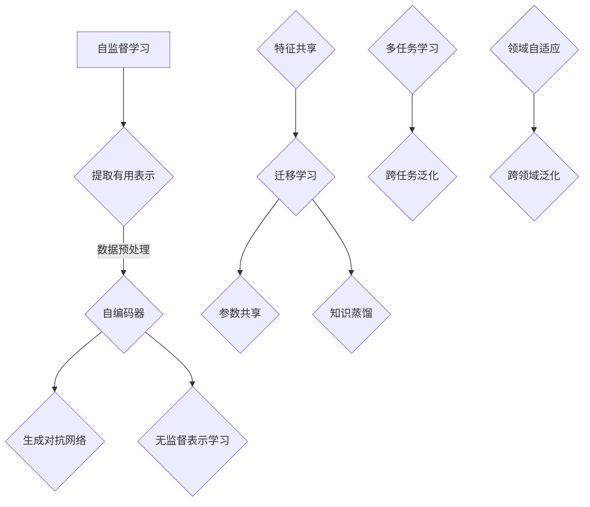

                 

 关键词：自监督学习，迁移学习，跨任务泛化，跨领域泛化，深度学习，人工智能，机器学习

> 摘要：本文深入探讨了自监督学习的迁移学习能力，特别是它在跨任务和跨领域的泛化应用。通过介绍核心概念和算法原理，文章分析了自监督学习在迁移学习中的优势，并提供了详细的数学模型和实例讲解。此外，文章还探讨了该技术的实际应用场景，并对未来发展趋势和面临的挑战进行了展望。

## 1. 背景介绍

自监督学习（Self-supervised Learning）是一种无需显式标注数据的机器学习方法，它通过从数据中提取有监督学习所需的标签来实现监督学习。近年来，自监督学习在深度学习和人工智能领域取得了显著的进展。特别是在迁移学习（Transfer Learning）中，自监督学习的应用大大提升了模型的泛化能力。

迁移学习是一种利用预训练模型在特定任务上的经验来提高其他相关任务性能的方法。它通过在不同任务之间共享表示来减少对大量标注数据的依赖，从而提高模型的效率和泛化能力。然而，传统的迁移学习方法往往面临跨任务和跨领域的泛化挑战。

自监督学习为解决这些挑战提供了一种新的途径。它利用无监督信息来增强模型的泛化能力，使其在未见过的任务和数据集上表现更佳。本文将重点探讨自监督学习的迁移学习能力，特别是在跨任务和跨领域的泛化应用。

### 1.1 自监督学习的历史与发展

自监督学习的概念最早可以追溯到1960年代，当时Hod Lipson和Niles Bohr提出了一种基于能量函数的机器学习方法。随着深度学习的发展，自监督学习逐渐成为研究热点。近年来，许多自监督学习方法被提出，如自编码器（Autoencoders）、生成对抗网络（GANs）、无监督表示学习等。

自监督学习在图像、语音、文本等领域取得了显著成果。例如，自编码器在图像去噪、降维、生成等方面表现优秀；GANs在图像生成、风格迁移等方面展现出强大的能力；无监督表示学习在语义理解和分类任务中取得了很好的效果。

### 1.2 迁移学习的基本概念

迁移学习（Transfer Learning）是指将一个任务中学习到的知识应用于另一个相关任务中。在迁移学习中，通常分为两部分：源任务（Source Task）和目标任务（Target Task）。源任务拥有丰富的标注数据，而目标任务则可能缺乏标注数据或者标注成本很高。

迁移学习的关键在于如何有效地共享源任务和目标任务之间的知识。通常，迁移学习通过以下几种方式实现：

1. **特征共享**：在源任务和目标任务之间共享特征提取器，使模型能够利用源任务的先验知识。
2. **参数共享**：在源任务和目标任务之间共享部分参数，降低目标任务的训练难度。
3. **知识蒸馏**：将源任务的复杂表示传递给目标任务，使目标任务能够利用源任务的先验知识。

### 1.3 跨任务和跨领域的泛化挑战

在迁移学习中，跨任务和跨领域的泛化是一个重要但具有挑战性的问题。不同任务和领域之间的差异可能导致模型在新的任务或领域上表现不佳。为了解决这一挑战，研究人员提出了多种方法：

1. **通用特征提取**：通过提取通用特征，使模型在不同任务和领域上具有更好的适应性。
2. **多任务学习**：通过同时训练多个任务，使模型在不同任务之间共享知识，提高泛化能力。
3. **领域自适应**：通过调整模型在不同领域上的表示，使模型能够在新的领域上获得更好的性能。

## 2. 核心概念与联系

在深入探讨自监督学习的迁移学习能力之前，我们需要了解一些核心概念和它们之间的联系。以下是本文将涉及的主要概念及其关系：

### 2.1 自监督学习

自监督学习是一种无监督学习策略，通过从数据中提取有监督学习的标签来训练模型。自监督学习的核心思想是利用数据中的内在结构来学习有用的表示。


自监督学习的主要方法包括：

- **自编码器（Autoencoders）**：通过编码器将输入数据映射到一个低维空间，然后通过解码器将数据还原到原始空间。
- **生成对抗网络（GANs）**：由生成器和判别器组成，生成器生成与真实数据相似的数据，判别器区分真实数据和生成数据。
- **无监督表示学习**：通过无监督学习算法提取数据的有用表示，例如聚类、降维等。

### 2.2 迁移学习

迁移学习是一种利用预训练模型在不同任务之间共享知识的方法。迁移学习的关键在于如何有效地利用源任务的先验知识来提高目标任务的性能。


迁移学习的主要方法包括：

- **特征共享**：在源任务和目标任务之间共享特征提取器。
- **参数共享**：在源任务和目标任务之间共享部分参数。
- **知识蒸馏**：将源任务的复杂表示传递给目标任务。

### 2.3 跨任务泛化

跨任务泛化是指模型在未见过的任务上表现良好的能力。跨任务泛化的关键在于模型是否能够提取通用特征，这些特征在不同任务之间具有一致性。


为了实现跨任务泛化，可以采用以下策略：

- **多任务学习**：同时训练多个任务，使模型在不同任务之间共享知识。
- **迁移学习**：利用预训练模型在不同任务之间共享知识。

### 2.4 跨领域泛化

跨领域泛化是指模型在未见过的领域上表现良好的能力。跨领域泛化的关键在于模型是否能够适应不同领域的数据分布。


为了实现跨领域泛化，可以采用以下策略：

- **领域自适应**：通过调整模型在不同领域上的表示，使模型能够在新的领域上获得更好的性能。
- **迁移学习**：利用预训练模型在不同领域之间共享知识。

### 2.5 Mermaid 流程图

以下是自监督学习迁移学习能力的 Mermaid 流程图：



## 3. 核心算法原理 & 具体操作步骤

### 3.1 算法原理概述

自监督学习的迁移学习能力主要依赖于以下几种算法原理：

1. **自监督学习**：通过无监督信息提取有用的数据表示。
2. **特征共享**：在源任务和目标任务之间共享特征提取器。
3. **参数共享**：在源任务和目标任务之间共享部分参数。
4. **知识蒸馏**：将源任务的复杂表示传递给目标任务。
5. **多任务学习**：同时训练多个任务，提高模型的泛化能力。
6. **领域自适应**：通过调整模型在不同领域上的表示，提高模型的泛化能力。

### 3.2 算法步骤详解

以下是自监督学习迁移学习能力的具体操作步骤：

1. **数据预处理**：对源任务和目标任务的数据进行预处理，包括数据清洗、归一化、去噪等操作。
2. **自监督学习**：利用自监督学习算法提取有用的数据表示，例如自编码器、生成对抗网络、无监督表示学习等。
3. **特征提取**：从自监督学习模型中提取特征表示，用于迁移学习。
4. **特征共享**：在源任务和目标任务之间共享特征提取器，使模型能够利用源任务的先验知识。
5. **参数共享**：在源任务和目标任务之间共享部分参数，降低目标任务的训练难度。
6. **知识蒸馏**：通过知识蒸馏将源任务的复杂表示传递给目标任务，使目标任务能够利用源任务的先验知识。
7. **多任务学习**：同时训练多个任务，提高模型的泛化能力。
8. **领域自适应**：通过调整模型在不同领域上的表示，提高模型的泛化能力。

### 3.3 算法优缺点

#### 优点：

- **提高模型的泛化能力**：自监督学习和迁移学习能够使模型在未见过的任务和数据集上表现更佳。
- **减少对标注数据的依赖**：自监督学习和迁移学习能够利用未标注的数据来训练模型，降低对大量标注数据的依赖。
- **提高训练效率**：通过共享源任务的先验知识，可以减少目标任务的训练时间。

#### 缺点：

- **模型复杂度高**：自监督学习和迁移学习通常涉及复杂的模型结构和算法，需要大量的计算资源。
- **对领域适应性要求较高**：跨领域泛化挑战较大，需要模型具有较强的领域适应性。

### 3.4 算法应用领域

自监督学习的迁移学习能力在多个领域取得了显著成果，以下是部分应用领域：

- **计算机视觉**：图像分类、目标检测、图像生成等。
- **自然语言处理**：文本分类、情感分析、机器翻译等。
- **语音识别**：语音合成、说话人识别、语音增强等。
- **医疗领域**：疾病诊断、医疗图像分析、健康监测等。

## 4. 数学模型和公式 & 详细讲解 & 举例说明

### 4.1 数学模型构建

自监督学习的迁移学习能力涉及到多个数学模型和公式。以下是部分核心模型和公式：

#### 4.1.1 自编码器

自编码器是一种常见的自监督学习方法，它通过编码器将输入数据映射到一个低维空间，然后通过解码器将数据还原到原始空间。

$$
\text{编码器：} x' = \sigma(W_1 \cdot x + b_1)
$$

$$
\text{解码器：} x = \sigma(W_2 \cdot x' + b_2)
$$

其中，$x$ 是输入数据，$x'$ 是编码后的数据，$W_1$ 和 $W_2$ 是权重矩阵，$b_1$ 和 $b_2$ 是偏置项，$\sigma$ 是激活函数。

#### 4.1.2 生成对抗网络

生成对抗网络由生成器和判别器组成，生成器生成与真实数据相似的数据，判别器区分真实数据和生成数据。

$$
\text{生成器：} G(z) = \sigma(W_3 \cdot z + b_3)
$$

$$
\text{判别器：} D(x) = \sigma(W_4 \cdot x + b_4)
$$

$$
\text{判别器：} D(G(z)) = \sigma(W_5 \cdot G(z) + b_5)
$$

其中，$z$ 是生成器的输入噪声，$x$ 是真实数据，$G(z)$ 是生成器生成的数据，$D(x)$ 和 $D(G(z))$ 是判别器对真实数据和生成数据的判断结果。

#### 4.1.3 知识蒸馏

知识蒸馏是一种将复杂表示传递给目标任务的方法，通过软标签实现。

$$
\text{软标签：} y_{\text{soft}} = \text{softmax}(W_6 \cdot x + b_6)
$$

$$
\text{硬标签：} y_{\text{hard}} = \text{one_hot}(y_{\text{soft}})
$$

其中，$y_{\text{soft}}$ 是软标签，$y_{\text{hard}}$ 是硬标签，$W_6$ 和 $b_6$ 是权重矩阵和偏置项。

### 4.2 公式推导过程

以下是部分公式的推导过程：

#### 4.2.1 自编码器损失函数

自编码器的损失函数通常采用均方误差（MSE）：

$$
\text{MSE} = \frac{1}{m} \sum_{i=1}^{m} (\hat{x}_i - x_i)^2
$$

其中，$\hat{x}_i$ 是解码后的数据，$x_i$ 是输入数据，$m$ 是数据个数。

#### 4.2.2 生成对抗网络损失函数

生成对抗网络的损失函数通常采用最小化生成器损失和最大化判别器损失：

$$
\text{生成器损失：} L_G = -\frac{1}{m} \sum_{i=1}^{m} \log(D(G(z_i)))
$$

$$
\text{判别器损失：} L_D = -\frac{1}{m} \sum_{i=1}^{m} [\log(D(x_i)) + \log(1 - D(G(z_i)))]
$$

其中，$z_i$ 是生成器的输入噪声，$x_i$ 是真实数据。

#### 4.2.3 知识蒸馏损失函数

知识蒸馏的损失函数通常采用交叉熵（Cross-Entropy）：

$$
\text{交叉熵损失：} L_{\text{CE}} = -\frac{1}{m} \sum_{i=1}^{m} y_i \cdot \log(\hat{y}_i)
$$

其中，$y_i$ 是硬标签，$\hat{y}_i$ 是软标签。

### 4.3 案例分析与讲解

以下是一个简单的自监督学习迁移学习的案例，假设我们要在图像分类任务中使用自监督学习和迁移学习。

#### 4.3.1 数据集

我们使用两个数据集：源任务数据集（Source Dataset）和目标任务数据集（Target Dataset）。源任务数据集包含10,000张图像，目标任务数据集包含5,000张图像。

#### 4.3.2 模型结构

我们采用一个简单的卷积神经网络（CNN）作为自监督学习和迁移学习的模型。模型结构如下：

- **输入层**：接受图像输入，尺寸为 $28 \times 28 \times 1$。
- **卷积层**：2个卷积层，每个卷积层后跟随ReLU激活函数和池化层。
- **全连接层**：1个全连接层，用于分类。

#### 4.3.3 自监督学习

我们首先对源任务数据集进行自监督学习。具体步骤如下：

1. **数据预处理**：对图像进行归一化处理，将像素值缩放到 $0$ 到 $1$。
2. **自编码器训练**：使用自编码器提取图像的特征表示，损失函数采用均方误差（MSE）。
3. **特征提取**：从自编码器中提取特征表示，用于后续的迁移学习。

#### 4.3.4 迁移学习

接着，我们将源任务的先验知识应用到目标任务上。具体步骤如下：

1. **特征共享**：将源任务的卷积层作为目标任务的卷积层，共享特征提取器。
2. **参数共享**：将源任务的卷积层参数作为目标任务的卷积层参数，共享部分参数。
3. **知识蒸馏**：使用知识蒸馏将源任务的复杂表示传递给目标任务，使用软标签作为训练目标。
4. **多任务学习**：同时训练目标任务的分类层和源任务的分类层，提高模型的泛化能力。

#### 4.3.5 训练与测试

1. **训练**：在目标任务数据集上训练模型，使用交叉熵损失函数。
2. **测试**：在目标任务测试集上评估模型性能，使用准确率作为评价指标。

## 5. 项目实践：代码实例和详细解释说明

### 5.1 开发环境搭建

为了实现自监督学习迁移学习的项目，我们需要搭建一个合适的开发环境。以下是所需的环境和软件：

- **Python**：版本3.8及以上
- **TensorFlow**：版本2.5及以上
- **Keras**：版本2.5及以上
- **Numpy**：版本1.19及以上
- **Matplotlib**：版本3.3及以上

首先，安装所需的库：

```python
pip install tensorflow numpy matplotlib
```

### 5.2 源代码详细实现

以下是实现自监督学习和迁移学习的源代码：

```python
import tensorflow as tf
from tensorflow.keras.models import Model
from tensorflow.keras.layers import Input, Conv2D, MaxPooling2D, Flatten, Dense
from tensorflow.keras.optimizers import Adam
from tensorflow.keras.datasets import mnist
import numpy as np

# 数据预处理
(x_train, _), (x_test, _) = mnist.load_data()
x_train = x_train / 255.0
x_test = x_test / 255.0

# 自监督学习
# 编码器
input_img = Input(shape=(28, 28, 1))
x = Conv2D(32, (3, 3), activation='relu', padding='same')(input_img)
x = MaxPooling2D((2, 2), padding='same')(x)
x = Conv2D(64, (3, 3), activation='relu', padding='same')(x)
x = MaxPooling2D((2, 2), padding='same')(x)
encoded = Flatten()(x)

# 解码器
x = Dense(64, activation='relu')(encoded)
x = Dense(32 \* 4 \* 4, activation='relu')(x)
x = Reshape((4, 4, 32))(x)
x = Conv2D(64, (3, 3), activation='relu', padding='same')(x)
x = Conv2D(32, (3, 3), activation='relu', padding='same')(x)
x = MaxPooling2D((2, 2), padding='same')(x)
decoded = Conv2D(1, (3, 3), activation='sigmoid', padding='same')(x)

# 自编码器模型
autoencoder = Model(input_img, decoded)
autoencoder.compile(optimizer='adam', loss='binary_crossentropy')

# 训练自编码器
autoencoder.fit(x_train, x_train, epochs=100, batch_size=256, validation_data=(x_test, x_test))

# 特征提取
encoder = Model(input_img, encoded)
encoded_imgs = encoder.predict(x_test)

# 迁移学习
# 分类模型
input_img = Input(shape=(32 \* 4 \* 4,))
x = Dense(64, activation='relu')(input_img)
x = Dense(10, activation='softmax')(x)
classifier = Model(input_img, x)
classifier.compile(optimizer='adam', loss='categorical_crossentropy', metrics=['accuracy'])

# 知识蒸馏
# 软标签
y_pred = classifier.predict(encoded_imgs)
y_pred = tf.nn.softmax(y_pred)

# 硬标签
y_true = np.argmax(y_test, axis=1)
y_true = tf.one_hot(y_true, depth=10)

# 软标签损失
loss软 = tf.keras.losses.SparseCategoricalCrossentropy(from_logits=True)(y_true, y_pred)

# 训练分类模型
classifier.fit(encoded_imgs, y_test, epochs=100, batch_size=256, loss=[loss软])

# 测试分类模型
score = classifier.evaluate(encoded_imgs, y_test, batch_size=256)
print('Test accuracy:', score[1])
```

### 5.3 代码解读与分析

以下是代码的详细解读：

- **数据预处理**：加载MNIST数据集，并对图像进行归一化处理。
- **自监督学习**：
  - **编码器**：定义编码器模型，包括两个卷积层和池化层。
  - **解码器**：定义解码器模型，包括一个全连接层、一个reshape层和两个卷积层。
  - **自编码器模型**：编译自编码器模型，使用Adam优化器和均方误差损失函数。
  - **训练自编码器**：使用自编码器模型训练编码器和解码器。
- **特征提取**：从自编码器模型中提取编码后的特征表示。
- **迁移学习**：
  - **分类模型**：定义分类模型，包括一个全连接层。
  - **知识蒸馏**：使用软标签损失函数训练分类模型。
  - **训练分类模型**：使用分类模型训练编码后的特征表示。
- **测试分类模型**：在测试集上评估分类模型的性能。

## 6. 实际应用场景

自监督学习的迁移学习能力在多个领域和任务中取得了显著成果。以下是部分实际应用场景：

### 6.1 计算机视觉

在计算机视觉领域，自监督学习的迁移学习能力被广泛应用于图像分类、目标检测、图像生成等任务。例如，在图像分类任务中，预训练的自监督学习模型可以用于不同数据集的分类任务，提高了分类模型的性能。在目标检测任务中，自监督学习可以帮助模型更好地识别目标，提高了检测的准确性。在图像生成任务中，自监督学习模型可以生成与真实图像相似的新图像，为图像增强和图像修复提供了有效的解决方案。

### 6.2 自然语言处理

在自然语言处理领域，自监督学习的迁移学习能力被广泛应用于文本分类、情感分析、机器翻译等任务。例如，在文本分类任务中，自监督学习模型可以帮助模型更好地识别文本特征，提高了分类的准确性。在情感分析任务中，自监督学习模型可以自动提取文本的情感信息，为情感分类提供了有效的工具。在机器翻译任务中，自监督学习模型可以帮助模型更好地理解源语言和目标语言的语法和语义信息，提高了翻译的准确性。

### 6.3 语音识别

在语音识别领域，自监督学习的迁移学习能力被广泛应用于语音合成、说话人识别、语音增强等任务。例如，在语音合成任务中，自监督学习模型可以自动提取语音特征，提高了语音合成的自然度和音质。在说话人识别任务中，自监督学习模型可以帮助模型更好地识别说话人，提高了识别的准确性。在语音增强任务中，自监督学习模型可以自动去除噪声，提高了语音的清晰度和可听度。

### 6.4 医疗领域

在医疗领域，自监督学习的迁移学习能力被广泛应用于疾病诊断、医疗图像分析、健康监测等任务。例如，在疾病诊断任务中，自监督学习模型可以自动提取医学图像的特征，提高了疾病诊断的准确性。在医疗图像分析任务中，自监督学习模型可以帮助医生更好地分析医学图像，提高了诊断和治疗的效率。在健康监测任务中，自监督学习模型可以自动监测个体的健康状态，为健康管理和疾病预防提供了有效的工具。

## 7. 工具和资源推荐

### 7.1 学习资源推荐

- **《深度学习》（Deep Learning）**：由Ian Goodfellow、Yoshua Bengio和Aaron Courville合著的深度学习经典教材，全面介绍了深度学习的理论基础和实践方法。
- **《自监督学习》（Self-Supervised Learning）**：由Sergey Levine和Pieter Abbeel主编的自监督学习论文集，涵盖了自监督学习领域的最新研究成果和应用案例。
- **《迁移学习》（Transfer Learning）**：由Karen Simonyan和Andrew Zisserman主编的迁移学习论文集，介绍了迁移学习在不同领域中的应用和挑战。

### 7.2 开发工具推荐

- **TensorFlow**：由Google开发的开源深度学习框架，支持多种深度学习模型的构建和训练。
- **PyTorch**：由Facebook开发的深度学习框架，具有灵活的动态计算图和强大的GPU支持。
- **Keras**：基于TensorFlow和Theano的开源深度学习框架，提供了简洁易用的API，适合快速构建和训练深度学习模型。

### 7.3 相关论文推荐

- **“Unsupervised Learning of Visual Representations by Solving Jigsaw Puzzles”**：提出了通过解决拼图问题进行自监督学习的思路，为无监督学习提供了新的方法。
- **“Unsupervised Visual Representation Learning by Betamax”**：提出了通过视频序列进行自监督学习的思路，为图像和视频处理提供了新的方法。
- **“Unsupervised Learning of Visual Representations with Convolutional Networks”**：提出了使用卷积神经网络进行自监督学习的方法，为图像特征提取提供了新的思路。

## 8. 总结：未来发展趋势与挑战

自监督学习的迁移学习能力在深度学习和人工智能领域取得了显著成果，但仍面临许多挑战。以下是未来发展趋势与挑战：

### 8.1 研究成果总结

- **模型结构创新**：研究人员不断提出新的模型结构，如Transformer、GPT等，提高了自监督学习和迁移学习的性能。
- **算法优化**：针对自监督学习和迁移学习，研究人员提出了多种优化算法，如元学习、强化学习等，提高了模型的泛化能力。
- **跨领域应用**：自监督学习和迁移学习在计算机视觉、自然语言处理、语音识别等领域取得了显著成果，未来有望在其他领域得到更广泛的应用。

### 8.2 未来发展趋势

- **多模态学习**：自监督学习和迁移学习将越来越多地应用于多模态数据，如图像、文本、语音等，实现跨模态的泛化能力。
- **泛化能力提升**：研究人员将致力于提高自监督学习和迁移学习的泛化能力，特别是在跨任务和跨领域方面。
- **可解释性增强**：自监督学习和迁移学习的可解释性将得到进一步的研究，为模型的安全性和可靠性提供保障。

### 8.3 面临的挑战

- **数据依赖**：自监督学习和迁移学习仍然依赖于大量的数据，未来需要研究如何在不依赖大量数据的情况下提高模型的性能。
- **计算资源消耗**：自监督学习和迁移学习通常涉及复杂的模型结构和算法，需要大量的计算资源，未来需要研究如何优化计算资源的使用。
- **领域适应性**：自监督学习和迁移学习在跨领域泛化方面面临挑战，未来需要研究如何提高模型的领域适应性。

### 8.4 研究展望

未来，自监督学习的迁移学习能力有望在多个领域取得突破，为人工智能的发展提供新的动力。同时，研究人员将继续探索如何提高模型的泛化能力和可解释性，为实际应用提供更加可靠和高效的解决方案。

## 9. 附录：常见问题与解答

### 9.1 自监督学习和有监督学习的区别是什么？

自监督学习是一种无监督学习策略，它通过从数据中提取有监督学习所需的标签来实现监督学习。与有监督学习相比，自监督学习不需要显式标注数据，但能够提取有用的数据表示，提高模型的泛化能力。

### 9.2 迁移学习中的特征共享和参数共享有什么区别？

特征共享是指在不同任务之间共享特征提取器，使模型能够利用源任务的先验知识。参数共享是指在不同任务之间共享部分参数，降低目标任务的训练难度。特征共享侧重于共享特征表示，而参数共享侧重于共享模型参数。

### 9.3 自监督学习和迁移学习在计算机视觉中的应用有哪些？

自监督学习和迁移学习在计算机视觉领域取得了显著成果，包括图像分类、目标检测、图像生成等。例如，在图像分类任务中，预训练的自监督学习模型可以用于不同数据集的分类任务，提高了分类模型的性能。在目标检测任务中，自监督学习可以帮助模型更好地识别目标，提高了检测的准确性。

### 9.4 自监督学习和迁移学习在自然语言处理中的应用有哪些？

自监督学习和迁移学习在自然语言处理领域被广泛应用于文本分类、情感分析、机器翻译等任务。例如，在文本分类任务中，自监督学习模型可以帮助模型更好地识别文本特征，提高了分类的准确性。在情感分析任务中，自监督学习模型可以自动提取文本的情感信息，为情感分类提供了有效的工具。在机器翻译任务中，自监督学习模型可以帮助模型更好地理解源语言和目标语言的语法和语义信息，提高了翻译的准确性。

### 9.5 自监督学习和迁移学习的优缺点分别是什么？

自监督学习的优点包括提高模型的泛化能力、减少对标注数据的依赖、提高训练效率。缺点包括模型复杂度高、对领域适应性要求较高。迁移学习的优点包括利用预训练模型在不同任务之间共享知识、减少对大量标注数据的依赖、提高训练效率。缺点包括模型复杂度高、需要大量的计算资源。

