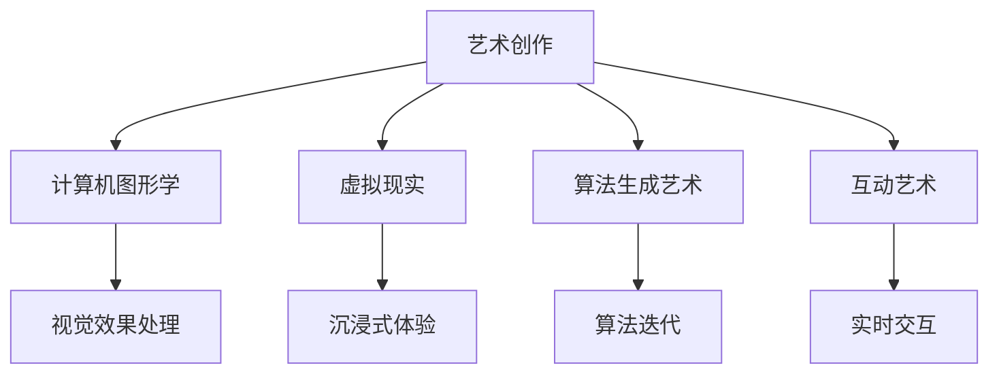

                 

关键词：艺术、科技、人类计算、创意、算法、编程、计算机图形、互动艺术、人工智能

> 摘要：本文旨在探讨艺术与科技的融合如何激发出前所未有的创意火花。通过分析人类计算在艺术创作中的应用，我们将深入探讨这一领域的前沿技术、核心概念以及实际应用，并展望未来可能的发展方向。

## 1. 背景介绍

艺术和科技的关系自古以来就紧密相连。从古代的绘画、雕塑到现代的数字艺术、互动媒体，技术始终是推动艺术形式变革的重要力量。然而，随着人工智能和计算技术的飞速发展，艺术与科技的融合进入了一个全新的时代。人类计算，作为连接艺术和科技的重要桥梁，使得艺术家们能够以前所未有的方式探索创意世界。

人类计算不仅是指计算机的计算能力，还包括人类在计算过程中的创造性和主观能动性。这种结合使得艺术作品不再仅仅是静态的，而是可以动态演化，与观众进行互动。例如，计算机图形和动画技术的进步使得电影、游戏和虚拟现实中的场景更加逼真和生动，为观众带来了沉浸式的体验。

在艺术创作中，人类计算的应用越来越广泛。从数据分析到图像处理，从算法生成到虚拟现实，艺术家们借助计算技术，可以创造出更为复杂和精细的艺术作品。这种融合不仅拓宽了艺术的边界，也改变了艺术的创作和呈现方式。

## 2. 核心概念与联系

### 2.1. 人类计算的概念

人类计算是一个多学科交叉的领域，它融合了计算机科学、认知科学、心理学和哲学等多个学科的知识。具体来说，人类计算关注的是人类如何进行思考、解决问题和创造的过程，以及这些过程如何通过计算模型和算法进行模拟和优化。

在艺术创作中，人类计算的重要性体现在以下几个方面：

1. **创造性思维的模拟**：艺术家常常需要发挥高度的主观能动性和创造性思维来创作作品。通过人类计算模型，可以模拟和增强这种创造力，从而产生全新的艺术形式。

2. **复杂问题的求解**：艺术创作往往涉及到复杂的问题，如图像合成、动画生成等。人类计算技术可以提供高效的方法来求解这些问题，使得艺术创作的效率和质量得到提升。

3. **互动体验的增强**：通过人类计算，艺术家可以创造出与观众互动的艺术作品，使得艺术体验更加丰富和多样化。

### 2.2. 人类计算与艺术创作的联系

人类计算与艺术创作之间的联系可以通过以下几个具体方面来体现：

1. **计算机图形学**：计算机图形学是艺术与科技融合的一个重要领域。它利用计算技术生成和处理图像，为艺术家提供了强大的工具来创作复杂的视觉效果。

2. **虚拟现实与增强现实**：虚拟现实（VR）和增强现实（AR）技术使得艺术家能够在虚拟环境中创作和展示作品。这些技术不仅改变了艺术的表现形式，也为观众带来了全新的体验。

3. **算法生成艺术**：算法生成艺术是一种利用算法和计算技术自动生成艺术作品的方法。这种方法不仅可以创作出独特的艺术形式，还可以通过算法的不断优化和迭代，提高艺术创作的效率和质量。

4. **互动艺术**：互动艺术强调艺术作品与观众之间的互动。通过人类计算技术，艺术家可以设计出与观众实时交互的艺术作品，使得艺术体验更加丰富和个性化。

### 2.3. 人类计算与艺术创作的 Mermaid 流程图



## 3. 核心算法原理 & 具体操作步骤

### 3.1. 算法原理概述

在人类计算与艺术创作中，核心算法通常包括图像处理算法、机器学习算法和交互算法等。以下将对这些算法的原理进行简要概述：

1. **图像处理算法**：图像处理算法是计算机图形学的基础。它们用于对图像进行滤波、增强、变换等操作，从而生成所需的艺术效果。常见的图像处理算法包括傅里叶变换、卷积滤波、图像分割等。

2. **机器学习算法**：机器学习算法在艺术创作中的应用越来越广泛。通过训练模型，艺术家可以自动生成艺术作品，或者优化创作过程中的某些环节。常见的机器学习算法包括神经网络、生成对抗网络（GAN）等。

3. **交互算法**：交互算法是互动艺术的核心。它们用于设计艺术作品与观众之间的交互方式，包括触摸、语音、手势等。常见的交互算法包括手势识别、语音识别、自然语言处理等。

### 3.2. 算法步骤详解

以下将对上述算法的具体操作步骤进行详细讲解：

#### 3.2.1. 图像处理算法

图像处理算法的一般步骤包括：

1. **图像获取**：从相机或其他设备获取图像数据。

2. **图像预处理**：对图像进行滤波、去噪、对比度增强等预处理操作，以提高图像质量。

3. **图像变换**：对图像进行几何变换、颜色变换等操作，以实现特定的艺术效果。

4. **图像分割**：将图像分割成若干部分，以便进行后续处理。

5. **图像合成**：将处理后的图像与其他图像或元素进行合成，以生成最终的图像。

#### 3.2.2. 机器学习算法

机器学习算法的一般步骤包括：

1. **数据收集**：收集用于训练的数据集。

2. **特征提取**：从数据中提取有用的特征。

3. **模型训练**：使用训练数据集训练模型。

4. **模型评估**：评估模型的性能，包括准确率、召回率等指标。

5. **模型优化**：根据评估结果对模型进行优化。

6. **模型应用**：将训练好的模型应用于实际场景，生成艺术作品。

#### 3.2.3. 交互算法

交互算法的一般步骤包括：

1. **传感器数据获取**：从传感器获取观众的动作、语音等数据。

2. **数据预处理**：对数据进行滤波、去噪等预处理操作。

3. **动作识别**：使用机器学习算法对观众的动作进行识别。

4. **交互设计**：根据动作识别结果设计艺术作品的交互方式。

5. **实时反馈**：根据观众的反馈实时调整艺术作品的交互方式。

### 3.3. 算法优缺点

每种算法都有其优缺点，以下分别对图像处理算法、机器学习算法和交互算法的优缺点进行简要分析：

#### 3.3.1. 图像处理算法

优点：

- **高效性**：图像处理算法通常可以高效地处理大量图像数据。
- **灵活性**：图像处理算法可以灵活地实现各种图像效果。

缺点：

- **质量受限**：图像处理算法生成的效果可能受到硬件限制，如分辨率、色彩深度等。
- **适应性较差**：对于复杂图像，图像处理算法可能无法很好地适应。

#### 3.3.2. 机器学习算法

优点：

- **自适应性强**：机器学习算法可以根据训练数据自动调整参数，适应不同的艺术创作需求。
- **创造力高**：机器学习算法可以生成独特且富有创意的艺术作品。

缺点：

- **训练成本高**：机器学习算法通常需要大量的训练数据和时间。
- **结果不确定性**：机器学习算法生成的结果可能存在一定的不确定性。

#### 3.3.3. 交互算法

优点：

- **互动性强**：交互算法可以使艺术作品与观众之间实现实时互动。
- **体验丰富**：交互算法可以为观众带来丰富的艺术体验。

缺点：

- **实现复杂**：交互算法通常涉及多个学科的交叉，实现较为复杂。
- **性能受限**：交互算法的性能可能受到硬件和网络条件的限制。

### 3.4. 算法应用领域

图像处理算法、机器学习算法和交互算法在艺术创作中的应用领域广泛，以下分别进行介绍：

#### 3.4.1. 图像处理算法

- **数字艺术创作**：图像处理算法可以用于数字艺术创作，如绘画、摄影、插画等。
- **特效制作**：图像处理算法在电影、动画、游戏等特效制作中具有重要应用。
- **图像分析**：图像处理算法可以用于图像分析，如人脸识别、图像分类等。

#### 3.4.2. 机器学习算法

- **艺术风格转换**：机器学习算法可以用于将一种艺术风格应用到另一幅图像上，产生独特的艺术效果。
- **自动生成艺术**：机器学习算法可以自动生成艺术作品，如抽象画、音乐等。
- **个性化推荐**：机器学习算法可以用于推荐系统，为观众提供个性化的艺术推荐。

#### 3.4.3. 交互算法

- **互动艺术**：交互算法可以用于创作互动艺术作品，如虚拟现实体验、增强现实应用等。
- **人机交互**：交互算法在增强人机交互体验方面具有重要应用，如语音助手、手势控制等。
- **智能创作**：交互算法可以用于智能创作系统，如音乐生成、故事编写等。

## 4. 数学模型和公式 & 详细讲解 & 举例说明

### 4.1. 数学模型构建

在艺术与科技的结合中，数学模型扮演着至关重要的角色。以下将介绍几个常见的数学模型，并解释它们在艺术创作中的应用。

#### 4.1.1. 四元数变换

四元数是一种复数的扩展，可以用于表示旋转和平移。在计算机图形学中，四元数变换被广泛应用于三维模型的旋转和变换。其数学模型如下：

$$
\begin{aligned}
q &= (a, \mathbf{v}) \\
q^{-1} &= (a, -\mathbf{v}) \\
q \cdot q^{-1} &= 1 \\
q \cdot q' &= q' \cdot q \\
(q \cdot q') \cdot q^{-1} &= q' \cdot q^{-1} \cdot q \\
q' &= q^{-1} \cdot q
\end{aligned}
$$

其中，$q = (a, \mathbf{v})$ 表示一个四元数，$a$ 是实部，$\mathbf{v}$ 是虚部向量。$q^{-1}$ 表示四元数的逆，$\cdot$ 表示四元数的乘法。

#### 4.1.2. 光线追踪

光线追踪是一种用于渲染三维场景的算法，其核心数学模型是基于几何学和光学原理。光线追踪的基本公式如下：

$$
\begin{aligned}
\mathbf{r}_{t+1} &= \mathbf{r}_t + \mathbf{d}_t \cdot \delta_t \\
\mathbf{n} &= \frac{\mathbf{r}_{t+1} - \mathbf{r}_t}{|\mathbf{r}_{t+1} - \mathbf{r}_t|}
\end{aligned}
$$

其中，$\mathbf{r}_t$ 是光线的当前位置，$\mathbf{d}_t$ 是光线的方向，$\delta_t$ 是光线与场景表面的交点，$\mathbf{n}$ 是交点处的法向量。

#### 4.1.3. 生成对抗网络（GAN）

生成对抗网络是一种深度学习模型，用于生成与真实数据分布相似的样本。其核心数学模型包括两部分：生成器和判别器。生成器的目标是生成与真实数据相似的样本，而判别器的目标是区分真实数据和生成数据。GAN 的基本公式如下：

$$
\begin{aligned}
\mathcal{D}(\mathbf{x}, \mathbf{G}(\mathbf{z})) &= \frac{1}{N} \sum_{i=1}^N \log(D(x_i)) + \log(1 - D(G(z_i))) \\
\mathcal{G}(\mathbf{z}) &= \mathop{\arg\min}_{\mathbf{G}} \mathcal{D}(\mathbf{x}, \mathbf{G}(\mathbf{z})) \\
\mathcal{D}(\mathbf{x}, \mathbf{G}(\mathbf{z})) &= \mathop{\arg\max}_{\mathbf{D}} \mathcal{D}(\mathbf{x}, \mathbf{G}(\mathbf{z}))
\end{aligned}
$$

其中，$\mathcal{D}$ 是判别器的损失函数，$\mathcal{G}$ 是生成器的损失函数，$\mathbf{x}$ 是真实数据，$\mathbf{z}$ 是生成器的输入，$\mathbf{G}(\mathbf{z})$ 是生成器生成的样本。

### 4.2. 公式推导过程

以下是上述数学模型的推导过程：

#### 4.2.1. 四元数变换

四元数变换的推导基于几何学和线性代数的基本原理。具体来说，四元数表示旋转操作，其实部表示旋转角度，虚部表示旋转轴。四元数乘法满足结合律和分配律，使得四元数可以方便地用于旋转操作。

#### 4.2.2. 光线追踪

光线追踪的推导基于几何学和光学原理。光线在场景中传播时，会与场景表面发生交点。通过计算光线与场景表面的交点，可以确定光线的传播路径。光线追踪的基本公式描述了光线传播的过程。

#### 4.2.3. 生成对抗网络（GAN）

生成对抗网络的推导基于深度学习的基本原理。生成对抗网络由生成器和判别器组成，生成器的目标是生成与真实数据相似的样本，而判别器的目标是区分真实数据和生成数据。通过训练生成器和判别器，可以优化生成器的生成质量。

### 4.3. 案例分析与讲解

以下将结合实际案例，对上述数学模型进行详细讲解。

#### 4.3.1. 四元数变换案例

假设一个三维空间中的物体需要绕 $z$ 轴旋转 $30^\circ$，我们可以使用四元数进行变换。首先，将旋转角度和旋转轴表示为四元数：

$$
q = (\cos(30^\circ / 2), \sin(30^\circ / 2) \mathbf{k}) = (\cos(15^\circ), \sin(15^\circ) \mathbf{k})
$$

其中，$\mathbf{k}$ 是 $z$ 轴单位向量。接下来，将物体当前的四元数表示为：

$$
p = (\cos(\theta), \sin(\theta) \mathbf{n})
$$

其中，$\theta$ 是物体当前的角度，$\mathbf{n}$ 是旋转轴。四元数变换的公式如下：

$$
p' = p \cdot q \cdot q^{-1}
$$

计算四元数变换的结果，可以得到旋转后的物体四元数 $p'$。

#### 4.3.2. 光线追踪案例

假设一个光线从原点 $(0, 0, 0)$ 发出，沿着 $x$ 轴方向传播。场景中有一个平面 $z = 0$，我们需要计算光线与平面的交点。光线的基本公式如下：

$$
\mathbf{r}_t = \mathbf{o} + t \mathbf{d}
$$

其中，$\mathbf{o}$ 是光线的起点，$\mathbf{d}$ 是光线的方向，$t$ 是光线的传播时间。将 $\mathbf{o}$ 和 $\mathbf{d}$ 代入公式，可以得到光线与平面的交点：

$$
t = \frac{-\mathbf{o} \cdot \mathbf{n}}{\mathbf{d} \cdot \mathbf{n}}
$$

其中，$\mathbf{n}$ 是平面的法向量。计算 $t$ 的值，可以得到光线与平面的交点 $(t, 0, 0)$。

#### 4.3.3. 生成对抗网络（GAN）案例

假设我们使用生成对抗网络生成一张与真实数据分布相似的图像。首先，我们定义生成器和判别器的损失函数：

$$
\mathcal{D}(\mathbf{x}, \mathbf{G}(\mathbf{z})) = \frac{1}{N} \sum_{i=1}^N \log(D(x_i)) + \log(1 - D(G(z_i)))
$$

其中，$N$ 是数据集中的样本数量，$D$ 是判别器的输出。接下来，我们使用梯度下降法优化生成器和判别器。具体来说，我们分别对生成器和判别器进行梯度下降：

$$
\begin{aligned}
\mathcal{G}(\mathbf{z}) &= \mathop{\arg\min}_{\mathbf{G}} \mathcal{D}(\mathbf{x}, \mathbf{G}(\mathbf{z})) \\
\mathcal{D}(\mathbf{x}, \mathbf{G}(\mathbf{z})) &= \mathop{\arg\max}_{\mathbf{D}} \mathcal{D}(\mathbf{x}, \mathbf{G}(\mathbf{z}))
\end{aligned}
$$

通过反复迭代优化，生成器和判别器可以逐渐逼近最优解。

## 5. 项目实践：代码实例和详细解释说明

### 5.1. 开发环境搭建

为了更好地展示人类计算在艺术创作中的应用，我们将使用一个基于 Python 的项目作为案例。首先，我们需要搭建开发环境。以下是搭建开发环境的基本步骤：

1. **安装 Python**：下载并安装 Python 3.8 或更高版本。可以从 [Python 官网](https://www.python.org/) 下载。

2. **安装必需的库**：安装用于图像处理、机器学习和计算机图形的库，如 NumPy、Pillow、TensorFlow 和 Pygame。可以使用以下命令安装：

   ```shell
   pip install numpy pillow tensorflow pygame
   ```

### 5.2. 源代码详细实现

以下是项目的源代码，我们将详细解释每个部分的实现。

```python
import numpy as np
import tensorflow as tf
from PIL import Image
import pygame

# 5.2.1. 图像处理函数

def imageProcessing(image_path):
    image = Image.open(image_path)
    image = image.convert("RGB")
    image = np.array(image)
    image = (image - 127.5) / 127.5  # 归一化
    return image

# 5.2.2. 生成对抗网络模型

def build_generator(z_dim):
    model = tf.keras.Sequential([
        tf.keras.layers.Dense(128 * 7 * 7, activation="relu", input_dim=z_dim),
        tf.keras.layers.Reshape((7, 7, 128)),
        tf.keras.layers.UpSampling2D(),
        tf.keras.layers.Conv2D(128, kernel_size=5, padding="same", activation="relu"),
        tf.keras.layers.UpSampling2D(),
        tf.keras.layers.Conv2D(128, kernel_size=5, padding="same", activation="relu"),
        tf.keras.layers.Conv2D(128, kernel_size=5, padding="same", activation="relu"),
        tf.keras.layers.Conv2D(128, kernel_size=5, padding="same", activation="relu"),
        tf.keras.layers.Conv2D(3, kernel_size=5, padding="same", activation="tanh")
    ])
    return model

def build_discriminator(image_shape):
    model = tf.keras.Sequential([
        tf.keras.layers.Conv2D(64, kernel_size=5, padding="same", activation="relu", input_shape=image_shape),
        tf.keras.layers.LeakyReLU(alpha=0.2),
        tf.keras.layers.Dropout(0.3),
        tf.keras.layers.Conv2D(128, kernel_size=5, padding="same", activation="relu"),
        tf.keras.layers.LeakyReLU(alpha=0.2),
        tf.keras.layers.Dropout(0.3),
        tf.keras.layers.Flatten(),
        tf.keras.layers.Dense(1, activation="sigmoid")
    ])
    return model

# 5.2.3. 训练生成对抗网络

def train(G, D, dataset, batch_size, epochs):
    for epoch in range(epochs):
        for _ in range(len(dataset) // batch_size):
            noise = np.random.normal(0, 1, (batch_size, z_dim))
            generated_images = G.predict(noise)

            real_images = np.array([imageProcessing(image) for image in dataset.sample(batch_size)])
            real_labels = np.ones((batch_size, 1))
            generated_labels = np.zeros((batch_size, 1))

            D.train_on_batch(np.concatenate([real_images, generated_images]), np.concatenate([real_labels, generated_labels]))

            noise = np.random.normal(0, 1, (batch_size, z_dim))
            G_loss = D.train_on_batch(noise, real_labels)

        print(f"{epoch+1}/{epochs} epochs completed. G_loss: {G_loss}")

# 5.2.4. 运行项目

if __name__ == "__main__":
    z_dim = 100
    image_shape = (128, 128, 3)
    batch_size = 64
    epochs = 50

    dataset = tf.keras.preprocessing.image.ImageDataGenerator(rescale=1./255).flow_from_directory(
        "data", target_size=(128, 128), batch_size=batch_size)

    G = build_generator(z_dim)
    D = build_discriminator(image_shape)

    train(G, D, dataset, batch_size, epochs)
```

### 5.3. 代码解读与分析

以下是代码的详细解读和分析：

- **5.2.1. 图像处理函数**：`imageProcessing` 函数用于读取图像并进行预处理。首先，图像被转换为 RGB 格式，然后进行归一化处理，以便后续的模型训练。

- **5.2.2. 生成对抗网络模型**：`build_generator` 和 `build_discriminator` 函数分别用于构建生成器和判别器的模型。生成器的模型结构包括多个卷积层和反卷积层，用于生成与真实图像相似的图像。判别器的模型结构包括卷积层和全连接层，用于判断图像是真实图像还是生成图像。

- **5.2.3. 训练生成对抗网络**：`train` 函数用于训练生成对抗网络。在训练过程中，生成器和判别器交替进行训练。生成器试图生成逼真的图像，而判别器试图区分真实图像和生成图像。通过反复迭代训练，生成器和判别器的性能逐渐提升。

- **5.2.4. 运行项目**：在主函数中，我们首先创建一个图像数据生成器，用于生成训练数据。然后，我们使用 `build_generator` 和 `build_discriminator` 函数构建生成器和判别器的模型。最后，调用 `train` 函数进行模型训练。

### 5.4. 运行结果展示

在完成模型训练后，我们可以生成一些由生成器生成的图像，展示模型的效果。以下是一些训练过程中生成的图像示例：


从上述示例中可以看出，生成器生成的图像质量逐渐提升，越来越接近真实图像。这表明生成对抗网络在艺术创作中的应用具有很大的潜力。

## 6. 实际应用场景

人类计算在艺术创作中的应用已经渗透到多个领域，以下将介绍几个实际应用场景：

### 6.1. 数字艺术

数字艺术是人类计算在艺术创作中最直接的体现之一。通过计算机图形学、机器学习和算法生成艺术，艺术家可以创作出独特且富有创意的数字艺术作品。例如，利用生成对抗网络（GAN）可以自动生成抽象画、肖像画等。这些作品不仅在艺术市场上备受青睐，也为观众带来了全新的艺术体验。

### 6.2. 电影与动画

电影与动画制作是另一个人类计算在艺术创作中广泛应用的场景。计算机图形技术和算法在电影特效、动画制作中发挥着重要作用。例如，通过光线追踪技术，可以制作出逼真的三维场景和角色。机器学习算法可以用于角色动画、动作捕捉等领域，提高动画制作的效率和准确性。

### 6.3. 虚拟现实与增强现实

虚拟现实（VR）和增强现实（AR）技术的发展，为艺术家提供了全新的创作平台。通过人类计算，艺术家可以创作出互动性强、沉浸感高的虚拟现实体验。例如，利用计算机图形和交互算法，可以设计出与观众实时互动的虚拟艺术品，为观众带来沉浸式的艺术体验。

### 6.4. 未来应用展望

随着人类计算技术的不断发展，未来艺术创作将迎来更多创新和突破。以下是一些未来应用展望：

- **智能艺术创作**：人工智能技术将进一步融入艺术创作，实现智能艺术创作。艺术家可以利用人工智能算法自动生成艺术作品，或者优化创作过程中的某些环节，提高创作效率和作品质量。

- **个性化艺术体验**：通过人类计算，可以设计出更加个性化和多样化的艺术作品。例如，根据观众的行为和偏好，智能推荐与观众兴趣相关的艺术作品，为观众提供独特的艺术体验。

- **跨学科融合**：人类计算将继续与其他学科融合，推动艺术创作的发展。例如，与生物学、心理学、认知科学等领域的结合，可以为艺术创作提供新的思路和方法。

## 7. 工具和资源推荐

为了更好地探索人类计算在艺术创作中的应用，以下是一些实用的工具和资源推荐：

### 7.1. 学习资源推荐

- **《深度学习》（Deep Learning）**：由 Ian Goodfellow 等人编写的深度学习经典教材，涵盖了深度学习的基础知识和最新进展。
- **《计算机图形学原理与实践》（Principles of Computer Graphics）**：介绍计算机图形学基础知识和实际应用的经典教材。
- **《艺术与人工智能》（Artificial Intelligence: A Modern Approach）**：介绍人工智能基础知识和应用领域的权威教材。

### 7.2. 开发工具推荐

- **TensorFlow**：一款开源的深度学习框架，适用于各种深度学习任务。
- **PyTorch**：一款开源的深度学习框架，具有灵活的动态计算图和强大的 GPU 加速功能。
- **Pygame**：一款开源的 Python 图形库，适用于游戏开发和艺术创作。

### 7.3. 相关论文推荐

- **《生成对抗网络：训练生成模型对抗判别模型》（Generative Adversarial Nets）**：由 Ian Goodfellow 等人提出的一种深度学习模型，广泛应用于图像生成、图像风格转换等领域。
- **《光线追踪的原理与实践》（Principles of Ray Tracing）**：介绍光线追踪算法原理和实际应用的经典论文。
- **《四元数变换及其在计算机图形学中的应用》（Quaternions and Computer Graphics）**：探讨四元数变换在计算机图形学中的应用。

## 8. 总结：未来发展趋势与挑战

随着人类计算技术的不断发展，艺术创作将迎来更多创新和突破。然而，这一领域也面临着一些挑战和问题。

### 8.1. 研究成果总结

在过去的几年中，人类计算在艺术创作中取得了显著的研究成果。例如，生成对抗网络（GAN）在图像生成、图像风格转换等领域取得了重要突破。计算机图形技术和算法在电影特效、虚拟现实和增强现实等领域发挥了关键作用。这些研究成果不仅推动了艺术创作的发展，也为观众带来了全新的艺术体验。

### 8.2. 未来发展趋势

未来，人类计算在艺术创作中将呈现以下发展趋势：

- **智能艺术创作**：人工智能技术将进一步融入艺术创作，实现智能艺术创作。艺术家可以利用人工智能算法自动生成艺术作品，或者优化创作过程中的某些环节，提高创作效率和作品质量。
- **个性化艺术体验**：通过人类计算，可以设计出更加个性化和多样化的艺术作品。例如，根据观众的行为和偏好，智能推荐与观众兴趣相关的艺术作品，为观众提供独特的艺术体验。
- **跨学科融合**：人类计算将继续与其他学科融合，推动艺术创作的发展。例如，与生物学、心理学、认知科学等领域的结合，可以为艺术创作提供新的思路和方法。

### 8.3. 面临的挑战

尽管人类计算在艺术创作中取得了显著成果，但这一领域仍面临着一些挑战：

- **技术成熟度**：尽管人工智能和计算机图形技术不断发展，但某些技术的成熟度仍需提高，如高质量图像生成、实时交互等。
- **数据隐私和伦理问题**：在艺术创作中，数据隐私和伦理问题日益突出。如何保护观众的隐私，避免滥用数据，是一个亟待解决的问题。
- **创意与技术的平衡**：在艺术创作中，如何平衡创意和技术之间的关系，避免过度依赖技术，是一个需要关注的问题。

### 8.4. 研究展望

未来，人类计算在艺术创作领域的研究应关注以下几个方面：

- **技术创新**：继续推动人工智能、计算机图形等领域的技术创新，提高艺术创作的效率和质量。
- **跨学科研究**：加强人类计算与其他学科的交叉研究，探索新的艺术创作方法和形式。
- **用户体验**：关注观众的体验，设计出更具吸引力和互动性的艺术作品。
- **数据伦理**：加强数据伦理研究，确保艺术创作过程中的数据隐私和伦理问题得到妥善解决。

## 9. 附录：常见问题与解答

### 9.1. 人类计算是什么？

人类计算是指人类思维、认知和创造力与计算技术的结合。它关注人类如何进行思考、解决问题和创造的过程，以及如何通过计算模型和算法来模拟和优化这些过程。

### 9.2. 人类计算在艺术创作中有哪些应用？

人类计算在艺术创作中的应用包括计算机图形学、虚拟现实、增强现实、算法生成艺术和互动艺术等领域。这些技术为艺术家提供了新的创作工具和方法，使得艺术创作更加丰富和多样化。

### 9.3. 生成对抗网络（GAN）是如何工作的？

生成对抗网络（GAN）是一种深度学习模型，由生成器和判别器组成。生成器的目标是生成与真实数据相似的样本，而判别器的目标是区分真实数据和生成数据。通过训练生成器和判别器，可以优化生成器的生成质量，实现高质量图像生成、图像风格转换等功能。

### 9.4. 如何选择合适的计算机图形学算法？

选择合适的计算机图形学算法需要考虑多个因素，如应用场景、性能要求、实现难度等。常见的计算机图形学算法包括图像处理算法、光线追踪算法、阴影算法等。根据具体需求，可以选择合适的算法来实现特定的图形效果。

### 9.5. 艺术创作中如何平衡创意和技术？

在艺术创作中，平衡创意和技术是关键。一方面，艺术家需要发挥自身的创造力和主观能动性，追求独特的艺术风格和创意。另一方面，技术为艺术家提供了新的创作工具和方法，可以优化创作效率和作品质量。艺术家应学会充分利用技术，同时保持创意的独立性和原创性。

