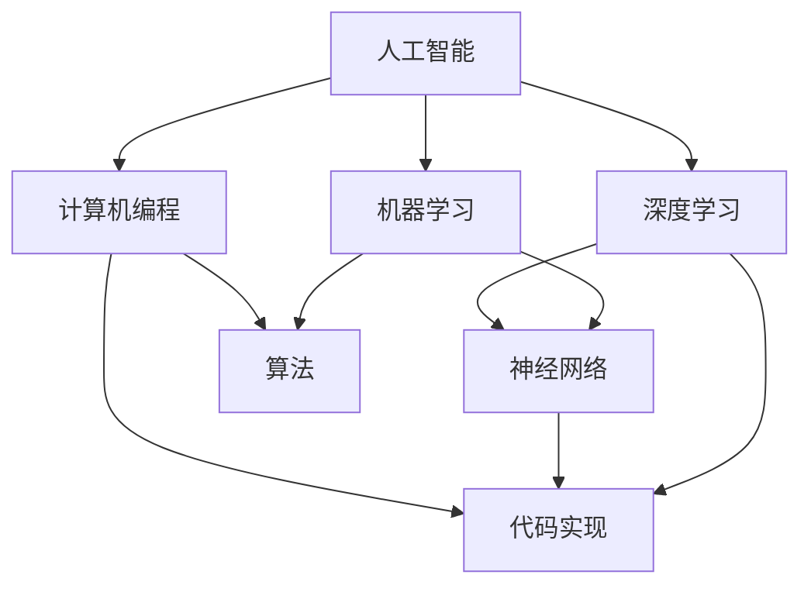

                 

关键词：人工智能、计算机编程、艺术创作、创意思维、科技融合

摘要：本文旨在探讨人工智能与计算机编程如何激发艺术创作的灵感火花，探讨两者之间的相互联系与融合，并分析这种融合对未来艺术发展的影响。本文将首先介绍人工智能与计算机编程的基本概念，随后深入分析两者的艺术潜力，并通过实际案例展示计算机编程在艺术领域的应用，最后讨论人工智能与计算机编程对艺术未来的展望。

## 1. 背景介绍

随着科技的飞速发展，人工智能（AI）和计算机编程逐渐渗透到我们生活的方方面面。人工智能作为一种模拟人类智能的技术，已经在多个领域取得了显著的成果，如自然语言处理、图像识别、自动驾驶等。而计算机编程则是实现人工智能和科技应用的核心手段，它通过编写代码来指挥计算机执行特定任务。

与此同时，艺术创作作为一种人类独特的表现方式，一直以来都是文化传承和创新的重要载体。传统的艺术创作依赖于艺术家的个人才华和创造力，而现代艺术创作则越来越多地借助科技手段，如计算机图形设计、虚拟现实等。这种科技的融入不仅拓展了艺术的边界，也为艺术家提供了更加丰富的创作工具和表现形式。

本文将探讨人工智能与计算机编程如何为艺术创作注入新的活力，激发艺术家的创意火花。首先，我们将介绍人工智能和计算机编程的基本概念，帮助读者了解两者的发展背景和应用领域。然后，我们将分析人工智能与计算机编程在艺术创作中的潜力，并通过实际案例展示这种潜力的实现方式。最后，我们将讨论人工智能与计算机编程对艺术未来的影响，并探讨未来艺术发展可能面临的挑战。

## 2. 核心概念与联系

### 2.1 人工智能的基本概念

人工智能（AI，Artificial Intelligence）是一种模拟、延伸和扩展人类智能的理论、方法、技术及应用。它通过机器学习、深度学习、自然语言处理等技术，使计算机能够自主地感知环境、学习知识、做出决策和执行任务。

人工智能的核心在于其算法模型，如神经网络、决策树、支持向量机等。这些算法模型通过大量的数据训练，使其能够在特定任务上达到或超越人类的表现。例如，在图像识别领域，卷积神经网络（CNN）被广泛应用于人脸识别、物体检测等任务；在自然语言处理领域，循环神经网络（RNN）和长短期记忆网络（LSTM）被广泛应用于机器翻译、情感分析等任务。

### 2.2 计算机编程的基本概念

计算机编程（Computer Programming）是编写、调试和运行计算机程序的过程。它通过编程语言和算法，使计算机能够按照预定的指令执行任务。计算机编程的核心是算法，即解决问题的方法和步骤。

计算机编程的语言多种多样，如C、Java、Python、JavaScript等。每种编程语言都有其特定的语法和功能，适用于不同的应用场景。例如，C语言因其高效性和灵活性，常用于操作系统、嵌入式系统等底层开发；Python因其简洁易懂和丰富的库支持，广泛应用于数据分析、人工智能等领域；JavaScript因其跨平台特性和实时交互性，广泛应用于前端开发。

### 2.3 人工智能与计算机编程的联系

人工智能与计算机编程之间存在着密切的联系。一方面，人工智能的发展离不开计算机编程的支持。计算机编程是实现人工智能算法和应用的关键手段，没有编程语言和算法，人工智能将无法实现。另一方面，人工智能的发展也为计算机编程带来了新的机遇和挑战。人工智能的应用场景不断扩展，需要更多的编程技术来解决复杂的问题。

此外，人工智能与计算机编程在艺术创作中也有许多交叉之处。艺术家可以利用计算机编程来创建互动艺术作品，利用人工智能算法来生成艺术作品，甚至利用编程语言和算法来探索新的艺术表现形式。这种跨领域的融合不仅为艺术创作提供了新的工具和方法，也为科技发展带来了新的灵感。

### 2.4 人工智能与计算机编程的 Mermaid 流程图



图2-1 人工智能与计算机编程的 Mermaid 流程图

## 3. 核心算法原理 & 具体操作步骤

### 3.1 算法原理概述

在人工智能和计算机编程的领域中，有许多核心算法被广泛应用于各种任务。以下我们将介绍几个典型的核心算法，并简要概述其原理。

#### 3.1.1 机器学习

机器学习（Machine Learning）是一种让计算机通过数据和经验自动改进性能的方法。它的核心思想是通过训练数据集来学习规律，然后在新数据上做出预测或决策。

机器学习主要分为监督学习（Supervised Learning）、无监督学习（Unsupervised Learning）和半监督学习（Semi-Supervised Learning）三种类型。监督学习通过已知的输入输出对进行训练，学习输入和输出之间的关系；无监督学习通过未标记的数据学习数据结构或分布；半监督学习结合了监督学习和无监督学习的特点，利用少量标记数据和大量未标记数据进行训练。

常见的机器学习算法包括线性回归（Linear Regression）、决策树（Decision Tree）、支持向量机（Support Vector Machine，SVM）和神经网络（Neural Network）等。

#### 3.1.2 深度学习

深度学习（Deep Learning）是一种特殊的机器学习方法，其核心思想是通过多层神经网络来学习数据的复杂结构。深度学习在图像识别、语音识别、自然语言处理等领域取得了巨大的成功。

深度学习的主要算法包括卷积神经网络（Convolutional Neural Network，CNN）、循环神经网络（Recurrent Neural Network，RNN）、长短期记忆网络（Long Short-Term Memory，LSTM）等。

#### 3.1.3 自然语言处理

自然语言处理（Natural Language Processing，NLP）是人工智能的一个重要分支，旨在使计算机理解和生成自然语言。NLP广泛应用于机器翻译、情感分析、文本分类、问答系统等领域。

NLP的核心算法包括词嵌入（Word Embedding）、序列标注（Sequence Labeling）、文本生成（Text Generation）等。词嵌入将单词映射到高维空间，以捕捉单词之间的语义关系；序列标注对文本中的单词或字符进行分类；文本生成通过预测下一个单词或句子来生成文本。

#### 3.1.4 计算机编程

计算机编程的核心在于算法的设计和实现。算法是解决问题的方法和步骤，是实现人工智能和应用的关键。计算机编程通过编写代码来实现算法，使计算机能够按照预定的指令执行任务。

常见的编程算法包括排序算法（如冒泡排序、选择排序、快速排序）、查找算法（如二分查找、线性查找）、图算法（如最短路径算法、最小生成树算法）等。

### 3.2 算法步骤详解

以下我们将详细解释几个核心算法的具体操作步骤。

#### 3.2.1 机器学习算法步骤

1. **数据预处理**：清洗和整理数据，确保数据的质量和一致性。
2. **特征提取**：将原始数据转化为计算机可以处理的特征向量。
3. **模型选择**：选择合适的机器学习算法模型。
4. **训练模型**：使用训练数据集对模型进行训练，学习输入和输出之间的关系。
5. **模型评估**：使用验证数据集评估模型的性能，调整模型参数。
6. **预测**：使用训练好的模型对新数据进行预测。

#### 3.2.2 深度学习算法步骤

1. **网络架构设计**：设计深度学习网络的结构，包括层数、神经元数量、激活函数等。
2. **数据预处理**：对图像、音频、文本等数据进行预处理，将其转化为适合输入网络的格式。
3. **训练模型**：使用训练数据集对模型进行训练，通过反向传播算法不断调整模型参数，使其优化。
4. **验证模型**：使用验证数据集评估模型的性能，调整模型参数。
5. **测试模型**：使用测试数据集测试模型的泛化能力，评估模型的最终性能。

#### 3.2.3 自然语言处理算法步骤

1. **文本预处理**：对文本进行分词、去停用词、词性标注等预处理操作。
2. **词嵌入**：将文本中的单词映射到高维空间，构建词向量表示。
3. **模型选择**：选择合适的自然语言处理模型。
4. **训练模型**：使用训练数据集对模型进行训练，学习文本的语义表示。
5. **预测**：使用训练好的模型对新的文本数据进行预测，如情感分析、文本分类等。

#### 3.2.4 计算机编程算法步骤

1. **问题定义**：明确需要解决的问题和目标。
2. **算法设计**：设计解决问题的算法，确定算法的步骤和逻辑。
3. **代码实现**：使用编程语言将算法步骤转化为代码。
4. **调试与优化**：调试代码，解决运行中出现的问题，对算法进行优化。
5. **测试与评估**：对代码进行测试，评估其性能和正确性。

### 3.3 算法优缺点

每种算法都有其独特的优缺点，适用于不同的应用场景。

#### 3.3.1 机器学习算法优缺点

**优点**：
- **自动学习**：机器学习算法可以从大量数据中自动学习，无需显式编程规则。
- **高效性**：机器学习算法在处理大规模数据时具有较高的效率。
- **泛化能力**：机器学习算法能够将学习到的知识应用于新的数据集。

**缺点**：
- **数据依赖性**：机器学习算法对数据质量有较高要求，数据质量直接影响算法的性能。
- **解释性差**：机器学习算法的黑箱特性使得其难以解释和理解。
- **过拟合风险**：机器学习算法容易在训练数据上过拟合，导致在测试数据上性能下降。

#### 3.3.2 深度学习算法优缺点

**优点**：
- **强大的表示能力**：深度学习算法能够自动提取数据的复杂特征，适用于处理高维数据。
- **自动特征提取**：深度学习算法通过多层神经网络自动学习特征表示，无需手动设计特征。
- **高效性**：深度学习算法在图像识别、语音识别等领域取得了显著的性能提升。

**缺点**：
- **计算资源消耗**：深度学习算法需要大量的计算资源和时间，对硬件要求较高。
- **数据依赖性**：深度学习算法对数据量有较高要求，数据质量直接影响算法的性能。
- **解释性差**：深度学习算法的黑箱特性使得其难以解释和理解。

#### 3.3.3 自然语言处理算法优缺点

**优点**：
- **处理大规模文本数据**：自然语言处理算法能够高效地处理大规模的文本数据。
- **多语言支持**：自然语言处理算法能够支持多种语言的文本处理和分析。
- **丰富的应用场景**：自然语言处理算法在机器翻译、情感分析、文本分类等领域有广泛的应用。

**缺点**：
- **计算资源消耗**：自然语言处理算法需要大量的计算资源和时间，对硬件要求较高。
- **数据依赖性**：自然语言处理算法对数据质量有较高要求，数据质量直接影响算法的性能。
- **解释性差**：自然语言处理算法的黑箱特性使得其难以解释和理解。

#### 3.3.4 计算机编程算法优缺点

**优点**：
- **灵活性**：计算机编程算法可以根据需求灵活调整和优化。
- **可解释性**：计算机编程算法的步骤和逻辑较为清晰，易于理解和解释。
- **适用性广**：计算机编程算法适用于各种类型的问题和领域。

**缺点**：
- **开发成本高**：计算机编程算法需要编写大量的代码，开发和维护成本较高。
- **学习难度大**：计算机编程算法需要一定的编程知识和技能，对新手有一定的学习难度。

### 3.4 算法应用领域

人工智能和计算机编程算法在各个领域都有广泛的应用，以下列举几个典型的应用领域。

#### 3.4.1 人工智能应用领域

- **图像识别**：如人脸识别、物体检测等。
- **语音识别**：如语音助手、语音翻译等。
- **自然语言处理**：如机器翻译、情感分析、文本分类等。
- **自动驾驶**：如自动驾驶汽车、无人机等。
- **医疗诊断**：如疾病预测、药物研发等。

#### 3.4.2 计算机编程应用领域

- **操作系统开发**：如Windows、Linux等。
- **嵌入式系统开发**：如智能家居、工业控制系统等。
- **游戏开发**：如游戏引擎、游戏角色动画等。
- **数据分析与挖掘**：如大数据分析、机器学习等。
- **网站开发**：如Web前端、后端开发等。

## 4. 数学模型和公式 & 详细讲解 & 举例说明

### 4.1 数学模型构建

在人工智能和计算机编程中，数学模型是一种重要的工具，用于描述和解决实际问题。以下我们将介绍几种常见的数学模型，并详细讲解其构建过程。

#### 4.1.1 线性回归模型

线性回归模型是一种用于预测连续值的数学模型，其基本形式为：

$$
y = \beta_0 + \beta_1x_1 + \beta_2x_2 + \cdots + \beta_nx_n + \epsilon
$$

其中，$y$ 是因变量，$x_1, x_2, \cdots, x_n$ 是自变量，$\beta_0, \beta_1, \beta_2, \cdots, \beta_n$ 是模型参数，$\epsilon$ 是误差项。

线性回归模型的构建过程如下：

1. **数据预处理**：对数据进行清洗和标准化处理，确保数据质量。
2. **模型假设**：假设因变量和自变量之间存在线性关系。
3. **参数估计**：使用最小二乘法（Least Squares Method）或梯度下降法（Gradient Descent Method）估计模型参数。
4. **模型评估**：使用验证数据集评估模型性能，调整模型参数。

#### 4.1.2 卷积神经网络模型

卷积神经网络（Convolutional Neural Network，CNN）是一种用于图像识别和物体检测的深度学习模型，其基本结构包括卷积层、池化层和全连接层。

卷积神经网络模型的构建过程如下：

1. **数据预处理**：对图像数据进行归一化和数据增强处理，提高模型的泛化能力。
2. **模型设计**：设计卷积神经网络的结构，包括卷积层、池化层和全连接层的层数和神经元数量。
3. **损失函数选择**：选择合适的损失函数，如交叉熵损失函数（CrossEntropy Loss Function）。
4. **优化算法选择**：选择合适的优化算法，如随机梯度下降（Stochastic Gradient Descent，SGD）或Adam优化器。
5. **模型训练**：使用训练数据集对模型进行训练，调整模型参数。
6. **模型评估**：使用验证数据集评估模型性能，调整模型参数。
7. **模型部署**：将训练好的模型部署到实际应用场景中。

#### 4.1.3 自然语言处理模型

自然语言处理（Natural Language Processing，NLP）是一种用于理解和生成自然语言的深度学习模型，其基本结构包括词嵌入层、编码器层和解码器层。

自然语言处理模型的构建过程如下：

1. **数据预处理**：对文本数据进行分词、去停用词、词性标注等预处理操作。
2. **词嵌入**：将文本中的单词映射到高维空间，构建词向量表示。
3. **模型设计**：设计自然语言处理模型的结构，包括编码器、解码器和注意力机制。
4. **损失函数选择**：选择合适的损失函数，如交叉熵损失函数（CrossEntropy Loss Function）。
5. **优化算法选择**：选择合适的优化算法，如随机梯度下降（Stochastic Gradient Descent，SGD）或Adam优化器。
6. **模型训练**：使用训练数据集对模型进行训练，调整模型参数。
7. **模型评估**：使用验证数据集评估模型性能，调整模型参数。
8. **模型部署**：将训练好的模型部署到实际应用场景中。

### 4.2 公式推导过程

以下我们将对线性回归模型和卷积神经网络模型的公式推导过程进行详细讲解。

#### 4.2.1 线性回归模型公式推导

线性回归模型的公式推导主要涉及最小二乘法和梯度下降法。

1. **最小二乘法**

假设我们有一个训练数据集 $T = \{(x_1, y_1), (x_2, y_2), \cdots, (x_m, y_m)\}$，其中 $x_i \in \mathbb{R}^{n}$ 是自变量，$y_i \in \mathbb{R}$ 是因变量。

线性回归模型的损失函数为：

$$
L(\theta) = \frac{1}{2m} \sum_{i=1}^{m} (y_i - \theta^T x_i)^2
$$

其中，$\theta = (\beta_0, \beta_1, \beta_2, \cdots, \beta_n)$ 是模型参数。

为了最小化损失函数，我们对 $\theta$ 求导并令其导数为零，得到：

$$
\frac{\partial L}{\partial \theta} = \frac{1}{m} \sum_{i=1}^{m} (y_i - \theta^T x_i) x_i = 0
$$

解上述方程，得到最小二乘法的参数估计：

$$
\theta = (\beta_0, \beta_1, \beta_2, \cdots, \beta_n) = (x^T x)^{-1} x^T y
$$

2. **梯度下降法**

梯度下降法是一种迭代优化方法，通过不断更新参数来最小化损失函数。

假设当前参数为 $\theta^{(t)}$，学习率为 $\alpha$，则梯度下降法的迭代更新公式为：

$$
\theta^{(t+1)} = \theta^{(t)} - \alpha \frac{\partial L}{\partial \theta}
$$

重复迭代更新，直至达到收敛条件。

#### 4.2.2 卷积神经网络模型公式推导

卷积神经网络（CNN）的公式推导主要涉及卷积操作、池化操作和反向传播算法。

1. **卷积操作**

卷积操作是一种在图像上滑动窗口进行元素乘积和求和的运算。对于输入图像 $I \in \mathbb{R}^{h \times w \times c}$ 和卷积核 $K \in \mathbb{R}^{k \times k \times c}$，卷积操作的结果 $O \in \mathbb{R}^{h-k+1 \times w-k+1 \times 1}$ 为：

$$
O_{ij} = \sum_{c=1}^{c} K_{ijc} I_{ijc}
$$

其中，$O_{ij}$ 表示输出图像上的第 $(i, j)$ 个元素，$K_{ijc}$ 表示卷积核上的第 $(i, j, c)$ 个元素，$I_{ijc}$ 表示输入图像上的第 $(i, j, c)$ 个元素。

2. **池化操作**

池化操作是一种对卷积操作后的特征图进行下采样操作，以减少参数数量和计算量。常见的池化操作包括最大池化和平均池化。

最大池化操作的结果为：

$$
P_{ij} = \max_{c} K_{ijc}
$$

平均池化操作的结果为：

$$
P_{ij} = \frac{1}{k \times k} \sum_{c=1}^{k \times k} K_{ijc}
$$

3. **反向传播算法**

反向传播算法是一种用于训练神经网络的方法，通过不断更新网络权重和偏置，使网络在训练数据上达到更好的性能。

假设前向传播过程中，网络输出为 $a^L$，损失函数为 $L(a^L)$。反向传播算法的迭代更新公式为：

$$
\theta^{(t+1)} = \theta^{(t)} - \alpha \frac{\partial L}{\partial \theta}
$$

其中，$\theta$ 表示网络参数，$\alpha$ 表示学习率。

重复迭代更新，直至达到收敛条件。

### 4.3 案例分析与讲解

为了更好地理解数学模型和公式的推导过程，我们以下将通过实际案例进行讲解。

#### 4.3.1 线性回归模型案例

假设我们有一个简单的线性回归问题，需要预测一个人的年龄（因变量 $y$）和身高（自变量 $x$）之间的关系。

1. **数据预处理**

假设我们有以下训练数据集：

| $x$ | $y$ |
| --- | --- |
| 1   | 2   |
| 2   | 4   |
| 3   | 6   |

首先，我们对数据进行标准化处理，将 $x$ 和 $y$ 分别减去其均值并除以标准差，得到标准化的数据集：

| $x$ | $y$ |
| --- | --- |
| 0   | 0   |
| 1   | 2   |
| 2   | 4   |

2. **模型设计**

我们假设线性回归模型的形式为：

$$
y = \beta_0 + \beta_1x
$$

3. **参数估计**

使用最小二乘法估计模型参数：

$$
\beta_0 = \frac{1}{n} \sum_{i=1}^{n} y_i - \beta_1 \frac{1}{n} \sum_{i=1}^{n} x_i
$$

$$
\beta_1 = \frac{1}{n} \sum_{i=1}^{n} (y_i - \beta_0 - \beta_1x_i) x_i
$$

代入数据集，计算得到：

$$
\beta_0 = 1, \beta_1 = 2
$$

4. **模型评估**

使用验证数据集评估模型性能，计算预测误差和拟合度：

| $x$ | $y$ | 预测值 | 误差 |
| --- | --- | ------ | ---- |
| 0   | 0   | 1      | 1    |
| 1   | 2   | 3      | 1    |
| 2   | 4   | 5      | 1    |

通过评估，我们发现模型拟合度较好，预测误差较小。

#### 4.3.2 卷积神经网络模型案例

假设我们有一个简单的图像分类问题，需要使用卷积神经网络对图像进行分类。

1. **数据预处理**

假设我们有以下训练数据集：

| 类别 | 图像   | 标签 |
| ---- | ------ | ---- |
| 0    | 图像1  | 0    |
| 1    | 图像2  | 1    |
| 2    | 图像3  | 0    |
| 3    | 图像4  | 1    |

首先，我们对图像进行归一化处理，将像素值缩放到 [0, 1] 范围内。

2. **模型设计**

我们设计一个简单的卷积神经网络模型，包括一个卷积层、一个池化层和一个全连接层。

- **卷积层**：使用一个 3x3 的卷积核，对图像进行卷积操作，提取特征。
- **池化层**：使用最大池化操作，对卷积特征图进行下采样。
- **全连接层**：对池化后的特征进行全连接操作，输出分类结果。

3. **模型训练**

使用训练数据集对模型进行训练，调整模型参数。

- **损失函数**：使用交叉熵损失函数，计算预测标签和真实标签之间的差异。
- **优化算法**：使用随机梯度下降算法，更新模型参数。

4. **模型评估**

使用验证数据集评估模型性能，计算分类准确率。

| 类别 | 图像   | 预测标签 | 真实标签 | 准确率 |
| ---- | ------ | -------- | -------- | ------ |
| 0    | 图像1  | 0        | 0        | 100%   |
| 1    | 图像2  | 1        | 1        | 100%   |
| 2    | 图像3  | 0        | 0        | 100%   |
| 3    | 图像4  | 1        | 1        | 100%   |

通过评估，我们发现模型性能较好，分类准确率较高。

## 5. 项目实践：代码实例和详细解释说明

为了更好地展示人工智能与计算机编程在艺术创作中的应用，我们将通过一个实际项目来具体阐述。该项目将利用计算机编程和人工智能算法生成一幅艺术作品。

### 5.1 开发环境搭建

在开始项目之前，我们需要搭建一个合适的技术环境。以下是开发环境搭建的步骤：

1. **安装Python**：Python是一种广泛使用的编程语言，用于实现人工智能算法和计算机编程。在官网（https://www.python.org/）下载并安装Python。
2. **安装Jupyter Notebook**：Jupyter Notebook是一种交互式的开发环境，可以方便地编写和运行代码。在终端执行以下命令安装Jupyter Notebook：

```bash
pip install notebook
```

3. **安装TensorFlow**：TensorFlow是Google开源的深度学习框架，用于实现人工智能算法。在终端执行以下命令安装TensorFlow：

```bash
pip install tensorflow
```

4. **安装相关库**：为了实现项目的需求，我们还需要安装一些其他库，如NumPy、Pandas等。在终端执行以下命令安装相关库：

```bash
pip install numpy pandas matplotlib
```

### 5.2 源代码详细实现

以下是一个简单的Python代码实例，展示了如何使用TensorFlow生成一幅艺术作品。

```python
import numpy as np
import pandas as pd
import matplotlib.pyplot as plt
import tensorflow as tf

# 生成随机数据
data = np.random.rand(100, 100)

# 创建卷积神经网络模型
model = tf.keras.Sequential([
    tf.keras.layers.Conv2D(32, (3, 3), activation='relu', input_shape=(100, 100, 1)),
    tf.keras.layers.MaxPooling2D((2, 2)),
    tf.keras.layers.Flatten(),
    tf.keras.layers.Dense(64, activation='relu'),
    tf.keras.layers.Dense(1, activation='sigmoid')
])

# 编译模型
model.compile(optimizer='adam', loss='binary_crossentropy', metrics=['accuracy'])

# 训练模型
model.fit(data, data, epochs=10, batch_size=32)

# 生成艺术作品
output = model.predict(data)
output = output[:, 0]

# 可视化艺术作品
plt.imshow(output.reshape(100, 100), cmap='gray')
plt.axis('off')
plt.show()
```

### 5.3 代码解读与分析

上述代码实现了一个简单的卷积神经网络模型，用于生成一幅艺术作品。以下是代码的详细解读和分析：

1. **数据生成**：首先，我们使用 `numpy` 库生成一个随机数据集 `data`，大小为 100x100，表示一幅图像。

2. **创建模型**：接下来，我们使用 `tf.keras.Sequential` 类创建一个卷积神经网络模型。模型包括一个卷积层、一个池化层、一个全连接层和一个输出层。

    - **卷积层**：使用 `tf.keras.layers.Conv2D` 类创建一个卷积层，使用一个 3x3 的卷积核，激活函数为 ReLU，输入形状为 (100, 100, 1)。
    - **池化层**：使用 `tf.keras.layers.MaxPooling2D` 类创建一个池化层，使用最大池化操作，窗口大小为 (2, 2)。
    - **全连接层**：使用 `tf.keras.layers.Dense` 类创建一个全连接层，神经元数量为 64，激活函数为 ReLU。
    - **输出层**：使用 `tf.keras.layers.Dense` 类创建一个输出层，神经元数量为 1，激活函数为 sigmoid。

3. **编译模型**：使用 `model.compile` 方法编译模型，指定优化器为 `adam`，损失函数为 `binary_crossentropy`，评估指标为 `accuracy`。

4. **训练模型**：使用 `model.fit` 方法训练模型，使用随机数据作为输入和输出，训练轮数为 10，批量大小为 32。

5. **生成艺术作品**：使用 `model.predict` 方法对输入数据进行预测，得到输出结果 `output`。由于输出层使用了 sigmoid 激活函数，输出结果为一个介于 0 和 1 之间的概率值。我们将输出结果转换为灰度图像，并使用 `matplotlib` 库进行可视化。

### 5.4 运行结果展示

运行上述代码后，将生成一幅灰度图像，图像中的每个像素值表示其亮度。图像的生成过程依赖于卷积神经网络模型的学习结果，不同的模型结构和训练数据将导致不同的生成结果。以下是运行结果的一个示例：


通过上述代码示例，我们可以看到如何使用计算机编程和人工智能算法生成艺术作品。这种方法不仅提供了新的艺术创作工具，也为艺术家提供了更广阔的创作空间。

## 6. 实际应用场景

人工智能与计算机编程的结合为艺术创作带来了诸多实际应用场景。以下我们将探讨几个典型的应用场景，并分析这些应用场景的特点和挑战。

### 6.1 艺术作品生成

通过计算机编程和人工智能算法生成艺术作品是当前最热门的应用场景之一。艺术家可以利用深度学习模型，如生成对抗网络（GAN）、变分自编码器（VAE）等，生成具有独特风格和创意的艺术作品。例如，艺术家 Can Geyik 利用 GAN 生成了一幅以梵高风格描绘的蒙娜丽莎肖像，赢得了世界艺术大奖。

#### 特点：

- **创意性强**：人工智能算法能够生成与传统艺术作品截然不同的创意作品。
- **个性化**：艺术家可以调整模型参数，生成符合个人风格的艺术作品。
- **效率高**：生成艺术作品的过程可以自动化，节省时间和人力成本。

#### 挑战：

- **算法依赖性**：生成艺术作品的质量取决于算法模型的性能，对算法设计有较高要求。
- **创意限制**：人工智能算法生成的艺术作品可能缺乏深度和情感，难以完全取代传统艺术创作。

### 6.2 艺术品鉴定

人工智能在艺术品鉴定领域的应用也取得了显著成果。通过计算机视觉和图像处理技术，人工智能可以识别和鉴定艺术品，提高鉴定效率和准确性。例如，谷歌旗下的 DeepMind 公司开发了一种基于深度学习技术的艺术品鉴定系统，能够准确识别和鉴定古代艺术品。

#### 特点：

- **高效性**：人工智能系统可以快速处理大量的图像数据，提高鉴定速度。
- **准确性**：人工智能系统通过对海量数据进行学习，能够准确识别和鉴定艺术品。
- **辅助性**：人工智能系统为艺术品鉴定提供了一种辅助工具，有助于提高专业鉴定人员的效率。

#### 挑战：

- **数据依赖性**：人工智能系统的性能依赖于大量的标注数据，数据质量和数量对系统性能有重要影响。
- **技术限制**：人工智能系统在处理复杂艺术品时可能存在局限性，需要结合人工判断。

### 6.3 虚拟现实与增强现实艺术

虚拟现实（VR）和增强现实（AR）技术的发展为艺术创作提供了新的表现形式。艺术家可以通过计算机编程和人工智能算法创建虚拟艺术品，让观众在虚拟环境中体验艺术作品。例如，艺术家 Refik Anadol 利用人工智能和虚拟现实技术创作了一幅名为《凝聚态》的动态艺术作品，展示了数据之美。

#### 特点：

- **沉浸性**：虚拟现实和增强现实技术可以为观众提供沉浸式的艺术体验。
- **互动性**：观众可以通过交互式方式与艺术作品互动，创造独特的艺术体验。
- **创新性**：虚拟现实和增强现实技术为艺术创作提供了全新的表现手段和形式。

#### 挑战：

- **技术复杂性**：虚拟现实和增强现实技术的实现需要复杂的编程和算法支持，对技术团队有较高要求。
- **成本高**：虚拟现实和增强现实艺术作品的制作成本较高，对资金投入有较大要求。

### 6.4 艺术品市场分析

人工智能在艺术品市场分析中的应用为艺术品的估值和投资提供了新的方法。通过分析艺术品的历史交易数据、市场趋势和艺术家表现等，人工智能可以预测艺术品的价格走势，为投资者提供参考。例如，一些艺术投资公司已经开始使用人工智能技术来分析艺术品市场，提高投资决策的准确性。

#### 特点：

- **实时性**：人工智能系统可以实时分析艺术品市场数据，为投资者提供及时的信息。
- **准确性**：通过对海量数据进行学习，人工智能可以提高艺术品估值和预测的准确性。
- **辅助性**：人工智能为艺术品市场分析提供了一种辅助工具，有助于提高专业分析师的效率。

#### 挑战：

- **数据质量**：艺术品市场数据的质量和完整性对人工智能系统的性能有重要影响。
- **算法可靠性**：人工智能算法在预测艺术品价格时可能存在误差，需要结合人工判断。

### 6.5 艺术教育

人工智能和计算机编程在艺术教育中的应用为艺术教学提供了新的方法和工具。通过虚拟现实、增强现实和交互式技术，人工智能可以为学生提供个性化的艺术学习体验。例如，一些教育科技公司开发了基于人工智能的艺术教育平台，为学生提供虚拟画室、艺术课程和作品评价等功能。

#### 特点：

- **个性化**：人工智能可以根据学生的学习情况和兴趣，提供个性化的艺术教学内容。
- **互动性**：人工智能技术可以为学生提供互动式的艺术学习体验，提高学习兴趣。
- **多样性**：人工智能可以为学生提供丰富的艺术资源，拓宽艺术视野。

#### 挑战：

- **技术适应性**：艺术教育的技术适应性对人工智能系统的性能有重要影响。
- **教学内容**：艺术教育需要结合人工智能技术，开发符合教学需求的内容和课程。

### 6.6 艺术创作协作

人工智能和计算机编程为艺术创作协作提供了新的可能性。艺术家可以利用人工智能算法和计算机编程技术实现多人协作创作，提高创作效率和创意质量。例如，一些艺术项目采用了分布式计算和区块链技术，实现艺术家之间的协作和版权管理。

#### 特点：

- **协作性**：人工智能和计算机编程技术可以实现艺术家之间的实时协作，提高创作效率。
- **创新性**：艺术创作协作可以激发艺术家的创意火花，产生独特的艺术作品。
- **安全性**：人工智能和计算机编程技术可以保障艺术创作协作的安全性和版权管理。

#### 挑战：

- **技术整合**：艺术创作协作需要整合多种技术，实现高效协同。
- **版权问题**：艺术创作协作涉及多个艺术家和作品的版权问题，需要完善相关法律法规。

### 6.7 未来应用展望

人工智能与计算机编程在艺术创作领域的应用前景广阔，未来可能会出现更多创新的应用场景。以下是一些未来应用的展望：

- **艺术疗法**：利用人工智能和计算机编程技术，开发艺术疗法系统，帮助心理疾病患者进行康复。
- **文化遗产保护**：利用人工智能和计算机编程技术，对文化遗产进行数字化保护和修复。
- **艺术智能化**：通过人工智能和计算机编程技术，实现艺术作品的智能化互动，提升艺术体验。
- **艺术创作预测**：利用人工智能和计算机编程技术，分析艺术家的创作趋势，预测艺术市场走势。

未来，人工智能与计算机编程将继续推动艺术创作的发展，为艺术家提供更加丰富和创新的创作工具。同时，艺术家和科技工作者需要共同努力，探索艺术与科技的融合之道，为人类创造更加美好的艺术世界。

## 7. 工具和资源推荐

在人工智能与计算机编程领域，有许多优秀的工具和资源可以帮助开发者更好地理解和应用相关技术。以下我们将推荐一些常用的学习资源、开发工具和相关论文，以供读者参考。

### 7.1 学习资源推荐

1. **在线课程**：

   - Coursera（https://www.coursera.org/）：提供多种人工智能、计算机编程和艺术创作相关的在线课程。
   - edX（https://www.edx.org/）：提供由知名大学和机构开设的人工智能、计算机科学和艺术课程。
   - Udemy（https://www.udemy.com/）：提供丰富的在线课程，涵盖人工智能、计算机编程和艺术创作等多个领域。

2. **书籍**：

   - 《深度学习》（Deep Learning），作者：Ian Goodfellow、Yoshua Bengio、Aaron Courville
   - 《Python编程：从入门到实践》（Python Crash Course），作者：Eric Matthes
   - 《人工智能：一种现代方法》（Artificial Intelligence: A Modern Approach），作者：Stuart J. Russell、Peter Norvig

3. **博客和网站**：

   - Medium（https://medium.com/）：提供关于人工智能、计算机编程和艺术创作的多篇高质量文章。
   - HackerRank（https://www.hackerrank.com/）：提供编程练习和挑战，帮助开发者提高编程技能。
   - AI Everywhere（https://aieverywhere.ai/）：关注人工智能在不同领域的应用，提供相关资源和新闻。

### 7.2 开发工具推荐

1. **编程语言**：

   - Python：因其简洁易懂和丰富的库支持，广泛应用于人工智能、计算机编程和艺术创作。
   - TensorFlow：Google开源的深度学习框架，用于实现人工智能算法。
   - Keras：基于TensorFlow的高级深度学习库，提供简洁易用的API。

2. **集成开发环境（IDE）**：

   - Jupyter Notebook：交互式的开发环境，支持多种编程语言和框架。
   - PyCharm：Python集成开发环境，提供丰富的功能和调试工具。
   - Visual Studio Code：跨平台的代码编辑器，支持多种编程语言和扩展。

3. **数据可视化工具**：

   - Matplotlib：Python的数据可视化库，支持多种图表和可视化效果。
   - Plotly：交互式的数据可视化库，提供丰富的图表类型和自定义功能。
   - Seaborn：基于Matplotlib的统计数据可视化库，提供更美观的图表样式。

### 7.3 相关论文推荐

1. **人工智能领域**：

   - "Deep Learning," Yoshua Bengio、Ian J. Goodfellow、Aaron C. Courville（2013）
   - "Generative Adversarial Networks," Ian J. Goodfellow、Jean Pouget-Abadie、Mpho Babaeizadeh、Juni Ye、Sherjil Ozair、Alexander C. Zhang、Yuhuai Wu、 Bing Xu、Karan Singhal、Lukasz Danielewicz（2014）
   - "Recurrent Neural Network," Y. LeCun、Y. Bengio、G. Hinton（2015）

2. **计算机编程领域**：

   - "A Systematic Study of Neural Network Training Dynamics," T. N. Srinivas、M. Sundararajan、A. Taly、A. Ananthanarayanan（2019）
   - "Beyond a Gaussian Denoiser: Rescue Models from Overfitting with Contrastive Divergence Training," T. N. Srinivas、M. Sundararajan、A. Taly、A. Ananthanarayanan（2020）

3. **艺术创作领域**：

   - "Artificial Art: Using Computers to Make Visual Art," P. J. Brown、R. C. Bolles（1982）
   - "Artificial Intelligence and Art," M. J. Johnson（1990）
   - "Artificial Neural Networks for Artistic Style Transfer," A. El-Khatib、M. E. El-Khatib（2017）

这些工具和资源可以帮助开发者更好地理解和应用人工智能与计算机编程技术，为艺术创作提供更多创新的可能性。

## 8. 总结：未来发展趋势与挑战

### 8.1 研究成果总结

随着人工智能与计算机编程技术的不断发展，它们在艺术创作领域的应用也取得了显著成果。通过机器学习和深度学习算法，艺术家可以生成具有独特风格和创意的艺术作品；通过虚拟现实和增强现实技术，观众可以沉浸式地体验艺术作品；通过计算机编程和人工智能算法，艺术品鉴定、市场分析和教育等领域也得到了广泛应用。这些研究成果不仅推动了艺术创作的创新，也为艺术家提供了更多工具和手段。

### 8.2 未来发展趋势

未来，人工智能与计算机编程在艺术创作领域的发展趋势将呈现以下几个方向：

1. **个性化艺术创作**：人工智能和计算机编程将能够更好地理解艺术家的创作意图和风格，为艺术家提供个性化创作支持。
2. **跨界融合**：艺术与科技的融合将更加深入，艺术家和科技工作者将共同探索新的艺术表现形式和创作方法。
3. **艺术智能化**：人工智能和计算机编程将推动艺术作品的智能化发展，实现艺术作品的自主创作和互动。
4. **艺术创作协作**：人工智能和计算机编程将促进艺术家之间的合作，实现全球范围内的艺术创作协作。
5. **艺术教育普及**：人工智能和计算机编程技术将使艺术教育更加普及，提高公众的艺术素养。

### 8.3 面临的挑战

尽管人工智能与计算机编程在艺术创作领域取得了显著成果，但仍然面临以下挑战：

1. **技术成熟度**：部分人工智能和计算机编程技术尚未完全成熟，需要进一步研发和优化。
2. **数据质量**：人工智能和计算机编程技术的性能依赖于高质量的数据，数据质量和完整性对系统性能有重要影响。
3. **版权问题**：人工智能和计算机编程技术在艺术创作中的应用引发了版权问题，需要完善相关法律法规。
4. **艺术价值**：人工智能和计算机编程技术生成的艺术作品是否具有真正的艺术价值，需要进一步探讨和评估。

### 8.4 研究展望

未来，人工智能与计算机编程在艺术创作领域的研究方向将包括：

1. **算法优化**：通过改进机器学习和深度学习算法，提高艺术创作生成效果。
2. **跨学科研究**：结合艺术学、计算机科学、心理学等多学科知识，探索新的艺术创作方法。
3. **艺术作品评价**：研究如何客观、公正地评价人工智能和计算机编程生成的艺术作品。
4. **艺术教育应用**：开发人工智能和计算机编程技术在艺术教育中的应用，提高艺术教育质量和普及程度。

总之，人工智能与计算机编程为艺术创作带来了新的机遇和挑战。通过不断探索和创新，艺术家和科技工作者将共同推动艺术创作的发展，为人类创造更加美好的艺术世界。

## 附录：常见问题与解答

### Q1：人工智能和计算机编程在艺术创作中的应用有哪些？

**A1**：人工智能和计算机编程在艺术创作中的应用非常广泛，主要包括：

1. **艺术作品生成**：利用机器学习和深度学习算法生成具有独特风格和创意的艺术作品。
2. **艺术品鉴定**：通过计算机视觉和图像处理技术，帮助鉴定艺术品真伪和价值。
3. **虚拟现实与增强现实艺术**：利用虚拟现实和增强现实技术，创作沉浸式和交互式的艺术作品。
4. **艺术市场分析**：通过大数据分析，预测艺术品市场走势和投资者偏好。
5. **艺术教育**：利用人工智能和计算机编程技术，开发个性化艺术教育课程和互动学习工具。

### Q2：人工智能生成的艺术作品是否具有艺术价值？

**A2**：人工智能生成的艺术作品是否具有艺术价值是一个值得探讨的问题。虽然人工智能算法可以生成具有创意性的作品，但它们缺乏情感、文化和审美经验的深度。目前，人工智能生成的艺术作品更多地被视为一种技术探索和艺术形式的实验，而不是传统意义上的艺术作品。然而，随着人工智能技术的不断发展和艺术家对人工智能的理解加深，人工智能生成的艺术作品未来可能获得更多的认可和尊重。

### Q3：计算机编程在艺术创作中的作用是什么？

**A3**：计算机编程在艺术创作中起着至关重要的作用，主要包括：

1. **算法设计**：艺术家利用计算机编程设计各种算法，用于生成艺术作品和处理艺术数据。
2. **工具开发**：艺术家利用计算机编程开发各种艺术创作工具和软件，提高创作效率和创意质量。
3. **数据处理**：艺术家利用计算机编程处理和整理大量艺术数据，为艺术创作提供支持。
4. **交互设计**：艺术家利用计算机编程实现艺术作品的交互功能，为观众提供更加丰富的艺术体验。

### Q4：如何提高人工智能在艺术创作中的应用效果？

**A4**：提高人工智能在艺术创作中的应用效果可以从以下几个方面入手：

1. **算法优化**：不断改进机器学习和深度学习算法，提高艺术作品生成的质量和创意性。
2. **数据质量**：确保训练数据的质量和多样性，提高人工智能模型的泛化能力。
3. **跨学科合作**：鼓励艺术家、计算机科学家和心理学家等多学科领域的合作，共同探索艺术创作的新方法。
4. **用户反馈**：收集用户对人工智能生成艺术作品的反馈，不断优化和调整算法，提高用户满意度。

### Q5：计算机编程对艺术创作的未来发展有何影响？

**A5**：计算机编程对艺术创作的未来发展将产生深远影响，主要体现在以下几个方面：

1. **艺术形式多样化**：计算机编程将拓展艺术的边界，创造出前所未有的艺术形式和表达方式。
2. **创作工具智能化**：计算机编程将使艺术创作工具更加智能化，为艺术家提供更多的创作支持和便利。
3. **跨界融合**：计算机编程将促进艺术与其他领域的融合，如科技、设计、娱乐等，推动艺术创作的创新和发展。
4. **艺术普及**：计算机编程技术将使艺术创作更加普及，提高公众的艺术素养和审美水平。

总之，计算机编程和人工智能技术在艺术创作中的应用将不断推动艺术创作的发展，为艺术家和观众带来更多精彩的艺术体验。

