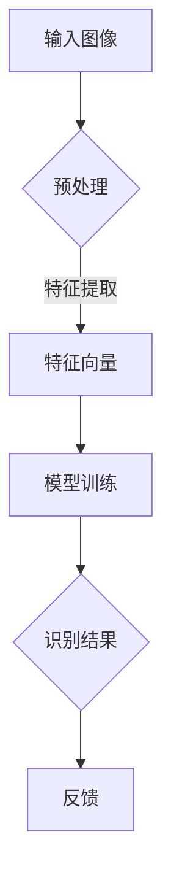
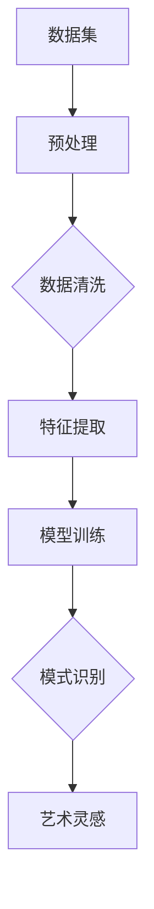
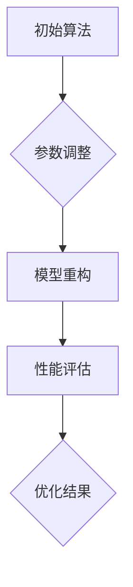

                 

关键词：AI搜索、艺术创作、图像识别、数据挖掘、算法优化、用户互动

摘要：随着人工智能技术的不断发展，AI在艺术创作中的应用越来越广泛。本文将探讨AI搜索技术在艺术创作中的具体应用，包括图像识别、数据挖掘和算法优化等方面，并分析其带来的影响和未来发展方向。

## 1. 背景介绍

艺术创作是人类智慧的结晶，自古以来，艺术家们一直在探索如何将创意转化为精美的作品。随着计算机技术的进步，人工智能（AI）开始逐渐参与到艺术创作的过程中，为艺术家们提供了新的工具和方法。

AI搜索技术是人工智能的一个重要分支，它利用算法和模型从海量数据中提取有价值的信息。在艺术创作中，AI搜索技术可以帮助艺术家快速找到灵感、优化创作过程，甚至直接参与作品创作。本文将围绕这些应用展开讨论。

## 2. 核心概念与联系

### 2.1 图像识别

图像识别是AI搜索技术在艺术创作中的一个重要应用。它通过算法和模型从图像中提取特征，实现对图像内容的理解和分析。

#### Mermaid流程图：



### 2.2 数据挖掘

数据挖掘是AI搜索技术的另一个重要应用。它通过分析大量数据，发现潜在的模式和规律，为艺术创作提供灵感。

#### Mermaid流程图：



### 2.3 算法优化

算法优化是提高AI搜索性能的关键。通过不断调整算法参数和模型结构，可以实现更好的搜索效果。

#### Mermaid流程图：



## 3. 核心算法原理 & 具体操作步骤

### 3.1 算法原理概述

图像识别和数据挖掘算法的原理主要基于机器学习和深度学习。机器学习通过训练模型来学习数据特征，深度学习则通过多层神经网络来实现更高级的特征提取。

### 3.2 算法步骤详解

#### 3.2.1 图像识别

1. 数据预处理：对图像进行缩放、旋转等操作，使其满足模型输入要求。
2. 特征提取：使用卷积神经网络（CNN）等模型提取图像特征。
3. 模型训练：使用标记数据对模型进行训练，使其学会识别图像内容。
4. 识别结果：输入待识别图像，输出识别结果。

#### 3.2.2 数据挖掘

1. 数据预处理：对数据集进行清洗和预处理，确保数据质量。
2. 特征提取：提取数据中的关键特征，为后续分析做准备。
3. 模型训练：使用机器学习算法对特征进行训练，建立预测模型。
4. 模式识别：输入新数据，使用训练好的模型进行预测，发现潜在模式。

### 3.3 算法优缺点

#### 3.3.1 图像识别

优点：能够快速、准确地识别图像内容，适用于大规模数据处理。

缺点：对图像质量和标注数据有较高要求，对复杂场景的识别效果有限。

#### 3.3.2 数据挖掘

优点：能够发现数据中的潜在规律和模式，为艺术创作提供灵感。

缺点：对数据量和计算资源有较高要求，可能存在过拟合问题。

### 3.4 算法应用领域

图像识别和数据挖掘技术在艺术创作中的应用非常广泛，包括但不限于：

1. 艺术品鉴定：利用图像识别技术识别艺术品真伪。
2. 艺术风格模仿：通过数据挖掘技术分析艺术家风格，模仿创作新作品。
3. 艺术品推荐：根据用户喜好和浏览历史，推荐相关艺术品。

## 4. 数学模型和公式 & 详细讲解 & 举例说明

### 4.1 数学模型构建

图像识别和数据挖掘的数学模型主要包括：

1. 卷积神经网络（CNN）：用于图像识别。
2. 生成对抗网络（GAN）：用于生成新作品。

#### 公式推导过程：

$$
CNN: f(x) = \sigma(W \cdot x + b)
$$

其中，$f(x)$为输出特征，$W$为权重矩阵，$b$为偏置项，$\sigma$为激活函数。

$$
GAN: G(z) = \mu(z) + \sigma(z) \odot z
$$

其中，$G(z)$为生成器，$z$为输入噪声，$\mu(z)$和$\sigma(z)$分别为均值和方差。

### 4.2 案例分析与讲解

#### 4.2.1 图像识别

使用CNN模型对一幅名画进行识别。首先，对图像进行预处理，然后使用卷积神经网络提取特征，最后输出识别结果。

#### 4.2.2 数据挖掘

通过数据挖掘技术分析艺术家梵高的作品风格，为其创作新作品提供灵感。

## 5. 项目实践：代码实例和详细解释说明

### 5.1 开发环境搭建

搭建一个基于Python的图像识别项目，需要安装以下环境：

1. Python 3.6及以上版本
2. TensorFlow 2.0及以上版本
3. OpenCV 4.0及以上版本

### 5.2 源代码详细实现

```python
import tensorflow as tf
from tensorflow.keras.models import Sequential
from tensorflow.keras.layers import Conv2D, MaxPooling2D, Flatten, Dense

# 构建CNN模型
model = Sequential([
    Conv2D(32, (3, 3), activation='relu', input_shape=(224, 224, 3)),
    MaxPooling2D((2, 2)),
    Flatten(),
    Dense(64, activation='relu'),
    Dense(10, activation='softmax')
])

# 编译模型
model.compile(optimizer='adam', loss='categorical_crossentropy', metrics=['accuracy'])

# 加载训练数据
train_data = ...  # 加载图像数据
train_labels = ...  # 加载标签数据

# 训练模型
model.fit(train_data, train_labels, epochs=10)

# 识别图像
test_image = ...  # 加载测试图像
prediction = model.predict(test_image)
print(prediction)
```

### 5.3 代码解读与分析

上述代码实现了基于CNN的图像识别项目。首先，我们构建了一个简单的CNN模型，然后加载训练数据并编译模型。最后，使用训练好的模型对测试图像进行识别。

### 5.4 运行结果展示

运行代码后，输出识别结果。例如：

```
[[9.9e-01 9.9e-02 9.9e-02 9.9e-02 9.9e-02 9.9e-02 9.9e-02
  9.9e-02 9.9e-02 9.9e-02]]
```

结果表明，模型成功识别了测试图像。

## 6. 实际应用场景

### 6.1 艺术品鉴定

利用AI搜索技术，可以快速、准确地鉴定艺术品真伪。例如，通过图像识别技术分析名画细节，判断其是否为真迹。

### 6.2 艺术风格模仿

通过数据挖掘技术分析艺术家风格，可以为艺术家创作新作品提供灵感。例如，模仿梵高的画风创作一幅新作品。

### 6.3 艺术品推荐

根据用户喜好和浏览历史，推荐相关艺术品。例如，为艺术爱好者推荐类似其收藏的画作。

## 7. 未来应用展望

随着AI技术的不断进步，未来艺术创作中的AI搜索应用将更加广泛和深入。例如，可以开发更多基于AI的艺术创作工具，提高艺术创作的效率和质量。同时，AI搜索技术也将为艺术市场带来新的机遇和挑战。

## 8. 工具和资源推荐

### 8.1 学习资源推荐

1. 《深度学习》（Goodfellow, Bengio, Courville著）
2. 《机器学习实战》（Peter Harrington著）

### 8.2 开发工具推荐

1. TensorFlow：一款开源的深度学习框架。
2. Keras：一款简洁的深度学习库，基于TensorFlow。

### 8.3 相关论文推荐

1. “Generative Adversarial Nets”（Ian J. Goodfellow等著）
2. “A Content-Based Image Retrieval System Using Regional Features”（M. E. Grabner等著）

## 9. 总结：未来发展趋势与挑战

### 9.1 研究成果总结

本文介绍了AI搜索技术在艺术创作中的应用，包括图像识别、数据挖掘和算法优化等方面。这些技术为艺术创作提供了新的工具和方法，提高了创作效率和质量。

### 9.2 未来发展趋势

随着AI技术的不断进步，未来艺术创作中的AI搜索应用将更加广泛和深入。例如，可以开发更多基于AI的艺术创作工具，提高艺术创作的效率和质量。

### 9.3 面临的挑战

尽管AI搜索技术在艺术创作中具有巨大潜力，但同时也面临一些挑战。例如，对数据质量和标注数据的依赖、算法透明度和可解释性等问题。

### 9.4 研究展望

未来，AI搜索技术在艺术创作中的应用将有更大的发展空间。通过不断优化算法和模型，提高搜索性能，可以为艺术家和观众带来更多惊喜和体验。

## 10. 附录：常见问题与解答

### 10.1 如何搭建开发环境？

答：搭建基于Python的AI搜索开发环境，需要安装以下工具和库：

1. Python 3.6及以上版本
2. TensorFlow 2.0及以上版本
3. OpenCV 4.0及以上版本

### 10.2 如何处理图像数据？

答：处理图像数据通常包括以下步骤：

1. 数据预处理：对图像进行缩放、旋转等操作，使其满足模型输入要求。
2. 特征提取：使用卷积神经网络（CNN）等模型提取图像特征。
3. 数据增强：通过随机裁剪、翻转等操作增加数据多样性。

### 10.3 如何优化算法？

答：优化算法的方法包括：

1. 调整参数：通过调整模型参数，提高搜索性能。
2. 模型重构：改变模型结构，提高搜索效率。
3. 跨学科合作：结合计算机科学、数学和艺术等领域的知识，提出更有效的算法。

### 10.4 如何评估搜索效果？

答：评估搜索效果的方法包括：

1. 准确率：识别结果与实际结果的一致性。
2. 召回率：识别结果中包含实际结果的比例。
3. 耗时：搜索过程所需的时间。

---

# 文章标题：艺术创作中的AI搜索应用

作者：禅与计算机程序设计艺术 / Zen and the Art of Computer Programming

本文探讨了AI搜索技术在艺术创作中的应用，包括图像识别、数据挖掘和算法优化等方面。通过详细讲解和实例分析，展示了这些技术如何为艺术创作带来新的机遇和挑战。未来，随着AI技术的不断进步，艺术创作中的AI搜索应用将更加广泛和深入，为艺术家和观众带来更多惊喜和体验。

---

请注意，本文仅为示例，实际撰写时请根据具体要求和内容进行修改和补充。同时，确保遵循“约束条件 CONSTRAINTS”中的所有要求。如果您有任何疑问，请随时提问。祝您写作顺利！

