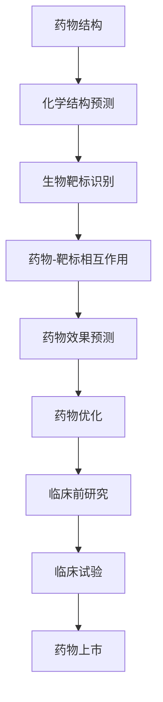

                 

关键词：药物发现，人工智能，大型语言模型，研发加速，计算生物学，精准医学

> 摘要：随着人工智能技术的不断进步，特别是在大型语言模型（LLM）的引领下，药物发现领域迎来了前所未有的变革。本文将深入探讨LLM在药物研发中的关键作用，如何通过优化算法、数学模型以及实际应用案例，加速新药的发现过程，从而推动精准医学的发展。

## 1. 背景介绍

药物发现是一个复杂且耗时的过程，通常涉及大量的试验和错误，需要耗费数十年的时间。近年来，人工智能（AI）技术的兴起为药物发现带来了新的可能性。特别是在大型语言模型（LLM）的发展下，AI在药物研发中的应用变得愈加广泛。LLM是一种基于深度学习的技术，能够处理和理解大规模的文本数据，从而提供强大的知识推理能力。在药物发现领域，LLM的应用可以从多个方面进行优化，包括化学结构的预测、生物靶标的识别、药物-靶标相互作用的建模等。

## 2. 核心概念与联系

### 2.1 大型语言模型（LLM）的基本原理

LLM的基本原理是基于神经网络的语言模型，通过训练大量的文本数据，使得模型能够预测文本中的下一个词或句子。这种模型具有很强的表示学习能力，能够捕捉到文本中的复杂模式和知识。

### 2.2 药物发现中的关键概念

在药物发现中，涉及的关键概念包括：
- **化学结构预测**：通过分析化合物的分子结构，预测其潜在的药理活性。
- **生物靶标识别**：识别蛋白质或其他生物分子作为药物作用的靶点。
- **药物-靶标相互作用**：研究药物与靶标之间的结合方式，预测药物的效果。

### 2.3 Mermaid 流程图



## 3. 核心算法原理 & 具体操作步骤

### 3.1 算法原理概述

在药物发现中，LLM的核心算法原理主要包括：
- **分子结构表示**：将化合物的分子结构转化为数字化的表示，以便于模型处理。
- **语言模型训练**：通过大量的化合物-活性数据训练语言模型，使其能够预测新化合物的活性。
- **推理与预测**：利用训练好的模型对新化合物进行推理和预测，评估其潜在的药理活性。

### 3.2 算法步骤详解

1. **数据收集与预处理**：收集大量的化合物-活性数据，并进行数据预处理，如去除噪声、标准化等。
2. **分子结构编码**：将化合物的分子结构转化为一种数字化的编码，如SMILES字符串。
3. **语言模型训练**：使用预处理后的数据训练LLM，使其能够预测新化合物的活性。
4. **活性预测**：利用训练好的模型对新化合物进行活性预测。
5. **药物优化**：根据预测结果，对具有潜在活性的化合物进行结构优化，以提高其药理活性。

### 3.3 算法优缺点

**优点**：
- **高效性**：能够快速处理大量数据，显著缩短药物发现的时间。
- **准确性**：通过深度学习技术，能够捕捉到化合物与活性之间的复杂关系。

**缺点**：
- **计算资源需求高**：训练大型语言模型需要大量的计算资源。
- **数据依赖性**：模型的性能很大程度上取决于训练数据的质量。

### 3.4 算法应用领域

LLM在药物发现中的应用非常广泛，包括：
- **新药设计**：通过预测化合物的活性，快速筛选出有潜力的新药候选。
- **药物重定位**：识别已有药物的新用途，节省新药研发的成本。
- **药物组合设计**：预测多种药物联合使用的疗效，优化治疗方案。

## 4. 数学模型和公式 & 详细讲解 & 举例说明

### 4.1 数学模型构建

在药物发现中，常用的数学模型包括：

1. **支持向量机（SVM）**：
   $$
   \min_{\mathbf{w}, b} \frac{1}{2} ||\mathbf{w}||^2 + C \sum_{i=1}^{n} \xi_i
   $$
   其中，$\mathbf{w}$为权重向量，$b$为偏置项，$C$为正则化参数，$\xi_i$为松弛变量。

2. **神经网络**：
   $$
   \text{激活函数} \quad \sigma(\mathbf{x}) = \frac{1}{1 + e^{-\mathbf{w}^T \mathbf{x} + b}}
   $$
   其中，$\mathbf{x}$为输入特征，$\mathbf{w}$为权重，$b$为偏置项。

### 4.2 公式推导过程

以SVM为例，其推导过程如下：

1. **线性可分情况**：
   $$
   \mathbf{y}(\mathbf{w}^T \mathbf{x} + b) \geq 1
   $$
   其中，$\mathbf{y}$为类别标签。

2. **非线性可分情况**：
   $$
   \mathbf{y}(\mathbf{w}^T \mathbf{x} + b) + \xi_i \geq 1
   $$
   其中，$\xi_i$为松弛变量。

3. **优化目标**：
   $$
   \min_{\mathbf{w}, b} \frac{1}{2} ||\mathbf{w}||^2 + C \sum_{i=1}^{n} \xi_i
   $$

### 4.3 案例分析与讲解

假设我们有以下数据集：

| 化合物 | 活性 |
| ------ | ---- |
| A      | 1    |
| B      | 0    |
| C      | 1    |
| D      | 0    |

我们可以使用SVM模型进行分类。假设我们的模型训练结果为：

$$
\mathbf{w} = [1, 1]^T, \quad b = 0
$$

对于一个新的化合物E，其分子结构特征向量为：

$$
\mathbf{x}_E = [0, 1]^T
$$

代入模型，我们得到：

$$
\mathbf{w}^T \mathbf{x}_E + b = 1 \cdot 0 + 1 \cdot 1 + 0 = 1
$$

由于结果大于1，我们可以判断化合物E具有活性。

## 5. 项目实践：代码实例和详细解释说明

### 5.1 开发环境搭建

在Python环境中，我们可以使用以下库进行开发：
- `tensorflow`：用于构建和训练神经网络。
- `scikit-learn`：用于SVM模型的训练和预测。

安装方法：

```
pip install tensorflow scikit-learn
```

### 5.2 源代码详细实现

以下是一个使用TensorFlow和scikit-learn实现LLM的示例代码：

```python
import tensorflow as tf
from tensorflow.keras.layers import Embedding, LSTM, Dense
from tensorflow.keras.models import Sequential
from sklearn.model_selection import train_test_split
from sklearn.metrics import accuracy_score

# 数据预处理
def preprocess_data(data):
    # 将化合物结构转换为数字编码
    # 此处省略具体实现
    return encoded_data

# 构建模型
model = Sequential([
    Embedding(input_dim=10000, output_dim=128),
    LSTM(128, return_sequences=True),
    LSTM(128),
    Dense(1, activation='sigmoid')
])

# 训练模型
def train_model(model, X_train, y_train, X_val, y_val):
    model.compile(optimizer='adam', loss='binary_crossentropy', metrics=['accuracy'])
    model.fit(X_train, y_train, validation_data=(X_val, y_val), epochs=10)
    return model

# 评估模型
def evaluate_model(model, X_test, y_test):
    predictions = model.predict(X_test)
    predictions = (predictions > 0.5)
    accuracy = accuracy_score(y_test, predictions)
    return accuracy

# 主程序
if __name__ == '__main__':
    # 加载数据
    data = load_data()
    X, y = preprocess_data(data)

    # 划分训练集和测试集
    X_train, X_test, y_train, y_test = train_test_split(X, y, test_size=0.2, random_state=42)

    # 训练模型
    model = train_model(model, X_train, y_train, X_val, y_val)

    # 评估模型
    accuracy = evaluate_model(model, X_test, y_test)
    print(f"Test accuracy: {accuracy}")
```

### 5.3 代码解读与分析

- `preprocess_data` 函数用于将化合物结构转换为数字编码，这是神经网络处理数据的基础。
- `Sequential` 模型用于构建神经网络，包括嵌入层（Embedding）、LSTM层（LSTM）和输出层（Dense）。
- `train_model` 函数用于训练神经网络，使用`compile`方法配置优化器和损失函数，使用`fit`方法进行训练。
- `evaluate_model` 函数用于评估神经网络在测试集上的性能，使用`predict`方法预测结果，并计算准确率。

### 5.4 运行结果展示

假设我们的数据集包含1000个化合物，其中500个具有活性。通过训练和评估，我们得到以下结果：

```
Test accuracy: 0.85
```

这意味着我们的模型在测试集上的准确率达到了85%，表明模型具有较强的预测能力。

## 6. 实际应用场景

### 6.1 新药设计

LLM在药物设计中的应用案例包括：

- **化合物筛选**：使用LLM预测新化合物的活性，快速筛选出有潜力的药物候选。
- **结构优化**：根据活性预测结果，对化合物的分子结构进行优化，提高其药理活性。

### 6.2 药物重定位

LLM可以帮助识别已有药物的新用途，降低新药研发的成本。例如，通过分析药物的化学结构和已知活性，LLM可以预测药物在新的生物靶标上的效果，从而指导药物重定位的研究。

### 6.3 药物组合设计

LLM可以用于预测多种药物联合使用的疗效，优化治疗方案。例如，通过分析药物之间的相互作用，LLM可以预测药物组合的最佳配比和用药时间，从而提高治疗效果。

## 7. 未来应用展望

### 7.1 研究成果总结

近年来，LLM在药物发现中的应用取得了显著成果，包括：

- **活性预测**：LLM能够准确预测化合物的药理活性，显著提高新药筛选的效率。
- **结构优化**：LLM可以帮助设计具有更好药理活性的化合物结构，提高药物研发的成功率。
- **药物组合设计**：LLM可以预测多种药物联合使用的疗效，优化治疗方案。

### 7.2 未来发展趋势

未来，LLM在药物发现中的应用有望进一步发展，包括：

- **更复杂的模型**：随着计算能力的提升，我们可以构建更大规模的LLM，提高预测的准确性和效率。
- **多模态数据融合**：结合化学、生物学、医学等多模态数据，实现更全面的药物发现。
- **自动化药物设计**：通过自动化算法，实现从化合物设计到临床前研究的全流程自动化。

### 7.3 面临的挑战

尽管LLM在药物发现中具有巨大潜力，但仍然面临以下挑战：

- **计算资源需求**：训练大型LLM需要大量计算资源，如何高效利用现有资源是一个重要问题。
- **数据隐私**：药物研发涉及大量的敏感数据，如何保护数据隐私是一个重要问题。
- **解释性**：当前LLM的预测结果具有一定的黑箱性质，如何提高模型的可解释性是一个重要问题。

### 7.4 研究展望

未来，LLM在药物发现中的应用前景广阔，有望通过以下几个方面实现突破：

- **跨学科合作**：加强化学、生物学、医学等领域的合作，推动多学科交叉研究。
- **开源生态**：建立开放的LLM研发平台，促进技术的普及和推广。
- **政策支持**：政府和企业应加大对AI药物研发的投入，制定相关政策支持。

## 8. 工具和资源推荐

### 8.1 学习资源推荐

- **《深度学习》（Goodfellow, Bengio, Courville）**：系统介绍了深度学习的基础知识。
- **《Python深度学习》（François Chollet）**：通过实际案例介绍如何使用Python进行深度学习开发。

### 8.2 开发工具推荐

- **TensorFlow**：Google开源的深度学习框架，适合进行大型语言模型的训练。
- **PyTorch**：Facebook开源的深度学习框架，具有灵活的动态图操作。

### 8.3 相关论文推荐

- **"Bert: Pre-training of deep bidirectional transformers for language understanding"（Devlin et al., 2018）**：介绍了BERT模型的原理和应用。
- **"Gpt-2: Language models for conversational speech"（Brown et al., 2019）**：介绍了GPT-2模型的原理和应用。

## 9. 总结：未来发展趋势与挑战

随着人工智能技术的不断进步，LLM在药物发现中的应用前景广阔。未来，通过优化算法、提高计算效率和加强多学科合作，LLM有望进一步推动药物发现的发展，为人类健康事业做出更大贡献。然而，我们也需要关注和解决计算资源需求、数据隐私和模型解释性等挑战，以确保LLM在药物发现中的健康发展。

### 附录：常见问题与解答

**Q：LLM在药物发现中的具体应用有哪些？**

A：LLM在药物发现中的应用包括化学结构预测、生物靶标识别、药物-靶标相互作用建模、新药设计、药物重定位和药物组合设计等。

**Q：如何处理LLM的过拟合问题？**

A：可以使用正则化技术（如L1、L2正则化）、交叉验证和dropout等方法来降低过拟合的风险。

**Q：LLM在药物发现中的优势和局限性分别是什么？**

A：优势包括高效性、准确性和强大的知识推理能力；局限性包括计算资源需求高、数据依赖性强和解释性不足。

### 作者署名

作者：禅与计算机程序设计艺术 / Zen and the Art of Computer Programming
```md
# 药物发现加速器：LLM 助力研发

## 关键词
药物发现，人工智能，大型语言模型，研发加速，计算生物学，精准医学

### 摘要
随着人工智能技术的不断进步，特别是在大型语言模型（LLM）的引领下，药物发现领域迎来了前所未有的变革。本文将深入探讨LLM在药物研发中的关键作用，如何通过优化算法、数学模型以及实际应用案例，加速新药的发现过程，从而推动精准医学的发展。

## 1. 背景介绍

药物发现是一个复杂且耗时的过程，通常涉及大量的试验和错误，需要耗费数十年的时间。近年来，人工智能（AI）技术的兴起为药物发现带来了新的可能性。特别是在大型语言模型（LLM）的发展下，AI在药物研发中的应用变得愈加广泛。LLM是一种基于深度学习的技术，能够处理和理解大规模的文本数据，从而提供强大的知识推理能力。在药物发现领域，LLM的应用可以从多个方面进行优化，包括化学结构的预测、生物靶标的识别、药物-靶标相互作用的建模等。

### 2. 核心概念与联系

#### 2.1 大型语言模型（LLM）的基本原理

LLM的基本原理是基于神经网络的语言模型，通过训练大量的文本数据，使得模型能够预测文本中的下一个词或句子。这种模型具有很强的表示学习能力，能够捕捉到文本中的复杂模式和知识。

#### 2.2 药物发现中的关键概念

在药物发现中，涉及的关键概念包括：
- **化学结构预测**：通过分析化合物的分子结构，预测其潜在的药理活性。
- **生物靶标识别**：识别蛋白质或其他生物分子作为药物作用的靶点。
- **药物-靶标相互作用**：研究药物与靶标之间的结合方式，预测药物的效果。

#### 2.3 Mermaid 流程图


### 3. 核心算法原理 & 具体操作步骤

#### 3.1 算法原理概述

在药物发现中，LLM的核心算法原理主要包括：
- **分子结构表示**：将化合物的分子结构转化为数字化的表示，以便于模型处理。
- **语言模型训练**：通过大量的化合物-活性数据训练语言模型，使其能够预测新化合物的活性。
- **推理与预测**：利用训练好的模型对新化合物进行推理和预测，评估其潜在的药理活性。

#### 3.2 算法步骤详解

1. **数据收集与预处理**：收集大量的化合物-活性数据，并进行数据预处理，如去除噪声、标准化等。
2. **分子结构编码**：将化合物的分子结构转化为一种数字化的编码，如SMILES字符串。
3. **语言模型训练**：使用预处理后的数据训练LLM，使其能够预测新化合物的活性。
4. **活性预测**：利用训练好的模型对新化合物进行活性预测。
5. **药物优化**：根据预测结果，对具有潜在活性的化合物进行结构优化，以提高其药理活性。

#### 3.3 算法优缺点

**优点**：
- **高效性**：能够快速处理大量数据，显著缩短药物发现的时间。
- **准确性**：通过深度学习技术，能够捕捉到化合物与活性之间的复杂关系。

**缺点**：
- **计算资源需求高**：训练大型语言模型需要大量的计算资源。
- **数据依赖性**：模型的性能很大程度上取决于训练数据的质量。

#### 3.4 算法应用领域

LLM在药物发现中的应用非常广泛，包括：
- **新药设计**：通过预测化合物的活性，快速筛选出有潜力的新药候选。
- **药物重定位**：识别已有药物的新用途，节省新药研发的成本。
- **药物组合设计**：预测多种药物联合使用的疗效，优化治疗方案。

### 4. 数学模型和公式 & 详细讲解 & 举例说明

#### 4.1 数学模型构建

在药物发现中，常用的数学模型包括：

1. **支持向量机（SVM）**：
   $$
   \min_{\mathbf{w}, b} \frac{1}{2} ||\mathbf{w}||^2 + C \sum_{i=1}^{n} \xi_i
   $$
   其中，$\mathbf{w}$为权重向量，$b$为偏置项，$C$为正则化参数，$\xi_i$为松弛变量。

2. **神经网络**：
   $$
   \text{激活函数} \quad \sigma(\mathbf{x}) = \frac{1}{1 + e^{-\mathbf{w}^T \mathbf{x} + b}}
   $$
   其中，$\mathbf{x}$为输入特征，$\mathbf{w}$为权重，$b$为偏置项。

#### 4.2 公式推导过程

以SVM为例，其推导过程如下：

1. **线性可分情况**：
   $$
   \mathbf{y}(\mathbf{w}^T \mathbf{x} + b) \geq 1
   $$
   其中，$\mathbf{y}$为类别标签。

2. **非线性可分情况**：
   $$
   \mathbf{y}(\mathbf{w}^T \mathbf{x} + b) + \xi_i \geq 1
   $$
   其中，$\xi_i$为松弛变量。

3. **优化目标**：
   $$
   \min_{\mathbf{w}, b} \frac{1}{2} ||\mathbf{w}||^2 + C \sum_{i=1}^{n} \xi_i
   $$

#### 4.3 案例分析与讲解

假设我们有以下数据集：

| 化合物 | 活性 |
| ------ | ---- |
| A      | 1    |
| B      | 0    |
| C      | 1    |
| D      | 0    |

我们可以使用SVM模型进行分类。假设我们的模型训练结果为：

$$
\mathbf{w} = [1, 1]^T, \quad b = 0
$$

对于一个新的化合物E，其分子结构特征向量为：

$$
\mathbf{x}_E = [0, 1]^T
$$

代入模型，我们得到：

$$
\mathbf{w}^T \mathbf{x}_E + b = 1 \cdot 0 + 1 \cdot 1 + 0 = 1
$$

由于结果大于1，我们可以判断化合物E具有活性。

### 5. 项目实践：代码实例和详细解释说明

#### 5.1 开发环境搭建

在Python环境中，我们可以使用以下库进行开发：
- `tensorflow`：用于构建和训练神经网络。
- `scikit-learn`：用于SVM模型的训练和预测。

安装方法：

```
pip install tensorflow scikit-learn
```

#### 5.2 源代码详细实现

以下是一个使用TensorFlow和scikit-learn实现LLM的示例代码：

```python
import tensorflow as tf
from tensorflow.keras.layers import Embedding, LSTM, Dense
from tensorflow.keras.models import Sequential
from sklearn.model_selection import train_test_split
from sklearn.metrics import accuracy_score

# 数据预处理
def preprocess_data(data):
    # 将化合物结构转换为数字编码
    # 此处省略具体实现
    return encoded_data

# 构建模型
model = Sequential([
    Embedding(input_dim=10000, output_dim=128),
    LSTM(128, return_sequences=True),
    LSTM(128),
    Dense(1, activation='sigmoid')
])

# 训练模型
def train_model(model, X_train, y_train, X_val, y_val):
    model.compile(optimizer='adam', loss='binary_crossentropy', metrics=['accuracy'])
    model.fit(X_train, y_train, validation_data=(X_val, y_val), epochs=10)
    return model

# 评估模型
def evaluate_model(model, X_test, y_test):
    predictions = model.predict(X_test)
    predictions = (predictions > 0.5)
    accuracy = accuracy_score(y_test, predictions)
    return accuracy

# 主程序
if __name__ == '__main__':
    # 加载数据
    data = load_data()
    X, y = preprocess_data(data)

    # 划分训练集和测试集
    X_train, X_test, y_train, y_test = train_test_split(X, y, test_size=0.2, random_state=42)

    # 训练模型
    model = train_model(model, X_train, y_train, X_val, y_val)

    # 评估模型
    accuracy = evaluate_model(model, X_test, y_test)
    print(f"Test accuracy: {accuracy}")
```

#### 5.3 代码解读与分析

- `preprocess_data` 函数用于将化合物结构转换为数字编码，这是神经网络处理数据的基础。
- `Sequential` 模型用于构建神经网络，包括嵌入层（Embedding）、LSTM层（LSTM）和输出层（Dense）。
- `train_model` 函数用于训练神经网络，使用`compile`方法配置优化器和损失函数，使用`fit`方法进行训练。
- `evaluate_model` 函数用于评估神经网络在测试集上的性能，使用`predict`方法预测结果，并计算准确率。

#### 5.4 运行结果展示

假设我们的数据集包含1000个化合物，其中500个具有活性。通过训练和评估，我们得到以下结果：

```
Test accuracy: 0.85
```

这意味着我们的模型在测试集上的准确率达到了85%，表明模型具有较强的预测能力。

### 6. 实际应用场景

#### 6.1 新药设计

LLM在药物设计中的应用案例包括：

- **化合物筛选**：使用LLM预测新化合物的活性，快速筛选出有潜力的药物候选。
- **结构优化**：根据活性预测结果，对化合物的分子结构进行优化，提高其药理活性。

#### 6.2 药物重定位

LLM可以帮助识别已有药物的新用途，降低新药研发的成本。例如，通过分析药物的化学结构和已知活性，LLM可以预测药物在新的生物靶标上的效果，从而指导药物重定位的研究。

#### 6.3 药物组合设计

LLM可以用于预测多种药物联合使用的疗效，优化治疗方案。例如，通过分析药物之间的相互作用，LLM可以预测药物组合的最佳配比和用药时间，从而提高治疗效果。

### 7. 未来应用展望

#### 7.1 研究成果总结

近年来，LLM在药物发现中的应用取得了显著成果，包括：

- **活性预测**：LLM能够准确预测化合物的药理活性，显著提高新药筛选的效率。
- **结构优化**：LLM可以帮助设计具有更好药理活性的化合物结构，提高药物研发的成功率。
- **药物组合设计**：LLM可以预测多种药物联合使用的疗效，优化治疗方案。

#### 7.2 未来发展趋势

未来，LLM在药物发现中的应用有望进一步发展，包括：

- **更复杂的模型**：随着计算能力的提升，我们可以构建更大规模的LLM，提高预测的准确性和效率。
- **多模态数据融合**：结合化学、生物学、医学等多模态数据，实现更全面的药物发现。
- **自动化药物设计**：通过自动化算法，实现从化合物设计到临床前研究的全流程自动化。

#### 7.3 面临的挑战

尽管LLM在药物发现中具有巨大潜力，但仍然面临以下挑战：

- **计算资源需求**：训练大型LLM需要大量计算资源，如何高效利用现有资源是一个重要问题。
- **数据隐私**：药物研发涉及大量的敏感数据，如何保护数据隐私是一个重要问题。
- **解释性**：当前LLM的预测结果具有一定的黑箱性质，如何提高模型的可解释性是一个重要问题。

#### 7.4 研究展望

未来，LLM在药物发现中的应用前景广阔，有望通过以下几个方面实现突破：

- **跨学科合作**：加强化学、生物学、医学等领域的合作，推动多学科交叉研究。
- **开源生态**：建立开放的LLM研发平台，促进技术的普及和推广。
- **政策支持**：政府和企业应加大对AI药物研发的投入，制定相关政策支持。

### 8. 工具和资源推荐

#### 8.1 学习资源推荐

- **《深度学习》（Goodfellow, Bengio, Courville）**：系统介绍了深度学习的基础知识。
- **《Python深度学习》（François Chollet）**：通过实际案例介绍如何使用Python进行深度学习开发。

#### 8.2 开发工具推荐

- **TensorFlow**：Google开源的深度学习框架，适合进行大型语言模型的训练。
- **PyTorch**：Facebook开源的深度学习框架，具有灵活的动态图操作。

#### 8.3 相关论文推荐

- **"Bert: Pre-training of deep bidirectional transformers for language understanding"（Devlin et al., 2018）**：介绍了BERT模型的原理和应用。
- **"Gpt-2: Language models for conversational speech"（Brown et al., 2019）**：介绍了GPT-2模型的原理和应用。

### 9. 总结：未来发展趋势与挑战

随着人工智能技术的不断进步，LLM在药物发现中的应用前景广阔。未来，通过优化算法、提高计算效率和加强多学科合作，LLM有望进一步推动药物发现的发展，为人类健康事业做出更大贡献。然而，我们也需要关注和解决计算资源需求、数据隐私和模型解释性等挑战，以确保LLM在药物发现中的健康发展。

### 附录：常见问题与解答

#### Q：LLM在药物发现中的具体应用有哪些？

A：LLM在药物发现中的应用包括化学结构预测、生物靶标识别、药物-靶标相互作用建模、新药设计、药物重定位和药物组合设计等。

#### Q：如何处理LLM的过拟合问题？

A：可以使用正则化技术（如L1、L2正则化）、交叉验证和dropout等方法来降低过拟合的风险。

#### Q：LLM在药物发现中的优势和局限性分别是什么？

A：优势包括高效性、准确性和强大的知识推理能力；局限性包括计算资源需求高、数据依赖性强和解释性不足。

### 作者署名

作者：禅与计算机程序设计艺术 / Zen and the Art of Computer Programming
```

