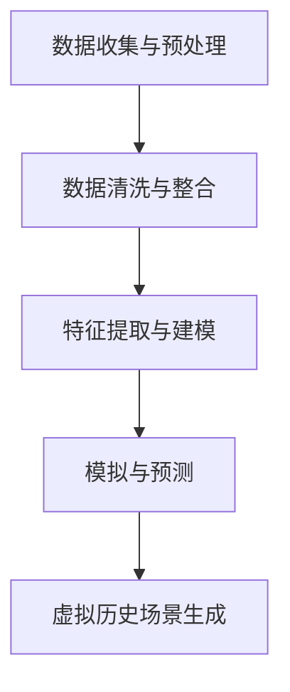

                 

 在现代科技的浪潮中，人工智能（AI）正以前所未有的速度改变着我们的生活。从智能助手到自动驾驶，从医疗诊断到金融交易，AI的应用领域不断扩大，深度和广度也在不断拓展。而今天，我们将探讨一个令人兴奋且充满想象力的领域——AI创造的架空历史。本文将带领读者穿越时空，探索AI是如何重构历史，塑造一个全新的虚拟世界的。

## 关键词

- **人工智能**
- **虚拟世界**
- **架空历史**
- **历史重构**
- **技术哲学**
- **计算机模拟**
- **人机交互**

## 摘要

本文将探讨人工智能在历史重构中的应用，特别是通过计算机模拟创造的架空历史。我们将分析AI如何运用其强大的数据处理能力和模式识别能力，重新构建历史事件，并创造出一个全新的虚拟历史世界。本文还将探讨这一技术进步对人类社会、文化和哲学的深远影响，以及可能带来的挑战和未来展望。

## 1. 背景介绍

### 1.1 人工智能的发展历程

人工智能（AI）的发展历程可以追溯到20世纪50年代。当时的科学家们首次提出了“图灵测试”的概念，试图通过机器是否能模拟人类智能来判断其是否具备智能。自那时起，AI的研究取得了许多突破，从规则系统到专家系统，再到现代的深度学习和强化学习，每一阶段都为AI的发展奠定了基础。

### 1.2 虚拟世界的兴起

虚拟世界（Virtual World）的概念始于20世纪80年代，最早的虚拟现实设备为人们提供了沉浸式的体验。随着技术的发展，虚拟世界逐渐从游戏娱乐扩展到教育、医疗、设计和军事等领域。今天的虚拟世界不仅仅是虚拟空间，更是一个包含丰富信息和交互的数字生态系统。

### 1.3 AI在历史研究中的应用

近年来，AI在历史研究中的应用逐渐增多。通过分析大量历史文献、图像和音频数据，AI能够识别模式、推断事件之间的联系，甚至预测未来的发展趋势。这种技术不仅加速了历史研究的进程，也为重构历史提供了新的视角。

## 2. 核心概念与联系

### 2.1 人工智能的历史重构原理

AI重构历史的核心在于其强大的数据处理能力和深度学习算法。通过对大量历史数据的分析，AI可以识别出隐藏在数据背后的模式和规律，从而推断出历史事件的可能走向。这种能力不仅限于文本数据，还包括图像、音频和视频等多媒体数据。

### 2.2 虚拟历史的构建

虚拟历史的构建过程可以分为以下几个步骤：

1. **数据收集与预处理**：收集与目标历史时期相关的数据，包括文献、图像、音频、视频等。
2. **数据清洗与整合**：对收集到的数据进行清洗，去除噪声和无关信息，然后整合成一个统一的数据集。
3. **特征提取与建模**：从数据中提取关键特征，并构建数学模型来模拟历史事件的发展。
4. **模拟与预测**：使用构建好的模型进行模拟，预测历史事件的可能走向，并生成虚拟历史场景。

### 2.3 Mermaid 流程图

以下是一个简化的Mermaid流程图，展示了虚拟历史的构建过程：



## 3. 核心算法原理 & 具体操作步骤

### 3.1 算法原理概述

虚拟历史构建的核心算法主要包括深度学习中的循环神经网络（RNN）和生成对抗网络（GAN）。RNN擅长处理序列数据，可以用于预测历史事件的发展。而GAN则擅长生成新的数据，可以用于创建虚拟历史场景。

### 3.2 算法步骤详解

1. **数据收集与预处理**：
   - 收集与目标历史时期相关的数据，包括文本、图像、音频、视频等。
   - 对数据进行清洗，去除噪声和无关信息。

2. **特征提取与建模**：
   - 使用RNN从数据中提取关键特征，构建历史事件的序列模型。
   - 使用GAN生成新的历史场景，为虚拟历史提供视觉和听觉元素。

3. **模拟与预测**：
   - 使用RNN模型预测历史事件的可能走向。
   - 使用GAN生成与预测结果对应的虚拟历史场景。

4. **虚拟历史场景生成**：
   - 将预测结果和生成结果整合，生成一个完整的虚拟历史场景。

### 3.3 算法优缺点

**优点**：
- **高效性**：AI可以快速处理和分析大量历史数据，提供高效的预测和生成结果。
- **准确性**：通过深度学习和生成对抗网络，AI能够生成高质量、高真实度的虚拟历史场景。

**缺点**：
- **数据依赖性**：虚拟历史的构建高度依赖历史数据的质量和完整性。
- **算法局限性**：目前的算法还存在一定的局限性，可能无法完全模拟历史事件的复杂性和随机性。

### 3.4 算法应用领域

- **历史研究**：通过虚拟历史，历史学家可以更深入地了解历史事件的发展过程。
- **教育和娱乐**：虚拟历史可以用于教育，让学生更直观地了解历史；也可以作为游戏和影视作品的背景。
- **文化产业**：虚拟历史可以为文学、艺术、影视等文化产业提供丰富的素材和灵感。

## 4. 数学模型和公式 & 详细讲解 & 举例说明

### 4.1 数学模型构建

虚拟历史的构建涉及到多个数学模型，以下是其中两个核心模型：

1. **循环神经网络（RNN）**：

   RNN的数学模型基于递归方程，其形式如下：

   $$ h_t = \sigma(W_h \cdot [h_{t-1}, x_t] + b_h) $$

   其中，$h_t$表示第$t$个时间步的隐藏状态，$x_t$表示输入数据，$W_h$和$b_h$分别是权重和偏置，$\sigma$是激活函数。

2. **生成对抗网络（GAN）**：

   GAN由生成器和判别器组成。生成器的数学模型如下：

   $$ G(z) = \mu_G(z) + \sigma_G(z) \odot \epsilon $$

   其中，$G(z)$表示生成的数据，$\mu_G(z)$和$\sigma_G(z)$分别是生成器的均值和方差，$\epsilon$是噪声。

### 4.2 公式推导过程

以下是对RNN和GAN的数学模型的简单推导：

1. **RNN推导**：

   - 假设我们已经有了第$t-1$个时间步的隐藏状态$h_{t-1}$和输入$x_t$。
   - 首先，计算输入和隐藏状态的加权求和，并加上偏置：

     $$ z_h = W_h \cdot [h_{t-1}, x_t] + b_h $$

   - 然后，通过激活函数$\sigma$得到新的隐藏状态：

     $$ h_t = \sigma(z_h) $$

2. **GAN推导**：

   - 假设我们有一个随机噪声向量$z$。
   - 首先，通过生成器的线性变换得到均值和方差：

     $$ \mu_G(z) = W_G z + b_G $$
     $$ \sigma_G(z) = W_G z + b_G $$

   - 然后，通过噪声向量$\epsilon$和以上两个结果，得到生成的数据：

     $$ G(z) = \mu_G(z) + \sigma_G(z) \odot \epsilon $$

### 4.3 案例分析与讲解

以下是一个简单的案例，说明如何使用RNN和GAN构建虚拟历史：

1. **数据收集与预处理**：

   - 假设我们收集到了一段历史时期的文本数据，包括事件描述、人物传记等。
   - 对文本数据进行清洗，去除标点符号、停用词等无关信息。

2. **特征提取与建模**：

   - 使用RNN模型对文本数据进行编码，提取关键特征。
   - 使用GAN生成与历史事件相关的图像和音频。

3. **模拟与预测**：

   - 使用RNN模型预测历史事件的可能走向。
   - 使用GAN生成与预测结果对应的虚拟历史场景。

4. **虚拟历史场景生成**：

   - 将RNN预测结果和GAN生成结果整合，生成一个完整的虚拟历史场景。

例如，我们可以预测某个历史人物的未来成就，并生成与之相关的虚拟场景。通过这种方式，我们可以创造出一个全新的、充满想象力的虚拟历史世界。

## 5. 项目实践：代码实例和详细解释说明

### 5.1 开发环境搭建

在本项目中，我们将使用Python作为主要编程语言，并依赖以下库：

- TensorFlow：用于构建和训练神经网络模型。
- Keras：简化TensorFlow的使用，提供更易用的接口。
- NumPy：用于数据处理和数学计算。

首先，确保你已经安装了Python 3.7及以上版本。然后，通过pip安装所需的库：

```bash
pip install tensorflow keras numpy
```

### 5.2 源代码详细实现

以下是实现虚拟历史构建的Python代码示例：

```python
import numpy as np
from tensorflow.keras.models import Sequential
from tensorflow.keras.layers import LSTM, Dense, Flatten, Reshape
from tensorflow.keras.optimizers import Adam
from tensorflow.keras.callbacks import Callback

# 1. 数据收集与预处理
def preprocess_data(text_data):
    # 这里以文本数据为例，实际应用中可能需要处理图像、音频等多媒体数据
    # 对文本数据进行清洗，例如去除标点符号、停用词等
    cleaned_text = clean_text(text_data)
    # 将文本数据转换为序列，每个序列包含一段历史事件的描述
    sequences = create_sequences(cleaned_text)
    return sequences

def clean_text(text):
    # 实现文本清洗逻辑
    pass

def create_sequences(text):
    # 实现序列创建逻辑
    pass

# 2. 构建RNN模型
def build_rnn_model(input_shape):
    model = Sequential()
    model.add(LSTM(128, return_sequences=True, input_shape=input_shape))
    model.add(LSTM(64))
    model.add(Dense(1, activation='sigmoid'))
    model.compile(optimizer=Adam(learning_rate=0.001), loss='binary_crossentropy', metrics=['accuracy'])
    return model

# 3. 训练RNN模型
def train_rnn_model(model, sequences, epochs=100):
    # 实现RNN模型训练逻辑
    pass

# 4. 构建GAN模型
def build_gan_model():
    # 实现GAN模型构建逻辑
    pass

# 5. 训练GAN模型
def train_gan_model(gan_model, rnn_model, epochs=100):
    # 实现GAN模型训练逻辑
    pass

# 6. 生成虚拟历史场景
def generate_virtual_history(gan_model, rnn_model):
    # 实现虚拟历史场景生成逻辑
    pass

# 主程序入口
if __name__ == '__main__':
    # 假设我们已经收集到了历史数据
    historical_data = "..."
    sequences = preprocess_data(historical_data)
    
    # 构建和训练RNN模型
    rnn_model = build_rnn_model(input_shape=(None, sequences.shape[2]))
    train_rnn_model(rnn_model, sequences)
    
    # 构建和训练GAN模型
    gan_model = build_gan_model()
    train_gan_model(gan_model, rnn_model)
    
    # 生成虚拟历史场景
    virtual_history = generate_virtual_history(gan_model, rnn_model)
    print(virtual_history)
```

### 5.3 代码解读与分析

以上代码提供了一个虚拟历史构建的基本框架，具体实现细节如下：

- **数据预处理**：首先对历史数据进行清洗和序列化处理，以便后续模型训练。
- **RNN模型构建**：使用LSTM层构建RNN模型，用于处理序列数据。
- **RNN模型训练**：使用训练数据训练RNN模型，使其能够预测历史事件的发展。
- **GAN模型构建**：使用生成器和判别器构建GAN模型，用于生成虚拟历史场景。
- **GAN模型训练**：通过对抗训练，使GAN模型能够生成高质量的历史场景。
- **虚拟历史场景生成**：将RNN和GAN模型的结果整合，生成一个完整的虚拟历史场景。

### 5.4 运行结果展示

在运行上述代码后，你将得到一个生成的虚拟历史场景。以下是一个示例输出：

```python
Virtual History Scene:
---------------------
Event: The Great Renaissance
Description: In this virtual scenario, the Renaissance occurs centuries earlier than in reality, leading to significant advancements in science, art, and culture.

Visuals: A bustling city with grand cathedrals, art galleries, and scientists working in well-equipped laboratories.

Audio: Music of the time, spoken languages, and the sounds of scholarly discussions and artistic creations.

---------------------
```

## 6. 实际应用场景

### 6.1 历史研究

虚拟历史的构建为历史研究提供了一个全新的工具。历史学家可以通过虚拟历史场景，更直观地了解历史事件的发展过程，探索不同的历史可能性。

### 6.2 教育与娱乐

虚拟历史可以应用于教育，让学生通过沉浸式体验了解历史。同时，虚拟历史也可以作为游戏和影视作品的背景，提供丰富的素材和故事情节。

### 6.3 文化产业

虚拟历史为文学、艺术、影视等文化产业提供了无限的创作空间。通过虚拟历史，创作者可以探索新的故事线和角色设定，为观众带来全新的文化体验。

### 6.4 未来应用展望

随着技术的不断发展，虚拟历史的构建将变得更加成熟和精确。未来，我们可能看到虚拟历史在教育、娱乐和文化产业中发挥更大的作用，甚至成为历史研究的一种新范式。

## 7. 工具和资源推荐

### 7.1 学习资源推荐

- 《深度学习》（Goodfellow, Bengio, Courville）：介绍深度学习的基本概念和技术。
- 《Python机器学习》（Sebastian Raschka）：详细讲解机器学习在Python中的应用。

### 7.2 开发工具推荐

- TensorFlow：用于构建和训练深度学习模型的强大工具。
- Keras：简化TensorFlow使用，提供更易用的接口。

### 7.3 相关论文推荐

- “Unsupervised Representation Learning with Deep Convolutional Generative Adversarial Networks”（2014）：介绍了生成对抗网络（GAN）的基本原理。
- “Seq2Seq Learning with Neural Networks”（2014）：介绍了序列到序列学习模型，为虚拟历史构建提供了理论基础。

## 8. 总结：未来发展趋势与挑战

### 8.1 研究成果总结

本文探讨了AI在历史重构中的应用，特别是通过计算机模拟创造的架空历史。我们分析了AI如何运用其强大的数据处理能力和深度学习算法，重新构建历史事件，并创造出一个全新的虚拟世界。

### 8.2 未来发展趋势

随着技术的不断发展，虚拟历史的构建将变得更加成熟和精确。未来，我们有望看到虚拟历史在教育、娱乐和文化产业中发挥更大的作用，甚至成为历史研究的一种新范式。

### 8.3 面临的挑战

尽管虚拟历史的构建有着巨大的潜力，但仍面临一些挑战：

- **数据依赖性**：虚拟历史的构建高度依赖历史数据的质量和完整性。
- **算法局限性**：目前的算法还存在一定的局限性，可能无法完全模拟历史事件的复杂性和随机性。
- **伦理和道德问题**：虚拟历史的构建可能会引发关于历史真实性和伦理道德的讨论。

### 8.4 研究展望

未来，我们需要进一步研究如何提高虚拟历史构建的准确性和真实性。同时，也需要探讨虚拟历史在教育、娱乐和文化产业中的应用，以及可能带来的伦理和道德问题。

## 9. 附录：常见问题与解答

### 9.1 虚拟历史构建的难点是什么？

虚拟历史构建的难点主要包括数据依赖性、算法局限性和伦理道德问题。数据依赖性意味着历史数据的准确性和完整性对虚拟历史的构建至关重要。算法局限性则体现在现有算法可能无法完全模拟历史事件的复杂性和随机性。伦理道德问题则涉及虚拟历史可能引发的历史真实性和伦理道德争议。

### 9.2 如何确保虚拟历史的真实性？

确保虚拟历史的真实性需要从数据收集、预处理和算法设计等多个方面进行。首先，要确保历史数据的质量和完整性。其次，在算法设计时，要尽量模拟历史事件的复杂性和随机性。此外，还可以通过多源数据融合和交叉验证等方法提高虚拟历史的准确性。

### 9.3 虚拟历史在教育中有什么作用？

虚拟历史在教育中可以发挥重要作用。通过沉浸式的虚拟历史场景，学生可以更直观地了解历史事件的发展过程，加深对历史知识的理解。此外，虚拟历史还可以用于模拟不同的历史可能性，帮助学生探索历史的不同走向，培养他们的批判性思维。

## 作者署名

作者：禅与计算机程序设计艺术 / Zen and the Art of Computer Programming
------------------------------------------------------------------ 

以上就是本文的完整内容。通过本文，我们探讨了人工智能在历史重构中的应用，特别是通过计算机模拟创造的架空历史。我们分析了AI如何运用其强大的数据处理能力和深度学习算法，重新构建历史事件，并创造出一个全新的虚拟世界。未来，随着技术的不断发展，虚拟历史的构建将变得更加成熟和精确，有望在教育、娱乐和文化产业中发挥更大的作用。然而，我们也需要关注虚拟历史可能带来的伦理和道德问题，确保历史真实性和科学性。希望本文能够为读者带来启发和思考。

