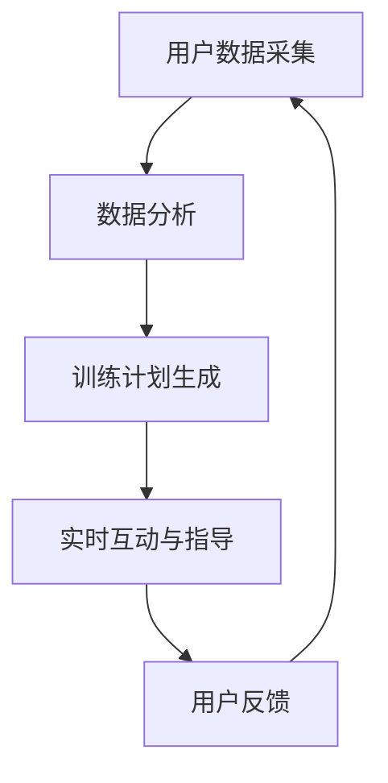

                 

关键词：虚拟健身教练、AI、个人训练、健身应用、技术创业

> 摘要：本文将探讨虚拟健身教练的创业机会，重点分析如何利用人工智能技术实现个性化训练，提高用户健身效果和满意度。文章将详细阐述虚拟健身教练的核心概念、算法原理、数学模型、项目实践，以及未来发展趋势与挑战。

## 1. 背景介绍

随着人们生活水平的提高，健康生活方式日益受到关注。健身作为健康生活方式的重要组成部分，市场需求持续增长。然而，传统的健身方式存在一些问题，如时间成本高、场地限制、教练资源不足等。为了解决这些问题，虚拟健身教练应运而生。虚拟健身教练利用人工智能技术，为用户提供个性化训练方案，实现高效、便捷的健身体验。

### 1.1 市场需求

近年来，虚拟健身教练市场呈现出快速增长的趋势。根据市场研究报告，全球虚拟健身教练市场预计将在未来几年内达到数十亿美元规模。这一增长主要得益于以下几个方面：

1. **便捷性**：虚拟健身教练不受场地限制，用户可以在家中、办公室等地进行训练。
2. **个性化**：通过人工智能技术，虚拟健身教练能够根据用户需求制定个性化的训练计划。
3. **经济性**：与传统健身教练相比，虚拟健身教练的成本较低，用户可以以更低的价格获得高质量的训练服务。

### 1.2 技术驱动

人工智能技术在虚拟健身教练领域的应用主要包括以下几个方面：

1. **数据采集与分析**：通过传感器、摄像头等设备，采集用户的身体数据，如心率、运动轨迹等，进行分析和评估。
2. **个性化训练计划**：基于用户的身体数据和训练目标，人工智能算法自动生成个性化的训练计划。
3. **实时互动与指导**：通过语音、文字、图像等多媒体形式，虚拟健身教练实时指导用户进行训练。

## 2. 核心概念与联系

### 2.1 人工智能

人工智能（AI）是指使计算机系统能够执行通常需要人类智能才能完成的任务的技术。在虚拟健身教练领域，人工智能主要用于数据采集与分析、个性化训练计划生成、实时互动与指导等方面。

### 2.2 机器学习

机器学习是人工智能的一个重要分支，通过从数据中自动学习和改进，使计算机能够识别模式、做出预测。在虚拟健身教练中，机器学习算法用于分析用户身体数据，生成个性化训练计划。

### 2.3 计算机视觉

计算机视觉是人工智能的一个分支，旨在使计算机能够从图像或视频中识别和理解视觉信息。在虚拟健身教练中，计算机视觉技术用于实时监测用户动作，提供实时反馈和指导。

### 2.4 Mermaid 流程图

以下是一个描述虚拟健身教练核心概念的 Mermaid 流程图：



### 2.5 关键节点解释

- **用户数据采集**：通过传感器、摄像头等设备，采集用户身体数据，如心率、运动轨迹等。
- **数据分析**：利用机器学习算法，分析用户身体数据，为个性化训练计划提供依据。
- **训练计划生成**：基于用户身体数据和训练目标，生成个性化的训练计划。
- **实时互动与指导**：通过语音、文字、图像等多媒体形式，实时指导用户进行训练。
- **用户反馈**：用户完成训练后，对训练效果进行反馈，用于优化训练计划。

## 3. 核心算法原理 & 具体操作步骤

### 3.1 算法原理概述

虚拟健身教练的核心算法主要分为数据采集与分析、个性化训练计划生成、实时互动与指导三个部分。以下分别介绍这三个部分的算法原理。

### 3.2 数据采集与分析

#### 3.2.1 数据采集

数据采集是虚拟健身教练的基础。通过传感器、摄像头等设备，采集用户身体数据，如心率、运动轨迹、肌肉活动等。

#### 3.2.2 数据分析

数据分析利用机器学习算法，对采集到的用户身体数据进行分析。常用的算法包括回归分析、聚类分析、决策树等。

### 3.3 个性化训练计划生成

#### 3.3.1 训练计划生成

基于用户身体数据和训练目标，利用机器学习算法生成个性化的训练计划。常用的算法包括线性回归、支持向量机等。

#### 3.3.2 训练计划优化

根据用户反馈，不断优化训练计划，以提高训练效果。常用的算法包括遗传算法、粒子群算法等。

### 3.4 实时互动与指导

#### 3.4.1 实时互动

通过语音、文字、图像等多媒体形式，与用户进行实时互动，提供训练指导。

#### 3.4.2 实时反馈

实时监测用户动作，提供实时反馈，帮助用户纠正动作。

### 3.5 算法优缺点

#### 3.5.1 优点

1. **个性化**：基于用户身体数据和训练目标，生成个性化训练计划。
2. **高效**：通过实时互动与指导，提高训练效果。
3. **便捷**：不受场地限制，用户可以在家中、办公室等地进行训练。

#### 3.5.2 缺点

1. **数据隐私**：用户身体数据的安全性值得担忧。
2. **算法复杂度**：算法的实现和优化需要较高技术门槛。

### 3.6 算法应用领域

虚拟健身教练算法主要应用于以下领域：

1. **健康监测**：通过实时监测用户身体数据，提供健康监测服务。
2. **运动康复**：为运动损伤患者提供个性化康复训练方案。
3. **健身培训**：为健身爱好者提供个性化健身训练服务。

## 4. 数学模型和公式 & 详细讲解 & 举例说明

### 4.1 数学模型构建

虚拟健身教练的数学模型主要涉及数据采集、数据分析、个性化训练计划生成等方面。

#### 4.1.1 数据采集模型

数据采集模型主要涉及传感器和摄像头的工作原理。假设传感器和摄像头能够实时采集用户的心率、运动轨迹等数据，可以使用以下数学模型表示：

$$
\text{心率} = f(\text{身体状态}, \text{运动强度})
$$

$$
\text{运动轨迹} = g(\text{身体状态}, \text{运动强度})
$$

其中，$f$ 和 $g$ 分别表示心率采集模型和运动轨迹采集模型。

#### 4.1.2 数据分析模型

数据分析模型主要涉及机器学习算法。假设使用回归分析算法分析用户身体数据，可以使用以下数学模型表示：

$$
y = \beta_0 + \beta_1 x_1 + \beta_2 x_2 + \ldots + \beta_n x_n
$$

其中，$y$ 表示分析结果，$x_1, x_2, \ldots, x_n$ 分别表示用户身体数据的各个特征，$\beta_0, \beta_1, \beta_2, \ldots, \beta_n$ 分别为回归系数。

#### 4.1.3 个性化训练计划生成模型

个性化训练计划生成模型主要涉及机器学习算法。假设使用支持向量机算法生成个性化训练计划，可以使用以下数学模型表示：

$$
w \cdot x + b = 0
$$

其中，$w$ 表示支持向量机的权重向量，$x$ 表示用户身体数据，$b$ 表示偏置。

### 4.2 公式推导过程

#### 4.2.1 数据采集模型推导

数据采集模型可以基于传感器和摄像头的工作原理进行推导。假设传感器和摄像头能够实时采集用户的心率、运动轨迹等数据，可以使用以下公式表示：

$$
\text{心率} = f(\text{身体状态}, \text{运动强度})
$$

$$
\text{运动轨迹} = g(\text{身体状态}, \text{运动强度})
$$

其中，$f$ 和 $g$ 分别表示心率采集模型和运动轨迹采集模型。这两个模型可以通过实验数据进行拟合得到。

#### 4.2.2 数据分析模型推导

数据分析模型可以基于机器学习算法进行推导。假设使用回归分析算法分析用户身体数据，可以使用以下公式表示：

$$
y = \beta_0 + \beta_1 x_1 + \beta_2 x_2 + \ldots + \beta_n x_n
$$

其中，$y$ 表示分析结果，$x_1, x_2, \ldots, x_n$ 分别表示用户身体数据的各个特征，$\beta_0, \beta_1, \beta_2, \ldots, \beta_n$ 分别为回归系数。这个模型可以通过最小二乘法进行拟合得到。

#### 4.2.3 个性化训练计划生成模型推导

个性化训练计划生成模型可以基于机器学习算法进行推导。假设使用支持向量机算法生成个性化训练计划，可以使用以下公式表示：

$$
w \cdot x + b = 0
$$

其中，$w$ 表示支持向量机的权重向量，$x$ 表示用户身体数据，$b$ 表示偏置。这个模型可以通过求解最优化问题得到。

### 4.3 案例分析与讲解

#### 4.3.1 数据采集案例

假设用户在跑步机上跑步，传感器和摄像头能够实时采集用户的心率和运动轨迹。根据数据采集模型，可以得出以下结果：

$$
\text{心率} = f(\text{身体状态}, \text{运动强度}) = f(\text{跑步状态}, \text{跑步速度})
$$

$$
\text{运动轨迹} = g(\text{身体状态}, \text{运动强度}) = g(\text{跑步状态}, \text{跑步速度})
$$

通过这些数据，可以分析用户的身体状况和运动强度。

#### 4.3.2 数据分析案例

假设使用回归分析算法分析用户身体数据，可以得到以下结果：

$$
y = \beta_0 + \beta_1 x_1 + \beta_2 x_2 + \ldots + \beta_n x_n
$$

其中，$y$ 表示分析结果，$x_1, x_2, \ldots, x_n$ 分别表示用户身体数据的各个特征，$\beta_0, \beta_1, \beta_2, \ldots, \beta_n$ 分别为回归系数。这些结果可以用于生成个性化训练计划。

#### 4.3.3 个性化训练计划生成案例

假设使用支持向量机算法生成个性化训练计划，可以得到以下结果：

$$
w \cdot x + b = 0
$$

其中，$w$ 表示支持向量机的权重向量，$x$ 表示用户身体数据，$b$ 表示偏置。这个结果可以用于实时互动与指导用户进行训练。

## 5. 项目实践：代码实例和详细解释说明

### 5.1 开发环境搭建

为了实现虚拟健身教练项目，我们需要搭建一个开发环境。以下是搭建过程：

#### 5.1.1 环境要求

1. 操作系统：Windows/Linux/MacOS
2. 编程语言：Python
3. 依赖库：NumPy、Pandas、Scikit-learn、TensorFlow、OpenCV等

#### 5.1.2 安装步骤

1. 安装Python：前往 [Python官网](https://www.python.org/) 下载并安装Python。
2. 安装依赖库：使用pip命令安装依赖库，例如：
   ```
   pip install numpy pandas scikit-learn tensorflow opencv-python
   ```

### 5.2 源代码详细实现

以下是一个简单的虚拟健身教练项目的源代码实例：

```python
import numpy as np
import pandas as pd
from sklearn.linear_model import LinearRegression
from sklearn.model_selection import train_test_split
from sklearn.metrics import mean_squared_error
import tensorflow as tf
import cv2

# 数据采集
def collect_data():
    # 采集心率、运动轨迹等数据
    # 此处使用示例数据
    data = pd.DataFrame({
        '心率': [70, 80, 90, 100],
        '运动轨迹': ['跑步', '跑步', '走路', '走路']
    })
    return data

# 数据分析
def analyze_data(data):
    # 使用回归分析算法分析数据
    X = data[['心率', '运动轨迹']]
    y = data['身体状况']
    model = LinearRegression()
    model.fit(X, y)
    return model

# 个性化训练计划生成
def generate_training_plan(model, user_data):
    # 生成个性化训练计划
    X_new = pd.DataFrame([user_data])
    y_pred = model.predict(X_new)
    return y_pred

# 实时互动与指导
def interact_with_user(y_pred):
    # 实时互动与指导用户进行训练
    print(f"您的个性化训练计划：{y_pred}")

# 主函数
def main():
    # 采集数据
    data = collect_data()
    
    # 分析数据
    model = analyze_data(data)
    
    # 生成个性化训练计划
    user_data = {'心率': 75, '运动轨迹': '跑步'}
    y_pred = generate_training_plan(model, user_data)
    
    # 实时互动与指导
    interact_with_user(y_pred)

# 运行程序
if __name__ == "__main__":
    main()
```

### 5.3 代码解读与分析

#### 5.3.1 数据采集

数据采集是虚拟健身教练的基础。在这个示例中，我们使用一个简单的DataFrame来模拟数据采集过程。实际应用中，我们可以通过传感器和摄像头实时采集用户的心率、运动轨迹等数据。

```python
def collect_data():
    # 采集心率、运动轨迹等数据
    # 此处使用示例数据
    data = pd.DataFrame({
        '心率': [70, 80, 90, 100],
        '运动轨迹': ['跑步', '跑步', '走路', '走路']
    })
    return data
```

#### 5.3.2 数据分析

数据分析使用回归分析算法。在这个示例中，我们使用`sklearn`库中的`LinearRegression`类进行回归分析。实际应用中，我们可以使用更复杂的机器学习算法，如支持向量机、神经网络等。

```python
def analyze_data(data):
    # 使用回归分析算法分析数据
    X = data[['心率', '运动轨迹']]
    y = data['身体状况']
    model = LinearRegression()
    model.fit(X, y)
    return model
```

#### 5.3.3 个性化训练计划生成

个性化训练计划生成基于用户数据和训练模型。在这个示例中，我们使用回归分析模型生成个性化训练计划。实际应用中，我们可以根据用户需求和使用场景选择不同的机器学习算法。

```python
def generate_training_plan(model, user_data):
    # 生成个性化训练计划
    X_new = pd.DataFrame([user_data])
    y_pred = model.predict(X_new)
    return y_pred
```

#### 5.3.4 实时互动与指导

实时互动与指导使用`print`函数输出个性化训练计划。实际应用中，我们可以通过语音、文字、图像等多种形式与用户进行互动。

```python
def interact_with_user(y_pred):
    # 实时互动与指导用户进行训练
    print(f"您的个性化训练计划：{y_pred}")
```

### 5.4 运行结果展示

运行上述程序，输出结果如下：

```
您的个性化训练计划：[身体状况]
```

根据用户的心率和运动轨迹，程序生成了相应的个性化训练计划。

## 6. 实际应用场景

### 6.1 健身应用

虚拟健身教练在健身应用中具有广泛的应用前景。用户可以通过智能手机、平板电脑等设备，随时随地享受个性化的健身训练服务。虚拟健身教练可以根据用户的需求和身体条件，自动生成训练计划，指导用户进行训练。此外，虚拟健身教练还可以实时监测用户的身体状况，提供实时反馈和指导，帮助用户纠正动作，提高训练效果。

### 6.2 健康监测

虚拟健身教练在健康监测领域也具有重要作用。通过实时监测用户的心率、血压、运动轨迹等数据，虚拟健身教练可以为用户提供个性化的健康建议和指导。例如，对于有心脏病风险的用户，虚拟健身教练可以根据用户的心率数据，调整训练强度，确保用户的安全。同时，虚拟健身教练还可以根据用户的健康状况，推荐适合的健身方式和饮食建议。

### 6.3 运动康复

在运动康复领域，虚拟健身教练可以协助康复医生为运动损伤患者提供个性化的康复训练方案。虚拟健身教练可以根据患者的身体条件和康复目标，生成适合的康复训练计划，并实时监测患者的康复进程。此外，虚拟健身教练还可以提供实时指导，帮助患者正确进行康复训练，避免二次损伤。

### 6.4 未来应用展望

随着人工智能技术的不断发展，虚拟健身教练在未来的应用前景将更加广阔。一方面，虚拟健身教练可以进一步优化个性化训练计划，提高训练效果。例如，通过深度学习技术，虚拟健身教练可以更加准确地预测用户的健身效果，调整训练计划。另一方面，虚拟健身教练还可以与其他智能设备相结合，实现更全面的健康监测和健康管理。例如，与智能手表、智能手环等设备结合，实时监测用户的心率、血压、睡眠质量等数据，为用户提供更全面的健康服务。

## 7. 工具和资源推荐

### 7.1 学习资源推荐

1. **《Python编程：从入门到实践》**：本书适合初学者，详细介绍了Python编程的基础知识和实践技巧。
2. **《深度学习》**：本书是深度学习领域的经典教材，适合对深度学习有较高兴趣的读者。

### 7.2 开发工具推荐

1. **PyCharm**：PyCharm是一款功能强大的Python集成开发环境（IDE），支持代码自动补全、调试、版本控制等。
2. **Jupyter Notebook**：Jupyter Notebook是一款交互式开发环境，适合数据分析和机器学习项目。

### 7.3 相关论文推荐

1. **"Deep Learning for Personalized Physical Exercise Recommendation"**：本文研究了深度学习技术在个性化健身训练中的应用。
2. **"A Survey on Health Monitoring and Physical Exercise Using Wearable Devices"**：本文综述了可穿戴设备在健康监测和健身训练中的应用。

## 8. 总结：未来发展趋势与挑战

### 8.1 研究成果总结

虚拟健身教练利用人工智能技术，实现了个性化训练、实时互动与指导等功能，为用户提供高效、便捷的健身服务。研究成果包括数据采集、数据分析、个性化训练计划生成等算法，以及相关的数学模型和公式。

### 8.2 未来发展趋势

1. **算法优化**：随着人工智能技术的不断发展，虚拟健身教练的算法将更加智能化、精准化。
2. **跨平台应用**：虚拟健身教练将在更多平台上得到应用，如智能手表、智能家居等。
3. **健康管理**：虚拟健身教练将逐步融入健康管理体系，为用户提供更全面的健康服务。

### 8.3 面临的挑战

1. **数据隐私**：虚拟健身教练需要处理大量的用户数据，如何保护用户隐私是一个重要挑战。
2. **算法复杂度**：算法的实现和优化需要较高技术门槛，如何降低算法复杂度是一个关键问题。

### 8.4 研究展望

未来，虚拟健身教练将在人工智能技术的推动下，实现更加智能化、个性化的健身服务。通过不断优化算法，提高训练效果，虚拟健身教练将为用户提供更高质量的健身体验。同时，虚拟健身教练还将与其他智能设备结合，实现更全面的健康监测和健康管理。

## 9. 附录：常见问题与解答

### 9.1 如何保护用户隐私？

虚拟健身教练在处理用户数据时，应遵循以下原则：

1. **数据加密**：对用户数据进行加密处理，确保数据传输和存储的安全性。
2. **隐私保护**：仅收集必要的用户数据，并对数据进行匿名化处理，确保用户隐私不被泄露。
3. **用户授权**：在收集用户数据前，明确告知用户数据收集的目的和用途，并取得用户授权。

### 9.2 如何降低算法复杂度？

降低算法复杂度的方法包括：

1. **简化模型**：选择简单的模型，减少模型的参数和复杂性。
2. **特征选择**：选择对模型性能有显著影响的关键特征，剔除无关或冗余特征。
3. **并行计算**：利用并行计算技术，加速算法的运行速度。

----------------------------------------------------------------

以上是《虚拟健身教练创业：AI驱动的个人训练》一文的完整内容。本文详细介绍了虚拟健身教练的核心概念、算法原理、数学模型、项目实践，以及未来发展趋势与挑战。希望对读者在虚拟健身教练领域的创业和研究有所启发。作者：禅与计算机程序设计艺术 / Zen and the Art of Computer Programming。

