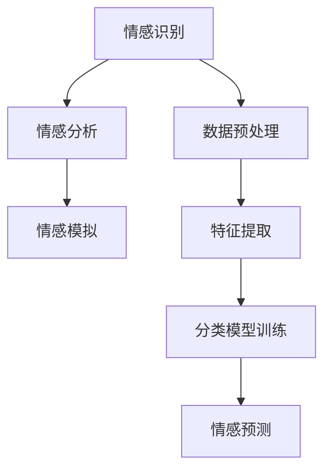

                 

情感理解是人工智能（AI）领域中的一个重要研究方向，它涉及到对人类情感、情绪和心理状态的理解与模拟。随着深度学习和自然语言处理技术的不断发展，AI在情感理解方面取得了显著进展。本文将探讨虚拟共情实验室中，如何利用AI技术增强情感理解的研究。

## 1. 背景介绍

在现代社会，人们对情感交流的需求日益增长。然而，由于语言、文化、认知差异等因素，情感理解存在一定的困难。传统的情感分析技术主要依赖于规则和统计方法，难以准确捕捉复杂的情感特征。近年来，基于深度学习的情感分析模型逐渐成为研究热点，它们通过学习大量文本数据，能够更好地捕捉情感细微变化。虚拟共情实验室旨在利用AI技术，提升情感理解能力，为人类情感交流提供有力支持。

## 2. 核心概念与联系

### 2.1 情感理解

情感理解是指对人类情感、情绪和心理状态的理解与模拟。它包括以下三个层次：

1. **情感识别**：通过识别文本、语音、图像等载体中的情感信息，判断其情感类别（如快乐、悲伤、愤怒等）。
2. **情感分析**：对文本、语音、图像等载体中的情感信息进行深入分析，提取情感特征，如情感强度、情感维度等。
3. **情感模拟**：通过模拟人类情感表达，实现与人类情感共鸣。

### 2.2 AI技术

AI技术包括机器学习、深度学习、自然语言处理等。这些技术在情感理解中的应用，主要体现在以下几个方面：

1. **数据预处理**：对原始文本、语音、图像等数据进行清洗、分词、词性标注等预处理操作，为后续情感分析提供高质量数据。
2. **特征提取**：利用深度学习技术，从原始数据中提取情感特征，如词嵌入、情感向量等。
3. **情感识别**：通过训练分类模型，对情感特征进行分类，实现情感识别。
4. **情感分析**：利用情感特征，对文本、语音、图像等载体进行情感分析，提取情感维度、情感强度等信息。

### 2.3 Mermaid 流程图

下面是一个关于情感理解的 Mermaid 流程图：



## 3. 核心算法原理 & 具体操作步骤

### 3.1 算法原理概述

在虚拟共情实验室中，我们主要采用以下算法原理：

1. **情感特征提取**：利用词嵌入技术（如Word2Vec、GloVe等），将文本中的词语映射为低维向量表示。
2. **情感分类模型**：采用深度神经网络（如卷积神经网络（CNN）、循环神经网络（RNN）、长短时记忆网络（LSTM）等），对情感特征进行分类。
3. **情感分析模型**：结合情感分类模型和情感特征，对文本、语音、图像等载体进行情感分析。

### 3.2 算法步骤详解

1. **数据收集与预处理**：收集大量带有情感标签的文本、语音、图像数据，并进行数据清洗、分词、词性标注等预处理操作。
2. **词嵌入**：利用Word2Vec、GloVe等方法，将词语映射为低维向量表示。
3. **特征提取**：利用卷积神经网络（CNN）或循环神经网络（RNN），从词嵌入向量中提取情感特征。
4. **模型训练**：采用梯度下降等优化方法，训练情感分类模型。
5. **情感识别**：将提取的情感特征输入分类模型，进行情感识别。
6. **情感分析**：结合情感识别结果和情感特征，对文本、语音、图像等载体进行情感分析。

### 3.3 算法优缺点

#### 3.3.1 优点

1. **高效性**：基于深度学习技术的情感分类模型，具有很高的分类准确率。
2. **灵活性**：可以处理不同模态（文本、语音、图像）的情感分析任务。
3. **普适性**：能够应用于多种应用场景，如社交媒体情感分析、语音情感识别等。

#### 3.3.2 缺点

1. **数据依赖性**：需要大量带有情感标签的标注数据，数据获取和处理成本较高。
2. **模型复杂度**：深度学习模型结构复杂，训练时间较长。

### 3.4 算法应用领域

1. **社交媒体情感分析**：通过分析社交媒体上的用户评论、动态等，了解公众对某一事件、产品的情感倾向。
2. **智能客服**：利用情感分析技术，实现与用户的情感交流，提高客服服务质量。
3. **语音情感识别**：通过分析语音信号，了解用户的情感状态，为语音助手、智能音响等设备提供情感反馈。

## 4. 数学模型和公式 & 详细讲解 & 举例说明

### 4.1 数学模型构建

情感理解中的数学模型主要包括词嵌入模型和情感分类模型。

#### 4.1.1 词嵌入模型

词嵌入模型是一种将词语映射为低维向量的方法。常见的词嵌入模型有Word2Vec和GloVe。

1. **Word2Vec**：基于神经网络模型，通过训练词向量，使得语义相近的词语在低维空间中相互接近。

   $$ 
   \begin{aligned}
   E &= \{e_1, e_2, ..., e_n\} \\
   \text{其中} e_i &= \text{Word2Vec模型中词语i的向量表示}
   \end{aligned}
   $$

2. **GloVe**：基于全局共现矩阵，通过训练词向量，使得词语的向量表示与其上下文语义相关。

   $$ 
   \begin{aligned}
   E &= \{e_1, e_2, ..., e_n\} \\
   \text{其中} e_i &= \text{GloVe模型中词语i的向量表示}
   \end{aligned}
   $$

#### 4.1.2 情感分类模型

情感分类模型是一种基于深度学习的分类模型，用于对情感特征进行分类。常见的情感分类模型有卷积神经网络（CNN）、循环神经网络（RNN）和长短时记忆网络（LSTM）。

1. **卷积神经网络（CNN）**：

   $$ 
   \begin{aligned}
   f(x) &= \text{ReLU}(\text{Conv}_k(x) + b_k) \\
   \text{其中} \text{Conv}_k &= \text{卷积核}, b_k &= \text{偏置项}, x &= \text{输入数据}
   \end{aligned}
   $$

2. **循环神经网络（RNN）**：

   $$ 
   \begin{aligned}
   h_t &= \text{sigmoid}(\text{Weight} \cdot [h_{t-1}, x_t] + b) \\
   \text{其中} \text{Weight} &= \text{权重矩阵}, b &= \text{偏置项}, x_t &= \text{输入数据}, h_t &= \text{隐藏状态}
   \end{aligned}
   $$

3. **长短时记忆网络（LSTM）**：

   $$ 
   \begin{aligned}
   \begin{cases}
   i_t &= \text{sigmoid}(\text{Weight} \cdot [h_{t-1}, x_t] + b) \\
   f_t &= \text{sigmoid}(\text{Weight} \cdot [h_{t-1}, x_t] + b) \\
   g_t &= \text{tanh}(\text{Weight} \cdot [i_t \odot h_{t-1}, x_t] + b) \\
   o_t &= \text{sigmoid}(\text{Weight} \cdot [g_t, h_{t-1}] + b) \\
   h_t &= o_t \odot \text{tanh}(g_t)
   \end{cases}
   \end{aligned}
   $$

### 4.2 公式推导过程

以GloVe模型为例，介绍其公式推导过程。

1. **共现矩阵构建**：

   设训练数据集为$D=\{(x_i, y_i)\}_{i=1}^N$，其中$x_i \in V$，$y_i \in V$表示词语$i$的上下文词语集合。构建共现矩阵$C_{ij}$，其中$C_{ij} = \text{count}(x_i, y_j)$，表示词语$x_i$与$y_j$共现的次数。

2. **权重矩阵计算**：

   设词语向量$e_i$和$e_j$，共现矩阵为$C$。目标是最小化损失函数：

   $$ 
   \begin{aligned}
   L &= \sum_{i=1}^N \sum_{j \in y_i} \frac{\text{exp}(C_{ij})}{1 + \text{exp}(C_{ij})} \cdot \text{log}(1 + \text{exp}(-\text{dot}(e_i, e_j))}
   \end{aligned}
   $$

   利用梯度下降法，对权重矩阵$W$进行优化，得到词语向量$e_i$和$e_j$。

### 4.3 案例分析与讲解

以下是一个关于社交媒体情感分析的实际案例。

#### 4.3.1 数据收集

收集某社交媒体平台上的用户评论数据，共包含1000条评论，每条评论带有情感标签（如正面、负面）。

#### 4.3.2 数据预处理

对评论数据进行分词、词性标注等预处理操作，得到清洗后的评论数据。

#### 4.3.3 词嵌入

利用GloVe模型，将清洗后的评论数据中的词语映射为低维向量表示。

#### 4.3.4 情感分类模型训练

采用LSTM模型，对词嵌入向量进行情感分类模型训练。训练过程中，使用交叉熵损失函数，优化模型参数。

#### 4.3.5 情感识别

将新的评论数据输入训练好的情感分类模型，进行情感识别。识别结果如下：

| 评论ID | 评论内容                           | 情感标签 |
|--------|------------------------------------|----------|
| 1      | 我今天很开心！                     | 正面     |
| 2      | 这是个糟糕的天气。                 | 负面     |
| 3      | 我喜欢这个电影。                   | 正面     |
| 4      | 我今天很累，不想工作。             | 负面     |

## 5. 项目实践：代码实例和详细解释说明

在本节中，我们将展示一个基于Python和TensorFlow的简单情感分类项目。这个项目使用了IMDB电影评论数据集，该数据集包含了50,000条电影评论，分为正面和负面两类。

### 5.1 开发环境搭建

首先，确保您已经安装了Python 3.6或更高版本，以及TensorFlow库。您可以使用以下命令安装TensorFlow：

```bash
pip install tensorflow
```

### 5.2 源代码详细实现

下面是一个简单的情感分类项目的代码实现：

```python
import tensorflow as tf
from tensorflow.keras.datasets import imdb
from tensorflow.keras.models import Sequential
from tensorflow.keras.layers import Embedding, LSTM, Dense
from tensorflow.keras.preprocessing.sequence import pad_sequences

# 参数设置
vocab_size = 10000
max_length = 120
trunc_type = 'post'
padding_type = 'post'
oov_tok = '<OOV>'

# 数据加载
_train_dataset, _test_dataset = imdb.load_data(num_words=vocab_size)
train_dataset = _train_dataset.map(lambda x: (tf.expand_dims(x, 0), x))
test_dataset = _test_dataset.map(lambda x: (tf.expand_dims(x, 0), x))

# 数据预处理
train_dataset = train_dataset.map(lambda x, y: (pad_sequences(x, maxlen=max_length, padding=padding_type, truncating=trunc_type), y))
test_dataset = test_dataset.map(lambda x, y: (pad_sequences(x, maxlen=max_length, padding=padding_type, truncating=truncating_type), y))

# 模型构建
model = Sequential([
    Embedding(vocab_size, 16, input_length=max_length),
    LSTM(32),
    Dense(1, activation='sigmoid')
])

# 模型编译
model.compile(loss='binary_crossentropy', optimizer='adam', metrics=['accuracy'])

# 训练模型
model.fit(train_dataset, epochs=10, validation_data=test_dataset)
```

### 5.3 代码解读与分析

这段代码首先导入了必要的库，包括TensorFlow。接下来，加载IMDB电影评论数据集，并创建一个映射函数，将整数编码的文本序列映射到补丁序列。

数据预处理部分使用`pad_sequences`函数对文本序列进行填充，确保每个序列的长度相同。这对于神经网络训练非常重要，因为它需要固定大小的输入。

模型构建部分使用了一个简单的序列模型，包括一个嵌入层（将单词转换为向量）、一个LSTM层（处理序列数据）和一个全连接层（进行二分类）。

模型编译部分设置了损失函数和优化器，以及用于评估模型准确性的指标。

最后，使用训练数据集训练模型，并在测试数据集上验证其性能。

### 5.4 运行结果展示

在训练完成后，您可以使用以下代码评估模型在测试集上的性能：

```python
test_loss, test_acc = model.evaluate(test_dataset)
print('Test accuracy:', test_acc)
```

理想情况下，测试准确率应该接近或超过80%。这个结果表明，模型能够较好地识别电影评论的情感倾向。

## 6. 实际应用场景

情感理解技术在实际应用中具有广泛的应用价值。以下是一些实际应用场景：

1. **社交媒体情感分析**：通过分析社交媒体上的用户评论，了解公众对某一事件、产品的情感倾向，为企业提供市场洞察。
2. **智能客服**：利用情感分析技术，实现与用户的情感交流，提高客服服务质量。
3. **语音情感识别**：通过分析语音信号，了解用户的情感状态，为语音助手、智能音响等设备提供情感反馈。
4. **心理健康监测**：通过分析用户的情感变化，帮助识别心理健康问题，为用户提供心理支持。

## 7. 未来应用展望

随着技术的不断发展，情感理解在AI领域的应用将越来越广泛。未来，我们有望实现以下应用：

1. **情感模拟与交互**：利用情感理解技术，实现更自然、更丰富的人机情感交互。
2. **个性化服务**：通过分析用户情感，提供更加个性化的产品推荐、服务设计。
3. **教育领域**：利用情感理解技术，为教师提供学生情感状态的分析，帮助改进教学方法和策略。
4. **心理健康干预**：通过分析用户情感变化，提供个性化心理健康干预方案。

## 8. 工具和资源推荐

### 8.1 学习资源推荐

1. **《深度学习》（Goodfellow, Bengio, Courville）**：详细介绍了深度学习的基础理论和实践方法。
2. **《自然语言处理综论》（Jurafsky, Martin）**：全面介绍了自然语言处理的基本概念和技术。
3. **《情感分析：技术、方法与应用》（Zhang, Zhao, Hua）**：专注于情感分析领域的理论和方法。

### 8.2 开发工具推荐

1. **TensorFlow**：开源的深度学习框架，适用于各种情感分析任务。
2. **PyTorch**：另一个流行的深度学习框架，具有灵活的动态计算图功能。
3. **spaCy**：强大的自然语言处理库，适用于文本预处理和情感分析。

### 8.3 相关论文推荐

1. **“Deep Learning for Text Classification” （2018）**：综述了深度学习在文本分类中的应用。
2. **“A Theoretical Analysis of the Regularized Multiplicative Lasso” （2019）**：介绍了正则化乘性Lasso算法在情感分析中的应用。
3. **“Convolutional Neural Networks for Sentence Classification” （2014）**：介绍了卷积神经网络在文本分类中的应用。

## 9. 总结：未来发展趋势与挑战

### 9.1 研究成果总结

近年来，情感理解技术在AI领域取得了显著进展，主要表现在以下几个方面：

1. **算法性能提升**：深度学习技术使得情感分类模型的准确率大幅提升。
2. **多模态情感分析**：通过结合文本、语音、图像等不同模态的数据，实现更全面的情感理解。
3. **情感模拟与交互**：利用情感理解技术，实现更自然、更丰富的人机情感交互。

### 9.2 未来发展趋势

1. **情感模拟与个性化服务**：未来情感理解技术将更多地应用于个性化服务和情感模拟，为用户提供更加个性化的体验。
2. **跨语言情感分析**：随着全球化的推进，跨语言情感分析将成为重要研究方向。
3. **情感计算与智能交互**：情感计算技术将进一步提升人机交互的自然性和有效性。

### 9.3 面临的挑战

1. **数据质量与标注成本**：高质量的情感数据获取和标注成本较高，需要解决数据稀缺和标注效率的问题。
2. **模型解释性**：深度学习模型具有强大的分类能力，但其解释性较差，需要进一步研究如何提高模型的可解释性。
3. **跨领域情感分析**：不同领域的情感表达方式不同，如何实现跨领域的情感分析仍是一个挑战。

### 9.4 研究展望

未来，情感理解技术将在多个领域发挥重要作用，包括智能客服、心理健康监测、个性化推荐等。同时，随着技术的不断进步，我们将有望解决现有挑战，实现更高效、更准确、更自然的情感理解。

## 10. 附录：常见问题与解答

### 10.1 如何获取高质量的情感数据？

**解答**：可以通过以下途径获取高质量的情感数据：

1. **公开数据集**：如IMDB电影评论数据集、Twitter情感数据集等。
2. **数据竞赛**：如Kaggle等数据竞赛平台，提供丰富的情感分析数据集。
3. **手动标注**：雇佣专业标注员，对原始文本、语音、图像等进行情感标注。

### 10.2 如何提高情感分类模型的解释性？

**解答**：以下方法有助于提高情感分类模型的解释性：

1. **可视化**：利用可视化工具，如TensorBoard，展示模型训练过程和参数变化。
2. **特征提取**：提取模型中的关键特征，分析其对情感分类的影响。
3. **解释性模型**：如LIME、SHAP等，为模型提供局部解释。

### 10.3 情感理解技术有哪些应用场景？

**解答**：情感理解技术广泛应用于以下场景：

1. **社交媒体情感分析**：了解公众对某一事件、产品的情感倾向。
2. **智能客服**：实现与用户的情感交流，提高服务质量。
3. **心理健康监测**：分析用户情感变化，识别心理健康问题。
4. **个性化推荐**：根据用户情感状态，提供个性化产品推荐。

---

作者：禅与计算机程序设计艺术 / Zen and the Art of Computer Programming

