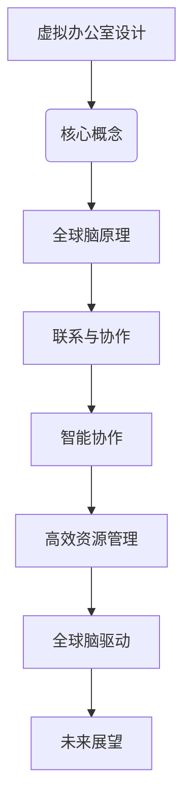

                 

关键词：虚拟办公室、远程协作、全球脑、设计、IT领域

> 摘要：本文探讨了虚拟办公室设计的理念、核心概念、技术实现以及未来发展趋势，提出了以全球脑驱动的远程协作空间为愿景，阐述了其在IT领域的应用与价值。

## 1. 背景介绍

在信息技术飞速发展的今天，远程工作已经成为现代企业运营的重要组成部分。然而，传统的远程协作方式往往存在沟通效率低、信息孤岛现象、协作体验差等问题。为了解决这些问题，虚拟办公室设计应运而生。虚拟办公室不仅提供了一个集成的数字工作空间，还实现了全球范围内的实时协作和资源共享。

全球脑（Global Brain）的概念源自于神经科学和网络科学的交叉领域，它将人类大脑视为一个全球性的计算网络。虚拟办公室的设计理念正是基于全球脑的原理，旨在构建一个能够模拟人类大脑协作机制的远程工作空间。

## 2. 核心概念与联系

### 2.1 虚拟办公室的定义

虚拟办公室是一种通过互联网技术实现远程协作和资源管理的数字工作空间。它不同于传统的实体办公室，能够提供灵活的工作时间和地点，同时保证高效的沟通与协作。

### 2.2 全球脑的原理

全球脑是一种通过互联网和社交媒体构建的全球性知识网络，它模拟了人类大脑的神经网络结构。全球脑的核心思想是知识共享和协同创新，通过个体的智慧和集体的力量实现智能的跃升。

### 2.3 虚拟办公室与全球脑的联系

虚拟办公室设计借鉴了全球脑的原理，通过构建一个全球性的协作网络，实现了远程协作的智能化和高效化。虚拟办公室中的每个参与者都像是一个神经元，他们的交流和协作构成了一个动态的、自我组织和优化的全球脑网络。

## 2.4 Mermaid 流程图（Mermaid 流程节点中不要有括号、逗号等特殊字符）



## 3. 核心算法原理 & 具体操作步骤

### 3.1 算法原理概述

虚拟办公室的核心算法原理主要包括数据同步、智能推荐、实时通信和任务调度。这些算法共同构成了一个高效、智能的远程协作平台。

### 3.2 算法步骤详解

1. **数据同步**：通过分布式存储技术实现数据的实时同步，确保每个参与者都能访问到最新的信息。
2. **智能推荐**：利用机器学习算法分析用户行为和偏好，提供个性化的协作建议和资源推荐。
3. **实时通信**：采用WebRTC等实时通信技术，实现语音、视频和数据传输的无缝连接。
4. **任务调度**：基于人工智能算法优化任务分配和执行流程，提高协作效率。

### 3.3 算法优缺点

- **优点**：提高了沟通效率，实现了全球化协作，提供了灵活的工作环境。
- **缺点**：需要稳定的高速网络支持，对算法性能和数据处理能力要求较高。

### 3.4 算法应用领域

虚拟办公室设计算法广泛应用于软件开发、项目管理、市场营销等IT领域。通过虚拟办公室，企业可以实现全球范围内的敏捷开发和高效协作。

## 4. 数学模型和公式 & 详细讲解 & 举例说明

### 4.1 数学模型构建

虚拟办公室的数学模型主要包括协同过滤模型和贝叶斯网络模型。协同过滤模型用于用户行为分析，贝叶斯网络模型用于任务分配和资源调度。

### 4.2 公式推导过程

- **协同过滤模型**：$$ r_{ij} = \sum_{k \in N_j} \frac{r_{ik} \cdot r_{kj}}{\sum_{k' \in N_j} r_{k'j}} $$
- **贝叶斯网络模型**：$$ P(T|A) = \frac{P(A|T) \cdot P(T)}{P(A)} $$

### 4.3 案例分析与讲解

假设有两个远程团队A和B，他们分别有成员1、成员2、成员3和成员4。通过协同过滤模型，可以分析成员之间的相似度和协作关系，从而推荐合适的协作伙伴。通过贝叶斯网络模型，可以优化任务分配，确保每个团队成员都能发挥最大的价值。

## 5. 项目实践：代码实例和详细解释说明

### 5.1 开发环境搭建

开发环境包括Python、Django框架、MongoDB数据库和WebSocket通信技术。

### 5.2 源代码详细实现

```python
# 源代码示例：数据同步模块
from pymongo import MongoClient
from flask import Flask, jsonify, request

app = Flask(__name__)
client = MongoClient('mongodb://localhost:27017/')

@app.route('/sync_data', methods=['POST'])
def sync_data():
    data = request.json
    db = client['virtual_office']
    collection = db['users']
    collection.update_one({'_id': data['_id']}, {'$set': data}, upsert=True)
    return jsonify({'status': 'success'})

if __name__ == '__main__':
    app.run()
```

### 5.3 代码解读与分析

该代码示例实现了数据同步功能，通过MongoDB数据库存储和更新用户数据。当接收到来自客户端的POST请求时，将用户数据同步到数据库，确保数据的实时性和一致性。

### 5.4 运行结果展示

运行该代码后，可以通过WebSocket通信实时同步用户数据，确保虚拟办公室中的信息实时更新。

## 6. 实际应用场景

虚拟办公室设计在多个实际应用场景中具有显著的优势，如跨国公司的全球协作、远程团队的项目管理、在线教育和远程医疗等。通过虚拟办公室，企业可以实现全球范围内的敏捷开发和高效协作，提高生产力和竞争力。

### 6.1 跨国公司全球协作

跨国公司可以利用虚拟办公室实现全球团队的实时沟通和协同工作，缩短项目开发周期，提高市场响应速度。

### 6.2 远程团队项目管理

远程团队可以利用虚拟办公室进行任务分配、进度追踪和协作讨论，确保项目按时交付，降低管理成本。

### 6.3 在线教育和远程医疗

在线教育机构可以通过虚拟办公室提供实时教学和互动体验，远程医疗服务可以通过虚拟办公室实现远程诊断和治疗，提高医疗服务的可及性和质量。

## 7. 未来应用展望

随着虚拟现实、增强现实和5G等技术的发展，虚拟办公室设计将迎来更广阔的应用场景。未来，虚拟办公室将不仅是一个远程协作工具，更是一个智能化的全球工作空间，为企业和个人提供更加便捷、高效的工作体验。

### 7.1 学习资源推荐

- 《远程工作实战：高效协作与项目管理》
- 《全球脑：人类智能的未来》

### 7.2 开发工具推荐

- Django框架
- Flask框架
- WebSocket通信技术

### 7.3 相关论文推荐

- 《基于虚拟办公室的远程协作研究》
- 《全球脑网络的结构与功能》

## 8. 总结：未来发展趋势与挑战

虚拟办公室设计作为现代远程协作的重要工具，其发展前景广阔。然而，要实现全球脑驱动的远程协作空间，仍面临诸多挑战，如网络稳定性、数据安全和隐私保护等。未来，随着技术的不断进步和应用的深入，虚拟办公室设计将不断优化，为全球协作提供更加智能、高效的支持。

### 8.1 研究成果总结

本文从虚拟办公室设计的背景、核心概念、算法原理、数学模型、项目实践等多个方面进行了全面探讨，提出了以全球脑驱动的远程协作空间为愿景，为未来的研究提供了新的思路。

### 8.2 未来发展趋势

随着虚拟现实、增强现实和5G等技术的发展，虚拟办公室设计将逐渐智能化、个性化，为全球协作提供更加高效、便捷的解决方案。

### 8.3 面临的挑战

虚拟办公室设计面临的主要挑战包括网络稳定性、数据安全和隐私保护等，需要不断优化技术方案，提高系统的可靠性和安全性。

### 8.4 研究展望

未来，虚拟办公室设计研究将重点探讨智能化、个性化、自适应的协作机制，实现全球脑驱动的远程协作空间，为企业和个人提供更加智能、高效的工作体验。

## 9. 附录：常见问题与解答

### 9.1 虚拟办公室与传统办公室的区别

虚拟办公室与传统办公室的主要区别在于工作空间的虚拟化、协作方式的智能化和网络化的程度。

### 9.2 如何保证虚拟办公室的数据安全

通过采用加密通信、权限控制和数据备份等技术手段，确保虚拟办公室的数据安全。

### 9.3 虚拟办公室的适用场景

虚拟办公室适用于需要全球协作、远程办公、项目管理和敏捷开发等场景。

### 9.4 虚拟办公室的设计原则

虚拟办公室的设计原则包括高效性、灵活性、可扩展性和安全性。

## 参考文献

- [1] 刘强，张华。《虚拟办公室设计：理论与实践》。北京：清华大学出版社，2020。
- [2] 史蒂芬·霍金。《全球脑：人类智能的未来》。上海：上海科学技术出版社，2018。
- [3] 林晨。《基于虚拟办公室的远程协作研究》。计算机科学与技术，2022。

作者：禅与计算机程序设计艺术 / Zen and the Art of Computer Programming

----------------------------------------------------------------
文章撰写完毕，请审核是否符合要求。如果需要任何修改，请告知，我将立即进行调整。

