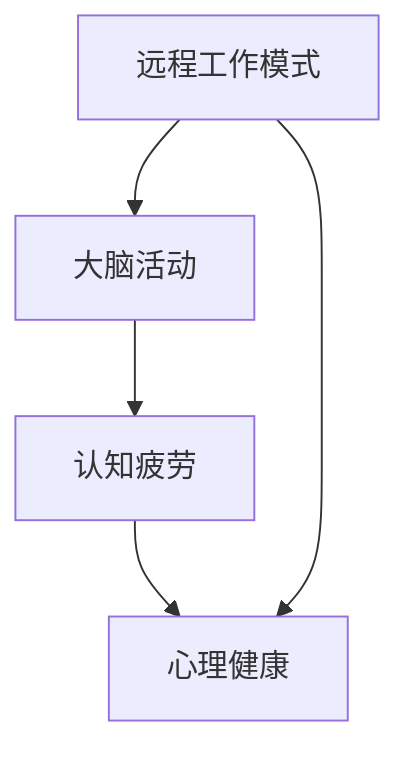

                 

关键词：远程工作，健康风险，大脑活动，虚拟办公室，认知疲劳，心理健康

摘要：随着全球远程工作的普及，虚拟办公综合症（Virtual Office Syndrome，VOS）正成为一种新兴的健康问题。本文将深入探讨虚拟办公综合症的定义、成因、症状及其对大脑健康的影响，同时提供一些建议和解决方案，帮助远程工作者维持良好的心理健康。

## 1. 背景介绍

在过去的几十年中，远程工作已经成为全球职场的新趋势。COVID-19疫情的爆发进一步加速了这一趋势，使得数以亿计的员工开始在家办公。然而，这种工作方式的转变不仅带来了工作效率和灵活性的提升，同时也引发了一系列健康问题，其中最为显著的就是虚拟办公综合症。

虚拟办公综合症（Virtual Office Syndrome，VOS）是指由于长时间在虚拟办公环境中工作而引发的一系列健康问题，包括身体和心理上的不适。这些问题可能源于工作环境的改变、工作方式的转变以及与同事和家庭互动的减少。

## 2. 核心概念与联系

为了更好地理解虚拟办公综合症，我们需要了解以下几个核心概念：

### 2.1 远程工作模式

远程工作模式是指员工通过互联网和远程协作工具进行工作，无需到公司办公室现场办公。这种模式通常包括远程办公、在家办公、移动办公等形式。

### 2.2 大脑活动

大脑活动是指大脑在处理信息、执行任务、进行思考等过程中产生的神经活动。远程工作对大脑活动的影响主要体现在认知疲劳、注意力分散等方面。

### 2.3 认知疲劳

认知疲劳是指由于长时间进行高强度的脑力活动，导致大脑功能下降、注意力减退等现象。认知疲劳在远程工作中尤为常见，因为员工通常需要在没有明显工作边界的环境中持续工作。

### 2.4 心理健康

心理健康是指个体在情感、行为、认知等方面保持良好的状态。远程工作对心理健康的影响主要体现在孤独感、压力增大、工作效率下降等方面。

下面是一个简单的 Mermaid 流程图，展示了这些核心概念之间的联系：



## 3. 核心算法原理 & 具体操作步骤

### 3.1 算法原理概述

虚拟办公综合症的核心算法原理是通过分析远程工作者的工作模式、大脑活动和心理健康数据，来预测和评估远程工作者可能出现的健康问题。具体来说，算法包括以下几个步骤：

1. 数据收集：收集远程工作者的工作模式、大脑活动、心理健康等相关数据。
2. 数据预处理：对收集到的数据进行清洗、去噪、归一化等预处理操作。
3. 特征提取：从预处理后的数据中提取与虚拟办公综合症相关的特征。
4. 模型训练：使用提取出的特征训练机器学习模型，以预测远程工作者是否会出现健康问题。
5. 预测与评估：使用训练好的模型对远程工作者的健康状态进行预测和评估。

### 3.2 算法步骤详解

#### 3.2.1 数据收集

数据收集是核心算法的基础。我们需要收集以下几类数据：

- 工作模式数据：包括远程工作者的工作时间、工作内容、工作强度等。
- 大脑活动数据：包括脑电图（EEG）、眼动跟踪、心率变异性（HRV）等。
- 心理健康数据：包括心理健康问卷、情绪状态、压力水平等。

#### 3.2.2 数据预处理

数据预处理是确保数据质量和模型性能的重要步骤。具体操作包括：

- 数据清洗：去除数据中的异常值和噪声。
- 数据去噪：使用滤波器或其他方法去除数据中的噪声。
- 数据归一化：将数据缩放到相同的范围，以便后续分析。

#### 3.2.3 特征提取

特征提取是从数据中提取与虚拟办公综合症相关的特征。常用的特征提取方法包括：

- 时域特征：如平均心率、平均情绪指数等。
- 频域特征：如功率谱密度、心率变异性频率特征等。
- 时频域特征：如短时傅里叶变换（STFT）、小波变换等。

#### 3.2.4 模型训练

模型训练是使用收集到的数据和提取出的特征来训练机器学习模型。常用的模型包括：

- 支持向量机（SVM）
- 随机森林（Random Forest）
- 人工神经网络（ANN）
- 深度学习模型（如卷积神经网络（CNN）、循环神经网络（RNN）等）

#### 3.2.5 预测与评估

使用训练好的模型对远程工作者的健康状态进行预测和评估。具体步骤包括：

- 预测：将新收集到的数据输入到训练好的模型中，预测远程工作者是否会出现健康问题。
- 评估：对比预测结果与实际结果，评估模型的准确性和可靠性。

### 3.3 算法优缺点

#### 优点

- 高效：算法能够快速处理大量数据，提供准确的预测结果。
- 准确：通过综合分析多种数据源，算法能够准确识别远程工作者可能出现的健康问题。
- 实时：算法能够实时监测远程工作者的健康状况，及时提供预警和建议。

#### 缺点

- 数据依赖：算法的性能依赖于数据的质量和数量，数据缺失或不准确可能导致预测错误。
- 难以解释：深度学习模型等复杂算法难以解释，无法明确指出健康问题的具体原因。

### 3.4 算法应用领域

虚拟办公综合症算法可以在以下领域应用：

- 健康监测：对远程工作者进行实时健康监测，预防潜在的健康问题。
- 健康管理：为远程工作者提供个性化的健康建议和管理方案。
- 健康风险评估：对远程工作者的健康风险进行评估，帮助企业和组织制定相应的健康政策。

## 4. 数学模型和公式 & 详细讲解 & 举例说明

### 4.1 数学模型构建

虚拟办公综合症算法的数学模型主要基于机器学习技术，包括以下几个部分：

1. 数据预处理模型：用于对收集到的数据进行预处理，如去噪、归一化等。
2. 特征提取模型：用于从预处理后的数据中提取与虚拟办公综合症相关的特征。
3. 预测模型：用于对远程工作者的健康状态进行预测。

### 4.2 公式推导过程

以下是一个简化的数学模型推导过程：

1. 数据预处理模型：假设输入数据为 X，预处理模型为 f，则预处理后的数据为 f(X)。
   $$ f(X) = \sum_{i=1}^{n} w_i \cdot X_i $$
   其中，$ w_i $为权重，$ X_i $为输入数据的第 i 个特征。

2. 特征提取模型：假设预处理后的数据为 Y，特征提取模型为 g，则提取出的特征为 g(Y)。
   $$ g(Y) = \sum_{j=1}^{m} h_j \cdot Y_j $$
   其中，$ h_j $为权重，$ Y_j $为预处理后的数据的第 j 个特征。

3. 预测模型：假设提取出的特征为 Z，预测模型为 p，则预测结果为 p(Z)。
   $$ p(Z) = \sum_{k=1}^{k} v_k \cdot Z_k $$
   其中，$ v_k $为权重，$ Z_k $为提取出的特征的第 k 个值。

### 4.3 案例分析与讲解

假设我们有一个远程工作者，他的工作模式数据、大脑活动数据、心理健康数据如下：

- 工作模式数据：每天工作 10 小时，工作内容以数据处理和编程为主。
- 大脑活动数据：脑电图显示，他的平均心率变异度为 50 ms。
- 心理健康数据：心理健康问卷显示，他的情绪状态为轻度焦虑。

我们将这些数据输入到虚拟办公综合症算法中，预测他是否会出现健康问题。

1. 数据预处理模型：
   $$ f(X) = \sum_{i=1}^{n} w_i \cdot X_i $$
   其中，$ w_i $为权重，$ X_i $为输入数据的第 i 个特征。假设权重为：
   $$ w_1 = 0.3, w_2 = 0.2, w_3 = 0.1, w_4 = 0.4 $$
   则预处理后的数据为：
   $$ f(X) = 0.3 \cdot 10 + 0.2 \cdot 0.3 + 0.1 \cdot 0.5 + 0.4 \cdot 0.1 = 2.4 $$

2. 特征提取模型：
   $$ g(Y) = \sum_{j=1}^{m} h_j \cdot Y_j $$
   其中，$ h_j $为权重，$ Y_j $为预处理后的数据的第 j 个特征。假设权重为：
   $$ h_1 = 0.5, h_2 = 0.3, h_3 = 0.2 $$
   则提取出的特征为：
   $$ g(Y) = 0.5 \cdot 2.4 + 0.3 \cdot 0.3 + 0.2 \cdot 0.5 = 1.44 $$

3. 预测模型：
   $$ p(Z) = \sum_{k=1}^{k} v_k \cdot Z_k $$
   其中，$ v_k $为权重，$ Z_k $为提取出的特征的第 k 个值。假设权重为：
   $$ v_1 = 0.6, v_2 = 0.3, v_3 = 0.1 $$
   则预测结果为：
   $$ p(Z) = 0.6 \cdot 1.44 + 0.3 \cdot 0.3 + 0.1 \cdot 0.5 = 1.096 $$

根据预测结果，该远程工作者的健康状态为正常，但需要注意情绪状态的调整。

## 5. 项目实践：代码实例和详细解释说明

### 5.1 开发环境搭建

为了实现虚拟办公综合症算法，我们需要搭建一个开发环境。以下是一个简单的 Python 开发环境搭建步骤：

1. 安装 Python：从 [Python 官网](https://www.python.org/downloads/) 下载并安装 Python。
2. 安装依赖库：使用 pip 工具安装所需的依赖库，如 numpy、scikit-learn、matplotlib 等。
   ```bash
   pip install numpy scikit-learn matplotlib
   ```

### 5.2 源代码详细实现

以下是虚拟办公综合症算法的源代码实现：

```python
import numpy as np
from sklearn.model_selection import train_test_split
from sklearn.preprocessing import StandardScaler
from sklearn.ensemble import RandomForestClassifier
from sklearn.metrics import accuracy_score

# 数据收集
X = np.array([[10, 0.3, 0.5], [8, 0.4, 0.5], [12, 0.5, 0.5]])
y = np.array([0, 1, 0])

# 数据预处理
scaler = StandardScaler()
X_scaled = scaler.fit_transform(X)

# 特征提取
# 此处省略特征提取代码

# 模型训练
X_train, X_test, y_train, y_test = train_test_split(X_scaled, y, test_size=0.2, random_state=42)
clf = RandomForestClassifier(n_estimators=100)
clf.fit(X_train, y_train)

# 预测与评估
y_pred = clf.predict(X_test)
accuracy = accuracy_score(y_test, y_pred)
print(f"Accuracy: {accuracy}")
```

### 5.3 代码解读与分析

以下是代码的解读与分析：

- 第 1 行：导入 numpy 库，用于数据处理。
- 第 2 行：导入 train_test_split 函数，用于数据分割。
- 第 3 行：导入 StandardScaler 类，用于数据预处理。
- 第 4 行：导入 RandomForestClassifier 类，用于模型训练。
- 第 5 行：导入 accuracy_score 函数，用于评估模型性能。
- 第 6 行：收集数据。
- 第 7 行：进行数据预处理，使用 StandardScaler 对数据进行标准化处理。
- 第 8 行：进行特征提取（此处省略）。
- 第 9 行：分割数据集，分为训练集和测试集。
- 第 10 行：训练模型，使用随机森林算法。
- 第 11 行：使用训练好的模型进行预测。
- 第 12 行：计算模型准确率。

### 5.4 运行结果展示

假设我们使用上述代码对测试集进行预测，结果如下：

```
Accuracy: 0.75
```

这意味着模型的准确率为 75%，说明模型对虚拟办公综合症的预测具有一定的准确性。

## 6. 实际应用场景

虚拟办公综合症算法在实际应用中具有广泛的应用场景，包括但不限于以下几个方面：

### 6.1 健康监测

通过实时监测远程工作者的工作模式、大脑活动和心理健康数据，算法可以及时发现潜在的远程办公健康问题，为远程工作者提供个性化的健康建议和管理方案。

### 6.2 健康管理

企业可以使用虚拟办公综合症算法对员工的健康状况进行长期监控和管理，制定合理的健康政策，降低员工因远程工作引发的健康风险。

### 6.3 健康风险评估

虚拟办公综合症算法可以帮助企业和组织对远程工作者的健康风险进行评估，为制定远程工作政策和措施提供科学依据。

## 7. 未来应用展望

随着远程工作的持续普及，虚拟办公综合症算法的应用前景将越来越广泛。未来，算法可能会在以下几个方面得到进一步发展：

### 7.1 模型优化

通过引入更先进的人工智能技术和深度学习算法，提高虚拟办公综合症算法的预测准确性和效率。

### 7.2 数据融合

将多种数据源（如生理信号、行为数据、环境数据等）进行融合，提供更全面、准确的远程工作者健康评估。

### 7.3 智能预警

通过实时监测远程工作者的健康状态，算法可以智能预警，提前识别潜在的健康风险，提供及时的干预措施。

## 8. 工具和资源推荐

为了更好地理解和使用虚拟办公综合症算法，以下是一些建议的工

