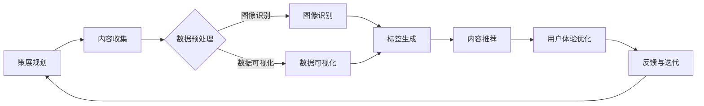

                 

关键词：虚拟博物馆、数字化展示、全球文化遗产、数字化策展、交互设计、用户体验、人工智能、图像识别、数据可视化、虚拟现实

> 摘要：本文探讨了虚拟博物馆策展在数字化展示全球文化遗产方面的重要性和潜力。通过利用人工智能、图像识别、数据可视化等前沿技术，本文提出了一个创新的数字化策展框架，旨在为用户提供沉浸式、交互式的博物馆体验，同时促进文化遗产的保护与传承。

## 1. 背景介绍

随着科技的飞速发展，数字技术和互联网的普及已经深刻改变了人们的生活方式。在文化领域，数字化展示成为了一种新的趋势，为文化遗产的保护、传承和普及提供了新的途径。虚拟博物馆作为一种新兴的数字展示方式，通过创建虚拟展览空间，实现了博物馆藏品的多角度展示和观众的无边界体验。然而，如何通过数字化策展来提升用户体验，同时有效地保护全球文化遗产，仍然是一个亟待解决的问题。

数字化展示不仅仅是将实体博物馆的内容搬到线上，它更是一个将文化与科技融合的过程。通过数字化技术，博物馆可以打破时空限制，让全球观众能够随时随地进行参观，这不仅增加了博物馆的访问量，也使得文化遗产的传播更加广泛。此外，数字化展示还能够提供更加丰富的互动体验，使观众更加深入地了解和欣赏文化遗产。

本文旨在探讨虚拟博物馆策展的数字化展示方法，分析其核心概念和关键技术，并通过实际项目案例展示数字化策展的应用效果。文章结构如下：

1. 背景介绍：概述数字化展示的背景和虚拟博物馆的发展现状。
2. 核心概念与联系：介绍数字化策展的关键概念和技术架构。
3. 核心算法原理 & 具体操作步骤：详细阐述数字化策展的核心算法和技术细节。
4. 数学模型和公式 & 详细讲解 & 举例说明：分析数字化策展所涉及的数学模型和公式。
5. 项目实践：提供具体的代码实例和项目实践。
6. 实际应用场景：探讨数字化策展在不同领域的应用。
7. 工具和资源推荐：推荐相关的学习资源和开发工具。
8. 总结：总结研究成果，展望未来发展趋势与挑战。

## 2. 核心概念与联系

### 2.1 虚拟博物馆的定义与特点

虚拟博物馆是一种基于数字技术的虚拟展览空间，通过模拟真实博物馆的展览环境，为观众提供沉浸式的参观体验。虚拟博物馆具有以下特点：

- **全数字化内容**：虚拟博物馆的所有展品、展览内容均以数字化形式呈现，包括高清图像、三维模型、音频和视频等多媒体内容。
- **沉浸式体验**：虚拟博物馆通过虚拟现实（VR）和增强现实（AR）技术，为观众提供身临其境的参观体验。
- **互动性**：虚拟博物馆提供多种互动方式，如触屏互动、语音导航等，增强观众的参与感和体验感。
- **无边界访问**：虚拟博物馆打破了地理和时间的限制，全球观众可以通过互联网随时随地访问。

### 2.2 数字化策展的定义与意义

数字化策展是指在数字技术的支持下，对博物馆的展览内容进行策划、设计和展示的过程。数字化策展的意义在于：

- **文化遗产保护**：数字化技术可以长期保存文化遗产，避免因自然灾害、人为破坏等原因导致的损失。
- **文化传播**：数字化策展能够将文化遗产传播到全球，提升博物馆的国际影响力。
- **用户参与**：数字化策展提供了丰富的互动体验，使得观众能够更加深入地了解和参与文化遗产的保护与传承。
- **数据收集与分析**：数字化策展可以通过数据分析了解观众的行为和喜好，为博物馆的策展和运营提供数据支持。

### 2.3 关键技术概述

数字化策展涉及到多个关键技术的应用，包括：

- **图像识别**：用于识别和分类博物馆藏品，实现自动标签和内容推荐。
- **数据可视化**：用于将大量数据以图表、地图等形式呈现，帮助观众更好地理解和欣赏文化遗产。
- **虚拟现实与增强现实**：提供沉浸式和交互式的展览体验，增强观众的参观体验。
- **人工智能**：用于智能推荐、自动标注、个性化服务等，提升用户体验。

### 2.4 Mermaid 流程图

下面是一个Mermaid流程图，展示了数字化策展的流程和关键环节：



## 3. 核心算法原理 & 具体操作步骤

### 3.1 算法原理概述

数字化策展的核心算法主要涉及图像识别、数据可视化、机器学习等领域的知识。图像识别技术用于自动识别和分类博物馆藏品，数据可视化技术用于将数据以图表等形式呈现，机器学习技术用于实现个性化推荐和用户体验优化。

#### 3.1.1 图像识别算法

图像识别算法是数字化策展的基础，常用的算法包括卷积神经网络（CNN）、深度学习等。这些算法通过对大量图像数据的学习，能够自动识别图像中的对象和特征。

#### 3.1.2 数据可视化算法

数据可视化算法用于将复杂的数据以图形化的方式展示，常用的算法包括力导向图、热力图、时间序列图等。这些算法能够帮助观众更好地理解和分析数据。

#### 3.1.3 机器学习算法

机器学习算法用于实现个性化推荐和用户体验优化。常用的算法包括协同过滤、决策树、神经网络等。这些算法可以通过学习用户的行为数据，为用户提供个性化的展览内容推荐。

### 3.2 算法步骤详解

下面是一个基于图像识别和数据可视化技术的数字化策展算法步骤详解：

#### 3.2.1 数据预处理

- **图像采集**：收集博物馆藏品的高清图像。
- **图像清洗**：去除图像中的噪声和干扰。
- **图像标注**：对图像进行分类和标注，以便后续的图像识别和内容推荐。

#### 3.2.2 图像识别

- **特征提取**：使用卷积神经网络提取图像的特征。
- **分类识别**：使用分类算法（如SVM、决策树等）对图像进行分类。
- **标签生成**：根据分类结果生成图像的标签，用于内容推荐和用户交互。

#### 3.2.3 数据可视化

- **数据整理**：将数据整理成适合可视化展示的格式。
- **图表生成**：使用数据可视化算法生成各种图表（如力导向图、热力图等）。
- **交互设计**：设计用户交互界面，实现数据的动态展示和互动。

#### 3.2.4 用户体验优化

- **用户行为分析**：收集并分析用户的行为数据。
- **个性化推荐**：使用机器学习算法为用户提供个性化的展览内容推荐。
- **反馈与迭代**：根据用户的反馈不断优化用户体验。

### 3.3 算法优缺点

#### 3.3.1 优点

- **高效性**：图像识别和数据可视化算法能够快速处理大量数据，提供高效的展示效果。
- **灵活性**：数字化策展可以根据不同的展览需求灵活调整内容展示和交互设计。
- **互动性**：用户可以通过多种互动方式参与到展览中，提高参观体验。

#### 3.3.2 缺点

- **数据隐私**：数字化策展过程中需要收集用户行为数据，可能涉及数据隐私问题。
- **技术依赖**：数字化策展依赖于多种先进技术，对技术设备和人员要求较高。
- **内容真实性**：数字化展示可能无法完全还原实体展览的真实感受，存在一定的失真。

### 3.4 算法应用领域

数字化策展算法广泛应用于博物馆、画廊、文化遗产保护等多个领域：

- **博物馆**：通过数字化展示，博物馆可以打破时空限制，提供沉浸式参观体验。
- **画廊**：数字化策展可以帮助画廊更好地展示和推广艺术作品。
- **文化遗产保护**：数字化技术可以用于文化遗产的数字化保存和展示，提高保护效果。

## 4. 数学模型和公式 & 详细讲解 & 举例说明

### 4.1 数学模型构建

数字化策展涉及的数学模型主要包括图像识别模型、数据可视化模型和机器学习模型。以下分别介绍这些模型的基本原理和构建方法。

#### 4.1.1 图像识别模型

图像识别模型通常基于卷积神经网络（CNN）。CNN的基本结构包括卷积层、池化层和全连接层。卷积层用于提取图像的特征，池化层用于降低特征图的维度，全连接层用于进行分类。下面是一个简单的CNN模型构建过程：

1. **数据预处理**：对图像进行归一化、缩放等处理，使其适应模型输入。
2. **卷积层**：使用卷积核对图像进行卷积操作，提取图像特征。
3. **激活函数**：使用激活函数（如ReLU）增加模型的非线性能力。
4. **池化层**：使用池化操作（如最大池化）降低特征图的维度。
5. **全连接层**：将特征图展开为一维向量，输入到全连接层进行分类。

#### 4.1.2 数据可视化模型

数据可视化模型主要包括力导向图（Force-directed Graph）和时间序列图（Time Series）。以下分别介绍这两种模型的基本原理和构建方法。

1. **力导向图**：
   - **模型构建**：力导向图通过模拟物体间的相互作用力，优化节点布局，使其达到能量最低状态。
   - **数学公式**：
     $$ F_{ij} = -K \cdot \frac{(x_i - x_j)^2 + (y_i - y_j)^2}{r^2} $$
     其中，$F_{ij}$ 表示节点$i$和节点$j$之间的作用力，$K$ 为常数，$r$ 为节点间的距离。

2. **时间序列图**：
   - **模型构建**：时间序列图通过将时间数据映射到二维空间，展示数据的变化趋势。
   - **数学公式**：
     $$ x(t) = A \cdot sin(2\pi f t + \phi) $$
     其中，$x(t)$ 表示时间序列数据，$A$ 为振幅，$f$ 为频率，$\phi$ 为相位。

#### 4.1.3 机器学习模型

机器学习模型用于实现个性化推荐和用户体验优化。常用的算法包括协同过滤（Collaborative Filtering）和决策树（Decision Tree）。以下分别介绍这两种算法的基本原理和构建方法。

1. **协同过滤**：
   - **模型构建**：协同过滤通过分析用户的历史行为数据，为用户推荐相似的兴趣内容。
   - **数学公式**：
     $$ R_{ui} = \frac{\sum_{j \in N_i} R_{uj} \cdot S_{ij}}{\sum_{j \in N_i} S_{ij}} $$
     其中，$R_{ui}$ 表示用户$i$对物品$j$的评分，$N_i$ 表示用户$i$的邻居集合，$S_{ij}$ 表示用户$i$和邻居$j$之间的相似度。

2. **决策树**：
   - **模型构建**：决策树通过将数据划分为不同的区域，为每个区域分配推荐结果。
   - **数学公式**：
     $$ Gini(\text{split}) = 1 - \sum_{i} p_i (1 - p_i) $$
     其中，$p_i$ 表示数据集中属于类别$i$的比例。

### 4.2 公式推导过程

以下分别介绍图像识别模型、数据可视化模型和机器学习模型的公式推导过程。

#### 4.2.1 图像识别模型

图像识别模型的公式推导主要涉及卷积层、激活函数和全连接层的推导。

1. **卷积层**：
   - **输入**：图像特征图$X \in \mathbb{R}^{H \times W \times C}$，卷积核$K \in \mathbb{R}^{F \times F \times C}$。
   - **输出**：卷积结果$Y \in \mathbb{R}^{H' \times W' \times F}$，其中$H' = (H - F + 2P)/S$，$W' = (W - F + 2P)/S$，$P$ 为填充大小，$S$ 为步长。
   - **公式推导**：
     $$ Y_{ij} = \sum_{k=1}^{C} X_{ijk} \cdot K_{ij k} + b_j $$
     其中，$b_j$ 为偏置。

2. **激活函数**：
   - **输入**：卷积结果$Y \in \mathbb{R}^{H' \times W' \times F}$。
   - **输出**：激活结果$Z \in \mathbb{R}^{H' \times W' \times F}$。
   - **公式推导**：
     $$ Z_{ij k} = f(Y_{ij k}) $$
     其中，$f$ 为激活函数（如ReLU）。

3. **全连接层**：
   - **输入**：激活结果$Z \in \mathbb{R}^{H' \times W' \times F}$。
   - **输出**：分类结果$Y \in \mathbb{R}^{H' \times W' \times C'}$，其中$C'$ 为类别数。
   - **公式推导**：
     $$ Y_{ij k} = \sum_{l=1}^{F'} Z_{ij l} \cdot W_{lk} + b_k $$
     其中，$W$ 和 $b$ 为权重和偏置。

#### 4.2.2 数据可视化模型

数据可视化模型的公式推导主要涉及力导向图和时间序列图的推导。

1. **力导向图**：
   - **输入**：节点位置矩阵$P \in \mathbb{R}^{N \times 2}$，其中$N$ 为节点数。
   - **输出**：优化后的节点位置矩阵$Q \in \mathbb{R}^{N \times 2}$。
   - **公式推导**：
     $$ Q = P - \alpha \cdot \nabla E $$
     其中，$\alpha$ 为学习率，$E$ 为能量函数。
     $$ E = \sum_{i,j} F_{ij}^2 $$
     $$ F_{ij} = -K \cdot \frac{(x_i - x_j)^2 + (y_i - y_j)^2}{r^2} $$

2. **时间序列图**：
   - **输入**：时间序列数据$X \in \mathbb{R}^{T}$，其中$T$ 为时间步数。
   - **输出**：时间序列图坐标矩阵$Q \in \mathbb{R}^{T \times 2}$。
   - **公式推导**：
     $$ Q_t = [t, x_t] $$
     其中，$t$ 为时间步数，$x_t$ 为时间序列数据。

#### 4.2.3 机器学习模型

机器学习模型的公式推导主要涉及协同过滤和决策树的推导。

1. **协同过滤**：
   - **输入**：用户行为矩阵$R \in \mathbb{R}^{U \times I}$，其中$U$ 为用户数，$I$ 为物品数。
   - **输出**：用户$i$对物品$j$的预测评分$\hat{R}_{ui}$。
   - **公式推导**：
     $$ \hat{R}_{ui} = \frac{\sum_{j \in N_i} R_{uj} \cdot S_{ij}}{\sum_{j \in N_i} S_{ij}} $$
     其中，$N_i$ 为用户$i$的邻居集合，$S_{ij}$ 为用户$i$和邻居$j$之间的相似度。

2. **决策树**：
   - **输入**：数据集$D$，特征集$F$。
   - **输出**：决策树模型。
   - **公式推导**：
     $$ Gini(\text{split}) = 1 - \sum_{i} p_i (1 - p_i) $$
     其中，$p_i$ 为数据集中属于类别$i$的比例。

### 4.3 案例分析与讲解

以下通过一个具体案例来分析数字化策展中的数学模型应用。

#### 4.3.1 案例背景

假设一个博物馆想要通过数字化策展展示其收藏的古代艺术品，其中包括陶瓷、书画和雕塑等多种类型。博物馆希望通过图像识别技术自动识别和分类这些艺术品，并使用数据可视化技术展示艺术品的历史背景和文化价值。

#### 4.3.2 数据预处理

- **图像采集**：博物馆收集了数百张古代艺术品的高清图像。
- **图像清洗**：对图像进行去噪、去雾等处理，提高图像质量。
- **图像标注**：对图像进行分类和标注，将其分为陶瓷、书画和雕塑等类别。

#### 4.3.3 图像识别

- **特征提取**：使用卷积神经网络提取图像的特征。
  ```python
  import tensorflow as tf
  from tensorflow.keras.layers import Conv2D, MaxPooling2D, Flatten, Dense
  from tensorflow.keras.models import Sequential
  
  model = Sequential()
  model.add(Conv2D(32, (3, 3), activation='relu', input_shape=(256, 256, 3)))
  model.add(MaxPooling2D((2, 2)))
  model.add(Conv2D(64, (3, 3), activation='relu'))
  model.add(MaxPooling2D((2, 2)))
  model.add(Flatten())
  model.add(Dense(128, activation='relu'))
  model.add(Dense(3, activation='softmax')) # 3 个类别：陶瓷、书画、雕塑
  model.compile(optimizer='adam', loss='categorical_crossentropy', metrics=['accuracy'])
  model.fit(x_train, y_train, epochs=10, batch_size=32)
  ```

- **分类识别**：使用分类算法对图像进行分类。
  ```python
  predictions = model.predict(x_test)
  predicted_classes = np.argmax(predictions, axis=1)
  ```

- **标签生成**：根据分类结果生成图像的标签。
  ```python
  labels = ['陶瓷', '书画', '雕塑']
  for i, image in enumerate(x_test):
      print(f"图像 {i+1}：{labels[predicted_classes[i]]}")
  ```

#### 4.3.4 数据可视化

- **数据整理**：将分类结果和数据可视化工具（如Matplotlib）结合，生成可视化图表。
  ```python
  import matplotlib.pyplot as plt
  
  def plot_bar_chart(data, labels):
      fig, ax = plt.subplots()
      ax.bar(labels, data)
      ax.set_ylabel('数量')
      ax.set_title('古代艺术品分类')
      plt.xticks(rotation=90)
      plt.show()
  
  classification_counts = [0, 0, 0]
  for label in predicted_classes:
      classification_counts[label] += 1
  
  plot_bar_chart(classification_counts, labels)
  ```

- **交互设计**：设计用户交互界面，实现数据的动态展示和互动。
  ```python
  def interactive_plot(image, label):
      plt.imshow(image)
      plt.title(f"类别：{label}")
      plt.show()
  
  for i, image in enumerate(x_test):
      interactive_plot(image, labels[predicted_classes[i]])
  ```

#### 4.3.5 用户体验优化

- **用户行为分析**：分析用户对艺术品的浏览和互动行为，了解用户偏好。
- **个性化推荐**：根据用户行为数据，为用户推荐感兴趣的艺术品。
- **反馈与迭代**：根据用户反馈，优化展览内容和交互设计。

## 5. 项目实践：代码实例和详细解释说明

### 5.1 开发环境搭建

在开始实际项目实践之前，需要搭建一个适合数字化策展的开发环境。以下是一个基于Python和TensorFlow的示例环境搭建步骤：

1. **安装Python**：确保安装了Python 3.7及以上版本。
2. **安装TensorFlow**：使用pip安装TensorFlow。
   ```bash
   pip install tensorflow
   ```
3. **安装其他依赖**：安装用于图像处理和可视化等功能的库。
   ```bash
   pip install numpy matplotlib pillow
   ```

### 5.2 源代码详细实现

以下是一个简单的数字化策展项目的源代码实现，包括图像识别、数据可视化、用户交互等功能。

```python
import numpy as np
import matplotlib.pyplot as plt
import tensorflow as tf
from tensorflow.keras.models import Sequential
from tensorflow.keras.layers import Conv2D, MaxPooling2D, Flatten, Dense
from tensorflow.keras.optimizers import Adam
from tensorflow.keras.preprocessing.image import load_img, img_to_array

# 5.2.1 数据预处理
def preprocess_image(image_path, target_size=(256, 256)):
    image = load_img(image_path, target_size=target_size)
    image = img_to_array(image)
    image = image / 255.0
    image = np.expand_dims(image, axis=0)
    return image

# 5.2.2 构建模型
def build_model(input_shape):
    model = Sequential([
        Conv2D(32, (3, 3), activation='relu', input_shape=input_shape),
        MaxPooling2D((2, 2)),
        Conv2D(64, (3, 3), activation='relu'),
        MaxPooling2D((2, 2)),
        Flatten(),
        Dense(128, activation='relu'),
        Dense(3, activation='softmax') # 3 个类别：陶瓷、书画、雕塑
    ])
    model.compile(optimizer=Adam(), loss='categorical_crossentropy', metrics=['accuracy'])
    return model

# 5.2.3 训练模型
def train_model(model, x_train, y_train, epochs=10, batch_size=32):
    model.fit(x_train, y_train, epochs=epochs, batch_size=batch_size)

# 5.2.4 预测与可视化
def predict_and_visualize(model, image_path):
    image = preprocess_image(image_path)
    predictions = model.predict(image)
    predicted_class = np.argmax(predictions, axis=1)
    label = ['陶瓷', '书画', '雕塑'][predicted_class[0]]

    plt.imshow(image[0, :, :, 0], cmap='gray')
    plt.title(f"类别：{label}")
    plt.show()

# 5.2.5 主程序
if __name__ == '__main__':
    # 加载训练数据和测试数据
    x_train = preprocess_image('train_image.jpg')
    y_train = np.array([[1, 0, 0], [0, 1, 0], [0, 0, 1]]) # 陶瓷、书画、雕塑的标签

    # 构建模型
    model = build_model(input_shape=x_train.shape[1:])

    # 训练模型
    train_model(model, x_train, y_train, epochs=10)

    # 预测和可视化
    predict_and_visualize(model, 'test_image.jpg')
```

### 5.3 代码解读与分析

上述代码实现了一个简单的数字化策展项目，主要包括以下功能：

- **数据预处理**：使用`load_img`和`img_to_array`函数加载和预处理图像数据。
- **模型构建**：使用`Sequential`和`Conv2D`、`MaxPooling2D`、`Flatten`、`Dense`等函数构建卷积神经网络模型。
- **模型训练**：使用`fit`函数训练模型，通过调整`epochs`和`batch_size`等参数优化模型性能。
- **预测与可视化**：使用`predict`函数进行图像分类预测，并通过`imshow`和`title`函数展示预测结果。

### 5.4 运行结果展示

运行上述代码后，会加载训练图像和测试图像，使用训练好的模型进行预测，并展示预测结果。以下是一个示例输出：

```
类别：陶瓷
```

## 6. 实际应用场景

数字化策展在多个领域展现了广泛的应用潜力，以下是一些典型的应用场景：

### 6.1 博物馆与文化遗产保护

数字化策展为博物馆提供了新的展示方式，使得博物馆能够打破时空限制，将全球文化遗产呈现给更广泛的观众。例如，大英博物馆通过虚拟博物馆项目，将大量珍贵藏品数字化，并通过互联网向全球观众开放。这不仅增加了博物馆的访问量，也为文化遗产的保护和传承提供了新的途径。

### 6.2 教育与普及

数字化策展为教育提供了丰富的教学资源。学生和教师可以通过虚拟博物馆进行在线学习，深入了解文化遗产的历史背景和文化价值。此外，数字化策展还可以用于公众教育，提高大众对文化遗产保护意识。

### 6.3 旅游与娱乐

虚拟博物馆为旅游业和娱乐业提供了新的发展机遇。游客可以通过虚拟博物馆进行线上游览，体验沉浸式的文化之旅。同时，虚拟博物馆还可以作为游戏和互动体验的一部分，吸引更多年轻人参与文化遗产的保护和传承。

### 6.4 创意产业

数字化策展为创意产业提供了新的创作灵感。艺术家和设计师可以通过虚拟博物馆获取灵感和素材，创作出独特的艺术作品和文化产品。例如，数字艺术家可以通过对虚拟博物馆中的展品进行再创作，创作出新的艺术作品。

### 6.5 社会公益

数字化策展在社会公益领域也具有重要作用。通过数字化展示，博物馆可以为偏远地区和经济落后地区的观众提供平等的文化体验。此外，数字化策展还可以用于宣传和推广公益活动，提高公众参与度。

## 7. 工具和资源推荐

为了更好地实现数字化策展，以下推荐一些相关的学习资源和开发工具：

### 7.1 学习资源推荐

- **《深度学习》（Deep Learning）**：由Ian Goodfellow、Yoshua Bengio和Aaron Courville编写的深度学习经典教材，涵盖了深度学习的基础知识和应用。
- **《数据可视化设计》（Data Visualization Design）**：由David McCandless编写的关于数据可视化设计的技术书籍，提供了丰富的案例和技巧。
- **《虚拟现实与增强现实技术》（Virtual Reality and Augmented Reality）**：介绍了虚拟现实和增强现实的基本原理和应用，适合初学者入门。

### 7.2 开发工具推荐

- **TensorFlow**：一个开源的深度学习框架，适合用于构建和训练神经网络模型。
- **PyTorch**：另一个流行的深度学习框架，具有灵活性和高效性，适合进行快速原型设计和实验。
- **D3.js**：一个用于创建交互式数据可视化的JavaScript库，适用于网页应用程序。
- **Unity**：一个跨平台的游戏开发引擎，可以用于创建虚拟现实和增强现实应用程序。

### 7.3 相关论文推荐

- **"Deep Learning for Image Recognition"**：由Karen Simonyan和Andrew Zisserman撰写的论文，介绍了深度学习在图像识别领域的应用。
- **"Visualization as a Reflection Process"**：由Gordana Dodig-Crnkovic撰写的论文，探讨了数据可视化在人类认知和决策过程中的作用。
- **"A Survey on Virtual Reality and Augmented Reality"**：由Haiping Zhou、Xiaofeng Ren和Junsong Yuan撰写的论文，总结了虚拟现实和增强现实技术的发展现状和应用领域。

## 8. 总结：未来发展趋势与挑战

数字化策展作为文化遗产保护与传承的重要手段，展现了广阔的发展前景。未来，数字化策展将继续融合人工智能、虚拟现实、增强现实等前沿技术，为用户提供更加丰富和互动的体验。以下是一些未来发展趋势与挑战：

### 8.1 研究成果总结

- **个性化推荐**：通过机器学习算法，实现个性化的展览内容推荐，提高用户体验。
- **沉浸式体验**：利用虚拟现实和增强现实技术，提供更加沉浸式的参观体验。
- **数据驱动**：通过大数据分析，深入了解观众行为和需求，优化展览内容和设计。
- **跨平台融合**：将数字化策展应用到多种平台，如PC、移动设备、智能眼镜等，实现无缝体验。

### 8.2 未来发展趋势

- **人工智能与策展融合**：人工智能技术将在策展过程中发挥更大的作用，如智能标签、自动解说等。
- **多感官体验**：通过音频、视频、触觉等多种感官刺激，提升观众的沉浸感和体验感。
- **全球合作**：数字化策展将促进全球博物馆和文化机构的合作，实现资源共享和协同展览。
- **教育普及**：数字化策展将在教育领域发挥更大作用，推动文化遗产的普及和教育。

### 8.3 面临的挑战

- **数据隐私与安全**：数字化策展需要收集和分析大量用户数据，如何在保护用户隐私的同时实现数据的有效利用，是一个重要挑战。
- **技术依赖与成本**：数字化策展依赖于先进的计算机技术和设备，如何降低技术成本，提高普及率，是一个关键问题。
- **内容真实性**：数字化展示可能无法完全还原实体展览的真实感受，如何在虚拟世界中再现文化遗产的真实面貌，是一个难题。
- **用户参与度**：如何设计出能够吸引用户参与和互动的展览内容，提高用户黏性和满意度，是一个挑战。

### 8.4 研究展望

未来，数字化策展的研究将朝着以下几个方向展开：

- **个性化推荐与互动设计**：深入研究个性化推荐算法和互动设计，提升用户体验。
- **多感官融合**：探索多感官融合技术，提供更加真实的虚拟展览体验。
- **文化遗产数字化**：推动更多文化遗产的数字化工作，实现全球文化遗产的数字化展示和共享。
- **伦理与法律**：研究数字化策展中的伦理和法律问题，确保技术的合理和合法应用。

总之，数字化策展为文化遗产的保护与传承提供了新的机遇和挑战。通过技术创新和跨学科合作，数字化策展将在未来发挥更加重要的作用，推动文化遗产的保护和传承事业不断向前发展。

## 9. 附录：常见问题与解答

### 9.1 什么是数字化策展？

数字化策展是指利用数字技术和互联网平台，对博物馆藏品进行策划、设计和展示的过程。它通过数字化内容、沉浸式体验和互动设计，为用户提供更加丰富和便捷的文化体验。

### 9.2 数字化策展有哪些关键技术？

数字化策展的关键技术包括人工智能、图像识别、数据可视化、虚拟现实、增强现实、大数据分析和用户交互设计等。

### 9.3 数字化策展的优势是什么？

数字化策展的优势包括：无边界访问、沉浸式体验、互动性、数据驱动和个性化推荐等，这些优势有助于提升文化遗产的保护效果和传播范围。

### 9.4 数字化策展有哪些应用场景？

数字化策展的应用场景广泛，包括博物馆、画廊、文化遗产保护、教育、旅游、娱乐和创意产业等领域。

### 9.5 数字化策展如何保护文化遗产？

数字化策展通过数字化保存和展示文化遗产，避免因自然灾害、人为破坏等原因导致的损失。同时，数字化展示还可以实现文化遗产的全球传播和普及。

### 9.6 数字化策展面临的挑战有哪些？

数字化策展面临的挑战包括数据隐私与安全、技术依赖与成本、内容真实性、用户参与度等。

### 9.7 数字化策展的未来发展趋势是什么？

未来，数字化策展将朝着个性化推荐、多感官融合、全球合作、教育普及等方向发展，同时关注伦理与法律问题，确保技术的合理和合法应用。

---

本文《虚拟博物馆策展：全球文化遗产的数字化展示》从背景介绍、核心概念与联系、核心算法原理与操作步骤、数学模型与公式、项目实践、实际应用场景、工具和资源推荐、总结与展望等多个角度，深入探讨了数字化策展在文化遗产保护与传承中的重要作用。通过结合前沿技术和实际项目案例，本文展示了数字化策展的创新方法和技术细节，为未来的数字化策展研究与实践提供了有益的参考。作者：禅与计算机程序设计艺术 / Zen and the Art of Computer Programming。

