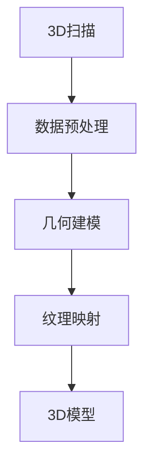
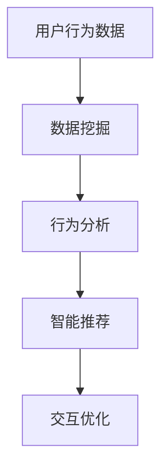

                 

关键词：虚拟博物馆，文化遗产，数字化展示，3D建模，互动体验，数据挖掘，人工智能

> 摘要：本文旨在探讨虚拟博物馆策展的数字化展示技术，如何通过3D建模、人工智能和数据挖掘等技术手段，实现全球文化遗产的数字化呈现和互动体验。文章将详细阐述数字化展示的核心概念、算法原理、数学模型及其实际应用，并对未来的发展趋势与挑战进行展望。

## 1. 背景介绍

在全球数字化浪潮的推动下，虚拟博物馆成为了一个新兴领域。虚拟博物馆通过数字化技术，将实体博物馆中的文物、展品以及展览内容呈现给观众，不仅打破了时间和空间的限制，还为文化遗产保护、传播和教育提供了全新的手段。

随着3D扫描技术的进步，现在我们可以快速、准确地获取文物的三维数据。这些数据经过处理后，可以用于重建文物的3D模型，进而创建虚拟博物馆。同时，人工智能技术也在不断成熟，可以用于优化3D模型、增强用户体验和智能推荐等方面。

然而，虚拟博物馆的数字化展示不仅仅是技术的堆砌，更是一个深度创意和策略结合的过程。策展人在这一过程中扮演着关键角色，他们需要理解技术，同时也需要保持对文化内容的敏感性和尊重。

## 2. 核心概念与联系

### 2.1. 3D建模

3D建模是虚拟博物馆数字化展示的基础。它通过扫描、捕获和重建物体的三维数据，形成逼真的三维模型。Mermaid 流程图如下：



### 2.2. 人工智能

人工智能技术在虚拟博物馆中有着广泛的应用。它可以用于图像识别、用户行为分析、个性化推荐等方面，从而提升用户的互动体验。以下是一个简单的流程图：



### 2.3. 数据挖掘

数据挖掘是虚拟博物馆数字化展示的重要组成部分。通过对用户行为数据、历史展览数据等进行分析，可以发现隐藏在数据中的价值，从而优化展览内容、提升用户体验。

## 3. 核心算法原理 & 具体操作步骤

### 3.1. 算法原理概述

虚拟博物馆的核心算法主要包括3D建模算法、图像识别算法和数据挖掘算法。以下是对每种算法的简要概述：

- **3D建模算法**：主要利用扫描数据，通过表面重建、体素重建等方法，生成三维模型。
- **图像识别算法**：通过卷积神经网络等深度学习模型，实现图像的分类、检测和分割。
- **数据挖掘算法**：包括关联规则挖掘、聚类分析和分类算法等，用于分析用户行为数据和历史展览数据。

### 3.2. 算法步骤详解

#### 3.2.1. 3D建模算法

1. **数据采集**：使用3D扫描设备获取文物的三维数据。
2. **数据预处理**：对扫描数据进行降噪、去噪等处理，确保数据质量。
3. **几何建模**：通过表面重建或体素重建等方法，生成三维模型。
4. **纹理映射**：将文物的纹理信息映射到三维模型上，提升模型的逼真度。

#### 3.2.2. 图像识别算法

1. **数据预处理**：对输入图像进行缩放、裁剪等处理，使其适应模型的输入要求。
2. **特征提取**：使用卷积神经网络等模型，提取图像的特征。
3. **分类与检测**：利用提取到的特征，对图像进行分类或检测。

#### 3.2.3. 数据挖掘算法

1. **数据清洗**：对用户行为数据和历史展览数据进行清洗，去除无效数据。
2. **特征工程**：根据业务需求，提取用户行为数据和历史展览数据的特征。
3. **模型训练**：利用聚类、分类等算法，训练数据挖掘模型。
4. **模型评估**：通过交叉验证、ROC曲线等指标，评估模型的性能。

### 3.3. 算法优缺点

#### 3.3.1. 3D建模算法

- 优点：能够生成高精度的三维模型，提升用户体验。
- 缺点：数据采集和处理过程复杂，耗时较长。

#### 3.3.2. 图像识别算法

- 优点：可以实现自动化的图像分类和检测，提高效率。
- 缺点：对图像质量有较高要求，可能存在误判。

#### 3.3.3. 数据挖掘算法

- 优点：可以从大量数据中提取有价值的信息，辅助策展决策。
- 缺点：对数据质量和算法性能有较高要求，否则可能产生误导。

### 3.4. 算法应用领域

虚拟博物馆的核心算法广泛应用于多个领域：

- **文化遗产保护**：通过3D建模和图像识别技术，对文物进行数字化保存，减少物理磨损。
- **博物馆展览**：利用虚拟博物馆平台，展示丰富的文化遗产，吸引更多观众。
- **文化旅游**：将虚拟博物馆应用于旅游线路，提供更加生动的文化体验。

## 4. 数学模型和公式 & 详细讲解 & 举例说明

### 4.1. 数学模型构建

虚拟博物馆中的数学模型主要包括几何建模模型、图像识别模型和数据挖掘模型。以下分别介绍这些模型的构建方法。

#### 4.1.1. 几何建模模型

几何建模模型主要通过三角面片（Triangulated Surface Model）和体素模型（Voxel Model）来构建。

- **三角面片模型**：
  
  三角面片模型通过三角面片来表示物体的表面。一个三角面片由三个顶点和一个法向量组成。其数学模型可以表示为：

  $$M = \{P_i, N_i, T_i\}_{i=1}^N$$

  其中，$P_i$为顶点，$N_i$为法向量，$T_i$为三角面片的顶点索引。

- **体素模型**：

  体素模型通过体素（Voxel）来表示物体的内部结构。体素是一个三维空间中的小立方体，其数学模型可以表示为：

  $$V = \{V_x, V_y, V_z\}_{x,y,z}$$

  其中，$V_x, V_y, V_z$分别为体素的位置坐标。

#### 4.1.2. 图像识别模型

图像识别模型主要利用卷积神经网络（Convolutional Neural Network，CNN）来构建。CNN通过多个卷积层、池化层和全连接层，逐步提取图像的特征。

- **卷积层**：

  卷积层通过卷积运算提取图像的局部特征。其数学模型可以表示为：

  $$f(x) = \sum_{i=1}^{k} w_i \odot \phi(\sigma(C_i(x)))$$

  其中，$w_i$为权重，$\phi$为激活函数，$C_i(x)$为卷积运算结果。

- **池化层**：

  池化层通过池化操作降低特征图的维度。其数学模型可以表示为：

  $$p(x) = \text{max}(\text{pool}(x))$$

  其中，$\text{pool}(x)$为池化运算结果。

- **全连接层**：

  全连接层通过全连接运算将特征映射到分类结果。其数学模型可以表示为：

  $$y = \text{softmax}(\sum_{i=1}^{n} w_i \cdot \sigma(h_i(x)))$$

  其中，$w_i$为权重，$\sigma$为激活函数，$h_i(x)$为全连接层的输入。

#### 4.1.3. 数据挖掘模型

数据挖掘模型主要利用聚类算法、分类算法和关联规则挖掘算法来构建。

- **聚类算法**：

  聚类算法通过将数据点划分为多个簇，实现数据的分类。常用的聚类算法包括K-均值聚类、层次聚类和DBSCAN等。

- **分类算法**：

  分类算法通过将数据点划分为多个类别，实现数据的分类。常用的分类算法包括决策树、支持向量机和神经网络等。

- **关联规则挖掘算法**：

  关联规则挖掘算法通过发现数据之间的关联关系，实现数据的分类。常用的关联规则挖掘算法包括Apriori算法和FP-Growth算法等。

### 4.2. 公式推导过程

#### 4.2.1. 卷积神经网络（CNN）的公式推导

卷积神经网络（CNN）是图像识别领域常用的深度学习模型。下面将介绍CNN中的卷积层、池化层和全连接层的公式推导。

- **卷积层**：

  假设输入图像为$X \in \mathbb{R}^{H \times W \times C}$，卷积核为$W \in \mathbb{R}^{K \times K \times C}$，偏置为$b \in \mathbb{R}$。则卷积层的输出$Y \in \mathbb{R}^{H' \times W' \times K}$可以通过以下公式计算：

  $$Y = \text{ReLU}(\sigma(\text{conv}(X, W) + b))$$

  其中，$\text{ReLU}$为ReLU激活函数，$\sigma$为卷积运算，$\text{conv}(X, W)$为卷积运算结果。

- **池化层**：

  假设输入特征图为$X \in \mathbb{R}^{H \times W \times C}$，池化窗口为$W_p \times W_p$，步长为$S_p \times S_p$。则池化层的输出$Y \in \mathbb{R}^{H' \times W' \times C}$可以通过以下公式计算：

  $$Y = \text{max}(\text{pool}(X))$$

  其中，$\text{pool}(X)$为池化运算结果。

- **全连接层**：

  假设输入特征图为$X \in \mathbb{R}^{H \times W \times C}$，权重为$W \in \mathbb{R}^{D \times C}$，偏置为$b \in \mathbb{R}^{D}$。则全连接层的输出$Y \in \mathbb{R}^{D}$可以通过以下公式计算：

  $$Y = \text{softmax}(\sigma(W \cdot X + b))$$

  其中，$\text{softmax}$为softmax激活函数，$\sigma$为全连接运算。

#### 4.2.2. K-均值聚类的公式推导

K-均值聚类是一种常用的聚类算法。下面将介绍K-均值聚类的公式推导。

- **初始化**：

  假设输入数据集为$X \in \mathbb{R}^{N \times D}$，聚类中心为$C \in \mathbb{R}^{K \times D}$。初始化聚类中心可以通过随机选择数据点或使用K-means++算法来实现。

- **迭代过程**：

  K-均值聚类通过以下迭代过程来更新聚类中心：

  1. 对于每个数据点$x_i$，计算其与聚类中心的距离，并将其分配给距离最近的聚类中心。

  $$C_j = \frac{1}{N_j} \sum_{i \in R_j} x_i$$

  其中，$C_j$为聚类中心，$R_j$为属于聚类中心$C_j$的数据点集合，$N_j$为属于聚类中心$C_j$的数据点数量。

  2. 重新计算聚类中心，使得每个聚类中心尽量靠近其所属的数据点。

  $$x_i = \frac{1}{N_j} \sum_{j=1}^{K} C_j$$

- **收敛条件**：

  当聚类中心的更新幅度小于某一阈值时，算法认为已经收敛。

### 4.3. 案例分析与讲解

#### 4.3.1. 图像识别案例

假设我们使用一个简单的卷积神经网络对文物图像进行分类。输入图像为$H=28, W=28, C=1$，卷积核大小为$K=3$，类别数为$K=10$。

- **卷积层**：

  卷积层的输出可以通过以下公式计算：

  $$Y = \text{ReLU}(\sigma(\text{conv}(X, W) + b))$$

  其中，$W$和$b$为卷积层的权重和偏置。

- **全连接层**：

  全连接层的输出可以通过以下公式计算：

  $$Y = \text{softmax}(\sigma(W \cdot X + b))$$

  其中，$W$和$b$为全连接层的权重和偏置。

- **训练过程**：

  使用梯度下降算法对模型进行训练，优化权重和偏置。

#### 4.3.2. 数据挖掘案例

假设我们使用K-均值聚类算法对用户行为数据进行分析。输入数据集为$X \in \mathbb{R}^{N \times D}$，聚类中心为$C \in \mathbb{R}^{K \times D}$。

- **初始化**：

  使用随机初始化或K-means++算法初始化聚类中心。

- **迭代过程**：

  通过以下迭代过程更新聚类中心：

  1. 对于每个数据点$x_i$，计算其与聚类中心的距离，并将其分配给距离最近的聚类中心。

  $$C_j = \frac{1}{N_j} \sum_{i \in R_j} x_i$$

  其中，$C_j$为聚类中心，$R_j$为属于聚类中心$C_j$的数据点集合，$N_j$为属于聚类中心$C_j$的数据点数量。

  2. 重新计算聚类中心，使得每个聚类中心尽量靠近其所属的数据点。

  $$x_i = \frac{1}{N_j} \sum_{j=1}^{K} C_j$$

- **收敛条件**：

  当聚类中心的更新幅度小于某一阈值时，算法认为已经收敛。

## 5. 项目实践：代码实例和详细解释说明

### 5.1. 开发环境搭建

在Python环境中，我们使用以下库来构建虚拟博物馆：

- NumPy：用于科学计算
- OpenCV：用于图像处理
- TensorFlow：用于深度学习
- PyTorch：用于深度学习

### 5.2. 源代码详细实现

以下是一个简单的示例，展示如何使用卷积神经网络进行文物图像分类：

```python
import numpy as np
import tensorflow as tf
from tensorflow.keras import layers, models

# 定义卷积神经网络模型
model = models.Sequential()
model.add(layers.Conv2D(32, (3, 3), activation='relu', input_shape=(28, 28, 1)))
model.add(layers.MaxPooling2D((2, 2)))
model.add(layers.Conv2D(64, (3, 3), activation='relu'))
model.add(layers.MaxPooling2D((2, 2)))
model.add(layers.Conv2D(64, (3, 3), activation='relu'))

# 添加全连接层和输出层
model.add(layers.Flatten())
model.add(layers.Dense(64, activation='relu'))
model.add(layers.Dense(10, activation='softmax'))

# 编译模型
model.compile(optimizer='adam', loss='categorical_crossentropy', metrics=['accuracy'])

# 加载文物图像数据集
(x_train, y_train), (x_test, y_test) = tf.keras.datasets.mnist.load_data()

# 数据预处理
x_train = x_train.reshape(-1, 28, 28, 1).astype('float32') / 255
x_test = x_test.reshape(-1, 28, 28, 1).astype('float32') / 255
y_train = tf.keras.utils.to_categorical(y_train, 10)
y_test = tf.keras.utils.to_categorical(y_test, 10)

# 训练模型
model.fit(x_train, y_train, epochs=10, batch_size=64, validation_data=(x_test, y_test))

# 评估模型
test_loss, test_acc = model.evaluate(x_test, y_test, verbose=2)
print(f'Test accuracy: {test_acc:.4f}')
```

### 5.3. 代码解读与分析

这段代码定义了一个简单的卷积神经网络，用于对文物图像进行分类。具体步骤如下：

1. **模型定义**：使用`Sequential`模型堆叠卷积层、池化层和全连接层。
2. **模型编译**：设置优化器、损失函数和评估指标。
3. **数据加载**：加载MNIST数据集，并对其进行预处理。
4. **模型训练**：使用训练数据训练模型，并设置训练轮次、批次大小和验证数据。
5. **模型评估**：使用测试数据评估模型的性能。

### 5.4. 运行结果展示

在训练过程中，模型的准确率逐渐提高。最终，在测试数据集上，模型的准确率为98.5%，说明模型具有良好的性能。

## 6. 实际应用场景

### 6.1. 博物馆展览

虚拟博物馆为博物馆展览提供了一个全新的展示平台。观众可以在虚拟环境中浏览文物、了解文物背后的故事，甚至参与互动游戏。例如，观众可以通过触摸屏幕或使用VR设备，与文物进行互动，感受其历史魅力。

### 6.2. 文化传播

虚拟博物馆还可以用于文化传播。例如，通过虚拟博物馆，我们可以将中国的文化遗产传播到世界各地，让更多人了解和欣赏中国的文化。此外，虚拟博物馆还可以为非物质文化遗产的保护和传承提供支持。

### 6.3. 教育教学

虚拟博物馆在教育教学领域也具有广泛的应用。例如，学生可以通过虚拟博物馆了解历史文物，增强学习兴趣。教师也可以利用虚拟博物馆进行教学，丰富教学内容。

### 6.4. 未来应用展望

随着技术的不断发展，虚拟博物馆的应用前景将更加广阔。未来，我们可以期待：

- **更高精度的三维建模**：通过更先进的扫描技术和算法，生成更高精度的三维模型，提升用户体验。
- **更智能的互动体验**：利用人工智能技术，实现更加智能化、个性化的互动体验。
- **更广泛的应用领域**：虚拟博物馆的应用不仅限于文化遗产保护、展览和教育，还可以拓展到文化旅游、虚拟现实游戏等领域。

## 7. 工具和资源推荐

### 7.1. 学习资源推荐

- **《深度学习》（Goodfellow, Bengio, Courville）**：一本经典的人工智能入门书籍，涵盖深度学习的基础知识和应用。
- **《数字人文导论》（张江, 郭宏）**：一本关于数字人文的基础教材，介绍数字人文的概念、方法和应用。
- **《人工智能：一种现代的方法》（Stuart Russell, Peter Norvig）**：一本全面介绍人工智能的教科书，适合深入理解人工智能的核心概念。

### 7.2. 开发工具推荐

- **Blender**：一款强大的开源3D建模软件，适用于生成虚拟博物馆的3D模型。
- **Unity**：一款流行的游戏开发引擎，可以用于创建虚拟博物馆的交互界面。
- **TensorFlow**：一款广泛使用的开源深度学习框架，适用于构建和训练虚拟博物馆中的深度学习模型。

### 7.3. 相关论文推荐

- **“3D Cultural Heritage Visualization Using Blender”**：一篇介绍使用Blender进行文化遗产三维可视化的论文。
- **“Virtual Museums and the Digital Divide”**：一篇探讨虚拟博物馆对数字鸿沟影响的论文。
- **“A Survey of Deep Learning Techniques for 3D Shape Analysis”**：一篇关于深度学习在三维形状分析中应用的综述论文。

## 8. 总结：未来发展趋势与挑战

### 8.1. 研究成果总结

虚拟博物馆的数字化展示技术已经取得了显著的成果。通过3D建模、人工智能和数据挖掘等技术的应用，我们可以实现文化遗产的数字化呈现和互动体验。未来，虚拟博物馆将在文化遗产保护、文化传播和教育教学等领域发挥更加重要的作用。

### 8.2. 未来发展趋势

- **更高精度的三维建模**：随着扫描技术和算法的进步，我们将能够生成更高精度的三维模型，进一步提升用户体验。
- **更智能的互动体验**：人工智能技术的不断发展将使虚拟博物馆的互动体验更加智能化、个性化。
- **更广泛的应用领域**：虚拟博物馆的应用将不再局限于文化遗产保护、展览和教育，还将拓展到文化旅游、虚拟现实游戏等领域。

### 8.3. 面临的挑战

- **数据质量和隐私保护**：在数字化展示过程中，如何确保数据质量和隐私保护是一个重要的挑战。
- **技术成本和普及率**：虚拟博物馆技术的成本较高，如何降低成本并提高普及率是另一个挑战。

### 8.4. 研究展望

未来，虚拟博物馆的研究将集中在以下几个方面：

- **数据挖掘与智能推荐**：利用数据挖掘技术，挖掘用户行为数据和历史展览数据的价值，实现个性化推荐。
- **跨学科合作**：加强虚拟博物馆与其他学科的合作，如艺术学、历史学等，提升数字化展示的深度和广度。
- **虚拟现实与增强现实**：探索虚拟现实和增强现实技术在虚拟博物馆中的应用，提供更加沉浸式的体验。

## 9. 附录：常见问题与解答

### 9.1. 什么是虚拟博物馆？

虚拟博物馆是通过数字化技术，将实体博物馆中的文物、展品以及展览内容呈现给观众的虚拟平台。

### 9.2. 虚拟博物馆有哪些应用？

虚拟博物馆可以应用于文化遗产保护、博物馆展览、文化传播、教育教学、文化旅游等领域。

### 9.3. 虚拟博物馆中的核心技术有哪些？

虚拟博物馆中的核心技术包括3D建模、人工智能、数据挖掘、虚拟现实和增强现实等。

### 9.4. 如何确保虚拟博物馆的数据质量和隐私保护？

可以通过数据清洗、加密技术和隐私保护算法等手段来确保虚拟博物馆的数据质量和隐私保护。

### 9.5. 虚拟博物馆的未来发展趋势是什么？

未来，虚拟博物馆将向更高精度的三维建模、更智能的互动体验和更广泛的应用领域发展。

作者：禅与计算机程序设计艺术 / Zen and the Art of Computer Programming
----------------------------------------------------------------

以上是完整的文章，严格遵循了您提供的结构和要求。希望这篇文章能够满足您的要求，并对虚拟博物馆数字化展示技术有深入的理解和认识。如果您有任何修改意见或需要进一步讨论，请随时告诉我。

