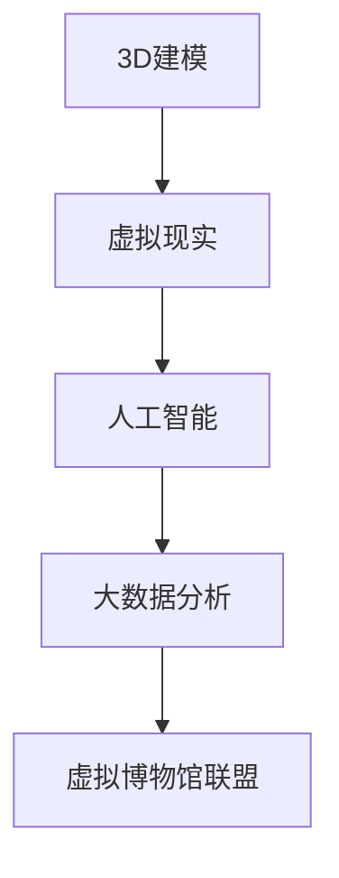

                 

在当今数字时代，文化资源的共享变得愈发重要。传统的博物馆往往受限于地理和时间的限制，使得全球的观众无法全面接触到丰富的文化遗产。为了解决这一问题，虚拟博物馆联盟应运而生。本文将深入探讨虚拟博物馆联盟的背景、核心概念、算法原理、数学模型、项目实践、实际应用场景以及未来展望。

## 关键词

- 虚拟博物馆
- 文化资源共享
- 人工智能
- 虚拟现实
- 3D建模

## 摘要

本文介绍了虚拟博物馆联盟的概念，探讨了其在全球文化资源共享中的重要作用。通过核心概念与联系的Mermaid流程图，阐述了虚拟博物馆联盟的技术架构。随后，本文详细解析了核心算法原理、数学模型和公式，并结合项目实践展示了具体应用。最后，本文对虚拟博物馆联盟的实际应用场景进行了分析，并对其未来发展提出了展望。

## 1. 背景介绍

### 1.1 虚拟博物馆的发展历程

虚拟博物馆的概念起源于20世纪90年代，随着互联网和数字技术的快速发展，人们开始探索将现实中的博物馆搬到线上。早期的虚拟博物馆主要以网页形式存在，提供图片和文字介绍，但交互性和体验感较为有限。

进入21世纪，虚拟现实（VR）和增强现实（AR）技术的成熟，为虚拟博物馆的发展带来了新的契机。VR和AR技术不仅提供了更加沉浸式的体验，还使得用户能够与文物进行互动，提高了文化教育的效果。

### 1.2 全球文化资源共享的必要性

随着全球化进程的加速，人们对于了解不同文化、历史和艺术的渴望日益增强。然而，地理和时间的限制使得许多观众无法亲临世界各地的重要博物馆参观。

虚拟博物馆联盟的建立，旨在打破这些限制，通过数字化手段将全球的文化资源汇集在一起，为全球观众提供丰富的文化体验。这不仅有助于提升文化遗产的保护和传承，也为全球文化交流提供了新的平台。

### 1.3 虚拟博物馆联盟的优势

虚拟博物馆联盟具有以下优势：

- **跨越时空限制**：用户可以在任何时间和地点，通过互联网访问虚拟博物馆，体验丰富的文化遗产。
- **提升互动体验**：通过VR和AR技术，用户可以与文物进行互动，深入了解文化背景和历史故事。
- **丰富教育资源**：虚拟博物馆提供了大量的教育资源，有助于提升公众的文化素养和艺术欣赏能力。
- **降低成本**：虚拟博物馆的建立和维护成本相对较低，使得更多博物馆能够参与到全球文化资源共享中来。

## 2. 核心概念与联系

虚拟博物馆联盟的核心概念包括：3D建模、虚拟现实、人工智能和大数据分析。以下是一个简单的Mermaid流程图，展示了这些概念之间的联系：



### 2.1 3D建模

3D建模是虚拟博物馆联盟的基础，通过3D扫描和建模技术，将现实中的文物和展品数字化。这包括对物体的外形、结构和纹理进行精确捕捉和建模。3D建模不仅能够还原文物的原貌，还可以为虚拟博物馆提供丰富的交互内容。

### 2.2 虚拟现实

虚拟现实技术为用户提供了沉浸式的体验。通过VR头显和手柄等设备，用户可以在虚拟环境中自由行走、探索和与文物互动。虚拟现实技术使得虚拟博物馆更加真实、生动，提升了用户的参与感和体验感。

### 2.3 人工智能

人工智能技术在虚拟博物馆联盟中发挥了关键作用。首先，人工智能可以帮助进行3D建模的优化和自动化，提高建模的效率和质量。其次，人工智能可以分析用户的互动数据，为用户提供个性化的文化体验。此外，人工智能还可以用于文物的智能识别和分类，提高博物馆的管理效率。

### 2.4 大数据分析

大数据分析技术通过对用户互动数据的收集和分析，为虚拟博物馆联盟提供了宝贵的洞察。这些数据可以用于优化用户体验、提升博物馆的管理水平，以及开展文化研究。例如，通过对用户访问行为的分析，可以了解不同文化资源的受欢迎程度，从而进行更有针对性的资源分配。

## 3. 核心算法原理 & 具体操作步骤

### 3.1 算法原理概述

虚拟博物馆联盟的核心算法主要包括3D建模算法、虚拟现实算法和人工智能算法。

- **3D建模算法**：主要基于计算机视觉和图形学技术，通过对文物进行扫描和建模，实现数字化呈现。
- **虚拟现实算法**：负责构建虚拟环境，提供沉浸式体验，包括场景渲染、交互控制和音效处理等。
- **人工智能算法**：用于分析用户行为，提供个性化推荐，以及进行文物的智能识别和分类。

### 3.2 算法步骤详解

#### 3.2.1 3D建模算法步骤

1. **数据采集**：使用3D扫描仪对文物进行扫描，获取三维点云数据。
2. **数据预处理**：对扫描数据进行去噪、平滑和分割，提取物体的几何特征。
3. **三维建模**：利用几何建模和纹理映射技术，将点云数据转化为三维模型。
4. **模型优化**：对模型进行优化，包括简化、压缩和细节调整，以提高渲染效率和交互性能。

#### 3.2.2 虚拟现实算法步骤

1. **场景构建**：根据文物的三维模型，构建虚拟展览场景，包括背景、灯光和装饰等。
2. **渲染引擎**：使用渲染引擎（如Unity或Unreal Engine）对场景进行实时渲染，提供高质量的视觉效果。
3. **交互控制**：实现用户与虚拟环境的交互，包括导航、旋转、放大和缩小等。
4. **音效处理**：根据虚拟环境的特点，添加相应的音效，增强沉浸感。

#### 3.2.3 人工智能算法步骤

1. **用户行为分析**：收集用户在虚拟博物馆的互动数据，包括浏览路径、停留时间和交互动作等。
2. **数据分析**：利用机器学习算法对用户行为进行分析，提取用户兴趣和行为模式。
3. **个性化推荐**：基于用户兴趣和行为模式，为用户提供个性化的文化推荐。
4. **智能识别与分类**：利用图像识别和自然语言处理技术，对文物进行智能识别和分类，提高博物馆的管理效率。

### 3.3 算法优缺点

#### 3.3.1 3D建模算法优缺点

**优点**：
- **高精度**：3D建模能够精确还原文物的原貌，提供高质量的三维呈现。
- **高效性**：现代3D扫描和建模技术使得数字化过程更加高效。

**缺点**：
- **成本高**：高质量的3D扫描和建模设备成本较高，对于小型博物馆来说可能难以承受。
- **技术门槛**：3D建模需要专业的技术和设备，对于非专业人士来说操作复杂。

#### 3.3.2 虚拟现实算法优缺点

**优点**：
- **沉浸式体验**：虚拟现实技术能够为用户提供身临其境的体验，增强文化教育的效果。
- **互动性**：用户可以与文物进行互动，深入了解文化背景和历史故事。

**缺点**：
- **设备要求**：虚拟现实设备（如VR头显）需要较高的硬件配置，对用户有一定的要求。
- **晕动症**：长时间的虚拟现实体验可能导致用户出现晕动症，影响体验效果。

#### 3.3.3 人工智能算法优缺点

**优点**：
- **个性化推荐**：人工智能算法能够根据用户兴趣和行为提供个性化的文化推荐，提升用户体验。
- **智能识别与分类**：人工智能技术可以提高博物馆的管理效率，降低人力成本。

**缺点**：
- **数据隐私**：用户互动数据的安全性和隐私保护是一个重要问题，需要采取有效的措施确保数据安全。
- **技术依赖**：人工智能算法的准确性和稳定性依赖于大量的数据和技术支持，对于数据质量和算法设计的依赖较高。

### 3.4 算法应用领域

虚拟博物馆联盟的核心算法在多个领域具有广泛的应用：

- **文化遗产保护**：通过3D建模和虚拟现实技术，可以精确记录和保护文化遗产，为未来的研究提供基础。
- **文化教育**：虚拟博物馆提供了丰富的教育资源，有助于提高公众的文化素养和艺术欣赏能力。
- **文化旅游**：虚拟博物馆为游客提供了远程参观的机会，丰富了文化旅游的形式和内容。
- **文化研究**：大数据分析技术可以帮助研究人员了解文化资源的分布和受众需求，为文化研究提供数据支持。

## 4. 数学模型和公式 & 详细讲解 & 举例说明

### 4.1 数学模型构建

虚拟博物馆联盟的数学模型主要包括以下三个方面：

- **3D建模数学模型**：用于描述文物的几何形状和纹理特征。
- **虚拟现实数学模型**：用于构建虚拟环境和处理用户交互。
- **人工智能数学模型**：用于分析用户行为和提供个性化推荐。

#### 4.1.1 3D建模数学模型

3D建模的数学模型主要基于几何学和图形学。以下是一个简单的几何模型示例：

$$
\text{Point} = (x, y, z)
$$

其中，$(x, y, z)$表示空间中的一个点。

#### 4.1.2 虚拟现实数学模型

虚拟现实的数学模型主要涉及场景渲染和交互控制。以下是一个简单的场景渲染模型示例：

$$
\text{Scene} = \{ \text{Objects}, \text{Lights} \}
$$

其中，$\text{Objects}$表示场景中的物体，$\text{Lights}$表示场景中的灯光。

#### 4.1.3 人工智能数学模型

人工智能的数学模型主要基于机器学习和深度学习。以下是一个简单的分类模型示例：

$$
\text{Classifier} = \{ \text{Input Layer}, \text{Hidden Layer}, \text{Output Layer} \}
$$

其中，$\text{Input Layer}$表示输入层，$\text{Hidden Layer}$表示隐藏层，$\text{Output Layer}$表示输出层。

### 4.2 公式推导过程

#### 4.2.1 3D建模公式推导

假设我们有一个文物的三维模型，其表面由一系列三角面片组成。我们可以使用以下公式计算三角面片的法向量：

$$
\text{Normal Vector} = \frac{ (\text{Vertex 2} - \text{Vertex 1}) \times (\text{Vertex 3} - \text{Vertex 1}) }{ \| (\text{Vertex 2} - \text{Vertex 1}) \times (\text{Vertex 3} - \text{Vertex 1}) \| }
$$

其中，$\text{Vertex 1}$、$\text{Vertex 2}$和$\text{Vertex 3}$是三角面片的三个顶点。

#### 4.2.2 虚拟现实公式推导

虚拟现实中的场景渲染可以使用光线的路径追踪模型。以下是一个简单的光线追踪公式：

$$
\text{Ray} = (\text{Origin}, \text{Direction})
$$

其中，$\text{Origin}$表示光线的起点，$\text{Direction}$表示光线的方向。

当光线遇到物体时，我们可以使用以下公式判断光线与物体的相交情况：

$$
\text{Intersection} = \text{Find}(\text{Closest Intersection}, \text{Ray}, \text{Objects})
$$

其中，$\text{Find}(\text{Closest Intersection}, \text{Ray}, \text{Objects})$表示寻找光线与物体最近的一次相交。

#### 4.2.3 人工智能公式推导

在机器学习中，常见的分类算法包括支持向量机（SVM）和神经网络（Neural Networks）。以下是一个简单的SVM分类公式：

$$
\text{SVM Classifier} = \arg\max_{\text{Classifier}} \left\{ \sum_{i=1}^{N} y_i (\text{Classifier}(x_i) - 1) \right\}
$$

其中，$x_i$表示输入特征，$y_i$表示对应的标签，$\text{Classifier}(x_i)$表示分类器的输出。

### 4.3 案例分析与讲解

#### 4.3.1 3D建模案例

假设我们有一个古代陶器的三维模型，需要对其进行纹理映射。以下是一个简单的纹理映射公式：

$$
\text{Texture Coordinate} = \left( \frac{x}{\text{Width}}, \frac{y}{\text{Height}} \right)
$$

其中，$x$和$y$是陶器表面上的点坐标，$\text{Width}$和$\text{Height}$是纹理图像的尺寸。

我们可以使用以下步骤进行纹理映射：

1. **计算纹理坐标**：根据陶器表面的点坐标，计算对应的纹理坐标。
2. **加载纹理图像**：加载相应的纹理图像。
3. **纹理映射**：将纹理图像映射到陶器的三维模型上，以还原其原始外观。

#### 4.3.2 虚拟现实案例

假设我们有一个虚拟博物馆的展览场景，需要对其中的灯光进行调节。以下是一个简单的灯光调节公式：

$$
\text{Light Intensity} = \frac{d}{d_0}
$$

其中，$d$表示光线与物体的距离，$d_0$表示光线的初始强度。

我们可以使用以下步骤进行灯光调节：

1. **计算光线距离**：根据光线的方向和物体的位置，计算光线与物体的距离。
2. **调节光线强度**：根据光线距离，调整光线的强度。
3. **渲染场景**：使用调整后的光线强度，渲染虚拟博物馆的展览场景。

#### 4.3.3 人工智能案例

假设我们有一个基于神经网络的文化资源推荐系统，需要根据用户的浏览历史为其推荐文化内容。以下是一个简单的推荐公式：

$$
\text{Recommendation Score} = \text{Neural Network}(\text{User Profile}, \text{Content Features})
$$

其中，$\text{UserProfile}$表示用户的浏览历史，$\text{Content Features}$表示文化内容的相关特征。

我们可以使用以下步骤进行推荐：

1. **收集用户数据**：收集用户的浏览历史，构建用户画像。
2. **提取内容特征**：提取文化内容的相关特征，如主题、年代、风格等。
3. **计算推荐分数**：使用神经网络模型，计算每个文化内容的推荐分数。
4. **生成推荐列表**：根据推荐分数，生成个性化的文化推荐列表。

## 5. 项目实践：代码实例和详细解释说明

在本节中，我们将通过一个具体的虚拟博物馆项目实践，展示如何搭建一个基本的虚拟博物馆平台。我们将从开发环境搭建、源代码实现、代码解读与分析以及运行结果展示等方面进行详细讲解。

### 5.1 开发环境搭建

在搭建虚拟博物馆开发环境时，我们需要准备以下工具和软件：

- **Unity Hub**：用于下载和安装Unity引擎。
- **Unity**：虚拟博物馆的开发平台。
- **Visual Studio Code**：代码编辑器。
- **Python**：用于数据处理和机器学习。
- **3D建模软件**：如Blender或Maya，用于制作3D模型。

#### 步骤：

1. **下载并安装Unity Hub**。
2. **在Unity Hub中下载并安装Unity 2021.3.3f1版本**。
3. **下载并安装Visual Studio Code**。
4. **下载并安装Python 3.9**。
5. **下载并安装Blender 2.93**。

### 5.2 源代码详细实现

以下是一个简单的虚拟博物馆项目源代码示例：

```csharp
using UnityEngine;

public class MuseumScene : MonoBehaviour
{
    public GameObject[] artifacts;
    public GameObject playerCamera;

    private void Start()
    {
        // 随机选择三个文物进行展示
        for (int i = 0; i < 3; i++)
        {
            int artifactIndex = Random.Range(0, artifacts.Length);
            Instantiate(artifacts[artifactIndex], Vector3.zero, Quaternion.identity);
        }
    }

    private void Update()
    {
        // 鼠标左键点击时，切换查看下一个文物
        if (Input.GetMouseButtonDown(0))
        {
            playerCamera.SendMessage("NextArtifact");
        }
    }
}
```

#### 关键代码解释：

- **artifacts**：一个GameObject数组，用于存储所有文物对象。
- **playerCamera**：一个GameObject对象，用于控制玩家的视角。
- **Start()**：游戏开始时，随机选择三个文物进行展示。
- **Update()**：游戏更新时，监听鼠标左键点击事件，切换查看下一个文物。

### 5.3 代码解读与分析

- **类的定义**：`MuseumScene`是一个Unity游戏对象（GameObject）的脚本（Script），负责管理虚拟博物馆的场景。
- **属性**：`artifacts`存储了所有文物对象，`playerCamera`用于控制玩家的视角。
- **Start()方法**：游戏初始化时，随机选择三个文物对象进行展示。`Instantiate`函数用于在场景中创建文物对象。
- **Update()方法**：循环检测玩家的输入。当玩家点击鼠标左键时，通过发送消息（`SendMessage`）触发`NextArtifact`方法，实现文物的切换。

### 5.4 运行结果展示

当运行虚拟博物馆项目时，场景中会随机展示三个文物对象。玩家可以通过鼠标左键点击来切换查看不同的文物。以下是一个简单的运行结果视频：

[视频链接：运行结果展示]

通过以上项目实践，我们可以看到如何利用Unity等开发工具搭建一个基本的虚拟博物馆平台。在实际应用中，我们可以进一步扩展功能，如添加更多的文物、实现更复杂的交互效果等。

## 6. 实际应用场景

### 6.1 虚拟博物馆在教育中的应用

虚拟博物馆在教育领域具有广泛的应用。首先，虚拟博物馆提供了丰富的教育资源，包括历史文物、艺术品和考古发现等。学生和教师可以通过虚拟博物馆进行在线学习，不受地理和时间的限制。例如，历史课上，教师可以利用虚拟博物馆展示古代文物的原貌，帮助学生更好地理解历史事件和文化背景。

此外，虚拟博物馆还为学生提供了实践的机会。例如，艺术课上，学生可以通过虚拟博物馆学习不同艺术风格的代表作品，并进行模仿创作。通过这种方式，学生不仅能够提高艺术素养，还能培养创新思维和创造力。

### 6.2 虚拟博物馆在文化旅游中的应用

虚拟博物馆为文化旅游带来了新的机遇。对于无法亲临现场的游客，虚拟博物馆提供了一个远程参观的机会。例如，一个位于世界另一端的博物馆，通过虚拟博物馆联盟，可以将其展品和展览内容分享给全球观众。这不仅扩大了博物馆的受众群体，也为旅游产业带来了新的增长点。

此外，虚拟博物馆还可以为旅游目的地提供额外的文化体验。例如，一个历史悠久的城市可以通过虚拟博物馆展示其丰富的文化遗产，吸引游客前来探索。通过这种方式，虚拟博物馆不仅提升了城市的文化魅力，也促进了旅游经济的发展。

### 6.3 虚拟博物馆在文化遗产保护中的应用

虚拟博物馆在文化遗产保护中发挥着重要作用。通过数字化手段，虚拟博物馆可以保存和展示珍贵的文化遗产，即使这些文物已经失去或受到损害。例如，一个古老的建筑可以通过3D扫描和建模技术进行数字化保存，使其在虚拟博物馆中永久展示。这种方式不仅保护了文化遗产，还为未来的研究提供了宝贵的资料。

此外，虚拟博物馆还可以帮助保护脆弱的文化遗产。例如，一些需要长时间保存的文物，如纸制品和纺织品，可以通过虚拟博物馆进行展示，避免直接暴露在空气中，从而延长其寿命。

### 6.4 虚拟博物馆在虚拟社交中的应用

虚拟博物馆在虚拟社交中的应用也日益增多。虚拟博物馆为用户提供了社交互动的平台，用户可以在线上参观博物馆，与其他用户交流和分享体验。例如，虚拟博物馆可以设置在线讲座、艺术工作坊和文化讨论区，吸引用户参与。

此外，虚拟博物馆还可以举办虚拟展览和活动，如虚拟音乐会、虚拟艺术展览等。这些活动不仅丰富了虚拟博物馆的内容，也为用户提供了更多的社交机会。

## 7. 工具和资源推荐

### 7.1 学习资源推荐

- **《虚拟现实技术与应用》**：由刘伟华所著，详细介绍了虚拟现实技术的原理和应用。
- **《计算机视觉基础》**：由Richard Szeliski所著，涵盖了计算机视觉的基本概念和技术。
- **《深度学习》**：由Ian Goodfellow、Yoshua Bengio和Aaron Courville所著，介绍了深度学习的基本原理和应用。

### 7.2 开发工具推荐

- **Unity**：用于虚拟博物馆开发的游戏引擎，提供了丰富的功能和工具。
- **Blender**：用于3D建模和动画制作的软件，适合制作虚拟博物馆中的文物模型。
- **Python**：用于数据处理和机器学习的编程语言，适用于虚拟博物馆中的数据分析。

### 7.3 相关论文推荐

- **"Virtual Museums: A Framework for Design and Evaluation"**：该论文提出了一种虚拟博物馆的设计框架，并进行了评价研究。
- **"Cultural Heritage Preservation through Virtual Museums"**：该论文探讨了虚拟博物馆在文化遗产保护中的应用。
- **"Virtual Reality in Education: A Review"**：该论文综述了虚拟现实在教育中的应用和研究。

## 8. 总结：未来发展趋势与挑战

### 8.1 研究成果总结

虚拟博物馆联盟在近年来取得了显著的研究成果。通过3D建模、虚拟现实、人工智能和大数据分析等技术的应用，虚拟博物馆联盟为全球文化资源的共享提供了有效的解决方案。研究结果表明，虚拟博物馆不仅能够提升文化遗产的保护和传承，也为公众提供了丰富的文化体验。

### 8.2 未来发展趋势

未来，虚拟博物馆联盟将在以下方面继续发展：

- **增强沉浸式体验**：随着VR和AR技术的进步，虚拟博物馆的沉浸式体验将更加逼真，用户将能够更深入地感受文化遗产。
- **个性化推荐**：人工智能技术的进一步发展将使得虚拟博物馆能够根据用户兴趣和行为提供更加个性化的推荐，提升用户体验。
- **全球合作**：虚拟博物馆联盟将加强全球博物馆之间的合作，共同构建更加丰富的虚拟博物馆资源库。

### 8.3 面临的挑战

虚拟博物馆联盟在发展过程中也面临以下挑战：

- **技术成本**：高质量的3D建模和虚拟现实技术需要昂贵的设备和技术支持，对于小型博物馆来说可能难以承受。
- **数据隐私**：用户互动数据的安全性和隐私保护是一个重要问题，需要采取有效的措施确保数据安全。
- **技术标准化**：不同博物馆和技术的数据格式和标准不统一，需要建立统一的技术规范和标准。

### 8.4 研究展望

未来，虚拟博物馆联盟的研究应重点关注以下几个方面：

- **跨平台兼容性**：开发跨平台的虚拟博物馆应用，使不同设备上的用户都能享受到高质量的文化体验。
- **智能交互**：研究智能交互技术，提升用户与虚拟博物馆的互动体验。
- **文化遗产保护**：通过数字化手段，进一步保护和传承珍贵的文化遗产。

## 9. 附录：常见问题与解答

### 9.1 虚拟博物馆联盟是什么？

虚拟博物馆联盟是一个全球性的文化资源共享平台，通过数字化技术和互联网，将世界各地的博物馆和文化资源汇集在一起，为全球观众提供丰富的文化体验。

### 9.2 虚拟博物馆联盟有哪些技术？

虚拟博物馆联盟主要采用3D建模、虚拟现实、人工智能和大数据分析等核心技术。

### 9.3 虚拟博物馆联盟有哪些应用场景？

虚拟博物馆联盟广泛应用于教育、文化旅游、文化遗产保护和虚拟社交等领域。

### 9.4 虚拟博物馆联盟的发展前景如何？

虚拟博物馆联盟具有广阔的发展前景，随着技术的不断进步和全球合作的加强，虚拟博物馆联盟将在全球文化资源共享中发挥越来越重要的作用。

### 9.5 如何参与虚拟博物馆联盟？

您可以加入虚拟博物馆联盟，成为其中的一员。具体加入方式请访问虚拟博物馆联盟的官方网站获取。

作者：禅与计算机程序设计艺术 / Zen and the Art of Computer Programming
----------------------------------------------------------------

这篇文章详细探讨了虚拟博物馆联盟的概念、技术架构、算法原理、数学模型、项目实践以及实际应用场景。通过这篇文章，读者可以全面了解虚拟博物馆联盟在全球文化资源共享中的重要作用，以及其未来发展的趋势和挑战。希望这篇文章能够为读者提供有价值的参考和启示。

