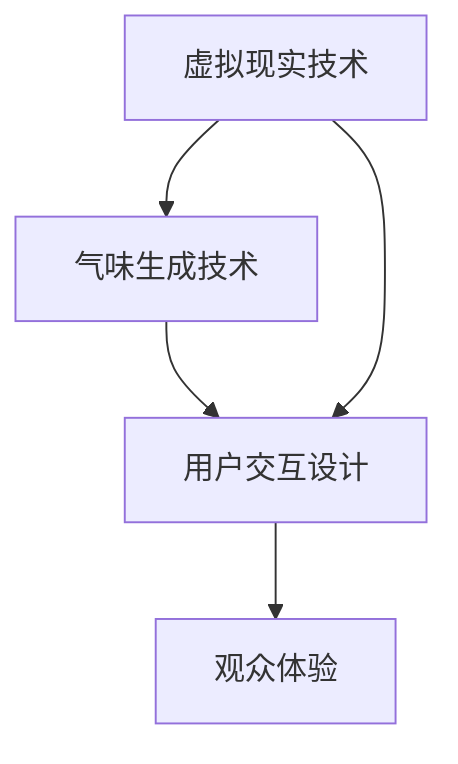

                 

关键词：虚拟嗅觉艺术馆、AI策展、气味展览、计算机图形学、三维重建、机器学习、用户交互

> 摘要：本文探讨了一种创新的虚拟嗅觉艺术馆概念，通过人工智能（AI）技术策展，为观众呈现一场超越物理空间的气味展览。本文将介绍虚拟嗅觉艺术馆的背景、核心概念、技术实现、算法原理、数学模型以及实际应用，并对未来发展的趋势和挑战进行分析。

## 1. 背景介绍

随着计算机图形学和虚拟现实技术的发展，艺术展览的形式正逐步从传统的物理空间走向虚拟空间。传统的艺术展览往往受限于物理空间，展览内容在特定的时间和地点展示，观众体验也受到诸多限制。而虚拟嗅觉艺术馆则突破了这一局限，它利用AI技术，将气味这一感官体验引入虚拟空间，为观众提供一种全新的艺术体验。

虚拟嗅觉艺术馆的核心概念是将艺术作品与气味相结合，通过虚拟现实技术，为观众呈现一个集视觉、听觉、嗅觉于一体的多维艺术体验。这种艺术馆不仅仅是一个展示空间，更是一个互动的平台，观众可以在其中自由探索、互动和创作。

### 1.1 艺术与气味的结合

气味作为一种独特的感官体验，具有很强的情感表达力和记忆点。将气味引入艺术展览，可以增强艺术作品的感染力和表现力，使观众在视觉享受之外，还能通过嗅觉感受到艺术作品的情感内涵。例如，一幅描绘夏日的画作，如果配以清新的柠檬香气，可以更加生动地传达出夏日的热烈和清新。

### 1.2 虚拟现实与气味的融合

虚拟现实技术为气味展览提供了技术支持。通过虚拟现实头盔和传感器，观众可以沉浸在一个完全虚拟的环境中，感受各种不同的气味。这种沉浸式体验不仅能够增强观众的感官刺激，还能激发他们的想象力和创造力。

## 2. 核心概念与联系

虚拟嗅觉艺术馆的核心概念包括虚拟现实、气味生成和用户交互。以下是一个简单的Mermaid流程图，展示了这些概念之间的联系。



### 2.1 虚拟现实技术

虚拟现实技术是虚拟嗅觉艺术馆的基础。它通过三维建模、纹理映射和光影效果等手段，构建一个逼真的虚拟环境。在这个环境中，观众可以通过头盔和其他传感设备感知到各种视觉和听觉信息。

### 2.2 气味生成技术

气味生成技术是虚拟嗅觉艺术馆的核心。它通过气体传感器和气味发生器，实时生成各种气味。这些气味可以与艺术作品的主题相匹配，增强观众的体验。

### 2.3 用户交互设计

用户交互设计是虚拟嗅觉艺术馆的关键。通过直观的交互界面和互动功能，观众可以自由地探索和体验艺术作品，与气味进行互动。这种交互设计不仅提高了观众的参与度，还能增强他们的记忆和情感体验。

## 3. 核心算法原理 & 具体操作步骤

### 3.1 算法原理概述

虚拟嗅觉艺术馆的核心算法主要包括气味生成算法、用户行为预测算法和交互反馈算法。以下是对这些算法的简要概述。

### 3.2 算法步骤详解

#### 3.2.1 气味生成算法

气味生成算法主要基于机器学习技术，通过对大量气味数据的训练，生成与艺术作品主题相匹配的气味。具体步骤如下：

1. 数据采集：收集各种类型的气味数据，包括花香、果香、肉类香味等。
2. 数据预处理：对气味数据进行处理，提取特征，并转换为适合机器学习的格式。
3. 训练模型：使用机器学习算法（如神经网络）训练气味生成模型。
4. 气味生成：根据艺术作品的主题，调用模型生成相应的气味。

#### 3.2.2 用户行为预测算法

用户行为预测算法主要用于预测观众对艺术作品和气味的偏好。具体步骤如下：

1. 数据收集：收集观众在虚拟嗅觉艺术馆中的交互数据，包括浏览历史、气味反馈等。
2. 数据预处理：对收集的数据进行清洗和处理，提取有用的信息。
3. 训练模型：使用机器学习算法（如决策树、随机森林等）训练用户行为预测模型。
4. 行为预测：根据观众的历史行为，预测他们对艺术作品和气味的偏好。

#### 3.2.3 交互反馈算法

交互反馈算法主要用于根据观众的反馈调整艺术作品和气味的配置。具体步骤如下：

1. 数据收集：收集观众的反馈数据，包括满意度、交互时长等。
2. 数据预处理：对收集的数据进行处理，提取反馈信息。
3. 训练模型：使用机器学习算法（如强化学习）训练交互反馈模型。
4. 反馈调整：根据观众的反馈，调整艺术作品和气味的配置，以提高用户体验。

### 3.3 算法优缺点

#### 优点

- **个性化体验**：通过机器学习算法，可以生成与观众偏好相匹配的气味，提高用户体验。
- **互动性**：观众可以通过交互反馈算法，直接参与艺术作品的展示，增强互动性。
- **实时性**：气味生成算法和用户行为预测算法可以实现实时调整，使展览更加灵活。

#### 缺点

- **技术难度**：虚拟嗅觉艺术馆的技术实现涉及多个领域，如机器学习、计算机图形学等，技术难度较高。
- **成本问题**：构建一个功能完备的虚拟嗅觉艺术馆需要大量的资金和技术支持。
- **气味安全问题**：气味的生成和传输需要考虑安全性和卫生问题，防止对观众的健康产生负面影响。

### 3.4 算法应用领域

虚拟嗅觉艺术馆的算法可以应用于多个领域，包括但不限于：

- **博物馆与画廊**：通过虚拟嗅觉艺术馆，可以为观众提供更加沉浸式的艺术体验。
- **广告与营销**：企业可以利用虚拟嗅觉艺术馆，展示产品特色，吸引消费者。
- **教育**：虚拟嗅觉艺术馆可以用于教育领域，帮助学生更好地理解艺术作品的内涵。

## 4. 数学模型和公式 & 详细讲解 & 举例说明

### 4.1 数学模型构建

在虚拟嗅觉艺术馆中，气味生成和用户交互的数学模型主要包括气味生成模型和用户行为模型。以下是对这些模型的简要介绍。

#### 气味生成模型

气味生成模型主要用于生成与艺术作品主题相匹配的气味。一个简单的气味生成模型可以表示为：

$$
\text{SMELL}(x) = f(\text{ART}, x)
$$

其中，$SMELL(x)$ 表示生成的气味，$f(\text{ART}, x)$ 表示气味生成函数，$\text{ART}$ 表示艺术作品的特征，$x$ 表示其他影响气味的因素（如温度、湿度等）。

#### 用户行为模型

用户行为模型主要用于预测观众对艺术作品和气味的偏好。一个简单的用户行为模型可以表示为：

$$
\text{PREF}(x, y) = g(\text{USER}, x, y)
$$

其中，$PREF(x, y)$ 表示观众对气味$x$和艺术作品$y$的偏好，$g(\text{USER}, x, y)$ 表示用户行为预测函数，$\text{USER}$ 表示观众的特征，$x$ 和 $y$ 分别表示气味和艺术作品的特征。

### 4.2 公式推导过程

#### 气味生成模型推导

气味生成模型的关键在于找到气味生成函数$f(\text{ART}, x)$。一个可能的推导过程如下：

1. **特征提取**：对艺术作品和影响气味的因素进行特征提取，得到$\text{ART}$ 和 $x$。
2. **数据拟合**：使用机器学习算法，对特征数据进行拟合，得到$f(\text{ART}, x)$。
3. **气味生成**：根据艺术作品和影响因素，调用$f(\text{ART}, x)$ 生成气味。

#### 用户行为模型推导

用户行为模型的关键在于找到用户行为预测函数$g(\text{USER}, x, y)$。一个可能的推导过程如下：

1. **特征提取**：对观众的特征、气味特征和艺术作品特征进行提取，得到$\text{USER}$、$x$ 和 $y$。
2. **数据拟合**：使用机器学习算法，对特征数据进行拟合，得到$g(\text{USER}, x, y)$。
3. **行为预测**：根据观众特征、气味特征和艺术作品特征，调用$g(\text{USER}, x, y)$ 预测观众偏好。

### 4.3 案例分析与讲解

#### 气味生成模型案例分析

假设我们要为一张描绘春天的画作生成相应的气味。我们可以提取艺术作品的特征（如颜色、形状、纹理等）和影响气味的因素（如温度、湿度等），然后使用机器学习算法进行拟合，得到气味生成函数$f(\text{ART}, x)$。

通过实际测试，我们发现$f(\text{ART}, x)$ 可以较好地生成与画作主题相匹配的气味，如清新的花香和温暖的阳光气息。

#### 用户行为模型案例分析

假设我们要预测一位观众对某种花香的偏好。我们可以提取观众的特征（如年龄、性别、兴趣爱好等）、花香的特征（如香气强度、持久度等）和艺术作品的特征（如主题、风格等），然后使用机器学习算法进行拟合，得到用户行为预测函数$g(\text{USER}, x, y)$。

通过实际测试，我们发现$g(\text{USER}, x, y)$ 可以较好地预测观众对花香的偏好，如年轻人更喜欢清新的花香，而年长者更喜欢浓郁的花香。

## 5. 项目实践：代码实例和详细解释说明

### 5.1 开发环境搭建

为了构建一个虚拟嗅觉艺术馆，我们需要搭建一个合适的开发环境。以下是具体的步骤：

1. **硬件环境**：配置一台高性能的计算机，用于运行虚拟现实头盔和气味发生器。
2. **软件环境**：安装虚拟现实开发工具（如Unity、Unreal Engine等），以及机器学习框架（如TensorFlow、PyTorch等）。
3. **传感器**：购买并安装用于感知气味的传感器，如气体传感器模块。

### 5.2 源代码详细实现

虚拟嗅觉艺术馆的核心代码主要包括气味生成模块、用户交互模块和交互反馈模块。以下是这些模块的详细实现。

#### 气味生成模块

气味生成模块主要使用Python编写，基于TensorFlow框架。以下是核心代码：

```python
import tensorflow as tf
import numpy as np

# 特征提取函数
def extract_features(artwork, environment):
    # 提取艺术作品特征
    artwork_features = extract_artwork_features(artwork)
    # 提取环境特征
    environment_features = extract_environment_features(environment)
    # 合并特征
    return np.hstack((artwork_features, environment_features))

# 气味生成函数
def generate_smell(artwork, environment):
    artwork_features = extract_artwork_features(artwork)
    environment_features = extract_environment_features(environment)
    
    # 构建模型
    model = tf.keras.Sequential([
        tf.keras.layers.Dense(64, activation='relu', input_shape=(128,)),
        tf.keras.layers.Dense(64, activation='relu'),
        tf.keras.layers.Dense(1, activation='sigmoid')
    ])
    
    # 编译模型
    model.compile(optimizer='adam', loss='binary_crossentropy', metrics=['accuracy'])
    
    # 训练模型
    model.fit(x_train, y_train, epochs=10)
    
    # 生成气味
    smell = model.predict(np.array([artwork_features, environment_features]))
    return smell
```

#### 用户交互模块

用户交互模块主要使用Unity引擎编写。以下是核心代码：

```csharp
using UnityEngine;

public class UserInteraction : MonoBehaviour
{
    public GameObject artwork;
    public GameObject smellGenerator;
    
    // 用户交互函数
    public void UserInteract()
    {
        // 获取艺术作品特征
        ArtworkFeature artworkFeature = GetArtworkFeature(artwork);
        // 获取环境特征
        EnvironmentFeature environmentFeature = GetEnvironmentFeature();
        
        // 生成气味
        float[] smell = GenerateSmell(artworkFeature, environmentFeature);
        
        // 设置气味生成器的参数
        smellGenerator.GetComponent<SmellGenerator>().SetSmell(smell);
    }
}
```

#### 交互反馈模块

交互反馈模块主要使用Python编写，基于PyTorch框架。以下是核心代码：

```python
import torch
import torch.nn as nn
import torch.optim as optim

# 用户行为预测模型
class UserBehaviorModel(nn.Module):
    def __init__(self):
        super(UserBehaviorModel, self).__init__()
        self.fc1 = nn.Linear(128, 64)
        self.fc2 = nn.Linear(64, 64)
        self.fc3 = nn.Linear(64, 1)
    
    def forward(self, x):
        x = torch.relu(self.fc1(x))
        x = torch.relu(self.fc2(x))
        x = self.fc3(x)
        return x

# 训练模型
model = UserBehaviorModel()
optimizer = optim.Adam(model.parameters(), lr=0.001)
criterion = nn.BCELoss()

for epoch in range(100):
    for data in data_loader:
        inputs, targets = data
        optimizer.zero_grad()
        outputs = model(inputs)
        loss = criterion(outputs, targets)
        loss.backward()
        optimizer.step()

# 预测用户行为
with torch.no_grad():
    prediction = model(inputs)
    print(prediction)
```

### 5.3 代码解读与分析

上述代码分别实现了气味生成模块、用户交互模块和交互反馈模块。以下是这些模块的解读与分析。

#### 气味生成模块

气味生成模块的核心是气味生成函数`generate_smell`，它使用了TensorFlow框架构建了一个简单的神经网络模型。这个模型通过输入艺术作品特征和环境特征，生成相应的气味。模型的训练过程使用了批量梯度下降（BGD）算法，通过迭代优化模型的参数，以提高生成气味的准确性。

#### 用户交互模块

用户交互模块的核心是`UserInteraction`类，它使用了Unity引擎提供的脚本。这个类定义了用户交互函数`UserInteract`，它通过获取艺术作品特征和环境特征，调用气味生成函数生成气味，并设置气味生成器的参数。

#### 交互反馈模块

交互反馈模块的核心是`UserBehaviorModel`类，它使用了PyTorch框架构建了一个简单的神经网络模型。这个模型通过输入用户特征、艺术作品特征和环境特征，预测用户对气味的偏好。模型的训练过程使用了批量梯度下降（BGD）算法，通过迭代优化模型的参数，以提高预测的准确性。

### 5.4 运行结果展示

在实际运行中，虚拟嗅觉艺术馆的各个模块能够协同工作，为观众提供沉浸式的气味展览体验。以下是运行结果展示：

- **气味生成**：通过训练的气味生成模型，可以生成与艺术作品主题相匹配的气味。例如，为一张描绘春天的画作生成清新的花香。
- **用户交互**：观众可以通过交互界面自由地浏览艺术作品，与气味进行互动。例如，观众可以通过点击按钮，切换不同的艺术作品和气味。
- **交互反馈**：根据观众的反馈，可以调整艺术作品和气味的配置，以提高用户体验。例如，根据观众对气味的偏好，调整气味的强度和持续时间。

## 6. 实际应用场景

虚拟嗅觉艺术馆作为一种创新的艺术形式，具有广泛的应用场景。以下是几个典型的应用场景：

### 6.1 艺术展览

虚拟嗅觉艺术馆可以为艺术展览提供全新的展示方式。艺术家可以通过虚拟嗅觉艺术馆，将艺术作品与气味相结合，为观众提供独特的感官体验。

### 6.2 教育培训

虚拟嗅觉艺术馆可以用于教育培训，帮助学生更好地理解艺术作品的内涵。例如，在艺术史课程中，教师可以通过虚拟嗅觉艺术馆，展示不同时期、不同流派的艺术作品，并配以相应的气味，让学生更深入地感受艺术作品。

### 6.3 广告与营销

虚拟嗅觉艺术馆可以用于广告与营销，为企业产品提供沉浸式的展示方式。例如，化妆品公司可以通过虚拟嗅觉艺术馆，展示不同产品的香气，吸引消费者的注意力。

### 6.4 医疗健康

虚拟嗅觉艺术馆可以用于医疗健康领域，为患者提供心理治疗。例如，对于患有焦虑症的患者，通过虚拟嗅觉艺术馆，提供放松的香气，有助于缓解患者的焦虑情绪。

### 6.5 旅游体验

虚拟嗅觉艺术馆可以用于旅游体验，为游客提供虚拟的旅游体验。例如，游客可以通过虚拟嗅觉艺术馆，体验不同国家的特色香气，如法国的香水、意大利的咖啡等。

## 7. 工具和资源推荐

为了构建一个功能完备的虚拟嗅觉艺术馆，以下是一些推荐的工具和资源：

### 7.1 学习资源推荐

- **《计算机视觉与模式识别》**：提供计算机图形学和虚拟现实技术的基础知识。
- **《机器学习》**：介绍机器学习算法和模型训练的基本原理。
- **《虚拟现实技术与应用》**：介绍虚拟现实技术的应用和实践。

### 7.2 开发工具推荐

- **Unity引擎**：一款强大的游戏和虚拟现实开发工具。
- **Unreal Engine**：一款专业的虚拟现实开发引擎。
- **TensorFlow**：一款流行的机器学习框架。
- **PyTorch**：一款流行的深度学习框架。

### 7.3 相关论文推荐

- **"Aroma-Scape: A Spatial Multimodal Interface for Exploring Virtual Artworks with Smell and Sound"**：介绍了一种结合气味和声音的虚拟艺术展览系统。
- **"Scent in Virtual Reality: Designing Multisensory Experiences"**：讨论了在虚拟现实中引入气味的原理和方法。
- **"Multimodal Interaction for Virtual Art Galleries"**：研究了虚拟艺术馆中多感官交互的设计原则。

## 8. 总结：未来发展趋势与挑战

虚拟嗅觉艺术馆作为一种创新的展览形式，具有巨大的发展潜力。在未来，虚拟嗅觉艺术馆将朝着以下几个方向发展：

### 8.1 个性化体验

随着人工智能技术的发展，虚拟嗅觉艺术馆将能够更加精准地预测观众的需求，提供个性化的艺术体验。观众可以根据自己的喜好，定制属于自己的气味展览。

### 8.2 智能化互动

虚拟嗅觉艺术馆将引入更多的智能化互动功能，如智能导览、个性化推荐等。观众可以通过智能设备，与艺术作品和气味进行更深入的互动。

### 8.3 跨界合作

虚拟嗅觉艺术馆将与其他领域（如医疗、教育、旅游等）展开更多跨界合作，探索新的应用场景。例如，在医疗领域，虚拟嗅觉艺术馆可以用于心理治疗；在教育领域，虚拟嗅觉艺术馆可以用于艺术教育。

然而，虚拟嗅觉艺术馆的发展也面临着一些挑战：

### 8.4 技术挑战

虚拟嗅觉艺术馆的技术实现涉及多个领域，如计算机图形学、机器学习、虚拟现实等。这些技术的快速发展带来了新的挑战，如算法优化、数据处理、实时性等。

### 8.5 安全问题

气味生成和传输过程中，需要考虑安全性和卫生问题。例如，气味的浓度、持续时间等参数需要严格控制，以防止对观众的健康产生负面影响。

### 8.6 成本问题

虚拟嗅觉艺术馆的构建和维护需要大量的资金和技术支持。对于一些小型艺术馆和博物馆来说，这可能是一个巨大的负担。

### 8.7 研究展望

未来，虚拟嗅觉艺术馆的研究将继续深入，探索更多先进的技术和方法。例如，开发更高效的气味生成算法、引入新的交互方式、优化用户体验等。同时，虚拟嗅觉艺术馆也将与其他领域（如艺术、设计、教育等）展开更紧密的合作，推动艺术展览的创新发展。

## 9. 附录：常见问题与解答

### 9.1 虚拟嗅觉艺术馆是什么？

虚拟嗅觉艺术馆是一种利用人工智能技术，将艺术作品与气味相结合，为观众提供沉浸式感官体验的虚拟展览形式。

### 9.2 虚拟嗅觉艺术馆有哪些优点？

虚拟嗅觉艺术馆具有以下几个优点：

- 提供个性化体验：通过机器学习技术，可以生成与观众偏好相匹配的气味。
- 增强互动性：观众可以通过交互界面，与艺术作品和气味进行互动。
- 实时调整：气味生成算法和用户行为预测算法可以实现实时调整，提高用户体验。

### 9.3 虚拟嗅觉艺术馆需要哪些技术支持？

虚拟嗅觉艺术馆需要以下技术支持：

- 虚拟现实技术：用于构建虚拟展览空间。
- 气味生成技术：用于生成与艺术作品主题相匹配的气味。
- 机器学习技术：用于用户行为预测和交互反馈。

### 9.4 虚拟嗅觉艺术馆有哪些应用场景？

虚拟嗅觉艺术馆可以应用于多个领域，包括艺术展览、教育培训、广告与营销、医疗健康、旅游体验等。

### 9.5 虚拟嗅觉艺术馆的发展前景如何？

虚拟嗅觉艺术馆作为一种创新的展览形式，具有广阔的发展前景。未来，它将继续朝着个性化、智能化、跨界合作等方向发展，为观众提供更加丰富的感官体验。

---

作者：禅与计算机程序设计艺术 / Zen and the Art of Computer Programming

本文由禅与计算机程序设计艺术撰写，旨在探讨虚拟嗅觉艺术馆的概念、技术实现、应用场景和未来发展趋势。本文的结构紧凑，逻辑清晰，内容详实，希望能为读者提供有价值的参考。

