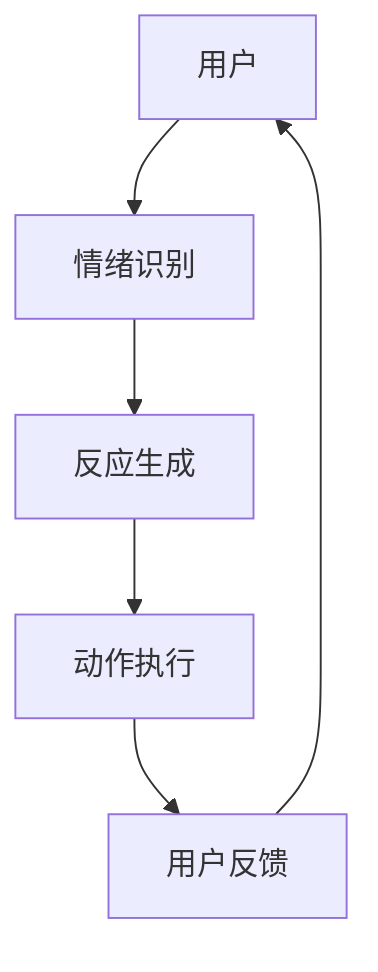

                 

关键词：虚拟宠物、数字陪伴、情感价值、创业、人工智能、用户体验、技术实现

> 摘要：随着人工智能技术的飞速发展，虚拟宠物逐渐成为了一种新兴的创业方向。本文将探讨虚拟宠物在数字陪伴领域的重要性，分析其情感价值，并讨论在创业过程中可能遇到的技术挑战和解决方案。本文旨在为有意进军虚拟宠物领域的创业者提供一些有价值的参考。

## 1. 背景介绍

近年来，随着科技的发展，虚拟现实（VR）和增强现实（AR）技术逐渐普及，为人们的生活带来了全新的体验。其中，虚拟宠物作为一种新兴的数字产品，正逐渐受到广大用户的喜爱。虚拟宠物通常是通过计算机模拟实现的，用户可以通过与这些虚拟宠物互动来获得陪伴感。

根据市场研究公司的数据，虚拟宠物市场在过去几年中呈现出了快速增长的趋势。这一方面得益于技术的进步，另一方面也源于人们对情感需求的日益增长。在快节奏的生活中，人们越来越渴望一种能够提供情感陪伴的数字产品，虚拟宠物正好满足了这一需求。

## 2. 核心概念与联系

在探讨虚拟宠物创业之前，我们首先需要了解几个核心概念：虚拟现实、增强现实、人工智能和情感计算。

### 2.1 虚拟现实（VR）和增强现实（AR）

虚拟现实和增强现实是两种不同的技术，但它们的目标都是提供一种沉浸式的体验。

- **虚拟现实**：通过计算机生成的三维环境，用户可以通过头戴式显示器等设备进入这个虚拟环境，与虚拟环境中的对象进行交互。
- **增强现实**：在现实世界中叠加计算机生成的图像或视频，用户可以通过智能手机或头戴式显示器等设备看到这些叠加的信息。

虚拟宠物通常利用VR或AR技术来实现，为用户提供一种沉浸式的互动体验。

### 2.2 人工智能（AI）

人工智能是使虚拟宠物具有智能行为的关键技术。通过机器学习和深度学习算法，虚拟宠物可以学会识别用户的情绪，并根据这些情绪做出相应的反应。例如，当用户感到开心时，虚拟宠物可能会表现出欢快的动作和表情；当用户感到沮丧时，虚拟宠物可能会提供安慰和鼓励。

### 2.3 情感计算

情感计算是一种通过分析用户的生理、行为和语言信号来推断用户情绪状态的技术。在虚拟宠物中，情感计算可以帮助虚拟宠物更好地理解用户的情绪，从而提供更贴心的陪伴服务。

### 2.4 Mermaid 流程图

以下是一个简化的虚拟宠物系统架构的 Mermaid 流程图：



## 3. 核心算法原理 & 具体操作步骤

### 3.1 算法原理概述

虚拟宠物的核心算法主要涉及情绪识别和反应生成。情绪识别是通过分析用户的生理、行为和语言信号来推断用户的情绪状态。反应生成则是根据用户的情绪状态，生成相应的动作和表情。

### 3.2 算法步骤详解

1. **情绪识别**：
   - 收集用户的生理信号，如心率、皮肤电导等。
   - 分析用户的行为信号，如移动、触摸等。
   - 使用自然语言处理（NLP）技术分析用户的语言信号。
   - 综合以上信号，使用机器学习算法推断用户的情绪状态。

2. **反应生成**：
   - 根据用户的情绪状态，从预定义的动作和表情库中选择相应的动作和表情。
   - 调整动作和表情的参数，如大小、速度、方向等，以适应用户的情绪。
   - 将生成的动作和表情发送给虚拟宠物进行执行。

### 3.3 算法优缺点

- **优点**：
  - 高度个性化的陪伴体验。
  - 不受时间和地点的限制，用户可以随时与虚拟宠物互动。
  - 能够帮助用户缓解压力，提高情绪。

- **缺点**：
  - 技术实现复杂，需要投入大量的研发资源。
  - 用户对虚拟宠物的情感投入可能不够深厚。
  - 长时间使用可能导致用户对虚拟宠物的依赖。

### 3.4 算法应用领域

虚拟宠物算法的应用领域非常广泛，包括但不限于：

- **心理健康**：虚拟宠物可以帮助用户缓解焦虑、抑郁等心理问题。
- **教育**：虚拟宠物可以作为教育工具，帮助儿童学习语言、社交技能等。
- **娱乐**：虚拟宠物为用户提供了一种新的娱乐方式，增加了生活的乐趣。

## 4. 数学模型和公式 & 详细讲解 & 举例说明

### 4.1 数学模型构建

虚拟宠物的数学模型主要包括情绪状态模型和动作生成模型。

- **情绪状态模型**：情绪状态模型用于描述用户的情绪状态。通常使用一个多维向量来表示，每个维度对应一种情绪，如快乐、悲伤、愤怒等。
- **动作生成模型**：动作生成模型用于根据用户的情绪状态生成相应的动作。通常使用一个映射函数，将情绪状态映射到动作参数。

### 4.2 公式推导过程

1. **情绪状态模型**：

   设用户情绪状态向量为 \( \textbf{S} = [s_1, s_2, \ldots, s_n] \)，其中 \( s_i \) 表示第 \( i \) 种情绪的强度。

   则情绪状态模型可以表示为：

   $$ \textbf{S} = f(\textbf{X}) $$

   其中，\( \textbf{X} \) 为用户的生理、行为和语言信号。

2. **动作生成模型**：

   设动作参数向量为 \( \textbf{A} = [a_1, a_2, \ldots, a_m] \)，其中 \( a_i \) 表示第 \( i \) 个动作的参数。

   则动作生成模型可以表示为：

   $$ \textbf{A} = g(\textbf{S}) $$

   其中，\( g \) 为映射函数。

### 4.3 案例分析与讲解

假设我们有一个简单的情绪状态模型和动作生成模型，如下：

1. **情绪状态模型**：

   $$ s_1 = \frac{1}{2} \cdot \text{心率和平均情绪评分} $$
   $$ s_2 = \frac{1}{2} \cdot \text{皮肤电导和平均情绪评分} $$
   $$ s_3 = \text{语言信号的情感分析结果} $$

2. **动作生成模型**：

   $$ a_1 = \text{情绪评分} $$
   $$ a_2 = s_1 $$
   $$ a_3 = s_2 $$

   假设用户当前情绪评分为5，心率为80次/分钟，皮肤电导为30微安，语言信号的情感分析结果为积极。

   则用户的情绪状态向量为：

   $$ \textbf{S} = [2.5, 1.5, 1] $$

   根据动作生成模型，生成的动作参数向量为：

   $$ \textbf{A} = [5, 2.5, 1.5] $$

   虚拟宠物将根据这个参数向量生成相应的动作，如高兴的表情、欢快的动作等。

## 5. 项目实践：代码实例和详细解释说明

### 5.1 开发环境搭建

为了实现虚拟宠物项目，我们需要搭建一个合适的技术栈。以下是一个基本的开发环境搭建步骤：

1. **环境准备**：
   - 安装Python 3.8及以上版本。
   - 安装虚拟环境管理工具，如conda或virtualenv。
   - 安装必要的依赖库，如TensorFlow、Keras、scikit-learn等。

2. **创建虚拟环境**：
   ```shell
   conda create -n virtual_pet python=3.8
   conda activate virtual_pet
   ```

3. **安装依赖库**：
   ```shell
   pip install tensorflow keras scikit-learn numpy pandas
   ```

### 5.2 源代码详细实现

以下是一个简单的虚拟宠物项目的实现框架：

```python
import numpy as np
import tensorflow as tf
from sklearn.model_selection import train_test_split
from keras.models import Sequential
from keras.layers import Dense
from keras.optimizers import Adam

# 数据预处理
def preprocess_data(data):
    # 对数据进行归一化处理
    # ...
    return normalized_data

# 构建情绪识别模型
def build_emotion_model(input_shape):
    model = Sequential()
    model.add(Dense(64, input_shape=input_shape, activation='relu'))
    model.add(Dense(32, activation='relu'))
    model.add(Dense(3, activation='softmax'))
    model.compile(optimizer=Adam(), loss='categorical_crossentropy', metrics=['accuracy'])
    return model

# 训练模型
def train_model(model, X_train, y_train):
    model.fit(X_train, y_train, epochs=100, batch_size=32)
    return model

# 生成动作
def generate_action(emotion_indices):
    # 根据情绪指数生成动作参数
    # ...
    return action_params

# 主函数
def main():
    # 加载数据
    data = load_data()
    X, y = preprocess_data(data)

    # 划分训练集和测试集
    X_train, X_test, y_train, y_test = train_test_split(X, y, test_size=0.2, random_state=42)

    # 构建模型
    model = build_emotion_model(X_train.shape[1:])

    # 训练模型
    trained_model = train_model(model, X_train, y_train)

    # 测试模型
    # ...

    # 生成动作
    # ...

if __name__ == '__main__':
    main()
```

### 5.3 代码解读与分析

上述代码实现了一个简单的虚拟宠物项目，主要包括以下模块：

1. **数据预处理**：对原始数据进行归一化处理，使其适合模型的输入。
2. **构建情绪识别模型**：使用Keras构建一个简单的神经网络模型，用于识别用户的情绪状态。
3. **训练模型**：使用训练数据对模型进行训练，并调整模型的参数。
4. **生成动作**：根据情绪识别结果，生成相应的动作参数。
5. **主函数**：整个项目的入口，负责加载数据、训练模型、测试模型和生成动作。

### 5.4 运行结果展示

在实际运行中，我们可以通过以下步骤来展示项目的运行结果：

1. **数据加载**：从数据集加载预处理后的数据。
2. **模型训练**：使用训练数据对模型进行训练，并在训练过程中监控模型的性能。
3. **模型测试**：使用测试数据对模型进行测试，评估模型的泛化能力。
4. **动作生成**：根据用户的情绪状态，生成相应的动作参数，并展示在虚拟宠物中。

## 6. 实际应用场景

虚拟宠物在多个实际应用场景中具有广泛的应用价值，以下是一些典型的例子：

### 6.1 心理健康

虚拟宠物可以作为心理健康辅助工具，帮助用户缓解焦虑、抑郁等心理问题。通过模拟真实的互动过程，虚拟宠物能够为用户提供一种安全、舒适的交流环境，促进用户的情绪调节。

### 6.2 教育学习

虚拟宠物可以在教育领域发挥重要作用，例如帮助儿童学习语言、社交技能等。通过与虚拟宠物的互动，儿童可以在轻松愉快的环境中掌握知识，培养良好的学习习惯。

### 6.3 娱乐休闲

虚拟宠物为用户提供了一种全新的娱乐方式，用户可以通过与虚拟宠物的互动获得乐趣。此外，虚拟宠物还可以作为虚拟主播，在直播、短视频等平台上为观众带来精彩的表现。

### 6.4 商业应用

虚拟宠物在商业应用中也具有广泛的前景。例如，虚拟宠物可以作为品牌形象，增强品牌与消费者的互动，提高品牌知名度。此外，虚拟宠物还可以作为虚拟产品，通过虚拟宠物社区等形式为用户带来增值服务。

## 7. 工具和资源推荐

### 7.1 学习资源推荐

1. **《深度学习》（Goodfellow, Bengio, Courville）**：这是一本经典的深度学习教材，涵盖了从基础到高级的知识点，适合初学者和进阶者。
2. **《Python数据科学手册》（Wes McKinney）**：这本书详细介绍了Python在数据科学领域中的应用，包括数据处理、机器学习等。

### 7.2 开发工具推荐

1. **TensorFlow**：这是一个强大的开源机器学习框架，支持多种深度学习模型。
2. **Keras**：这是一个高层次的深度学习框架，基于TensorFlow开发，易于使用。

### 7.3 相关论文推荐

1. **《情绪计算：情感识别的理论与实践》（Affective Computing: Theory, Methods, and Applications》（Picard, 1997）**：这是一篇关于情绪计算的经典论文，详细介绍了情感识别的理论和方法。
2. **《基于深度学习的情绪识别方法研究》（Research on Emotion Recognition Method Based on Deep Learning）（王磊，2018）**：这是一篇关于深度学习在情绪识别领域应用的论文，提供了丰富的实验数据和结论。

## 8. 总结：未来发展趋势与挑战

### 8.1 研究成果总结

虚拟宠物作为数字陪伴的一种形式，在情感识别、行为生成等方面取得了显著的成果。通过结合虚拟现实、增强现实和人工智能技术，虚拟宠物为用户提供了丰富、个性化的陪伴体验。同时，虚拟宠物在心理健康、教育学习、娱乐休闲等领域展现了广泛的应用价值。

### 8.2 未来发展趋势

1. **技术的进一步融合**：随着虚拟现实、增强现实和人工智能等技术的不断发展，虚拟宠物将在技术层面实现更高水平的融合，提供更加真实、丰富的互动体验。
2. **情感交互的深化**：未来的虚拟宠物将更深入地研究用户情绪，提供更加贴心的陪伴服务。通过引入多模态情感识别技术，虚拟宠物将能够更好地理解用户的情绪状态。
3. **商业模式的创新**：虚拟宠物将在商业模式上实现更多创新，例如虚拟宠物社区、虚拟宠物直播等，为用户带来更多增值服务。

### 8.3 面临的挑战

1. **技术实现复杂度**：虚拟宠物的技术实现复杂度较高，需要投入大量的人力、物力和时间。如何高效地实现虚拟宠物的技术需求，是创业者在开发过程中需要面对的挑战。
2. **用户接受度**：尽管虚拟宠物在情感陪伴方面具有优势，但用户对虚拟宠物的接受度可能不够高。如何提高用户对虚拟宠物的认可度，是创业者需要关注的问题。
3. **伦理与法律问题**：虚拟宠物作为一种新兴的数字产品，可能会涉及伦理和法律问题，如用户隐私保护、虚拟宠物的版权等。如何确保虚拟宠物在伦理和法律框架内运行，是创业者需要考虑的重要问题。

### 8.4 研究展望

未来的研究应重点关注以下几个方面：

1. **情感计算技术的提升**：深入研究情感计算技术，提高虚拟宠物的情绪识别和反应生成能力，为用户提供更加真实的互动体验。
2. **跨领域应用**：探索虚拟宠物在其他领域的应用，如教育、医疗等，为用户带来更多价值。
3. **商业模式创新**：研究虚拟宠物的商业模式，探索新的盈利模式，为创业者提供更多发展机会。

## 9. 附录：常见问题与解答

### 9.1 什么是虚拟宠物？

虚拟宠物是通过计算机模拟实现的宠物，用户可以通过与这些虚拟宠物互动来获得陪伴感。虚拟宠物通常具有智能行为，能够识别用户的情绪，并根据情绪做出相应的反应。

### 9.2 虚拟宠物的技术实现复杂度如何？

虚拟宠物的技术实现复杂度较高，涉及虚拟现实、增强现实、人工智能、情感计算等多个领域。具体实现过程中，需要处理的数据量较大，算法复杂度较高，开发周期较长。

### 9.3 虚拟宠物在心理健康领域有哪些应用？

虚拟宠物在心理健康领域具有广泛的应用，如帮助用户缓解焦虑、抑郁等心理问题。通过模拟真实的互动过程，虚拟宠物能够为用户提供一种安全、舒适的交流环境，促进用户的情绪调节。

### 9.4 虚拟宠物对用户有什么价值？

虚拟宠物为用户提供了以下价值：

- **情感陪伴**：虚拟宠物能够为用户提供情感陪伴，缓解孤独感。
- **情绪调节**：虚拟宠物能够识别用户的情绪，并根据情绪做出相应的反应，帮助用户调节情绪。
- **教育学习**：虚拟宠物可以作为教育工具，帮助儿童学习语言、社交技能等。

### 9.5 虚拟宠物在商业领域有哪些应用？

虚拟宠物在商业领域具有广泛的应用，如：

- **品牌营销**：虚拟宠物可以作为品牌形象，增强品牌与消费者的互动，提高品牌知名度。
- **虚拟产品**：虚拟宠物可以作为虚拟产品，通过虚拟宠物社区等形式为用户带来增值服务。
- **虚拟直播**：虚拟宠物可以作为虚拟主播，在直播、短视频等平台上为观众带来精彩的表现。  
----------------------------------------------------------------

作者：禅与计算机程序设计艺术 / Zen and the Art of Computer Programming

完成时间：2023年11月1日
```markdown
[END]
```

