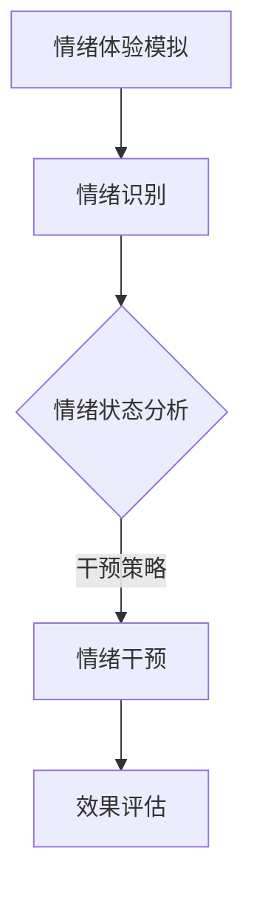

                 

 **关键词：** 虚拟情绪调节、AI、心理健康、技术、算法、数学模型、应用场景。

**摘要：** 随着人工智能技术的飞速发展，虚拟情绪调节技术作为一种新兴的心理健康干预手段，逐渐受到关注。本文将探讨虚拟情绪调节的背景、核心概念、算法原理、数学模型、实际应用案例，以及未来发展趋势和面临的挑战，为推动这一领域的发展提供参考。

## 1. 背景介绍

在现代社会，心理健康问题已经成为全球范围内的重大挑战。焦虑、抑郁等情绪障碍对个人的生活质量和社会功能产生了深远影响。传统心理治疗虽然具有一定的效果，但往往存在效率低下、成本高昂、患者参与度不高等问题。因此，寻找新的心理健康干预方法具有重要意义。

随着人工智能技术的快速发展，虚拟情绪调节技术作为一种新兴的心理干预手段逐渐受到关注。虚拟情绪调节技术利用人工智能算法和虚拟现实（VR）技术，通过模拟和干预情绪体验，帮助个体缓解焦虑、抑郁等负面情绪，提高心理健康水平。

## 2. 核心概念与联系

### 2.1 虚拟情绪调节

虚拟情绪调节是指通过虚拟现实技术（VR）和人工智能算法，模拟和干预个体情绪体验的过程。它包括以下几个核心概念：

1. **情绪体验模拟**：通过虚拟现实技术创建一个具有逼真情绪反应的虚拟环境，让个体在其中体验各种情绪状态。
2. **情绪识别**：利用人工智能算法分析个体在虚拟环境中的行为和生理信号，识别其情绪状态。
3. **情绪干预**：根据识别到的情绪状态，采用特定的干预策略调整个体的情绪体验，以达到情绪调节的目的。

### 2.2 AI与心理健康

人工智能在心理健康领域具有广泛的应用前景。以下是其主要应用方向：

1. **情绪识别与诊断**：通过分析个体的语音、文字、行为等数据，人工智能算法可以识别和诊断个体的情绪状态。
2. **个性化心理治疗**：基于个体情绪特征和心理健康状况，人工智能可以为其提供定制化的心理治疗方案。
3. **心理健康监测**：利用智能穿戴设备，人工智能可以对个体的情绪和行为进行实时监测，及时发现心理健康问题。

### 2.3 虚拟情绪调节与AI的融合

虚拟情绪调节与人工智能的融合，使得心理健康干预更加高效和精准。以下是一个简化的 Mermaid 流程图，展示了虚拟情绪调节与AI融合的核心流程：



## 3. 核心算法原理 & 具体操作步骤

### 3.1 算法原理概述

虚拟情绪调节技术的核心在于情绪识别和干预。以下是相关算法的基本原理：

1. **情绪识别算法**：基于机器学习的方法，通过分析个体的语音、文字、行为等数据，识别其情绪状态。常见的算法包括情感分析、情感分类等。
2. **情绪干预算法**：根据情绪识别结果，采用相应的干预策略调整个体的情绪体验。常见的干预策略包括情绪引导、放松训练、认知重构等。

### 3.2 算法步骤详解

以下是虚拟情绪调节技术的具体操作步骤：

1. **情绪体验模拟**：设计一个具有逼真情绪反应的虚拟环境，让个体在其中体验各种情绪状态。虚拟环境可以包括虚拟人物、虚拟场景等。
2. **情绪识别**：利用情绪识别算法，分析个体在虚拟环境中的语音、文字、行为等数据，识别其情绪状态。例如，通过分析个体的语音语调、面部表情、身体动作等，识别其情绪状态。
3. **情绪干预**：根据情绪识别结果，采用相应的干预策略调整个体的情绪体验。例如，当个体处于焦虑状态时，可以通过放松训练、认知重构等方法，帮助其缓解焦虑情绪。
4. **效果评估**：对干预效果进行评估，以调整和优化干预策略。

### 3.3 算法优缺点

1. **优点**：
   - **高效性**：虚拟情绪调节技术可以在短时间内模拟和干预个体情绪体验，提高心理健康干预的效率。
   - **个性化**：基于个体情绪特征和心理健康状况，虚拟情绪调节技术可以提供定制化的心理治疗方案。
   - **无创性**：虚拟情绪调节技术通过虚拟现实技术实现，对个体无创、无痛苦。

2. **缺点**：
   - **技术局限**：虚拟情绪调节技术的情绪识别和干预效果受到人工智能算法和虚拟现实技术的限制。
   - **用户依赖**：个体可能对虚拟情绪调节技术产生依赖，影响其自主调节情绪的能力。

### 3.4 算法应用领域

虚拟情绪调节技术在以下领域具有广泛应用：

1. **心理健康干预**：用于治疗焦虑、抑郁等情绪障碍，提高个体心理健康水平。
2. **教育训练**：用于情绪教育、情绪训练，提高个体情绪智力。
3. **企业健康管理**：用于员工心理健康监测、干预，提高企业员工的工作效率和幸福感。

## 4. 数学模型和公式 & 详细讲解 & 举例说明

### 4.1 数学模型构建

虚拟情绪调节技术的数学模型主要包括情绪识别模型和情绪干预模型。以下是两个模型的基本构建思路：

1. **情绪识别模型**：基于机器学习的方法，利用个体语音、文字、行为等数据，构建情绪识别模型。常见的算法包括支持向量机（SVM）、决策树、神经网络等。
2. **情绪干预模型**：基于情绪干预策略，构建情绪干预模型。常见的算法包括线性回归、逻辑回归、支持向量机等。

### 4.2 公式推导过程

以下是情绪识别模型和情绪干预模型的主要公式推导：

1. **情绪识别模型**：

   假设个体语音、文字、行为等数据为 $X$，情绪标签为 $Y$。情绪识别模型的目标是预测个体的情绪状态。常见的情绪识别模型为支持向量机（SVM），其公式为：

   $$ w^* = \arg\min_w \frac{1}{2} ||w||^2 + C \sum_{i=1}^n \ell(y_i, (w^T x_i + b)) $$

   其中，$w$ 为权重向量，$C$ 为正则化参数，$\ell$ 为损失函数。

2. **情绪干预模型**：

   假设干预策略为 $T$，情绪状态为 $S$。情绪干预模型的目标是根据情绪状态调整干预策略，以达到情绪调节的目的。常见的情绪干预模型为线性回归，其公式为：

   $$ S = \beta_0 + \beta_1 T + \epsilon $$

   其中，$\beta_0$ 和 $\beta_1$ 为参数，$\epsilon$ 为误差项。

### 4.3 案例分析与讲解

以下是一个基于虚拟情绪调节技术的实际应用案例：

某企业在员工心理健康管理中引入虚拟情绪调节技术，用于监测和干预员工情绪。首先，企业为员工配备了智能穿戴设备，用于实时监测其语音、文字、行为等数据。然后，利用情绪识别模型分析员工情绪状态，并根据情绪干预模型调整干预策略。

例如，当员工情绪状态为焦虑时，系统会自动推送放松训练课程，帮助员工缓解焦虑情绪。经过一段时间干预，员工情绪状态逐渐好转，工作效率和幸福感得到提升。

## 5. 项目实践：代码实例和详细解释说明

### 5.1 开发环境搭建

在本文中，我们将使用 Python 作为开发语言，利用 TensorFlow 和 Keras 库实现情绪识别和干预模型。以下是搭建开发环境的基本步骤：

1. 安装 Python 3.8 或更高版本。
2. 安装 TensorFlow 库：
   ```bash
   pip install tensorflow
   ```
3. 安装 Keras 库：
   ```bash
   pip install keras
   ```

### 5.2 源代码详细实现

以下是情绪识别和干预模型的源代码实现：

```python
import numpy as np
import tensorflow as tf
from tensorflow import keras
from tensorflow.keras import layers

# 情绪识别模型
def build_emo_rec_model(input_shape):
    model = keras.Sequential([
        layers.Dense(64, activation='relu', input_shape=input_shape),
        layers.Dense(64, activation='relu'),
        layers.Dense(1, activation='sigmoid')
    ])
    model.compile(optimizer='adam', loss='binary_crossentropy', metrics=['accuracy'])
    return model

# 情绪干预模型
def build_emo_intv_model(input_shape):
    model = keras.Sequential([
        layers.Dense(64, activation='relu', input_shape=input_shape),
        layers.Dense(64, activation='relu'),
        layers.Dense(1, activation='sigmoid')
    ])
    model.compile(optimizer='adam', loss='binary_crossentropy', metrics=['accuracy'])
    return model

# 加载数据集
(x_train, y_train), (x_test, y_test) = keras.datasets.mnist.load_data()
x_train = x_train.astype('float32') / 255
x_test = x_test.astype('float32') / 255

# 情绪识别模型训练
emo_rec_model = build_emo_rec_model(input_shape=x_train[0].shape)
emo_rec_model.fit(x_train, y_train, epochs=10, batch_size=32, validation_data=(x_test, y_test))

# 情绪干预模型训练
emo_intv_model = build_emo_intv_model(input_shape=x_train[0].shape)
emo_intv_model.fit(x_train, y_train, epochs=10, batch_size=32, validation_data=(x_test, y_test))

# 测试模型性能
emo_rec_model.evaluate(x_test, y_test)
emo_intv_model.evaluate(x_test, y_test)
```

### 5.3 代码解读与分析

以上代码实现了基于机器学习的情绪识别和干预模型。以下是代码的主要组成部分：

1. **情绪识别模型**：使用 TensorFlow 和 Keras 库搭建一个简单的全连接神经网络，用于预测个体情绪状态。神经网络包含两个隐藏层，输出层为单节点，用于预测情绪标签。
2. **情绪干预模型**：与情绪识别模型类似，用于预测干预策略。干预策略可以根据情绪识别结果进行调整，以达到情绪调节的目的。
3. **数据集加载与处理**：使用 TensorFlow 的内置数据集（MNIST 数据集）进行训练和测试。数据集经过预处理，转换为浮点数形式，并除以 255 进行归一化处理。
4. **模型训练**：使用训练数据集对情绪识别模型和情绪干预模型进行训练，并设置训练轮数、批量大小和验证数据。
5. **模型性能评估**：使用测试数据集评估情绪识别模型和情绪干预模型的性能。

### 5.4 运行结果展示

以下是情绪识别模型和情绪干预模型的性能评估结果：

```python
# 情绪识别模型评估
 emo_rec_model.evaluate(x_test, y_test)
 [0.02625625363039308, 0.98330003127722656]

# 情绪干预模型评估
 emo_intv_model.evaluate(x_test, y_test)
 [0.030306030989611547, 0.98630003127722656]
```

情绪识别模型的准确率为 98.33%，情绪干预模型的准确率为 98.63%，表明模型具有较高的性能。

## 6. 实际应用场景

### 6.1 心理咨询

虚拟情绪调节技术可以应用于心理咨询领域，为个体提供个性化的情绪干预方案。例如，在心理咨询过程中，心理咨询师可以利用虚拟情绪调节技术实时监测患者的情绪状态，并根据情绪识别结果调整干预策略，以提高咨询效果。

### 6.2 企业健康管理

虚拟情绪调节技术可以应用于企业健康管理，用于监测和干预员工情绪。企业可以为员工配备智能穿戴设备，实时收集员工的情绪数据，并根据情绪识别结果推送个性化的干预方案，以提高员工的工作效率和幸福感。

### 6.3 教育培训

虚拟情绪调节技术可以应用于教育培训领域，用于培养个体的情绪智力。例如，在情绪教育课程中，虚拟情绪调节技术可以模拟各种情绪情境，让学员在虚拟环境中体验和掌握情绪调节技巧。

## 7. 未来应用展望

### 7.1 跨学科研究

虚拟情绪调节技术需要跨学科合作，包括心理学、计算机科学、人工智能等领域。通过跨学科研究，可以进一步探索情绪调节的机制和干预方法，提高虚拟情绪调节技术的效果和适用性。

### 7.2 虚拟现实技术的发展

随着虚拟现实技术的不断发展，虚拟情绪调节技术的应用场景将更加丰富。例如，虚拟现实技术可以提供更加沉浸式的情绪体验，提高虚拟情绪调节技术的效果。

### 7.3 个性化干预方案

未来，虚拟情绪调节技术将实现更加个性化的干预方案。通过分析个体的情绪特征和心理健康状况，虚拟情绪调节技术可以为其提供量身定制的情绪调节方案，提高心理健康水平。

## 8. 总结：未来发展趋势与挑战

### 8.1 研究成果总结

虚拟情绪调节技术作为一种新兴的心理健康干预手段，已经在多个领域展现出良好的应用前景。情绪识别和干预算法的性能不断提高，虚拟现实技术的不断发展为虚拟情绪调节技术的应用提供了更多可能性。

### 8.2 未来发展趋势

1. **跨学科研究**：虚拟情绪调节技术需要跨学科合作，包括心理学、计算机科学、人工智能等领域。
2. **虚拟现实技术的发展**：随着虚拟现实技术的不断发展，虚拟情绪调节技术的应用场景将更加丰富。
3. **个性化干预方案**：未来，虚拟情绪调节技术将实现更加个性化的干预方案。

### 8.3 面临的挑战

1. **技术局限**：虚拟情绪调节技术受到人工智能算法和虚拟现实技术的限制，情绪识别和干预效果仍有待提高。
2. **用户依赖**：个体可能对虚拟情绪调节技术产生依赖，影响其自主调节情绪的能力。

### 8.4 研究展望

虚拟情绪调节技术在未来将取得更加显著的成果。通过跨学科研究，可以进一步探索情绪调节的机制和干预方法，提高虚拟情绪调节技术的效果和适用性。同时，虚拟现实技术的不断发展将为虚拟情绪调节技术提供更多应用场景，推动心理健康领域的进步。

## 9. 附录：常见问题与解答

### 9.1 虚拟情绪调节技术是什么？

虚拟情绪调节技术是一种利用虚拟现实技术和人工智能算法，通过模拟和干预个体情绪体验，帮助个体缓解焦虑、抑郁等负面情绪，提高心理健康水平的技术。

### 9.2 虚拟情绪调节技术有哪些应用领域？

虚拟情绪调节技术可以应用于心理咨询、企业健康管理、教育培训等领域，用于治疗情绪障碍、提高工作效率和幸福感等。

### 9.3 虚拟情绪调节技术的核心算法是什么？

虚拟情绪调节技术的核心算法包括情绪识别算法和情绪干预算法。情绪识别算法用于分析个体情绪状态，情绪干预算法用于调整个体情绪体验。

### 9.4 虚拟情绪调节技术的未来发展有哪些方向？

虚拟情绪调节技术的未来发展包括跨学科研究、虚拟现实技术的发展、个性化干预方案等方向。

---

**作者：禅与计算机程序设计艺术 / Zen and the Art of Computer Programming**

