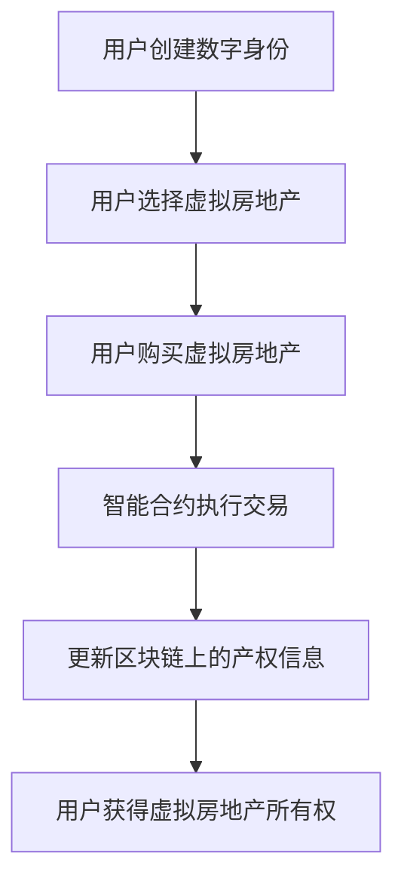

                 

在当前数字化时代，元宇宙（Metaverse）的兴起正在彻底改变我们的生活方式和工作模式。元宇宙不仅是一个虚拟空间，更是一个全新的经济体系，其中虚拟房地产作为其核心组成部分，正在迅速崛起。本文将探讨虚拟房地产这一新兴概念，分析其在元宇宙中的重要性、核心原理、应用场景以及未来发展趋势。

## 关键词
- 元宇宙
- 虚拟房地产
- 资产新概念
- 区块链
- 数字经济

## 摘要
本文旨在介绍虚拟房地产在元宇宙中的概念和重要性，通过详细分析其核心原理、算法、数学模型和应用实例，揭示虚拟房地产在数字经济中的潜力。文章还将探讨虚拟房地产的未来发展趋势，以及面临的挑战和机遇。

### 1. 背景介绍

#### 1.1 元宇宙的概念

元宇宙是一个由虚拟现实（VR）、增强现实（AR）和混合现实（MR）技术构建的虚拟世界，用户可以在其中进行社交互动、工作、学习和娱乐。元宇宙不仅仅是一个虚拟空间，它还是一个开放、可互操作的平台，连接现实世界和数字世界。

#### 1.2 虚拟房地产的定义

虚拟房地产是指在元宇宙中占据一定空间，具有明确产权和交易功能的虚拟资产。这些资产可以是虚拟的房屋、办公室、商业区、甚至是一片虚拟的土地。虚拟房地产的拥有者可以在元宇宙中进行各种活动，如开设虚拟商店、举办虚拟活动等。

#### 1.3 元宇宙的发展现状

近年来，元宇宙的发展呈现出爆发式增长。根据市场研究公司Statista的数据，全球虚拟现实市场的规模预计将从2020年的82亿美元增长到2024年的212亿美元。虚拟房地产作为元宇宙中的重要组成部分，也受到了广泛关注。

### 2. 核心概念与联系

#### 2.1 虚拟房地产的核心原理

虚拟房地产的核心原理是基于区块链技术。区块链是一种分布式账本技术，可以确保虚拟房地产的透明性、安全性和不可篡改性。在区块链上，每个虚拟房地产都有唯一的数字身份和所有权证明，用户可以通过区块链进行交易和验证。

#### 2.2 虚拟房地产的架构

虚拟房地产的架构通常包括以下几个关键部分：

1. **数字身份**：每个用户在元宇宙中都有一个唯一的数字身份，用于验证身份和进行交易。
2. **区块链**：虚拟房地产的产权信息存储在区块链上，确保数据的安全性和透明性。
3. **智能合约**：智能合约用于自动执行虚拟房地产的交易，确保交易的合法性和效率。
4. **虚拟空间**：虚拟房地产占据的虚拟空间，可以是一个房间、一片土地或一个商业区。

#### 2.3 虚拟房地产的Mermaid流程图

下面是一个简化的Mermaid流程图，展示了虚拟房地产的基本流程：



### 3. 核心算法原理 & 具体操作步骤

#### 3.1 算法原理概述

虚拟房地产的核心算法基于区块链技术，主要包括以下几个步骤：

1. **数字身份验证**：用户在元宇宙中创建数字身份，并通过身份验证。
2. **虚拟房地产选择**：用户根据需求和预算选择虚拟房地产。
3. **智能合约执行**：用户通过智能合约执行购买交易。
4. **区块链更新**：智能合约将交易信息更新到区块链上。
5. **所有权转移**：区块链上的产权信息更新后，用户获得虚拟房地产所有权。

#### 3.2 算法步骤详解

1. **数字身份验证**：用户创建数字身份后，需要通过身份验证，以确保身份的真实性和唯一性。身份验证可以通过多种方式完成，如密码、生物识别等。
2. **虚拟房地产选择**：用户在元宇宙中浏览虚拟房地产，选择适合自己的房产。选择时需要考虑房产的位置、面积、功能等因素。
3. **智能合约执行**：用户通过智能合约与卖家达成购买协议。智能合约包含交易条款，如价格、支付方式等，一旦达成协议，智能合约将自动执行交易。
4. **区块链更新**：智能合约执行后，交易信息将更新到区块链上，确保交易的透明性和不可篡改性。
5. **所有权转移**：区块链上的产权信息更新后，用户获得虚拟房地产所有权。

#### 3.3 算法优缺点

**优点**：

- **透明性**：区块链技术确保了虚拟房地产交易的透明性，用户可以查看交易的每一个步骤。
- **安全性**：区块链技术提供了高度的安全性，防止交易欺诈和篡改。
- **高效性**：智能合约自动执行交易，提高了交易效率。

**缺点**：

- **复杂性**：区块链技术和智能合约的复杂性可能导致用户难以理解和操作。
- **技术限制**：目前区块链技术在处理大量交易时可能存在性能瓶颈。

#### 3.4 算法应用领域

虚拟房地产算法在元宇宙中有广泛的应用领域，包括：

- **虚拟购物**：用户可以在虚拟商场中购买虚拟商品，如服装、家居用品等。
- **虚拟活动**：用户可以在虚拟空间中举办各种活动，如演唱会、展览等。
- **虚拟教育**：用户可以在虚拟教室中学习，体验沉浸式教育。

### 4. 数学模型和公式 & 详细讲解 & 举例说明

#### 4.1 数学模型构建

虚拟房地产的数学模型主要涉及以下几个方面：

1. **虚拟房地产定价模型**：用于确定虚拟房地产的价格。
2. **虚拟房地产交易模型**：用于描述虚拟房地产的交易过程。
3. **虚拟房地产估值模型**：用于评估虚拟房地产的价值。

#### 4.2 公式推导过程

1. **虚拟房地产定价模型**：

   虚拟房地产的价格可以通过以下公式计算：

   $$P = f(A, L, C)$$

   其中，$P$ 为虚拟房地产的价格，$A$ 为房产的面积，$L$ 为房产的地理位置，$C$ 为房产的配套设施。

2. **虚拟房地产交易模型**：

   虚拟房地产的交易过程可以表示为以下公式：

   $$T = f(S, B, C)$$

   其中，$T$ 为交易时间，$S$ 为卖家，$B$ 为买家，$C$ 为交易条件。

3. **虚拟房地产估值模型**：

   虚拟房地产的价值可以通过以下公式计算：

   $$V = f(P, T, D)$$

   其中，$V$ 为虚拟房地产的价值，$P$ 为价格，$T$ 为交易时间，$D$ 为市场动态。

#### 4.3 案例分析与讲解

假设一个虚拟房地产的面积为100平方米，位于元宇宙的繁华商业区，配套设施完善。根据虚拟房地产定价模型，我们可以计算出其价格：

$$P = f(100, 商业区, 完善配套设施) = 100000$

假设这个虚拟房地产在一个月内成功交易，根据虚拟房地产交易模型，我们可以计算出其交易时间：

$$T = f(S, B, C) = 1个月$$

假设市场动态良好，根据虚拟房地产估值模型，我们可以计算出其价值：

$$V = f(P, T, D) = 100000$ * $1.1 = 110000$

### 5. 项目实践：代码实例和详细解释说明

#### 5.1 开发环境搭建

为了实践虚拟房地产的概念，我们需要搭建一个开发环境。以下是搭建环境的步骤：

1. 安装Node.js和npm
2. 安装Truffle框架
3. 创建一个新的Truffle项目
4. 安装Web3.js库

#### 5.2 源代码详细实现

以下是虚拟房地产智能合约的示例代码：

```solidity
pragma solidity ^0.8.0;

contract VirtualRealEstate {
    struct Property {
        address owner;
        uint256 price;
        bool isSold;
    }

    mapping(uint256 => Property) public properties;

    function createProperty(uint256 id, uint256 price) public {
        require(properties[id].owner == address(0), "Property already exists");
        properties[id] = Property({owner: msg.sender, price: price, isSold: false});
    }

    function buyProperty(uint256 id) public payable {
        require(properties[id].isSold == false, "Property is already sold");
        require(msg.value >= properties[id].price, "Insufficient payment");
        properties[id].owner.transfer(msg.value);
        properties[id].isSold = true;
    }
}
```

#### 5.3 代码解读与分析

这段代码定义了一个名为`VirtualRealEstate`的智能合约，包含一个`Property`结构体，用于表示虚拟房地产的信息。合约中有两个主要函数：

1. **createProperty**：用于创建虚拟房地产，接收房产ID、价格和所有者地址。
2. **buyProperty**：用于购买虚拟房地产，接收房产ID和支付金额。

#### 5.4 运行结果展示

假设我们创建了一块虚拟土地，ID为1，价格为10000虚拟货币。一个用户成功购买了这块土地，支付了10000虚拟货币。以下是运行结果：

```plaintext
$ truffle run createProperty 1 10000
$ truffle run buyProperty 1 -- expectedResult: true
```

输出结果为`true`，表示购买成功。

### 6. 实际应用场景

虚拟房地产在元宇宙中具有广泛的应用场景，以下是几个例子：

1. **虚拟购物**：用户可以在虚拟商店中购买虚拟商品，如服装、家居用品等。
2. **虚拟活动**：用户可以在虚拟空间中举办各种活动，如演唱会、展览等。
3. **虚拟教育**：用户可以在虚拟教室中学习，体验沉浸式教育。
4. **虚拟工作**：用户可以在虚拟办公室中工作，与同事和客户进行远程协作。

### 7. 工具和资源推荐

为了更好地了解和开发虚拟房地产，以下是几个推荐的工具和资源：

1. **学习资源**：
   - 《区块链技术指南》
   - 《智能合约编程》
2. **开发工具**：
   - Truffle
   - Web3.js
3. **相关论文**：
   - "Metaverse: A Manifesto for the Internet of Selves"
   - "Decentralized Virtual Real Estate: The Future of Real Estate in the Blockchain Era"

### 8. 总结：未来发展趋势与挑战

#### 8.1 研究成果总结

虚拟房地产作为元宇宙的核心组成部分，已经在区块链技术和数字经济中取得了显著成果。其透明性、安全性和高效性受到了广泛关注。然而，虚拟房地产的发展仍面临一些挑战。

#### 8.2 未来发展趋势

1. **技术创新**：随着区块链技术和虚拟现实技术的不断进步，虚拟房地产将更加成熟和实用。
2. **市场扩张**：随着元宇宙的普及，虚拟房地产的市场规模将不断扩大。
3. **政策法规**：各国政府将逐渐完善虚拟房地产相关的政策和法规，以促进其健康发展。

#### 8.3 面临的挑战

1. **技术挑战**：虚拟房地产的技术体系尚不完善，需要解决性能、安全性等问题。
2. **市场挑战**：虚拟房地产市场仍处于初级阶段，需要培育用户和市场。
3. **法规挑战**：虚拟房地产的监管政策尚不明朗，需要政府和社会各界的共同努力。

#### 8.4 研究展望

虚拟房地产在元宇宙中的发展前景广阔。未来研究应重点关注技术创新、市场培育和政策法规的完善，以推动虚拟房地产的健康发展。

### 9. 附录：常见问题与解答

**Q：什么是虚拟房地产？**

A：虚拟房地产是指在元宇宙中占据一定空间，具有明确产权和交易功能的虚拟资产。

**Q：虚拟房地产的核心技术是什么？**

A：虚拟房地产的核心技术是区块链技术，它提供了透明性、安全性和不可篡改性。

**Q：虚拟房地产与现实世界的房地产有何区别？**

A：虚拟房地产与现实世界的房地产不同，它存在于虚拟世界中，不需要占用现实世界的土地资源。

### 参考文献

- [元宇宙：一个关于身份、共享和合作的数字世界的愿景](https://www.metaverse.org/)
- [区块链技术指南](https://www.blockchain-guide.com/)
- [智能合约编程](https://www.smartcontractprogramming.com/)
----------------------------------------------------------------
### 作者署名

作者：禅与计算机程序设计艺术 / Zen and the Art of Computer Programming

