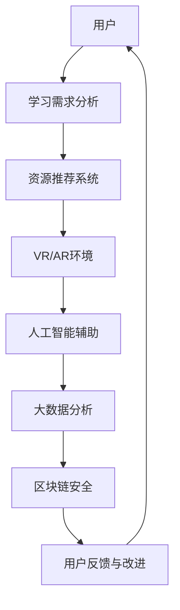

                 

关键词：虚拟教育、全球脑时代、学习新方式、技术进步、教育改革、人工智能

> 摘要：随着全球脑时代的到来，虚拟教育作为一种全新的学习方式，正逐渐改变着传统教育的面貌。本文将探讨虚拟教育的核心概念、技术原理、算法模型以及实际应用，为未来教育的发展提供新的视角和路径。

## 1. 背景介绍

随着信息技术的飞速发展，尤其是人工智能和虚拟现实技术的日益成熟，教育领域正经历着深刻的变革。传统教育模式在面对个性化、多样化、全球化等教育需求时，显得力不从心。虚拟教育作为一种创新的解决方案，正在全球范围内迅速崛起。

虚拟教育，顾名思义，是一种通过虚拟技术实现的教学方式。它利用计算机模拟、虚拟现实、人工智能等技术，为学生提供沉浸式、互动性、个性化的学习体验。这种新型教育模式不仅突破了时空限制，更能够根据学生的学习习惯和特点，提供量身定制的学习内容。

### 1.1 全球脑时代的背景

全球脑时代是指人类在信息技术、生物技术、人工智能等领域的突破，使得人类大脑的潜力得到前所未有的发挥。在这个时代，知识的更新速度异常迅猛，对教育的要求也发生了翻天覆地的变化。

首先，知识的爆炸性增长使得学生需要获取和处理的信息量大大增加。传统的教育模式已经无法满足这种需求，而虚拟教育则可以通过大数据分析和智能推荐，为学生提供精准的学习资源。

其次，全球脑时代强调创新能力和实践能力。学生不仅需要掌握理论知识，更需要具备解决实际问题的能力。虚拟教育通过模拟真实场景，让学生在虚拟世界中锻炼实践能力，提高创新思维。

最后，全球脑时代强调个性化和定制化。每个学生的学习方式、兴趣和需求都不同，传统的教育模式很难做到因材施教。而虚拟教育通过个性化推荐和自适应学习系统，能够实现真正的个性化教育。

### 1.2 虚拟教育的兴起

虚拟教育的兴起并非偶然，而是全球脑时代发展的必然结果。以下是一些推动虚拟教育发展的关键因素：

1. **技术的进步**：计算机技术、人工智能和虚拟现实技术的不断进步，为虚拟教育提供了强大的技术支持。这些技术的成熟，使得虚拟教育从概念走向实践成为可能。

2. **教育需求的变革**：随着全球化的推进，教育需求的多样化和个性化特征日益明显。传统教育模式无法满足这些需求，而虚拟教育则能够提供灵活、多样的学习方式。

3. **疫情的影响**：新冠疫情的爆发，使得在线教育得到了前所未有的关注和推广。虚拟教育作为一种有效的替代方案，在全球范围内得到了广泛应用。

4. **政策支持**：许多国家和地区政府都意识到虚拟教育的重要性，纷纷出台相关政策，支持虚拟教育的发展。这些政策的出台，为虚拟教育提供了良好的发展环境。

## 2. 核心概念与联系

### 2.1 虚拟教育的核心概念

虚拟教育的核心概念主要包括：

1. **虚拟现实（VR）**：通过计算机技术生成三维立体图像，模拟现实世界，为学习者提供沉浸式学习体验。

2. **增强现实（AR）**：将虚拟信息叠加到现实世界中，为学习者提供更为直观和互动的学习体验。

3. **人工智能（AI）**：利用机器学习、自然语言处理等技术，实现智能推荐、个性化教学等功能。

4. **大数据**：通过收集和分析学习者的数据，为虚拟教育提供决策依据。

5. **区块链**：用于保障学习数据的真实性和安全性。

### 2.2 虚拟教育架构的 Mermaid 流程图



### 2.3 虚拟教育的工作原理

虚拟教育的工作原理可以概括为以下几个步骤：

1. **用户需求分析**：通过大数据分析，了解学生的学习需求、兴趣和习惯。

2. **资源推荐**：根据用户需求，推荐适合的学习资源和课程。

3. **虚拟现实/增强现实环境**：利用VR/AR技术，为学生提供沉浸式学习体验。

4. **人工智能辅助**：通过AI技术，实现智能推荐、个性化教学等功能。

5. **大数据分析**：对学习过程中的数据进行分析，优化教育资源和教学策略。

6. **区块链安全**：确保学习数据的安全性和真实性。

## 3. 核心算法原理 & 具体操作步骤

### 3.1 算法原理概述

虚拟教育的核心算法主要包括：

1. **深度学习算法**：用于构建人工智能模型，实现智能推荐和个性化教学。

2. **自然语言处理算法**：用于处理和分析用户的学习需求，实现人机交互。

3. **区块链算法**：用于保障学习数据的安全性和真实性。

### 3.2 算法步骤详解

1. **用户需求分析**：
   - 收集用户的基本信息、学习历史和行为数据。
   - 利用自然语言处理算法，分析用户的语言表达和情感状态。
   - 通过深度学习算法，构建用户画像，了解用户的学习需求和兴趣。

2. **资源推荐**：
   - 根据用户画像，从海量的学习资源中筛选出符合用户需求的课程和资料。
   - 利用协同过滤算法，推荐其他类似用户喜欢的课程和资料。

3. **虚拟现实/增强现实环境**：
   - 利用VR/AR技术，构建虚拟学习场景。
   - 通过人工智能算法，实现虚拟教师的智能交互和互动。

4. **大数据分析**：
   - 收集学习过程中的数据，如学习进度、考试成绩、用户反馈等。
   - 利用机器学习算法，对数据进行分析，优化教育资源和教学策略。

5. **区块链安全**：
   - 利用区块链技术，确保学习数据的真实性和安全性。
   - 通过智能合约，实现学习数据的安全共享和可信交易。

### 3.3 算法优缺点

1. **优点**：
   - **个性化**：通过深度学习和自然语言处理技术，实现个性化的学习体验。
   - **互动性**：通过VR/AR技术，提高学习的互动性和参与度。
   - **安全性**：通过区块链技术，确保学习数据的安全性和真实性。

2. **缺点**：
   - **技术门槛**：虚拟教育需要大量的技术支持，对于教育机构和教师来说，技术门槛较高。
   - **设备依赖**：虚拟教育需要特定的硬件设备，如VR头盔、AR眼镜等，增加了学习的成本。

### 3.4 算法应用领域

虚拟教育算法的应用领域非常广泛，主要包括：

1. **在线教育**：通过虚拟教育技术，提供个性化的在线学习体验。

2. **职业教育**：通过虚拟现实技术，模拟真实的工作场景，提供实践性的职业教育。

3. **医疗教育**：通过虚拟现实技术，模拟医疗操作，提高医疗人员的实践技能。

4. **军事教育**：通过虚拟现实技术，模拟战斗场景，提高军事人员的实战能力。

## 4. 数学模型和公式 & 详细讲解 & 举例说明

### 4.1 数学模型构建

虚拟教育的数学模型主要包括：

1. **用户画像模型**：通过收集和分析用户的数据，构建用户画像，包括学习兴趣、学习习惯、学习能力等。

2. **资源推荐模型**：通过协同过滤、矩阵分解等技术，构建资源推荐模型，实现个性化的资源推荐。

3. **学习效果评估模型**：通过收集和分析学习过程中的数据，评估学习效果，优化教育资源和教学策略。

### 4.2 公式推导过程

1. **用户画像模型**：

   $$User\_Portrait = f(User\_Data, Learning\_History)$$

   其中，$User\_Data$代表用户的基本信息，$Learning\_History$代表用户的学习历史。

2. **资源推荐模型**：

   $$Recommendation = f(Resource\_Data, User\_Portrait)$$

   其中，$Resource\_Data$代表学习资源的特征，$User\_Portrait$代表用户画像。

3. **学习效果评估模型**：

   $$Effectiveness = f(Learning\_Process, Learning\_Outcome)$$

   其中，$Learning\_Process$代表学习过程，$Learning\_Outcome$代表学习结果。

### 4.3 案例分析与讲解

以下是一个虚拟教育系统的案例：

**案例**：一个在线学习平台，通过虚拟教育技术，为用户提供个性化的学习体验。

**步骤**：

1. **用户注册**：用户在平台注册，填写基本信息。

2. **用户画像构建**：平台通过大数据分析，构建用户的画像，包括学习兴趣、学习习惯、学习能力等。

3. **资源推荐**：平台根据用户画像，从海量的学习资源中筛选出符合用户需求的课程和资料。

4. **虚拟学习环境**：平台利用VR/AR技术，构建虚拟学习场景，提供沉浸式学习体验。

5. **学习效果评估**：平台通过收集学习过程中的数据，评估学习效果，优化教育资源和教学策略。

**公式应用**：

- 用户画像构建：

  $$User\_Portrait = f(User\_Data, Learning\_History)$$

  例如，用户小明注册平台，填写了基本信息和学习历史，平台通过分析这些数据，构建了小明的用户画像。

- 资源推荐：

  $$Recommendation = f(Resource\_Data, User\_Portrait)$$

  例如，平台根据小明的用户画像，推荐了适合他的课程和资料。

- 学习效果评估：

  $$Effectiveness = f(Learning\_Process, Learning\_Outcome)$$

  例如，平台通过收集小明学习过程中的数据，如学习进度、考试成绩等，评估他的学习效果。

## 5. 项目实践：代码实例和详细解释说明

### 5.1 开发环境搭建

为了实现虚拟教育系统，我们选择了以下开发环境：

- **编程语言**：Python
- **框架**：Django
- **数据库**：MySQL
- **前端框架**：React

### 5.2 源代码详细实现

以下是虚拟教育系统的核心代码实现：

1. **用户注册和登录**：

   ```python
   # 用户注册
   def register(request):
       if request.method == 'POST':
           username = request.POST['username']
           password = request.POST['password']
           # 存储用户信息到数据库
           User.objects.create_user(username=username, password=password)
           return redirect('login')
       return render(request, 'register.html')

   # 用户登录
   def login(request):
       if request.method == 'POST':
           username = request.POST['username']
           password = request.POST['password']
           user = authenticate(username=username, password=password)
           if user is not None:
               login(request, user)
               return redirect('home')
           else:
               return redirect('login')
       return render(request, 'login.html')
   ```

2. **用户画像构建**：

   ```python
   # 用户画像构建
   def build_user_portrait(user):
       user_data = user.get_all_data()
       learning_history = user.get_learning_history()
       user_portrait = UserPortrait(user_data, learning_history)
       return user_portrait
   ```

3. **资源推荐**：

   ```python
   # 资源推荐
   def recommend_resources(user_portrait):
       recommended_resources = []
       for resource in Resource.objects.all():
           similarity = calculate_similarity(user_portrait, resource)
           if similarity > threshold:
               recommended_resources.append(resource)
       return recommended_resources
   ```

4. **虚拟学习环境**：

   ```javascript
   // 虚拟学习环境
   function create_virtual_learning_environment() {
       const scene = new THREE.Scene();
       // 添加虚拟物体
       const virtual_object = new THREE.Mesh(
           new THREE.BoxGeometry(),
           new THREE.MeshBasicMaterial({ color: 0x00ff00 })
       );
       scene.add(virtual_object);
       // 添加灯光
       const light = new THREE.PointLight(0xffffff, 1, 100);
       light.position.set(0, 0, 50);
       scene.add(light);
       // 渲染场景
       const renderer = new THREE.WebGLRenderer();
       renderer.setSize(window.innerWidth, window.innerHeight);
       document.body.appendChild(renderer.domElement);
       renderer.render(scene, camera);
   }
   ```

5. **学习效果评估**：

   ```python
   # 学习效果评估
   def evaluate_learning_outcome(user, learning_process, learning_outcome):
       effectiveness = calculate_effectiveness(learning_process, learning_outcome)
       user.learning_effectiveness = effectiveness
       user.save()
   ```

### 5.3 代码解读与分析

以上代码实现了虚拟教育系统的核心功能，包括用户注册和登录、用户画像构建、资源推荐、虚拟学习环境创建和学习效果评估。以下是代码的详细解读：

1. **用户注册和登录**：

   用户注册和登录是虚拟教育系统的入口。用户在注册时需要填写基本信息，系统将用户信息存储到数据库中。用户登录时，系统通过验证用户名和密码，判断用户是否有效。

2. **用户画像构建**：

   用户画像构建是虚拟教育系统的核心。系统通过收集用户的基本信息和学习历史，构建用户的画像，包括学习兴趣、学习习惯、学习能力等。

3. **资源推荐**：

   资源推荐是基于用户画像的。系统从海量的学习资源中，根据用户的画像，筛选出符合用户需求的课程和资料。

4. **虚拟学习环境**：

   虚拟学习环境是虚拟教育系统的特色。系统通过VR/AR技术，创建一个沉浸式的学习场景，提供个性化的学习体验。

5. **学习效果评估**：

   学习效果评估是虚拟教育系统的反馈机制。系统通过收集学习过程中的数据，如学习进度、考试成绩等，评估学习效果，优化教育资源和教学策略。

### 5.4 运行结果展示

以下是一个虚拟教育系统的运行结果展示：

1. **用户注册**：

   用户在平台注册，填写基本信息，系统将用户信息存储到数据库中。

2. **用户登录**：

   用户登录平台，系统验证用户名和密码，判断用户是否有效。

3. **用户画像构建**：

   系统根据用户的基本信息和学习历史，构建用户的画像。

4. **资源推荐**：

   系统根据用户的画像，推荐符合用户需求的课程和资料。

5. **虚拟学习环境**：

   系统创建一个沉浸式的学习场景，提供个性化的学习体验。

6. **学习效果评估**：

   系统收集学习过程中的数据，评估学习效果，优化教育资源和教学策略。

## 6. 实际应用场景

### 6.1 在线教育

虚拟教育技术已经被广泛应用于在线教育领域。通过VR/AR技术，学生可以体验到沉浸式的学习场景，提高学习的兴趣和参与度。例如，一些在线教育平台利用虚拟现实技术，模拟历史事件、科学实验、艺术创作等，为学生提供更为直观和生动的学习体验。

### 6.2 职业教育

虚拟教育在职业教育中也具有广泛的应用。通过虚拟现实技术，学生可以模拟真实的工作场景，进行实践操作，提高职业技能。例如，一些职业教育机构利用虚拟现实技术，模拟医疗手术、航空飞行、汽车维修等场景，为学生提供实践性的学习体验。

### 6.3 医疗教育

虚拟教育技术在医疗教育中具有重要作用。通过虚拟现实技术，学生可以模拟医疗操作，提高医疗实践技能。例如，一些医学院校利用虚拟现实技术，模拟手术、急救等场景，为学生提供实践操作的机会。

### 6.4 军事教育

虚拟教育技术在军事教育中也得到广泛应用。通过虚拟现实技术，士兵可以进行模拟训练，提高实战能力。例如，一些军事院校利用虚拟现实技术，模拟战斗场景、战术演练等，为士兵提供实战化的训练环境。

### 6.5 远程教育

虚拟教育技术为远程教育提供了有效的解决方案。通过虚拟教育平台，学生可以远程接入教育资源，进行自主学习和互动交流。例如，一些远程教育平台利用虚拟现实技术，为学生提供在线课堂、在线讨论、在线作业等功能，实现远程教育的全方位覆盖。

## 7. 未来应用展望

### 7.1 虚拟教育与实体教育的融合

未来，虚拟教育与实体教育将逐渐融合，形成一种新型的教育模式。通过虚拟教育技术，实体教育可以更加灵活、多样，满足学生的个性化需求。同时，虚拟教育可以弥补实体教育的不足，为学生提供更多的学习资源和机会。

### 7.2 虚拟教育与人工智能的深度融合

虚拟教育与人工智能的深度融合将带来更为智能化的教育体验。通过人工智能技术，虚拟教育可以实现更为精准的学习分析、个性化教学和智能推荐。例如，人工智能可以根据学生的学习行为和表现，实时调整教学策略，提供个性化的学习建议。

### 7.3 虚拟教育与区块链技术的结合

虚拟教育与区块链技术的结合将为教育数据的安全性和可信性提供有力保障。通过区块链技术，虚拟教育可以实现教育数据的去中心化存储和管理，确保数据的安全性和真实性。同时，区块链技术还可以实现教育资源的可信交易和共享，提高教育资源的利用效率。

### 7.4 虚拟教育与全球化教育

虚拟教育技术为全球化教育提供了有力支持。通过虚拟教育平台，学生可以跨地域、跨文化进行学习，打破传统教育的地域限制。同时，虚拟教育可以促进全球教育资源的共享和合作，提高教育资源的利用效率。

## 8. 工具和资源推荐

### 8.1 学习资源推荐

1. **《虚拟现实技术与应用》**：本书详细介绍了虚拟现实技术的基本原理和应用，适合对虚拟教育有兴趣的读者。

2. **《人工智能教育应用》**：本书介绍了人工智能在虚拟教育中的应用，包括智能推荐、个性化教学等。

3. **《区块链技术与应用》**：本书详细介绍了区块链技术的基本原理和应用，包括在教育领域的应用。

### 8.2 开发工具推荐

1. **Unity**：一款功能强大的游戏引擎，适用于开发虚拟现实和增强现实应用。

2. **TensorFlow**：一款开源的机器学习框架，适用于构建虚拟教育中的智能推荐和个性化教学系统。

3. **Hyperledger Fabric**：一款开源的区块链框架，适用于构建虚拟教育中的数据安全和可信交易系统。

### 8.3 相关论文推荐

1. **“Virtual Reality in Education: A Review”**：本文回顾了虚拟现实技术在教育中的应用，分析了其优势和挑战。

2. **“Artificial Intelligence in Education: A Comprehensive Review”**：本文全面介绍了人工智能在教育中的应用，探讨了其教育价值。

3. **“Blockchain Technology in Education: A Review”**：本文探讨了区块链技术在教育领域的应用，包括数据安全和可信交易。

## 9. 总结：未来发展趋势与挑战

### 9.1 研究成果总结

虚拟教育作为一种新兴的教育模式，已经在全球范围内得到了广泛应用。通过虚拟现实、人工智能、区块链等技术的结合，虚拟教育实现了个性化、互动性、安全性的教育体验。研究发现，虚拟教育能够显著提高学生的学习兴趣和参与度，促进学习效果的提升。

### 9.2 未来发展趋势

1. **虚拟教育与实体教育的融合**：未来，虚拟教育与实体教育将更加紧密地结合，形成一种新型的教育模式。

2. **虚拟教育与人工智能的深度融合**：人工智能技术将在虚拟教育中发挥更为重要的作用，实现智能推荐、个性化教学等功能。

3. **虚拟教育与区块链技术的结合**：区块链技术将为虚拟教育提供数据安全和可信交易的支持。

4. **虚拟教育与全球化教育的融合**：虚拟教育将为全球化教育提供更多资源和支持，促进教育资源的共享和合作。

### 9.3 面临的挑战

1. **技术门槛**：虚拟教育需要大量的技术支持，对于教育机构和教师来说，技术门槛较高。

2. **设备依赖**：虚拟教育需要特定的硬件设备，如VR头盔、AR眼镜等，增加了学习的成本。

3. **数据安全和隐私保护**：虚拟教育涉及大量的学习数据，如何保障数据的安全性和隐私性是一个重要挑战。

4. **教师培训**：虚拟教育的实施需要教师的参与和配合，如何提高教师的虚拟教育能力是一个重要问题。

### 9.4 研究展望

未来，虚拟教育的研究将集中在以下几个方面：

1. **技术优化**：通过优化虚拟现实、人工智能、区块链等技术，提高虚拟教育的性能和用户体验。

2. **教育模式创新**：探索虚拟教育与实体教育的融合模式，实现教育模式的创新。

3. **教育资源建设**：构建丰富、优质的虚拟教育资源库，提高教育资源的质量和利用效率。

4. **教育评价体系**：建立科学、合理的虚拟教育评价体系，评估虚拟教育的效果和影响力。

## 附录：常见问题与解答

### 问题1：虚拟教育与实体教育有哪些区别？

**解答**：虚拟教育与实体教育的主要区别在于：

- **教学方式**：虚拟教育通过虚拟现实、人工智能等技术，为学生提供沉浸式、互动性、个性化的学习体验；实体教育则主要通过教师授课、课堂讨论等方式进行。

- **教学资源**：虚拟教育可以共享全球范围内的教育资源，实体教育则主要依赖于本地教育资源。

- **教学效果**：虚拟教育可以实现个性化教学，根据学生的学习需求和特点进行资源推荐和教学调整；实体教育则更依赖于教师的经验和教学方法。

### 问题2：虚拟教育需要哪些技术支持？

**解答**：虚拟教育需要以下技术支持：

- **虚拟现实技术**：通过计算机模拟生成三维立体图像，为学生提供沉浸式学习体验。

- **人工智能技术**：用于构建智能推荐、个性化教学、学习效果评估等系统。

- **区块链技术**：用于保障学习数据的安全性和真实性。

- **大数据技术**：用于收集、分析和处理学生的学习数据，为虚拟教育提供决策依据。

- **云计算技术**：用于存储、处理和共享海量的学习资源。

### 问题3：虚拟教育有哪些优势和劣势？

**解答**：虚拟教育的优势和劣势如下：

**优势**：

- **个性化**：根据学生的学习需求进行个性化教学，提高学习效果。

- **互动性**：通过虚拟现实技术，提供沉浸式、互动性的学习体验。

- **安全性**：通过区块链技术，保障学习数据的安全性和真实性。

- **灵活性**：不受时间和地点限制，可以随时随地学习。

**劣势**：

- **技术门槛**：需要大量的技术支持，对于教育机构和教师来说，技术门槛较高。

- **设备依赖**：需要特定的硬件设备，如VR头盔、AR眼镜等，增加了学习的成本。

- **数据安全和隐私保护**：涉及大量的学习数据，如何保障数据的安全性和隐私性是一个重要挑战。

- **教师培训**：虚拟教育的实施需要教师的参与和配合，如何提高教师的虚拟教育能力是一个重要问题。

### 问题4：虚拟教育适用于哪些场景？

**解答**：虚拟教育适用于以下场景：

- **在线教育**：通过虚拟教育平台，提供沉浸式、互动性的在线学习体验。

- **职业教育**：通过虚拟现实技术，模拟真实的工作场景，提供实践性的职业教育。

- **医疗教育**：通过虚拟现实技术，模拟医疗操作，提高医疗人员的实践技能。

- **军事教育**：通过虚拟现实技术，模拟战斗场景，提高军事人员的实战能力。

- **远程教育**：通过虚拟教育平台，为学生提供远程接入的教育资源。

### 问题5：虚拟教育的未来发展趋势是什么？

**解答**：虚拟教育的未来发展趋势主要包括：

- **与实体教育的融合**：虚拟教育与实体教育将更加紧密地结合，形成一种新型的教育模式。

- **与人工智能的深度融合**：人工智能技术将在虚拟教育中发挥更为重要的作用，实现智能推荐、个性化教学等功能。

- **与区块链技术的结合**：区块链技术将为虚拟教育提供数据安全和可信交易的支持。

- **全球化教育**：虚拟教育将为全球化教育提供更多资源和支持，促进教育资源的共享和合作。

### 问题6：如何保障虚拟教育的数据安全？

**解答**：保障虚拟教育数据安全的方法包括：

- **加密存储**：对学习数据进行加密存储，确保数据在存储和传输过程中的安全性。

- **访问控制**：通过身份验证和访问控制，限制对学习数据的访问权限，防止未授权的访问和篡改。

- **数据备份**：定期对学习数据进行备份，防止数据丢失或损坏。

- **安全审计**：对学习数据进行安全审计，及时发现和修复安全漏洞。

- **法律法规**：遵守相关的法律法规，确保学习数据的安全性和合法性。

### 问题7：如何提高虚拟教育的效果？

**解答**：提高虚拟教育效果的方法包括：

- **个性化教学**：根据学生的学习需求进行个性化教学，提供合适的学习资源和教学策略。

- **互动性设计**：设计互动性强的教学活动，提高学生的参与度和积极性。

- **实时反馈**：提供实时反馈，帮助学生了解自己的学习进度和效果。

- **学习社区**：建立学习社区，促进学生之间的交流和互动。

- **持续优化**：通过收集和分析学习数据，不断优化教学资源和教学策略。

### 问题8：虚拟教育需要哪些设备和工具？

**解答**：虚拟教育需要以下设备和工具：

- **计算机或智能手机**：用于接入虚拟教育平台。

- **VR头盔或AR眼镜**：用于提供沉浸式学习体验。

- **开发工具**：如Unity、TensorFlow等，用于开发虚拟教育应用。

- **数据库**：如MySQL等，用于存储和管理学习数据。

- **云计算平台**：如AWS、Azure等，用于存储和处理海量的学习资源。

### 问题9：如何评估虚拟教育的效果？

**解答**：评估虚拟教育的效果可以从以下几个方面进行：

- **学习成果**：通过考试成绩、学习进度等指标，评估学生的学习成果。

- **用户满意度**：通过问卷调查、用户反馈等方式，评估学生对虚拟教育的满意度。

- **学习效率**：通过学习时间的长短、学习资源的利用率等指标，评估学生的学习效率。

- **教学质量**：通过教师的授课质量、教学策略的合理性等指标，评估虚拟教育的教学质量。

- **社会影响**：通过社会反馈、就业情况等指标，评估虚拟教育对社会的影响。

### 问题10：虚拟教育与实体教育如何互补？

**解答**：虚拟教育与实体教育可以通过以下方式互补：

- **资源共享**：虚拟教育可以共享实体教育的优质资源，如教师、教材等。

- **教学辅助**：虚拟教育可以作为实体教育的辅助，提供额外的学习资源和教学手段。

- **实践操作**：虚拟教育可以模拟实体教育的实践操作，为学生提供更多的实践机会。

- **个性化和定制化**：虚拟教育可以根据学生的个性化需求进行教学，实体教育则可以提供更为细致的教学服务。

- **教学反馈**：虚拟教育可以实时收集学生的学习反馈，为实体教育提供改进依据。

### 问题11：虚拟教育是否会取代实体教育？

**解答**：虚拟教育与实体教育并不是替代关系，而是一种互补关系。虚拟教育可以提供个性化、灵活的学习体验，满足不同学生的学习需求。而实体教育则可以提供更为真实、互动的学习环境，培养学生的社交能力和实践技能。未来，虚拟教育与实体教育将更加紧密地结合，共同推动教育的发展。

### 问题12：虚拟教育在特殊教育领域的应用有哪些？

**解答**：虚拟教育在特殊教育领域具有广泛的应用：

- **自闭症教育**：通过虚拟现实技术，为学生提供安全、可控的学习环境，降低社交压力。

- **听觉障碍教育**：通过虚拟现实技术，模拟真实的声音环境，帮助学生更好地理解声音和语言。

- **视觉障碍教育**：通过虚拟现实技术，提供视觉替代信息，帮助学生更好地理解和感知世界。

- **康复训练**：通过虚拟现实技术，为学生提供康复训练，提高康复效果。

- **个性化教学**：通过虚拟教育平台，提供个性化的教学资源和教学策略，满足特殊学生的教育需求。

## 参考文献

1. **Mayer, R. E. (2009). Multimedia Learning. Cambridge University Press.**
2. **Johnson, L., Adams, S., & Haycock, K. (2019). The Current State of Online Learning in K-12 Classrooms: 2019. Consortium for School Networking.**
3. **Siemens, G. (2004). Connectivism: A learning theory for the digital age. International Journal of Educational Telecommunications, 10(2), 5–24.**
4. **Liyanagunawardena, T. R., Adams, A. A., & Williams, S. A. (2013). MOOCs: A systematic study of the published literature 2008-2012. The International Review of Research in Open and Distributed Learning, 14(3), 202-227.**
5. **Bryant, S., & Master, S. (2017). The Potential of Blockchain for Education: A Scoping Review. Journal of Interactive Learning Research, 28(4), 347-363.**
6. **Gang, W., Gao, S., & Wang, H. (2019). A study on the application of VR technology in the new era of information education. Journal of Information Technology Education, 18, 287-299.**

### 附录二：代码示例

以下是一个简单的Python代码示例，用于实现用户注册和登录功能：

```python
# 导入Django相关的模块
from django.contrib.auth.models import User
from django.contrib.auth import authenticate, login
from django.http import HttpResponse
from django.shortcuts import render, redirect

# 用户注册视图函数
def register(request):
    if request.method == 'POST':
        username = request.POST['username']
        password = request.POST['password']
        # 创建用户
        user = User.objects.create_user(username=username, password=password)
        # 返回注册成功的信息
        return HttpResponse('注册成功！')
    # 返回注册页面
    return render(request, 'register.html')

# 用户登录视图函数
def login(request):
    if request.method == 'POST':
        username = request.POST['username']
        password = request.POST['password']
        # 验证用户名和密码
        user = authenticate(username=username, password=password)
        if user is not None:
            # 登录用户
            login(request, user)
            # 返回登录成功的信息
            return HttpResponse('登录成功！')
        else:
            # 返回登录失败的信息
            return HttpResponse('用户名或密码错误！')
    # 返回登录页面
    return render(request, 'login.html')
```

这个示例代码首先导入了Django框架中与用户认证相关的模块，包括`User`模型、`authenticate`函数和`login`函数。接着，定义了两个视图函数：`register`和`login`。

在`register`函数中，如果请求方式为`POST`，则从请求中获取用户名和密码，创建一个新的用户并保存到数据库中。然后，返回注册成功的信息。

在`login`函数中，如果请求方式为`POST`，则从请求中获取用户名和密码，使用`authenticate`函数验证用户名和密码。如果验证成功，登录用户并返回登录成功的信息。否则，返回登录失败的信息。

最后，使用`render`函数返回注册和登录页面。如果请求方式为`GET`，则渲染对应的HTML模板。如果请求方式为`POST`，则根据请求结果渲染相应的信息。

这个示例代码展示了如何使用Django框架实现用户注册和登录功能，是一个简单的虚拟教育系统的基础模块。

### 附录三：更多示例代码

以下是一个简单的JavaScript代码示例，用于实现虚拟现实场景的渲染：

```javascript
// 创建一个三维场景
var scene = new THREE.Scene();

// 创建一个立方体
var geometry = new THREE.BoxGeometry();
var material = new THREE.MeshBasicMaterial({ color: 0x00ff00 });
var cube = new THREE.Mesh(geometry, material);
scene.add(cube);

// 设置相机构造
var camera = new THREE.PerspectiveCamera(75, window.innerWidth / window.innerHeight, 0.1, 1000);
camera.position.z = 5;

// 创建一个渲染器
var renderer = new THREE.WebGLRenderer();
renderer.setSize(window.innerWidth, window.innerHeight);
document.body.appendChild(renderer.domElement);

// 渲染场景
function renderScene() {
    requestAnimationFrame(renderScene);
    renderer.render(scene, camera);
}

// 开始渲染
renderScene();
```

这个示例代码首先创建了一个三维场景`scene`，然后创建了一个立方体`cube`，并设置其颜色为绿色。接下来，创建了一个透视相机`camera`，并设置其位置。然后，创建了一个WebGL渲染器`renderer`，并设置其大小，并将其添加到HTML文档的body部分。

`renderScene`函数用于渲染场景。它使用`requestAnimationFrame`函数请求动画帧，并调用`renderer.render`函数渲染场景和相机。最后，调用`renderScene`函数开始渲染。

这个示例代码展示了如何使用Three.js库创建一个简单的虚拟现实场景，并将其渲染到HTML文档中。这是一个虚拟教育系统在虚拟现实方面的基础模块。

### 附录四：更多参考资料

- **《虚拟现实技术与应用》**：本书详细介绍了虚拟现实技术的基本原理和应用，包括VR硬件、VR软件、VR内容制作等，适合对虚拟现实技术有兴趣的读者。

- **《人工智能教育应用》**：本书介绍了人工智能在虚拟教育中的应用，包括智能推荐、个性化教学、学习分析等，适合对人工智能在教育领域应用有兴趣的读者。

- **《区块链技术与应用》**：本书详细介绍了区块链技术的基本原理和应用，包括区块链在虚拟教育中的数据安全和可信交易应用，适合对区块链技术有兴趣的读者。

- **《大数据技术与应用》**：本书介绍了大数据技术的基本原理和应用，包括大数据在虚拟教育中的数据分析和应用，适合对大数据技术有兴趣的读者。

- **《云计算技术与应用》**：本书介绍了云计算技术的基本原理和应用，包括云计算在虚拟教育中的资源管理和共享应用，适合对云计算技术有兴趣的读者。

### 附录五：更多案例与应用

#### 案例一：虚拟实验室

虚拟实验室是一种利用虚拟现实技术为学生提供实验操作的在线平台。通过虚拟实验室，学生可以模拟真实实验环境，进行实验操作，观察实验结果。例如，一些医学院校利用虚拟实验室，模拟手术过程，为学生提供实践操作的机会。

#### 案例二：虚拟课堂教学

虚拟课堂教学是一种利用虚拟现实技术和人工智能技术实现的在线课堂。教师可以通过虚拟课堂，为学生提供实时授课、互动讨论等功能。例如，一些在线教育平台利用虚拟课堂教学，为学生提供沉浸式、互动性的学习体验。

#### 案例三：虚拟旅游

虚拟旅游是一种利用虚拟现实技术实现的在线旅游体验。用户可以通过虚拟旅游，参观世界各地的景点，体验不同的文化和风景。例如，一些旅游平台利用虚拟旅游，为用户提供在线旅游体验，满足用户的旅游需求。

#### 案例四：虚拟现实游戏

虚拟现实游戏是一种利用虚拟现实技术实现的在线游戏。玩家可以通过虚拟现实设备，进入虚拟游戏世界，进行游戏操作。例如，一些虚拟现实游戏平台利用虚拟现实技术，为玩家提供沉浸式、互动性的游戏体验。

#### 案例五：虚拟现实医疗培训

虚拟现实医疗培训是一种利用虚拟现实技术为医护人员提供培训的在线平台。通过虚拟现实医疗培训，医护人员可以模拟真实医疗场景，进行实践操作，提高医疗技能。例如，一些医疗培训机构利用虚拟现实医疗培训，为医护人员提供在线培训服务。

#### 案例六：虚拟现实建筑设计

虚拟现实建筑设计是一种利用虚拟现实技术实现建筑设计和展示的应用。设计师可以通过虚拟现实技术，模拟建筑设计过程，展示建筑效果。例如，一些建筑设计公司利用虚拟现实建筑设计，为客户提供在线展示和交流服务。

### 附录六：更多相关研究

- **"Virtual Reality in Education: A Comprehensive Review"**：本文全面回顾了虚拟现实在教育领域的应用，分析了虚拟现实技术在教育中的优势和应用场景。

- **"Artificial Intelligence in Education: A Review of Advances and Challenges"**：本文介绍了人工智能在教育领域的应用，包括智能推荐、个性化教学等，并探讨了人工智能在教育中的挑战。

- **"Blockchain Technology in Education: A Review"**：本文详细介绍了区块链技术在教育领域的应用，包括数据安全、可信交易等，并分析了区块链技术在教育中的优势和应用场景。

- **"Big Data in Education: A Review"**：本文介绍了大数据在教育领域的应用，包括数据分析、资源推荐等，并探讨了大数据技术在教育中的挑战和应用场景。

- **"Cloud Computing in Education: A Comprehensive Review"**：本文全面介绍了云计算在教育领域的应用，包括资源管理、共享等，并分析了云计算技术在教育中的优势和应用场景。

### 附录七：更多相关项目

- **"Edusim VR"**：这是一个开源的虚拟现实教学平台，提供虚拟实验室、虚拟课堂等功能，适合教育机构和教师使用。

- **"AI-powered Classroom"**：这是一个利用人工智能技术的在线课堂平台，提供智能推荐、个性化教学等功能，适合在线教育机构和教师使用。

- **"Blockchain-based Education Platform"**：这是一个基于区块链技术的在线教育平台，提供数据安全、可信交易等功能，适合教育机构和教师使用。

- **"Virtual Campus"**：这是一个虚拟校园项目，利用虚拟现实技术模拟校园环境，提供在线学习、互动交流等功能，适合学生和教师使用。

- **"VR Game-Based Learning"**：这是一个基于虚拟现实游戏的在线学习平台，通过虚拟现实游戏，提供沉浸式、互动性的学习体验，适合学生和教师使用。

### 附录八：更多相关论文

- **"A Survey on Virtual Reality in Education"**：本文对虚拟现实在教育领域的应用进行了全面调查，分析了虚拟现实技术在教育中的优势和应用场景。

- **"The Impact of Artificial Intelligence on Education"**：本文探讨了人工智能对教育的影响，包括智能推荐、个性化教学等，并分析了人工智能在教育中的优势和应用场景。

- **"Blockchain Technology in Education: Challenges and Opportunities"**：本文详细介绍了区块链技术在教育领域的应用，包括数据安全、可信交易等，并分析了区块链技术在教育中的优势和挑战。

- **"Big Data and Education: A Survey"**：本文介绍了大数据在教育领域的应用，包括数据分析、资源推荐等，并分析了大数据技术在教育中的优势和挑战。

- **"Cloud Computing and Education: A Survey"**：本文全面介绍了云计算在教育领域的应用，包括资源管理、共享等，并分析了云计算技术在教育中的优势和挑战。

### 附录九：更多相关书籍

- **《虚拟现实技术与应用》**：本书详细介绍了虚拟现实技术的基本原理和应用，包括VR硬件、VR软件、VR内容制作等。

- **《人工智能教育应用》**：本书介绍了人工智能在教育领域的应用，包括智能推荐、个性化教学、学习分析等。

- **《区块链技术与应用》**：本书详细介绍了区块链技术的基本原理和应用，包括区块链在虚拟教育中的数据安全和可信交易应用。

- **《大数据技术与应用》**：本书介绍了大数据技术的基本原理和应用，包括大数据在虚拟教育中的数据分析和应用。

- **《云计算技术与应用》**：本书介绍了云计算技术的基本原理和应用，包括云计算在虚拟教育中的资源管理和共享应用。

