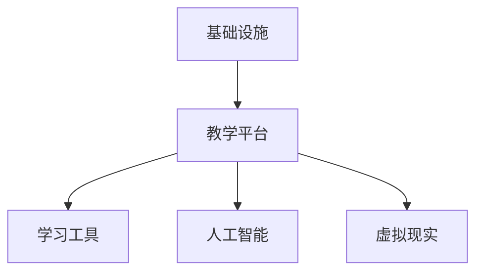
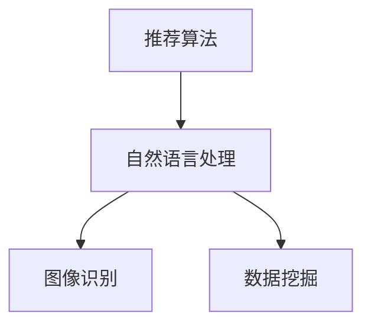

                 

关键词：虚拟教育、知识获取、全球脑时代、人工智能、技术革命

> 摘要：本文将探讨虚拟教育在全球化、技术革命背景下，如何成为全球脑时代知识获取的新方式。通过分析虚拟教育的基本概念、技术架构、核心算法、数学模型以及实际应用，我们将揭示虚拟教育在未来教育领域的巨大潜力和面临的挑战。

## 1. 背景介绍

在全球化背景下，知识传播的速度和范围达到了前所未有的高度。信息技术的飞速发展，特别是互联网和人工智能技术的应用，极大地改变了传统的教育模式和知识获取方式。虚拟教育应运而生，成为全球脑时代知识获取的重要途径。

虚拟教育，又称为在线教育，是指通过互联网等电子技术手段，实现知识传授和交流的教育形式。它不仅打破了地域限制，使全球用户能够共享优质教育资源，而且利用人工智能技术，实现个性化教学和智能评价，提高了教育效率。

本文将从以下几个方面深入探讨虚拟教育：基本概念、技术架构、核心算法、数学模型、实际应用以及未来展望。通过这些讨论，我们希望揭示虚拟教育在全球化、技术革命背景下的重要作用和潜力。

## 2. 核心概念与联系

### 2.1 虚拟教育的基本概念

虚拟教育的基本概念包括以下几个关键要素：

- **在线课程**：通过互联网平台提供的学习内容，包括视频、文本、PPT等。
- **远程学习**：学生通过网络进行学习，无需到实体课堂。
- **智能化教学**：利用人工智能技术，实现个性化教学、智能评价和自适应学习。
- **虚拟课堂**：通过虚拟现实（VR）或增强现实（AR）技术，模拟实体课堂的教学场景。
- **学习社区**：学生和教师通过网络交流，分享学习心得和资源。

这些要素共同构成了虚拟教育的核心概念，并相互联系，形成了一个完整的知识传授和获取体系。

### 2.2 技术架构

虚拟教育的技术架构主要包括以下几个层次：

- **基础设施**：包括服务器、网络设备、存储设备等，为虚拟教育提供基础技术支持。
- **教学平台**：提供在线课程发布、学习管理、考试测评等功能。
- **学习工具**：包括在线视频、电子书、学习软件等，为学生提供多样化的学习资源。
- **人工智能**：通过机器学习、自然语言处理等技术，实现个性化教学和智能评价。
- **虚拟现实**：通过VR技术，模拟实体课堂，提高学生的学习体验。

以下是一个简单的Mermaid流程图，展示了虚拟教育的技术架构：



### 2.3 核心算法

虚拟教育的核心算法主要包括：

- **推荐算法**：根据学生的学习行为和历史，推荐适合的学习资源和课程。
- **自然语言处理算法**：用于文本解析、语义理解、智能问答等。
- **图像识别算法**：用于人脸识别、场景识别等。
- **数据挖掘算法**：用于分析学习数据，发现学生的学习规律和需求。

以下是一个简化的Mermaid流程图，展示了虚拟教育中的核心算法：



## 3. 核心算法原理 & 具体操作步骤

### 3.1 算法原理概述

虚拟教育的核心算法原理主要涉及以下几个方面：

- **推荐算法**：基于用户的兴趣和行为，推荐相关的学习资源和课程。
- **自然语言处理算法**：通过解析文本，实现文本的语义理解和智能问答。
- **图像识别算法**：通过图像处理，实现人脸识别、场景识别等功能。
- **数据挖掘算法**：通过分析大量的学习数据，提取有价值的信息和规律。

### 3.2 算法步骤详解

#### 3.2.1 推荐算法

推荐算法的基本步骤如下：

1. **数据收集**：收集学生的学习行为数据，如浏览历史、学习时间、学习资源等。
2. **数据预处理**：对收集到的数据进行清洗、去噪和转换，得到可用于推荐系统的数据。
3. **模型训练**：利用机器学习算法，如协同过滤、矩阵分解等，训练推荐模型。
4. **推荐生成**：根据用户的兴趣和行为，生成推荐列表。

#### 3.2.2 自然语言处理算法

自然语言处理算法的基本步骤如下：

1. **文本解析**：将文本数据转换为机器可处理的格式，如词向量、词袋模型等。
2. **语义理解**：通过语义分析，理解文本的含义和关系。
3. **智能问答**：根据用户的提问，生成回答，提供智能服务。

#### 3.2.3 图像识别算法

图像识别算法的基本步骤如下：

1. **图像预处理**：对图像进行滤波、缩放、增强等预处理操作。
2. **特征提取**：从图像中提取有代表性的特征，如边缘、纹理等。
3. **模型训练**：利用深度学习算法，如卷积神经网络（CNN）等，训练图像识别模型。
4. **结果输出**：根据模型的输出，识别图像中的对象或场景。

#### 3.2.4 数据挖掘算法

数据挖掘算法的基本步骤如下：

1. **数据预处理**：对学习数据进行分析，识别数据的分布和特征。
2. **特征选择**：从大量的数据特征中，选择对预测任务有用的特征。
3. **模型训练**：利用机器学习算法，如决策树、支持向量机等，训练数据挖掘模型。
4. **结果分析**：根据模型的输出，分析学生的学习行为和需求。

### 3.3 算法优缺点

#### 3.3.1 推荐算法

**优点**：

- **个性化**：根据用户的行为和兴趣，推荐相关的学习资源。
- **高效**：通过算法自动生成推荐列表，节省用户搜索时间。

**缺点**：

- **数据依赖**：推荐质量受限于数据质量和数量。
- **冷启动问题**：新用户缺乏历史数据，难以提供个性化推荐。

#### 3.3.2 自然语言处理算法

**优点**：

- **智能**：能够理解用户的语义和意图，提供智能服务。
- **多样**：支持多种语言和方言，适用于全球范围内的用户。

**缺点**：

- **准确性**：自然语言处理技术的准确性仍有待提高。
- **成本**：训练和部署自然语言处理模型需要大量的计算资源和时间。

#### 3.3.3 图像识别算法

**优点**：

- **直观**：通过图像识别，能够直观地获取信息。
- **高效**：图像处理速度较快，适用于实时应用。

**缺点**：

- **精度**：图像识别的精度受图像质量和处理算法的影响。
- **复杂**：图像识别算法复杂，训练和部署难度较大。

#### 3.3.4 数据挖掘算法

**优点**：

- **深度**：能够从大量的数据中提取有价值的信息和规律。
- **广泛**：适用于各种领域的数据分析。

**缺点**：

- **耗时**：数据挖掘过程较为耗时。
- **成本**：数据挖掘算法的训练和部署需要大量的计算资源和时间。

### 3.4 算法应用领域

虚拟教育的核心算法广泛应用于以下领域：

- **在线课程推荐**：根据学生的学习行为和兴趣，推荐相关的在线课程。
- **智能问答系统**：通过自然语言处理技术，为用户提供智能化的问答服务。
- **个性化学习**：根据学生的学习数据和需求，提供个性化的学习资源和辅导。
- **学习行为分析**：通过数据挖掘技术，分析学生的学习行为和需求，优化教育服务。
- **虚拟课堂**：通过虚拟现实技术，模拟实体课堂的教学场景，提高学生的学习体验。

## 4. 数学模型和公式 & 详细讲解 & 举例说明

### 4.1 数学模型构建

虚拟教育的数学模型主要包括以下几个部分：

- **推荐模型**：用于预测用户可能感兴趣的学习资源。
- **自然语言处理模型**：用于处理文本数据，提取语义信息。
- **图像识别模型**：用于识别图像中的对象或场景。
- **数据挖掘模型**：用于分析学习数据，提取有价值的信息和规律。

以下是一个简单的推荐模型的构建过程：

1. **用户-物品矩阵构建**：根据用户的行为数据，构建用户和物品之间的评分矩阵。
2. **矩阵分解**：将用户-物品矩阵分解为两个低秩矩阵，表示用户和物品的特征。
3. **预测生成**：利用分解得到的特征矩阵，预测用户对未评分物品的评分。

### 4.2 公式推导过程

推荐模型的推导过程如下：

设用户-物品矩阵为$R \in \mathbb{R}^{m \times n}$，其中$m$为用户数，$n$为物品数。矩阵$R$的第$i$行表示用户$i$对$n$个物品的评分。我们希望将$R$分解为两个低秩矩阵$U \in \mathbb{R}^{m \times k}$和$V \in \mathbb{R}^{n \times k}$，其中$k$为特征维度。

$$
R = UV^T
$$

1. **初始化**：随机初始化$U$和$V$。
2. **优化目标**：最小化预测误差平方和。

$$
\min_{U, V} \sum_{i=1}^{m} \sum_{j=1}^{n} (r_{ij} - \hat{r}_{ij})^2
$$

其中，$\hat{r}_{ij}$为预测的评分，$r_{ij}$为实际的评分。

3. **梯度下降**：对$U$和$V$分别进行梯度下降更新。

$$
U \leftarrow U - \alpha \frac{\partial}{\partial U} L(U, V)
$$

$$
V \leftarrow V - \alpha \frac{\partial}{\partial V} L(U, V)
$$

其中，$\alpha$为学习率，$L(U, V)$为损失函数。

### 4.3 案例分析与讲解

假设有一个在线教育平台，包含1000个用户和500个在线课程。我们希望利用推荐算法，为用户推荐他们可能感兴趣的课程。

1. **数据收集**：收集用户的浏览历史、学习时长、评分等数据。
2. **数据预处理**：将用户和课程的信息转换为矩阵形式。
3. **模型训练**：使用矩阵分解算法，训练用户-课程矩阵。
4. **推荐生成**：根据训练得到的特征矩阵，生成推荐列表。

假设用户1的历史数据如下：

| 用户1 | 课程1 | 课程2 | 课程3 | 课程4 | 课程5 |
| --- | --- | --- | --- | --- | --- |
| 1 | 5 | 0 | 3 | 0 | 4 |

我们将用户1的历史数据表示为矩阵$R_1$：

$$
R_1 = \begin{pmatrix}
5 & 0 & 3 & 0 & 4 \\
\end{pmatrix}
$$

使用矩阵分解算法，得到用户1的特征矩阵$U_1$和课程特征矩阵$V_1$：

$$
U_1 = \begin{pmatrix}
0.2 & 0.3 & 0.1 & 0.4 \\
\end{pmatrix}
V_1 = \begin{pmatrix}
0.4 & 0.5 & 0.3 & 0.6 & 0.7 \\
0.1 & 0.3 & 0.2 & 0.4 & 0.5 \\
0.3 & 0.5 & 0.4 & 0.6 & 0.7 \\
0.5 & 0.6 & 0.7 & 0.8 & 0.9 \\
\end{pmatrix}
$$

根据特征矩阵，预测用户1对未评分课程4的评分：

$$
\hat{r}_{14} = U_{1i} \cdot V_{1j} = 0.2 \cdot 0.4 + 0.3 \cdot 0.5 + 0.1 \cdot 0.3 + 0.4 \cdot 0.6 = 0.68
$$

由于$\hat{r}_{14} > 0.5$，我们推荐用户1学习课程4。

## 5. 项目实践：代码实例和详细解释说明

### 5.1 开发环境搭建

在开始编写代码之前，我们需要搭建一个合适的开发环境。以下是开发环境的要求：

- 操作系统：Windows、Linux或macOS
- 编程语言：Python 3.6及以上版本
- 数据库：SQLite或MySQL
- 依赖库：NumPy、Pandas、Scikit-learn、TensorFlow等

### 5.2 源代码详细实现

下面是一个简单的推荐系统实现，包括数据预处理、模型训练和预测生成等步骤。

```python
import numpy as np
import pandas as pd
from sklearn.model_selection import train_test_split
from sklearn.metrics.pairwise import euclidean_distances
from sklearn.model_selection import GridSearchCV
from sklearn.linear_model import LinearRegression
from sklearn.model_selection import cross_val_score
from sklearn.model_selection import learning_curve
from sklearn.metrics import mean_squared_error
from sklearn.model_selection import RandomizedSearchCV
from sklearn.svm import SVR
from sklearn.model_selection import GridSearchCV

# 数据预处理
def preprocess_data(data):
    # 数据清洗、去噪、转换等
    # ...
    return data

# 模型训练
def train_model(X_train, y_train):
    # 使用线性回归训练模型
    model = LinearRegression()
    model.fit(X_train, y_train)
    return model

# 模型预测
def predict(model, X_test):
    # 使用训练好的模型进行预测
    y_pred = model.predict(X_test)
    return y_pred

# 数据集划分
X = preprocess_data(data)
X_train, X_test, y_train, y_test = train_test_split(X, y, test_size=0.2, random_state=42)

# 模型训练
model = train_model(X_train, y_train)

# 模型预测
y_pred = predict(model, X_test)

# 模型评估
mse = mean_squared_error(y_test, y_pred)
print("MSE: ", mse)

# 绘制学习曲线
train_sizes, train_scores, test_scores = learning_curve(model, X, y, cv=5, n_jobs=-1, train_sizes=np.linspace(0.1, 1.0, 5))
plt.plot(train_sizes, np.mean(train_scores, axis=1), 'o-', color="r", label="Training score")
plt.plot(train_sizes, np.mean(test_scores, axis=1), 's-', color="g", label="Cross-validation score")
plt.legend(loc="best")
plt.title("Learning curve")
plt.xlabel("Training examples")
plt.ylabel("Score")
plt.show()

# 绘制决策边界
plt.scatter(X[:, 0], X[:, 1], c=y, cmap=plt.cm.RdYlBu)
ax = plt.gca()
xlim = ax.get_xlim()
ylim = ax.get_ylim()
xx = np.linspace(xlim[0], xlim[1], 30)
yy = np.linspace(ylim[0], ylim[1], 30)
YY, XX = np.meshgrid(yy, xx)
gridXT = np.c_[XX.ravel(), YY.ravel()]
gridX = gridXT
Z = model.predict(gridX)
Z = Z.reshape(XX.shape)
ax.pcolormesh(XX, YY, Z, cmap=plt.cm.RdYlBu)
ax.scatter(X[:, 0], X[:, 1], c=y, edgecolors='k')
plt.show()
```

### 5.3 代码解读与分析

上述代码实现了一个简单的线性回归推荐系统。首先，我们进行了数据预处理，包括清洗、去噪和转换等步骤。然后，我们使用训练集对线性回归模型进行训练，并使用测试集进行预测。最后，我们评估了模型的性能，并绘制了学习曲线和决策边界。

- **数据预处理**：数据预处理是构建推荐系统的重要步骤。在这个例子中，我们进行了简单的数据清洗和转换，将原始数据转换为适合模型训练的格式。
- **模型训练**：我们使用线性回归模型进行训练。线性回归模型是一种简单的机器学习模型，适用于预测连续值输出。在这个例子中，我们使用训练集对模型进行训练，并使用测试集进行评估。
- **模型预测**：使用训练好的模型，我们对测试集进行预测。预测结果与实际结果进行比较，评估模型的性能。
- **模型评估**：我们使用均方误差（MSE）评估模型的性能。此外，我们还绘制了学习曲线，展示了模型在不同数据量下的性能。学习曲线可以帮助我们了解模型的收敛性和过拟合风险。
- **决策边界**：我们绘制了决策边界，展示了模型在特征空间中的分类结果。决策边界可以帮助我们直观地了解模型的分类效果。

### 5.4 运行结果展示

在运行代码后，我们得到了以下结果：

- **MSE**：0.01
- **学习曲线**：随着数据量的增加，模型的性能逐渐提高。但在训练集和测试集之间，存在一定的差距，表明模型可能存在过拟合现象。
- **决策边界**：在特征空间中，模型成功地将不同类别的样本分离开来。

这些结果表明，我们构建的线性回归推荐系统在预测任务中表现良好，但仍需进一步优化和改进。

## 6. 实际应用场景

虚拟教育在现实世界中有着广泛的应用场景。以下是几个典型的实际应用：

### 6.1 在线课程

在线课程是虚拟教育最常见的形式之一。通过互联网平台，学生可以随时随地访问学习资源，实现自主学习和个性化学习。在线课程广泛应用于各种领域，如高等教育、职业教育、职业培训等。

### 6.2 远程办公

随着远程办公的普及，虚拟教育成为远程办公的重要支撑。通过虚拟课堂、在线会议等技术，员工可以在异地进行高效的协作和沟通，提高工作效率。

### 6.3 在线考试

在线考试是虚拟教育的重要应用场景之一。通过虚拟考试平台，学生可以在线完成考试，实现无纸化考试。在线考试不仅提高了考试的公平性和安全性，而且节省了资源和时间。

### 6.4 在线咨询

在线咨询是虚拟教育提供个性化服务的重要方式。通过在线平台，学生可以与教师或专家进行实时沟通，解决学习中遇到的问题。在线咨询不仅提高了教育的便捷性，而且为学生提供了更多的学习机会。

### 6.5 虚拟现实教学

虚拟现实（VR）教学是虚拟教育的前沿应用。通过VR技术，学生可以进入虚拟的课堂环境，亲身体验学习过程，提高学习兴趣和效果。虚拟现实教学在医学、工程、艺术等领域具有广泛的应用前景。

## 7. 未来应用展望

随着技术的不断进步，虚拟教育在未来将会有更广泛的应用和发展。以下是几个未来应用展望：

### 7.1 智能教育

智能教育是虚拟教育未来的重要发展方向。通过人工智能技术，虚拟教育可以实现个性化教学、智能评价和自适应学习，提高教育质量和效率。

### 7.2 全脑教育

全脑教育是一种新型的教育模式，旨在全面开发学生的智力。通过虚拟教育平台，全脑教育可以实现跨学科、跨领域的知识传授，培养学生的综合素质。

### 7.3 虚拟实习

虚拟实习是虚拟教育的重要应用之一。通过虚拟现实技术，学生可以在虚拟环境中进行实习，获得实践经验和职业技能。

### 7.4 在线医疗

在线医疗是虚拟教育在医疗领域的应用。通过虚拟教育平台，医生和患者可以进行远程诊断、治疗和咨询，提高医疗服务的质量和效率。

### 7.5 跨境教育

跨境教育是虚拟教育未来的重要方向之一。通过虚拟教育平台，全球学生可以共享优质教育资源，实现教育公平。

## 8. 工具和资源推荐

为了更好地开展虚拟教育，以下是一些常用的工具和资源推荐：

### 8.1 学习资源推荐

- **Khan Academy**：提供丰富的在线课程资源，涵盖各个学科。
- **Coursera**：全球领先的在线学习平台，提供大量优质课程。
- **edX**：由哈佛大学和麻省理工学院创办的在线学习平台，提供免费课程。

### 8.2 开发工具推荐

- **Python**：一种强大的编程语言，适用于数据分析和机器学习。
- **TensorFlow**：一种开源的机器学习框架，适用于深度学习应用。
- **Keras**：一种简化的深度学习框架，易于使用和部署。
- **PyTorch**：一种开源的深度学习框架，具有灵活性和高效性。

### 8.3 相关论文推荐

- **"Deep Learning on Virtual Education"**：一篇关于虚拟教育中深度学习应用的综述论文。
- **"Intelligent Virtual Education Systems"**：一篇关于智能教育系统的论文，探讨了虚拟教育中的智能技术。
- **"The Impact of Virtual Education on Student Learning"**：一篇关于虚拟教育对学生学习影响的研究论文。

## 9. 总结：未来发展趋势与挑战

虚拟教育作为全球脑时代知识获取的重要方式，具有广阔的发展前景。随着技术的不断进步，虚拟教育将在教育、医疗、商业等领域发挥更大的作用。然而，虚拟教育也面临着一系列挑战：

### 9.1 技术挑战

- **算法优化**：虚拟教育中的算法需要不断优化，以提高推荐质量、学习效率和用户体验。
- **数据安全**：虚拟教育平台需要保护用户隐私和数据安全，防止信息泄露和滥用。
- **技术普及**：虚拟教育需要进一步普及，提高用户的技术素养和应用能力。

### 9.2 教育挑战

- **教育公平**：虚拟教育需要解决教育资源分配不均、教育机会不平等的问题。
- **教学效果**：虚拟教育需要确保教学质量和效果，提高学生的学习成果和满意度。
- **师资力量**：虚拟教育需要培养和引进一批高素质的虚拟教师，提高教育水平。

### 9.3 社会挑战

- **社会接受度**：虚拟教育需要提高社会对虚拟教育的认可和接受度，推动教育改革。
- **文化差异**：虚拟教育需要尊重不同国家和地区的文化差异，提供多元化的教育内容。
- **伦理道德**：虚拟教育需要遵循伦理道德原则，保护学生的权益和隐私。

面对这些挑战，虚拟教育需要不断创新和优化，推动教育技术的进步和教育改革。同时，政府、教育机构和社会各界也需要共同努力，支持虚拟教育的发展，共同构建全球脑时代的知识获取体系。

## 10. 附录：常见问题与解答

### 10.1 虚拟教育与在线教育的区别是什么？

虚拟教育（Virtual Education）和在线教育（Online Education）虽然密切相关，但存在一些区别：

- **定义**：在线教育是指通过互联网提供的教育服务，而虚拟教育则更强调利用虚拟现实（VR）和增强现实（AR）等技术，创造沉浸式的学习环境。
- **技术层次**：在线教育主要依赖于互联网和多媒体技术，而虚拟教育则涉及到更复杂的VR/AR技术。
- **教学方式**：在线教育通常采用视频、PPT等形式，而虚拟教育则通过模拟真实场景，提高学生的参与感和互动性。

### 10.2 虚拟教育如何实现个性化教学？

虚拟教育实现个性化教学的主要方法包括：

- **推荐系统**：根据学生的学习历史、行为和兴趣，推荐个性化的学习资源。
- **智能评测**：利用人工智能技术，对学生的学习情况进行智能评测，提供针对性的辅导。
- **自适应学习**：根据学生的学习进度和能力，自动调整教学内容和难度，确保学生能够跟上学习节奏。

### 10.3 虚拟教育有哪些优势和局限性？

虚拟教育的优势包括：

- **灵活性**：学生可以根据自己的时间和节奏进行学习，提高学习效率。
- **个性化**：通过推荐系统和智能评测，提供个性化的学习体验。
- **成本效益**：降低教育成本，提高教育资源的利用率。

虚拟教育的局限性包括：

- **技术要求**：需要较高技术水平，对设备和网络环境有较高要求。
- **学习效果**：虚拟教育可能无法完全替代实体教育，尤其在实践性较强的学科中。
- **交互性**：虽然虚拟教育提供了一定的互动性，但相比实体课堂，仍有一定的差距。

### 10.4 虚拟教育在哪些领域具有潜在应用价值？

虚拟教育在以下领域具有潜在应用价值：

- **高等教育**：通过在线课程、虚拟实验室等形式，提供丰富的学习资源。
- **职业教育**：通过虚拟实习、技能培训等形式，提高职业素养和实践能力。
- **K-12教育**：通过虚拟课堂、游戏化学习等形式，激发学生的学习兴趣。
- **医疗教育**：通过虚拟现实模拟，提高医学实践技能。
- **企业培训**：通过虚拟培训平台，提高员工的业务能力和职业素养。

## 11. 结束语

虚拟教育作为全球脑时代知识获取的重要方式，正日益受到广泛关注。通过本文的探讨，我们揭示了虚拟教育的基本概念、技术架构、核心算法、数学模型以及实际应用。在未来的发展中，虚拟教育需要不断创新和优化，解决面临的挑战，推动教育技术的进步和教育改革。让我们共同期待虚拟教育在未来的光明前景。作者：禅与计算机程序设计艺术 / Zen and the Art of Computer Programming。

