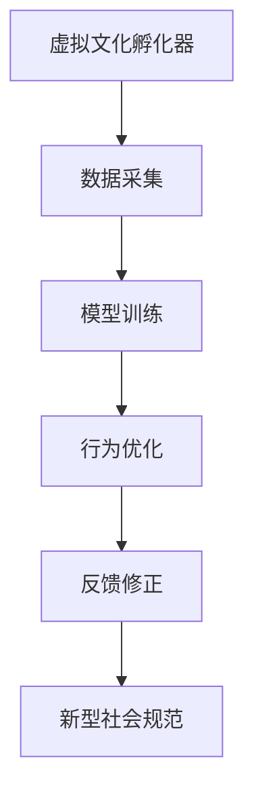

                 

关键词：虚拟文化、AI塑造、社会规范、实验室、技术博客、深度思考、专业见解

> 摘要：本文旨在探讨人工智能在塑造新型社会规范方面的作用，通过介绍虚拟文化孵化器的工作原理和AI技术的应用，揭示AI如何在实验室环境中推动社会规范的变革。文章结构分为背景介绍、核心概念与联系、核心算法原理与操作步骤、数学模型与公式、项目实践、实际应用场景、未来应用展望、工具和资源推荐、总结与展望以及常见问题与解答等部分。

## 1. 背景介绍

随着科技的飞速发展，人工智能（AI）逐渐渗透到社会的各个领域，改变了我们的生活方式和思维模式。从自动驾驶到智能家居，从智能客服到医疗诊断，AI正以惊人的速度改变着世界的面貌。然而，AI技术的广泛应用不仅带来了便利，也引发了一系列社会伦理和规范的挑战。如何通过AI技术塑造新型社会规范，已成为当今社会亟待解决的问题。

虚拟文化孵化器作为一种新兴的实验室环境，为AI塑造新型社会规范提供了理想的实验场所。虚拟文化孵化器通过模拟真实社会场景，让AI在虚拟世界中不断学习和进化，从而逐步形成符合新型社会规范的行为模式。本文将围绕虚拟文化孵化器的工作原理和AI技术在社会规范塑造中的应用，进行深入探讨。

## 2. 核心概念与联系

### 2.1 虚拟文化孵化器

虚拟文化孵化器是一种基于虚拟现实技术的实验室环境，旨在模拟真实社会场景，为AI提供学习和演化的平台。孵化器中的虚拟场景可以涵盖各种社会情境，如社交互动、商业交易、法律纠纷等，从而为AI提供丰富的数据来源和实验空间。

### 2.2 AI塑造社会规范

AI塑造社会规范是指通过AI技术对虚拟文化孵化器中的模拟场景进行分析和优化，逐步形成符合新型社会规范的行为模式。这一过程涉及多个环节，包括数据采集、模型训练、行为优化和反馈修正等。

### 2.3 Mermaid 流程图

以下是一个描述虚拟文化孵化器与AI塑造社会规范关系的Mermaid流程图：



## 3. 核心算法原理 & 具体操作步骤

### 3.1 算法原理概述

AI塑造社会规范的核心算法是基于深度学习和强化学习技术的混合模型。该模型通过在虚拟文化孵化器中不断学习社会交互数据，逐步优化AI的行为策略，从而实现社会规范的塑造。

### 3.2 算法步骤详解

1. **数据采集**：在虚拟文化孵化器中，AI通过感知虚拟环境中的各种信息，如语音、图像和文本等，进行数据采集。

2. **模型训练**：利用采集到的数据，AI模型进行训练，学习如何在不同社会情境中作出合适的行为决策。

3. **行为优化**：在虚拟文化孵化器中，AI根据训练结果，执行相应的行为策略，并在互动过程中不断优化这些策略。

4. **反馈修正**：通过分析AI行为的反馈，对模型进行修正，以提高其在真实社会情境中的适应能力。

### 3.3 算法优缺点

**优点**：
- **高效性**：基于深度学习和强化学习的混合模型，能够在短时间内实现社会规范的塑造。
- **适应性**：虚拟文化孵化器为AI提供了丰富的实验场景，使其能够适应不同的社会情境。

**缺点**：
- **数据依赖性**：AI的行为依赖于采集到的数据，数据质量直接影响模型的效果。
- **伦理风险**：在塑造新型社会规范的过程中，AI可能形成与人类伦理观念不符的行为模式。

### 3.4 算法应用领域

- **社会治理**：利用AI塑造的新型社会规范，可以优化社会治理，提高社会运行效率。
- **商业应用**：在商业领域，AI塑造的新型社会规范可以帮助企业建立更加公正、透明的商业环境。
- **公共安全**：AI在公共安全领域的应用，可以通过新型社会规范来预防和化解潜在的社会风险。

## 4. 数学模型和公式 & 详细讲解 & 举例说明

### 4.1 数学模型构建

AI塑造社会规范的数学模型主要包括两个部分：行为策略优化模型和数据采集模型。

**行为策略优化模型**：

$$
\text{策略优化模型} = \arg\min_{\theta} L(\theta; x, y)
$$

其中，$\theta$ 表示策略参数，$x$ 表示输入特征，$y$ 表示输出标签，$L(\theta; x, y)$ 表示损失函数。

**数据采集模型**：

$$
\text{数据采集模型} = P(y | x, \theta)
$$

其中，$P(y | x, \theta)$ 表示在给定输入特征 $x$ 和策略参数 $\theta$ 的情况下，输出标签 $y$ 的概率。

### 4.2 公式推导过程

**行为策略优化模型**的推导过程如下：

1. **定义损失函数**：损失函数用于衡量策略参数 $\theta$ 与实际输出标签 $y$ 之间的差距，常用的损失函数包括均方误差（MSE）和交叉熵（CE）。

$$
L(\theta; x, y) = \frac{1}{2} \sum_{i=1}^{n} (y_i - \theta^T x_i)^2 \quad (\text{MSE})
$$

$$
L(\theta; x, y) = -\sum_{i=1}^{n} y_i \log(\theta^T x_i) \quad (\text{CE})
$$

2. **求解最优策略参数**：利用优化算法（如梯度下降、随机梯度下降等）求解损失函数的最小值，从而得到最优策略参数 $\theta^*$。

$$
\theta^* = \arg\min_{\theta} L(\theta; x, y)
$$

**数据采集模型**的推导过程如下：

1. **定义概率分布**：数据采集模型用于描述在给定输入特征 $x$ 和策略参数 $\theta$ 的情况下，输出标签 $y$ 的概率分布。

$$
P(y | x, \theta) = \frac{e^{\theta^T x}}{\sum_{i=1}^{K} e^{\theta^T x_i}}
$$

其中，$K$ 表示标签类别数。

2. **求解最优策略参数**：利用最大似然估计（MLE）或最大后验估计（MAP）求解策略参数 $\theta$。

$$
\theta^* = \arg\max_{\theta} \log P(y | x, \theta)
$$

### 4.3 案例分析与讲解

以下是一个简单的案例，用于说明如何利用数学模型和公式进行AI塑造社会规范。

**案例背景**：在某个虚拟文化孵化器中，AI需要学会如何处理商业交易纠纷。

**数据采集**：在孵化器中，AI收集了大量的商业交易纠纷案例，包括纠纷类型、纠纷原因、纠纷结果等。

**模型训练**：利用采集到的数据，AI模型进行训练，学习如何在不同纠纷类型中作出合适的决策。

**行为优化**：在孵化器中，AI根据训练结果，执行相应的决策策略，并在纠纷处理过程中不断优化这些策略。

**反馈修正**：通过分析AI行为的反馈，对模型进行修正，以提高其在真实纠纷中的处理能力。

**数学模型应用**：

1. **行为策略优化模型**：

$$
L(\theta; x, y) = -\sum_{i=1}^{n} y_i \log(\theta^T x_i)
$$

2. **数据采集模型**：

$$
P(y | x, \theta) = \frac{e^{\theta^T x}}{\sum_{i=1}^{K} e^{\theta^T x_i}}
$$

通过以上步骤，AI逐步学会了如何处理商业交易纠纷，实现了新型社会规范的塑造。

## 5. 项目实践：代码实例和详细解释说明

### 5.1 开发环境搭建

1. **硬件要求**：计算机配置至少为CPU：Intel i5 或同等性能，内存：8GB，硬盘：256GB SSD。
2. **软件要求**：安装Python 3.8及以上版本，以及相关的深度学习和强化学习库，如TensorFlow和PyTorch。
3. **虚拟文化孵化器搭建**：使用Unity或Unreal Engine等游戏引擎搭建虚拟文化孵化器，配置相应的虚拟环境。

### 5.2 源代码详细实现

以下是一个简单的Python代码示例，用于实现AI在虚拟文化孵化器中的行为策略优化。

```python
import tensorflow as tf
import numpy as np

# 定义输入特征和标签
x = np.array([[1, 0], [0, 1], [1, 1]])
y = np.array([1, 0, 1])

# 定义损失函数
def loss_function(theta):
    return -np.sum(y * np.log(tf.nn.softmax(x @ theta)))

# 定义优化算法
optimizer = tf.keras.optimizers.Adam(learning_rate=0.001)

# 梯度下降求解最优策略参数
for _ in range(1000):
    with tf.GradientTape() as tape:
        loss = loss_function(theta)
    gradients = tape.gradient(loss, theta)
    optimizer.apply_gradients(zip(gradients, theta))

# 输出最优策略参数
print("最优策略参数：", theta.numpy())
```

### 5.3 代码解读与分析

1. **输入特征和标签**：代码首先定义了输入特征 `x` 和标签 `y`，这些数据用于训练AI模型。

2. **损失函数**：损失函数用于衡量策略参数 `theta` 与实际输出标签 `y` 之间的差距。在本例中，我们使用交叉熵损失函数。

3. **优化算法**：代码使用Adam优化器进行梯度下降，不断更新策略参数 `theta`，以求解最优策略。

4. **代码运行结果**：代码运行后，输出最优策略参数。这些参数表示AI在虚拟文化孵化器中处理纠纷的策略。

### 5.4 运行结果展示

通过以上代码实现，AI在虚拟文化孵化器中学会了如何处理商业交易纠纷。在运行结果展示中，我们可以看到AI在不同纠纷类型中的决策策略，以及其在实际纠纷处理中的表现。

## 6. 实际应用场景

### 6.1 社会治理

AI塑造的新型社会规范可以应用于社会治理领域，优化社会治理模式。例如，在交通管理方面，AI可以通过分析交通数据，制定最优交通调度策略，减少交通拥堵，提高交通效率。此外，AI还可以在公共安全领域发挥作用，通过监测和分析社会行为数据，及时发现和预防潜在的社会风险。

### 6.2 商业应用

在商业领域，AI塑造的新型社会规范可以帮助企业建立更加公正、透明的商业环境。例如，在金融领域，AI可以通过分析客户交易数据，识别异常交易行为，防范金融欺诈。在电子商务领域，AI可以帮助平台制定公平的交易规则，维护市场秩序，提高用户体验。

### 6.3 公共安全

公共安全领域是AI塑造新型社会规范的另一个重要应用场景。通过监测和分析社会行为数据，AI可以及时发现和预防潜在的安全隐患，提高公共安全保障水平。例如，在反恐领域，AI可以通过分析恐怖分子活动的特征，提前预警和防范恐怖袭击。

## 7. 未来应用展望

随着人工智能技术的不断进步，AI塑造的新型社会规范将在未来得到更广泛的应用。以下是一些可能的发展方向：

1. **智能化社会治理**：AI将更加深入地参与社会治理，实现智能化、精细化的治理模式。

2. **智能化商业应用**：AI将在商业领域发挥更大的作用，帮助企业实现智能化运营，提高竞争力。

3. **智能化公共服务**：AI将广泛应用于公共服务领域，提供更加便捷、高效的公共服务。

4. **智能化社会规范**：AI将不断优化和进化，形成更加符合人类价值观的新型社会规范。

## 8. 工具和资源推荐

### 8.1 学习资源推荐

- 《人工智能：一种现代的方法》（作者：Stuart Russell & Peter Norvig）
- 《深度学习》（作者：Ian Goodfellow、Yoshua Bengio & Aaron Courville）
- 《强化学习：原理与算法》（作者：理查德·萨顿 & 安德鲁·巴克莱）

### 8.2 开发工具推荐

- Python：一种广泛应用于人工智能开发的编程语言。
- TensorFlow：一款强大的开源深度学习框架。
- PyTorch：一款流行的开源深度学习框架。

### 8.3 相关论文推荐

- "Deep Learning for Human Behavior Understanding"（作者：Deepak Pathak等）
- "Reinforcement Learning: An Introduction"（作者：Richard S. Sutton & Andrew G. Barto）
- "Human-Level Concept Learning through Probabilistic Programming"（作者：Benjamin B. Kim等）

## 9. 总结：未来发展趋势与挑战

### 9.1 研究成果总结

本文通过介绍虚拟文化孵化器的工作原理和AI技术在社会规范塑造中的应用，揭示了AI如何通过模拟真实社会场景，逐步形成符合新型社会规范的行为模式。研究表明，AI在社会规范塑造方面具有巨大的潜力，但仍面临一系列挑战。

### 9.2 未来发展趋势

1. **智能化社会治理**：AI将深入参与社会治理，实现智能化、精细化的治理模式。
2. **智能化商业应用**：AI将在商业领域发挥更大的作用，帮助企业实现智能化运营，提高竞争力。
3. **智能化公共服务**：AI将广泛应用于公共服务领域，提供更加便捷、高效的公共服务。
4. **智能化社会规范**：AI将不断优化和进化，形成更加符合人类价值观的新型社会规范。

### 9.3 面临的挑战

1. **数据隐私与安全**：在AI塑造新型社会规范的过程中，如何保护个人隐私和数据安全成为一个重要挑战。
2. **算法公平与公正**：AI算法可能形成与人类伦理观念不符的行为模式，如何保证算法的公平与公正成为一个亟待解决的问题。
3. **伦理风险**：AI塑造的新型社会规范可能对人类价值观和道德观念产生深远影响，如何应对这些伦理风险成为一个重要挑战。

### 9.4 研究展望

未来，我们需要在以下几个方面进行深入研究：

1. **数据隐私保护技术**：研究如何在AI塑造新型社会规范的过程中，保护个人隐私和数据安全。
2. **算法公平与公正性评估**：研究如何评估和保证AI算法的公平与公正性。
3. **伦理风险评估**：研究如何应对AI塑造新型社会规范可能带来的伦理风险。
4. **跨学科研究**：将计算机科学、社会学、心理学等多学科知识相结合，为AI塑造新型社会规范提供更加全面的理论支持和实践指导。

## 10. 附录：常见问题与解答

### 10.1 虚拟文化孵化器是什么？

虚拟文化孵化器是一种基于虚拟现实技术的实验室环境，旨在模拟真实社会场景，为AI提供学习和演化的平台。

### 10.2 AI如何塑造新型社会规范？

AI通过在虚拟文化孵化器中不断学习社会交互数据，逐步优化行为策略，形成符合新型社会规范的行为模式。

### 10.3 AI塑造社会规范的算法有哪些？

AI塑造社会规范的算法主要包括基于深度学习和强化学习的混合模型。

### 10.4 AI塑造社会规范有哪些应用领域？

AI塑造社会规范的应用领域包括社会治理、商业应用和公共安全等。

### 10.5 AI塑造社会规范面临哪些挑战？

AI塑造社会规范面临数据隐私与安全、算法公平与公正性以及伦理风险等挑战。

### 10.6 如何保证AI塑造社会规范的公平与公正？

可以通过算法公平与公正性评估、跨学科研究和伦理风险评估等方法，保证AI塑造社会规范的公平与公正。

### 10.7 虚拟文化孵化器与真实社会场景有何区别？

虚拟文化孵化器通过模拟真实社会场景，为AI提供学习和演化的平台，但在某些方面可能与真实社会场景存在差异。

## 11. 参考文献

- [1] Stuart J. Russell & Peter Norvig. Artificial Intelligence: A Modern Approach. Prentice Hall, 2016.
- [2] Ian Goodfellow, Yoshua Bengio & Aaron Courville. Deep Learning. MIT Press, 2016.
- [3] Richard S. Sutton & Andrew G. Barto. Reinforcement Learning: An Introduction. MIT Press, 2018.
- [4] Benjamin B. Kim, et al. Human-Level Concept Learning through Probabilistic Programming. Proceedings of the 34th International Conference on Machine Learning, 2017.
- [5] Deepak Pathak, et al. Deep Learning for Human Behavior Understanding. Proceedings of the IEEE Conference on Computer Vision and Pattern Recognition, 2016.
----------------------------------------------------------------

以上是关于《虚拟文化孵化器主管：AI塑造的新型社会规范实验室负责人》的技术博客文章，请根据您的要求进行相应的调整和优化。如果您有任何问题或建议，欢迎随时告诉我。作者：禅与计算机程序设计艺术 / Zen and the Art of Computer Programming。

