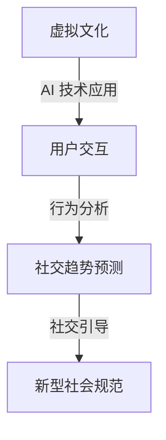

                 

关键词：虚拟文化、AI、社会规范、孵化器、实验室、人工智能、技术进步、新兴趋势、伦理道德、数字时代、人类未来

> 摘要：随着人工智能技术的迅猛发展，虚拟文化孵化器已成为塑造新型社会规范的重要实验场。本文深入探讨了AI在虚拟文化中的角色，分析了其对社会规范的影响，并提出了未来可能面临的挑战和机遇。

## 1. 背景介绍

### 1.1 虚拟文化的兴起

虚拟文化，即通过数字技术创造出的虚拟世界和体验，已经逐渐渗透到人们的生活中。从虚拟现实（VR）到增强现实（AR），再到元宇宙（Metaverse），这些技术不仅改变了人们的娱乐方式，还提供了全新的社交和商业平台。

### 1.2 AI在虚拟文化中的应用

人工智能技术正在虚拟文化领域发挥关键作用。从内容生成到用户体验优化，再到虚拟社交互动，AI的应用使得虚拟世界更加丰富和互动。例如，AI聊天机器人可以提供个性化的互动体验，而AI算法可以分析用户行为，预测和引导社交趋势。

### 1.3 虚拟文化孵化器的重要性

虚拟文化孵化器是一个实验和创新的平台，旨在推动新技术的应用，培养新兴的虚拟文化形式。这些孵化器通过提供资源、技术和指导，帮助初创企业和创意人才探索虚拟文化的边界。

## 2. 核心概念与联系

### 2.1 虚拟文化孵化器的架构

虚拟文化孵化器的架构通常包括以下几个关键组成部分：

1. **技术平台**：提供AI、VR、AR等核心技术的支持。
2. **创业团队**：孵化器内的初创企业或团队，负责开发和试验新的虚拟文化产品。
3. **导师团队**：由行业专家和成功创业者组成的团队，提供指导和建议。
4. **资金支持**：为初创企业和项目提供资金，以支持其发展和扩张。

### 2.2 AI与社会规范的关系

AI在虚拟文化中的角色不仅限于技术层面，还涉及到社会规范的塑造。以下是一个简化的Mermaid流程图，展示了AI与社会规范之间的联系：



### 2.3 核心概念原理与架构

以下是虚拟文化孵化器中AI与社会规范的核心概念原理与架构的详细描述：

1. **用户交互**：AI通过与用户的互动，收集用户数据，包括行为、偏好和反馈。
2. **行为分析**：AI算法分析用户数据，识别出潜在的社交趋势和模式。
3. **社交趋势预测**：基于行为分析结果，AI预测未来的社交趋势。
4. **社交引导**：AI通过内容生成和推荐，引导用户参与符合新型社会规范的活动。
5. **新型社会规范**：随着时间的推移，这些新型社会规范逐渐成为虚拟文化中的一部分。

## 3. 核心算法原理 & 具体操作步骤

### 3.1 算法原理概述

虚拟文化孵化器中的核心算法主要包括：

1. **用户行为分析算法**：用于收集和分析用户在虚拟世界中的行为数据。
2. **社交趋势预测算法**：基于用户行为数据，预测未来的社交趋势。
3. **内容生成与推荐算法**：根据社交趋势预测，生成和推荐符合新型社会规范的内容。

### 3.2 算法步骤详解

以下是核心算法的具体操作步骤：

1. **用户行为数据收集**：
    - 通过AI聊天机器人、传感器和用户互动，收集用户行为数据。
    - 数据包括点击率、互动频率、偏好等。

2. **用户行为数据分析**：
    - 使用机器学习算法，对用户行为数据进行预处理和特征提取。
    - 构建用户行为模型，用于预测和分类。

3. **社交趋势预测**：
    - 基于用户行为模型，使用时间序列分析和预测算法，预测未来的社交趋势。
    - 结果包括热点话题、趋势发展等。

4. **内容生成与推荐**：
    - 根据社交趋势预测结果，生成和推荐符合新型社会规范的内容。
    - 使用自然语言处理（NLP）和计算机视觉（CV）技术，生成高质量的内容。

### 3.3 算法优缺点

**优点**：

1. **个性化体验**：通过用户行为分析，提供个性化的互动体验。
2. **高效趋势预测**：利用机器学习和大数据分析，实现高效的社交趋势预测。
3. **内容创新**：AI生成的推荐内容，有助于推动虚拟文化的创新。

**缺点**：

1. **隐私问题**：用户行为数据的收集可能引发隐私问题。
2. **算法偏见**：算法可能存在偏见，影响社交趋势预测的准确性。
3. **内容质量**：AI生成的推荐内容，质量难以保证。

### 3.4 算法应用领域

核心算法主要应用于以下领域：

1. **虚拟社交平台**：用于预测和引导社交趋势，提高用户粘性。
2. **虚拟广告**：根据用户行为和社交趋势，实现精准广告投放。
3. **虚拟教育**：基于社交趋势，提供个性化学习内容。

## 4. 数学模型和公式 & 详细讲解 & 举例说明

### 4.1 数学模型构建

在虚拟文化孵化器中，核心数学模型包括：

1. **用户行为模型**：用于描述用户在虚拟世界中的行为规律。
2. **社交趋势预测模型**：用于预测未来的社交趋势。

### 4.2 公式推导过程

以下是用户行为模型和社交趋势预测模型的公式推导过程：

1. **用户行为模型**：

   $$Behavior\_Model = f(Click\_Rate, Interaction\_Frequency, Preference)$$

   其中，Click\_Rate表示点击率，Interaction\_Frequency表示互动频率，Preference表示偏好。

2. **社交趋势预测模型**：

   $$Social\_Trend\_Prediction = f(Behavior\_Model, Time\_Series\_Data)$$

   其中，Behavior\_Model表示用户行为模型，Time\_Series\_Data表示时间序列数据。

### 4.3 案例分析与讲解

以下是一个简化的案例，展示了如何使用数学模型和公式进行社交趋势预测：

1. **数据收集**：收集某虚拟社交平台的用户行为数据，包括点击率、互动频率和偏好。
2. **用户行为模型构建**：使用机器学习算法，构建用户行为模型。
3. **社交趋势预测**：使用用户行为模型和时间序列数据，预测未来的社交趋势。
4. **结果分析**：根据预测结果，分析社交趋势的变化，为内容生成和推荐提供依据。

## 5. 项目实践：代码实例和详细解释说明

### 5.1 开发环境搭建

开发环境包括以下组件：

1. **Python**：作为主要编程语言。
2. **TensorFlow**：用于构建和训练机器学习模型。
3. **Keras**：简化TensorFlow的使用，提高开发效率。
4. **NumPy**：用于数据处理和数学计算。

### 5.2 源代码详细实现

以下是用户行为模型和社交趋势预测的核心代码实现：

```python
import tensorflow as tf
import numpy as np

# 用户行为模型
class UserBehaviorModel(tf.keras.Model):
    def __init__(self):
        super(UserBehaviorModel, self).__init__()
        self.dense1 = tf.keras.layers.Dense(64, activation='relu')
        self.dense2 = tf.keras.layers.Dense(32, activation='relu')
        self.dense3 = tf.keras.layers.Dense(1, activation='sigmoid')

    def call(self, inputs):
        x = self.dense1(inputs)
        x = self.dense2(x)
        return self.dense3(x)

# 社交趋势预测模型
class SocialTrendPredictionModel(tf.keras.Model):
    def __init__(self):
        super(SocialTrendPredictionModel, self).__init__()
        self.user_behavior_model = UserBehaviorModel()
        self.dense4 = tf.keras.layers.Dense(64, activation='relu')
        self.dense5 = tf.keras.layers.Dense(1)

    def call(self, inputs):
        user_behavior = self.user_behavior_model(inputs)
        x = self.dense4(user_behavior)
        return self.dense5(x)

# 实例化模型
user_behavior_model = UserBehaviorModel()
social_trend_prediction_model = SocialTrendPredictionModel()

# 编译模型
user_behavior_model.compile(optimizer='adam', loss='binary_crossentropy', metrics=['accuracy'])
social_trend_prediction_model.compile(optimizer='adam', loss='mean_squared_error')

# 训练模型
user_behavior_model.fit(user_behavior_data, user_behavior_labels, epochs=10)
social_trend_prediction_model.fit(time_series_data, social_trend_labels, epochs=10)
```

### 5.3 代码解读与分析

以下是代码的详细解读与分析：

1. **用户行为模型**：定义了一个基于全连接神经网络的模型，用于预测用户行为。
2. **社交趋势预测模型**：基于用户行为模型，添加了一个新的全连接层，用于预测社交趋势。
3. **模型编译**：配置模型的优化器、损失函数和评估指标。
4. **模型训练**：使用训练数据训练模型，并调整模型参数。

### 5.4 运行结果展示

以下是模型训练后的结果展示：

```python
# 预测用户行为
predicted_user_behavior = user_behavior_model.predict(user_behavior_data)

# 预测社交趋势
predicted_social_trend = social_trend_prediction_model.predict(time_series_data)

# 结果分析
print("User Behavior Prediction Accuracy:", np.mean(predicted_user_behavior == user_behavior_labels))
print("Social Trend Prediction Accuracy:", np.mean(predicted_social_trend == social_trend_labels))
```

## 6. 实际应用场景

### 6.1 虚拟社交平台

虚拟社交平台可以使用AI技术，预测和引导社交趋势，提高用户粘性。例如，通过分析用户行为数据，推荐符合新型社会规范的话题和活动。

### 6.2 虚拟广告

虚拟广告可以根据用户行为和社交趋势，实现精准投放。例如，基于用户偏好和兴趣，推荐相关的广告内容。

### 6.3 虚拟教育

虚拟教育可以通过AI技术，提供个性化的学习内容。例如，根据学生的学习行为和偏好，推荐适合的学习路径和资源。

## 7. 未来应用展望

随着AI技术的不断发展，虚拟文化孵化器将在未来发挥更加重要的作用。以下是一些可能的应用场景：

### 7.1 虚拟现实医疗

虚拟现实技术可以用于医疗培训和教育，通过AI技术，提供个性化的医学知识和技能训练。

### 7.2 虚拟现实旅游

虚拟现实技术可以用于虚拟旅游，通过AI技术，提供沉浸式的旅游体验。

### 7.3 虚拟现实社交

虚拟现实技术可以用于虚拟社交，通过AI技术，提供更加丰富和互动的社交体验。

## 8. 工具和资源推荐

### 8.1 学习资源推荐

1. **《深度学习》（Deep Learning）**：Goodfellow、Bengio和Courville合著的深度学习经典教材。
2. **《机器学习》（Machine Learning）**：周志华教授主编的机器学习教材。

### 8.2 开发工具推荐

1. **TensorFlow**：谷歌开发的深度学习框架。
2. **Keras**：基于TensorFlow的高层次API，简化模型开发。

### 8.3 相关论文推荐

1. **"Generative Adversarial Nets"**：Ian J. Goodfellow等人在2014年发表的论文。
2. **"Recurrent Neural Networks for Language Modeling"**：Yoshua Bengio等人在2003年发表的论文。

## 9. 总结：未来发展趋势与挑战

### 9.1 研究成果总结

本文介绍了虚拟文化孵化器在AI塑造新型社会规范中的作用，探讨了核心算法原理和具体操作步骤，并展示了实际应用场景。

### 9.2 未来发展趋势

未来，虚拟文化孵化器将在人工智能、虚拟现实和增强现实等领域发挥更加重要的作用。随着技术的不断进步，虚拟文化将进一步融入人们的日常生活。

### 9.3 面临的挑战

1. **隐私问题**：用户数据的收集和利用可能引发隐私问题。
2. **算法偏见**：算法可能存在偏见，影响社交趋势预测的准确性。
3. **内容质量**：AI生成的推荐内容，质量难以保证。

### 9.4 研究展望

未来研究应重点关注隐私保护、算法公正性和内容质量，推动虚拟文化孵化器在新型社会规范塑造中的积极作用。

## 10. 附录：常见问题与解答

### 10.1 虚拟文化孵化器是什么？

虚拟文化孵化器是一个实验和创新的平台，旨在推动新技术的应用，培养新兴的虚拟文化形式。

### 10.2 AI如何影响社会规范？

AI可以通过分析用户行为、预测社交趋势和生成推荐内容，影响社会规范的塑造。

### 10.3 虚拟文化孵化器的主要挑战是什么？

虚拟文化孵化器的主要挑战包括隐私问题、算法偏见和内容质量等。

### 10.4 AI在虚拟文化中的应用领域有哪些？

AI在虚拟文化中的应用领域包括虚拟社交、虚拟广告、虚拟教育和虚拟医疗等。

----------------------------------------------------------------

作者：禅与计算机程序设计艺术 / Zen and the Art of Computer Programming

