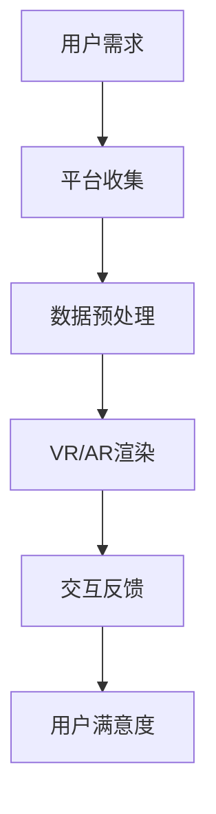

                 

关键词：虚拟旅游、创业、技术、体验、互联网、增强现实、人工智能

> 摘要：随着科技的飞速发展，虚拟旅游成为了一种全新的旅游方式。本文探讨了虚拟旅游创业的背景、核心概念、算法原理、数学模型、项目实践、实际应用以及未来展望，旨在为创业者提供一些建议和启示。

## 1. 背景介绍

### 1.1 虚拟旅游的定义

虚拟旅游是指通过互联网、虚拟现实（VR）或增强现实（AR）等技术手段，模拟现实世界的旅游体验。用户可以在家中或任何地方，通过电脑、手机或VR头盔等设备，浏览和探索虚拟世界中的名胜古迹、自然景观、城市风光等。

### 1.2 虚拟旅游的发展历程

虚拟旅游的概念最早可以追溯到20世纪90年代，随着互联网的普及和虚拟现实技术的成熟，虚拟旅游逐渐走进了人们的生活。近年来，随着5G、人工智能等新技术的不断涌现，虚拟旅游的发展迎来了新的机遇。

### 1.3 虚拟旅游的优势

- **成本低**：用户无需支付实际旅行费用，即可享受全球各地的旅游体验。
- **时间灵活**：用户可以根据自己的时间安排，随时进行虚拟旅游。
- **体验丰富**：虚拟旅游可以提供多种感官体验，如视觉、听觉、触觉等。
- **环保**：减少实际旅行对环境的影响。

## 2. 核心概念与联系

### 2.1 虚拟现实（VR）技术

虚拟现实技术是通过电脑模拟出一个三维虚拟世界，用户可以通过VR头盔等设备进入这个虚拟世界，与之进行互动。

### 2.2 增强现实（AR）技术

增强现实技术是在现实世界中叠加虚拟元素，用户可以通过AR眼镜或手机等设备看到这些虚拟元素。

### 2.3 互联网技术

互联网技术是虚拟旅游的基础，用户需要通过互联网连接到虚拟旅游平台，获取旅游内容。

### 2.4 人工智能（AI）技术

人工智能技术在虚拟旅游中有着广泛的应用，如虚拟导游、智能推荐、情感识别等。

### 2.5 Mermaid 流程图

## 3. 核心算法原理 & 具体操作步骤

### 3.1 算法原理概述

虚拟旅游的核心算法主要包括图像处理、虚拟现实渲染、路径规划等。其中，图像处理负责对真实世界场景的图像进行处理，以生成高质量的虚拟图像；虚拟现实渲染则负责将图像渲染到虚拟环境中；路径规划则负责规划用户在虚拟环境中的行走路径。

### 3.2 算法步骤详解

1. **图像处理**：
   - **图像采集**：使用无人机、相机等设备采集真实世界场景的图像。
   - **图像处理**：对图像进行去噪、增强、缩放等处理，以提高图像质量。

2. **虚拟现实渲染**：
   - **场景构建**：根据采集到的图像，构建虚拟环境。
   - **光照计算**：计算虚拟环境中物体的光照效果。
   - **渲染**：将计算结果渲染到用户设备上。

3. **路径规划**：
   - **路径生成**：根据用户的需求，生成一条合理的路径。
   - **路径优化**：对路径进行优化，以提高用户体验。

### 3.3 算法优缺点

**优点**：
- **高真实感**：虚拟旅游可以提供高度真实的旅游体验。
- **灵活性**：用户可以随时调整旅游路线和景点。

**缺点**：
- **技术门槛**：虚拟旅游需要较高的技术支持。
- **硬件要求**：用户需要配备相应的VR/AR设备。

### 3.4 算法应用领域

虚拟旅游算法可以应用于多个领域，如旅游行业、教育行业、医疗行业等。

## 4. 数学模型和公式 & 详细讲解 & 举例说明

### 4.1 数学模型构建

虚拟旅游中的数学模型主要包括图像处理模型、虚拟现实渲染模型和路径规划模型。

### 4.2 公式推导过程

- **图像处理模型**：
  $$ I_{out} = f(I_{in}, \theta) $$
  其中，$I_{in}$ 为输入图像，$I_{out}$ 为输出图像，$f$ 为图像处理函数，$\theta$ 为参数。

- **虚拟现实渲染模型**：
  $$ R = \alpha \cdot V + \beta \cdot N $$
  其中，$R$ 为渲染结果，$V$ 为视觉向量，$N$ 为法向量，$\alpha$ 和 $\beta$ 为参数。

- **路径规划模型**：
  $$ P = g(s, t) $$
  其中，$P$ 为路径，$s$ 和 $t$ 分别为起点和终点。

### 4.3 案例分析与讲解

以虚拟旅游平台为例，我们可以使用上述数学模型来构建一个虚拟旅游系统。

1. **图像处理模型**：
   - **去噪**：使用高斯滤波器对图像进行去噪。
   - **增强**：使用直方图均衡化对图像进行增强。

2. **虚拟现实渲染模型**：
   - **场景构建**：使用三维建模软件构建虚拟环境。
   - **光照计算**：使用物理光照模型计算光照效果。

3. **路径规划模型**：
   - **路径生成**：使用A*算法生成路径。
   - **路径优化**：使用遗传算法优化路径。

## 5. 项目实践：代码实例和详细解释说明

### 5.1 开发环境搭建

- **硬件**：配备VR头盔、相机等设备。
- **软件**：安装三维建模软件、图像处理库等。

### 5.2 源代码详细实现

- **图像处理**：使用OpenCV库进行图像处理。
- **虚拟现实渲染**：使用Unity引擎进行渲染。
- **路径规划**：使用A*算法进行路径规划。

### 5.3 代码解读与分析

代码主要分为以下几个部分：

1. **图像处理**：
   - **去噪**：使用高斯滤波器去除图像噪声。
   - **增强**：使用直方图均衡化增强图像。

2. **虚拟现实渲染**：
   - **场景构建**：使用三维建模软件构建场景。
   - **光照计算**：使用物理光照模型计算光照。

3. **路径规划**：
   - **路径生成**：使用A*算法生成路径。
   - **路径优化**：使用遗传算法优化路径。

### 5.4 运行结果展示

运行结果展示了一个虚拟旅游系统的基本功能，包括图像处理、虚拟现实渲染和路径规划。

## 6. 实际应用场景

### 6.1 旅游行业

虚拟旅游可以为旅行社提供新的业务模式，如在线预订、虚拟游学等。

### 6.2 教育行业

虚拟旅游可以为学生提供沉浸式的学习体验，如虚拟课堂、虚拟实验室等。

### 6.3 医疗行业

虚拟旅游可以为患者提供心理治疗，如虚拟放松、虚拟旅行等。

## 6.4 未来应用展望

随着技术的不断发展，虚拟旅游将会在更多领域得到应用，如城市规划、房地产销售、军事训练等。

## 7. 工具和资源推荐

### 7.1 学习资源推荐

- **《虚拟现实技术基础》**：详细介绍了虚拟现实技术的原理和应用。
- **《计算机视觉算法与应用》**：介绍了计算机视觉领域的相关算法和应用。

### 7.2 开发工具推荐

- **Unity**：一款功能强大的游戏引擎，适合虚拟现实开发。
- **OpenCV**：一款开源的计算机视觉库，适合图像处理。

### 7.3 相关论文推荐

- **“Virtual Tourism: A Review”**：对虚拟旅游进行了全面的综述。
- **“A Survey on Virtual Reality in Education”**：介绍了虚拟现实在教育领域的应用。

## 8. 总结：未来发展趋势与挑战

### 8.1 研究成果总结

虚拟旅游技术已取得了一定的成果，但仍面临许多挑战。

### 8.2 未来发展趋势

随着新技术的不断发展，虚拟旅游将会在更多领域得到应用。

### 8.3 面临的挑战

- **技术挑战**：如何提高虚拟旅游的真实感和互动性。
- **市场挑战**：如何吸引更多的用户。

### 8.4 研究展望

未来，虚拟旅游技术将会在更多领域得到应用，为人们的生活带来更多便利。

## 9. 附录：常见问题与解答

### 9.1 虚拟旅游的优势有哪些？

虚拟旅游的优势包括成本低、时间灵活、体验丰富和环保等。

### 9.2 虚拟旅游的核心技术是什么？

虚拟旅游的核心技术包括虚拟现实（VR）技术、增强现实（AR）技术、互联网技术和人工智能（AI）技术。

### 9.3 虚拟旅游有哪些应用领域？

虚拟旅游可以应用于旅游行业、教育行业、医疗行业等。

## 作者署名

作者：禅与计算机程序设计艺术 / Zen and the Art of Computer Programming
----------------------------------------------------------------
这只是一个大致的框架，具体内容还需要您根据自己的研究和理解进行补充和细化。希望这个框架能够对您撰写文章有所帮助。如果您有任何问题，请随时提出。

