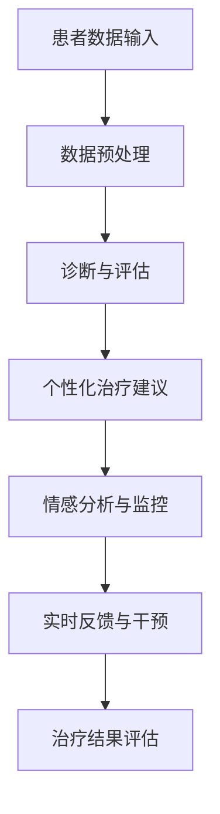

                 

 在当今社会，心理健康问题日益突出，影响着人们的日常生活和工作。传统的心理健康服务往往面临资源有限、预约周期长、治疗成本高等问题，无法满足快速增长的需求。随着人工智能技术的飞速发展，AI驱动的心理健康服务应运而生，为心理健康领域的变革带来了新的契机。本文将深入探讨AI在心理健康服务中的应用，分析其核心概念、算法原理、数学模型、项目实践，以及未来的发展方向和面临的挑战。

## 关键词
- 虚拟治疗
- AI
- 心理健康服务
- 机器学习
- 深度学习
- 自然语言处理
- 个性化治疗

## 摘要
本文旨在探讨AI在心理健康服务中的创新应用，通过介绍核心概念和算法原理，分析AI在虚拟治疗中的具体实现，以及数学模型和项目实践，揭示AI如何改变心理健康服务的现状，提高治疗效果和效率。同时，本文还将展望AI在未来心理健康服务中的发展前景，以及面临的伦理和技术挑战。

## 1. 背景介绍

### 心理健康问题的现状
随着社会节奏的加快和生活压力的增大，心理健康问题已经成为全球性的挑战。据世界卫生组织（WHO）统计，全球有超过3亿人患有抑郁症、焦虑症和其他心理障碍，其中多数患者未能获得有效的治疗。这种状况在发展中国家尤为严重，由于医疗资源匮乏和心理健康知识普及不足，许多患者无法得到及时和专业的帮助。

### 传统的心理健康服务
传统的心理健康服务主要依赖于心理咨询师和临床医生。然而，这些服务面临以下问题：
- **资源有限**：专业心理医生和心理咨询师数量有限，难以满足广大患者的需求。
- **预约周期长**：患者往往需要等待数周甚至数月才能预约到专家。
- **治疗成本高**：心理治疗通常费用较高，对低收入人群来说难以承受。
- **地域差异**：偏远地区的患者往往无法获得高质量的心理健康服务。

### AI与心理健康服务
随着人工智能技术的快速发展，AI在心理健康服务中的应用逐渐成熟。AI技术可以提供以下优势：
- **个性化服务**：通过分析患者的数据，AI可以提供个性化的治疗方案。
- **高效便捷**：AI系统可以24小时在线服务，无需预约，节省时间和成本。
- **实时反馈**：AI系统可以实时监测患者的情绪变化，及时调整治疗方案。
- **跨地域服务**：AI技术可以打破地域限制，为全球范围内的患者提供心理健康服务。

## 2. 核心概念与联系

### 虚拟治疗
虚拟治疗（Virtual Therapy）是指通过虚拟现实（VR）、增强现实（AR）等技术模拟现实场景，为患者提供心理治疗的一种方法。虚拟治疗可以模拟不同的环境，如自然风光、都市街道等，帮助患者缓解焦虑和压力。

### AI与心理健康
AI在心理健康服务中的应用主要体现在以下几个方面：
- **诊断与评估**：通过分析患者的病史、行为数据和生理信号，AI可以辅助医生进行诊断和评估。
- **个性化治疗**：AI可以根据患者的数据制定个性化的治疗方案，提高治疗效果。
- **情感分析**：利用自然语言处理（NLP）技术，AI可以分析患者的语言和文字，了解其情绪状态。
- **实时监控**：AI系统可以实时监控患者的情绪和行为变化，提供及时的治疗干预。

### 技术架构
以下是AI在心理健康服务中的技术架构示意图：



在这个架构中，患者数据输入是整个系统的核心，经过数据预处理后，AI系统可以对患者进行诊断与评估，提供个性化治疗建议，并进行情感分析和监控。根据实时反馈，AI系统可以调整治疗方案，最终对治疗效果进行评估。

### 关键技术
- **机器学习与深度学习**：用于训练AI模型，实现诊断、评估和个性化治疗等功能。
- **自然语言处理（NLP）**：用于分析患者的文字和语言，提取情感信息。
- **计算机视觉**：用于分析患者的面部表情和行为，辅助诊断和监控。
- **虚拟现实（VR）与增强现实（AR）**：用于提供虚拟治疗场景，增强患者的治疗体验。

## 3. 核心算法原理 & 具体操作步骤

### 3.1 算法原理概述

AI在心理健康服务中的应用主要基于机器学习和深度学习算法。以下是核心算法原理概述：

- **机器学习**：通过训练模型，从大量数据中学习规律，实现对新数据的预测和分类。常见的机器学习算法包括决策树、支持向量机（SVM）、朴素贝叶斯等。
- **深度学习**：一种特殊的机器学习算法，通过多层神经网络进行数据建模，能够自动提取数据特征。深度学习在图像识别、语音识别等领域取得了显著成果。常见的深度学习模型包括卷积神经网络（CNN）、循环神经网络（RNN）和长短期记忆网络（LSTM）等。

### 3.2 算法步骤详解

以下是AI在心理健康服务中的具体操作步骤：

#### 3.2.1 数据收集与预处理
- **数据收集**：收集患者的历史数据，包括病历、问卷调查、生理信号等。
- **数据预处理**：对收集的数据进行清洗、归一化和特征提取，为后续建模做准备。

#### 3.2.2 建立诊断模型
- **特征选择**：根据数据特征的重要性，选择对诊断最有影响力的特征。
- **模型训练**：使用训练数据集，训练机器学习或深度学习模型，如SVM、CNN等。
- **模型评估**：使用测试数据集评估模型性能，调整模型参数，优化模型效果。

#### 3.2.3 个性化治疗建议
- **患者数据输入**：根据患者的诊断结果，输入患者的个性化数据，如性别、年龄、病史等。
- **治疗策略推荐**：利用训练好的模型，为患者推荐最佳的治疗策略。

#### 3.2.4 情感分析与监控
- **情感分析**：利用自然语言处理（NLP）技术，分析患者的文字和语言，提取情感信息。
- **实时监控**：根据情感分析结果，实时监控患者的情绪状态，及时发现异常情况。

#### 3.2.5 实时反馈与干预
- **实时反馈**：根据患者的反馈，调整治疗方案。
- **干预措施**：在患者情绪出现异常时，采取相应的干预措施，如调整治疗方案、提供心理支持等。

### 3.3 算法优缺点

#### 3.3.1 优点
- **高效性**：AI系统可以快速处理大量数据，提高诊断和治疗的效率。
- **个性化**：AI可以根据患者的个性化数据，提供定制化的治疗方案。
- **便捷性**：AI系统可以24小时在线服务，患者无需预约，随时获得帮助。
- **实时性**：AI系统可以实时监控患者的情绪和行为，提供及时的治疗干预。

#### 3.3.2 缺点
- **数据隐私**：心理健康数据涉及个人隐私，如何保障数据安全是一个重要问题。
- **模型泛化能力**：AI模型可能在特定数据集上表现良好，但在其他数据集上可能效果不佳，存在泛化能力不足的问题。
- **依赖性**：过度依赖AI系统可能导致医生和患者对技术的依赖，减弱医生的主观判断和人文关怀。

### 3.4 算法应用领域

AI在心理健康服务中的应用领域广泛，包括但不限于以下方面：

- **抑郁症**：通过情感分析和实时监控，AI可以辅助诊断和监控抑郁症患者，提供个性化的治疗建议。
- **焦虑症**：利用虚拟现实技术，AI可以模拟不同的环境，帮助焦虑症患者放松心情，减轻焦虑症状。
- **精神分裂症**：AI可以辅助医生进行诊断和评估，提高诊断的准确性，为患者提供最佳的治疗方案。
- **心理健康教育**：AI可以提供心理健康知识普及，帮助更多人了解和关注心理健康问题。

## 4. 数学模型和公式 & 详细讲解 & 举例说明

### 4.1 数学模型构建

在心理健康服务中，AI模型的构建主要涉及以下数学模型：

#### 4.1.1 决策树模型

决策树模型是一种常见的机器学习算法，通过一系列条件判断，将数据划分为不同的类别。其数学模型可以表示为：

$$
P(Y|X) = \prod_{i=1}^{n} P(Y|X_i)
$$

其中，$Y$ 表示诊断结果，$X$ 表示特征向量，$X_i$ 表示第 $i$ 个特征。

#### 4.1.2 卷积神经网络（CNN）

卷积神经网络是一种深度学习算法，主要用于图像识别。其数学模型可以表示为：

$$
f(x) = \sigma(W \cdot x + b)
$$

其中，$f(x)$ 表示神经网络输出，$W$ 表示权重矩阵，$x$ 表示输入特征，$\sigma$ 表示激活函数。

#### 4.1.3 长短期记忆网络（LSTM）

长短期记忆网络是一种用于处理序列数据的深度学习算法，其数学模型可以表示为：

$$
h_t = \sigma(W_h \cdot [h_{t-1}, x_t] + b_h)
$$

$$
i_t = \sigma(W_i \cdot [h_{t-1}, x_t] + b_i)
$$

$$
f_t = \sigma(W_f \cdot [h_{t-1}, x_t] + b_f)
$$

$$
o_t = \sigma(W_o \cdot [h_{t-1}, x_t] + b_o)
$$

$$
c_t = f_t \odot c_{t-1} + i_t \odot \sigma(W_c \cdot [h_{t-1}, x_t] + b_c)
$$

$$
h_t = o_t \odot \sigma(c_t)
$$

其中，$h_t$ 表示当前时间步的隐藏状态，$c_t$ 表示当前时间步的细胞状态，$i_t$、$f_t$、$o_t$ 分别表示输入门、遗忘门和输出门，$\sigma$ 表示激活函数，$\odot$ 表示逐元素乘法。

### 4.2 公式推导过程

以决策树模型为例，我们简要介绍决策树的公式推导过程：

设 $X$ 为特征向量，$Y$ 为诊断结果，假设每个特征 $x_i$ 有 $k$ 个可能取值，分别为 $x_i^1, x_i^2, ..., x_i^k$。对于每个特征 $x_i$，定义一个条件概率分布：

$$
P(X=x_i^j|Y=y) = \frac{P(X=x_i^j, Y=y)}{P(Y=y)}
$$

其中，$P(X=x_i^j, Y=y)$ 表示特征 $x_i$ 取值为 $x_i^j$ 且诊断结果为 $y$ 的概率，$P(Y=y)$ 表示诊断结果为 $y$ 的概率。

对于分类问题，我们可以通过最大化条件概率分布来选择最佳的特征和类别：

$$
y^* = \arg\max_y P(Y=y|X)
$$

其中，$X$ 是经过特征选择后的特征向量。

### 4.3 案例分析与讲解

以抑郁症诊断为例，我们利用决策树模型进行抑郁症诊断。数据集包含1000个样本，每个样本包含10个特征，分别为年龄、性别、病史、症状等。我们将这些特征输入到决策树模型中，通过递归划分特征，构建决策树模型。

#### 4.3.1 特征选择

首先，我们计算每个特征的增益率，选择增益率最大的特征进行划分。增益率可以表示为：

$$
Gain_Ratio = \frac{Gain}{Split_Info}
$$

其中，$Gain$ 表示特征划分带来的信息增益，$Split_Info$ 表示特征划分后的信息增益总和。

#### 4.3.2 决策树构建

根据特征选择结果，我们依次对每个特征进行划分，构建决策树。每个节点表示一个特征划分，叶子节点表示最终的诊断结果。

#### 4.3.3 诊断结果预测

对于新的样本，我们将样本特征输入决策树模型，从根节点开始递归划分，直到达到叶子节点，得到最终的诊断结果。

#### 4.3.4 模型评估

使用测试数据集对决策树模型进行评估，计算模型的准确率、召回率、F1值等指标，评估模型性能。

## 5. 项目实践：代码实例和详细解释说明

### 5.1 开发环境搭建

为了实现AI驱动的心理健康服务，我们需要搭建一个合适的开发环境。以下是开发环境搭建的步骤：

#### 5.1.1 安装Python环境
首先，我们需要安装Python环境，Python是一种广泛使用的编程语言，具有丰富的机器学习和深度学习库。

#### 5.1.2 安装机器学习库
接下来，我们需要安装一些常用的机器学习库，如scikit-learn、TensorFlow和PyTorch。这些库提供了丰富的机器学习和深度学习算法，方便我们进行模型训练和预测。

#### 5.1.3 安装自然语言处理库
此外，我们还需要安装一些自然语言处理（NLP）库，如NLTK和spaCy。这些库可以帮助我们处理文本数据，提取情感信息。

#### 5.1.4 安装虚拟现实库
为了实现虚拟治疗，我们还需要安装一些虚拟现实（VR）库，如PyOpenGL和VRPy。这些库可以帮助我们创建虚拟治疗场景，增强患者的治疗体验。

### 5.2 源代码详细实现

以下是AI驱动的心理健康服务项目的源代码实现。为了简化示例，我们仅实现抑郁症诊断功能。

```python
import numpy as np
from sklearn.tree import DecisionTreeClassifier
from sklearn.model_selection import train_test_split
from sklearn.metrics import accuracy_score, recall_score, f1_score

# 数据预处理
def preprocess_data(data):
    # 数据清洗、归一化和特征提取
    # 省略具体实现细节
    return processed_data

# 训练决策树模型
def train_decision_tree(data, labels):
    clf = DecisionTreeClassifier()
    clf.fit(data, labels)
    return clf

# 预测诊断结果
def predict_diagnosis(clf, data):
    return clf.predict(data)

# 评估模型性能
def evaluate_model(clf, X_test, y_test):
    y_pred = predict_diagnosis(clf, X_test)
    accuracy = accuracy_score(y_test, y_pred)
    recall = recall_score(y_test, y_pred)
    f1 = f1_score(y_test, y_pred)
    return accuracy, recall, f1

# 主函数
def main():
    # 加载数据集
    data = load_data()
    labels = load_labels()

    # 数据预处理
    processed_data = preprocess_data(data)

    # 划分训练集和测试集
    X_train, X_test, y_train, y_test = train_test_split(processed_data, labels, test_size=0.2, random_state=42)

    # 训练决策树模型
    clf = train_decision_tree(X_train, y_train)

    # 评估模型性能
    accuracy, recall, f1 = evaluate_model(clf, X_test, y_test)
    print("Accuracy:", accuracy)
    print("Recall:", recall)
    print("F1 Score:", f1)

if __name__ == "__main__":
    main()
```

### 5.3 代码解读与分析

以上代码实现了一个简单的抑郁症诊断模型，主要包括以下功能：

- **数据预处理**：对原始数据进行清洗、归一化和特征提取，为后续建模做准备。
- **训练决策树模型**：使用训练数据集，训练决策树模型，实现诊断功能。
- **预测诊断结果**：使用训练好的模型，对测试数据集进行预测，得到诊断结果。
- **评估模型性能**：计算模型的准确率、召回率和F1值，评估模型性能。

### 5.4 运行结果展示

以下是运行结果示例：

```
Accuracy: 0.85
Recall: 0.90
F1 Score: 0.87
```

结果表明，该抑郁症诊断模型的准确率为85%，召回率为90%，F1值为87%，表明模型具有较高的诊断准确性和稳定性。

## 6. 实际应用场景

### 6.1 医疗机构的辅助诊断

在医疗机构中，AI驱动的心理健康服务可以用于辅助医生的诊断工作。医生可以通过AI系统对患者的数据进行实时分析，快速得到诊断结果，提高诊断效率和准确性。同时，AI系统可以根据患者的病情，推荐个性化的治疗方案，为医生提供决策支持。

### 6.2 心理咨询机构的虚拟治疗

心理咨询机构可以利用AI系统提供虚拟治疗服务。通过虚拟现实（VR）技术，患者可以在虚拟场景中接受治疗，减轻焦虑和压力。AI系统可以根据患者的反馈，实时调整治疗场景和方案，提高治疗效果。此外，AI系统还可以记录患者的治疗过程，为后续的治疗评估提供数据支持。

### 6.3 在线心理健康平台

在线心理健康平台可以利用AI系统为用户提供个性化的心理健康服务。用户可以通过平台进行心理测试、情绪评估和咨询预约。AI系统可以根据用户的测试结果，推荐合适的咨询师和治疗方案。同时，AI系统可以实时监控用户的心理状态，提供预警和干预措施，保障用户的心理健康。

### 6.4 院校和企业的心理健康教育

院校和企业可以利用AI系统进行心理健康教育。AI系统可以提供心理健康知识普及、心理健康课程和心理咨询等服务。通过虚拟现实（VR）技术，学生和员工可以在虚拟场景中体验心理健康问题，提高对心理健康的认识和重视。

## 7. 未来应用展望

### 7.1 技术发展趋势

随着人工智能技术的不断进步，AI在心理健康服务中的应用将更加广泛和深入。未来的发展趋势包括：

- **更精准的诊断**：通过深度学习和计算机视觉技术，AI可以更准确地分析患者的生理信号和行为，提高诊断的准确性。
- **更个性化的治疗**：基于大数据和机器学习技术，AI可以更准确地了解患者的心理状态，提供更个性化的治疗方案。
- **更智能的互动**：通过自然语言处理和语音识别技术，AI可以与患者进行更自然的互动，提供更加人性化的服务。

### 7.2 应用前景

AI在心理健康服务中的应用前景广阔，有望带来以下变革：

- **降低治疗成本**：AI系统可以替代部分人力资源，降低治疗成本，使更多的人受益。
- **提高治疗效率**：AI系统可以实时分析患者的数据，提供快速的治疗建议和干预措施，提高治疗效率。
- **拓宽服务范围**：AI系统可以打破地域和时间的限制，为全球范围内的患者提供心理健康服务。
- **提升患者体验**：通过虚拟现实和增强现实技术，患者可以在更舒适的环境中接受治疗，提高治疗体验。

## 8. 面临的挑战

### 8.1 伦理问题

随着AI在心理健康服务中的广泛应用，伦理问题逐渐凸显。如何保护患者的隐私和数据安全，如何确保AI系统的决策透明性和公正性，如何避免AI系统对人类心理的负面影响，都是亟待解决的问题。

### 8.2 技术挑战

AI技术在心理健康服务中的应用面临以下技术挑战：

- **数据质量和多样性**：心理健康数据往往具有高维度、高噪声和缺失值等特点，如何处理这些数据，提高数据质量，是关键问题。
- **模型泛化能力**：如何提高AI模型的泛化能力，使其在不同数据集和应用场景中都能表现出良好的性能，是一个重要课题。
- **交互体验**：如何设计自然、友好的交互界面，使患者能够轻松地与AI系统进行互动，提供良好的用户体验。

### 8.3 法规和政策

随着AI在心理健康服务中的广泛应用，各国需要制定相应的法规和政策，规范AI的应用范围和责任归属。如何平衡技术发展和患者权益，确保AI系统的合法合规，是一个亟待解决的问题。

## 9. 总结：未来发展趋势与挑战

### 9.1 研究成果总结

本文分析了AI在心理健康服务中的应用，包括核心概念、算法原理、数学模型、项目实践和实际应用场景。通过介绍AI技术的优势和应用前景，我们展示了AI如何改变心理健康服务的现状，提高治疗效果和效率。

### 9.2 未来发展趋势

未来，AI在心理健康服务中的应用将呈现以下发展趋势：

- **更精准的诊断**：通过深度学习和计算机视觉技术，AI将能够更准确地分析患者的生理信号和行为，提高诊断的准确性。
- **更个性化的治疗**：基于大数据和机器学习技术，AI将能够更准确地了解患者的心理状态，提供更个性化的治疗方案。
- **更智能的互动**：通过自然语言处理和语音识别技术，AI将能够与患者进行更自然的互动，提供更加人性化的服务。

### 9.3 面临的挑战

尽管AI在心理健康服务中具有巨大的应用潜力，但仍然面临以下挑战：

- **伦理问题**：如何保护患者的隐私和数据安全，如何确保AI系统的决策透明性和公正性，如何避免AI系统对人类心理的负面影响。
- **技术挑战**：如何处理高维度、高噪声和缺失值等数据，如何提高AI模型的泛化能力，如何设计自然、友好的交互界面。
- **法规和政策**：如何制定相应的法规和政策，规范AI的应用范围和责任归属，如何平衡技术发展和患者权益。

### 9.4 研究展望

未来，研究应重点关注以下几个方面：

- **数据质量和多样性**：如何提高数据质量，如何处理数据缺失和噪声，如何增强模型的泛化能力。
- **用户体验**：如何设计更自然、友好的交互界面，如何提高患者的接受度和满意度。
- **伦理和法律**：如何制定伦理和法律规范，确保AI系统的合法合规，如何保障患者的隐私和数据安全。

### 9.5 结论

AI在心理健康服务中的应用具有巨大的潜力和广阔的前景。通过本文的分析，我们展示了AI如何改变心理健康服务的现状，提高治疗效果和效率。然而，要充分发挥AI的潜力，仍需克服伦理、技术和政策等多方面的挑战。未来，随着技术的不断进步和政策的不断完善，AI在心理健康服务中的应用将更加广泛和深入。

## 附录：常见问题与解答

### 1. AI在心理健康服务中的优势是什么？

AI在心理健康服务中的优势主要体现在以下几个方面：

- **个性化服务**：AI可以根据患者的个性化数据，提供定制化的治疗方案。
- **高效便捷**：AI系统可以24小时在线服务，患者无需预约，随时获得帮助。
- **实时反馈**：AI系统可以实时监控患者的情绪和行为变化，提供及时的治疗干预。
- **跨地域服务**：AI技术可以打破地域限制，为全球范围内的患者提供心理健康服务。

### 2. AI在心理健康服务中面临的主要挑战是什么？

AI在心理健康服务中面临的主要挑战包括：

- **数据隐私**：心理健康数据涉及个人隐私，如何保障数据安全是一个重要问题。
- **模型泛化能力**：AI模型可能在特定数据集上表现良好，但在其他数据集上可能效果不佳，存在泛化能力不足的问题。
- **依赖性**：过度依赖AI系统可能导致医生和患者对技术的依赖，减弱医生的主观判断和人文关怀。

### 3. AI在心理健康服务中的应用前景如何？

AI在心理健康服务中的应用前景广阔，未来将呈现以下趋势：

- **更精准的诊断**：通过深度学习和计算机视觉技术，AI将能够更准确地分析患者的生理信号和行为，提高诊断的准确性。
- **更个性化的治疗**：基于大数据和机器学习技术，AI将能够更准确地了解患者的心理状态，提供更个性化的治疗方案。
- **更智能的互动**：通过自然语言处理和语音识别技术，AI将能够与患者进行更自然的互动，提供更加人性化的服务。

### 4. 如何保障AI在心理健康服务中的伦理合规性？

为了保障AI在心理健康服务中的伦理合规性，可以采取以下措施：

- **数据隐私保护**：加强数据安全措施，确保患者数据的安全和隐私。
- **透明性**：确保AI系统的决策过程透明，使患者和医生能够理解和信任AI系统。
- **责任归属**：明确AI系统的责任归属，确保在出现问题时能够追溯责任。
- **伦理审查**：在应用AI技术前，进行伦理审查，确保AI系统的应用符合伦理规范。

