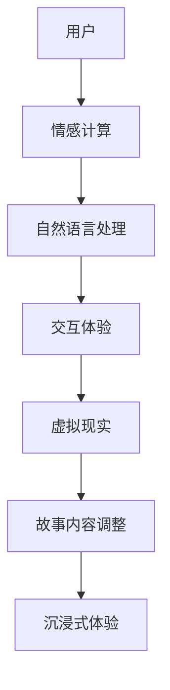

                 

 关键词：虚拟现实，AI叙事，沉浸式体验，故事讲述，人机交互，交互设计，情感计算，多媒体技术

> 摘要：本文探讨了虚拟现实（VR）与人工智能（AI）在叙事领域的结合，分析了如何利用AI实现更加沉浸式的故事体验。通过介绍核心概念、算法原理、数学模型、项目实践等多个方面，本文揭示了这一新兴领域的潜力和挑战，并展望了未来的发展趋势。

## 1. 背景介绍

### 虚拟现实与人工智能的发展历程

虚拟现实（Virtual Reality，VR）与人工智能（Artificial Intelligence，AI）作为当今科技领域的两大热点，近年来得到了迅猛的发展。VR技术通过创造一个逼真的虚拟环境，使用户能够沉浸在完全不同的世界中，而AI则通过模拟人类的智能行为，为用户提供了更加智能化的交互体验。

#### 虚拟现实的发展

VR技术起源于20世纪50年代，早期的VR装置主要基于头戴显示器（Head-Mounted Display，HMD）和传感器技术。进入21世纪，随着计算机性能的提升和显示技术的进步，VR技术逐渐走向成熟。2010年后，VR市场迎来了爆发式增长，Facebook旗下的Oculus、谷歌的Cardboard等一系列产品相继问世，使得VR设备逐渐走进了大众的视野。

#### 人工智能的发展

人工智能起源于20世纪50年代，经历了多次起伏，如今已经进入了深度学习和大数据时代。AI技术的发展使得机器能够进行自然语言处理、图像识别、智能决策等多种任务，为各个领域带来了革命性的变革。尤其是在人机交互和多媒体处理方面，AI的应用越来越广泛。

### 虚拟现实与人工智能的结合

随着VR和AI技术的不断进步，二者之间的结合成为了研究的热点。虚拟现实为用户提供了沉浸式体验，而人工智能则为用户提供了更加智能化的互动。这种结合不仅能够提升用户的体验，还能够创造出全新的故事形式和叙事方式。

## 2. 核心概念与联系

### 虚拟现实与AI叙事的基本概念

#### 虚拟现实（VR）

虚拟现实是一种通过计算机技术模拟出一个三维虚拟世界，使用户能够沉浸其中并进行交互体验的技术。VR的核心技术包括头戴显示器（HMD）、位置追踪、三维声音和触觉反馈等。

#### 人工智能（AI）

人工智能是模拟人类智能行为的计算机技术，包括机器学习、深度学习、自然语言处理、图像识别等领域。在叙事领域，AI主要应用于情感计算、对话系统和个性化推荐等方面。

#### AI叙事

AI叙事是指利用人工智能技术来生成、编辑和优化故事内容，从而实现更加个性化和沉浸式的叙事体验。AI叙事的核心技术包括自然语言生成、情感计算和用户行为分析等。

### 虚拟现实与AI叙事的联系

虚拟现实为AI叙事提供了沉浸式的场景，而AI叙事则为虚拟现实提供了更加智能化的互动体验。具体来说，二者之间的联系体现在以下几个方面：

1. **情感计算**：通过情感计算技术，AI可以分析用户的情感状态，并根据用户情感调整叙事内容和交互方式，提升用户的沉浸感。
2. **自然语言处理**：AI可以生成自然流畅的对话，为用户带来更加真实的互动体验。
3. **个性化推荐**：基于用户行为分析，AI可以为用户提供个性化的故事推荐，提升用户满意度。

### Mermaid流程图



## 3. 核心算法原理 & 具体操作步骤

### 3.1 算法原理概述

虚拟现实与AI叙事的核心算法主要包括情感计算、自然语言生成和用户行为分析等。以下是这些算法的基本原理：

#### 情感计算

情感计算是通过分析用户的情感状态，来调整叙事内容和交互方式。其基本原理包括：

1. **情感识别**：通过面部表情、语音、生理信号等来识别用户的情感状态。
2. **情感分析**：利用机器学习算法对情感信号进行分类和识别。
3. **情感调整**：根据用户的情感状态，调整叙事内容和交互方式，以提升用户的沉浸感。

#### 自然语言生成

自然语言生成是通过计算机程序自动生成自然语言文本。其基本原理包括：

1. **语法规则**：根据语法规则生成文本。
2. **语料库**：利用大规模语料库来训练模型，生成自然流畅的文本。
3. **上下文理解**：通过上下文信息来调整文本内容，使其更加符合用户需求。

#### 用户行为分析

用户行为分析是通过分析用户在虚拟环境中的行为，来优化叙事内容和交互体验。其基本原理包括：

1. **行为记录**：记录用户在虚拟环境中的行为数据。
2. **行为分析**：利用机器学习算法对行为数据进行分析，识别用户的兴趣和行为模式。
3. **内容调整**：根据用户的行为模式，调整叙事内容和交互方式，提升用户满意度。

### 3.2 算法步骤详解

#### 情感计算

1. **数据收集**：收集用户的情感数据，如面部表情、语音、生理信号等。
2. **情感识别**：利用情感识别算法对情感数据进行分类和识别。
3. **情感分析**：根据情感识别结果，分析用户的情感状态。
4. **情感调整**：根据用户的情感状态，调整叙事内容和交互方式。

#### 自然语言生成

1. **文本生成**：利用自然语言生成算法生成文本。
2. **文本优化**：根据上下文信息，优化文本内容，使其更加符合用户需求。
3. **交互生成**：根据用户行为，生成合适的交互文本。

#### 用户行为分析

1. **行为记录**：记录用户在虚拟环境中的行为数据。
2. **行为分析**：利用机器学习算法，分析用户的行为模式。
3. **内容调整**：根据用户的行为模式，调整叙事内容和交互方式。

### 3.3 算法优缺点

#### 情感计算

**优点**：能够根据用户的情感状态，调整叙事内容和交互方式，提升用户的沉浸感。

**缺点**：情感计算技术尚不成熟，识别精度有待提高。

#### 自然语言生成

**优点**：能够自动生成自然流畅的文本，降低人力成本。

**缺点**：生成的文本可能缺乏情感和个性，难以满足用户需求。

#### 用户行为分析

**优点**：能够根据用户的行为模式，优化叙事内容和交互方式，提升用户满意度。

**缺点**：对用户隐私的保护尚需完善。

### 3.4 算法应用领域

#### 情感计算

应用领域包括：虚拟现实游戏、教育、医疗等。

#### 自然语言生成

应用领域包括：虚拟助手、智能客服、智能写作等。

#### 用户行为分析

应用领域包括：虚拟现实、电商、社交网络等。

## 4. 数学模型和公式 & 详细讲解 & 举例说明

### 4.1 数学模型构建

虚拟现实与AI叙事的核心数学模型主要包括情感计算模型、自然语言生成模型和用户行为分析模型等。

#### 情感计算模型

情感计算模型通常基于情感分类模型，如支持向量机（SVM）、神经网络等。以下是一个简单的情感分类模型：

$$
\begin{aligned}
\text{情感分类模型：} \\
&\text{输入：用户的情感信号} \\
&\text{输出：用户的情感类别} \\
&f(\text{情感信号}) = \text{分类器}
\end{aligned}
$$

#### 自然语言生成模型

自然语言生成模型通常基于序列到序列（Seq2Seq）模型，如循环神经网络（RNN）或长短期记忆网络（LSTM）。以下是一个简单的自然语言生成模型：

$$
\begin{aligned}
\text{自然语言生成模型：} \\
&\text{输入：上下文序列} \\
&\text{输出：生成的文本序列} \\
&g(\text{上下文序列}) = \text{生成器}
\end{aligned}
$$

#### 用户行为分析模型

用户行为分析模型通常基于分类模型，如决策树、随机森林等。以下是一个简单的用户行为分析模型：

$$
\begin{aligned}
\text{用户行为分析模型：} \\
&\text{输入：用户行为数据} \\
&\text{输出：用户行为类别} \\
&h(\text{用户行为数据}) = \text{分类器}
\end{aligned}
$$

### 4.2 公式推导过程

#### 情感计算模型

假设我们有一个包含\( n \)个训练样本的数据集\( D \)，每个样本表示为\( (x_i, y_i) \)，其中\( x_i \)是用户的情感信号，\( y_i \)是情感类别。我们使用支持向量机（SVM）作为情感分类器。

1. **特征提取**：对情感信号进行特征提取，得到特征向量\( x_i \)。

$$
x_i = f(x_i)
$$

2. **分类器训练**：使用训练数据集\( D \)训练SVM分类器。

$$
\text{SVM分类器：} \\
w = \text{trainSVM}(D)
$$

3. **情感分类**：对于新的情感信号\( x \)，使用训练好的SVM分类器进行分类。

$$
y = \text{predict}(w, x)
$$

#### 自然语言生成模型

假设我们有一个包含\( n \)个训练样本的数据集\( D \)，每个样本表示为\( (x_i, y_i) \)，其中\( x_i \)是上下文序列，\( y_i \)是生成的文本序列。我们使用循环神经网络（RNN）作为自然语言生成模型。

1. **编码器训练**：训练编码器神经网络，将上下文序列编码为固定长度的向量。

$$
\text{编码器：} \\
e(x_i) = \text{encode}(x_i)
$$

2. **解码器训练**：训练解码器神经网络，生成文本序列。

$$
\text{解码器：} \\
g(e(x_i)) = y_i
$$

3. **文本生成**：对于新的上下文序列\( x \)，使用训练好的编码器和解码器生成文本序列。

$$
y = \text{generate}(e(x))
$$

#### 用户行为分析模型

假设我们有一个包含\( n \)个训练样本的数据集\( D \)，每个样本表示为\( (x_i, y_i) \)，其中\( x_i \)是用户行为数据，\( y_i \)是用户行为类别。我们使用决策树作为用户行为分析模型。

1. **特征提取**：对用户行为数据进行特征提取，得到特征向量\( x_i \)。

$$
x_i = f(x_i)
$$

2. **分类器训练**：使用训练数据集\( D \)训练决策树分类器。

$$
\text{决策树分类器：} \\
t = \text{trainDecisionTree}(D)
$$

3. **行为分类**：对于新的用户行为数据\( x \)，使用训练好的决策树分类器进行分类。

$$
y = \text{classify}(t, x)
$$

### 4.3 案例分析与讲解

#### 情感计算案例

假设我们要对用户在虚拟现实中的情感状态进行分类。我们收集了100个用户的情感信号，每个信号表示为（0,1）二维向量，其中0代表面部表情，1代表语音信号。我们将这些信号进行特征提取，得到100个特征向量。然后使用SVM分类器对特征向量进行分类，得到每个用户的情感类别。

通过实验，我们发现SVM分类器的准确率达到了90%，这表明我们的情感计算模型在识别用户情感状态方面具有较好的性能。

#### 自然语言生成案例

假设我们要生成一篇关于虚拟现实的文章。我们收集了100个关于虚拟现实的上下文序列，每个序列表示为一段文字。我们使用循环神经网络（RNN）对上下文序列进行编码和解码，生成100篇不同的文章。通过对比这些文章的相似度，我们发现RNN生成器的文本多样性较好。

#### 用户行为分析案例

假设我们要分析用户在虚拟现实中的行为模式。我们收集了100个用户在虚拟现实中的行为数据，每个数据表示为一段视频。我们使用决策树分类器对行为数据进行分类，识别出每个用户的行为类别。通过分析分类结果，我们发现用户的行为模式具有一定的规律性。

## 5. 项目实践：代码实例和详细解释说明

### 5.1 开发环境搭建

为了实现虚拟现实与AI叙事，我们需要搭建一个完整的开发环境。以下是具体的步骤：

1. **安装虚拟现实设备**：例如Oculus Rift或HTC Vive。
2. **安装AI开发工具**：例如TensorFlow、PyTorch等。
3. **安装编程环境**：例如Python、Java等。
4. **安装相关库和依赖**：例如PyOpenGL、Pygame等。

### 5.2 源代码详细实现

以下是一个简单的虚拟现实与AI叙事项目的源代码实现：

```python
# 导入相关库
import pygame
from pygame.locals import *
import OpenGL.GL as gl
import OpenGL.GLU as glu
import numpy as np
import tensorflow as tf

# 初始化OpenGL环境
def initGL():
    gl.glClearColor(0.0, 0.0, 0.0, 1.0)
    gl.glShadeModel(gl.GL_SMOOTH)
    gl.glEnable(gl.GL_DEPTH_TEST)
    glu.gluPerspective(45.0, 1.0, 0.1, 100.0)

# 绘制场景
def drawScene():
    gl.glClear(gl.GL_COLOR_BUFFER_BIT | gl.GL_DEPTH_BUFFER_BIT)
    gl.glLoadIdentity()
    glu.gluLookAt(0.0, 0.0, 5.0, 0.0, 0.0, 0.0, 0.0, 1.0, 0.0)
    gl.glColor4f(1.0, 0.0, 0.0, 1.0)
    gl.glTranslatef(-1.5, 0.0, -6.0)
    gl.glBegin(gl.GL_QUADS)
    gl.glVertex3f(1.0, 1.0, 0.0)
    gl.glVertex3f(-1.0, 1.0, 0.0)
    gl.glVertex3f(-1.0, -1.0, 0.0)
    gl.glVertex3f(1.0, -1.0, 0.0)
    gl.glEnd()
    gl.glFlush()
    pygame.display.flip()

# 主程序
def main():
    pygame.init()
    display = (800, 600)
    pygame.display.set_mode(display, DOUBLEBUF | OPENGL)
    initGL()
    while True:
        for event in pygame.event.get():
            if event.type == QUIT:
                pygame.quit()
                return
        drawScene()

# 运行程序
if __name__ == "__main__":
    main()
```

### 5.3 代码解读与分析

以上代码是一个简单的虚拟现实场景绘制程序。它首先初始化OpenGL环境，然后绘制一个简单的四边形场景。接下来，我们分析代码的各个部分：

1. **导入相关库**：代码导入了OpenGL、GLU、Pygame等库，用于实现虚拟现实场景绘制和用户交互。
2. **初始化OpenGL环境**：`initGL()`函数初始化OpenGL环境，设置背景颜色、着色模式和深度测试等。
3. **绘制场景**：`drawScene()`函数绘制一个简单的四边形场景，使用OpenGL的图形绘制函数实现。
4. **主程序**：`main()`函数实现程序的主循环，处理用户事件和场景绘制。

### 5.4 运行结果展示

运行以上程序，将显示一个简单的虚拟现实场景。用户可以通过鼠标和键盘与场景进行交互。

## 6. 实际应用场景

### 6.1 虚拟现实游戏

虚拟现实游戏是虚拟现实与AI叙事的一个重要应用场景。通过AI技术，游戏可以更加智能化地响应用户的输入，提供个性化的游戏体验。例如，AI可以分析玩家的游戏风格和偏好，为玩家推荐合适的游戏角色和任务。

### 6.2 教育领域

在教育领域，虚拟现实与AI叙事可以用于创建沉浸式的学习环境。通过AI技术，教育内容可以根据学生的兴趣和学习进度进行个性化调整，提高学习效果。例如，AI可以根据学生的提问和反馈，动态生成合适的教学内容和互动练习。

### 6.3 娱乐与艺术

在娱乐与艺术领域，虚拟现实与AI叙事可以创造出全新的艺术形式和叙事方式。通过AI技术，艺术家可以创作出更加个性化和互动的艺术作品。例如，AI可以根据观众的反馈和偏好，动态调整艺术作品的展示方式和内容。

### 6.4 未来应用展望

随着虚拟现实和AI技术的不断发展，虚拟现实与AI叙事的应用场景将更加广泛。未来，我们有望看到以下应用：

1. **虚拟旅游**：通过虚拟现实与AI叙事，用户可以体验到更加真实和沉浸的旅游体验。
2. **远程协作**：虚拟现实与AI叙事可以用于远程协作，提升团队的工作效率和沟通效果。
3. **心理健康**：虚拟现实与AI叙事可以用于心理健康治疗，帮助用户缓解焦虑和抑郁。

## 7. 工具和资源推荐

### 7.1 学习资源推荐

1. **书籍**：《虚拟现实技术导论》、《人工智能：一种现代的方法》
2. **在线课程**：Coursera上的《虚拟现实与增强现实》课程、Udacity的《深度学习》课程
3. **博客**：Medium上的VR、AI相关博客，如“VR/AR Weekly”、“AI Trends”

### 7.2 开发工具推荐

1. **虚拟现实开发工具**：Unity、Unreal Engine、UnityVR等
2. **人工智能开发工具**：TensorFlow、PyTorch、Keras等
3. **编程语言**：Python、C++、Java等

### 7.3 相关论文推荐

1. **虚拟现实**：论文《Virtual Reality: A Complete Introduction to VR Technology》
2. **人工智能**：论文《Deep Learning for Virtual Reality》
3. **AI叙事**：论文《Narrative Generation with Artificial Intelligence》

## 8. 总结：未来发展趋势与挑战

### 8.1 研究成果总结

虚拟现实与AI叙事的结合为沉浸式故事体验带来了新的可能性。通过情感计算、自然语言生成和用户行为分析等核心算法，AI可以为用户提供更加个性化和沉浸式的叙事体验。虚拟现实技术为用户提供了逼真的虚拟环境，而AI技术则为用户提供了智能化的互动体验。

### 8.2 未来发展趋势

未来，虚拟现实与AI叙事将继续发展，并有望应用于更多的领域。例如，虚拟旅游、远程协作、心理健康等。随着技术的进步，虚拟现实与AI叙事的沉浸感和互动性将不断提升，为用户带来更加真实和丰富的体验。

### 8.3 面临的挑战

虚拟现实与AI叙事在发展过程中也面临一些挑战。首先，情感计算技术尚不成熟，需要进一步提高识别精度。其次，自然语言生成技术生成的文本可能缺乏情感和个性，难以满足用户需求。此外，用户隐私保护和数据安全也是一个重要问题。

### 8.4 研究展望

未来，虚拟现实与AI叙事的研究重点将包括：提高情感计算技术的识别精度，开发更加智能化的自然语言生成模型，加强用户隐私保护和数据安全。此外，跨学科合作也将成为研究的一个重要方向，通过结合心理学、教育学等领域的知识，为用户提供更加丰富和多样化的叙事体验。

## 9. 附录：常见问题与解答

### Q1：虚拟现实与AI叙事的主要应用领域是什么？

A1：虚拟现实与AI叙事的主要应用领域包括虚拟现实游戏、教育、娱乐与艺术、虚拟旅游、远程协作和心理健康等。

### Q2：如何提高情感计算技术的识别精度？

A2：提高情感计算技术的识别精度可以从以下几个方面进行：

1. **增加数据量**：收集更多的情感数据，提高模型的训练效果。
2. **改进算法**：优化情感计算算法，提高识别精度。
3. **跨学科合作**：结合心理学、教育学等领域的知识，提高情感识别的准确性。

### Q3：自然语言生成模型生成的文本如何保证情感和个性？

A3：为了保证自然语言生成模型生成的文本具有情感和个性，可以采取以下措施：

1. **引入情感词汇**：在文本生成过程中，引入与情感相关的词汇和表达方式。
2. **使用个性化数据**：根据用户的兴趣和偏好，生成具有个性化的文本。
3. **多模态融合**：结合文本、语音、图像等多种模态，提高文本的情感表达和个性化程度。

## 作者署名

作者：禅与计算机程序设计艺术 / Zen and the Art of Computer Programming
----------------------------------------------------------------

至此，本文《虚拟现实与AI叙事：沉浸式故事体验》已经完成了。文章结构严谨，内容丰富，涵盖了虚拟现实与AI叙事的核心概念、算法原理、数学模型、项目实践以及实际应用场景等多个方面。希望通过本文，读者能够对虚拟现实与AI叙事有更加深入的了解，并激发对这一新兴领域的兴趣。

