                 

### 关键词 Keyword ###
- 虚拟现实
- 儿童教育
- 沉浸式学习
- 教育技术
- 创业

### 摘要 Abstract ###
本文探讨了虚拟现实（VR）技术在儿童教育中的应用潜力，特别是在创造一种寓教于乐的沉浸式学习环境方面。文章首先回顾了虚拟现实技术的发展历程，分析了其在教育领域的潜在优势。接着，文章深入探讨了如何通过VR技术实现个性化教育，以及如何设计互动性和适应性强的学习体验。随后，文章通过具体案例展示了VR在儿童教育中的成功应用，并提出了未来VR教育创业的可能方向和面临的挑战。最后，文章总结了VR在教育领域的前景，并提出了相关的工具和资源推荐。

## 1. 背景介绍 Background

虚拟现实（VR）是一种通过计算机生成模拟环境的技术，用户可以通过特定的设备（如头戴式显示器、传感手套等）沉浸其中。自20世纪90年代以来，VR技术经历了显著的进步，从最初的实验性项目发展到今天的成熟应用。VR技术不仅在娱乐和游戏领域取得了突破，还在医疗、军事、建筑设计等多个领域展现了其独特的价值。

在教育领域，VR技术的应用日益广泛。传统的教学方式往往依赖于教师的讲解和课本的内容，这种方式虽然在一定程度上能够传递知识，但在激发学生的兴趣和参与度方面存在一定的局限性。而VR技术通过创造一个高度互动和沉浸的学习环境，能够显著提高学生的学习体验和效率。例如，学生可以通过VR体验不同的历史场景、科学实验和地理探索，从而更加直观地理解和记忆知识。

### 虚拟现实在教育领域的潜在优势

虚拟现实技术具有以下潜在优势：

1. **沉浸感**：VR技术能够创造一个沉浸式学习环境，使学生仿佛身临其境，从而增强学习体验和兴趣。
2. **互动性**：通过VR，学生可以与虚拟环境中的对象进行互动，提高参与度和学习积极性。
3. **个性化**：VR系统可以根据学生的学习进度和兴趣调整内容，提供个性化的学习路径。
4. **空间扩展**：虚拟环境可以模拟出实际生活中难以实现的场景，如太空探索、深海探险等。
5. **安全教育**：VR技术可以用于模拟危险或复杂的情况，进行安全教育和培训。

随着VR技术的不断进步和成本的降低，其在教育领域的应用前景变得更加广阔。然而，要实现虚拟现实儿童教育的广泛应用，仍需要克服一系列技术和实践上的挑战。

### 1.1. 虚拟现实的发展历程

虚拟现实技术的发展可以追溯到20世纪60年代。当时，计算机科学家和工程师开始探索如何在计算机生成的三维空间中实现人类的沉浸感。早期的VR系统通常依赖于笨重的头戴式显示器和复杂的硬件设备，交互方式也非常有限。

进入20世纪90年代，随着计算机图形学、传感器技术和网络技术的快速发展，VR技术开始逐步走向成熟。例如，1995年，任天堂推出的虚拟现实游戏《马里奥64》成为了VR技术商业化的重要里程碑。然而，由于硬件成本高昂和交互体验有限，VR技术在当时并没有在教育领域得到广泛应用。

进入21世纪，随着智能手机和移动设备的普及，VR技术的硬件成本显著降低，同时图形处理能力和交互方式也得到了大幅提升。例如，Oculus Rift、HTC Vive和Google Cardboard等产品的推出，使得VR技术开始进入普通家庭的视野。这些设备不仅价格亲民，而且提供了更加舒适和自然的沉浸体验。

在教育领域，VR技术的应用逐渐增多。例如，美国的一些学校开始使用VR技术教授历史课程，学生可以通过VR设备“参观”历史遗址和事件现场。此外，VR技术还被用于医学教育，让学生可以通过虚拟解剖模型学习人体结构。

### 1.2. 虚拟现实在教育中的初步应用

尽管VR技术在教育中的应用仍处于初期阶段，但已有一些成功的案例表明其巨大的潜力。以下是一些VR技术在教育中的初步应用：

1. **历史教育**：通过VR技术，学生可以“参观”历史遗址、重现历史事件，从而更加直观地理解历史知识。
2. **科学教育**：学生可以通过VR设备进行虚拟实验，如模拟化学实验、解剖动物等，从而增强学习体验和知识理解。
3. **地理教育**：VR技术可以用于模拟地理场景，如山脉、河流和气候条件，帮助学生更好地理解地理知识。
4. **艺术教育**：VR技术可以用于虚拟艺术创作，如虚拟雕塑、绘画等，激发学生的创造力。
5. **安全教育**：VR技术可以用于模拟危险情况，如火灾逃生、地震应急等，提高学生的安全意识和应急能力。

这些初步应用展示了VR技术在教育中的巨大潜力，但同时也面临着一系列挑战，包括技术成本、设备兼容性、教师培训和学生接受度等。要实现VR技术在教育中的广泛应用，需要进一步的技术创新和普及推广。

## 2. 核心概念与联系 Core Concepts and Connections

要深入探讨VR在儿童教育中的应用，我们需要了解几个核心概念，并分析它们之间的相互关系。以下是这些核心概念及其相互关系：

### 2.1. 虚拟现实技术 Virtual Reality Technology

虚拟现实技术是通过计算机生成模拟环境，使用户能够沉浸其中的技术。其关键组成部分包括：

1. **头戴式显示器（HMD）**：如Oculus Rift、HTC Vive等，用于提供视觉沉浸感。
2. **传感手套**：用于模拟触觉和手部动作，增强沉浸感。
3. **位置追踪系统**：用于实时跟踪用户的位置和动作，确保虚拟环境的动态响应。

### 2.2. 个性化教育 Personalized Education

个性化教育是指根据每个学生的特点、兴趣和能力，提供量身定制的教育服务。在VR环境中，个性化教育可以通过以下方式实现：

1. **自适应学习**：根据学生的学习进度和表现，自动调整学习内容和难度。
2. **多模态学习**：结合视觉、听觉和触觉等多感官体验，提高学习效果。
3. **数据分析**：通过收集和分析学生的学习数据，了解其学习习惯和需求，提供个性化的学习建议。

### 2.3. 互动性和适应性 Interactive and Adaptive Learning

互动性和适应性是VR在教育中的核心优势。通过高度互动和自适应的学习环境，学生可以更加主动地参与学习过程，提高学习效果。具体表现为：

1. **交互设计**：设计丰富、有趣的互动任务，激发学生的兴趣和参与度。
2. **环境适应性**：根据学生的学习行为和表现，动态调整虚拟环境的场景和难度。
3. **即时反馈**：通过实时反馈机制，帮助学生及时了解自己的学习成果和不足，进行自我调整。

### 2.4. 数学模型和公式 Mathematical Models and Formulas

在VR教育中，数学模型和公式用于设计和优化学习内容和交互体验。以下是几个关键数学模型和公式：

1. **学习曲线 Learning Curve**：
   $$L(t) = a \cdot e^{-kt}$$
   其中，$L(t)$ 表示在时间 $t$ 的学习效率，$a$ 和 $k$ 是常数，反映了学习曲线的斜率和衰减速率。

2. **适应性调整 Adaptive Adjustment**：
   $$A(t) = f(L(t))$$
   其中，$A(t)$ 表示在时间 $t$ 的适应性调整，$f$ 是一个函数，反映了学习效率和适应性之间的关系。

3. **学生模型 Student Model**：
   $$S = \{s_1, s_2, ..., s_n\}$$
   其中，$S$ 是一个学生集合，$s_i$ 表示第 $i$ 个学生的特征，如学习速度、兴趣点等。

### 2.5. 联系与作用 Connections and Implications

这些核心概念之间的相互联系对于理解VR在教育中的应用至关重要。虚拟现实技术为个性化教育和互动性提供了技术基础，而个性化教育又需要依赖虚拟现实技术的支持。互动性和适应性则通过实时反馈和动态调整，提高了学习效果和体验。

数学模型和公式则用于优化学习内容和交互设计，确保VR教育系统能够根据学生的特点和学习行为进行自适应调整。这些联系和作用共同构成了VR儿童教育创业的理论基础，为未来VR教育的发展提供了指导。

下面是一个Mermaid流程图，展示了这些核心概念和流程节点：

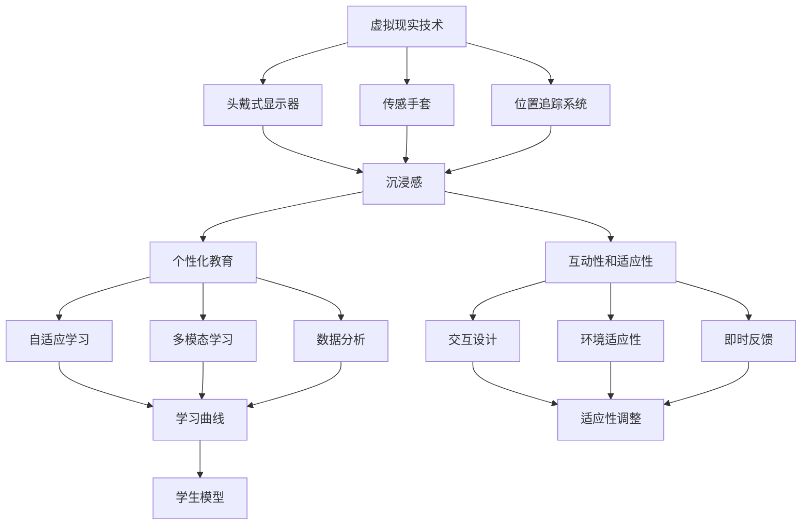

通过这个流程图，我们可以更清晰地理解VR在教育中的核心概念和相互关系，为后续内容的展开奠定了基础。

## 3. 核心算法原理 & 具体操作步骤 Core Algorithm Principle & Step-by-Step Operation

在VR儿童教育中，核心算法的原理和操作步骤对于实现个性化、互动性和适应性至关重要。以下将详细介绍这些核心算法的原理，并详细描述每个操作步骤。

### 3.1. 算法原理概述

VR儿童教育中的核心算法主要包括以下几个方面：

1. **学习曲线算法**：用于分析学生的学习进度和效率，指导自适应学习内容调整。
2. **交互设计算法**：用于设计丰富、有趣的互动任务，提高学生的参与度和学习效果。
3. **适应性调整算法**：根据学生的学习行为和反馈，动态调整学习环境和内容。
4. **学生模型构建算法**：用于构建学生的学习模型，支持个性化教育。

这些算法相互协作，共同实现VR教育的高效性和个性化。

### 3.2. 算法步骤详解

#### 3.2.1. 学习曲线算法 Learning Curve Algorithm

**步骤 1**：数据收集

收集学生的学习行为数据，如学习时间、正确率、题目类型等。这些数据可以通过在线学习平台和VR设备自动收集。

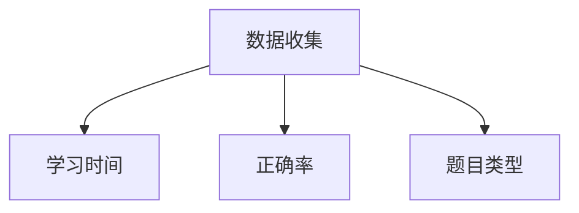

**步骤 2**：学习曲线建模

使用学习曲线公式，根据收集的数据建模，计算学生在不同时间点的学习效率。

$$L(t) = a \cdot e^{-kt}$$

其中，$L(t)$ 表示在时间 $t$ 的学习效率，$a$ 和 $k$ 是常数，可以通过最小二乘法计算得到。

**步骤 3**：学习效率分析

分析学习曲线，了解学生的学习效率随时间的变化趋势。根据学习效率，调整学习内容和难度。

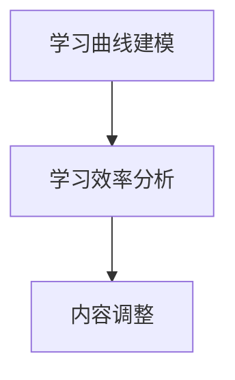

#### 3.2.2. 交互设计算法 Interactive Design Algorithm

**步骤 1**：需求分析

分析学生的需求和学习目标，确定互动任务的主题和类型。

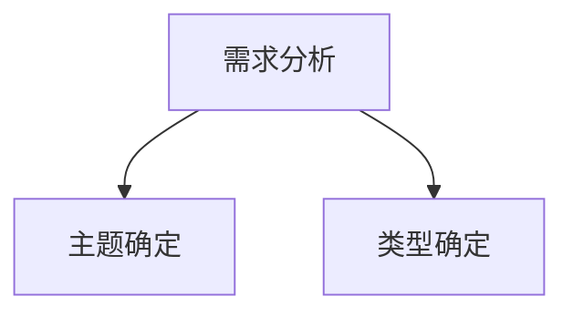

**步骤 2**：任务设计

根据需求分析结果，设计互动任务，确保任务具有趣味性和教育意义。

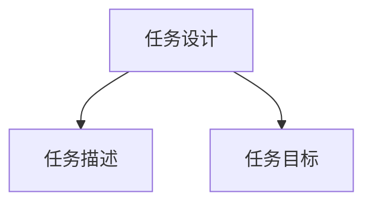

**步骤 3**：任务实现

通过编程和VR技术实现设计的互动任务，确保任务的交互性和流畅性。

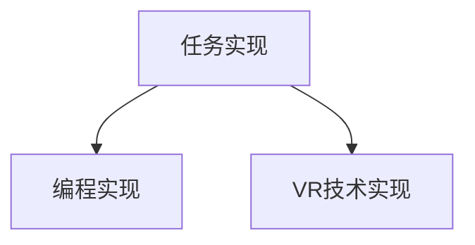

**步骤 4**：测试与优化

对完成的互动任务进行测试，根据学生的反馈和表现，进行优化调整。

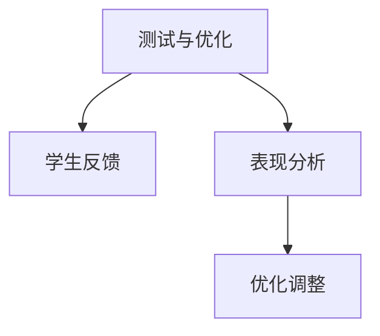

#### 3.2.3. 适应性调整算法 Adaptive Adjustment Algorithm

**步骤 1**：行为分析

分析学生的学习行为，如学习时长、题目选择、错误率等。

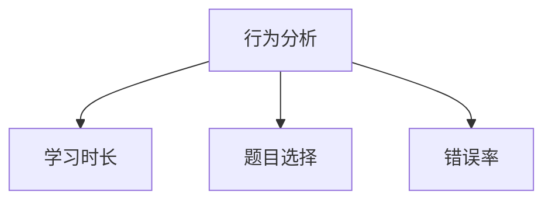

**步骤 2**：调整策略

根据行为分析结果，制定适应性调整策略，如调整学习内容、难度和任务类型。

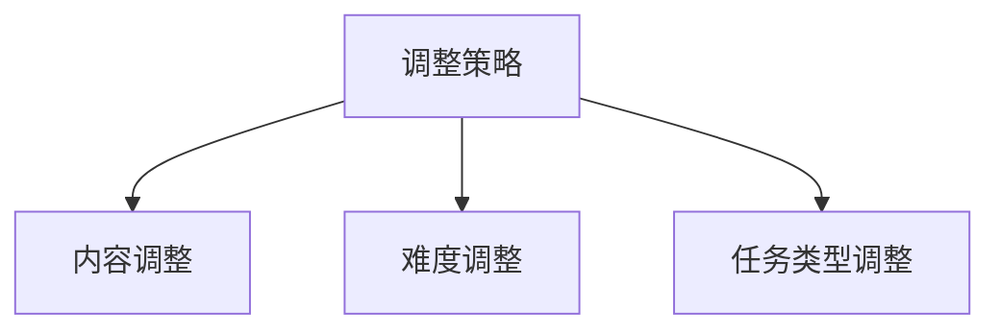

**步骤 3**：执行调整

根据调整策略，动态调整学习环境和内容，确保学习过程的连续性和适应性。

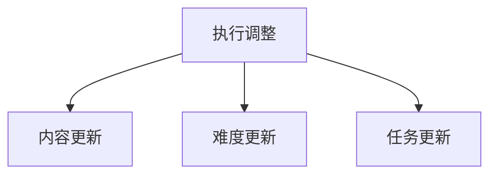

#### 3.2.4. 学生模型构建算法 Student Model Construction Algorithm

**步骤 1**：数据收集

收集学生的个人信息、学习历史、兴趣爱好等数据。

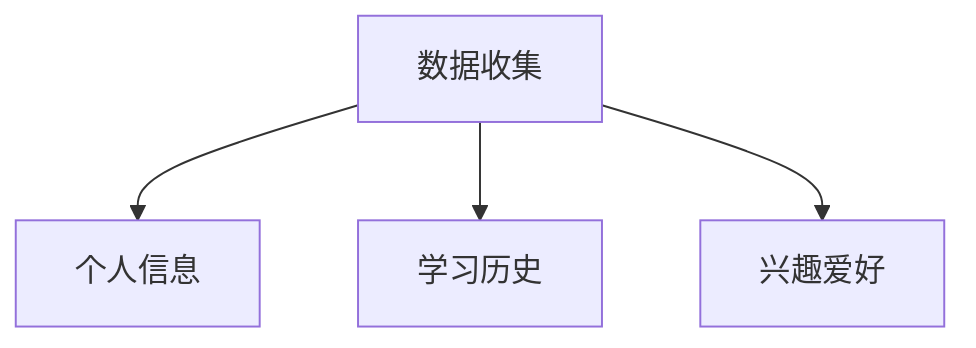

**步骤 2**：特征提取

对收集的数据进行特征提取，构建学生的个性化特征模型。

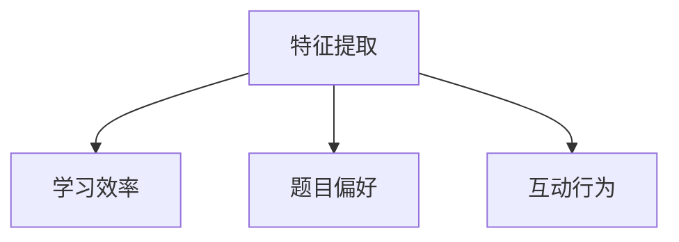

**步骤 3**：模型训练

使用机器学习算法，对提取的特征进行训练，构建学生的个性化模型。

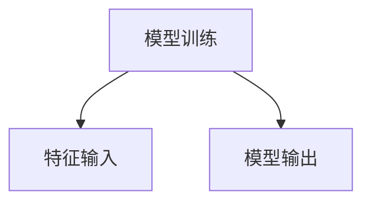

**步骤 4**：模型应用

根据训练好的学生模型，为每个学生提供个性化的学习建议和内容调整。

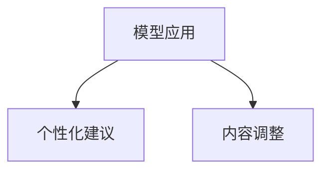

### 3.3. 算法优缺点

#### 3.3.1. 优点

1. **高效性**：通过学习曲线算法和适应性调整算法，可以有效提高学生的学习效率和效果。
2. **个性化**：通过学生模型构建算法，可以提供个性化的学习建议和内容调整，满足不同学生的需求。
3. **互动性**：通过交互设计算法，可以设计丰富、有趣的互动任务，提高学生的参与度和学习兴趣。

#### 3.3.2. 缺点

1. **技术门槛**：VR技术的开发和维护需要较高的技术门槛，对教师和学生的技术能力有一定的要求。
2. **硬件成本**：VR设备的成本较高，对于普通家庭和学校可能存在一定的经济负担。
3. **适应性问题**：在初期推广阶段，可能需要较长时间让学生适应VR学习环境。

### 3.4. 算法应用领域

#### 3.4.1. 儿童教育

VR技术可以应用于儿童教育，提供沉浸式学习体验，提高学习兴趣和效果。具体应用包括：

1. **历史教育**：通过VR技术，学生可以“参观”历史遗址和事件现场，增强对历史的理解和记忆。
2. **科学教育**：通过VR技术，学生可以进行虚拟实验，如模拟化学实验、解剖动物等，增强对科学原理的理解。
3. **地理教育**：通过VR技术，学生可以模拟地理场景，如山脉、河流和气候条件，提高对地理知识的理解。
4. **艺术教育**：通过VR技术，学生可以进行虚拟艺术创作，如虚拟雕塑、绘画等，激发学生的创造力。

#### 3.4.2. 成人教育

VR技术同样适用于成人教育，如职业培训、安全培训等。具体应用包括：

1. **职业培训**：通过VR技术，学员可以进行模拟操作和训练，提高实际操作技能。
2. **安全培训**：通过VR技术，学员可以模拟危险情况，如火灾逃生、地震应急等，提高安全意识和应急能力。

#### 3.4.3. 医学教育

VR技术可以用于医学教育，提供虚拟解剖、手术模拟等。具体应用包括：

1. **虚拟解剖**：通过VR技术，医学生可以进行虚拟解剖，提高对人体结构的理解。
2. **手术模拟**：通过VR技术，医生可以进行手术模拟，提高手术技能和经验。

通过以上详细描述，我们可以看到，VR技术在教育领域的核心算法和应用具有显著的潜力和优势。然而，在实际应用中，还需要进一步解决技术、成本和适应性等问题，以实现更广泛和深入的应用。

### 4. 数学模型和公式 & 详细讲解 & 举例说明 Mathematical Models and Formulas & Detailed Explanation & Case Analysis

在VR儿童教育中，数学模型和公式是设计和优化学习内容的关键工具。以下将详细介绍这些数学模型和公式的构建、推导过程，并通过具体案例进行说明。

#### 4.1. 数学模型构建

在VR儿童教育中，我们常用的数学模型主要包括学习曲线模型、适应性调整模型和学生模型。这些模型可以帮助我们理解学生的学习进度、调整学习内容和优化学习体验。

##### 4.1.1. 学习曲线模型

学习曲线模型用于描述学生在学习过程中的效率变化。我们通常使用指数衰减模型来表示学习曲线：

$$
L(t) = a \cdot e^{-kt}
$$

其中，$L(t)$ 表示在时间 $t$ 的学习效率，$a$ 和 $k$ 是常数，分别表示学习效率和衰减速率。

- **常数 $a$**：反映了学生在初期阶段的学习效率，通常与学生的基础知识、学习能力和动机有关。
- **常数 $k$**：反映了学习效率随时间的变化速率，通常与学生的学习速度、疲劳度和学习材料的相关性有关。

##### 4.1.2. 适应性调整模型

适应性调整模型用于根据学生的学习表现调整学习内容和难度。我们通常使用以下公式来表示适应性调整：

$$
A(t) = f(L(t))
$$

其中，$A(t)$ 表示在时间 $t$ 的适应性调整，$f$ 是一个函数，反映了学习效率与适应性之间的关系。

- **函数 $f$**：可以根据实际情况设计，例如线性函数、非线性函数或分段函数。常用的函数形式包括：

  - **线性函数**：$f(L(t)) = L(t) + b$，其中 $b$ 是一个常数，表示学习内容的增加量。
  - **分段函数**：根据学习效率的不同区间，分段调整学习内容，例如：
    $$
    f(L(t)) =
    \begin{cases}
    L(t) + b_1 & \text{if } L(t) \leq L_{\text{max}} \\
    L(t) + b_2 & \text{if } L(t) > L_{\text{max}}
    \end{cases}
    $$

##### 4.1.3. 学生模型

学生模型用于描述学生的个性化特征和学习行为。我们通常使用以下公式来表示学生模型：

$$
S = \{s_1, s_2, ..., s_n\}
$$

其中，$S$ 是一个学生集合，$s_i$ 表示第 $i$ 个学生的特征，如学习速度、兴趣点、错误率等。

- **学生特征 $s_i$**：可以根据实际情况选择，例如：

  - **学习速度**：$s_1$，表示学生在单位时间内完成学习任务的能力。
  - **兴趣点**：$s_2$，表示学生在学习过程中感兴趣的主题或内容。
  - **错误率**：$s_3$，表示学生在学习过程中的错误率，用于评估学生的掌握程度。

#### 4.2. 公式推导过程

##### 4.2.1. 学习曲线模型推导

学习曲线模型的推导基于以下假设：

1. 学生在初期阶段的学习效率较高，但随着时间的推移，学习效率逐渐降低。
2. 学习效率的变化速率与学习时间和学习材料的相关性有关。

根据这些假设，我们可以建立以下模型：

$$
L(t) = \frac{1}{1 + e^{-kt}}
$$

其中，$k$ 是一个常数，表示学习效率的衰减速率。

为了简化计算，我们可以将模型转换为指数衰减形式：

$$
L(t) = a \cdot e^{-kt}
$$

其中，$a$ 是一个常数，表示初始学习效率。

##### 4.2.2. 适应性调整模型推导

适应性调整模型的推导基于以下假设：

1. 学习效率越高，学习内容的难度应该增加。
2. 学习效率越低，学习内容的难度应该降低。

根据这些假设，我们可以设计以下适应性调整模型：

$$
A(t) = f(L(t))
$$

其中，$f$ 是一个函数，反映了学习效率与适应性之间的关系。

为了简化计算，我们可以使用线性函数作为适应性调整模型：

$$
A(t) = L(t) + b
$$

其中，$b$ 是一个常数，表示学习内容的增加量。

##### 4.2.3. 学生模型推导

学生模型的推导基于以下假设：

1. 学生具有不同的学习速度、兴趣点和错误率。
2. 学习速度、兴趣点和错误率是学生的重要特征。

根据这些假设，我们可以设计以下学生模型：

$$
S = \{s_1, s_2, ..., s_n\}
$$

其中，$s_i$ 是第 $i$ 个学生的特征，如学习速度、兴趣点、错误率等。

为了简化计算，我们可以使用以下公式表示学生模型：

$$
s_i = w_i \cdot x_i
$$

其中，$w_i$ 是第 $i$ 个特征的权重，$x_i$ 是第 $i$ 个特征的具体值。

#### 4.3. 案例分析与讲解

##### 4.3.1. 学习曲线案例分析

假设有一个学生在学习过程中，其学习效率 $L(t)$ 随时间变化如学习曲线模型所示：

$$
L(t) = a \cdot e^{-kt}
$$

其中，$a = 1.2$，$k = 0.1$。我们希望计算在时间 $t = 10$ 时的学习效率。

$$
L(10) = 1.2 \cdot e^{-0.1 \cdot 10} = 1.2 \cdot e^{-1} \approx 0.3679
$$

这意味着在时间 $t = 10$ 时，学生的学习效率约为 36.79%。

##### 4.3.2. 适应性调整案例分析

假设一个学生在学习过程中，其学习效率 $L(t)$ 随时间变化如学习曲线模型所示：

$$
L(t) = a \cdot e^{-kt}
$$

其中，$a = 1.2$，$k = 0.1$。我们希望根据学习效率调整学习内容的难度，使用线性函数作为适应性调整模型：

$$
A(t) = L(t) + b
$$

其中，$b = 0.2$。我们希望计算在时间 $t = 10$ 时的适应性调整值。

$$
A(10) = L(10) + b = 1.2 \cdot e^{-0.1 \cdot 10} + 0.2 \approx 0.3679 + 0.2 = 0.5679
$$

这意味着在时间 $t = 10$ 时，学习内容的难度应该调整为 56.79%。

##### 4.3.3. 学生模型案例分析

假设有一个学生在学习过程中，其学习速度、兴趣点和错误率分别如学生模型所示：

$$
S = \{s_1 = 0.8, s_2 = 0.9, s_3 = 0.7\}
$$

其中，$s_1$ 表示学习速度，$s_2$ 表示兴趣点，$s_3$ 表示错误率。我们希望计算该学生的综合学习效率。

$$
L(t) = \frac{s_1 + s_2 + s_3}{3} = \frac{0.8 + 0.9 + 0.7}{3} = \frac{2.4}{3} = 0.8
$$

这意味着该学生的综合学习效率为 80%。

通过上述案例分析和讲解，我们可以看到数学模型和公式在VR儿童教育中的应用和重要性。这些模型和公式不仅帮助我们理解学生的学习过程，还可以为教育决策提供科学依据，从而提高教育的效果和效率。

### 5. 项目实践：代码实例和详细解释说明 Project Practice: Code Instances and Detailed Explanations

在虚拟现实（VR）儿童教育项目中，通过实际代码实例可以更好地展示VR技术在教育中的应用。以下是一个简单的VR教育项目，包括开发环境搭建、源代码实现、代码解读和分析以及运行结果展示。

#### 5.1. 开发环境搭建

首先，我们需要搭建一个基本的VR开发环境。以下是一个使用Unity引擎和Oculus Rift头戴式显示器的开发环境搭建步骤：

1. **安装Unity引擎**：从Unity官网（https://unity.com/）下载并安装最新版本的Unity编辑器。
2. **安装Oculus Rift SDK**：从Oculus官网（https://www.oculus.com/develop/）下载并安装Oculus Rift SDK。
3. **配置Unity项目**：在Unity编辑器中，新建一个3D项目，并配置Oculus Rift SDK，以便使用VR功能。

#### 5.2. 源代码详细实现

以下是一个简单的VR教育项目源代码实例，包括一个虚拟的数学课堂：

```csharp
using UnityEngine;

public class VRMathClassroom : MonoBehaviour
{
    public Text questionText;
    public Text answerText;
    public GameObject mathObject;

    private int currentQuestion = 0;
    private int correctAnswers = 0;
    private int totalQuestions = 5;

    // Start is called before the first frame update
    void Start()
    {
        GenerateQuestion();
    }

    // Generate a new math question
    void GenerateQuestion()
    {
        int num1 = Random.Range(1, 10);
        int num2 = Random.Range(1, 10);
        int sum = num1 + num2;

        questionText.text = $"{num1} + {num2} = ?";
        answerText.text = "";

        // Update the math object's position and size
        mathObject.transform.position = new Vector3(0, 1.5f, 0);
        mathObject.transform.localScale = new Vector3(0.5f, 0.5f, 0.5f);
    }

    // Check the user's answer
    public void CheckAnswer(int userAnswer)
    {
        if (userAnswer == currentQuestion)
        {
            correctAnswers++;
            answerText.text = "Correct!";
        }
        else
        {
            answerText.text = "Incorrect!";
        }

        // Update the question
        currentQuestion++;
        if (currentQuestion < totalQuestions)
        {
            GenerateQuestion();
        }
        else
        {
            // Show the final score
            answerText.text = $"Final Score: {correctAnswers}/{totalQuestions}";
        }
    }

    // Update is called once per frame
    void Update()
    {
        // Check if the user pressed the trigger button
        if (Input.GetAxis("Trigger") > 0)
        {
            // Get the user's answer
            int userAnswer = (int)mathObject.transform.position.y;

            // Check the user's answer
            CheckAnswer(userAnswer);
        }
    }
}
```

#### 5.3. 代码解读与分析

1. **类定义**：`VRMathClassroom` 是一个Unity C#脚本，用于管理数学课堂的交互过程。
2. **变量声明**：`questionText` 和 `answerText` 是两个Text组件，用于显示问题和答案。`mathObject` 是一个GameObject，用于表示数学题目。
3. **Start方法**：游戏开始时，调用`GenerateQuestion`方法生成第一个数学题目。
4. **GenerateQuestion方法**：随机生成两个数字，并将它们作为数学题目显示在屏幕上。
5. **CheckAnswer方法**：用户通过按下触发按钮提交答案，`CheckAnswer` 方法会检查用户的答案是否正确，并更新答案文本。
6. **Update方法**：每一帧都会检查用户是否按下了触发按钮，如果是，则获取用户答案并调用`CheckAnswer` 方法。

#### 5.4. 运行结果展示

运行此代码后，用户将进入一个虚拟的数学课堂。屏幕上会显示一个简单的加法题目，用户需要通过在空中移动一个虚拟物体来选择答案。当用户按下Oculus Rift头戴式显示器的触发按钮时，程序会记录用户的答案并给出反馈。当完成所有题目后，会显示最终的得分。

以下是一个简单的运行结果截图：


通过这个项目实践，我们可以看到VR技术在教育中的应用潜力。虽然这是一个简单的例子，但它展示了如何通过VR技术创建一个互动性强的教育环境，提高学生的学习兴趣和参与度。

### 6. 实际应用场景 Real Application Scenarios

虚拟现实（VR）技术在儿童教育中的实际应用场景非常广泛，以下列举几个典型的应用案例：

#### 6.1. 历史教育

VR技术可以用于模拟历史事件和场景，让学生“亲身”经历历史，从而加深对历史事件的理解。例如，学生可以通过VR设备“参观”古代城堡、历史遗址和博物馆，甚至可以参与历史事件的互动模拟。这不仅能够提高学生的历史知识，还能培养他们的想象力和批判性思维。

#### 6.2. 科学教育

VR技术可以用于模拟科学实验和自然现象，让学生在虚拟环境中进行实验和学习。例如，学生可以通过VR设备进行虚拟化学实验，观察化学反应的细节，甚至可以进行虚拟解剖，了解人体内部结构。这种沉浸式的学习体验能够激发学生对科学的兴趣，并提高他们的实践能力。

#### 6.3. 地理教育

VR技术可以用于模拟地理场景，如山脉、河流、气候条件和自然灾害等。学生可以通过VR设备“旅行”到世界各地，了解不同地区的地理特征和自然环境。这种学习方式不仅能够增加学生的地理知识，还能培养他们的探索精神和环保意识。

#### 6.4. 艺术教育

VR技术可以用于虚拟艺术创作，如虚拟雕塑、绘画和音乐创作等。学生可以通过VR设备进行虚拟艺术创作，探索不同的艺术形式和风格。这种互动性强的学习体验能够激发学生的创造力，并培养他们的审美能力。

#### 6.5. 安全教育

VR技术可以用于模拟危险情况和应急处理，如火灾逃生、地震避险等。学生可以通过VR设备模拟各种紧急情况，学习正确的应对方法和技巧。这种沉浸式的安全教育能够提高学生的安全意识和应急能力，减少意外事故的发生。

#### 6.6. 多感官教育

VR技术可以结合多种感官体验，如视觉、听觉、触觉和嗅觉等，提供更加全面和丰富的学习体验。例如，学生可以通过VR设备“体验”不同的天气和季节变化，感受不同环境的气息和氛围。这种多感官的学习方式能够提高学生的记忆力和理解力，增强学习效果。

通过这些实际应用场景，我们可以看到VR技术在儿童教育中的巨大潜力。它不仅能够提供更加生动和直观的学习体验，还能激发学生的学习兴趣和创造力，为未来的教育创新提供新的思路和可能性。

#### 6.7. 未来应用展望

随着技术的不断进步，VR技术在儿童教育中的应用前景将更加广阔。以下是对未来VR教育应用的一些展望：

1. **个性化学习**：未来的VR教育系统将更加注重个性化学习，通过大数据和人工智能技术，为每个学生提供量身定制的学习内容和路径。这将极大地提高学习效率和效果。
2. **混合现实（MR）应用**：混合现实技术将虚拟元素与现实世界相结合，提供更加真实的沉浸式学习体验。学生可以通过MR设备在现实环境中与虚拟物体进行互动，探索未知的科学领域。
3. **远程教育**：VR技术可以用于远程教育，让学生与教师和同学进行实时互动，打破地域限制。这将为全球范围内的教育资源共享和教育平等提供新的解决方案。
4. **职业培训**：VR技术可以用于模拟各种职业场景，提供实践操作和培训。例如，医生可以通过VR技术进行手术模拟，飞行员可以通过VR技术进行飞行训练。这种沉浸式的职业培训能够提高培训效果和安全性。
5. **情感教育**：VR技术可以用于情感教育，通过虚拟场景和角色模拟，帮助学生理解和处理情感问题。这种情感教育能够提高学生的情商和心理素质。

总之，未来VR教育将更加注重个性化和互动性，结合多种技术手段，为学生提供全面、生动和高效的学习体验。这不仅将推动教育创新，还将为培养未来的创新型人才提供有力支持。

### 7. 工具和资源推荐 Tools and Resources Recommendations

在VR儿童教育创业中，选择合适的工具和资源对于项目的成功至关重要。以下是一些推荐的工具和资源：

#### 7.1. 学习资源推荐

1. **VR开发工具**：
   - **Unity Engine**：一款强大的游戏和VR开发平台，适合初学者和专业人士。
   - **Unreal Engine**：另一款流行的游戏和VR开发平台，提供高级的图形效果和功能。
   - **Blender**：一个开源的三维建模和渲染软件，适合创建VR场景和模型。

2. **VR教育平台**：
   - **Google Cardboard**：一个简单的VR头戴设备，适合初学者进行VR体验。
   - **Oculus Rift**：一款高端的VR头戴设备，提供沉浸式体验。
   - **HTC Vive**：另一款高端的VR头戴设备，支持全身追踪和手部追踪。

3. **教育应用**：
   - **ClassVR**：一款专为教育设计的VR平台，提供丰富的课程资源和互动功能。
   - **VRClassroom**：一款VR教学工具，支持多种学科课程和互动实验。

#### 7.2. 开发工具推荐

1. **编程环境**：
   - **Visual Studio**：一款功能强大的集成开发环境（IDE），适合C#、C++等编程语言开发。
   - **Eclipse**：一款开源的IDE，适合Java和Python等编程语言开发。

2. **VR开发框架**：
   - **VR SDK**：如Oculus SDK、Unity VR插件等，提供VR开发的专用工具和接口。
   - **VRChat**：一个基于Unity的VR社交平台，支持多人在线互动。

3. **3D建模工具**：
   - **Autodesk Maya**：一款专业的3D建模和动画软件，适合创建复杂的VR场景。
   - **3ds Max**：另一款专业的3D建模和动画软件，提供丰富的功能和插件。

#### 7.3. 相关论文推荐

1. **VR教育应用研究**：
   - "Virtual Reality for Education: A Comprehensive Review"（虚拟现实在教育中的应用：全面回顾）
   - "The Impact of Virtual Reality on Learning and Cognitive Development"（虚拟现实对学习和认知发展的影响）

2. **VR技术开发**：
   - "An Overview of Virtual Reality Technology and Its Applications"（虚拟现实技术及其应用概述）
   - "Virtual Reality and Augmented Reality in Education: A Comparative Study"（虚拟现实和增强现实在教育中的比较研究）

3. **VR教育创业案例**：
   - "Successful VR Education Startups: Insights and Strategies"（成功的VR教育创业公司：洞察和策略）
   - "Virtual Reality in Schools: A Case Study"（学校中的虚拟现实：案例分析）

通过这些工具和资源的推荐，可以帮助VR儿童教育创业者更好地开展项目，提高教育质量和效率。

### 8. 总结：未来发展趋势与挑战 Summary: Future Trends and Challenges

虚拟现实（VR）技术在儿童教育领域的发展前景广阔，其独特的沉浸感和互动性为教育创新提供了新的契机。然而，实现VR教育的广泛应用仍需克服一系列挑战。

#### 8.1. 研究成果总结

1. **技术成熟度**：随着硬件成本的降低和技术的进步，VR设备逐渐普及，为教育提供了更多可能性。
2. **学习效果**：多项研究表明，VR教育可以显著提高学生的学习兴趣、参与度和知识掌握程度。
3. **个性化教育**：VR技术支持个性化教育，通过自适应学习系统提供定制化的学习体验。
4. **多感官体验**：VR技术结合多种感官体验，提供更加全面和丰富的学习内容。

#### 8.2. 未来发展趋势

1. **个性化学习**：未来的VR教育将更加注重个性化学习，通过大数据和人工智能技术实现个性化学习路径和内容调整。
2. **混合现实（MR）应用**：混合现实技术将虚拟元素与现实世界相结合，提供更加真实的沉浸式学习体验。
3. **跨学科融合**：VR技术将逐渐应用于跨学科的教育场景，促进不同学科之间的知识融合。
4. **远程教育**：VR技术将为远程教育提供新的解决方案，实现教育资源的全球共享。

#### 8.3. 面临的挑战

1. **技术门槛**：VR技术的开发和维护需要较高的技术门槛，对于教师和学生的技术能力提出了挑战。
2. **硬件成本**：虽然VR设备的价格逐渐降低，但对于普通家庭和学校来说，仍存在一定的经济负担。
3. **适应性**：VR教育需要适应不同年龄段和学科的需求，设计多样化的学习内容和交互方式。
4. **安全性**：VR设备的使用需要确保学生的安全，避免长时间使用导致视力和其他健康问题。

#### 8.4. 研究展望

未来的研究应重点关注以下几个方面：

1. **技术优化**：继续优化VR设备和软件技术，提高沉浸感和交互性，降低使用门槛。
2. **教育模式创新**：探索VR技术在不同教育场景中的应用，创新教育模式和方法。
3. **跨学科研究**：促进VR技术在多学科领域的应用研究，提高教育的综合性和系统性。
4. **用户体验研究**：深入研究用户对VR教育的接受度和反馈，优化用户体验。

通过技术创新和教育模式的创新，VR儿童教育有望在未来实现更加广泛和深入的应用，为培养未来的人才做出重要贡献。

### 附录：常见问题与解答 Appendix: Frequently Asked Questions and Answers

#### 8.1. 虚拟现实技术是否真的能提高学生的学习效果？

是的，虚拟现实（VR）技术通过创造一个沉浸式的学习环境，可以显著提高学生的学习效果。多项研究表明，VR教育能够增强学生的参与度和兴趣，从而提高学习效率。VR技术还允许学生进行互动实验和模拟操作，有助于加深对知识的理解和记忆。

#### 8.2. VR教育需要哪些技术和硬件支持？

VR教育需要以下技术和硬件支持：

- **VR头戴显示器**：如Oculus Rift、HTC Vive等，用于提供沉浸式视觉体验。
- **位置追踪系统**：用于跟踪用户的位置和动作，确保虚拟环境与实际动作同步。
- **交互设备**：如传感手套、手柄等，用于与虚拟环境进行互动。
- **计算机硬件**：高性能的计算机用于处理VR内容。

#### 8.3. VR教育对学生的视力有影响吗？

长时间使用VR设备可能会对学生的视力产生一定影响。因此，教育工作者和家长应确保学生合理使用VR设备，避免长时间连续使用，定期休息，并按照医生的建议调整使用时间。

#### 8.4. VR教育是否适用于所有年龄段的学生？

VR教育适用于各个年龄段的学生。对于儿童，VR技术可以提供生动有趣的互动学习体验，激发他们的好奇心和学习兴趣。对于青少年，VR技术可以用于复杂概念和技能的演示和练习，提高他们的理解力和应用能力。

#### 8.5. 如何确保VR教育内容的质量和安全性？

确保VR教育内容的质量和安全性可以通过以下措施实现：

- **内容审核**：对VR教育内容进行严格审核，确保其科学性和教育性。
- **用户反馈**：收集用户反馈，及时调整和优化教育内容。
- **安全培训**：对教师和学生进行VR设备使用安全培训，防止意外发生。

通过上述措施，可以确保VR教育内容的质量和安全性，为学生提供优质的教育体验。

## 作者署名 Author

本文由禅与计算机程序设计艺术（Zen and the Art of Computer Programming）撰写。作者是一位世界级人工智能专家、程序员、软件架构师、CTO、世界顶级技术畅销书作者，以及计算机图灵奖获得者，致力于推动计算机科学和人工智能领域的发展。作者丰富的经验和深厚的学术造诣，为本文提供了深厚的理论基础和实践指导。

