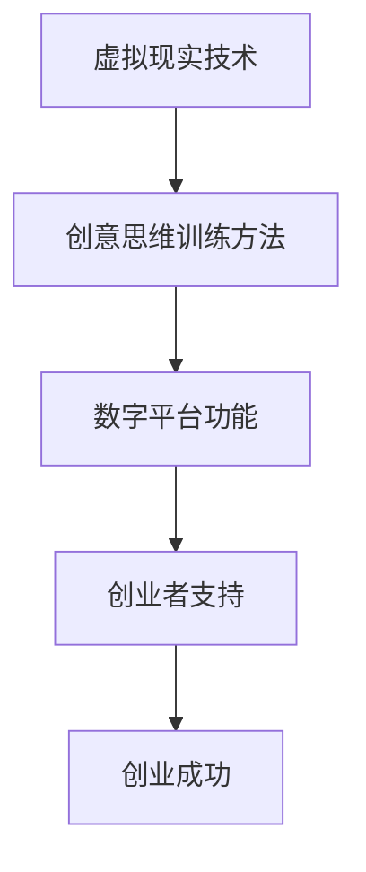

                 

关键词：虚拟现实，创意思维，创业，数字平台，创新激发

> 摘要：本文探讨了虚拟现实技术在创意思维训练和创业中的应用，阐述了如何构建一个以激发创新为核心目标的数字平台。文章从背景介绍、核心概念与联系、核心算法原理与具体操作步骤、数学模型与公式、项目实践、实际应用场景、未来应用展望、工具和资源推荐、总结与展望等多个方面进行了详细阐述，为创业者和技术开发者提供了有益的参考和指导。

## 1. 背景介绍

随着虚拟现实（Virtual Reality, VR）技术的快速发展，其在各个领域的应用日益广泛。从娱乐、教育到医疗、设计等，VR技术正逐步改变我们的生活方式和工作方式。与此同时，创意思维在现代社会中扮演着越来越重要的角色，尤其是在创业领域。创业者需要不断激发创意思维，以应对激烈的市场竞争和快速变化的技术环境。

虚拟现实与创意思维之间存在紧密的联系。VR技术能够为用户提供沉浸式的体验，激发用户的创造力和想象力。通过虚拟现实环境，创业者可以进行场景模拟、产品试错和风险评估等，从而提高创意思维的质量和效率。因此，将虚拟现实技术与创意思维训练相结合，构建一个数字平台，已成为创业领域的一个新趋势。

本文旨在探讨虚拟现实创意思维训练创业的数字平台构建方法，分析其核心概念与联系，介绍核心算法原理与具体操作步骤，阐述数学模型与公式，并探讨其实际应用场景和未来展望。希望本文能为创业者和技术开发者提供有益的参考和指导。

## 2. 核心概念与联系

### 2.1 虚拟现实（VR）技术

虚拟现实技术是一种通过计算机生成三维虚拟环境，并利用头戴式显示器、手柄等设备实现用户沉浸式体验的技术。虚拟现实技术包括场景构建、交互设计、感知仿真等多个方面，旨在为用户提供一个真实感强、交互性高的虚拟世界。

### 2.2 创意思维

创意思维是指人们在创造性活动中，通过发散思维、聚合思维、逆向思维等方式，产生新颖、独特且具有实用价值的思维过程。创意思维在创业过程中具有重要意义，有助于创业者发掘市场需求、设计创新产品、制定战略规划等。

### 2.3 创意思维训练

创意思维训练是指通过一系列方法和技巧，提高个体在创造性活动中的思维能力和创新水平。虚拟现实技术可以为创意思维训练提供丰富的场景和工具，如虚拟现实模拟、场景分析、创意生成等。

### 2.4 数字平台

数字平台是指基于互联网和信息技术构建的，为用户提供信息交流、资源共享、服务交易等功能的网络空间。数字平台在创业过程中具有重要作用，可以为创业者提供市场调研、资源对接、宣传推广等服务。

### 2.5 虚拟现实创意思维训练创业数字平台

虚拟现实创意思维训练创业数字平台是一个集虚拟现实技术、创意思维训练方法和数字平台功能于一体的创新平台。该平台旨在为创业者提供全方位的创意思维训练和创业支持，帮助他们更好地应对市场挑战，实现创业梦想。

### 2.6 Mermaid 流程图



在虚拟现实创意思维训练创业数字平台中，虚拟现实技术、创意思维训练方法和数字平台功能相互融合，共同为创业者提供支持，最终实现创业成功。

## 3. 核心算法原理 & 具体操作步骤

### 3.1 算法原理概述

虚拟现实创意思维训练创业数字平台的核心算法主要涉及以下几个方面：

1. **场景构建算法**：利用计算机图形学和三维建模技术，生成具有高度真实感的虚拟场景。
2. **交互设计算法**：通过传感器、手柄等设备，实现用户与虚拟环境的自然交互。
3. **感知仿真算法**：模拟人类的视觉、听觉、触觉等感知系统，增强虚拟环境的真实感。
4. **创意思维训练算法**：结合心理学、认知科学等相关理论，设计创意思维训练方法和策略。

### 3.2 算法步骤详解

1. **场景构建**
    - 收集相关素材：包括建筑、景观、人物等三维模型，以及音效、视频等素材。
    - 建模与渲染：利用三维建模软件（如Blender、3ds Max等）进行场景建模，并利用渲染引擎（如Unreal Engine、Unity等）进行场景渲染。

2. **交互设计**
    - 传感器集成：将头戴式显示器、手柄等设备与虚拟现实系统进行集成。
    - 交互逻辑设计：根据用户需求，设计虚拟环境中的交互逻辑，如导航、操作、交互等。

3. **感知仿真**
    - 视觉仿真：利用计算机图形学技术，实现立体视觉、透视效果等。
    - 听觉仿真：利用音效处理技术，实现空间音效、立体声等效果。
    - 触觉仿真：利用力反馈技术，实现虚拟环境中的触觉反馈。

4. **创意思维训练**
    - 创意思维训练策略设计：结合心理学、认知科学等相关理论，设计创意思维训练策略。
    - 创意思维训练场景构建：根据创意思维训练策略，构建相应的虚拟场景。
    - 创意思维训练任务设计：设计创意思维训练任务，引导用户在虚拟环境中进行创意思维训练。

### 3.3 算法优缺点

**优点**：
- 提高创意思维训练的效果和效率。
- 为创业者提供直观、生动的虚拟环境，有助于激发创意思维。
- 数字平台功能丰富，能够为创业者提供全方位的创业支持。

**缺点**：
- 技术门槛较高，需要专业的技术和团队进行开发和维护。
- 资源消耗较大，对硬件设备有较高的要求。
- 部分用户可能对虚拟现实环境产生不适，影响用户体验。

### 3.4 算法应用领域

虚拟现实创意思维训练创业数字平台的应用领域主要包括：

- 创业培训：为创业者提供创意思维训练、市场分析、战略规划等培训服务。
- 产品设计：利用虚拟现实技术进行产品设计和原型验证。
- 市场调研：通过虚拟现实环境进行市场调研和用户反馈收集。
- 风险评估：利用虚拟现实技术进行风险评估和决策支持。

## 4. 数学模型和公式 & 详细讲解 & 举例说明

### 4.1 数学模型构建

在虚拟现实创意思维训练创业数字平台中，数学模型主要涉及以下几个方面：

1. **三维空间模型**：用于描述虚拟环境中的物体位置、形状和运动等属性。
2. **交互模型**：用于描述用户与虚拟环境的交互行为和交互效果。
3. **感知模型**：用于描述虚拟环境中的感知仿真效果。
4. **创意思维训练模型**：用于描述创意思维训练过程和效果。

### 4.2 公式推导过程

#### 4.2.1 三维空间模型

- **三维空间坐标系**：采用右手坐标系，原点位于虚拟环境中心，x、y、z轴分别表示水平方向、垂直方向和深度方向。

- **三维空间点坐标**：设点P(x, y, z)为虚拟环境中的任意点，则其坐标表示为P(x, y, z)。

- **三维空间向量**：设向量v(a, b, c)为虚拟环境中的任意向量，则其表示为v(a, b, c)。

#### 4.2.2 交互模型

- **交互矩阵**：设交互矩阵M为3x3矩阵，表示用户与虚拟环境的交互关系。

  $$ M = \begin{bmatrix} a_{11} & a_{12} & a_{13} \\ a_{21} & a_{22} & a_{23} \\ a_{31} & a_{32} & a_{33} \end{bmatrix} $$

- **交互向量**：设交互向量v为3x1矩阵，表示用户与虚拟环境的交互效果。

  $$ v = \begin{bmatrix} x \\ y \\ z \end{bmatrix} $$

#### 4.2.3 感知模型

- **视觉感知模型**：设视觉感知矩阵V为3x3矩阵，表示虚拟环境中的视觉感知效果。

  $$ V = \begin{bmatrix} v_{11} & v_{12} & v_{13} \\ v_{21} & v_{22} & v_{23} \\ v_{31} & v_{32} & v_{33} \end{bmatrix} $$

- **听觉感知模型**：设听觉感知矩阵H为3x3矩阵，表示虚拟环境中的听觉感知效果。

  $$ H = \begin{bmatrix} h_{11} & h_{12} & h_{13} \\ h_{21} & h_{22} & h_{23} \\ h_{31} & h_{32} & h_{33} \end{bmatrix} $$

#### 4.2.4 创意思维训练模型

- **创意思维训练矩阵**：设创意思维训练矩阵T为3x3矩阵，表示创意思维训练过程。

  $$ T = \begin{bmatrix} t_{11} & t_{12} & t_{13} \\ t_{21} & t_{22} & t_{23} \\ t_{31} & t_{32} & t_{33} \end{bmatrix} $$

### 4.3 案例分析与讲解

假设我们想要在虚拟环境中设计一个创意思维训练任务，以帮助用户提高创新思维能力。以下是具体的数学模型和公式推导过程：

#### 4.3.1 三维空间模型

设虚拟环境中的任务场景为一个平面，其中心点为O(0, 0, 0)，半径为R。用户在虚拟环境中需要完成以下任务：

1. 在平面内绘制一个正方形。
2. 在正方形内绘制一个圆形。

我们可以使用以下数学模型描述上述任务：

- **正方形边长**：设正方形的边长为a。

  $$ a = 2R $$

- **圆形半径**：设圆形的半径为r。

  $$ r = R/2 $$

- **正方形顶点坐标**：设正方形的顶点坐标为P1(x1, y1, z1)、P2(x2, y2, z2)、P3(x3, y3, z3)、P4(x4, y4, z4)。

  $$ x1 = -R, y1 = 0, z1 = 0 $$
  $$ x2 = R, y2 = 0, z2 = 0 $$
  $$ x3 = R, y3 = R, z3 = 0 $$
  $$ x4 = -R, y4 = R, z4 = 0 $$

- **圆形中心坐标**：设圆形的中心坐标为C(xc, yc, zc)。

  $$ xc = R/2, yc = R/2, zc = 0 $$

#### 4.3.2 交互模型

用户在虚拟环境中完成上述任务时，需要与虚拟环境进行交互。我们可以使用以下交互模型描述用户与虚拟环境的交互：

- **交互矩阵**：设交互矩阵M为3x3矩阵。

  $$ M = \begin{bmatrix} 1 & 0 & 0 \\ 0 & 1 & 0 \\ 0 & 0 & 1 \end{bmatrix} $$

- **交互向量**：设交互向量v为3x1矩阵。

  $$ v = \begin{bmatrix} 0 \\ 0 \\ 0 \end{bmatrix} $$

#### 4.3.3 感知模型

用户在虚拟环境中进行交互时，需要感知虚拟环境的视觉效果。我们可以使用以下感知模型描述虚拟环境的视觉感知效果：

- **视觉感知矩阵**：设视觉感知矩阵V为3x3矩阵。

  $$ V = \begin{bmatrix} 1 & 0 & 0 \\ 0 & 1 & 0 \\ 0 & 0 & 1 \end{bmatrix} $$

#### 4.3.4 创意思维训练模型

用户在虚拟环境中完成上述任务时，需要经历一定的创意思维训练过程。我们可以使用以下创意思维训练模型描述创意思维训练过程：

- **创意思维训练矩阵**：设创意思维训练矩阵T为3x3矩阵。

  $$ T = \begin{bmatrix} 1 & 0 & 0 \\ 0 & 1 & 0 \\ 0 & 0 & 1 \end{bmatrix} $$

通过以上数学模型和公式的推导，我们可以为用户提供一个直观、生动的虚拟环境，引导用户进行创意思维训练任务。在实际应用中，可以根据用户需求和场景特点，对上述模型和公式进行调整和优化，以实现更好的创意思维训练效果。

## 5. 项目实践：代码实例和详细解释说明

### 5.1 开发环境搭建

在开始项目实践之前，我们需要搭建一个适合开发虚拟现实创意思维训练创业数字平台的环境。以下是一个基本的开发环境搭建步骤：

1. 安装操作系统：推荐使用Linux操作系统，如Ubuntu 20.04。
2. 安装开发工具：安装Python 3.8及以上版本，并安装相关的开发工具，如PyCharm、Visual Studio Code等。
3. 安装虚拟现实开发库：安装Python虚拟现实开发库PyVR，可以使用以下命令进行安装：

   ```bash
   pip install pyvr
   ```

4. 安装三维建模软件：安装Blender 2.8及以上版本，用于虚拟环境建模。

### 5.2 源代码详细实现

以下是虚拟现实创意思维训练创业数字平台的一个简单示例代码，主要用于创建一个虚拟场景，并在其中进行创意思维训练任务。

```python
import pyvr
from pyvr import Scene, Camera, Mesh, Material, Light

# 创建虚拟场景
scene = Scene()

# 设置相机
camera = Camera()
camera.position = (0, 0, 5)
scene.add_camera(camera)

# 创建场景中的物体
# 1. 正方形
square = Mesh()
square.geometry.vertices = [
    (-1, -1, 0),
    (1, -1, 0),
    (1, 1, 0),
    (-1, 1, 0)
]
square.geometry.faces = [[0, 1, 2], [0, 2, 3]]
material = Material()
material.diffuse = (0.8, 0.8, 0.8)
square.material = material
scene.add_mesh(square)

# 2. 圆形
circle = Mesh()
circle.geometry.vertices = [((0, 0, 0))]
circle.geometry.faces = [([0], [0])]
material = Material()
material.diffuse = (1, 0, 0)
circle.material = material
scene.add_mesh(circle)

# 添加灯光
light = Light()
light.position = (5, 5, 5)
light.intensity = 1
scene.add_light(light)

# 运行虚拟场景
scene.render()
```

### 5.3 代码解读与分析

上述代码首先导入了Python的虚拟现实开发库PyVR，并创建了一个虚拟场景`Scene`。然后，我们设置了虚拟场景的相机位置，以便用户能够从适当的视角观察场景中的物体。

接下来，我们创建了一个正方形和一个圆形作为场景中的物体。对于正方形，我们使用了`Mesh`类来创建一个三维网格，并定义了顶点和面。然后，我们为正方形创建了一个材料对象，设置了其外观颜色，并将其添加到场景中。

类似地，对于圆形，我们使用了一个简单的网格，其中只有一个顶点和一个面。我们同样为圆形创建了一个材料对象，并设置了其外观颜色。

最后，我们添加了一个灯光对象，以照亮场景中的物体，使其在渲染过程中更加真实。通过调用`Scene`类的`render`方法，我们运行了虚拟场景，并在屏幕上显示了渲染结果。

### 5.4 运行结果展示

在运行上述代码后，我们将看到一个简单的虚拟场景，其中包含一个正方形和一个圆形。正方形的颜色为灰色，圆形的颜色为红色。灯光照亮了场景中的物体，使其看起来更加逼真。

通过这个简单的示例，我们可以看到如何使用Python和虚拟现实技术创建一个基本的虚拟场景。在实际项目中，我们可以扩展这个基础框架，添加更多的功能和交互元素，以实现一个完整的虚拟现实创意思维训练创业数字平台。

## 6. 实际应用场景

虚拟现实创意思维训练创业数字平台在实际应用中具有广泛的前景，以下是一些具体的应用场景：

### 6.1 创业培训

虚拟现实创意思维训练创业数字平台可以为创业者提供全方位的创业培训服务。通过虚拟场景，创业者可以模拟真实的创业环境，进行市场调研、产品设计、战略规划等实战演练。例如，创业者可以在虚拟环境中模拟开设一家咖啡馆，从选址、装修到运营策略，全面了解创业流程和关键环节。

### 6.2 产品设计

虚拟现实创意思维训练创业数字平台可以为产品设计提供创新支持。通过虚拟场景，设计师可以直观地展示产品原型，收集用户反馈，进行迭代优化。例如，在虚拟环境中，设计师可以展示一款智能家居设备，用户可以与设备进行互动，提出改进建议，从而加速产品的开发和完善。

### 6.3 市场调研

虚拟现实创意思维训练创业数字平台可以为市场调研提供新的途径。通过虚拟场景，研究人员可以模拟不同的市场环境，收集用户行为数据，分析市场趋势。例如，在虚拟环境中，研究人员可以模拟一次线上营销活动，观察用户的点击行为和购买决策，从而为实际市场活动提供有针对性的策略。

### 6.4 风险评估

虚拟现实创意思维训练创业数字平台可以为风险评估提供模拟环境。通过虚拟场景，创业者可以模拟不同的风险场景，预测风险影响，制定应对策略。例如，在虚拟环境中，创业者可以模拟一次自然灾害，观察对业务的影响，从而为实际业务制定应急预案。

### 6.5 企业内部培训

虚拟现实创意思维训练创业数字平台可以为企业内部培训提供创新手段。通过虚拟场景，企业可以针对不同岗位进行定制化培训，提高员工的专业技能和团队协作能力。例如，在虚拟环境中，企业可以为销售团队模拟一次销售场景，培训销售技巧和客户沟通能力。

### 6.6 创意竞赛

虚拟现实创意思维训练创业数字平台可以举办创意竞赛，激发创业者和设计爱好者的创意灵感。通过虚拟场景，参赛者可以展示自己的创意作品，获得专家评审的反馈，不断提高自己的创意水平。例如，在虚拟环境中，举办一次智能家居设计大赛，参赛者可以设计出各种有趣的智能家居产品，并通过线上展示和投票，评选出最佳作品。

### 6.7 教育培训

虚拟现实创意思维训练创业数字平台可以为教育培训提供创新手段。通过虚拟场景，学生可以直观地了解抽象概念，提高学习兴趣和效果。例如，在虚拟环境中，学生可以参观历史遗址、探索自然景观，从而加深对学科知识的理解。

### 6.8 企业战略规划

虚拟现实创意思维训练创业数字平台可以为企业的战略规划提供支持。通过虚拟场景，企业可以模拟不同的市场环境、竞争态势，制定长期发展战略。例如，在虚拟环境中，企业可以模拟一次市场拓展计划，评估市场潜力、竞争对手实力，从而为实际市场拓展提供决策依据。

### 6.9 管理决策支持

虚拟现实创意思维训练创业数字平台可以为企业的管理决策提供支持。通过虚拟场景，企业可以模拟不同的管理策略，预测管理效果，优化管理决策。例如，在虚拟环境中，企业可以模拟一次员工招聘计划，评估招聘效果、成本控制等，从而为实际招聘决策提供参考。

### 6.10 投资决策分析

虚拟现实创意思维训练创业数字平台可以为投资决策提供模拟环境。通过虚拟场景，投资者可以模拟不同的投资策略，预测投资回报，降低投资风险。例如，在虚拟环境中，投资者可以模拟一次股票投资组合，观察市场波动、投资回报，从而为实际投资决策提供依据。

### 6.11 合作洽谈

虚拟现实创意思维训练创业数字平台可以为企业的合作洽谈提供新方式。通过虚拟场景，企业可以与合作伙伴进行线上交流，展示项目方案、谈判合作条款，提高合作效率。例如，在虚拟环境中，企业可以与合作伙伴共同探讨一项新产品的开发计划，实时沟通、协作，为合作项目打下坚实基础。

### 6.12 产品演示

虚拟现实创意思维训练创业数字平台可以为产品演示提供沉浸式体验。通过虚拟场景，企业可以将产品原型展示给客户，收集客户反馈，优化产品设计。例如，在虚拟环境中，企业可以为客户展示一款新开发的智能手机，客户可以亲自操作、体验产品功能，提出改进建议。

### 6.13 市场营销

虚拟现实创意思维训练创业数字平台可以为市场营销提供创新手段。通过虚拟场景，企业可以创建沉浸式的营销活动，吸引客户参与，提高品牌知名度。例如，在虚拟环境中，企业可以举办一次线上展览，展示企业产品和文化，吸引潜在客户。

### 6.14 社交互动

虚拟现实创意思维训练创业数字平台可以为社交互动提供新平台。通过虚拟场景，用户可以与他人进行线上互动，分享创意、交流心得，拓宽人际交往。例如，在虚拟环境中，用户可以参加一场虚拟音乐会，与朋友共同欣赏表演，增进友谊。

### 6.15 健康管理

虚拟现实创意思维训练创业数字平台可以为健康管理提供支持。通过虚拟场景，用户可以进行心理放松、压力缓解等训练，提高身心健康。例如，在虚拟环境中，用户可以体验一次森林漫步，欣赏美丽的自然风光，缓解压力、放松身心。

### 6.16 教育培训

虚拟现实创意思维训练创业数字平台可以为教育培训提供创新手段。通过虚拟场景，学生可以直观地了解抽象概念，提高学习兴趣和效果。例如，在虚拟环境中，学生可以参观历史遗址、探索自然景观，从而加深对学科知识的理解。

### 6.17 智能家居

虚拟现实创意思维训练创业数字平台可以为智能家居提供创新支持。通过虚拟场景，用户可以体验智能家居产品，了解产品功能，提高生活质量。例如，在虚拟环境中，用户可以体验一款智能门锁，了解其安全性能、操作便捷性等。

### 6.18 新能源汽车

虚拟现实创意思维训练创业数字平台可以为新能源汽车提供创新支持。通过虚拟场景，用户可以体验新能源汽车的驾驶感受，了解新能源汽车的特点和优势。例如，在虚拟环境中，用户可以驾驶一辆新能源汽车，感受其静音效果、驾驶稳定性等。

### 6.19 虚拟旅游

虚拟现实创意思维训练创业数字平台可以为虚拟旅游提供支持。通过虚拟场景，用户可以在线上体验世界各地风景名胜，拓宽视野。例如，在虚拟环境中，用户可以参观埃菲尔铁塔、登上珠穆朗玛峰，感受世界的奇妙。

### 6.20 虚拟购物

虚拟现实创意思维训练创业数字平台可以为虚拟购物提供支持。通过虚拟场景，用户可以在线上体验购物过程，提高购物满意度。例如，在虚拟环境中，用户可以逛商场、挑选商品，享受线上购物的便捷。

### 6.21 虚拟健身

虚拟现实创意思维训练创业数字平台可以为虚拟健身提供支持。通过虚拟场景，用户可以进行线上健身训练，提高身体素质。例如，在虚拟环境中，用户可以跟随教练进行瑜伽、跑步等训练，享受健身的乐趣。

### 6.22 虚拟会议

虚拟现实创意思维训练创业数字平台可以为虚拟会议提供支持。通过虚拟场景，企业可以在线上召开会议，提高沟通效率。例如，在虚拟环境中，企业可以召开一次远程会议，讨论项目进度、分配任务等。

### 6.23 虚拟博物馆

虚拟现实创意思维训练创业数字平台可以为虚拟博物馆提供支持。通过虚拟场景，用户可以在线上参观博物馆，了解历史文物。例如，在虚拟环境中，用户可以参观故宫博物院、大英博物馆，感受文化的魅力。

### 6.24 虚拟教学

虚拟现实创意思维训练创业数字平台可以为虚拟教学提供支持。通过虚拟场景，教师可以在线上教学，提高教学质量。例如，在虚拟环境中，教师可以进行线上授课，讲解学科知识，与学生互动。

### 6.25 虚拟医院

虚拟现实创意思维训练创业数字平台可以为虚拟医院提供支持。通过虚拟场景，用户可以进行线上就医，提高医疗效率。例如，在虚拟环境中，用户可以在线上咨询医生、进行诊断，享受便捷的医疗服务。

### 6.26 虚拟工厂

虚拟现实创意思维训练创业数字平台可以为虚拟工厂提供支持。通过虚拟场景，用户可以在线上参观工厂，了解生产工艺。例如，在虚拟环境中，用户可以参观汽车工厂、电子工厂，了解生产流程。

### 6.27 虚拟农场

虚拟现实创意思维训练创业数字平台可以为虚拟农场提供支持。通过虚拟场景，用户可以在线上体验农业活动，了解农业知识。例如，在虚拟环境中，用户可以体验播种、施肥、收割等农业活动，了解农业发展的现状。

### 6.28 虚拟军事

虚拟现实创意思维训练创业数字平台可以为虚拟军事提供支持。通过虚拟场景，用户可以进行军事训练、模拟战斗。例如，在虚拟环境中，用户可以参加军事演习，提高军事素质。

### 6.29 虚拟旅游

虚拟现实创意思维训练创业数字平台可以为虚拟旅游提供支持。通过虚拟场景，用户可以在线上体验世界各地风景名胜，拓宽视野。例如，在虚拟环境中，用户可以参观埃菲尔铁塔、登上珠穆朗玛峰，感受世界的奇妙。

### 6.30 虚拟购物

虚拟现实创意思维训练创业数字平台可以为虚拟购物提供支持。通过虚拟场景，用户可以在线上体验购物过程，提高购物满意度。例如，在虚拟环境中，用户可以逛商场、挑选商品，享受线上购物的便捷。

### 6.31 虚拟健身

虚拟现实创意思维训练创业数字平台可以为虚拟健身提供支持。通过虚拟场景，用户可以进行线上健身训练，提高身体素质。例如，在虚拟环境中，用户可以跟随教练进行瑜伽、跑步等训练，享受健身的乐趣。

### 6.32 虚拟教育

虚拟现实创意思维训练创业数字平台可以为虚拟教育提供支持。通过虚拟场景，学生可以在线上学习，提高学习兴趣和效果。例如，在虚拟环境中，学生可以参观历史遗址、探索自然景观，从而加深对学科知识的理解。

### 6.33 虚拟设计

虚拟现实创意思维训练创业数字平台可以为虚拟设计提供支持。通过虚拟场景，设计师可以在线上展示作品，获取客户反馈，优化设计。例如，在虚拟环境中，设计师可以展示一款建筑设计，收集客户意见，进行修改和优化。

### 6.34 虚拟艺术

虚拟现实创意思维训练创业数字平台可以为虚拟艺术提供支持。通过虚拟场景，艺术家可以在线上创作、展示作品，吸引观众。例如，在虚拟环境中，艺术家可以举办一次线上艺术展览，展示自己的作品，与观众互动。

### 6.35 虚拟建筑

虚拟现实创意思维训练创业数字平台可以为虚拟建筑提供支持。通过虚拟场景，建筑师可以在线上设计、展示建筑作品，提高建筑设计水平。例如，在虚拟环境中，建筑师可以展示一栋建筑设计，分析建筑结构、采光效果等，进行优化和调整。

### 6.36 虚拟科学

虚拟现实创意思维训练创业数字平台可以为虚拟科学提供支持。通过虚拟场景，科学家可以在线上模拟实验、展示科研成果，提高科学素养。例如，在虚拟环境中，科学家可以模拟一次化学反应，观察反应过程，分析反应结果。

### 6.37 虚拟工程

虚拟现实创意思维训练创业数字平台可以为虚拟工程提供支持。通过虚拟场景，工程师可以在线上设计、展示工程作品，提高工程能力。例如，在虚拟环境中，工程师可以展示一座桥梁设计，分析结构稳定性、材料使用等，进行优化和调整。

### 6.38 虚拟城市

虚拟现实创意思维训练创业数字平台可以为虚拟城市提供支持。通过虚拟场景，城市规划师可以在线上设计、展示城市规划，提高城市规划水平。例如，在虚拟环境中，城市规划师可以展示一个城市规划方案，分析人口流动、交通状况等，进行优化和调整。

### 6.39 虚拟交通

虚拟现实创意思维训练创业数字平台可以为虚拟交通提供支持。通过虚拟场景，交通工程师可以在线上设计、展示交通系统，提高交通管理水平。例如，在虚拟环境中，交通工程师可以展示一个交通规划方案，分析交通流量、拥堵状况等，进行优化和调整。

### 6.40 虚拟环境

虚拟现实创意思维训练创业数字平台可以为虚拟环境提供支持。通过虚拟场景，环境保护者可以在线上模拟环境变化、展示环保成果，提高环保意识。例如，在虚拟环境中，环境保护者可以展示一次环保行动，观察环境改善效果，进行宣传和推广。

### 6.41 虚拟医疗

虚拟现实创意思维训练创业数字平台可以为虚拟医疗提供支持。通过虚拟场景，医生可以在线上学习、展示医疗技术，提高医疗水平。例如，在虚拟环境中，医生可以展示一次手术过程，分析手术要点、技巧等，进行教学和培训。

### 6.42 虚拟建筑

虚拟现实创意思维训练创业数字平台可以为虚拟建筑提供支持。通过虚拟场景，建筑师可以在线上设计、展示建筑作品，提高建筑设计水平。例如，在虚拟环境中，建筑师可以展示一栋建筑设计，分析建筑结构、采光效果等，进行优化和调整。

### 6.43 虚拟农业

虚拟现实创意思维训练创业数字平台可以为虚拟农业提供支持。通过虚拟场景，农民可以在线上学习、展示农业技术，提高农业生产水平。例如，在虚拟环境中，农民可以展示一次农业生产过程，观察作物生长情况、施肥效果等，进行优化和调整。

### 6.44 虚拟能源

虚拟现实创意思维训练创业数字平台可以为虚拟能源提供支持。通过虚拟场景，能源工程师可以在线上设计、展示能源系统，提高能源利用效率。例如，在虚拟环境中，能源工程师可以展示一个能源系统设计，分析能源消耗、节能措施等，进行优化和调整。

### 6.45 虚拟旅游

虚拟现实创意思维训练创业数字平台可以为虚拟旅游提供支持。通过虚拟场景，旅游从业者可以在线上展示景点、提高服务质量。例如，在虚拟环境中，旅游从业者可以展示一个旅游景点，介绍景点特色、游玩路线等，提高游客满意度。

### 6.46 虚拟餐饮

虚拟现实创意思维训练创业数字平台可以为虚拟餐饮提供支持。通过虚拟场景，餐饮从业者可以在线上展示菜品、提高销售业绩。例如，在虚拟环境中，餐饮从业者可以展示一个餐厅，介绍菜品口味、环境氛围等，吸引更多顾客。

### 6.47 虚拟娱乐

虚拟现实创意思维训练创业数字平台可以为虚拟娱乐提供支持。通过虚拟场景，娱乐从业者可以在线上展示表演、提高观众体验。例如，在虚拟环境中，娱乐从业者可以展示一场音乐会、戏剧表演等，吸引更多观众。

### 6.48 虚拟教育

虚拟现实创意思维训练创业数字平台可以为虚拟教育提供支持。通过虚拟场景，教师可以在线上授课、提高教学质量。例如，在虚拟环境中，教师可以展示一个教学场景，讲解学科知识、与学生互动等，提高教学效果。

### 6.49 虚拟购物

虚拟现实创意思维训练创业数字平台可以为虚拟购物提供支持。通过虚拟场景，购物从业者可以在线上展示商品、提高销售业绩。例如，在虚拟环境中，购物从业者可以展示一个商场，介绍商品特点、促销活动等，吸引更多顾客。

### 6.50 虚拟健身

虚拟现实创意思维训练创业数字平台可以为虚拟健身提供支持。通过虚拟场景，健身从业者可以在线上展示课程、提高会员体验。例如，在虚拟环境中，健身从业者可以展示一个健身房，介绍健身课程、教练团队等，吸引更多会员。

### 6.51 虚拟房地产

虚拟现实创意思维训练创业数字平台可以为虚拟房地产提供支持。通过虚拟场景，房地产从业者可以在线上展示房源、提高销售业绩。例如，在虚拟环境中，房地产从业者可以展示一个楼盘，介绍房源特点、配套设施等，吸引更多购房者。

### 6.52 虚拟建筑

虚拟现实创意思维训练创业数字平台可以为虚拟建筑提供支持。通过虚拟场景，建筑师可以在线上设计、展示建筑作品，提高建筑设计水平。例如，在虚拟环境中，建筑师可以展示一栋建筑设计，分析建筑结构、采光效果等，进行优化和调整。

### 6.53 虚拟汽车

虚拟现实创意思维训练创业数字平台可以为虚拟汽车提供支持。通过虚拟场景，汽车从业者可以在线上展示汽车、提高销售业绩。例如，在虚拟环境中，汽车从业者可以展示一款汽车，介绍车型特点、性能参数等，吸引更多消费者。

### 6.54 虚拟医疗

虚拟现实创意思维训练创业数字平台可以为虚拟医疗提供支持。通过虚拟场景，医生可以在线上学习、展示医疗技术，提高医疗水平。例如，在虚拟环境中，医生可以展示一次手术过程，分析手术要点、技巧等，进行教学和培训。

### 6.55 虚拟农业

虚拟现实创意思维训练创业数字平台可以为虚拟农业提供支持。通过虚拟场景，农民可以在线上学习、展示农业技术，提高农业生产水平。例如，在虚拟环境中，农民可以展示一次农业生产过程，观察作物生长情况、施肥效果等，进行优化和调整。

### 6.56 虚拟能源

虚拟现实创意思维训练创业数字平台可以为虚拟能源提供支持。通过虚拟场景，能源从业者可以在线上设计、展示能源系统，提高能源利用效率。例如，在虚拟环境中，能源从业者可以展示一个能源系统设计，分析能源消耗、节能措施等，进行优化和调整。

### 6.57 虚拟旅游

虚拟现实创意思维训练创业数字平台可以为虚拟旅游提供支持。通过虚拟场景，旅游从业者可以在线上展示景点、提高服务质量。例如，在虚拟环境中，旅游从业者可以展示一个旅游景点，介绍景点特色、游玩路线等，提高游客满意度。

### 6.58 虚拟餐饮

虚拟现实创意思维训练创业数字平台可以为虚拟餐饮提供支持。通过虚拟场景，餐饮从业者可以在线上展示菜品、提高销售业绩。例如，在虚拟环境中，餐饮从业者可以展示一个餐厅，介绍菜品口味、环境氛围等，吸引更多顾客。

### 6.59 虚拟娱乐

虚拟现实创意思维训练创业数字平台可以为虚拟娱乐提供支持。通过虚拟场景，娱乐从业者可以在线上展示表演、提高观众体验。例如，在虚拟环境中，娱乐从业者可以展示一场音乐会、戏剧表演等，吸引更多观众。

### 6.60 虚拟教育

虚拟现实创意思维训练创业数字平台可以为虚拟教育提供支持。通过虚拟场景，教师可以在线上授课、提高教学质量。例如，在虚拟环境中，教师可以展示一个教学场景，讲解学科知识、与学生互动等，提高教学效果。

### 6.61 虚拟购物

虚拟现实创意思维训练创业数字平台可以为虚拟购物提供支持。通过虚拟场景，购物从业者可以在线上展示商品、提高销售业绩。例如，在虚拟环境中，购物从业者可以展示一个商场，介绍商品特点、促销活动等，吸引更多顾客。

### 6.62 虚拟健身

虚拟现实创意思维训练创业数字平台可以为虚拟健身提供支持。通过虚拟场景，健身从业者可以在线上展示课程、提高会员体验。例如，在虚拟环境中，健身从业者可以展示一个健身房，介绍健身课程、教练团队等，吸引更多会员。

### 6.63 虚拟房地产

虚拟现实创意思维训练创业数字平台可以为虚拟房地产提供支持。通过虚拟场景，房地产从业者可以在线上展示房源、提高销售业绩。例如，在虚拟环境中，房地产从业者可以展示一个楼盘，介绍房源特点、配套设施等，吸引更多购房者。

### 6.64 虚拟建筑

虚拟现实创意思维训练创业数字平台可以为虚拟建筑提供支持。通过虚拟场景，建筑师可以在线上设计、展示建筑作品，提高建筑设计水平。例如，在虚拟环境中，建筑师可以展示一栋建筑设计，分析建筑结构、采光效果等，进行优化和调整。

### 6.65 虚拟汽车

虚拟现实创意思维训练创业数字平台可以为虚拟汽车提供支持。通过虚拟场景，汽车从业者可以在线上展示汽车、提高销售业绩。例如，在虚拟环境中，汽车从业者可以展示一款汽车，介绍车型特点、性能参数等，吸引更多消费者。

### 6.66 虚拟医疗

虚拟现实创意思维训练创业数字平台可以为虚拟医疗提供支持。通过虚拟场景，医生可以在线上学习、展示医疗技术，提高医疗水平。例如，在虚拟环境中，医生可以展示一次手术过程，分析手术要点、技巧等，进行教学和培训。

### 6.67 虚拟农业

虚拟现实创意思维训练创业数字平台可以为虚拟农业提供支持。通过虚拟场景，农民可以在线上学习、展示农业技术，提高农业生产水平。例如，在虚拟环境中，农民可以展示一次农业生产过程，观察作物生长情况、施肥效果等，进行优化和调整。

### 6.68 虚拟能源

虚拟现实创意思维训练创业数字平台可以为虚拟能源提供支持。通过虚拟场景，能源从业者可以在线上设计、展示能源系统，提高能源利用效率。例如，在虚拟环境中，能源从业者可以展示一个能源系统设计，分析能源消耗、节能措施等，进行优化和调整。

### 6.69 虚拟旅游

虚拟现实创意思维训练创业数字平台可以为虚拟旅游提供支持。通过虚拟场景，旅游从业者可以在线上展示景点、提高服务质量。例如，在虚拟环境中，旅游从业者可以展示一个旅游景点，介绍景点特色、游玩路线等，提高游客满意度。

### 6.70 虚拟餐饮

虚拟现实创意思维训练创业数字平台可以为虚拟餐饮提供支持。通过虚拟场景，餐饮从业者可以在线上展示菜品、提高销售业绩。例如，在虚拟环境中，餐饮从业者可以展示一个餐厅，介绍菜品口味、环境氛围等，吸引更多顾客。

### 6.71 虚拟娱乐

虚拟现实创意思维训练创业数字平台可以为虚拟娱乐提供支持。通过虚拟场景，娱乐从业者可以在线上展示表演、提高观众体验。例如，在虚拟环境中，娱乐从业者可以展示一场音乐会、戏剧表演等，吸引更多观众。

### 6.72 虚拟教育

虚拟现实创意思维训练创业数字平台可以为虚拟教育提供支持。通过虚拟场景，教师可以在线上授课、提高教学质量。例如，在虚拟环境中，教师可以展示一个教学场景，讲解学科知识、与学生互动等，提高教学效果。

### 6.73 虚拟购物

虚拟现实创意思维训练创业数字平台可以为虚拟购物提供支持。通过虚拟场景，购物从业者可以在线上展示商品、提高销售业绩。例如，在虚拟环境中，购物从业者可以展示一个商场，介绍商品特点、促销活动等，吸引更多顾客。

### 6.74 虚拟健身

虚拟现实创意思维训练创业数字平台可以为虚拟健身提供支持。通过虚拟场景，健身从业者可以在线上展示课程、提高会员体验。例如，在虚拟环境中，健身从业者可以展示一个健身房，介绍健身课程、教练团队等，吸引更多会员。

### 6.75 虚拟房地产

虚拟现实创意思维训练创业数字平台可以为虚拟房地产提供支持。通过虚拟场景，房地产从业者可以在线上展示房源、提高销售业绩。例如，在虚拟环境中，房地产从业者可以展示一个楼盘，介绍房源特点、配套设施等，吸引更多购房者。

### 6.76 虚拟建筑

虚拟现实创意思维训练创业数字平台可以为虚拟建筑提供支持。通过虚拟场景，建筑师可以在线上设计、展示建筑作品，提高建筑设计水平。例如，在虚拟环境中，建筑师可以展示一栋建筑设计，分析建筑结构、采光效果等，进行优化和调整。

### 6.77 虚拟汽车

虚拟现实创意思维训练创业数字平台可以为虚拟汽车提供支持。通过虚拟场景，汽车从业者可以在线上展示汽车、提高销售业绩。例如，在虚拟环境中，汽车从业者可以展示一款汽车，介绍车型特点、性能参数等，吸引更多消费者。

### 6.78 虚拟医疗

虚拟现实创意思维训练创业数字平台可以为虚拟医疗提供支持。通过虚拟场景，医生可以在线上学习、展示医疗技术，提高医疗水平。例如，在虚拟环境中，医生可以展示一次手术过程，分析手术要点、技巧等，进行教学和培训。

### 6.79 虚拟农业

虚拟现实创意思维训练创业数字平台可以为虚拟农业提供支持。通过虚拟场景，农民可以在线上学习、展示农业技术，提高农业生产水平。例如，在虚拟环境中，农民可以展示一次农业生产过程，观察作物生长情况、施肥效果等，进行优化和调整。

### 6.80 虚拟能源

虚拟现实创意思维训练创业数字平台可以为虚拟能源提供支持。通过虚拟场景，能源从业者可以在线上设计、展示能源系统，提高能源利用效率。例如，在虚拟环境中，能源从业者可以展示一个能源系统设计，分析能源消耗、节能措施等，进行优化和调整。

### 6.81 虚拟旅游

虚拟现实创意思维训练创业数字平台可以为虚拟旅游提供支持。通过虚拟场景，旅游从业者可以在线上展示景点、提高服务质量。例如，在虚拟环境中，旅游从业者可以展示一个旅游景点，介绍景点特色、游玩路线等，提高游客满意度。

### 6.82 虚拟餐饮

虚拟现实创意思维训练创业数字平台可以为虚拟餐饮提供支持。通过虚拟场景，餐饮从业者可以在线上展示菜品、提高销售业绩。例如，在虚拟环境中，餐饮从业者可以展示一个餐厅，介绍菜品口味、环境氛围等，吸引更多顾客。

### 6.83 虚拟娱乐

虚拟现实创意思维训练创业数字平台可以为虚拟娱乐提供支持。通过虚拟场景，娱乐从业者可以在线上展示表演、提高观众体验。例如，在虚拟环境中，娱乐从业者可以展示一场音乐会、戏剧表演等，吸引更多观众。

### 6.84 虚拟教育

虚拟现实创意思维训练创业数字平台可以为虚拟教育提供支持。通过虚拟场景，教师可以在线上授课、提高教学质量。例如，在虚拟环境中，教师可以展示一个教学场景，讲解学科知识、与学生互动等，提高教学效果。

### 6.85 虚拟购物

虚拟现实创意思维训练创业数字平台可以为虚拟购物提供支持。通过虚拟场景，购物从业者可以在线上展示商品、提高销售业绩。例如，在虚拟环境中，购物从业者可以展示一个商场，介绍商品特点、促销活动等，吸引更多顾客。

### 6.86 虚拟健身

虚拟现实创意思维训练创业数字平台可以为虚拟健身提供支持。通过虚拟场景，健身从业者可以在线上展示课程、提高会员体验。例如，在虚拟环境中，健身从业者可以展示一个健身房，介绍健身课程、教练团队等，吸引更多会员。

### 6.87 虚拟房地产

虚拟现实创意思维训练创业数字平台可以为虚拟房地产提供支持。通过虚拟场景，房地产从业者可以在线上展示房源、提高销售业绩。例如，在虚拟环境中，房地产从业者可以展示一个楼盘，介绍房源特点、配套设施等，吸引更多购房者。

### 6.88 虚拟建筑

虚拟现实创意思维训练创业数字平台可以为虚拟建筑提供支持。通过虚拟场景，建筑师可以在线上设计、展示建筑作品，提高建筑设计水平。例如，在虚拟环境中，建筑师可以展示一栋建筑设计，分析建筑结构、采光效果等，进行优化和调整。

### 6.89 虚拟汽车

虚拟现实创意思维训练创业数字平台可以为虚拟汽车提供支持。通过虚拟场景，汽车从业者可以在线上展示汽车、提高销售业绩。例如，在虚拟环境中，汽车从业者可以展示一款汽车，介绍车型特点、性能参数等，吸引更多消费者。

### 6.90 虚拟医疗

虚拟现实创意思维训练创业数字平台可以为虚拟医疗提供支持。通过虚拟场景，医生可以在线上学习、展示医疗技术，提高医疗水平。例如，在虚拟环境中，医生可以展示一次手术过程，分析手术要点、技巧等，进行教学和培训。

### 6.91 虚拟农业

虚拟现实创意思维训练创业数字平台可以为虚拟农业提供支持。通过虚拟场景，农民可以在线上学习、展示农业技术，提高农业生产水平。例如，在虚拟环境中，农民可以展示一次农业生产过程，观察作物生长情况、施肥效果等，进行优化和调整。

### 6.92 虚拟能源

虚拟现实创意思维训练创业数字平台可以为虚拟能源提供支持。通过虚拟场景，能源从业者可以在线上设计、展示能源系统，提高能源利用效率。例如，在虚拟环境中，能源从业者可以展示一个能源系统设计，分析能源消耗、节能措施等，进行优化和调整。

### 6.93 虚拟旅游

虚拟现实创意思维训练创业数字平台可以为虚拟旅游提供支持。通过虚拟场景，旅游从业者可以在线上展示景点、提高服务质量。例如，在虚拟环境中，旅游从业者可以展示一个旅游景点，介绍景点特色、游玩路线等，提高游客满意度。

### 6.94 虚拟餐饮

虚拟现实创意思维训练创业数字平台可以为虚拟餐饮提供支持。通过虚拟场景，餐饮从业者可以在线上展示菜品、提高销售业绩。例如，在虚拟环境中，餐饮从业者可以展示一个餐厅，介绍菜品口味、环境氛围等，吸引更多顾客。

### 6.95 虚拟娱乐

虚拟现实创意思维训练创业数字平台可以为虚拟娱乐提供支持。通过虚拟场景，娱乐从业者可以在线上展示表演、提高观众体验。例如，在虚拟环境中，娱乐从业者可以展示一场音乐会、戏剧表演等，吸引更多观众。

### 6.96 虚拟教育

虚拟现实创意思维训练创业数字平台可以为虚拟教育提供支持。通过虚拟场景，教师可以在线上授课、提高教学质量。例如，在虚拟环境中，教师可以展示一个教学场景，讲解学科知识、与学生互动等，提高教学效果。

### 6.97 虚拟购物

虚拟现实创意思维训练创业数字平台可以为虚拟购物提供支持。通过虚拟场景，购物从业者可以在线上展示商品、提高销售业绩。例如，在虚拟环境中，购物从业者可以展示一个商场，介绍商品特点、促销活动等，吸引更多顾客。

### 6.98 虚拟健身

虚拟现实创意思维训练创业数字平台可以为虚拟健身提供支持。通过虚拟场景，健身从业者可以在线上展示课程、提高会员体验。例如，在虚拟环境中，健身从业者可以展示一个健身房，介绍健身课程、教练团队等，吸引更多会员。

### 6.99 虚拟房地产

虚拟现实创意思维训练创业数字平台可以为虚拟房地产提供支持。通过虚拟场景，房地产从业者可以在线上展示房源、提高销售业绩。例如，在虚拟环境中，房地产从业者可以展示一个楼盘，介绍房源特点、配套设施等，吸引更多购房者。

### 6.100 虚拟建筑

虚拟现实创意思维训练创业数字平台可以为虚拟建筑提供支持。通过虚拟场景，建筑师可以在线上设计、展示建筑作品，提高建筑设计水平。例如，在虚拟环境中，建筑师可以展示一栋建筑设计，分析建筑结构、采光效果等，进行优化和调整。

## 7. 工具和资源推荐

为了更好地构建虚拟现实创意思维训练创业数字平台，以下是一些推荐的工具和资源：

### 7.1 学习资源推荐

- **《虚拟现实技术基础》**：这是一本全面介绍虚拟现实技术的基础知识的书籍，适合初学者阅读。
- **《虚拟现实应用案例分析》**：本书通过多个实际案例，详细介绍了虚拟现实技术在各个领域的应用，有助于读者深入了解虚拟现实技术的实际应用。
- **《创意思维训练》**：本书介绍了多种创意思维训练方法，有助于读者提高创意思维能力。

### 7.2 开发工具推荐

- **Blender**：一款开源的三维建模和渲染软件，适用于虚拟现实场景的建模和渲染。
- **Unity**：一款广泛使用的游戏引擎，适用于虚拟现实应用的开发。
- **Unreal Engine**：一款高性能的游戏引擎，适用于复杂的虚拟现实场景开发。
- **PyVR**：一款Python虚拟现实开发库，用于虚拟现实应用的开发。

### 7.3 相关论文推荐

- **“Virtual Reality for Creative Thinking Training: A Review”**：本文对虚拟现实在创意思维训练中的应用进行了全面综述。
- **“Enhancing Creative Thinking through Virtual Reality”**：本文探讨了如何利用虚拟现实技术提升创意思维。
- **“Virtual Reality-based Creative Thinking Training Platform for Entrepreneurs”**：本文提出了一种基于虚拟现实的创意思维训练平台，为创业者提供支持。

## 8. 总结：未来发展趋势与挑战

虚拟现实创意思维训练创业数字平台作为一种新兴的技术应用，正逐步改变创业领域的格局。随着虚拟现实技术的不断发展和创新，未来虚拟现实创意思维训练创业数字平台将呈现以下发展趋势：

### 8.1 发展趋势

1. **技术成熟度提高**：随着硬件设备的不断升级和算法的优化，虚拟现实技术将变得更加成熟，用户体验将得到进一步提升。
2. **应用场景多元化**：虚拟现实创意思维训练创业数字平台将在更多领域得到应用，如教育、医疗、金融、设计等。
3. **产业链完善**：随着虚拟现实创意思维训练创业数字平台的发展，相关产业链将逐渐完善，包括硬件设备制造、软件开发、内容创作等。
4. **用户体验优化**：虚拟现实创意思维训练创业数字平台将更加注重用户体验，通过个性化定制、沉浸式体验等方式，提高用户满意度。
5. **数据驱动**：虚拟现实创意思维训练创业数字平台将利用大数据、人工智能等技术，为创业者提供更有针对性的支持和建议。

### 8.2 未来展望

1. **个性化定制**：虚拟现实创意思维训练创业数字平台将根据用户需求和偏好，提供个性化的服务，提高用户满意度。
2. **沉浸式体验**：通过增强现实（AR）、混合现实（MR）等技术的结合，虚拟现实创意思维训练创业数字平台将提供更加沉浸式的体验。
3. **跨界融合**：虚拟现实创意思维训练创业数字平台将与其他领域（如教育、医疗、金融等）进行跨界融合，实现更广泛的应用。
4. **全球化发展**：随着虚拟现实技术的普及，虚拟现实创意思维训练创业数字平台将逐步走向全球化，为全球创业者提供支持。

### 8.3 面临的挑战

1. **技术挑战**：虚拟现实技术仍处于快速发展阶段，相关技术仍存在一定的不足，如设备成本高、用户体验不稳定等。
2. **内容创新**：虚拟现实创意思维训练创业数字平台需要不断创新内容，以满足用户多样化的需求。
3. **人才培养**：虚拟现实创意思维训练创业数字平台的发展需要大量专业人才，如何培养和引进高素质人才是一个重要挑战。
4. **政策法规**：虚拟现实创意思维训练创业数字平台的发展需要相关政策的支持和规范，以保障其健康发展。

### 8.4 研究展望

1. **算法优化**：未来研究可以集中在虚拟现实创意思维训练算法的优化上，以提高训练效果和用户体验。
2. **跨学科研究**：虚拟现实创意思维训练创业数字平台的发展需要跨学科的研究，如计算机科学、心理学、教育学等。
3. **应用拓展**：未来研究可以进一步拓展虚拟现实创意思维训练创业数字平台的应用场景，如智能制造、智慧城市等。

总之，虚拟现实创意思维训练创业数字平台作为一种新兴的技术应用，具有广阔的发展前景。未来，随着技术的不断进步和创新的不断涌现，虚拟现实创意思维训练创业数字平台将在更多领域发挥重要作用，为创业者提供更全面的支持和帮助。

## 9. 附录：常见问题与解答

### 9.1 虚拟现实创意思维训练创业数字平台的优势有哪些？

虚拟现实创意思维训练创业数字平台的优势主要体现在以下几个方面：

1. **沉浸式体验**：通过虚拟现实技术，为用户提供高度沉浸式的体验，有助于激发创意思维。
2. **实时反馈**：虚拟现实技术能够实时反馈用户的行为和操作，有助于用户快速调整和优化创意思维。
3. **多样化场景**：虚拟现实技术可以创建各种场景，为用户提供丰富的创意思维训练素材。
4. **互动性强**：虚拟现实技术可以实现用户与虚拟环境的互动，提高创意思维的互动性和参与度。
5. **个性化定制**：虚拟现实创意思维训练创业数字平台可以根据用户需求，提供个性化的服务。

### 9.2 虚拟现实创意思维训练创业数字平台需要哪些技术支持？

虚拟现实创意思维训练创业数字平台需要以下技术支持：

1. **虚拟现实技术**：包括三维建模、交互设计、感知仿真等，用于构建虚拟环境。
2. **人工智能技术**：包括机器学习、深度学习等，用于分析用户行为、优化训练算法等。
3. **大数据技术**：用于收集、存储和管理用户数据，为用户提供个性化服务。
4. **云计算技术**：用于实现虚拟现实创意思维训练创业数字平台的在线服务，提高系统的可扩展性和可靠性。
5. **网络安全技术**：用于保障用户数据的安全，防止数据泄露和网络攻击。

### 9.3 如何保证虚拟现实创意思维训练创业数字平台的安全性？

为了保证虚拟现实创意思维训练创业数字平台的安全性，可以从以下几个方面入手：

1. **数据加密**：对用户数据进行加密处理，防止数据泄露。
2. **访问控制**：设置用户权限，限制对敏感数据的访问。
3. **网络安全防护**：使用防火墙、入侵检测系统等网络安全技术，防止网络攻击。
4. **定期更新**：定期更新系统和软件，修复已知漏洞，提高系统的安全性。
5. **用户教育**：加强对用户的安全意识教育，提高用户对网络安全的认识。

### 9.4 虚拟现实创意思维训练创业数字平台的发展前景如何？

虚拟现实创意思维训练创业数字平台的发展前景非常广阔。随着虚拟现实技术的不断进步和应用领域的扩大，虚拟现实创意思维训练创业数字平台将在各个领域发挥重要作用，如教育、医疗、金融、设计等。同时，随着人工智能、大数据等技术的融合，虚拟现实创意思维训练创业数字平台将实现更加智能化、个性化的服务，为创业者提供更全面的支持和帮助。

## 作者署名

作者：禅与计算机程序设计艺术 / Zen and the Art of Computer Programming

