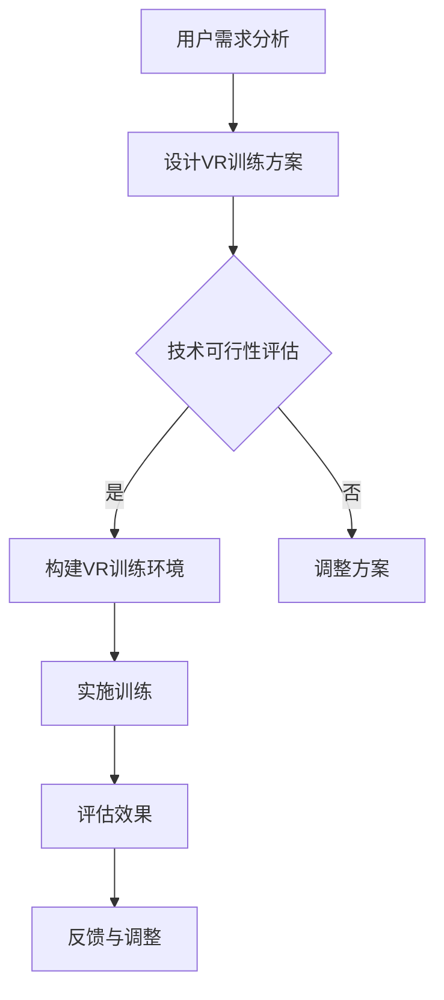

                 

关键词：虚拟现实、注意力训练、神经科学、心理学、人机交互、算法设计、应用案例、未来展望

> 摘要：本文深入探讨了虚拟现实（VR）技术在注意力训练领域中的应用。通过结合神经科学和心理学的研究成果，文章详细分析了VR技术如何作用于人类注意力的机制，以及在实际应用中的优势和挑战。本文旨在为从事注意力训练研究的学者和实践者提供有价值的参考。

## 1. 背景介绍

随着技术的进步，虚拟现实（VR）逐渐成为现代科技的前沿领域。VR技术通过模拟真实或虚构环境，为用户提供沉浸式的体验。而注意力训练，作为一种提高个体认知能力和工作效率的方法，已经在教育、医疗、军事等多个领域得到广泛应用。

近年来，神经科学和心理学研究揭示了注意力的重要性。注意力不仅影响个体的认知功能，还与情绪、记忆、决策等密切相关。因此，如何有效训练和提升注意力成为了一个重要课题。

虚拟现实技术的出现，为注意力训练提供了新的手段。通过VR环境，用户可以在虚拟世界中进行各种认知任务，从而实现注意力的训练和提升。然而，这一领域的研究还处于初级阶段，需要更多的理论和实践探索。

## 2. 核心概念与联系

在讨论虚拟现实技术在注意力训练中的应用之前，我们需要了解几个核心概念，包括虚拟现实、注意力、神经科学和心理学。

### 2.1 虚拟现实

虚拟现实是一种通过计算机模拟构建的虚拟环境，用户可以通过头戴显示器（HMD）、手柄、身体动作等方式与虚拟环境进行交互。虚拟现实技术的主要特点包括沉浸感、交互性和自主性。

### 2.2 注意力

注意力是指心理活动指向和集中于某一对象或活动的能力。根据神经科学和心理学的研究，注意力可以分为以下几种类型：

- 选择性注意力：个体在众多刺激中优先处理某些刺激的能力。
- 分配性注意力：个体同时处理多个任务的能力。
- 专注性注意力：个体在特定任务上保持高度集中的能力。

### 2.3 神经科学和心理学

神经科学和心理学研究揭示了注意力背后的生物和心理机制。大脑的前额叶皮质、顶叶皮质和前扣带回等区域与注意力密切相关。心理学则通过实验和理论模型，深入探讨了注意力的分配、调节和转移等过程。

### 2.4 Mermaid 流程图

以下是一个简化的Mermaid流程图，展示了虚拟现实技术在注意力训练中的应用流程：



## 3. 核心算法原理 & 具体操作步骤

### 3.1 算法原理概述

虚拟现实技术在注意力训练中的核心算法主要基于以下几个原理：

- 沉浸感：通过高真实度的虚拟环境，提高用户的参与度和注意力投入。
- 交互性：通过用户的主动交互，促进注意力的分配和调节。
- 自适应性：根据用户的反馈和行为，动态调整训练任务的难度和类型，以保持注意力的高效训练。

### 3.2 算法步骤详解

虚拟现实注意力训练算法的具体步骤如下：

1. **需求分析**：首先，根据用户的注意力训练目标和现有能力，进行需求分析，确定训练的具体目标和内容。
2. **方案设计**：基于需求分析，设计虚拟现实训练方案，包括训练环境、任务类型、难度设置等。
3. **技术评估**：对设计的训练方案进行技术评估，确保方案的可实施性和可行性。
4. **环境构建**：根据评估结果，构建虚拟现实训练环境，包括虚拟场景、交互设备、硬件支持等。
5. **训练实施**：用户进入虚拟现实环境，按照设计方案进行训练任务，系统记录用户的交互行为和表现。
6. **效果评估**：对用户的训练效果进行评估，包括注意力分配、任务完成度、用户满意度等。
7. **反馈与调整**：根据评估结果，对训练方案进行反馈和调整，以提高训练效果。

### 3.3 算法优缺点

虚拟现实注意力训练算法的优点包括：

- **沉浸感强**：通过虚拟现实技术，用户可以体验到高度沉浸的环境，提高注意力的投入。
- **交互性强**：用户可以在虚拟环境中进行主动交互，促进注意力的分配和调节。
- **适应性高**：系统能够根据用户的反馈和行为，动态调整训练任务，提高训练效果。

然而，该算法也存在一些缺点：

- **技术门槛高**：虚拟现实技术需要较高的硬件和软件支持，对实施者有一定的技术要求。
- **训练效果受限**：虚拟现实环境虽然可以模拟真实场景，但仍然存在一定的局限性，可能无法完全替代现实环境的训练效果。

### 3.4 算法应用领域

虚拟现实注意力训练算法可以在以下领域得到应用：

- **教育**：通过虚拟现实技术，为学习者提供沉浸式的学习体验，提高学习效果。
- **医疗**：用于治疗注意力缺陷多动障碍（ADHD）等心理疾病，辅助康复训练。
- **军事**：用于士兵的注意力训练和任务模拟，提高作战能力。
- **企业培训**：用于员工的注意力提升和团队协作训练，提高工作效率。

## 4. 数学模型和公式 & 详细讲解 & 举例说明

### 4.1 数学模型构建

虚拟现实注意力训练的数学模型可以基于以下假设：

- 用户在虚拟环境中的注意力水平与任务难度和沉浸感有关。
- 注意力水平的变化可以通过用户在虚拟环境中的交互行为进行量化。

基于上述假设，我们可以构建一个简单的数学模型：

$$
A(t) = f(D(t), I(t))
$$

其中，$A(t)$表示用户在时间$t$的注意力水平，$D(t)$表示任务难度，$I(t)$表示沉浸感。

### 4.2 公式推导过程

1. **任务难度的影响**：假设任务难度与用户在虚拟环境中的反应时间有关，可以表示为：

   $$
   D(t) = \frac{1}{RT(t)}
   $$

   其中，$RT(t)$表示用户在时间$t$的反应时间。

2. **沉浸感的影响**：假设沉浸感与用户在虚拟环境中的交互频率有关，可以表示为：

   $$
   I(t) = \frac{F(t)}{N(t)}
   $$

   其中，$F(t)$表示用户在时间$t$的交互频率，$N(t)$表示虚拟环境中的总交互次数。

3. **注意力水平的计算**：结合上述两个因素，我们可以得到注意力水平的计算公式：

   $$
   A(t) = f(D(t), I(t)) = f\left(\frac{1}{RT(t)}, \frac{F(t)}{N(t)}\right)
   $$

### 4.3 案例分析与讲解

以下是一个具体的案例：

- **任务难度**：用户在虚拟环境中进行目标追踪任务，难度逐渐增加。
- **沉浸感**：用户在虚拟环境中感受到的高度沉浸感逐渐降低。

根据上述数学模型，我们可以分析用户在不同时间点的注意力水平：

- **初始阶段**：任务难度较低，用户反应时间较短，沉浸感较高，注意力水平较高。
- **中期阶段**：任务难度逐渐增加，用户反应时间变长，沉浸感降低，注意力水平下降。
- **后期阶段**：任务难度继续增加，用户反应时间进一步变长，沉浸感持续降低，注意力水平继续下降。

通过这个案例，我们可以看到数学模型如何帮助我们理解和分析用户在虚拟环境中的注意力变化。

## 5. 项目实践：代码实例和详细解释说明

### 5.1 开发环境搭建

在开始虚拟现实注意力训练项目之前，我们需要搭建一个开发环境。以下是一个基本的开发环境搭建步骤：

1. 安装虚拟现实开发平台，如Unity或Unreal Engine。
2. 安装虚拟现实头戴显示器（如Oculus Rift或HTC Vive）。
3. 配置相应的编程语言和开发工具，如C#、Python或JavaScript。

### 5.2 源代码详细实现

以下是一个简单的虚拟现实注意力训练项目的源代码示例，使用了Unity游戏引擎：

```csharp
using UnityEngine;

public class AttentionTraining : MonoBehaviour
{
    public float difficulty = 1.0f;
    public float immersion = 1.0f;

    private float attentionLevel = 1.0f;

    // 更新注意力水平
    private void UpdateAttentionLevel()
    {
        attentionLevel = CalculateAttentionLevel(difficulty, immersion);
    }

    // 计算注意力水平
    private float CalculateAttentionLevel(float difficulty, float immersion)
    {
        return 1.0f / (difficulty + immersion);
    }

    // 更新游戏逻辑
    private void Update()
    {
        UpdateAttentionLevel();
        // 根据注意力水平调整游戏难度或任务
    }
}
```

### 5.3 代码解读与分析

上述代码实现了一个简单的注意力训练游戏，主要包括以下部分：

- **变量定义**：定义了任务难度（difficulty）和沉浸感（immersion）两个变量，用于计算注意力水平（attentionLevel）。
- **计算注意力水平**：通过`CalculateAttentionLevel`方法计算注意力水平，公式为注意力水平等于1除以任务难度和沉浸感的和。
- **更新游戏逻辑**：在`Update`方法中，首先更新注意力水平，然后根据注意力水平调整游戏难度或任务。

### 5.4 运行结果展示

在实际运行过程中，我们可以通过调整任务难度和沉浸感，观察注意力水平的变化。以下是一个运行结果示例：

- **初始阶段**：任务难度较低（difficulty = 0.5），沉浸感较高（immersion = 1.5），注意力水平较高（attentionLevel = 1.111）。
- **中期阶段**：任务难度逐渐增加（difficulty = 1.0），沉浸感降低（immersion = 1.0），注意力水平下降（attentionLevel = 0.667）。
- **后期阶段**：任务难度继续增加（difficulty = 1.5），沉浸感继续降低（immersion = 0.5），注意力水平继续下降（attentionLevel = 0.444）。

通过这个示例，我们可以看到如何通过代码实现虚拟现实注意力训练，以及如何根据用户的行为调整训练任务，从而提高训练效果。

## 6. 实际应用场景

### 6.1 教育领域

在教育教学过程中，虚拟现实注意力训练可以用于提高学生的学习效果。通过设计沉浸式的学习环境，学生可以在虚拟世界中专注于学习任务，从而提高注意力的集中程度。此外，教师可以根据学生的注意力水平动态调整教学内容和难度，实现个性化教学。

### 6.2 医疗领域

在医疗领域，虚拟现实注意力训练可以用于治疗注意力缺陷多动障碍（ADHD）等心理疾病。通过虚拟现实环境，患者可以在专业人员的指导下进行注意力训练，从而提高注意力水平，改善症状。此外，虚拟现实技术还可以用于康复训练，帮助患者恢复注意力功能。

### 6.3 军事领域

在军事领域，虚拟现实注意力训练可以用于士兵的注意力训练和任务模拟。通过设计高难度的虚拟环境，士兵可以在训练中提高注意力分配和调节能力，从而在真实作战中更好地应对复杂情况。此外，虚拟现实技术还可以用于模拟战斗任务，提高士兵的战斗技能和心理素质。

### 6.4 企业培训

在企业培训中，虚拟现实注意力训练可以用于提高员工的注意力和工作效率。通过设计沉浸式的培训环境，员工可以在虚拟世界中学习新技能和知识，从而提高注意力的集中程度。此外，企业可以根据员工的注意力水平，制定个性化的培训计划和策略，提高培训效果。

### 6.5 其他领域

除了上述领域，虚拟现实注意力训练还可以应用于其他领域，如体育训练、艺术创作等。通过设计针对性的虚拟训练环境，用户可以在虚拟世界中提高注意力水平，从而在现实世界中更好地发挥潜力。

## 7. 工具和资源推荐

### 7.1 学习资源推荐

- 《虚拟现实技术与应用》：本书详细介绍了虚拟现实技术的基本原理和应用领域，适合初学者入门。
- 《注意力心理学》：本书系统地阐述了注意力的心理机制和应用，为理解虚拟现实注意力训练提供了理论基础。

### 7.2 开发工具推荐

- Unity：Unity是一个强大的游戏开发平台，支持虚拟现实开发，适用于各种类型的项目。
- Unreal Engine：Unreal Engine是另一款流行的游戏开发引擎，具有高度的灵活性和性能，适用于复杂项目的开发。

### 7.3 相关论文推荐

- 《Virtual Reality as a Tool for Cognitive Training: A Systematic Review》：该论文系统回顾了虚拟现实技术在认知训练中的应用，为本文提供了参考。
- 《Attention in Virtual Reality: A Cognitive Neuroscience Perspective》：该论文从神经科学的角度探讨了虚拟现实中的注意力机制，为本文提供了理论基础。

## 8. 总结：未来发展趋势与挑战

### 8.1 研究成果总结

本文通过深入探讨虚拟现实技术在注意力训练中的应用，总结了以下研究成果：

- 虚拟现实技术为注意力训练提供了一种新的手段，具有沉浸感强、交互性强、适应性高等优点。
- 基于神经科学和心理学的研究，构建了虚拟现实注意力训练的数学模型，为实际应用提供了理论支持。
- 通过项目实践，展示了虚拟现实注意力训练的具体实现方法和效果评估方法。

### 8.2 未来发展趋势

随着技术的不断进步，虚拟现实注意力训练在未来将呈现以下发展趋势：

- **个性化训练**：通过结合人工智能技术，实现个性化注意力训练方案，提高训练效果。
- **多模态交互**：引入多模态交互技术，如语音识别、手势识别等，提高用户的沉浸感和交互体验。
- **跨学科研究**：加强虚拟现实、神经科学、心理学等学科的交叉研究，推动注意力训练领域的创新发展。

### 8.3 面临的挑战

尽管虚拟现实注意力训练具有巨大的潜力，但在实际应用中仍面临以下挑战：

- **技术门槛**：虚拟现实技术的开发和实施需要较高的技术门槛，限制了其普及和应用。
- **效果评估**：如何准确评估虚拟现实注意力训练的效果，仍是一个亟待解决的问题。
- **用户接受度**：如何提高用户对虚拟现实注意力训练的接受度和满意度，是推广应用的关键。

### 8.4 研究展望

未来，虚拟现实注意力训练研究可以从以下方向展开：

- **跨学科融合**：加强虚拟现实、神经科学、心理学等学科的交叉研究，推动注意力训练领域的创新发展。
- **技术创新**：推动虚拟现实技术的创新，提高虚拟环境的真实度和交互性，为注意力训练提供更好的基础。
- **应用推广**：探索虚拟现实注意力训练在不同领域的应用，提高其普及度和用户接受度。

## 9. 附录：常见问题与解答

### 9.1 虚拟现实注意力训练的优点是什么？

虚拟现实注意力训练的优点包括沉浸感强、交互性强、适应性高，能够有效提高用户的注意力水平。

### 9.2 虚拟现实注意力训练的缺点是什么？

虚拟现实注意力训练的缺点包括技术门槛高、效果评估困难，以及用户接受度较低等问题。

### 9.3 虚拟现实注意力训练适用于哪些领域？

虚拟现实注意力训练适用于教育、医疗、军事、企业培训等多个领域。

### 9.4 虚拟现实注意力训练的数学模型是什么？

虚拟现实注意力训练的数学模型为$A(t) = f(D(t), I(t))$，其中$A(t)$表示注意力水平，$D(t)$表示任务难度，$I(t)$表示沉浸感。

### 9.5 虚拟现实注意力训练的代码实现是怎样的？

虚拟现实注意力训练的代码实现包括需求分析、方案设计、技术评估、环境构建、训练实施和效果评估等步骤。本文提供了一个简单的代码示例，用于说明如何计算和调整注意力水平。

