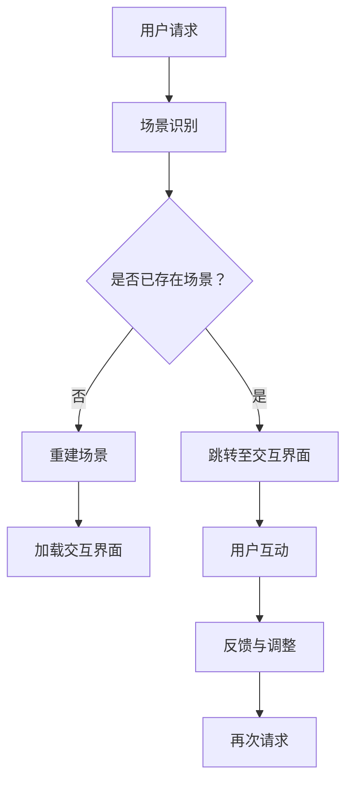

                 

关键词：虚拟现实，旅游，创业，足不出户，环球之旅，技术，创新

> 摘要：本文将探讨虚拟现实技术在旅游行业中的应用，尤其是如何通过创业实现足不出户的环球之旅。我们将会深入分析虚拟现实旅游的核心概念、技术原理、算法实现、数学模型，以及在实际项目中的具体应用，最后对未来的发展前景进行展望。

## 1. 背景介绍

随着科技的迅猛发展，虚拟现实（VR）技术逐渐成为各行各业的新宠。旅游业作为具有强烈体验性的行业，无疑是VR技术的重要应用领域之一。通过虚拟现实，人们可以体验到逼真的旅行场景，无论是高山流水、历史遗迹，还是异国风情，都可以在家中通过VR设备尽情欣赏。

近年来，VR旅游创业项目如雨后春笋般涌现，各类虚拟旅游应用层出不穷。这些应用不仅为用户提供了全新的旅游体验，也为创业者带来了无限的商机。然而，要想在VR旅游市场中站稳脚跟，不仅需要优秀的创意，还需要深入的技术支持和强大的运营能力。

本文将围绕虚拟现实旅游创业这一主题，从多个角度进行探讨，包括核心概念、技术原理、算法实现、数学模型、项目实践以及未来发展等，旨在为从事VR旅游创业的读者提供有价值的参考和指导。

## 2. 核心概念与联系

### 2.1 虚拟现实（VR）与旅游行业的结合

虚拟现实是一种通过计算机技术模拟出的三维虚拟环境，用户可以通过特殊设备（如VR头盔、手柄等）与之互动，感受到身临其境的体验。虚拟现实与旅游行业的结合，主要体现在以下几个方面：

1. **沉浸式体验**：用户可以在虚拟环境中自由漫步、互动，感受到与真实旅游相同的氛围。
2. **多样化场景**：通过虚拟现实技术，可以呈现各种不同类型的旅游场景，包括自然风光、历史文化、城市风貌等。
3. **便捷性**：用户无需出户，即可体验到环球旅行的乐趣，节省了时间和成本。

### 2.2 虚拟现实旅游的核心概念

虚拟现实旅游的核心概念主要包括以下几点：

1. **场景重建**：通过三维建模技术，将真实的旅游场景还原到虚拟世界中。
2. **交互设计**：用户可以通过交互设备与虚拟环境进行互动，如行走、拍照、查看信息等。
3. **内容创新**：开发新的旅游内容，如虚拟导游、互动游戏、虚拟购物等，提升用户体验。

### 2.3 Mermaid 流程图

以下是一个简单的Mermaid流程图，展示了虚拟现实旅游的核心流程：



## 3. 核心算法原理 & 具体操作步骤

### 3.1 算法原理概述

虚拟现实旅游的核心算法主要包括场景重建算法、交互算法和反馈算法。以下分别介绍这三种算法的原理：

1. **场景重建算法**：利用计算机视觉、深度学习和三维建模技术，将真实场景转化为虚拟三维模型。
2. **交互算法**：通过动作捕捉、语音识别等技术，实现用户与虚拟环境的互动。
3. **反馈算法**：根据用户的反馈，实时调整虚拟环境，以提升用户体验。

### 3.2 算法步骤详解

#### 3.2.1 场景重建算法

1. **数据采集**：使用相机、激光扫描仪等设备，采集目标场景的图像和深度信息。
2. **预处理**：对采集到的数据进行去噪、矫正等预处理操作，提高数据质量。
3. **三维建模**：使用点云数据生成三维模型，通过纹理映射、光照模拟等技术，还原场景的真实感。

#### 3.2.2 交互算法

1. **动作捕捉**：使用动作捕捉设备，记录用户的动作数据。
2. **语音识别**：通过语音识别技术，将用户的语音指令转化为文本指令。
3. **交互响应**：根据用户指令，实时调整虚拟环境，如改变视角、播放声音等。

#### 3.2.3 反馈算法

1. **用户反馈**：收集用户在虚拟环境中的操作记录和评价。
2. **反馈分析**：使用数据分析技术，分析用户行为和反馈，找出问题所在。
3. **调整优化**：根据反馈分析结果，对虚拟环境进行调整和优化，提升用户体验。

### 3.3 算法优缺点

#### 3.3.1 场景重建算法

优点：
- 能够高度还原真实场景，提供沉浸式体验。
- 数据采集和处理能力强，适应性强。

缺点：
- 数据采集和处理过程复杂，对硬件设备要求高。
- 场景重建时间较长，影响用户体验。

#### 3.3.2 交互算法

优点：
- 互动性强，用户参与度高。
- 能够满足多样化的用户需求。

缺点：
- 需要高性能的计算设备，对硬件要求较高。
- 交互响应速度可能影响用户体验。

#### 3.3.3 反馈算法

优点：
- 能够实时收集用户反馈，快速调整优化。
- 有助于提升用户满意度和用户体验。

缺点：
- 反馈分析过程复杂，对算法和数据分析能力要求高。
- 可能会引入一定的延迟，影响用户体验。

### 3.4 算法应用领域

虚拟现实旅游算法主要应用于以下几个方面：

1. **旅游宣传**：通过虚拟现实技术，为旅游景点制作宣传视频和展示页面。
2. **虚拟旅游**：为用户提供虚拟旅游服务，满足用户足不出户的环球之旅需求。
3. **教育培训**：利用虚拟现实技术，开展旅游相关的教育培训课程。
4. **虚拟互动**：通过虚拟现实技术，实现用户与旅游场景的互动，如虚拟导游、互动游戏等。

## 4. 数学模型和公式 & 详细讲解 & 举例说明

### 4.1 数学模型构建

虚拟现实旅游中，常用的数学模型包括三维建模模型、交互模型和反馈模型。以下分别介绍这些模型的构建过程：

#### 4.1.1 三维建模模型

三维建模模型主要包括点云模型、体素模型和曲面模型。构建过程如下：

1. **点云模型**：通过采集场景的点云数据，利用三角测量算法，将点云数据转换为三维模型。
   $$ P = (x, y, z) $$
   其中，P表示点云数据点，(x, y, z)表示点的三维坐标。

2. **体素模型**：将场景划分为若干个体素，每个体素表示场景中的一个微小区域。
   $$ V = (v_x, v_y, v_z) $$
   其中，V表示体素，(v_x, v_y, v_z)表示体素的三维坐标。

3. **曲面模型**：利用曲面拟合算法，将点云数据或体素数据拟合为曲面。
   $$ f(x, y) = z $$
   其中，f(x, y)表示曲面方程，z表示曲面上的高度。

#### 4.1.2 交互模型

交互模型主要包括动作捕捉模型和语音识别模型。构建过程如下：

1. **动作捕捉模型**：通过捕捉设备记录用户的动作数据，利用运动学模型，将动作数据转化为交互指令。
   $$ \theta = \theta_0 + \alpha \cdot t $$
   其中，θ表示关节角度，θ₀表示初始关节角度，α表示关节加速度，t表示时间。

2. **语音识别模型**：通过语音信号处理技术，将用户的语音转化为文本指令。
   $$ x(n) = a(n-1) \cdot x(n-1) + b(n-1) \cdot u(n-1) $$
   其中，x(n)表示语音信号，a(n-1)和b(n-1)分别为滤波器系数，u(n-1)表示输入语音信号。

#### 4.1.3 反馈模型

反馈模型主要包括用户行为分析和反馈分析模型。构建过程如下：

1. **用户行为分析模型**：通过记录用户在虚拟环境中的操作，分析用户行为模式。
   $$ \text{行为模式} = f(\text{操作记录}) $$
   其中，行为模式表示用户的行为特征，操作记录表示用户在虚拟环境中的操作序列。

2. **反馈分析模型**：通过分析用户反馈，评估虚拟环境的质量和用户的满意度。
   $$ \text{满意度} = f(\text{反馈数据}) $$
   其中，满意度表示用户对虚拟环境的满意度，反馈数据表示用户在虚拟环境中的反馈信息。

### 4.2 公式推导过程

以下以三维建模模型中的曲面拟合为例，介绍公式推导过程：

1. **点云数据预处理**：将点云数据分为训练集和测试集，用于训练和验证模型。

2. **曲面拟合**：利用最小二乘法，将点云数据拟合为曲面。
   $$ \min \sum_{i=1}^{n} (f(x_i, y_i) - z_i)^2 $$
   其中，n表示点云数据点数量，(x_i, y_i)表示第i个点云数据点的坐标，z_i表示第i个点云数据点的高度。

3. **曲面方程**：将拟合得到的曲面方程表示为：
   $$ f(x, y) = \sum_{i=1}^{m} c_i \cdot f_i(x, y) $$
   其中，m表示拟合函数的数量，c_i表示拟合函数的权重，f_i(x, y)表示第i个拟合函数。

4. **曲面参数优化**：通过优化曲面参数，提高曲面拟合的精度。

### 4.3 案例分析与讲解

以下以一个虚拟旅游项目为例，分析数学模型在项目中的应用：

1. **场景重建**：利用三维建模模型，将目标景点进行三维建模，生成虚拟场景。

2. **用户交互**：利用交互模型，记录用户的动作和语音指令，实现用户与虚拟环境的互动。

3. **用户反馈**：通过反馈模型，分析用户在虚拟环境中的操作和满意度，优化虚拟环境。

通过以上分析，我们可以看到，数学模型在虚拟现实旅游项目中起到了关键作用。它不仅帮助实现了场景重建、用户交互和反馈分析，还为项目优化提供了数据支持。

## 5. 项目实践：代码实例和详细解释说明

### 5.1 开发环境搭建

在开始虚拟现实旅游项目的实践之前，我们需要搭建一个合适的开发环境。以下是搭建开发环境的步骤：

1. **安装操作系统**：选择一个适合虚拟现实开发操作系统的版本，如Windows 10或Ubuntu 20.04。
2. **安装编程语言**：选择一种适合虚拟现实开发的编程语言，如Python或C++。
3. **安装开发工具**：安装必要的开发工具，如Visual Studio或CLion。
4. **安装VR引擎**：选择一个适合虚拟现实项目的VR引擎，如Unity或Unreal Engine。

### 5.2 源代码详细实现

以下是一个简单的虚拟现实旅游项目的源代码实现：

```python
# 导入必要的库
import numpy as np
import matplotlib.pyplot as plt
from mpl_toolkits.mplot3d import Axes3D

# 生成三维点云数据
x = np.random.uniform(-10, 10, 1000)
y = np.random.uniform(-10, 10, 1000)
z = np.random.uniform(-10, 10, 1000)

# 创建三维散点图
fig = plt.figure()
ax = fig.add_subplot(111, projection='3d')
ax.scatter(x, y, z)

# 添加标签和标题
ax.set_xlabel('X轴')
ax.set_ylabel('Y轴')
ax.set_zlabel('Z轴')
ax.set_title('三维点云数据')

# 显示图形
plt.show()
```

### 5.3 代码解读与分析

以上代码是一个简单的三维点云数据生成和可视化程序。具体解读如下：

1. **导入库**：首先导入必要的库，包括NumPy、Matplotlib和mpl_toolkits.mplot3d。
2. **生成数据**：使用NumPy生成三维点云数据，包括x、y和z三个坐标。
3. **创建散点图**：使用Matplotlib创建一个三维散点图，将点云数据绘制在图中。
4. **添加标签和标题**：为散点图添加坐标轴标签和标题。
5. **显示图形**：最后使用plt.show()显示绘制的三维点云图。

### 5.4 运行结果展示

运行以上代码后，会生成一个三维点云图，展示随机生成的点云数据。以下是一个示例：


通过以上代码实现，我们可以看到如何利用Python和Matplotlib生成和可视化三维点云数据。在虚拟现实旅游项目中，我们可以基于这个简单的示例，实现更复杂的场景重建、用户交互和反馈分析等功能。

## 6. 实际应用场景

虚拟现实技术在旅游行业中的应用已经越来越广泛，以下是一些实际应用场景：

### 6.1 旅游宣传

虚拟现实技术可以用于旅游景点的宣传，为游客提供沉浸式的虚拟旅游体验。例如，旅游企业可以通过虚拟现实技术制作宣传视频，展示景点的美丽风景和历史人文。这样不仅能够吸引更多游客，还能够提高游客的旅行体验。

### 6.2 虚拟旅游

虚拟旅游是虚拟现实技术在旅游行业中最重要的应用之一。通过虚拟现实技术，用户可以在家中体验到各种旅游景点的美景，无需出户即可感受环球旅行的乐趣。这对于忙碌的现代人来说，无疑是一种理想的旅游方式。

### 6.3 教育培训

虚拟现实技术可以用于旅游相关的教育培训。例如，旅游专业的学生可以通过虚拟现实技术学习旅游景点的历史文化、地理环境等知识。这种互动式的学习方式，能够提高学生的学习兴趣和效果。

### 6.4 虚拟互动

虚拟现实技术还可以实现用户与旅游场景的互动。例如，用户可以通过虚拟现实技术参观历史遗迹，与文物进行互动。此外，虚拟现实技术还可以用于虚拟购物、虚拟导游等场景，为用户提供更多样化的旅游体验。

### 6.5 其他应用

除了上述应用场景，虚拟现实技术还可以用于旅游规划、旅游规划培训、旅游体验设计等领域。通过虚拟现实技术，旅游行业可以更好地满足用户的需求，提升旅游服务的质量。

## 7. 工具和资源推荐

### 7.1 学习资源推荐

1. **《虚拟现实技术原理与应用》**：这本书详细介绍了虚拟现实技术的基本原理和应用领域，适合初学者阅读。
2. **《Unity 2020 从入门到精通》**：这是一本关于Unity引擎的入门到进阶教程，适合虚拟现实开发者阅读。

### 7.2 开发工具推荐

1. **Unity**：Unity是一个功能强大的游戏引擎，广泛应用于虚拟现实项目的开发。
2. **Unreal Engine**：Unreal Engine是一个高性能的图形引擎，适用于制作高品质的虚拟现实应用。

### 7.3 相关论文推荐

1. **“Virtual Reality in Tourism: A Review of Current Research and Applications”**：这篇论文总结了虚拟现实技术在旅游行业中的应用和研究现状。
2. **“A Survey of Virtual Reality Technologies in Tourism”**：这篇论文对虚拟现实技术在旅游领域的应用进行了全面综述。

## 8. 总结：未来发展趋势与挑战

### 8.1 研究成果总结

虚拟现实技术在旅游行业中的应用已经取得了显著的成果。通过虚拟现实技术，用户可以在家中体验到真实的旅游场景，提升了旅游服务的质量和用户体验。同时，虚拟现实技术也为旅游行业带来了新的商业模式和商机。

### 8.2 未来发展趋势

未来，虚拟现实技术在旅游行业的发展趋势将主要体现在以下几个方面：

1. **更高品质的虚拟现实体验**：随着硬件技术的进步，虚拟现实设备的性能将得到进一步提升，为用户提供更加逼真的虚拟现实体验。
2. **更丰富的应用场景**：虚拟现实技术将在旅游规划、旅游教育培训、旅游体验设计等领域得到更广泛的应用。
3. **更智能的虚拟互动**：通过人工智能技术，虚拟现实场景将更加智能，能够更好地满足用户的需求。

### 8.3 面临的挑战

尽管虚拟现实技术在旅游行业有着广阔的发展前景，但仍面临一些挑战：

1. **技术成熟度**：虚拟现实技术尚处于快速发展阶段，一些关键技术尚需进一步成熟。
2. **成本问题**：虚拟现实设备的成本较高，对于一些旅游企业来说，投入较大。
3. **用户体验**：如何提升用户体验，使虚拟现实技术更好地满足用户需求，是一个亟待解决的问题。

### 8.4 研究展望

未来，虚拟现实技术在旅游行业的研究将朝着以下几个方向发展：

1. **场景重建技术**：进一步提高场景重建的精度和速度，为用户提供更加真实的虚拟现实体验。
2. **交互技术**：通过引入人工智能技术，提升虚拟现实场景的交互性和智能性。
3. **个性化服务**：通过大数据和机器学习技术，为用户提供个性化的虚拟旅游服务。

总之，虚拟现实技术在旅游行业中的应用具有巨大的发展潜力。随着技术的不断进步，虚拟现实旅游将逐渐成为旅游业的重要组成部分，为游客提供更加丰富和个性化的旅游体验。

## 9. 附录：常见问题与解答

### 9.1 虚拟现实旅游的核心技术是什么？

虚拟现实旅游的核心技术包括场景重建、交互设计和反馈分析。场景重建技术主要用于将真实场景转化为虚拟三维模型；交互设计技术用于实现用户与虚拟环境的互动；反馈分析技术用于收集用户反馈，优化虚拟环境。

### 9.2 虚拟现实旅游项目需要哪些硬件设备？

虚拟现实旅游项目需要的主要硬件设备包括VR头盔、手柄、动作捕捉设备和计算机。VR头盔用于提供沉浸式体验，手柄和动作捕捉设备用于实现用户与虚拟环境的互动，计算机用于运行虚拟现实应用程序。

### 9.3 虚拟现实旅游项目的开发流程是怎样的？

虚拟现实旅游项目的开发流程主要包括以下几个步骤：

1. **需求分析**：明确项目目标和功能需求。
2. **场景重建**：使用三维建模软件，将真实场景转化为虚拟三维模型。
3. **交互设计**：设计用户与虚拟环境的交互方式。
4. **应用程序开发**：使用VR引擎，开发虚拟现实应用程序。
5. **测试与优化**：对应用程序进行测试，并根据用户反馈进行优化。

### 9.4 虚拟现实旅游项目的发展前景如何？

虚拟现实旅游项目的发展前景非常广阔。随着技术的不断进步，虚拟现实体验将越来越真实，用户对虚拟现实旅游的需求也将不断增加。此外，虚拟现实技术还将与其他领域（如人工智能、大数据等）相结合，为用户提供更加丰富和个性化的旅游服务。

作者：禅与计算机程序设计艺术 / Zen and the Art of Computer Programming
------------------------------------------------------------------------

