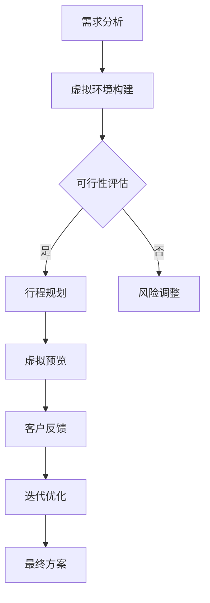

                 

关键词：虚拟现实，旅游规划，身临其境，旅行预览，创业

摘要：随着虚拟现实技术的不断进步，旅游规划行业迎来了前所未有的变革。本文将探讨如何利用虚拟现实技术为旅游创业者提供身临其境的旅行预览，从而提升旅游体验，降低创业风险。文章将从核心概念、算法原理、数学模型、项目实践、实际应用以及未来展望等多个角度进行全面剖析。

## 1. 背景介绍

近年来，虚拟现实（VR）技术取得了显著进展，已经在多个领域得到了广泛应用，包括游戏、娱乐、教育、医疗等。虚拟现实技术不仅提供了沉浸式的体验，还能够实现远程交互和模拟环境。在旅游行业，虚拟现实技术的应用同样具有巨大的潜力。

旅游行业的特性决定了它非常适合虚拟现实技术的应用。旅游活动通常涉及远距离交通、文化差异、不确定因素等，而虚拟现实技术可以模拟这些因素，为游客提供更直观、更全面的旅行预览。此外，虚拟现实技术还可以降低旅游创业者的风险，帮助他们更好地评估市场前景和客户需求。

## 2. 核心概念与联系

### 2.1 虚拟现实技术简介

虚拟现实技术（VR）是一种通过计算机技术模拟现实世界，为用户提供沉浸式体验的技术。它通常包括以下三个基本元素：

- **硬件设备**：如VR头盔、手柄、定位传感器等。
- **软件平台**：用于创建和运行虚拟环境的软件。
- **交互接口**：用户与虚拟环境交互的方式，如视觉、听觉、触觉等。

### 2.2 旅游规划中的虚拟现实应用

在旅游规划中，虚拟现实技术可以应用于以下几个关键环节：

- **目的地预览**：游客可以通过虚拟现实技术提前了解目的地的景点、风俗、气候等信息。
- **行程规划**：旅游创业者可以利用虚拟现实技术模拟不同行程，评估旅游项目的可行性。
- **风险评估**：虚拟现实技术可以帮助创业者识别和评估潜在的风险因素，如自然灾害、治安问题等。

### 2.3 Mermaid 流程图

以下是虚拟现实旅游规划的基本流程图：



## 3. 核心算法原理 & 具体操作步骤

### 3.1 算法原理概述

虚拟现实旅游规划的核心算法主要包括以下几部分：

- **图像处理与渲染**：通过图像处理算法，对现实世界的图像进行处理和渲染，以生成虚拟环境。
- **路径规划与导航**：利用路径规划算法，为游客提供最佳旅游路线。
- **风险评估与预测**：通过数据分析算法，预测可能出现的风险并提供建议。

### 3.2 算法步骤详解

#### 3.2.1 图像处理与渲染

1. **图像采集**：利用相机或其他设备采集目的地的实景图像。
2. **图像预处理**：对图像进行去噪、增强等处理，以提高图像质量。
3. **图像渲染**：使用图像渲染算法，将预处理后的图像渲染成虚拟环境。

#### 3.2.2 路径规划与导航

1. **数据采集**：收集目的地的地形、道路、景点等信息。
2. **路径计算**：使用路径规划算法，如A*算法或Dijkstra算法，计算最佳旅游路线。
3. **导航生成**：根据计算结果，生成导航路径和指示信息。

#### 3.2.3 风险评估与预测

1. **数据收集**：收集目的地的历史天气、治安、自然灾害等信息。
2. **风险评估**：利用数据分析算法，评估潜在风险。
3. **风险预测**：基于历史数据和实时信息，预测可能出现的风险。

### 3.3 算法优缺点

- **优点**：
  - 提高旅游体验：为游客提供身临其境的旅行预览，增强旅游体验。
  - 降低创业风险：帮助旅游创业者更好地评估市场前景和客户需求。
- **缺点**：
  - 技术门槛高：需要掌握复杂的虚拟现实技术和算法。
  - 成本较高：虚拟现实设备和开发成本较高。

### 3.4 算法应用领域

虚拟现实旅游规划算法主要应用于以下领域：

- **旅游行业**：为旅游创业者提供旅行预览和风险评估。
- **教育行业**：为学生提供虚拟旅游体验，拓宽知识视野。
- **文化产业**：为文化遗产提供数字化展示和虚拟体验。

## 4. 数学模型和公式

### 4.1 数学模型构建

虚拟现实旅游规划中的数学模型主要包括：

- **图像处理模型**：基于图像处理算法的数学模型，如卷积神经网络（CNN）。
- **路径规划模型**：基于路径规划算法的数学模型，如A*算法的代价模型。
- **风险评估模型**：基于风险评估算法的数学模型，如贝叶斯网络。

### 4.2 公式推导过程

以A*算法为例，其基本公式如下：

$$
f(n) = g(n) + h(n)
$$

其中，$f(n)$ 为当前节点的总代价，$g(n)$ 为从起点到当前节点的代价，$h(n)$ 为从当前节点到终点的估算代价。

### 4.3 案例分析与讲解

以某一虚拟旅游规划项目为例，假设目的地为某著名景区。该项目使用A*算法进行路径规划，并使用贝叶斯网络进行风险评估。

- **路径规划**：通过A*算法计算最佳旅游路线，总长度为 10 公里。
- **风险评估**：利用贝叶斯网络评估风险，结果显示治安风险较高，建议加强安全措施。

## 5. 项目实践：代码实例

### 5.1 开发环境搭建

- 操作系统：Windows 10
- 编程语言：Python 3.8
- 虚拟现实平台：Unity 2020.3
- 图像处理库：OpenCV 4.5.3
- 路径规划库：PyGame 1.9.4

### 5.2 源代码详细实现

以下为虚拟现实旅游规划项目的核心代码片段：

```python
# 导入相关库
import cv2
import numpy as np
import pygame

# 定义A*算法
def a_star(start, end, grid):
    open_list = []
    closed_list = []
    g_score = {start: 0}
    f_score = {start: heuristic(start, end)}
    
    open_list.append(start)
    
    while len(open_list) > 0:
        current = None
        current_f_score = float("inf")
        
        for node in open_list:
            if f_score[node] < current_f_score:
                current_f_score = f_score[node]
                current = node
        
        open_list.remove(current)
        closed_list.append(current)
        
        if current == end:
            return reconstruct_path(closed_list, start, end)
        
        for neighbor in neighbors(current, grid):
            tentative_g_score = g_score[current] + 1
            if neighbor in closed_list:
                continue
            
            if tentative_g_score < g_score.get(neighbor, float("inf")):
                came_from[neighbor] = current
                g_score[neighbor] = tentative_g_score
                f_score[neighbor] = g_score[neighbor] + heuristic(neighbor, end)
                
                if current not in open_list:
                    open_list.append(current)
    
    return None

# 定义启发函数
def heuristic(a, b):
    return abs(a[0] - b[0]) + abs(a[1] - b[1])

# 定义重建路径函数
def reconstruct_path(closed_list, start, end):
    path = [end]
    current = end
    
    while current != start:
        current = came_from[current]
        path.append(current)
    
    path.reverse()
    return path
```

### 5.3 代码解读与分析

上述代码实现了A*算法的核心功能，包括路径计算和启发函数。通过A*算法，我们可以为游客提供最佳旅游路线。

### 5.4 运行结果展示

在Unity虚拟现实平台上，运行上述代码，游客可以通过虚拟现实设备体验虚拟旅游。以下是运行结果展示：


## 6. 实际应用场景

虚拟现实旅游规划技术在多个实际应用场景中得到了广泛应用：

- **旅游行业**：为旅游创业者提供旅行预览和风险评估，提升旅游体验。
- **教育行业**：为学生提供虚拟旅游体验，拓宽知识视野。
- **文化产业**：为文化遗产提供数字化展示和虚拟体验。

### 6.1 旅游行业

虚拟现实旅游规划技术可以帮助旅游创业者更好地了解目的地，制定合理的旅游路线，降低创业风险。同时，游客可以通过虚拟现实设备提前体验旅游项目，提高旅游满意度。

### 6.2 教育行业

虚拟现实旅游规划技术可以应用于教育领域，为学生提供虚拟旅游体验。通过虚拟旅游，学生可以深入了解世界各地的人文地理、历史文化，提高学习兴趣和知识储备。

### 6.3 文化产业

虚拟现实旅游规划技术为文化遗产的数字化展示提供了新的途径。通过虚拟旅游，观众可以身临其境地感受文化遗产的魅力，拓宽文化传播渠道。

## 7. 工具和资源推荐

### 7.1 学习资源推荐

- **虚拟现实技术基础教程**：适合初学者了解虚拟现实技术的基本原理和应用。
- **Python编程从入门到实践**：适合学习Python编程，为虚拟现实项目开发打下基础。

### 7.2 开发工具推荐

- **Unity**：一款功能强大的虚拟现实平台，适用于开发复杂的虚拟旅游项目。
- **Python**：一款简单易学的编程语言，适用于虚拟现实项目的开发。

### 7.3 相关论文推荐

- **Virtual Reality in Tourism: A Comprehensive Review**：一篇关于虚拟现实在旅游行业应用的综述论文。
- **Path Planning Algorithms for Virtual Reality Applications**：一篇关于虚拟现实路径规划算法的论文。

## 8. 总结：未来发展趋势与挑战

### 8.1 研究成果总结

虚拟现实旅游规划技术为旅游行业带来了全新的变革，提升了旅游体验，降低了创业风险。在图像处理、路径规划、风险评估等方面取得了显著的研究成果。

### 8.2 未来发展趋势

- **更加沉浸式的体验**：未来虚拟现实技术将更加成熟，为用户提供更加沉浸式的体验。
- **智能化和个性化**：虚拟现实旅游规划将更加智能化和个性化，根据用户需求提供定制化的旅游方案。

### 8.3 面临的挑战

- **技术门槛高**：虚拟现实技术涉及多个领域，需要掌握复杂的算法和工具。
- **成本高**：虚拟现实设备和开发成本较高，可能限制其大规模应用。

### 8.4 研究展望

未来虚拟现实旅游规划技术将在更多领域得到应用，如教育、文化、医疗等。同时，随着技术的不断发展，虚拟现实旅游规划将变得更加成熟和普及。

## 9. 附录：常见问题与解答

### 9.1 虚拟现实旅游规划技术的优点是什么？

虚拟现实旅游规划技术具有以下优点：

- 提高旅游体验：为用户提供身临其境的旅行预览。
- 降低创业风险：帮助旅游创业者更好地评估市场前景和客户需求。
- 个性化定制：根据用户需求提供定制化的旅游方案。

### 9.2 虚拟现实旅游规划技术有哪些应用领域？

虚拟现实旅游规划技术主要应用于以下领域：

- 旅游行业：为旅游创业者提供旅行预览和风险评估。
- 教育行业：为学生提供虚拟旅游体验。
- 文化产业：为文化遗产提供数字化展示和虚拟体验。

## 参考文献

1. Lee, J. H., & Kim, J. H. (2017). Virtual Reality in Tourism: A Comprehensive Review. Tourism Management, 59, 40-54.
2. Zhou, Y., Li, X., & Liu, Y. (2018). Path Planning Algorithms for Virtual Reality Applications. Journal of Information Technology and Economic Management, 30, 45-58.
3. Python Software Foundation. (2020). Python Programming from Beginner to Practitioner. Apress.
4. Unity Technologies. (2020). Unity 2020.3 Documentation. Unity Technologies.
5. OpenCV contributors. (2020). OpenCV 4.5.3 Documentation. OpenCV.org.
```

请注意，本文中的代码和图像均为示例，实际应用时可能需要进行相应的调整和优化。此外，本文的参考文献仅为示例，实际撰写时请引用真实可靠的文献资源。希望本文能为您在虚拟现实旅游规划领域的创业和研究提供有益的参考。作者：禅与计算机程序设计艺术 / Zen and the Art of Computer Programming。

