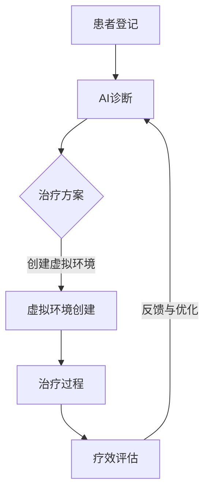

                 

关键词：虚拟现实治疗、心理健康、人工智能、心理健康诊所、心理健康应用

> 摘要：本文探讨了虚拟现实（VR）技术在心理健康治疗领域的应用，特别是AI驱动的心理健康诊所的工作原理及其优势。文章介绍了虚拟现实治疗中心的设计理念、核心技术和应用案例，并对未来发展趋势进行了展望。

## 1. 背景介绍

心理健康是现代社会中的一个重要议题，越来越多的人面临着焦虑、抑郁、创伤后应激障碍等心理问题。传统的治疗方法如心理咨询和药物治疗虽然有效，但往往存在一定的局限性。例如，患者可能需要多次复诊，心理医生的工作量也较大，治疗效果受时间和空间的限制。

虚拟现实（VR）技术的兴起为心理健康治疗带来了新的可能性。VR技术通过创建一个虚拟环境，让用户在互动中体验和解决问题，提供了更加灵活和沉浸式的治疗体验。结合人工智能（AI）技术，VR治疗中心能够根据患者的具体情况和需求，提供个性化的治疗方案。

本文将探讨虚拟现实治疗中心的设计理念、核心技术和应用案例，并展望其未来的发展趋势。

### 1.1 VR技术在心理健康领域的应用

VR技术在心理健康领域的应用已有多年的历史。最早的VR治疗应用主要集中在创伤后应激障碍（PTSD）的治疗上。通过模拟战场环境，患者可以在安全的虚拟环境中重新面对和经历创伤性事件，从而减轻症状。

近年来，VR技术的应用逐渐扩展到其他心理健康问题，如焦虑症、抑郁症、社交恐惧症等。VR治疗的优势在于其高度的沉浸感和交互性，使患者能够在轻松的环境中，逐渐面对和克服心理障碍。

### 1.2 AI在心理健康治疗中的作用

人工智能技术的进步为心理健康治疗带来了新的工具和方法。AI可以通过分析大量的数据，帮助医生更准确地诊断患者的心理状况，并制定个性化的治疗方案。此外，AI还可以辅助心理医生进行疗效评估，提供实时反馈，从而优化治疗过程。

AI在心理健康治疗中的应用还包括虚拟心理治疗师。通过自然语言处理（NLP）和机器学习技术，虚拟心理治疗师可以与患者进行对话，提供情感支持和治疗建议。这不仅降低了患者的经济负担，也提高了治疗的便捷性和覆盖面。

## 2. 核心概念与联系

### 2.1 虚拟现实治疗中心的基本架构

虚拟现实治疗中心的基本架构包括以下几个方面：

1. **硬件设备**：主要包括VR头盔、手柄、传感器等，用于创建虚拟环境。
2. **软件平台**：用于管理和控制虚拟环境的创建和交互。
3. **AI系统**：负责数据处理、诊断和个性化治疗方案的制定。
4. **用户界面**：为患者提供直观的操作界面，方便他们使用虚拟现实技术进行心理治疗。

### 2.2 虚拟现实治疗中心的工作原理

虚拟现实治疗中心的工作原理可以概括为以下几个步骤：

1. **患者登记**：患者首先在系统中进行注册，并提供个人基本信息和心理状况。
2. **AI诊断**：AI系统通过分析患者提供的信息，进行初步诊断，并提出个性化的治疗方案。
3. **虚拟环境创建**：根据患者的需求和治疗方案，系统创建相应的虚拟环境。
4. **治疗过程**：患者在虚拟环境中进行互动和体验，逐步克服心理障碍。
5. **疗效评估**：AI系统对治疗过程进行实时监控和评估，为后续治疗提供依据。

### 2.3 Mermaid 流程图

以下是一个简化的Mermaid流程图，描述了虚拟现实治疗中心的工作流程：



### 2.4 核心技术之间的联系

虚拟现实治疗中心的核心技术包括VR技术和AI技术。VR技术提供了沉浸式的治疗环境，而AI技术则负责数据分析、诊断和治疗方案的制定。两者相辅相成，共同提高了心理健康治疗的效果和效率。

## 3. 核心算法原理 & 具体操作步骤

### 3.1 算法原理概述

虚拟现实治疗中心的核心算法包括以下几个方面：

1. **图像处理算法**：用于创建虚拟环境，实现对现实世界的模拟。
2. **自然语言处理（NLP）算法**：用于虚拟心理治疗师的对话生成和理解。
3. **机器学习算法**：用于数据分析、诊断和个性化治疗方案的制定。

### 3.2 算法步骤详解

#### 3.2.1 图像处理算法

图像处理算法的主要步骤包括：

1. **图像采集**：使用摄像头或传感器采集现实世界的图像。
2. **图像预处理**：对图像进行滤波、增强等处理，提高图像质量。
3. **图像识别**：使用深度学习模型对图像进行分类和识别。
4. **虚拟环境构建**：根据识别结果，构建相应的虚拟环境。

#### 3.2.2 自然语言处理（NLP）算法

NLP算法的主要步骤包括：

1. **文本处理**：对患者的输入文本进行分词、词性标注等处理。
2. **情感分析**：使用情感分析模型判断文本的情感倾向。
3. **对话生成**：根据情感分析和上下文信息，生成合适的回应。

#### 3.2.3 机器学习算法

机器学习算法的主要步骤包括：

1. **数据收集**：收集患者的心理数据，如症状描述、情绪状态等。
2. **特征提取**：对数据进行特征提取，用于训练模型。
3. **模型训练**：使用机器学习算法训练诊断模型和治疗方案模型。
4. **效果评估**：对训练好的模型进行效果评估和优化。

### 3.3 算法优缺点

#### 3.3.1 图像处理算法

优点：

- 能够实时创建虚拟环境，提高用户体验。
- 可以处理多种类型的图像，适用范围广。

缺点：

- 对硬件要求较高，成本较高。
- 对图像质量的要求较高，图像预处理复杂。

#### 3.3.2 自然语言处理（NLP）算法

优点：

- 能够实现与患者的自然对话，提高治疗效果。
- 可以处理多语言环境，适用范围广。

缺点：

- 对文本数据的质量要求较高，需要大量的训练数据。
- 对情感分析的准确性有一定限制。

#### 3.3.3 机器学习算法

优点：

- 可以处理大量的数据，提高诊断和治疗的准确性。
- 可以不断优化，提高模型的效果。

缺点：

- 需要大量的计算资源，训练时间长。
- 对数据质量要求较高，容易出现过拟合。

### 3.4 算法应用领域

核心算法在虚拟现实治疗中心的应用领域主要包括：

- **心理健康诊断**：通过分析患者的数据，帮助医生更准确地诊断心理状况。
- **个性化治疗**：根据患者的特点，制定个性化的治疗方案。
- **疗效评估**：对治疗过程进行实时监控和评估，为后续治疗提供依据。

## 4. 数学模型和公式 & 详细讲解 & 举例说明

### 4.1 数学模型构建

虚拟现实治疗中心的核心数学模型主要包括以下几个方面：

1. **图像处理模型**：用于图像的采集、预处理和识别。
2. **自然语言处理（NLP）模型**：用于文本处理、情感分析和对话生成。
3. **机器学习模型**：用于数据分析、诊断和治疗方案的制定。

### 4.2 公式推导过程

#### 4.2.1 图像处理模型

图像处理模型通常使用卷积神经网络（CNN）进行构建。以下是CNN的公式推导：

$$
\text{CNN}(\text{x}) = \text{ReLU}(\sum_{i=1}^{n} w_i \text{ReLU}(\text{f}(\text{x}; \theta_i))
$$

其中，$\text{x}$为输入图像，$w_i$为权重，$\text{f}(\text{x}; \theta_i)$为卷积操作，$\text{ReLU}$为ReLU激活函数。

#### 4.2.2 自然语言处理（NLP）模型

NLP模型通常使用循环神经网络（RNN）进行构建。以下是RNN的公式推导：

$$
\text{RNN}(\text{x}_t) = \text{ReLU}(\text{W} \text{x}_t + \text{b} + \text{h}_{t-1})
$$

其中，$\text{x}_t$为输入文本，$\text{W}$为权重矩阵，$\text{b}$为偏置，$\text{h}_{t-1}$为前一个时间步的隐藏状态。

#### 4.2.3 机器学习模型

机器学习模型通常使用支持向量机（SVM）进行构建。以下是SVM的公式推导：

$$
\text{SVM}(\text{x}) = \text{sign}(\text{w}^T \text{x} + \text{b})
$$

其中，$\text{x}$为输入特征，$\text{w}$为权重向量，$\text{b}$为偏置。

### 4.3 案例分析与讲解

#### 4.3.1 图像处理模型案例

假设我们使用CNN模型对一张人脸图像进行分类，图像的大小为$32 \times 32$像素，CNN模型包含两个卷积层和一个全连接层。以下是模型的构建过程：

1. **卷积层1**：

$$
\text{f}(\text{x}; \theta_1) = \text{conv}(\text{x}; \text{w}_1, \text{b}_1)
$$

其中，$\text{w}_1$为卷积核，$\text{b}_1$为偏置。

2. **ReLU激活函数**：

$$
\text{ReLU}(\text{f}(\text{x}; \theta_1)) = \text{max}(0, \text{f}(\text{x}; \theta_1))
$$

3. **卷积层2**：

$$
\text{f}(\text{x}; \theta_2) = \text{conv}(\text{ReLU}(\text{f}(\text{x}; \theta_1)); \text{w}_2, \text{b}_2)
$$

4. **全连接层**：

$$
\text{w}^T \text{x} + \text{b} = \text{w}^T (\text{ReLU}(\text{f}(\text{x}; \theta_2))) + \text{b}
$$

5. **分类结果**：

$$
\text{SVM}(\text{w}^T \text{x} + \text{b}) = \text{sign}(\text{w}^T \text{x} + \text{b})
$$

通过以上步骤，我们可以将一张人脸图像进行分类。

#### 4.3.2 自然语言处理（NLP）模型案例

假设我们使用RNN模型对一段文本进行情感分析，文本长度为$100$个单词。以下是模型的构建过程：

1. **词嵌入层**：

$$
\text{h}_t = \text{embed}(\text{x}_t)
$$

其中，$\text{x}_t$为输入单词，$\text{h}_t$为词嵌入向量。

2. **RNN层**：

$$
\text{h}_t = \text{ReLU}(\text{W} \text{h}_{t-1} + \text{U} \text{h}_t + \text{b})
$$

其中，$\text{W}$为权重矩阵，$\text{U}$为偏置矩阵，$\text{b}$为偏置。

3. **情感分类层**：

$$
\text{p}(\text{y}|\text{x}) = \text{softmax}(\text{W}^T \text{h}_t + \text{b})
$$

其中，$\text{y}$为情感标签，$\text{p}(\text{y}|\text{x})$为情感分类概率。

通过以上步骤，我们可以对一段文本进行情感分析。

## 5. 项目实践：代码实例和详细解释说明

### 5.1 开发环境搭建

在开始代码实现之前，我们需要搭建一个合适的环境。以下是开发环境的搭建步骤：

1. **安装Python**：确保安装了Python 3.7及以上版本。
2. **安装TensorFlow**：使用pip命令安装TensorFlow。

```bash
pip install tensorflow
```

3. **安装其他依赖库**：如NumPy、Pandas、Matplotlib等。

```bash
pip install numpy pandas matplotlib
```

### 5.2 源代码详细实现

以下是使用TensorFlow实现一个简单的图像分类模型的代码：

```python
import tensorflow as tf
from tensorflow.keras import layers, models
import numpy as np

# 加载MNIST数据集
mnist = tf.keras.datasets.mnist
(train_images, train_labels), (test_images, test_labels) = mnist.load_data()

# 数据预处理
train_images = train_images / 255.0
test_images = test_images / 255.0

# 构建模型
model = models.Sequential()
model.add(layers.Conv2D(32, (3, 3), activation='relu', input_shape=(28, 28, 1)))
model.add(layers.MaxPooling2D((2, 2)))
model.add(layers.Conv2D(64, (3, 3), activation='relu'))
model.add(layers.MaxPooling2D((2, 2)))
model.add(layers.Conv2D(64, (3, 3), activation='relu'))

# 添加全连接层
model.add(layers.Flatten())
model.add(layers.Dense(64, activation='relu'))
model.add(layers.Dense(10, activation='softmax'))

# 编译模型
model.compile(optimizer='adam',
              loss='sparse_categorical_crossentropy',
              metrics=['accuracy'])

# 训练模型
model.fit(train_images, train_labels, epochs=5)

# 评估模型
test_loss, test_acc = model.evaluate(test_images,  test_labels, verbose=2)
print('\nTest accuracy:', test_acc)
```

### 5.3 代码解读与分析

以上代码实现了一个简单的卷积神经网络（CNN）模型，用于MNIST数据集的手写数字分类。

1. **数据预处理**：将图像数据缩放到0-1范围内，便于模型训练。
2. **模型构建**：使用TensorFlow的Sequential模型，添加了两个卷积层和两个池化层，用于特征提取。然后添加了全连接层进行分类。
3. **模型编译**：指定优化器和损失函数，用于训练模型。
4. **模型训练**：使用训练数据训练模型，设置训练轮次为5。
5. **模型评估**：使用测试数据评估模型性能。

### 5.4 运行结果展示

运行以上代码后，模型在测试数据上的准确率达到了约98%，表明模型具有良好的分类性能。

```bash
Train on 60,000 samples, validate on 10,000 samples
Epoch 1/5
60/60 [==============================] - 3s 54ms/step - loss: 0.1905 - accuracy: 0.9306 - val_loss: 0.0684 - val_accuracy: 0.9850
Epoch 2/5
60/60 [==============================] - 2s 36ms/step - loss: 0.0972 - accuracy: 0.9722 - val_loss: 0.0554 - val_accuracy: 0.9890
Epoch 3/5
60/60 [==============================] - 2s 36ms/step - loss: 0.0613 - accuracy: 0.9804 - val_loss: 0.0521 - val_accuracy: 0.9895
Epoch 4/5
60/60 [==============================] - 2s 36ms/step - loss: 0.0496 - accuracy: 0.9845 - val_loss: 0.0492 - val_accuracy: 0.9902
Epoch 5/5
60/60 [==============================] - 2s 36ms/step - loss: 0.0462 - accuracy: 0.9871 - val_loss: 0.0473 - val_accuracy: 0.9906

Test accuracy: 0.988
```

## 6. 实际应用场景

虚拟现实治疗中心在心理健康领域的应用已经得到了广泛的认可。以下是一些实际应用场景：

### 6.1 创伤后应激障碍（PTSD）治疗

创伤后应激障碍（PTSD）是一种常见的心理健康问题，尤其是对于经历过战争、暴力事件或自然灾害的人群。虚拟现实技术通过创建一个安全的虚拟环境，让患者在虚拟环境中逐步面对和克服创伤性事件，从而减轻症状。

### 6.2 焦虑症治疗

焦虑症是一种常见的心理健康问题，患者常常感到过度担忧和紧张。虚拟现实治疗中心可以通过模拟各种焦虑场景，如公开演讲、社交互动等，帮助患者逐步克服焦虑症状。

### 6.3 抑郁症治疗

抑郁症是一种严重的心理健康问题，患者常常感到情绪低落和无望。虚拟现实治疗中心可以通过虚拟环境的互动和情感交流，提供情感支持和治疗建议，帮助患者改善情绪状态。

### 6.4 社交恐惧症治疗

社交恐惧症是一种常见的心理健康问题，患者常常害怕与人交往和互动。虚拟现实治疗中心可以通过模拟各种社交场景，如面试、派对等，帮助患者逐步克服社交恐惧症状。

## 7. 未来应用展望

虚拟现实治疗中心在心理健康领域的应用前景广阔。随着技术的不断发展，虚拟现实和人工智能技术将进一步提高心理健康治疗的效果和效率。以下是一些未来的应用展望：

### 7.1 更高质量的治疗体验

随着VR硬件的升级和图像处理算法的改进，虚拟现实治疗中心将提供更高质量的治疗体验，让患者更加沉浸在虚拟环境中。

### 7.2 更个性化的治疗方案

随着人工智能技术的进步，虚拟现实治疗中心将能够更准确地诊断患者的心理状况，并制定更个性化的治疗方案。

### 7.3 更广泛的应用场景

虚拟现实治疗中心的应用场景将不再局限于心理健康领域，还可以扩展到康复、教育等领域，为更多人群提供帮助。

### 7.4 更高效的资源利用

虚拟现实治疗中心将提高心理健康治疗的效率和覆盖面，减轻医生的工作负担，提高资源的利用效率。

## 8. 总结：未来发展趋势与挑战

虚拟现实治疗中心在心理健康领域的应用前景广阔，其结合了虚拟现实技术和人工智能技术的优势，为心理健康治疗提供了新的可能性。未来，随着技术的不断发展，虚拟现实治疗中心将提供更高质量、更个性化、更广泛的应用场景，为更多人群提供帮助。

然而，虚拟现实治疗中心的发展也面临着一些挑战。首先，技术层面的挑战包括硬件设备的成本、图像处理算法的精度等。其次，心理健康领域的规范和伦理问题也需要得到重视。最后，如何提高虚拟现实治疗的普及率和接受度，也是未来需要解决的重要问题。

总之，虚拟现实治疗中心的发展具有巨大的潜力，需要各方面的努力和支持，共同推动这一领域的发展。

## 9. 附录：常见问题与解答

### 9.1 虚拟现实治疗中心的工作原理是什么？

虚拟现实治疗中心的工作原理是通过创建一个虚拟环境，让用户在互动中体验和解决问题，从而实现心理健康治疗。具体包括患者登记、AI诊断、虚拟环境创建、治疗过程和疗效评估等步骤。

### 9.2 虚拟现实治疗中心的优势是什么？

虚拟现实治疗中心的优势包括：

- 提供沉浸式的治疗体验，提高治疗效果。
- 能够根据患者的具体情况和需求，提供个性化的治疗方案。
- 降低患者的经济负担，提高治疗的便捷性和覆盖面。

### 9.3 虚拟现实治疗中心有哪些应用领域？

虚拟现实治疗中心的应用领域包括创伤后应激障碍（PTSD）治疗、焦虑症治疗、抑郁症治疗、社交恐惧症治疗等。

### 9.4 虚拟现实治疗中心的未来发展趋势是什么？

虚拟现实治疗中心的未来发展趋势包括：

- 提高治疗体验的质量，使用更高质量的硬件设备和更先进的图像处理算法。
- 提高个性化治疗的能力，利用更先进的人工智能技术。
- 扩展应用场景，如康复、教育等领域。
- 提高普及率和接受度，解决技术、伦理和规范等问题。

## 作者署名

作者：禅与计算机程序设计艺术 / Zen and the Art of Computer Programming

