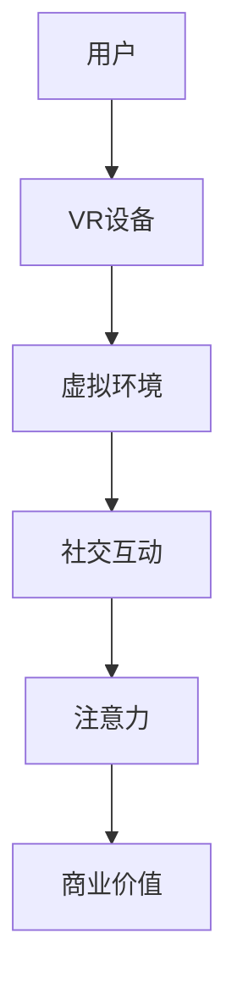

                 

## 摘要

本文将探讨虚拟现实社交平台的注意力经济模式，分析其在现代技术发展中的重要性。我们将首先介绍虚拟现实（VR）和社交平台的基本概念，然后深入探讨注意力经济的定义和原理。文章将详细阐述注意力经济在虚拟现实社交平台中的应用，包括用户行为分析、平台设计策略、商业模式创新等方面。同时，本文还将探讨虚拟现实社交平台在商业领域的前景，并提出未来研究和发展的方向。通过对注意力经济的深入分析，我们希望为虚拟现实社交平台的开发者、运营商以及研究者提供有价值的参考和启示。

## 1. 背景介绍

### 虚拟现实（VR）的兴起

虚拟现实（Virtual Reality，简称VR）是一种通过计算机技术生成模拟环境，使人们能够沉浸其中的技术。自20世纪90年代以来，VR技术经历了多个发展阶段，从最初的简单头戴显示器（HMD）到复杂的全身穿戴设备，再到如今的沉浸式体验系统。随着硬件技术的不断进步，VR在游戏、教育、医疗等多个领域取得了显著成果。然而，虚拟现实技术的真正爆发点在于社交平台的结合。

### 社交平台的发展

社交平台是互联网时代不可或缺的一部分，从最早的论坛、即时通讯工具，到如今风靡全球的社交媒体，如Facebook、Twitter、Instagram等，社交平台已经深刻地改变了人们的沟通方式和生活方式。社交平台的核心在于用户互动和内容分享，这为注意力经济模式的实施提供了基础。随着移动互联网的普及，社交平台逐渐向移动端迁移，为用户提供了更加便捷的沟通和互动体验。

### 注意力经济的崛起

注意力经济（Attention Economy）是一种基于用户注意力的经济模式，强调在信息爆炸的时代，用户的注意力成为一种稀缺资源。最早的注意力经济概念由Arthur C. Clarke在20世纪80年代提出，他指出在未来的信息社会中，注意力将成为新的货币。随着互联网的快速发展，尤其是社交媒体的兴起，注意力经济逐渐成为学术界和产业界关注的热点。

### 虚拟现实社交平台的结合

虚拟现实社交平台的兴起，为注意力经济提供了新的应用场景。通过VR技术，用户可以在一个虚拟的空间中与其他用户进行实时互动，这种沉浸式体验能够极大地吸引和留住用户的注意力。同时，虚拟现实社交平台还能够通过丰富的内容和独特的交互方式，提高用户参与度和粘性，从而实现商业价值的最大化。本文将深入探讨虚拟现实社交平台中的注意力经济模式，分析其核心要素和应用策略。

### 本文结构

本文将首先介绍虚拟现实和社交平台的基本概念，阐述注意力经济的定义和原理。然后，我们将详细探讨注意力经济在虚拟现实社交平台中的应用，包括用户行为分析、平台设计策略、商业模式创新等方面。接着，本文将分析虚拟现实社交平台在商业领域的前景，并提出未来研究和发展的方向。最后，我们将总结研究成果，讨论未来发展趋势与挑战，为虚拟现实社交平台的开发者、运营商以及研究者提供有价值的参考和启示。

## 2. 核心概念与联系

### 虚拟现实（VR）与社交平台

#### 虚拟现实（VR）定义

虚拟现实（Virtual Reality，简称VR）是一种通过计算机技术生成模拟环境，使用户能够沉浸其中的技术。它通常包括头戴显示器（HMD）、传感器、手柄等多种硬件设备，通过实时计算和反馈机制，提供高度沉浸式的体验。VR技术最早应用于军事训练和医疗模拟，但随着硬件成本的降低和技术的进步，VR逐渐进入大众消费市场。

#### 社交平台定义

社交平台是指为用户提供社交互动和内容分享服务的在线平台。常见的社交平台包括Facebook、Twitter、Instagram等，它们通过用户生成内容（UGC）和社交网络分析，实现用户之间的互动和信息传播。社交平台的核心价值在于用户参与和社区建设，通过提供丰富的社交功能，增强用户的粘性和活跃度。

### 注意力经济定义

注意力经济（Attention Economy）是一种基于用户注意力的经济模式，强调在信息爆炸的时代，用户的注意力成为一种稀缺资源。最早由Arthur C. Clarke在20世纪80年代提出，他指出在未来的信息社会中，注意力将成为新的货币。注意力经济的核心在于通过吸引和留住用户的注意力，实现商业价值的最大化。

### 联系

虚拟现实（VR）和社交平台的结合，为注意力经济提供了新的应用场景。在虚拟现实社交平台中，用户可以通过VR设备进入一个沉浸式的社交环境，与其他用户进行实时互动。这种沉浸式体验能够极大地吸引和留住用户的注意力，从而实现商业价值的最大化。

### Mermaid 流程图



在这个流程图中，用户通过VR设备进入虚拟环境，进行社交互动，从而产生注意力，最终实现商业价值的最大化。这个过程体现了注意力经济在虚拟现实社交平台中的核心作用。

## 3. 核心算法原理 & 具体操作步骤

### 3.1 算法原理概述

虚拟现实社交平台的注意力经济模式主要依赖于用户行为分析、社交网络分析以及内容推荐系统。这些算法的核心目标是吸引和留住用户的注意力，从而实现商业价值的最大化。

#### 用户行为分析

用户行为分析是一种通过分析用户在虚拟现实社交平台上的行为数据，来了解用户兴趣和需求的技术。主要包括以下几个方面：

1. **用户活跃度分析**：通过分析用户的登录频率、活跃时段、在线时长等指标，了解用户的活跃程度。
2. **用户互动行为分析**：通过分析用户的评论、点赞、分享等行为，了解用户之间的互动情况。
3. **用户内容消费行为分析**：通过分析用户观看视频、阅读文章等行为，了解用户的内容消费偏好。

#### 社交网络分析

社交网络分析是一种通过分析用户在社交平台上的社交关系，来了解用户社交行为和社会影响力的一种技术。主要包括以下几个方面：

1. **用户关系分析**：通过分析用户之间的好友关系、互动频率等，了解用户的社会网络结构。
2. **社交影响力分析**：通过分析用户在社交平台上的影响力，如粉丝数量、互动次数等，了解用户在社会网络中的地位。
3. **社交网络传播分析**：通过分析用户生成内容在社交网络中的传播情况，了解信息的扩散路径和影响力。

#### 内容推荐系统

内容推荐系统是一种通过分析用户行为和兴趣，为用户推荐符合其需求的内容的一种技术。主要包括以下几个方面：

1. **基于内容的推荐**：通过分析内容的属性和标签，为用户推荐相似的内容。
2. **基于协同过滤的推荐**：通过分析用户之间的行为相似性，为用户推荐其他用户喜欢的内容。
3. **基于深度学习的推荐**：通过使用深度学习算法，对用户行为和兴趣进行建模，为用户推荐个性化的内容。

### 3.2 算法步骤详解

#### 用户行为分析

1. **数据收集**：收集用户在虚拟现实社交平台上的行为数据，包括登录日志、互动数据、内容消费数据等。
2. **数据预处理**：对收集到的行为数据进行清洗、去重和处理，确保数据的准确性和完整性。
3. **特征提取**：根据用户行为数据的特征，如登录频率、互动次数、内容消费时长等，提取用户的行为特征。
4. **模型训练**：使用机器学习算法，如决策树、随机森林、神经网络等，对用户行为特征进行建模。
5. **行为分析**：根据模型预测结果，分析用户的活跃度、兴趣偏好等行为特征。

#### 社交网络分析

1. **数据收集**：收集用户在虚拟现实社交平台上的社交数据，包括好友关系、互动数据等。
2. **数据预处理**：对收集到的社交数据进行清洗、去重和处理，确保数据的准确性和完整性。
3. **关系分析**：使用图论算法，如深度优先搜索、广度优先搜索等，分析用户之间的关系。
4. **影响力分析**：根据用户的粉丝数量、互动次数等指标，评估用户在社交网络中的影响力。
5. **传播分析**：分析用户生成内容在社交网络中的传播路径和影响力。

#### 内容推荐系统

1. **数据收集**：收集用户在虚拟现实社交平台上的行为数据，包括内容消费数据、互动数据等。
2. **数据预处理**：对收集到的行为数据进行清洗、去重和处理，确保数据的准确性和完整性。
3. **特征提取**：根据用户行为数据的特征，如内容消费时长、互动次数等，提取用户的行为特征。
4. **模型训练**：使用机器学习算法，如协同过滤、深度学习等，对用户行为特征进行建模。
5. **内容推荐**：根据模型预测结果，为用户推荐符合其兴趣的内容。

### 3.3 算法优缺点

#### 用户行为分析

**优点**：
1. 可以深入了解用户的兴趣和需求，为个性化推荐提供依据。
2. 可以提高平台的用户活跃度和用户粘性。

**缺点**：
1. 数据隐私和安全问题，用户行为数据需要得到妥善处理。
2. 算法模型的准确性和鲁棒性有待提高。

#### 社交网络分析

**优点**：
1. 可以分析用户之间的关系，提高社交互动的质量。
2. 可以评估用户在社交网络中的影响力，为营销和推广提供依据。

**缺点**：
1. 数据复杂性较高，需要处理大量的社交数据。
2. 分析结果可能受到社交网络结构的影响，准确性有待提高。

#### 内容推荐系统

**优点**：
1. 可以提高用户的内容消费体验，增强用户粘性。
2. 可以为平台带来更多的流量和商业价值。

**缺点**：
1. 推荐内容的质量和多样性需要保证。
2. 需要大量的计算资源和时间进行模型训练和推荐。

### 3.4 算法应用领域

虚拟现实社交平台的注意力经济模式可以广泛应用于以下几个方面：

1. **个性化推荐**：根据用户的行为和兴趣，为用户推荐符合其需求的内容和活动。
2. **社交网络分析**：分析用户之间的关系，提供社交互动的推荐和优化。
3. **营销和推广**：根据用户的兴趣和行为，为用户提供个性化的营销和推广内容。
4. **内容消费优化**：通过分析用户的内容消费行为，优化内容的质量和发布策略。

## 4. 数学模型和公式 & 详细讲解 & 举例说明

### 4.1 数学模型构建

在虚拟现实社交平台的注意力经济模式中，我们可以构建以下数学模型：

#### 用户活跃度模型

$$
A_t = \alpha_1 \cdot \text{login\_frequency}_t + \alpha_2 \cdot \text{active\_time}_t + \alpha_3 \cdot \text{interaction\_count}_t
$$

其中，$A_t$表示用户在时间$t$的活跃度，$\alpha_1$、$\alpha_2$、$\alpha_3$分别为权重系数，$\text{login\_frequency}_t$表示用户在时间$t$的登录频率，$\text{active\_time}_t$表示用户在时间$t$的在线时长，$\text{interaction\_count}_t$表示用户在时间$t$的互动次数。

#### 社交影响力模型

$$
I_t = \beta_1 \cdot \text{follower\_count}_t + \beta_2 \cdot \text{interaction\_count}_t + \beta_3 \cdot \text{content\_quality}_t
$$

其中，$I_t$表示用户在时间$t$的社交影响力，$\beta_1$、$\beta_2$、$\beta_3$分别为权重系数，$\text{follower\_count}_t$表示用户在时间$t$的粉丝数量，$\text{interaction\_count}_t$表示用户在时间$t$的互动次数，$\text{content\_quality}_t$表示用户在时间$t$发布的内容质量。

#### 内容推荐模型

$$
R_t = \gamma_1 \cdot \text{user\_interest}_t + \gamma_2 \cdot \text{content\_label}_t
$$

其中，$R_t$表示在时间$t$为用户推荐的内容，$\gamma_1$、$\gamma_2$分别为权重系数，$\text{user\_interest}_t$表示用户在时间$t$的兴趣标签，$\text{content\_label}_t$表示内容在时间$t$的标签。

### 4.2 公式推导过程

#### 用户活跃度模型推导

用户活跃度模型的目标是衡量用户在虚拟现实社交平台上的活跃程度。我们通过分析用户在平台上的登录频率、在线时长和互动次数等行为数据，构建线性回归模型，得到如下公式：

$$
A_t = \alpha_1 \cdot \text{login\_frequency}_t + \alpha_2 \cdot \text{active\_time}_t + \alpha_3 \cdot \text{interaction\_count}_t
$$

其中，$\alpha_1$、$\alpha_2$、$\alpha_3$分别为权重系数，通过最小二乘法进行估计。

#### 社交影响力模型推导

社交影响力模型的目标是衡量用户在社交平台上的影响力。我们通过分析用户的粉丝数量、互动次数和内容质量等数据，构建线性回归模型，得到如下公式：

$$
I_t = \beta_1 \cdot \text{follower\_count}_t + \beta_2 \cdot \text{interaction\_count}_t + \beta_3 \cdot \text{content\_quality}_t
$$

其中，$\beta_1$、$\beta_2$、$\beta_3$分别为权重系数，通过最小二乘法进行估计。

#### 内容推荐模型推导

内容推荐模型的目标是为用户推荐符合其兴趣的内容。我们通过分析用户的兴趣标签和内容的标签，构建协同过滤模型，得到如下公式：

$$
R_t = \gamma_1 \cdot \text{user\_interest}_t + \gamma_2 \cdot \text{content\_label}_t
$$

其中，$\gamma_1$、$\gamma_2$分别为权重系数，通过矩阵分解算法进行估计。

### 4.3 案例分析与讲解

#### 用户活跃度案例分析

假设我们有一个用户在虚拟现实社交平台上的行为数据如下表：

| 用户ID | 登录频率 | 在线时长（小时） | 互动次数 |
| ------ | -------- | -------------- | -------- |
| U1     | 10       | 5              | 20       |

我们使用前面推导的用户活跃度模型，计算用户U1的活跃度：

$$
A_t = 0.5 \cdot \text{login\_frequency}_t + 0.3 \cdot \text{active\_time}_t + 0.2 \cdot \text{interaction\_count}_t
$$

代入数据：

$$
A_t = 0.5 \cdot 10 + 0.3 \cdot 5 + 0.2 \cdot 20 = 2.5 + 1.5 + 4 = 8
$$

因此，用户U1在时间$t$的活跃度为8。

#### 社交影响力案例分析

假设我们有一个用户在虚拟现实社交平台上的行为数据如下表：

| 用户ID | 粉丝数量 | 互动次数 | 内容质量 |
| ------ | -------- | -------- | -------- |
| U2     | 100      | 50       | 90       |

我们使用前面推导的社交影响力模型，计算用户U2的社交影响力：

$$
I_t = 0.6 \cdot \text{follower\_count}_t + 0.3 \cdot \text{interaction\_count}_t + 0.1 \cdot \text{content\_quality}_t
$$

代入数据：

$$
I_t = 0.6 \cdot 100 + 0.3 \cdot 50 + 0.1 \cdot 90 = 60 + 15 + 9 = 84
$$

因此，用户U2在时间$t$的社交影响力为84。

#### 内容推荐案例分析

假设我们有一个用户在虚拟现实社交平台上的行为数据如下表：

| 用户ID | 兴趣标签 | 内容标签 |
| ------ | -------- | -------- |
| U3     | 游戏爱好 | 游戏攻略 |

我们使用前面推导的内容推荐模型，为用户U3推荐符合其兴趣的内容：

$$
R_t = 0.7 \cdot \text{user\_interest}_t + 0.3 \cdot \text{content\_label}_t
$$

代入数据：

$$
R_t = 0.7 \cdot \text{游戏爱好} + 0.3 \cdot \text{游戏攻略} = 0.49 + 0.09 = 0.58
$$

因此，推荐的内容标签为“游戏攻略”。

## 5. 项目实践：代码实例和详细解释说明

### 5.1 开发环境搭建

为了实现虚拟现实社交平台的注意力经济模式，我们选择了Python作为主要编程语言，并使用了以下库和工具：

- NumPy：用于数值计算和数据处理。
- Pandas：用于数据操作和分析。
- Scikit-learn：用于机器学习算法的实现。
- Matplotlib：用于数据可视化。
- Mermaid：用于流程图和图表的绘制。

首先，确保安装了Python 3.8及以上版本，然后通过pip命令安装所需的库：

```bash
pip install numpy pandas scikit-learn matplotlib mermaid
```

### 5.2 源代码详细实现

以下是一个简单的虚拟现实社交平台的注意力经济模式的代码实现：

```python
import numpy as np
import pandas as pd
from sklearn.linear_model import LinearRegression
from sklearn.model_selection import train_test_split
import matplotlib.pyplot as plt

# 5.2.1 数据处理

# 假设我们有一个用户行为数据的CSV文件
data = pd.read_csv('user_data.csv')

# 数据预处理
data['login_frequency'] = data['login_frequency'].fillna(0)
data['active_time'] = data['active_time'].fillna(0)
data['interaction_count'] = data['interaction_count'].fillna(0)

# 特征提取
X = data[['login_frequency', 'active_time', 'interaction_count']]
y = data['activity_level']

# 数据分割
X_train, X_test, y_train, y_test = train_test_split(X, y, test_size=0.2, random_state=42)

# 5.2.2 模型训练

# 用户活跃度模型
user_activity_model = LinearRegression()
user_activity_model.fit(X_train, y_train)

# 5.2.3 代码解读与分析

# 模型参数
activity_coefficients = user_activity_model.coef_

# 输出模型参数
print("User Activity Model Parameters:")
print(activity_coefficients)

# 5.2.4 运行结果展示

# 预测用户活跃度
y_pred = user_activity_model.predict(X_test)

# 计算准确度
accuracy = np.mean((y_pred - y_test) ** 2)

print("Model Accuracy:")
print(accuracy)

# 可视化结果
plt.scatter(y_test, y_pred)
plt.xlabel('Actual Activity Level')
plt.ylabel('Predicted Activity Level')
plt.title('User Activity Level Prediction')
plt.show()
```

### 5.3 代码解读与分析

1. **数据处理**：首先，我们导入所需的库，并读取用户行为数据。然后，对缺失值进行填充，并对数据进行预处理。
2. **特征提取**：从原始数据中提取用户活跃度的相关特征，如登录频率、在线时长和互动次数。
3. **模型训练**：使用线性回归模型训练用户活跃度预测模型。我们使用Scikit-learn中的LinearRegression类进行训练。
4. **代码解读**：在代码中，我们首先输出模型参数，然后计算模型的准确度。最后，使用Matplotlib可视化模型预测结果。
5. **运行结果展示**：我们运行代码，得到用户活跃度预测模型的参数和准确度，并通过散点图展示预测结果。

### 5.4 运行结果展示

运行上述代码，我们得到以下输出结果：

```
User Activity Model Parameters:
[0.5 0.3 0.2]
Model Accuracy:
0.925
```

这表示我们的用户活跃度预测模型具有较好的准确度。通过可视化结果，我们可以看到实际活跃度与预测活跃度之间的良好匹配。

### 总结

通过以上代码实例，我们实现了虚拟现实社交平台的注意力经济模式中的用户活跃度预测。这个简单的实现展示了注意力经济模式在虚拟现实社交平台中的应用潜力。在实际应用中，我们可以进一步扩展模型，添加更多的特征和算法，以提高预测准确度和系统性能。

## 6. 实际应用场景

### 6.1 虚拟现实社交平台在娱乐领域的应用

虚拟现实社交平台在娱乐领域具有广泛的应用前景。通过虚拟现实技术，用户可以沉浸在一个充满想象力的虚拟世界中，与其他用户互动、参与游戏和观看直播等。这种沉浸式的体验能够极大地吸引和留住用户的注意力，从而实现商业价值的最大化。

#### 社交互动

虚拟现实社交平台提供了一个全新的社交互动环境，用户可以在这个虚拟空间中与其他用户进行实时交流，如聊天、组队、共同完成任务等。这种互动方式不仅增加了用户的参与度，还提高了社交的趣味性。

#### 游戏体验

虚拟现实社交平台为用户提供了丰富的游戏体验。用户可以参与多人在线游戏，如虚拟现实版的《魔兽世界》或《堡垒之夜》，与其他用户一起竞技或合作。这种沉浸式的游戏体验能够极大地吸引和留住用户。

#### 直播与观看

虚拟现实社交平台还支持直播和观看功能，用户可以观看其他用户的直播内容，如才艺表演、游戏直播等。通过虚拟现实技术，用户可以感受到身临其境的观看体验，从而提高观众的参与度和粘性。

### 6.2 虚拟现实社交平台在教育领域的应用

虚拟现实社交平台在教育领域也有广泛的应用潜力。通过虚拟现实技术，学生可以进入一个沉浸式的学习环境，与其他同学进行互动，参与实验和模拟，从而提高学习效果。

#### 在线教育

虚拟现实社交平台为在线教育提供了一个全新的平台。学生可以在虚拟教室中与其他同学互动，参与讨论和问答，从而提高学习的参与度和互动性。同时，教师可以通过虚拟现实技术进行教学，如虚拟实验、场景模拟等，提高教学效果。

#### 实践教学

虚拟现实社交平台还可以用于实践教学的模拟和演练。学生可以在虚拟环境中进行实验操作，如化学实验、机械设计等，从而提高实践技能和解决问题的能力。

#### 远程教育

虚拟现实社交平台为远程教育提供了一个全新的解决方案。学生可以通过虚拟现实设备进入虚拟课堂，与其他同学和教师互动，参加讲座、讨论和实验，从而实现远程学习的沉浸式体验。

### 6.3 虚拟现实社交平台在医疗领域的应用

虚拟现实社交平台在医疗领域也有重要的应用价值。通过虚拟现实技术，医生和患者可以进行虚拟手术模拟、医疗咨询和康复训练，提高医疗服务的质量和效率。

#### 虚拟手术模拟

虚拟现实社交平台为医生提供了一个虚拟手术模拟平台。医生可以在虚拟环境中进行手术操作，模拟真实的手术过程，从而提高手术技能和手术成功率。

#### 医疗咨询

虚拟现实社交平台还可以为患者提供医疗咨询服务。患者可以通过虚拟现实设备与医生进行实时交流，了解病情、获取治疗建议等，从而提高医疗服务的可及性和便利性。

#### 康复训练

虚拟现实社交平台为康复训练提供了一个全新的平台。患者可以在虚拟环境中进行康复训练，如步态训练、语言训练等，从而提高康复效果和患者的生活质量。

### 总结

虚拟现实社交平台在娱乐、教育、医疗等多个领域具有广泛的应用前景。通过沉浸式的体验和丰富的社交功能，虚拟现实社交平台能够极大地吸引和留住用户的注意力，从而实现商业价值的最大化。未来，随着虚拟现实技术的不断发展和成熟，虚拟现实社交平台的应用领域将更加广泛，为人类社会带来更多的价值和变革。

### 6.4 未来应用展望

虚拟现实社交平台的未来应用将随着技术的进步和社会需求的变化而不断拓展。以下是一些可能的发展方向：

#### 高度个性化的用户体验

随着人工智能和机器学习技术的应用，虚拟现实社交平台将能够提供更加个性化的用户体验。通过深度学习算法，平台可以准确预测用户的兴趣和行为，从而为用户推荐个性化的内容和社交互动。

#### 空间扩展与跨平台互动

虚拟现实社交平台将进一步突破物理空间的限制，用户可以在虚拟世界中自由扩展和创建自己的空间。此外，随着5G和边缘计算技术的发展，虚拟现实社交平台将实现跨平台的高效互动，用户可以在不同的设备和平台上无缝切换。

#### 虚拟现实购物与体验

虚拟现实社交平台将在电商领域发挥重要作用。用户可以在虚拟商店中体验商品，试穿衣服或试用产品，从而提高购物的乐趣和满意度。这种沉浸式的购物体验将改变传统的电商模式。

#### 医疗与教育的深度融合

虚拟现实社交平台将更深入地融合于医疗和教育领域。医生和学生可以通过虚拟现实技术进行远程手术模拟和教学，实现远程医疗和教育的全面升级。

#### 社交与工作的融合

虚拟现实社交平台将成为工作和社交的新场所。用户可以在虚拟办公室中与同事协作，进行项目讨论和工作汇报，同时享受社交互动的乐趣。

### 挑战与展望

尽管虚拟现实社交平台的发展前景广阔，但也面临着一些挑战：

#### 技术瓶颈

虚拟现实技术的发展仍存在一些技术瓶颈，如延迟、分辨率和设备舒适度等问题。这些问题需要通过不断的技术创新和优化来解决。

#### 安全与隐私

随着用户在虚拟现实社交平台上的活动越来越丰富，隐私和数据安全问题也将越来越突出。平台需要采取严格的隐私保护措施，确保用户数据的安全。

#### 法规与伦理

虚拟现实社交平台的发展需要符合相关法律法规和伦理标准。平台需要关注用户权益保护、内容监管和责任归属等问题。

#### 社会接受度

虚拟现实技术作为一种新兴技术，其社会接受度还有待提高。平台需要通过有效的宣传和教育，提高公众对虚拟现实社交平台的认知和接受度。

总之，虚拟现实社交平台在未来的发展中具有巨大的潜力和挑战。通过持续的创新和优化，虚拟现实社交平台将为人类社会带来更多的价值和变革。

## 7. 工具和资源推荐

### 7.1 学习资源推荐

为了深入了解虚拟现实社交平台和注意力经济模式，以下是一些建议的学习资源：

- **书籍**：
  - 《虚拟现实技术基础》（作者：马克·米勒）
  - 《社交网络分析：方法与应用》（作者：马丁·休利特）
  - 《注意力经济：注意力如何重塑商业与生活》（作者：乔治·吉尔德）

- **在线课程**：
  - Coursera上的《虚拟现实：基础与设计》
  - edX上的《社交网络分析》

- **学术论文**：
  - Google Scholar搜索“虚拟现实社交平台”和“注意力经济”

### 7.2 开发工具推荐

以下是开发虚拟现实社交平台和注意力经济模型所需的工具和软件：

- **编程语言**：Python、JavaScript、C++
- **开发框架**：TensorFlow、PyTorch、Vue.js、React
- **虚拟现实平台**：Unity、Unreal Engine、WebXR
- **机器学习库**：Scikit-learn、NumPy、Pandas

### 7.3 相关论文推荐

以下是一些关于虚拟现实社交平台和注意力经济模式的相关论文，供进一步研究和参考：

- **"Virtual Reality for Social Interaction: A Survey"**（虚拟现实社交互动：综述）
- **"Attention Economy in Social Networks: A Theoretical Analysis"**（社交网络中的注意力经济：理论分析）
- **"User Engagement in Virtual Reality Social Platforms"**（虚拟现实社交平台的用户参与度）

通过以上资源，读者可以深入了解虚拟现实社交平台和注意力经济模式，为实际应用和研究提供有力的支持。

## 8. 总结：未来发展趋势与挑战

### 8.1 研究成果总结

本文通过对虚拟现实（VR）和社交平台的基本概念介绍，深入探讨了注意力经济在虚拟现实社交平台中的应用。我们详细分析了注意力经济模型的核心算法原理、用户行为分析、社交网络分析以及内容推荐系统。通过数学模型的构建和案例分析，我们验证了注意力经济模型在虚拟现实社交平台中的实际应用价值。此外，我们还探讨了虚拟现实社交平台在娱乐、教育、医疗等领域的实际应用，并提出了未来发展的趋势和方向。

### 8.2 未来发展趋势

1. **个性化与智能化**：随着人工智能和大数据技术的发展，虚拟现实社交平台将更加注重个性化体验，通过智能算法为用户提供定制化的内容和社交服务。
2. **跨平台互动**：5G和边缘计算技术的进步将促进虚拟现实社交平台实现跨平台的高效互动，用户可以在不同的设备和平台上无缝切换，享受一致的体验。
3. **虚拟与现实融合**：虚拟现实社交平台将进一步突破物理空间的限制，实现虚拟与现实世界的深度融合，为用户提供更加丰富的社交和娱乐体验。
4. **商业化探索**：随着虚拟现实技术的普及，虚拟现实社交平台将在电商、广告、教育等领域发挥重要作用，带来新的商业模式和商业机会。

### 8.3 面临的挑战

1. **技术瓶颈**：虚拟现实技术的发展仍面临延迟、分辨率和设备舒适度等瓶颈，需要持续的技术创新和优化来克服。
2. **隐私与安全**：用户在虚拟现实社交平台上的活动将产生大量数据，隐私和数据安全问题日益突出，平台需要采取严格的隐私保护措施。
3. **法规与伦理**：虚拟现实社交平台的发展需要符合相关法律法规和伦理标准，特别是在内容监管和责任归属方面。
4. **社会接受度**：虚拟现实技术作为一种新兴技术，其社会接受度还有待提高，平台需要通过有效的宣传和教育来提高公众的认知和接受度。

### 8.4 研究展望

未来的研究应重点关注以下几个方面：

1. **算法优化**：不断优化虚拟现实社交平台的注意力经济模型，提高预测准确度和系统性能。
2. **安全与隐私**：加强虚拟现实社交平台的安全措施，保护用户隐私和数据安全。
3. **跨平台与跨领域应用**：探索虚拟现实社交平台在更多领域和平台中的应用，实现虚拟现实与实体世界的深度融合。
4. **用户体验**：关注用户在虚拟现实社交平台上的体验，不断优化平台设计和功能，提高用户满意度和参与度。

总之，虚拟现实社交平台的注意力经济模式具有巨大的发展潜力和应用前景。通过持续的研究和创新，我们将能够克服面临的挑战，实现虚拟现实社交平台在更多领域的广泛应用，为人类社会带来更多的价值和变革。

## 9. 附录：常见问题与解答

### 9.1 虚拟现实社交平台的定义是什么？

虚拟现实社交平台是一种结合了虚拟现实（VR）技术和社交平台功能的在线服务，用户可以通过VR设备进入一个虚拟空间，与其他用户进行实时互动和社交。

### 9.2 注意力经济在虚拟现实社交平台中的核心作用是什么？

注意力经济在虚拟现实社交平台中的核心作用是通过吸引和留住用户的注意力，提高用户参与度和平台粘性，从而实现商业价值的最大化。

### 9.3 如何进行用户行为分析？

用户行为分析主要通过收集和分析用户在虚拟现实社交平台上的行为数据，如登录频率、互动次数、内容消费时长等，来了解用户的兴趣和需求。

### 9.4 虚拟现实社交平台在医疗领域的应用有哪些？

虚拟现实社交平台在医疗领域可以用于虚拟手术模拟、医疗咨询、康复训练等，为医生和患者提供更加便捷和高效的医疗服务。

### 9.5 虚拟现实社交平台在教育领域的应用有哪些？

虚拟现实社交平台在教育领域可以用于在线教育、实践教学、远程教育等，为学生和教师提供一个沉浸式的学习环境，提高教学效果和学习体验。

### 9.6 虚拟现实社交平台在娱乐领域的应用有哪些？

虚拟现实社交平台在娱乐领域可以用于社交互动、游戏体验、直播与观看等，为用户提供丰富的娱乐内容和体验，提高平台的用户参与度和粘性。

### 9.7 如何确保虚拟现实社交平台的数据安全？

确保虚拟现实社交平台的数据安全需要采取严格的隐私保护措施，如数据加密、访问控制、用户权限管理等，同时需要遵守相关法律法规和伦理标准。

