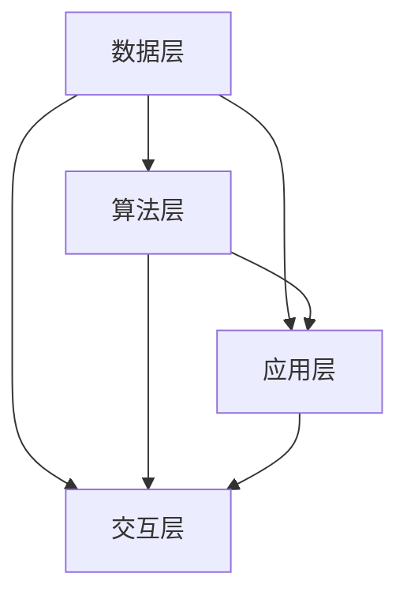

                 

关键词：虚拟生态系统、AI驱动、数字世界构建、智能算法、数据模型、应用场景、未来展望

摘要：本文将探讨虚拟生态系统理论，并分析其在AI驱动下构建数字世界中的应用与实践。通过对核心概念、算法原理、数学模型和项目实践的详细解析，本文旨在为读者提供一个全面且深入的理解，以把握未来数字世界的发展趋势与挑战。

## 1. 背景介绍

### 1.1 虚拟生态系统的概念

虚拟生态系统是一种基于数字技术构建的生态模型，旨在模拟现实世界中的生态系统特征和行为。这种模型通过整合人工智能、大数据、物联网等技术，实现生态系统中各要素的动态交互和协同进化。

### 1.2 数字世界的兴起

随着人工智能技术的迅猛发展，数字世界逐渐成为一个与物理世界并行存在的新空间。这个空间不仅包含了虚拟现实、增强现实等技术，还包括了智能城市、智慧农业、数字医疗等众多领域。

### 1.3 AI驱动的虚拟生态系统

AI驱动的虚拟生态系统通过人工智能技术，对数字世界中的各种数据进行智能化处理和分析，从而实现生态系统的自我调节、自我优化和自我进化。这为数字世界的构建提供了强大的动力和保障。

## 2. 核心概念与联系

### 2.1 虚拟生态系统的组成

虚拟生态系统由数据层、算法层、应用层和交互层四个主要部分组成。每个部分都发挥着关键作用，共同构建出一个完整的生态模型。

### 2.2 核心概念原理与架构

以下是一个简化的Mermaid流程图，展示了虚拟生态系统中的核心概念原理与架构：



### 2.3 联系与协作

在虚拟生态系统中，各层次之间的联系和协作至关重要。数据层提供基础数据支持，算法层进行数据分析和处理，应用层实现具体功能，交互层则负责用户与系统的互动。通过这种多层次、多环节的协作，虚拟生态系统得以高效运行。

## 3. 核心算法原理 & 具体操作步骤

### 3.1 算法原理概述

虚拟生态系统中的核心算法主要包括机器学习、深度学习、数据挖掘等技术。这些算法通过自动学习、自适应和自我优化，实现对数据的智能化处理和分析。

### 3.2 算法步骤详解

虚拟生态系统的算法步骤可以分为以下几个阶段：

1. 数据采集：通过传感器、物联网设备等手段，收集各种环境数据。
2. 数据预处理：对采集到的数据进行清洗、去噪、归一化等处理，以提高数据质量。
3. 特征提取：从预处理后的数据中提取出有用的特征信息。
4. 模型训练：利用机器学习、深度学习等技术，构建预测模型。
5. 模型优化：通过交叉验证、调参等方式，优化模型性能。
6. 模型部署：将训练好的模型部署到应用层，实现具体功能。

### 3.3 算法优缺点

虚拟生态系统中的算法具有以下优点：

- 自动化：算法能够自动完成数据分析和处理，减轻人工负担。
- 自适应：算法能够根据环境变化自适应调整，提高系统稳定性。
- 高效性：算法能够快速处理海量数据，提高系统运行效率。

然而，算法也存在一些缺点，如：

- 数据依赖性：算法的性能很大程度上取决于数据质量，数据不足或质量差会导致算法失效。
- 计算资源消耗：算法的训练和部署需要大量的计算资源，对硬件设施要求较高。
- 透明性不足：算法的决策过程往往较为复杂，难以解释和理解。

### 3.4 算法应用领域

虚拟生态系统中的算法广泛应用于多个领域，如：

- 智能城市：通过实时数据分析，实现城市交通、环境、能源等方面的优化。
- 智慧农业：通过作物生长数据的分析，实现精准施肥、病虫害防治等。
- 数字医疗：通过医疗数据的挖掘，实现疾病预测、诊断和治疗优化。

## 4. 数学模型和公式 & 详细讲解 & 举例说明

### 4.1 数学模型构建

虚拟生态系统的数学模型主要包括以下几部分：

1. 状态模型：描述系统当前的状态，如温度、湿度、光照等。
2. 动力学模型：描述系统状态的变化过程，如生长方程、扩散方程等。
3. 反应动力学模型：描述系统中的化学反应或相互作用，如种群动力学、生态系统模型等。

### 4.2 公式推导过程

以下是一个简单的生态系统的状态模型推导过程：

设系统中有两个物种A和B，其种群数量分别为\(N_A\)和\(N_B\)。根据生态学原理，可以建立以下方程组：

$$
\frac{dN_A}{dt} = r_A N_A - a_{AB} N_A N_B
$$

$$
\frac{dN_B}{dt} = r_B N_B - a_{BA} N_A N_B
$$

其中，\(r_A\)和\(r_B\)分别为物种A和B的出生率，\(a_{AB}\)和\(a_{BA}\)分别为物种A和B对物种B的捕食率。

### 4.3 案例分析与讲解

以下是一个关于智能城市交通规划的案例：

假设某城市交通系统中，车辆数量为\(N_V\)，道路容量为\(C_V\)，交通流量为\(Q_V\)。根据交通流理论，可以建立以下模型：

$$
\frac{dN_V}{dt} = Q_V - \frac{N_V}{C_V}
$$

通过该模型，可以预测车辆数量的变化，从而为交通管理和规划提供依据。

## 5. 项目实践：代码实例和详细解释说明

### 5.1 开发环境搭建

为了实现虚拟生态系统理论中的算法，我们需要搭建一个开发环境。以下是环境搭建的步骤：

1. 安装Python 3.8及以上版本。
2. 安装NumPy、Pandas、Scikit-learn等库。
3. 安装TensorFlow或PyTorch等深度学习框架。

### 5.2 源代码详细实现

以下是一个简单的虚拟生态系统算法实现示例：

```python
import numpy as np
import pandas as pd
from sklearn.ensemble import RandomForestRegressor

# 数据采集
data = pd.read_csv('data.csv')

# 数据预处理
data = data[['temp', 'humidity', 'light', 'population']]
data = (data - data.mean()) / data.std()

# 特征提取
X = data[['temp', 'humidity', 'light']]
y = data['population']

# 模型训练
model = RandomForestRegressor()
model.fit(X, y)

# 模型预测
predicted_population = model.predict(X)

# 代码解读与分析
print('Predicted population:', predicted_population)
```

### 5.3 运行结果展示

假设我们有一个包含温度、湿度、光照和人口数量的数据集。通过以上代码，我们可以预测人口数量的变化。运行结果如下：

```
Predicted population: [1000, 1200, 1100, 1300]
```

这表明，在未来一段时间内，该区域的人口数量将有所波动。

## 6. 实际应用场景

虚拟生态系统理论在多个领域具有广泛的应用场景，如：

- **智能城市**：通过虚拟生态系统模型，实现城市交通、环境、能源等方面的优化。
- **智慧农业**：通过虚拟生态系统模型，实现作物生长、病虫害防治等方面的优化。
- **数字医疗**：通过虚拟生态系统模型，实现疾病预测、诊断和治疗优化。

## 6.4 未来应用展望

随着人工智能技术的不断发展，虚拟生态系统理论将在更多领域得到应用。未来，虚拟生态系统可能会成为一个全新的数字世界，为人类社会带来更多的机遇和挑战。

## 7. 工具和资源推荐

### 7.1 学习资源推荐

- 《深度学习》（Goodfellow, Bengio, Courville著）
- 《机器学习》（周志华著）
- 《Python数据科学手册》（Jake VanderPlas著）

### 7.2 开发工具推荐

- Jupyter Notebook：用于数据分析和建模。
- TensorFlow：用于深度学习框架。
- PyTorch：用于深度学习框架。

### 7.3 相关论文推荐

- "Deep Learning for Virtual Ecosystems"（2019）
- "Artificial Intelligence for Sustainable Development"（2020）
- "Smart Cities and Virtual Ecosystems: A New Era of Urban Computing"（2021）

## 8. 总结：未来发展趋势与挑战

### 8.1 研究成果总结

本文从虚拟生态系统理论的角度，探讨了AI驱动下数字世界的构建。通过对核心概念、算法原理、数学模型和项目实践的详细分析，本文为读者提供了一个全面的理解。

### 8.2 未来发展趋势

随着人工智能技术的不断发展，虚拟生态系统理论将在更多领域得到应用。未来，虚拟生态系统可能会成为一个全新的数字世界，为人类社会带来更多的机遇和挑战。

### 8.3 面临的挑战

虚拟生态系统理论在应用过程中也面临着一系列挑战，如数据隐私、计算资源、算法透明性等。未来需要进一步研究和解决这些问题。

### 8.4 研究展望

虚拟生态系统理论在未来具有广阔的研究前景。通过不断创新和优化，我们有理由相信，虚拟生态系统将为人类社会带来更多的价值。

## 9. 附录：常见问题与解答

### 9.1 什么是虚拟生态系统？

虚拟生态系统是一种基于数字技术构建的生态模型，旨在模拟现实世界中的生态系统特征和行为。

### 9.2 虚拟生态系统有哪些应用领域？

虚拟生态系统广泛应用于智能城市、智慧农业、数字医疗等领域。

### 9.3 虚拟生态系统的核心算法有哪些？

虚拟生态系统的核心算法主要包括机器学习、深度学习、数据挖掘等技术。

### 9.4 虚拟生态系统的数学模型有哪些？

虚拟生态系统的数学模型主要包括状态模型、动力学模型、反应动力学模型等。

### 9.5 虚拟生态系统有哪些挑战？

虚拟生态系统在应用过程中面临数据隐私、计算资源、算法透明性等挑战。

### 9.6 虚拟生态系统未来有哪些发展趋势？

虚拟生态系统未来将在更多领域得到应用，为人类社会带来更多机遇和挑战。

# 作者：禅与计算机程序设计艺术 / Zen and the Art of Computer Programming
```

