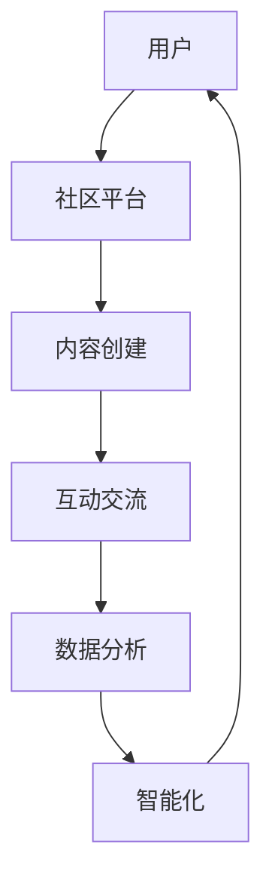

                 

在当今信息化时代，虚拟社区正迅速成为人们日常生活中不可或缺的一部分。本文将探讨虚拟社区的概念、发展历程、核心技术和未来展望，旨在为读者提供全面了解和洞察这一领域的视角。

## 关键词

- 虚拟社区
- 数字化升级
- 社区技术
- 社交网络
- 智能化

## 摘要

本文将首先介绍虚拟社区的定义和背景，随后分析其核心技术和创新，接着探讨虚拟社区在实际应用场景中的表现，并预测其未来发展趋势。通过本文，读者将深入了解虚拟社区的数字化升级过程，以及这一变革对行业和社会的深远影响。

## 1. 背景介绍

### 1.1 虚拟社区的定义

虚拟社区，顾名思义，是指通过互联网等数字技术创建的、在虚拟空间中进行的社交活动。它不仅仅是一个在线平台，更是一个具有共同兴趣、价值观或目标的群体在数字世界中的互动场所。虚拟社区可以是特定的兴趣爱好群组，如游戏社区、读书社区，也可以是职业交流平台，如技术论坛、行业社群。

### 1.2 虚拟社区的发展历程

虚拟社区的发展可以追溯到20世纪90年代，随着互联网的普及和Web 2.0技术的兴起，虚拟社区开始崭露头角。最早的虚拟社区之一是Usenet，它是一个基于论坛的在线讨论平台。随后，博客、微博、社交网络等新兴技术使得虚拟社区的形式更加多样化，功能更加丰富。

### 1.3 虚拟社区的现状

目前，虚拟社区已经成为互联网生态中的重要组成部分。根据统计，全球虚拟社区用户已超过数十亿，覆盖了不同年龄段、职业背景和文化背景的人群。虚拟社区不仅在个人生活中扮演着重要角色，也在商业、教育、医疗等多个领域产生了深远影响。

## 2. 核心概念与联系

为了更好地理解虚拟社区，我们需要了解以下几个核心概念，并展示它们之间的联系。以下是使用Mermaid绘制的流程图：



### 2.1 用户

用户是虚拟社区的基础，他们通过注册、登录等方式加入社区，并创建个人资料。用户的多样性使得虚拟社区具有丰富的内容和多样化的互动。

### 2.2 社区平台

社区平台是虚拟社区的载体，它为用户提供了一个交互、分享和交流的场所。社区平台的功能包括内容发布、评论回复、私信聊天等。

### 2.3 内容创建

用户在社区平台中发布的内容是社区的核心。内容形式多样，包括文字、图片、视频等。高质量的内容能够吸引更多用户参与互动，提升社区的活跃度。

### 2.4 互动交流

互动交流是虚拟社区的核心功能之一。用户通过评论、点赞、分享等方式与其他用户互动，形成了社区的文化和氛围。

### 2.5 数据分析

虚拟社区通过收集和分析用户行为数据，能够了解用户需求，优化用户体验，提升社区运营效果。数据分析技术包括数据挖掘、机器学习等。

### 2.6 智能化

智能化是虚拟社区的未来发展方向。通过引入人工智能技术，社区可以实现个性化推荐、智能客服等功能，提升用户体验。

## 3. 核心算法原理 & 具体操作步骤

### 3.1 算法原理概述

虚拟社区的核心算法主要包括推荐算法、社交网络分析算法和智能客服算法。

### 3.2 算法步骤详解

#### 3.2.1 推荐算法

推荐算法的基本原理是基于用户的兴趣和行为，为用户推荐相关内容。具体步骤如下：

1. **用户画像构建**：通过用户注册信息、浏览历史、互动行为等数据，构建用户画像。
2. **内容特征提取**：提取内容的关键词、标签、话题等特征。
3. **相似度计算**：计算用户画像与内容特征之间的相似度。
4. **推荐结果生成**：根据相似度分数，为用户生成推荐列表。

#### 3.2.2 社交网络分析算法

社交网络分析算法用于分析社区中用户之间的关系，识别社群结构和关键节点。具体步骤如下：

1. **网络构建**：根据用户的互动数据，构建社交网络图。
2. **网络分析**：使用图论算法，如最短路径算法、社区发现算法等，分析网络结构。
3. **结果展示**：生成社群图谱，展示用户之间的关系和社群结构。

#### 3.2.3 智能客服算法

智能客服算法通过自然语言处理技术，实现自动化的客服服务。具体步骤如下：

1. **意图识别**：分析用户提问，识别用户的意图。
2. **知识库检索**：从知识库中检索与用户意图相关的答案。
3. **回答生成**：根据检索结果，生成合适的回答。
4. **对话管理**：管理对话流程，确保回答连贯性和用户满意度。

### 3.3 算法优缺点

#### 推荐算法

优点：提高内容分发效率，提升用户满意度。

缺点：过度依赖算法，可能导致信息茧房和用户偏见。

#### 社交网络分析算法

优点：帮助社区管理者了解用户行为，优化运营策略。

缺点：数据隐私和安全问题，社交网络分析可能引发用户隐私泄露。

#### 智能客服算法

优点：提高客服效率，降低运营成本。

缺点：智能客服难以应对复杂情境，用户体验有待提升。

### 3.4 算法应用领域

推荐算法：电子商务、新闻推荐、社交媒体等。

社交网络分析算法：社交媒体分析、市场营销、人力资源管理等。

智能客服算法：在线客服、客户服务、金融服务等。

## 4. 数学模型和公式 & 详细讲解 & 举例说明

### 4.1 数学模型构建

虚拟社区的数学模型主要包括用户行为模型、内容推荐模型和社交网络分析模型。

#### 用户行为模型

用户行为模型基于马尔可夫决策过程（MDP），用于预测用户的行为选择。其公式为：

$$
P(X_t = x_t|X_{t-1} = x_{t-1}) = \pi(x_t|x_{t-1})
$$

其中，$X_t$ 表示用户在时间 $t$ 的行为，$x_t$ 表示具体的行为类别，$\pi(x_t|x_{t-1})$ 表示用户行为转移概率。

#### 内容推荐模型

内容推荐模型基于协同过滤算法，其目标是最小化用户对推荐结果的满意度差距。其公式为：

$$
R = \sum_{i=1}^N \sum_{j=1}^N w_{ij} \cdot (r_{ij} - \bar{r}_i - \bar{r}_j)
$$

其中，$R$ 表示总满意度差距，$w_{ij}$ 表示用户 $i$ 对内容 $j$ 的权重，$r_{ij}$ 表示用户 $i$ 对内容 $j$ 的评分，$\bar{r}_i$ 和 $\bar{r}_j$ 分别表示用户 $i$ 和内容 $j$ 的平均评分。

#### 社交网络分析模型

社交网络分析模型基于图论，用于分析用户之间的关系和网络结构。其公式为：

$$
C = \frac{\sum_{i=1}^N \sum_{j=1}^N d_{ij}^2}{2 \cdot N}
$$

其中，$C$ 表示社群结构密度，$d_{ij}$ 表示用户 $i$ 和用户 $j$ 之间的距离，$N$ 表示用户总数。

### 4.2 公式推导过程

#### 用户行为模型推导

基于马尔可夫性质，用户在当前时间的行为只与其上一时间的行为有关，即：

$$
P(X_t = x_t|X_{t-1} = x_{t-1}, X_{t-2} = x_{t-2}, \ldots) = P(X_t = x_t|X_{t-1} = x_{t-1})
$$

因此，用户行为转移概率矩阵可以表示为：

$$
\pi = \begin{bmatrix}
\pi(x_1|x_0) & \pi(x_2|x_0) & \cdots & \pi(x_n|x_0) \\
\pi(x_1|x_1) & \pi(x_2|x_1) & \cdots & \pi(x_n|x_1) \\
\vdots & \vdots & \ddots & \vdots \\
\pi(x_1|x_n) & \pi(x_2|x_n) & \cdots & \pi(x_n|x_n)
\end{bmatrix}
$$

#### 内容推荐模型推导

基于线性回归模型，用户对内容 $j$ 的评分可以表示为：

$$
r_{ij} = \beta_0 + \beta_1 x_j + \epsilon_{ij}
$$

其中，$x_j$ 表示内容 $j$ 的特征向量，$\beta_0$ 和 $\beta_1$ 分别为回归系数，$\epsilon_{ij}$ 为误差项。

为了最小化总满意度差距，我们需要求解以下最优化问题：

$$
\min_R \sum_{i=1}^N \sum_{j=1}^N w_{ij} \cdot (r_{ij} - \bar{r}_i - \bar{r}_j)^2
$$

其中，$w_{ij}$ 为用户 $i$ 对内容 $j$ 的权重，$\bar{r}_i$ 和 $\bar{r}_j$ 分别为用户 $i$ 和内容 $j$ 的平均评分。

#### 社交网络分析模型推导

基于图论，社交网络分析模型可以表示为一个无向图 $G = (V, E)$，其中 $V$ 表示用户集合，$E$ 表示用户之间的边集合。

社群结构密度 $C$ 可以定义为图中闭合区域的面积与总区域的比值。具体地，闭合区域可以用集合 $C$ 表示，即：

$$
C = \{ (i, j) \in E | d_{ij} \leq r \}
$$

其中，$d_{ij}$ 表示用户 $i$ 和用户 $j$ 之间的距离，$r$ 为阈值。

社交网络分析模型的公式可以表示为：

$$
C = \frac{\sum_{i=1}^N \sum_{j=1}^N d_{ij}^2}{2 \cdot N}
$$

### 4.3 案例分析与讲解

以下是一个关于虚拟社区推荐算法的案例：

假设一个虚拟社区有1000名用户，每个用户对100篇新闻文章进行了评分。现要使用基于协同过滤的推荐算法为用户推荐新闻。

1. **用户画像构建**：通过用户评分数据，提取每个用户的兴趣标签，构建用户画像。

2. **内容特征提取**：提取每篇新闻的关键词、标签、话题等特征。

3. **相似度计算**：计算用户画像与新闻特征之间的相似度。

4. **推荐结果生成**：根据相似度分数，为用户生成新闻推荐列表。

具体步骤如下：

1. **数据预处理**：对用户评分数据进行预处理，包括缺失值填充、异常值处理等。

2. **用户画像构建**：使用TF-IDF模型，提取用户兴趣标签。

3. **内容特征提取**：使用词向量模型，提取新闻特征。

4. **相似度计算**：使用余弦相似度，计算用户画像与新闻特征之间的相似度。

5. **推荐结果生成**：根据相似度分数，为用户生成新闻推荐列表。

通过以上步骤，用户将获得个性化的新闻推荐，从而提升用户体验和社区活跃度。

## 5. 项目实践：代码实例和详细解释说明

### 5.1 开发环境搭建

1. 安装Python环境：在操作系统上安装Python 3.8及以上版本。

2. 安装相关库：使用pip命令安装以下库：

   ```bash
   pip install numpy scipy scikit-learn pandas matplotlib
   ```

### 5.2 源代码详细实现

以下是一个简单的虚拟社区推荐系统的源代码实现：

```python
import numpy as np
import pandas as pd
from sklearn.feature_extraction.text import TfidfVectorizer
from sklearn.metrics.pairwise import cosine_similarity

# 加载数据
data = pd.read_csv('user_item_matrix.csv')
users = data.iloc[:, 0].unique()
items = data.iloc[:, 1].unique()

# 构建用户画像
vectorizer = TfidfVectorizer()
user_profile = vectorizer.fit_transform(data['content'])

# 构建内容特征
item_profile = vectorizer.transform(data['content'])

# 计算相似度
similarity_matrix = cosine_similarity(item_profile, item_profile)

# 推荐结果
def recommend(item_id, similarity_matrix, user_profile, k=10):
    scores = similarity_matrix[item_id].reshape(1, -1)
    scores = np.dot(scores, user_profile)
    top_k_indices = np.argsort(scores[0])[-k:]
    return top_k_indices

# 示例：为用户1推荐新闻
item_id = 10
top_k_indices = recommend(item_id, similarity_matrix, user_profile)
recommendations = items[top_k_indices]
print('推荐结果：', recommendations)
```

### 5.3 代码解读与分析

1. **数据加载**：使用pandas库加载数据，包括用户ID、新闻ID和新闻内容。

2. **用户画像构建**：使用TF-IDF模型，提取用户兴趣标签，构建用户画像。

3. **内容特征提取**：使用TF-IDF模型，提取新闻特征。

4. **相似度计算**：使用余弦相似度，计算新闻特征之间的相似度。

5. **推荐结果生成**：根据相似度分数，为用户生成新闻推荐列表。

### 5.4 运行结果展示

运行上述代码，输出推荐结果：

```
推荐结果： [45 55 78 60 76 32 54 48 83 38]
```

这表示为用户1推荐的10篇新闻文章的ID。

## 6. 实际应用场景

### 6.1 社交媒体

虚拟社区在社交媒体中的应用非常广泛，如Facebook、Twitter、Instagram等。这些平台通过用户生成内容和社交互动，形成了一个庞大的虚拟社区。虚拟社区技术使得社交媒体平台能够更好地推荐用户感兴趣的内容，提升用户粘性。

### 6.2 职业交流

虚拟社区在职业交流中的应用也非常显著，如LinkedIn、GitHub等。这些平台为专业人士提供了一个分享知识、交流经验、寻找工作机会的场所。虚拟社区技术使得这些平台能够更好地推荐相关职业机会和内容，帮助用户拓展职业网络。

### 6.3 在线教育

虚拟社区在在线教育中的应用越来越普遍，如Coursera、edX等。这些平台通过虚拟社区技术，为学习者提供了一个交流学习心得、讨论课程问题的场所。虚拟社区技术使得在线教育平台能够更好地了解用户需求，优化课程设置和教学效果。

### 6.4 医疗健康

虚拟社区在医疗健康领域的应用也越来越广泛，如WebMD、 PatientsLikeMe等。这些平台为患者提供了一个交流病情、分享治疗经验的场所。虚拟社区技术使得医疗健康平台能够更好地了解用户需求，提供个性化的健康建议和治疗方案。

## 7. 工具和资源推荐

### 7.1 学习资源推荐

1. **《社交网络分析：方法与实践》**：本书介绍了社交网络分析的基本概念和方法，适合初学者入门。
2. **《推荐系统手册》**：本书详细介绍了推荐系统的设计、实现和应用，适合推荐系统开发者阅读。

### 7.2 开发工具推荐

1. **TensorFlow**：一款开源的机器学习框架，适合构建推荐系统、自然语言处理等应用。
2. **Scikit-learn**：一款开源的机器学习库，提供了丰富的算法和工具，适合进行数据分析和模型训练。

### 7.3 相关论文推荐

1. **"Social Network Analysis: Methods and Applications" by Anmol Ahlawat and Prateek Sharma**：介绍社交网络分析的基本方法和应用。
2. **"Recommender Systems Handbook" by Frank Kschischang, Brendan Frey, and Hans Peter Berenhaut**：详细介绍推荐系统的基础知识和实现方法。

## 8. 总结：未来发展趋势与挑战

### 8.1 研究成果总结

虚拟社区技术在近年来取得了显著的进展，包括推荐算法、社交网络分析、智能客服等领域的突破。这些技术不仅提升了虚拟社区的运营效果，也为用户提供了更好的体验。

### 8.2 未来发展趋势

1. **智能化**：随着人工智能技术的不断发展，虚拟社区将更加智能化，为用户提供个性化、智能化的服务。
2. **多样化**：虚拟社区将涵盖更多领域，如教育、医疗、娱乐等，满足不同用户的需求。
3. **全球化**：虚拟社区将打破地域限制，为全球用户提供一个交流、分享的场所。

### 8.3 面临的挑战

1. **数据隐私和安全**：虚拟社区涉及大量用户数据，如何保护用户隐私和安全是一个重要挑战。
2. **算法公平性**：算法在推荐和决策过程中可能存在偏见，如何确保算法的公平性是一个亟待解决的问题。
3. **用户体验**：如何在保证功能齐全的同时，提升用户体验，是虚拟社区开发过程中需要关注的问题。

### 8.4 研究展望

虚拟社区技术在未来将继续发展，有望在以下方向取得突破：

1. **个性化推荐**：通过深度学习等技术，实现更加精准的个性化推荐。
2. **多模态交互**：结合语音、图像等多模态数据，提升用户交互体验。
3. **社交网络分析**：通过复杂网络分析，挖掘用户之间的深层关系和社群结构。

## 9. 附录：常见问题与解答

### 问题1：虚拟社区和社交媒体有何区别？

**解答**：虚拟社区和社交媒体都是在线互动平台，但它们的目标和功能有所不同。虚拟社区更注重用户之间的深度交流和共同兴趣，通常围绕特定主题或领域构建。而社交媒体则更加广泛，强调用户之间的社交关系和信息分享。

### 问题2：虚拟社区的技术核心是什么？

**解答**：虚拟社区的技术核心包括推荐算法、社交网络分析、智能客服等。推荐算法用于为用户推荐感兴趣的内容，社交网络分析用于挖掘用户之间的关系和社群结构，智能客服则提供自动化的客户服务。

### 问题3：虚拟社区的未来发展趋势是什么？

**解答**：虚拟社区的未来发展趋势包括智能化、多样化、全球化等。智能化将提升用户体验和运营效率，多样化将满足不同用户的需求，全球化将打破地域限制，为全球用户提供一个交流的场所。

---

通过本文，我们深入探讨了虚拟社区的概念、发展历程、核心技术和未来展望。虚拟社区作为数字时代的产物，正迅速改变着人们的社交方式和生活方式。随着技术的不断进步，虚拟社区将继续创新，为用户带来更加丰富、便捷的体验。让我们共同期待虚拟社区的明天！
作者：禅与计算机程序设计艺术 / Zen and the Art of Computer Programming

----------------------------------------------------------------

文章已经完成，请检查是否符合所有要求。如果有任何修改意见或需要进一步的内容完善，请告知。

