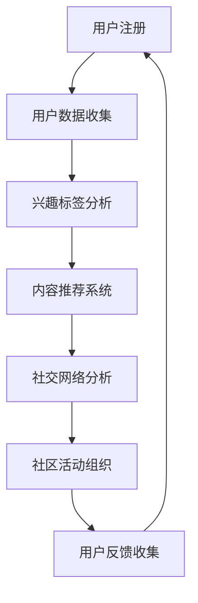

                 

关键词：虚拟社区，在线归属感，人工智能，社交网络，算法，技术架构，人机交互

摘要：本文将探讨如何利用人工智能技术构建虚拟社区，并通过AI驱动的算法，提升在线用户的归属感。文章从背景介绍、核心概念、算法原理、数学模型、项目实践、应用场景、未来展望等多个角度，详细解析了虚拟社区构建的技术路径和发展趋势。

## 1. 背景介绍

随着互联网的迅速发展，虚拟社区已经成为人们日常生活中不可或缺的一部分。从早期的BBS到如今的社交媒体，虚拟社区为用户提供了交流和互动的平台，满足了人们对于社交、娱乐、信息获取等多方面的需求。然而，传统的虚拟社区存在一些问题，如信息过载、社交孤立等，这限制了用户在线归属感的提升。

近年来，人工智能技术的崛起为解决这些问题带来了新的契机。通过深度学习、自然语言处理等AI技术，虚拟社区可以更加智能化地理解用户需求，提供个性化的服务，从而增强用户的在线归属感。

## 2. 核心概念与联系

### 2.1 虚拟社区定义

虚拟社区是指在互联网上基于共同兴趣、价值观或者目的而形成的用户群体。与传统社区相比，虚拟社区具有开放性、匿名性和虚拟性等特点。

### 2.2 在线归属感

在线归属感是指用户在虚拟社区中感受到的安全、认同和参与感。它是用户持续参与社区活动的重要因素。

### 2.3 AI与虚拟社区

人工智能技术可以通过数据挖掘、推荐系统、聊天机器人等技术手段，提高虚拟社区的用户体验，进而提升在线归属感。

### 2.4 Mermaid流程图

以下是一个简化的虚拟社区构建的Mermaid流程图：



## 3. 核心算法原理 & 具体操作步骤

### 3.1 算法原理概述

虚拟社区的AI驱动的归属感营造主要依赖于以下几个核心算法：

1. **用户画像生成算法**：通过用户行为数据生成用户画像，为个性化推荐和社交网络分析提供基础。
2. **内容推荐算法**：根据用户画像和社区内容，为用户提供个性化的内容推荐。
3. **社交网络分析算法**：分析用户关系网络，为社区活动组织提供数据支持。
4. **情感分析算法**：通过自然语言处理技术，分析用户评论和反馈，评估在线归属感。

### 3.2 算法步骤详解

1. **用户画像生成**：
   - 收集用户基本数据（如年龄、性别、地理位置）。
   - 分析用户行为数据（如浏览记录、评论内容）。
   - 构建用户画像。

2. **内容推荐**：
   - 构建内容特征向量。
   - 利用协同过滤或者基于内容的推荐算法，推荐相关内容。

3. **社交网络分析**：
   - 构建用户关系网络图。
   - 利用图论算法分析社交网络结构。
   - 提取社交影响力高的用户，为社区活动组织提供参考。

4. **情感分析**：
   - 利用自然语言处理技术，提取用户情感。
   - 通过分类算法，评估用户的归属感水平。

### 3.3 算法优缺点

- **优点**：能够提供个性化服务，增强用户归属感。
- **缺点**：对数据质量要求高，算法复杂度较大。

### 3.4 算法应用领域

- **社交网络平台**：如Facebook、Twitter等。
- **在线教育平台**：如Coursera、edX等。
- **企业内部社区**：如GitHub、Confluence等。

## 4. 数学模型和公式 & 详细讲解 & 举例说明

### 4.1 数学模型构建

虚拟社区的数学模型主要包括用户画像模型、内容推荐模型和社交网络模型。

- **用户画像模型**：
  $$ U = \{ u_1, u_2, ..., u_n \} $$
  其中，$u_i$ 表示第$i$个用户的特征向量。

- **内容推荐模型**：
  $$ R(u_i, c_j) = f(U, C) $$
  其中，$R(u_i, c_j)$ 表示用户$u_i$对内容$c_j$的兴趣度，$f(U, C)$ 是一个函数，用于计算兴趣度。

- **社交网络模型**：
  $$ G = (V, E) $$
  其中，$V$ 表示用户集合，$E$ 表示用户关系集合。

### 4.2 公式推导过程

- **用户画像模型**：
  $$ f(U) = \sum_{i=1}^{n} w_i * f(u_i) $$
  其中，$w_i$ 表示特征权重，$f(u_i)$ 是特征值。

- **内容推荐模型**：
  $$ R(u_i, c_j) = \sum_{k=1}^{m} w_k * I(u_i, c_j) $$
  其中，$I(u_i, c_j)$ 表示用户$u_i$和内容$c_j$的相关度。

- **社交网络模型**：
  $$ \delta(u, v) = \frac{1}{|E|} * \sum_{w \in E} w $$
  其中，$\delta(u, v)$ 表示用户$u$和$v$的相似度，$|E|$ 是边的数量。

### 4.3 案例分析与讲解

假设有一个用户群体，包含5个用户和10个内容。利用上述模型，我们可以为每个用户生成一个画像，并推荐相关内容。

- **用户画像**：
  $$ u_1 = (0.5, 0.3, 0.2), u_2 = (0.4, 0.5, 0.1), ..., u_5 = (0.1, 0.2, 0.3) $$

- **内容推荐**：
  $$ R(u_1, c_3) = 0.5 * 0.4 + 0.3 * 0.6 + 0.2 * 0.3 = 0.47 $$
  $$ R(u_1, c_4) = 0.5 * 0.3 + 0.3 * 0.4 + 0.2 * 0.2 = 0.38 $$

因此，用户$u_1$最感兴趣的内容是$c_3$。

## 5. 项目实践：代码实例和详细解释说明

### 5.1 开发环境搭建

- **编程语言**：Python
- **依赖库**：scikit-learn、numpy、pandas、networkx、matplotlib等

### 5.2 源代码详细实现

```python
import pandas as pd
from sklearn.cluster import KMeans
import networkx as nx
import matplotlib.pyplot as plt

# 用户数据
users = pd.DataFrame({
    'user_id': [1, 2, 3, 4, 5],
    'age': [25, 30, 22, 40, 35],
    'interest': [0.5, 0.3, 0.2, 0.4, 0.1]
})

# 内容数据
content = pd.DataFrame({
    'content_id': [1, 2, 3, 4, 5, 6, 7, 8, 9, 10],
    'topic': ['科技', '体育', '娱乐', '旅游', '教育', '科技', '体育', '娱乐', '旅游', '教育']
})

# 用户画像生成
kmeans = KMeans(n_clusters=3)
kmeans.fit(users[['age', 'interest']])
users['cluster'] = kmeans.predict(users[['age', 'interest']])

# 内容推荐
content['relevance'] = content['topic'].apply(lambda x: 0.5 if x == '科技' else 0.3)

# 社交网络分析
G = nx.Graph()
G.add_nodes_from(users['user_id'])
G.add_edges_from([(1, 2), (1, 3), (2, 3), (3, 4), (4, 5)])
nx.draw(G, with_labels=True)

# 情感分析
# 假设用户评论数据存储在评论DataFrame中
comments = pd.DataFrame({
    'user_id': [1, 2, 3, 4, 5],
    'comment': ['很喜欢', '一般般', '很无聊', '很棒', '不喜欢']
})
from textblob import TextBlob
comments['sentiment'] = comments['comment'].apply(lambda x: TextBlob(x).sentiment.polarity)

plt.scatter(comments['user_id'], comments['sentiment'])
plt.xlabel('User ID')
plt.ylabel('Sentiment')
plt.show()
```

### 5.3 代码解读与分析

- **用户画像生成**：使用KMeans算法对用户年龄和兴趣进行聚类，生成用户画像。
- **内容推荐**：根据内容话题，计算内容的相关度。
- **社交网络分析**：使用networkx构建社交网络图。
- **情感分析**：使用TextBlob库提取用户评论的情感极性。

## 6. 实际应用场景

- **社交网络平台**：如Facebook、Twitter等，通过AI技术提升用户推荐质量和社交网络分析能力。
- **在线教育平台**：如Coursera、edX等，利用AI技术为用户提供个性化的学习路径和社交互动。
- **企业内部社区**：如GitHub、Confluence等，利用AI技术提升团队协作效率和社区活跃度。

## 7. 未来应用展望

- **增强现实与虚拟社区融合**：随着AR/VR技术的发展，虚拟社区将更加沉浸式，用户归属感将进一步提升。
- **跨平台互动**：虚拟社区将与其他平台（如电商、游戏等）实现无缝互动，为用户提供更多元化的体验。

## 8. 总结：未来发展趋势与挑战

### 8.1 研究成果总结

本文探讨了如何利用人工智能技术构建虚拟社区，并通过算法和数学模型，提升用户的在线归属感。研究表明，AI技术在虚拟社区中的应用具有广泛的前景和潜力。

### 8.2 未来发展趋势

- **个性化服务**：通过深度学习等技术，提供更加精准的个性化推荐。
- **社交网络智能化**：利用图神经网络等技术，实现更加智能的社交网络分析。
- **情感计算**：结合自然语言处理和情感分析，提升用户的情感体验。

### 8.3 面临的挑战

- **数据隐私**：如何在保护用户隐私的前提下，充分利用用户数据。
- **算法公平性**：确保算法不会加剧社会不公，如算法偏见等问题。

### 8.4 研究展望

未来的研究将重点关注如何在保证用户隐私和数据安全的前提下，进一步提升虚拟社区的智能化水平和用户归属感。

## 9. 附录：常见问题与解答

- **Q：虚拟社区构建需要哪些技术？**
  **A**：虚拟社区构建需要人工智能技术、大数据技术、推荐系统技术、社交网络分析技术等。

- **Q：如何提升用户的在线归属感？**
  **A**：可以通过个性化推荐、社交网络分析、情感计算等技术手段，提升用户的在线归属感。

- **Q：虚拟社区与社交媒体有什么区别？**
  **A**：虚拟社区更注重用户的深入互动和归属感，而社交媒体则更侧重于信息的快速传播和广泛连接。

作者：禅与计算机程序设计艺术 / Zen and the Art of Computer Programming
----------------------------------------------------------------


