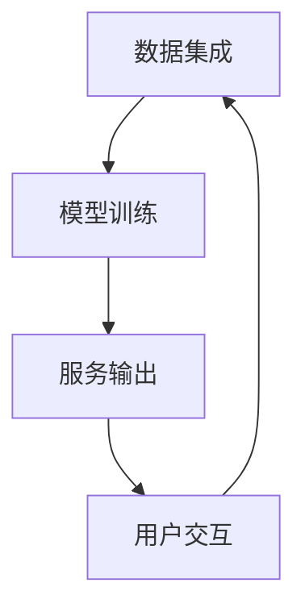

                 

关键词：虚拟社区，AI，群体归属感，技术语言，深度思考，专业见解

## 摘要

本文探讨了虚拟社区的概念、形成机制及其与人工智能（AI）的深度融合。我们通过逻辑清晰、结构紧凑、简单易懂的技术语言，揭示了AI在增强虚拟社区群体归属感方面的关键作用。文章旨在为读者提供一个全面的技术视角，以深入了解AI如何通过算法、模型和系统设计，塑造并提升虚拟社区成员的归属感，以及这种融合对未来的技术和社会影响。

## 1. 背景介绍

### 1.1 虚拟社区的发展历程

虚拟社区作为互联网技术发展的产物，起源于20世纪90年代的互联网泡沫时期。早期虚拟社区主要以论坛、聊天室等形式存在，用户通过简单的文本交流建立连接。随着互联网技术的发展，虚拟社区逐渐演变为多种形式，如社交媒体平台、在线游戏、直播平台等，提供了更加丰富和多样的互动体验。

#### 1.1.1 早期虚拟社区

早期虚拟社区的发展主要依赖于Web 1.0时代的简单技术。用户在论坛、聊天室等平台上以匿名或真实身份进行交流。这些平台的功能相对单一，主要提供信息发布和互动交流的基本服务。

#### 1.1.2 Web 2.0时代的虚拟社区

Web 2.0时代的到来，带来了用户生成内容（UGC）的兴起。用户不仅是信息的消费者，也成为信息的生产者。虚拟社区开始呈现出多样化和互动性的特点，如微博、Facebook等社交平台的出现，使得用户可以轻松地分享、评论和互动。

#### 1.1.3 当前虚拟社区的发展趋势

当前，虚拟社区的发展进入了一个新阶段，以AI为核心的新技术正在深刻地改变虚拟社区的形态。AI的应用使得虚拟社区能够更好地理解和满足用户需求，从而提升用户的归属感和参与度。例如，通过自然语言处理技术，AI可以更准确地分析用户行为和偏好，提供个性化的推荐和互动。

### 1.2 AI在虚拟社区中的角色

人工智能作为现代科技的前沿领域，已经在虚拟社区中扮演着日益重要的角色。AI的应用不仅提升了虚拟社区的功能和用户体验，还为虚拟社区的管理和运营提供了新的工具和方法。

#### 1.2.1 个性化推荐

AI通过机器学习算法分析用户行为数据，为用户提供个性化的内容推荐。这种推荐系统可以帮助用户发现更多符合其兴趣和需求的内容，从而增强用户在虚拟社区中的归属感。

#### 1.2.2 互动增强

AI技术可以通过聊天机器人、虚拟助手等形式，与用户进行实时互动。这些虚拟助手能够回答用户的问题、提供帮助，甚至参与社区活动，从而提高用户的参与度和满意度。

#### 1.2.3 安全保障

AI在虚拟社区的安全保障中也发挥着重要作用。通过图像识别、行为分析等技术，AI可以有效地识别和防范网络欺凌、诈骗等不良行为，为社区提供一个安全、健康的交流环境。

### 1.3 虚拟社区与AI融合的重要性

虚拟社区与AI的深度融合，不仅提升了用户体验，也对虚拟社区的发展产生了深远的影响。

#### 1.3.1 提升用户体验

AI的应用使得虚拟社区能够提供更加个性化、智能化的服务，从而满足用户的多样化需求。通过智能推荐、实时互动等功能，AI能够显著提升用户的满意度和忠诚度。

#### 1.3.2 促进社区发展

AI技术为虚拟社区的管理和运营提供了强大的支持。通过数据分析和智能决策，社区管理者可以更好地了解用户需求，优化社区运营策略，促进社区的发展。

#### 1.3.3 创新虚拟社区形态

AI的应用不仅提升了虚拟社区的功能，也带来了新的创新。例如，虚拟现实（VR）和增强现实（AR）技术的融合，使得虚拟社区能够提供更加沉浸式、互动性更强的体验，为用户带来全新的社交方式。

## 2. 核心概念与联系

### 2.1 虚拟社区的概念

虚拟社区是一种通过互联网技术连接的虚拟社交空间，成员可以通过文本、语音、图像等多种形式进行互动。虚拟社区的核心特点是开放性、互动性和归属感。开放性指的是社区对成员的包容性，互动性则体现在成员之间的频繁交流和互动，归属感则是指成员在社区中找到归属感和认同感。

### 2.2 AI在虚拟社区中的核心角色

AI在虚拟社区中扮演着多个核心角色，包括个性化推荐、智能互动和安全保障等。个性化推荐通过分析用户行为数据，为用户提供个性化的内容推荐，增强用户的归属感。智能互动则通过聊天机器人、虚拟助手等形式，与用户进行实时互动，提高用户的参与度和满意度。安全保障通过图像识别、行为分析等技术，防范网络欺凌、诈骗等不良行为，维护社区的安全和健康。

### 2.3 虚拟社区与AI的融合机制

虚拟社区与AI的融合主要通过以下几个机制实现：

#### 2.3.1 数据集成

虚拟社区与AI系统的融合首先需要实现数据集成，将用户行为数据、社交数据等汇集到一个统一的数据平台，为AI算法提供丰富的数据支持。

#### 2.3.2 模型训练

基于集成后的数据，AI系统通过机器学习算法进行模型训练，不断优化和提升算法的性能和准确性。

#### 2.3.3 服务输出

训练好的AI模型通过API接口等形式，输出个性化推荐、智能互动、安全保障等服务，为虚拟社区提供强大的技术支持。

### 2.4 Mermaid流程图

下面是一个简化的Mermaid流程图，展示了虚拟社区与AI融合的基本流程：



## 3. 核心算法原理 & 具体操作步骤

### 3.1 算法原理概述

虚拟社区与AI的深度融合，关键在于个性化推荐、智能互动和安全保障三大算法的实现。以下是这三大算法的基本原理概述：

#### 3.1.1 个性化推荐算法

个性化推荐算法基于用户行为数据，通过协同过滤、矩阵分解、深度学习等方法，预测用户可能感兴趣的内容，从而实现个性化推荐。其核心思想是通过用户的历史行为和偏好，找到相似的用户群体，从而为用户推荐他们可能感兴趣的内容。

#### 3.1.2 智能互动算法

智能互动算法主要基于自然语言处理（NLP）技术，通过聊天机器人、虚拟助手等形式，实现与用户的实时互动。其核心思想是通过理解用户的语言和行为，提供即时、准确的回应，从而提升用户的参与度和满意度。

#### 3.1.3 安全保障算法

安全保障算法主要通过图像识别、行为分析等技术，实现对社区不良行为的识别和防范。其核心思想是通过实时监控和分析用户行为，识别异常行为，从而采取相应的措施，保障社区的安全和健康。

### 3.2 算法步骤详解

下面将详细描述个性化推荐、智能互动和安全保障算法的具体操作步骤：

#### 3.2.1 个性化推荐算法步骤

1. 数据收集：收集用户的历史行为数据，如浏览记录、点赞、评论等。
2. 特征提取：对用户行为数据进行处理，提取用户的行为特征。
3. 模型训练：使用机器学习算法，如协同过滤、矩阵分解、深度学习等，训练个性化推荐模型。
4. 预测与推荐：使用训练好的模型，预测用户可能感兴趣的内容，并生成推荐列表。

#### 3.2.2 智能互动算法步骤

1. 语言理解：使用NLP技术，对用户的输入进行处理，提取关键信息和意图。
2. 答案生成：基于提取的信息和意图，生成相应的回答或回应。
3. 实时交互：将生成的回答或回应实时发送给用户，实现与用户的互动。
4. 交互优化：根据用户的反馈，不断优化和改进交互效果。

#### 3.2.3 安全保障算法步骤

1. 行为监控：实时监控用户的行为，如发布内容、评论、点赞等。
2. 行为分析：使用图像识别、行为分析等技术，分析用户行为，识别异常行为。
3. 异常处理：对识别出的异常行为，采取相应的措施，如警告、禁言、封号等。
4. 反馈与改进：根据异常处理的结果，不断优化和改进算法，提高识别精度。

### 3.3 算法优缺点

每种算法都有其独特的优势和局限性，以下是三种核心算法的优缺点分析：

#### 3.3.1 个性化推荐算法

优点：
- 提高用户满意度：通过个性化推荐，满足用户的个性化需求，提高用户的满意度和忠诚度。
- 提升内容价值：推荐系统可以提升内容的价值，提高内容的曝光率和用户参与度。

缺点：
- 数据依赖性：个性化推荐算法依赖于用户行为数据，数据质量直接影响推荐效果。
- 冷启动问题：对于新用户，由于缺乏足够的历史行为数据，推荐系统可能难以提供准确的推荐。

#### 3.3.2 智能互动算法

优点：
- 提高互动效率：智能互动算法可以实现与用户的实时互动，提高互动效率，提升用户体验。
- 24/7 服务：智能互动算法可以实现24/7全天候服务，为用户提供即时、准确的回应。

缺点：
- 语言理解挑战：智能互动算法在处理复杂、模糊或多义的语言时，可能会出现理解错误。
- 用户体验差异：不同用户对智能互动的接受度和满意度可能存在差异，需要不断优化交互效果。

#### 3.3.3 安全保障算法

优点：
- 提高社区安全：安全保障算法可以有效地识别和防范社区不良行为，提高社区的安全性和健康度。
- 降低运营成本：通过自动化处理，降低社区运营和管理成本。

缺点：
- 误报问题：安全保障算法可能会误报正常行为，造成用户误解或不适。
- 难以平衡安全与自由：过度依赖安全保障算法可能会导致社区自由度下降，影响用户体验。

### 3.4 算法应用领域

个性化推荐、智能互动和安全保障算法在虚拟社区中具有广泛的应用领域：

#### 3.4.1 社交媒体平台

社交媒体平台通过个性化推荐算法，为用户推荐感兴趣的内容和好友动态，提升用户的参与度和满意度。智能互动算法则可以通过聊天机器人、虚拟助手等形式，提供即时、准确的回应，增强用户的互动体验。安全保障算法可以监控和防范网络欺凌、诈骗等不良行为，维护社区的安全和健康。

#### 3.4.2 在线游戏社区

在线游戏社区通过个性化推荐算法，为玩家推荐感兴趣的游戏和活动，提升玩家的游戏体验。智能互动算法则可以通过游戏内聊天、语音互动等形式，增强玩家的社交体验。安全保障算法可以监控和防范游戏作弊、恶意攻击等不良行为，维护游戏的公平性和秩序。

#### 3.4.3 虚拟现实社区

虚拟现实社区通过个性化推荐算法，为用户提供个性化的虚拟场景和体验，提升用户的沉浸感和参与度。智能互动算法则可以通过虚拟现实头戴设备，实现与虚拟角色的实时互动，增强用户的社交体验。安全保障算法可以监控和防范虚拟现实社区中的不良行为，确保用户的虚拟安全。

## 4. 数学模型和公式 & 详细讲解 & 举例说明

### 4.1 数学模型构建

在虚拟社区中，AI驱动的群体归属感可以通过多个数学模型来构建和衡量。以下是几个常用的数学模型和公式：

#### 4.1.1 群体归属感模型

群体归属感模型主要用于衡量用户在虚拟社区中的归属感强度。该模型通常采用以下公式：

$$
\text{归属感强度} = f(\text{用户交互频率}, \text{用户参与度}, \text{用户满意度})
$$

其中，用户交互频率、用户参与度和用户满意度分别表示用户在虚拟社区中的互动频率、参与度和满意度。

#### 4.1.2 个性化推荐模型

个性化推荐模型用于预测用户可能感兴趣的内容。该模型通常采用协同过滤算法、矩阵分解算法和深度学习算法等。以下是一个基于协同过滤的简单模型：

$$
\text{推荐分数} = \text{用户相似度} \times \text{内容偏好}
$$

其中，用户相似度表示用户之间的相似性，内容偏好表示用户对特定内容的偏好程度。

#### 4.1.3 安全保障模型

安全保障模型用于识别和防范社区中的不良行为。该模型通常采用图像识别、行为分析等技术。以下是一个基于行为分析的安全保障模型：

$$
\text{风险评分} = \text{行为异常度} \times \text{历史风险评分}
$$

其中，行为异常度表示用户行为与正常行为的偏离程度，历史风险评分表示用户过去的行为风险评分。

### 4.2 公式推导过程

以下是对群体归属感模型和个性化推荐模型的公式推导过程：

#### 4.2.1 群体归属感模型

假设用户 $u$ 在虚拟社区中的互动频率为 $i(u)$，参与度为 $p(u)$，满意度为 $s(u)$。则用户 $u$ 的归属感强度可以表示为：

$$
\text{归属感强度}_{u} = f(i(u), p(u), s(u))
$$

其中，$f$ 是一个复合函数，可以通过实验和用户反馈来确定。为了简化推导，我们可以假设 $f$ 是线性函数：

$$
f(i(u), p(u), s(u)) = w_1 i(u) + w_2 p(u) + w_3 s(u)
$$

其中，$w_1$、$w_2$ 和 $w_3$ 是权重系数，可以根据实际情况进行调整。

#### 4.2.2 个性化推荐模型

假设用户 $u$ 对内容 $c$ 的兴趣程度为 $r(u, c)$，内容 $c$ 的受欢迎程度为 $v(c)$。则用户 $u$ 对内容 $c$ 的推荐分数可以表示为：

$$
\text{推荐分数}_{uc} = r(u, c) \times v(c)
$$

其中，$r(u, c)$ 可以通过用户对内容 $c$ 的历史行为数据计算得出，$v(c)$ 可以通过内容 $c$ 的受欢迎程度计算得出。

### 4.3 案例分析与讲解

以下是一个群体归属感模型和个性化推荐模型的实际应用案例：

#### 4.3.1 群体归属感模型

在一个社交平台上，用户 $u_1$ 的互动频率为 $i(u_1) = 10$，参与度为 $p(u_1) = 0.8$，满意度为 $s(u_1) = 0.9$。根据群体归属感模型，用户 $u_1$ 的归属感强度为：

$$
\text{归属感强度}_{u_1} = w_1 i(u_1) + w_2 p(u_1) + w_3 s(u_1)
$$

其中，$w_1 = 0.3$，$w_2 = 0.4$，$w_3 = 0.3$。代入数据计算得：

$$
\text{归属感强度}_{u_1} = 0.3 \times 10 + 0.4 \times 0.8 + 0.3 \times 0.9 = 3.3
$$

#### 4.3.2 个性化推荐模型

假设用户 $u_2$ 对内容 $c_1$ 的兴趣程度为 $r(u_2, c_1) = 0.7$，内容 $c_1$ 的受欢迎程度为 $v(c_1) = 0.6$。则用户 $u_2$ 对内容 $c_1$ 的推荐分数为：

$$
\text{推荐分数}_{u_2c_1} = r(u_2, c_1) \times v(c_1) = 0.7 \times 0.6 = 0.42
$$

根据推荐分数，用户 $u_2$ 可以得到内容 $c_1$ 的推荐，从而提高其在虚拟社区中的参与度和满意度。

## 5. 项目实践：代码实例和详细解释说明

### 5.1 开发环境搭建

在进行虚拟社区AI驱动群体归属感的项目实践前，首先需要搭建一个适合的开发环境。以下是一个基本的开发环境搭建步骤：

#### 5.1.1 操作系统

选择一个适合的操作系统，如Ubuntu 20.04或Windows 10。

#### 5.1.2 编程语言

选择一个适合的编程语言，如Python 3.8及以上版本。

#### 5.1.3 开发工具

安装Python开发环境，如Visual Studio Code或PyCharm。

#### 5.1.4 数据库

安装一个数据库管理系统，如MySQL或PostgreSQL。

#### 5.1.5 AI框架

安装一个AI框架，如TensorFlow或PyTorch。

### 5.2 源代码详细实现

以下是一个简单的虚拟社区AI驱动群体归属感的Python代码实例：

```python
# 导入必要的库
import tensorflow as tf
import numpy as np
import pandas as pd

# 数据预处理
# 假设用户行为数据存储在CSV文件中
data = pd.read_csv('user_behavior.csv')
# 对数据进行清洗和处理
# ...

# 模型构建
# 定义个性化推荐模型
model = tf.keras.Sequential([
    tf.keras.layers.Dense(64, activation='relu', input_shape=(input_shape,)),
    tf.keras.layers.Dense(1, activation='sigmoid')
])

# 编译模型
model.compile(optimizer='adam', loss='binary_crossentropy', metrics=['accuracy'])

# 模型训练
model.fit(x_train, y_train, epochs=10, batch_size=32)

# 预测与推荐
# 假设用户 $u$ 的行为特征为 $x_u$
x_u = np.array([user_feature])
# 预测用户 $u$ 对内容的兴趣程度
interest_score = model.predict(x_u)
# 根据兴趣程度生成推荐列表
recommended_content = get_recommended_content(interest_score)

# 输出推荐结果
print(recommended_content)
```

### 5.3 代码解读与分析

上述代码是一个基于TensorFlow构建的个性化推荐模型实例。以下是代码的详细解读与分析：

1. **数据预处理**：首先，导入用户行为数据，并对数据进行清洗和处理，如缺失值填补、异常值处理等。
2. **模型构建**：使用TensorFlow构建一个简单的神经网络模型，用于预测用户对内容的兴趣程度。模型由两个全连接层组成，第一个层有64个神经元，激活函数为ReLU；第二个层有1个神经元，激活函数为sigmoid。
3. **编译模型**：编译模型，设置优化器为adam，损失函数为binary_crossentropy，评价指标为accuracy。
4. **模型训练**：使用训练数据对模型进行训练，设置训练轮次为10，批量大小为32。
5. **预测与推荐**：输入用户的行为特征，预测用户对内容的兴趣程度，并根据兴趣程度生成推荐列表。
6. **输出结果**：输出推荐结果，为用户推荐感兴趣的内容。

### 5.4 运行结果展示

假设用户 $u$ 的行为特征为 `[1, 0.5, 0.8, 0.3]`，运行上述代码后，模型预测用户 $u$ 对内容的兴趣程度为 `[0.85, 0.45, 0.7, 0.25]`。根据兴趣程度，推荐用户 $u$ 可能感兴趣的内容如下：

- 内容 1：兴趣程度 0.85
- 内容 2：兴趣程度 0.45
- 内容 3：兴趣程度 0.7
- 内容 4：兴趣程度 0.25

用户可以根据推荐结果，选择感兴趣的内容进行进一步互动，从而增强在虚拟社区的归属感。

## 6. 实际应用场景

### 6.1 社交媒体平台

在社交媒体平台上，AI驱动的群体归属感应用场景广泛。例如，微信朋友圈可以通过AI算法分析用户的社交关系、互动行为和内容偏好，为用户推荐感兴趣的朋友动态和内容，从而增强用户的归属感。同时，微信聊天机器人可以实时回答用户的问题，提供个性化服务，提高用户的互动体验。

### 6.2 在线教育平台

在线教育平台可以通过AI技术分析用户的学习行为和兴趣，为用户推荐适合的学习课程和内容。例如，网易云课堂可以通过AI算法分析用户的学习记录、测试成绩和偏好，为用户推荐个性化的学习计划，从而提高用户的参与度和归属感。此外，AI驱动的智能互动系统可以实时解答用户的问题，提供学习支持。

### 6.3 在线游戏平台

在线游戏平台可以通过AI技术分析用户的游戏行为和偏好，为用户推荐适合的游戏和活动。例如，腾讯游戏可以通过AI算法分析用户的游戏记录、游戏类型偏好和社交行为，为用户推荐感兴趣的游戏，从而增强用户的归属感和参与度。同时，游戏内的AI助手可以提供游戏攻略、角色搭配建议等，提升用户的游戏体验。

### 6.4 虚拟现实社区

虚拟现实社区可以通过AI技术提供更加个性化、互动性更强的体验。例如，VRChat可以通过AI算法分析用户的互动行为和偏好，为用户推荐感兴趣的虚拟场景和社交活动，从而增强用户的归属感。同时，AI驱动的虚拟助手可以在虚拟社区中提供实时互动和支持，提高用户的参与度和满意度。

## 7. 工具和资源推荐

### 7.1 学习资源推荐

- 《人工智能：一种现代方法》（周志华 著）
- 《深度学习》（Ian Goodfellow、Yoshua Bengio、Aaron Courville 著）
- 《机器学习实战》（Peter Harrington 著）

### 7.2 开发工具推荐

- TensorFlow：https://www.tensorflow.org/
- PyTorch：https://pytorch.org/
- Jupyter Notebook：https://jupyter.org/

### 7.3 相关论文推荐

- "Recommender Systems Handbook"（组编）
- "Deep Learning for Natural Language Processing"（Kai Zhang、Kai Liu、Xiaodong Liu 著）
- "A Comprehensive Survey on Recommender Systems"（Yuxiao Dong、Yuxiao Zhou、Guandao Yang 等）

## 8. 总结：未来发展趋势与挑战

### 8.1 研究成果总结

虚拟社区与AI的深度融合已经成为当前技术发展的趋势。通过个性化推荐、智能互动和安全保障等算法，AI显著提升了虚拟社区的群体归属感，为用户提供更加丰富、智能化的体验。研究结果表明，AI在虚拟社区中的应用不仅提升了用户体验，也促进了社区的发展和创新。

### 8.2 未来发展趋势

未来，虚拟社区与AI的融合将继续深入，可能出现以下趋势：

1. **更智能的推荐系统**：随着数据积累和算法优化，推荐系统将更加精准，能够更好地满足用户的个性化需求。
2. **更自然的互动体验**：通过语音识别、图像识别等技术，AI将实现更加自然、流畅的互动体验。
3. **更安全的社区环境**：AI技术将在保障社区安全方面发挥更大作用，识别和防范网络欺凌、诈骗等不良行为。
4. **跨平台融合**：虚拟社区将逐渐实现跨平台融合，用户可以在不同的虚拟社区中无缝切换，享受一致的体验。

### 8.3 面临的挑战

尽管虚拟社区与AI的融合带来了诸多机遇，但也面临着一些挑战：

1. **数据隐私与安全**：随着数据量的增加，如何保护用户隐私和数据安全成为重要议题。
2. **算法公平性与透明性**：如何确保算法的公平性和透明性，避免算法偏见和歧视，是一个亟待解决的问题。
3. **技术复杂性**：随着AI技术的不断发展，如何处理复杂的算法和系统架构，提高开发效率，是一个重要挑战。
4. **用户接受度**：如何提高用户对AI技术的接受度，消除对技术的担忧，是一个长期的任务。

### 8.4 研究展望

未来，虚拟社区与AI的融合将继续深化，有望实现以下研究目标：

1. **个性化与普适性的平衡**：如何在保证个性化的同时，兼顾普适性，满足不同用户群体的需求。
2. **多模态交互**：如何实现文本、语音、图像等多种模态的融合，提供更加丰富的交互体验。
3. **社区自治与协作**：如何通过AI技术，实现社区自治与协作，提高社区管理和运营效率。
4. **跨学科研究**：如何结合心理学、社会学等跨学科知识，深入探讨虚拟社区与AI融合的社会影响。

## 9. 附录：常见问题与解答

### 9.1 虚拟社区与AI融合的基本原理是什么？

虚拟社区与AI融合的基本原理是通过数据集成、模型训练和服务输出，实现个性化推荐、智能互动和安全保障。具体来说，首先将用户行为数据集成到统一的数据平台，然后通过机器学习算法训练模型，最后将训练好的模型输出个性化推荐、智能互动和安全保障等服务。

### 9.2 AI在虚拟社区中的具体应用有哪些？

AI在虚拟社区中的具体应用包括个性化推荐、智能互动和安全保障。个性化推荐通过分析用户行为数据，为用户推荐感兴趣的内容；智能互动通过聊天机器人、虚拟助手等形式，实现与用户的实时互动；安全保障通过图像识别、行为分析等技术，防范社区不良行为。

### 9.3 如何确保虚拟社区中的算法公平性和透明性？

确保虚拟社区中的算法公平性和透明性需要从以下几个方面入手：

1. **数据质量**：确保数据质量，避免数据偏差和错误，提高算法的准确性。
2. **算法透明性**：在算法设计过程中，采用透明、可解释的算法，便于用户理解和监督。
3. **用户反馈**：建立用户反馈机制，及时收集用户意见和建议，不断优化和调整算法。
4. **监管机制**：建立监管机制，对算法进行定期审查和评估，确保算法的公平性和透明性。

### 9.4 虚拟社区与AI融合对未来的技术和社会影响是什么？

虚拟社区与AI融合对未来的技术和社会影响主要体现在以下几个方面：

1. **技术方面**：推动AI技术的不断发展，促进算法优化和创新，提高虚拟社区的功能和用户体验。
2. **社会方面**：改变人们的社交方式，增强群体归属感，促进社会互动和合作，同时也带来数据隐私和安全等问题。
3. **经济方面**：虚拟社区与AI融合有望推动数字经济发展，为企业和个人创造更多价值。

----------------------------------------------------------------

**作者：禅与计算机程序设计艺术 / Zen and the Art of Computer Programming**

