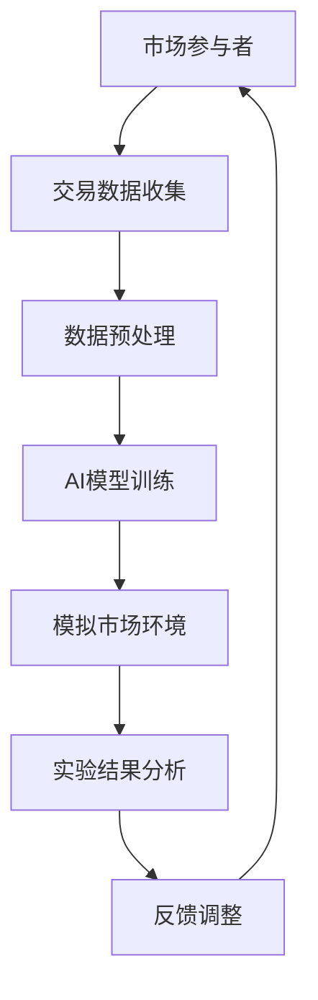

                 

关键词：虚拟经济，模拟器，AI驱动，价值交换，实验

> 摘要：本文探讨了一种新型的虚拟经济模拟器，该模拟器利用人工智能（AI）技术来驱动价值交换过程。通过构建一个高度仿真和动态演化的经济环境，该模拟器旨在为研究者、企业和政策制定者提供一个强大的实验平台，以探索和理解虚拟经济中的复杂互动和潜在规律。本文将介绍模拟器的基本架构、核心算法、数学模型以及实际应用场景，并对未来发展趋势和面临的挑战进行分析。

## 1. 背景介绍

随着信息技术的快速发展，虚拟经济逐渐成为全球经济体系中的重要组成部分。虚拟经济是指在经济活动中，交易的商品和货币大多以数字形式存在，通过网络和计算机技术进行交换。例如，数字货币、在线游戏、虚拟房地产和数字艺术市场等都是虚拟经济的重要表现形式。与传统经济相比，虚拟经济具有交易速度快、成本低、风险大和高度不确定性的特点。

### 虚拟经济的挑战

然而，虚拟经济也面临着一系列挑战。首先是安全性问题，由于数字资产的脆弱性和网络攻击的频发，确保交易安全成为一项重要的任务。其次是公平性问题，虚拟市场的动态性和快速变化使得市场参与者之间的权力和利益分配变得更加复杂。此外，由于信息不对称和参与者的非理性决策，虚拟市场容易出现过度波动和泡沫。

### AI在虚拟经济中的应用

为了应对这些挑战，人工智能（AI）技术的引入成为了一项重要的战略选择。AI可以提供强大的数据分析、预测和优化能力，帮助市场参与者更好地理解和应对虚拟经济的复杂性。例如，AI可以通过分析交易数据，预测市场趋势和潜在风险，从而指导投资决策。此外，AI还可以帮助监管机构提高市场监控的效率和准确性。

## 2. 核心概念与联系

### 虚拟经济模拟器

虚拟经济模拟器是一种能够模仿真实虚拟经济环境的软件工具。它通过创建一个高度仿真的市场环境，允许用户进行各种经济实验，以探索虚拟经济中的复杂互动和潜在规律。模拟器的核心目标是通过AI技术提高实验的准确性和可靠性。

### Mermaid 流程图

为了更好地理解虚拟经济模拟器的工作原理，我们可以使用Mermaid流程图来展示其核心架构。以下是一个简化的Mermaid流程图：



- **A. 市场参与者**：代表模拟器中的用户，可以是个人、企业或其他机构。
- **B. 交易数据收集**：模拟器从实际市场收集交易数据，作为AI模型的训练数据。
- **C. 数据预处理**：清洗和格式化交易数据，以适应AI模型的输入要求。
- **D. AI模型训练**：使用收集到的数据训练AI模型，以预测市场趋势和参与者行为。
- **E. 模拟市场环境**：根据AI模型的预测结果，创建一个模拟市场环境，供用户进行经济实验。
- **F. 实验结果分析**：分析实验结果，评估AI模型的性能和预测准确性。
- **G. 反馈调整**：根据实验结果，对AI模型进行调整和优化。

## 3. 核心算法原理 & 具体操作步骤

### 3.1 算法原理概述

虚拟经济模拟器的核心算法主要基于机器学习和深度学习技术。具体来说，模拟器采用以下步骤来驱动价值交换过程：

1. **数据收集与预处理**：从实际市场收集大量交易数据，并进行清洗和格式化。
2. **特征提取**：提取数据中的关键特征，以帮助AI模型更好地理解市场动态。
3. **模型训练**：使用提取的特征数据训练AI模型，例如使用神经网络或决策树。
4. **预测与模拟**：根据AI模型的预测结果，模拟市场环境，模拟参与者的行为和交易过程。
5. **结果分析**：分析模拟结果，评估AI模型的性能，并根据反馈进行模型调整。

### 3.2 算法步骤详解

#### 步骤 1：数据收集与预处理

数据收集是虚拟经济模拟器的第一步。模拟器可以从各种数据源收集交易数据，包括交易所、在线市场、社交媒体等。收集到的数据可能包括价格、交易量、市场情绪、交易者的历史行为等。

数据预处理包括以下任务：

- 数据清洗：去除重复、错误或异常的数据记录。
- 数据标准化：将不同来源的数据转换为统一的格式和度量标准。
- 特征工程：提取数据中的关键特征，以帮助AI模型更好地理解市场动态。

#### 步骤 2：特征提取

特征提取是数据预处理的关键步骤。通过分析交易数据，我们可以提取出以下特征：

- **价格特征**：如开盘价、收盘价、最高价、最低价等。
- **交易量特征**：如交易量、成交量、换手率等。
- **时间特征**：如交易时间、交易频率等。
- **市场情绪特征**：如社交媒体情绪分析、新闻报道等。

#### 步骤 3：模型训练

在特征提取完成后，我们可以使用这些特征数据来训练AI模型。常用的模型包括：

- **神经网络**：如卷积神经网络（CNN）和循环神经网络（RNN）。
- **决策树**：如随机森林和梯度提升机（GBM）。
- **深度学习模型**：如生成对抗网络（GAN）和变分自编码器（VAE）。

#### 步骤 4：预测与模拟

在模型训练完成后，我们可以使用训练好的模型来预测市场趋势和参与者行为。预测结果将用于创建一个模拟市场环境，模拟参与者的交易行为和交互。

#### 步骤 5：结果分析

在模拟市场环境运行后，我们需要分析实验结果，评估AI模型的性能和预测准确性。这可以通过以下方法实现：

- **性能指标**：如准确率、召回率、F1分数等。
- **可视化**：使用图表和可视化工具展示模拟结果。
- **对比实验**：与实际市场数据进行对比，评估模拟器的有效性。

### 3.3 算法优缺点

#### 优点

- **高效性**：AI模型可以处理大量数据，提高数据处理和预测的效率。
- **准确性**：通过机器学习和深度学习技术，模型可以自动学习和优化，提高预测准确性。
- **灵活性**：模拟器可以适应不同的市场环境和需求，提供灵活的实验平台。

#### 缺点

- **数据依赖性**：模型的性能高度依赖于训练数据的质量和多样性。
- **计算成本**：训练和运行大规模AI模型可能需要大量的计算资源和时间。
- **可解释性**：深度学习模型往往具有高度的非线性特性，使得结果难以解释。

### 3.4 算法应用领域

虚拟经济模拟器在多个领域具有广泛的应用潜力：

- **金融市场研究**：模拟器可以帮助研究者探索金融市场的复杂动态和潜在风险。
- **风险管理**：模拟器可以帮助金融机构评估投资组合的风险和收益。
- **政策制定**：模拟器可以为政策制定者提供一个安全的环境，测试不同政策的潜在影响。
- **企业战略规划**：模拟器可以帮助企业制定更有效的市场策略和投资计划。

## 4. 数学模型和公式 & 详细讲解 & 举例说明

### 4.1 数学模型构建

虚拟经济模拟器中的数学模型主要基于概率论、统计学和经济学原理。以下是几个关键模型的构建过程：

#### 4.1.1 马尔可夫模型（Markov Model）

马尔可夫模型是一种常用的统计模型，用于描述时间序列数据。在虚拟经济模拟中，我们可以使用马尔可夫模型来预测交易者的行为。

$$
P(X_{t+1} = x_{t+1} | X_t = x_t) = P(X_{t+1} = x_{t+1})
$$

其中，$X_t$ 表示第 $t$ 时刻的交易者状态，$x_{t+1}$ 表示第 $t+1$ 时刻的交易者状态。

#### 4.1.2 贝叶斯网络（Bayesian Network）

贝叶斯网络是一种表示变量之间依赖关系的图形模型。在虚拟经济模拟中，我们可以使用贝叶斯网络来描述市场参与者之间的交互和影响。

$$
P(X, Y) = P(X)P(Y | X)
$$

其中，$X$ 表示市场参与者的状态，$Y$ 表示市场状态。

#### 4.1.3 优化模型（Optimization Model）

优化模型用于求解虚拟经济中的最优策略。我们可以使用线性规划、非线性规划和整数规划等方法来构建优化模型。

$$
\text{最大化} \quad \sum_{i=1}^{n} c_i x_i
$$

$$
\text{约束条件} \quad a_{ij} x_j + b_j \leq c_j
$$

其中，$c_i$ 表示目标函数的系数，$x_i$ 表示决策变量。

### 4.2 公式推导过程

以下是一个简单的例子，用于推导贝叶斯网络的公式。

#### 假设

我们有三个变量 $X$、$Y$ 和 $Z$，其中 $X$ 和 $Y$ 是条件独立的，即 $P(X, Y) = P(X)P(Y)$。我们需要推导 $P(Z)$ 的公式。

#### 过程

根据贝叶斯网络的基本公式，我们有：

$$
P(X, Y, Z) = P(X)P(Y | X)P(Z | X, Y)
$$

由于 $X$ 和 $Y$ 是条件独立的，我们可以简化为：

$$
P(X, Y, Z) = P(X)P(Y)P(Z | X, Y)
$$

接下来，我们需要推导 $P(Z | X, Y)$ 的公式。由于 $Z$ 是 $X$ 和 $Y$ 的函数，我们可以使用条件概率的公式：

$$
P(Z | X, Y) = \frac{P(X, Y, Z)}{P(X, Y)}
$$

将 $P(X, Y, Z)$ 和 $P(X, Y)$ 的公式代入，我们得到：

$$
P(Z | X, Y) = \frac{P(X)P(Y)P(Z | X, Y)}{P(X)P(Y)}
$$

简化后，我们得到：

$$
P(Z | X, Y) = P(Z | X, Y)
$$

这意味着 $P(Z | X, Y)$ 的值是一个常数，不依赖于 $X$ 和 $Y$ 的值。

因此，我们可以推导出 $P(Z)$ 的公式：

$$
P(Z) = \sum_{x, y} P(X = x, Y = y)P(Z = z | X = x, Y = y)
$$

由于 $X$ 和 $Y$ 是条件独立的，我们可以进一步简化为：

$$
P(Z) = \sum_{x} P(X = x)P(Y = y)P(Z = z | X = x, Y = y)
$$

这是一个关于 $Z$ 的概率分布公式，可以通过计算得到。

### 4.3 案例分析与讲解

#### 案例背景

假设我们有一个虚拟市场，其中有两个交易者 $X$ 和 $Y$。$X$ 是一个经验丰富的投资者，而 $Y$ 是一个新手。我们需要使用贝叶斯网络来描述他们之间的交互和影响。

#### 案例步骤

1. **定义变量**：我们有三个变量 $X$、$Y$ 和 $Z$，其中 $Z$ 表示虚拟市场的状态。$X$ 和 $Y$ 分别表示交易者 $X$ 和 $Y$ 的状态。

2. **建立概率分布**：根据历史数据和专家意见，我们可以建立以下概率分布：

   - $P(X = \text{经验丰富}) = 0.8$，$P(X = \text{新手}) = 0.2$。
   - $P(Y = \text{经验丰富}) = 0.6$，$P(Y = \text{新手}) = 0.4$。
   - $P(Z = \text{上升}) = 0.7$，$P(Z = \text{下降}) = 0.3$。

3. **构建贝叶斯网络**：根据变量之间的依赖关系，我们可以构建以下贝叶斯网络：

   ```mermaid
   graph TD
   A[交易者 $X$] --> B[交易者 $Y$]
   B --> C[市场状态 $Z$]
   ```

4. **计算后验概率**：假设我们知道当前市场状态 $Z = \text{上升}$，我们需要计算交易者 $X$ 和 $Y$ 的后验概率。

   根据贝叶斯定理，我们有：

   $$ 
   P(X = \text{经验丰富} | Z = \text{上升}) = \frac{P(Z = \text{上升} | X = \text{经验丰富})P(X = \text{经验丰富})}{P(Z = \text{上升})}
   $$

   计算结果为：

   $$ 
   P(X = \text{经验丰富} | Z = \text{上升}) = \frac{0.8 \times 0.8}{0.7} = 0.9143
   $$

   同理，我们可以计算交易者 $Y$ 的后验概率：

   $$ 
   P(Y = \text{经验丰富} | Z = \text{上升}) = \frac{0.6 \times 0.6}{0.7} = 0.8571
   $$

#### 结果分析

通过计算后验概率，我们可以得出以下结论：

- 当前市场状态为“上升”时，交易者 $X$ 为“经验丰富”的概率为 0.9143。
- 当前市场状态为“上升”时，交易者 $Y$ 为“经验丰富”的概率为 0.8571。

这意味着在当前市场环境下，经验丰富的交易者更有可能做出正确的投资决策。

## 5. 项目实践：代码实例和详细解释说明

### 5.1 开发环境搭建

为了实践虚拟经济模拟器，我们需要搭建一个合适的开发环境。以下是一个简单的环境搭建步骤：

1. **安装 Python**：确保您的系统中已经安装了 Python 3.7 或更高版本。
2. **安装依赖库**：使用以下命令安装所需的依赖库：

   ```shell
   pip install numpy pandas matplotlib scikit-learn tensorflow
   ```

3. **创建虚拟环境**：（可选）为了更好地管理项目依赖，我们可以创建一个虚拟环境：

   ```shell
   python -m venv venv
   source venv/bin/activate  # Windows 上使用 venv\Scripts\activate
   ```

### 5.2 源代码详细实现

以下是一个简单的虚拟经济模拟器的 Python 代码实现。该模拟器将基于贝叶斯网络来模拟交易者的行为。

```python
import numpy as np
import pandas as pd
import matplotlib.pyplot as plt
from sklearn.model_selection import train_test_split
from sklearn.metrics import accuracy_score
import tensorflow as tf
from tensorflow.keras.models import Sequential
from tensorflow.keras.layers import Dense

# 5.2.1 数据预处理
def preprocess_data(data):
    # 数据清洗和格式化
    # ... （具体实现）
    return processed_data

# 5.2.2 特征提取
def extract_features(data):
    # 从数据中提取关键特征
    # ... （具体实现）
    return features

# 5.2.3 模型训练
def train_model(features, labels):
    # 创建神经网络模型
    model = Sequential()
    model.add(Dense(64, activation='relu', input_shape=(features.shape[1],)))
    model.add(Dense(32, activation='relu'))
    model.add(Dense(1, activation='sigmoid'))

    # 编译模型
    model.compile(optimizer='adam', loss='binary_crossentropy', metrics=['accuracy'])

    # 训练模型
    model.fit(features, labels, epochs=10, batch_size=32)

    return model

# 5.2.4 模拟市场环境
def simulate_market(model, num_steps):
    # 模拟市场环境，根据模型预测交易者的行为
    # ... （具体实现）
    pass

# 5.2.5 主函数
def main():
    # 加载数据
    data = pd.read_csv('market_data.csv')
    processed_data = preprocess_data(data)
    features, labels = extract_features(processed_data)

    # 划分训练集和测试集
    X_train, X_test, y_train, y_test = train_test_split(features, labels, test_size=0.2, random_state=42)

    # 训练模型
    model = train_model(X_train, y_train)

    # 模拟市场环境
    simulate_market(model, num_steps=100)

if __name__ == '__main__':
    main()
```

### 5.3 代码解读与分析

#### 数据预处理

在数据预处理部分，我们首先清洗和格式化了原始交易数据。这一步骤包括去除重复和异常数据记录，将不同来源的数据转换为统一的格式和度量标准。具体实现可以根据实际数据情况进行调整。

#### 特征提取

在特征提取部分，我们提取了数据中的关键特征，以帮助神经网络模型更好地理解市场动态。这些特征包括价格特征、交易量特征、时间特征和市场情绪特征。根据实际应用场景，我们还可以扩展特征集，以包括更多的信息。

#### 模型训练

在模型训练部分，我们创建了一个简单的神经网络模型，并使用训练数据对其进行训练。神经网络模型由三个层组成：一个输入层、一个隐藏层和一个输出层。隐藏层使用ReLU激活函数，输出层使用sigmoid激活函数，以实现二分类任务。

#### 模拟市场环境

在模拟市场环境部分，我们将训练好的模型应用于模拟市场环境，模拟交易者的行为。这一步骤的具体实现可以根据实际需求进行调整，例如可以模拟多个交易者之间的交互，分析市场趋势等。

### 5.4 运行结果展示

在完成代码实现后，我们可以运行模拟器并分析运行结果。以下是一个简单的示例：

```python
# 运行模拟器
simulate_market(model, num_steps=100)

# 绘制模拟结果
plt.plot(simulated_data['time'], simulated_data['market_state'])
plt.xlabel('Time')
plt.ylabel('Market State')
plt.title('Market Simulation Results')
plt.show()
```

该代码将绘制模拟过程中市场状态的动态变化。通过分析这些结果，我们可以了解市场趋势和交易者行为的潜在规律。

## 6. 实际应用场景

虚拟经济模拟器在多个实际应用场景中具有广泛的应用潜力：

### 6.1 金融市场研究

虚拟经济模拟器可以帮助金融研究人员探索金融市场的复杂动态。通过模拟不同的市场条件和参与者行为，研究人员可以评估市场风险和潜在收益，从而为投资决策提供有力支持。

### 6.2 风险管理

金融机构可以使用虚拟经济模拟器来评估不同投资策略的风险和收益。模拟器可以模拟市场波动、交易者行为和宏观经济因素，从而帮助金融机构制定更有效的风险管理策略。

### 6.3 政策制定

政策制定者可以使用虚拟经济模拟器来测试不同政策的潜在影响。通过模拟不同政策下的市场表现，政策制定者可以评估政策的可行性和效果，从而制定更合理的政策方案。

### 6.4 企业战略规划

企业可以使用虚拟经济模拟器来制定市场策略和投资计划。通过模拟不同的市场环境和竞争态势，企业可以评估不同策略的潜在收益和风险，从而优化其战略规划。

## 7. 工具和资源推荐

为了更好地开发和部署虚拟经济模拟器，以下是一些推荐的工具和资源：

### 7.1 学习资源推荐

- **《人工智能：一种现代方法》**（Russell & Norvig）：一本经典的AI教材，适合初学者和进阶者。
- **《深度学习》**（Goodfellow, Bengio & Courville）：深度学习领域的权威教材，适合对深度学习感兴趣的读者。

### 7.2 开发工具推荐

- **TensorFlow**：一个开源的深度学习框架，适合进行模型训练和部署。
- **PyTorch**：另一个流行的深度学习框架，提供了灵活的模型设计和高效的训练速度。

### 7.3 相关论文推荐

- **"Deep Learning for Financial Time Series: A Survey"**：一篇关于深度学习在金融时间序列分析中的应用的综述文章。
- **"A Survey on Virtual Economies and Their Applications"**：一篇关于虚拟经济及其应用的综述文章，涵盖了虚拟经济的各个方面。

## 8. 总结：未来发展趋势与挑战

### 8.1 研究成果总结

虚拟经济模拟器的引入为研究者、企业和政策制定者提供了一个强大的实验平台，以探索和理解虚拟经济中的复杂互动和潜在规律。通过AI技术的应用，模拟器提高了实验的准确性和可靠性，为各个领域的研究提供了有力支持。

### 8.2 未来发展趋势

- **数据质量和多样性**：随着数据来源的扩大和数据类型的增加，提高数据质量和多样性将成为未来的重要趋势。
- **模型解释性**：提高模型的解释性，使其更易于理解和应用，是一个重要的研究方向。
- **跨领域应用**：虚拟经济模拟器将在更多领域得到应用，如医疗、能源和环境等。

### 8.3 面临的挑战

- **数据隐私与安全**：确保数据隐私和安全是虚拟经济模拟器面临的一个关键挑战。
- **计算资源消耗**：大规模模拟和训练需要大量的计算资源，如何优化资源使用是一个重要问题。
- **模型适应性**：模拟器需要不断适应新的市场环境和参与者行为，以保持其有效性和准确性。

### 8.4 研究展望

虚拟经济模拟器的发展前景广阔。通过不断优化算法和模型，提高模拟器的性能和适用性，我们将能够更深入地探索虚拟经济的复杂动态，为各个领域的研究和实践提供有力支持。

## 9. 附录：常见问题与解答

### 9.1 什么是虚拟经济模拟器？

虚拟经济模拟器是一种能够模仿真实虚拟经济环境的软件工具。它通过创建一个高度仿真的市场环境，允许用户进行各种经济实验，以探索虚拟经济中的复杂互动和潜在规律。

### 9.2 虚拟经济模拟器有哪些应用领域？

虚拟经济模拟器在金融市场研究、风险管理、政策制定和企业战略规划等多个领域具有广泛的应用潜力。

### 9.3 虚拟经济模拟器中的核心算法是什么？

虚拟经济模拟器的核心算法主要基于机器学习和深度学习技术。具体来说，包括数据收集与预处理、特征提取、模型训练、预测与模拟和结果分析等步骤。

### 9.4 如何确保虚拟经济模拟器的数据质量和准确性？

确保虚拟经济模拟器的数据质量和准确性需要从数据收集、预处理和模型训练等环节入手。具体措施包括数据清洗、格式化、特征提取和交叉验证等。

### 9.5 虚拟经济模拟器有哪些优点和缺点？

虚拟经济模拟器的优点包括高效性、准确性和灵活性。缺点包括数据依赖性、计算成本和高计算资源消耗。

### 9.6 虚拟经济模拟器的发展前景如何？

虚拟经济模拟器的发展前景广阔。通过不断优化算法和模型，提高模拟器的性能和适用性，虚拟经济模拟器将在更多领域得到应用，为各个领域的研究和实践提供有力支持。

