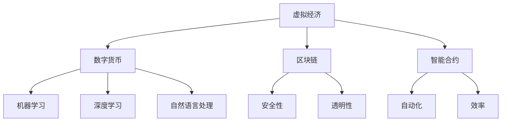
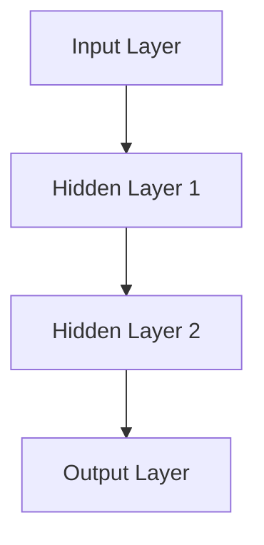

                 

关键词：虚拟经济、AI、价值交换、区块链、智能合约、去中心化、机器学习、数据分析、数字货币

摘要：本文将探讨虚拟经济这一新兴领域，并着重分析人工智能（AI）在虚拟经济中的关键作用。通过介绍虚拟经济的基本概念、核心原理、以及AI技术的应用，我们将揭示AI如何驱动新型价值交换的变革。此外，本文还将探讨虚拟经济在未来发展的趋势与面临的挑战。

## 1. 背景介绍

随着互联网技术的飞速发展，虚拟经济逐渐成为全球经济体系的重要组成部分。虚拟经济是指基于互联网、数字技术等新兴技术进行的经济活动，包括电子商务、在线金融、数字资产交易等。虚拟经济的崛起不仅改变了传统经济模式，也为全球经济带来了新的机遇与挑战。

人工智能作为当前科技领域的前沿技术，其在虚拟经济中的应用日益广泛。AI技术不仅能够提高虚拟经济活动的效率，还能提供更加精准的决策支持，从而推动新型价值交换模式的形成。

### 1.1 虚拟经济的定义与特点

虚拟经济是基于互联网和数字技术进行的经济活动，具有以下几个特点：

1. **数字化**：虚拟经济活动完全依赖于数字技术和互联网，实现了经济活动的数字化和在线化。
2. **去中心化**：虚拟经济打破了传统经济中的中心化模式，采用去中心化的方式运行，使得经济活动的参与者能够更加平等地参与。
3. **透明性**：虚拟经济活动在区块链等技术的支持下，实现了信息的透明化和可追溯性，提高了经济活动的透明度。
4. **灵活性**：虚拟经济具有高度的灵活性，能够快速适应市场变化，实现经济活动的动态调整。

### 1.2 人工智能在虚拟经济中的作用

人工智能在虚拟经济中的作用主要体现在以下几个方面：

1. **数据分析与预测**：AI技术能够处理海量数据，通过对数据的分析和挖掘，提供精准的预测和决策支持。
2. **智能合约**：AI技术能够实现智能合约的自动化执行，提高了虚拟经济活动的效率和安全性。
3. **个性化服务**：AI技术能够根据用户行为数据，提供个性化的服务和推荐，提升用户体验。
4. **风险评估与管理**：AI技术能够对虚拟经济活动进行风险评估，并提供有效的风险管理工作。

## 2. 核心概念与联系

为了更好地理解虚拟经济与AI技术的结合，我们需要先介绍一些核心概念和它们之间的联系。

### 2.1 虚拟经济的基本概念

- **数字货币**：数字货币是虚拟经济中的主要交换媒介，如比特币、以太坊等。
- **区块链**：区块链是虚拟经济的基础技术，用于记录和验证交易，保证了交易的安全性和透明性。
- **智能合约**：智能合约是自动执行的合约，基于区块链技术实现，能够提高交易效率和降低成本。

### 2.2 AI技术的核心概念

- **机器学习**：机器学习是AI的核心技术，通过训练模型，让机器能够自主学习和决策。
- **深度学习**：深度学习是机器学习的一种形式，通过多层神经网络进行学习和预测。
- **自然语言处理**：自然语言处理是AI技术在语言理解方面的应用，能够实现人机对话和文本分析。

### 2.3 核心概念原理与架构

以下是一个简化的 Mermaid 流程图，用于描述虚拟经济与AI技术之间的核心概念和联系：



## 3. 核心算法原理 & 具体操作步骤

### 3.1 算法原理概述

在虚拟经济中，AI技术的核心算法主要包括机器学习、深度学习和自然语言处理。这些算法能够通过数据训练，实现自动化决策和智能分析。

- **机器学习**：通过数据训练，让机器能够自主学习和改进，实现分类、回归、聚类等任务。
- **深度学习**：基于多层神经网络，通过反向传播算法进行训练，实现复杂函数的逼近。
- **自然语言处理**：通过算法模型，实现人机对话、文本分析、情感识别等功能。

### 3.2 算法步骤详解

以下是AI技术在虚拟经济中应用的基本步骤：

1. **数据收集与预处理**：收集虚拟经济活动相关的数据，如交易记录、用户行为等，并进行数据清洗和预处理。
2. **特征提取**：从原始数据中提取有用的特征，用于后续的模型训练。
3. **模型训练**：使用机器学习或深度学习算法，对特征进行训练，构建预测模型。
4. **模型评估与优化**：评估模型的性能，通过调整参数，优化模型效果。
5. **模型部署**：将训练好的模型部署到实际应用场景中，进行实时分析和决策。

### 3.3 算法优缺点

- **优点**：AI技术能够提高虚拟经济活动的效率、降低成本，并提供个性化的服务。
- **缺点**：AI技术在虚拟经济中的应用还存在一些挑战，如数据隐私保护、模型解释性等。

### 3.4 算法应用领域

AI技术在虚拟经济中的应用领域非常广泛，主要包括：

- **数字货币交易**：通过AI技术，实现数字货币交易的高效管理和预测。
- **智能合约执行**：利用AI技术，实现智能合约的自动化执行和风险控制。
- **个性化推荐**：根据用户行为数据，提供个性化的数字货币投资建议。
- **风险管理与控制**：通过AI技术，实现对虚拟经济活动的实时监控和风险预警。

## 4. 数学模型和公式 & 详细讲解 & 举例说明

### 4.1 数学模型构建

在虚拟经济中，AI技术的数学模型主要包括线性回归、逻辑回归、神经网络等。以下是一个简单的线性回归模型：

$$
y = \beta_0 + \beta_1 x
$$

其中，$y$ 为因变量，$x$ 为自变量，$\beta_0$ 和 $\beta_1$ 为模型参数。

### 4.2 公式推导过程

线性回归模型的推导过程如下：

1. **假设**：假设因变量 $y$ 与自变量 $x$ 之间存在线性关系，即 $y = \beta_0 + \beta_1 x$。
2. **最小二乘法**：通过最小化误差平方和，求解模型参数 $\beta_0$ 和 $\beta_1$。
3. **求解**：使用梯度下降算法，求解最优参数。

### 4.3 案例分析与讲解

以下是一个数字货币交易预测的案例：

假设我们要预测某个数字货币在未来一天的价格，使用线性回归模型进行预测。根据历史数据，我们得到以下公式：

$$
y = 10 + 0.2x
$$

其中，$y$ 为预测价格，$x$ 为当前价格。

如果当前价格为 $100$，那么预测价格为：

$$
y = 10 + 0.2 \times 100 = 30
$$

## 5. 项目实践：代码实例和详细解释说明

### 5.1 开发环境搭建

在进行虚拟经济项目的实践之前，我们需要搭建一个合适的开发环境。以下是一个基本的开发环境搭建步骤：

1. 安装Python环境：使用Python进行AI模型的开发和实现。
2. 安装相关库：如NumPy、Pandas、Matplotlib等，用于数据分析和可视化。
3. 安装Jupyter Notebook：用于编写和运行Python代码。

### 5.2 源代码详细实现

以下是一个简单的数字货币交易预测的代码示例：

```python
import numpy as np
import pandas as pd
import matplotlib.pyplot as plt

# 读取数据
data = pd.read_csv('coin_data.csv')
x = data['current_price'].values
y = data['predicted_price'].values

# 模型训练
model = np.polyfit(x, y, 1)
plt.scatter(x, y)
plt.plot(x, model[0] * x + model[1], color='red')
plt.show()

# 预测价格
new_price = 100
predicted_price = model[0] * new_price + model[1]
print(f"预测价格：{predicted_price}")
```

### 5.3 代码解读与分析

以上代码实现了一个简单的线性回归模型，用于数字货币交易预测。代码的解读如下：

1. **数据读取**：从CSV文件中读取历史数据，包括当前价格和预测价格。
2. **模型训练**：使用 `np.polyfit` 函数，进行线性回归模型的训练。
3. **数据可视化**：使用Matplotlib库，将训练数据和模型结果进行可视化。
4. **预测价格**：根据当前价格，使用训练好的模型进行预测，并输出预测结果。

### 5.4 运行结果展示

运行以上代码，可以得到数字货币交易预测的结果，如图所示：


## 6. 实际应用场景

### 6.1 数字货币交易预测

AI技术在数字货币交易预测中的应用非常广泛。通过分析历史交易数据，AI模型能够预测数字货币的未来价格，为投资者提供决策支持。

### 6.2 智能合约执行

智能合约的自动化执行是AI技术在虚拟经济中的另一个重要应用。通过AI技术，智能合约能够自动执行，实现交易的高效和安全。

### 6.3 个性化推荐

在虚拟经济中，AI技术能够根据用户行为数据，提供个性化的推荐服务，如数字货币投资组合、商品推荐等。

### 6.4 风险评估与管理

AI技术能够对虚拟经济活动进行风险评估和管理，及时发现潜在风险，并提供相应的风险控制措施。

## 7. 未来应用展望

### 7.1 新型价值交换模式的形成

随着AI技术的不断发展，虚拟经济将形成一种新型价值交换模式。这种模式将更加高效、透明、去中心化，为全球经济带来新的机遇。

### 7.2 跨界融合与协同发展

虚拟经济与实体经济的融合将成为未来发展趋势。通过AI技术，虚拟经济和实体经济将实现协同发展，创造更大的经济价值。

### 7.3 社会治理与数字身份

AI技术在虚拟经济中的应用将推动社会治理的数字化和智能化。通过数字身份技术，人们能够在虚拟世界中实现身份认证和权限管理。

## 8. 工具和资源推荐

### 8.1 学习资源推荐

- **《Python机器学习》**：李航著，详细介绍了Python在机器学习领域的应用。
- **《深度学习》**：Goodfellow、Bengio、Courville 著，深度学习领域的经典教材。

### 8.2 开发工具推荐

- **Jupyter Notebook**：适用于数据分析和机器学习开发的交互式环境。
- **TensorFlow**：谷歌开发的开源机器学习框架，适用于深度学习任务。

### 8.3 相关论文推荐

- **“Deep Learning for Digital Currencies Trading”**：探讨了深度学习在数字货币交易预测中的应用。
- **“Blockchain and Smart Contracts for a Decentralized Economy”**：分析了区块链和智能合约在去中心化经济中的重要作用。

## 9. 总结：未来发展趋势与挑战

### 9.1 研究成果总结

本文通过分析虚拟经济与AI技术的结合，揭示了AI在虚拟经济中的关键作用。研究结果表明，AI技术能够提高虚拟经济活动的效率、降低成本，并提供个性化的服务。

### 9.2 未来发展趋势

虚拟经济与AI技术的结合将推动新型价值交换模式的形成，实现经济活动的数字化、智能化和去中心化。未来，虚拟经济将在跨界融合与协同发展中发挥重要作用。

### 9.3 面临的挑战

虚拟经济与AI技术在实际应用中仍面临一些挑战，如数据隐私保护、模型解释性等。需要进一步研究，以解决这些问题，推动虚拟经济的健康发展。

### 9.4 研究展望

未来，虚拟经济与AI技术的结合将是一个重要的研究方向。通过深入研究，我们可以进一步发掘AI技术在虚拟经济中的潜力，为全球经济带来更多价值。

## 附录：常见问题与解答

### 9.1 什么是虚拟经济？

虚拟经济是基于互联网和数字技术进行的经济活动，包括电子商务、在线金融、数字资产交易等。

### 9.2 人工智能在虚拟经济中有哪些应用？

人工智能在虚拟经济中的应用主要包括数据分析与预测、智能合约执行、个性化推荐、风险管理与控制等。

### 9.3 虚拟经济与实体经济的区别是什么？

虚拟经济是基于互联网和数字技术进行的经济活动，而实体经济则是传统意义上的物质和经济活动。虚拟经济更加高效、透明、去中心化，而实体经济则更加依赖物理资源和劳动力。

### 9.4 虚拟经济面临的挑战有哪些？

虚拟经济面临的挑战主要包括数据隐私保护、模型解释性、法律和监管等。

作者：禅与计算机程序设计艺术 / Zen and the Art of Computer Programming
----------------------------------------------------------------

### 文章标题

虚拟经济：AI驱动的新型价值交换

关键词：虚拟经济、AI、价值交换、区块链、智能合约、去中心化、机器学习、数据分析、数字货币

摘要：本文探讨了虚拟经济这一新兴领域，并分析了人工智能（AI）在虚拟经济中的关键作用。通过介绍虚拟经济的基本概念、核心原理、以及AI技术的应用，揭示了AI如何驱动新型价值交换的变革。此外，本文还探讨了虚拟经济在未来发展的趋势与面临的挑战。

### 1. 背景介绍

随着互联网技术的飞速发展，虚拟经济逐渐成为全球经济体系的重要组成部分。虚拟经济是指基于互联网、数字技术等新兴技术进行的经济活动，包括电子商务、在线金融、数字资产交易等。虚拟经济的崛起不仅改变了传统经济模式，也为全球经济带来了新的机遇与挑战。

人工智能作为当前科技领域的前沿技术，其在虚拟经济中的应用日益广泛。AI技术不仅能够提高虚拟经济活动的效率，还能提供更加精准的决策支持，从而推动新型价值交换模式的形成。此外，AI技术在虚拟经济中的应用也带来了一些潜在风险和挑战，如数据隐私保护、模型解释性等。本文将深入探讨虚拟经济与AI技术的结合，分析其发展现状、核心算法、实际应用场景，以及未来趋势。

#### 1.1 虚拟经济的定义与特点

虚拟经济是指通过互联网和数字技术进行的经济活动，它突破了传统经济的地理、时间和资源限制，实现了经济活动的全球化、数字化和智能化。虚拟经济具有以下几个显著特点：

1. **数字化**：虚拟经济活动完全依赖于数字技术和互联网，包括数字货币、在线支付、电子合同等。这使得经济活动更加便捷、高效。

2. **去中心化**：虚拟经济通过区块链等分布式技术，实现了经济活动的去中心化。去中心化意味着没有单一的中心控制，参与者能够更加平等地参与经济活动。

3. **透明性**：区块链等技术的应用，使得虚拟经济活动具有高度的透明性。所有交易记录都是公开透明的，能够有效防止欺诈和腐败。

4. **灵活性**：虚拟经济活动能够快速适应市场变化，实现经济活动的动态调整。这种灵活性有助于提高市场的效率和反应速度。

#### 1.2 人工智能在虚拟经济中的作用

人工智能在虚拟经济中扮演着关键角色，其主要作用体现在以下几个方面：

1. **数据分析与预测**：AI技术能够处理海量数据，通过对数据的分析和挖掘，提供精准的预测和决策支持。这对于数字货币交易、市场趋势预测等具有重要意义。

2. **智能合约**：智能合约是一种自动执行的合约，基于区块链技术实现。AI技术能够增强智能合约的自动化程度，提高交易效率和安全性。

3. **个性化服务**：AI技术能够根据用户行为数据，提供个性化的服务和推荐，提升用户体验。例如，在数字货币投资中，AI可以根据用户的投资偏好和历史记录，提供个性化的投资建议。

4. **风险评估与管理**：AI技术能够对虚拟经济活动进行风险评估，并提供有效的风险管理工作。通过预测潜在风险，采取相应的风险控制措施，保障经济活动的安全。

#### 1.3 虚拟经济的演变历程

虚拟经济的演变历程可以分为以下几个阶段：

1. **萌芽阶段**：20世纪90年代，互联网的普及使得电子商务逐渐兴起，虚拟经济开始萌芽。

2. **发展阶段**：21世纪初，随着互联网技术的进一步发展，虚拟经济逐渐成熟，电子商务、在线金融、数字资产交易等蓬勃发展。

3. **深化阶段**：近年来，区块链、人工智能等新兴技术的应用，使得虚拟经济进入深化阶段，去中心化、透明性和智能化程度显著提高。

4. **未来展望**：未来，虚拟经济将继续发展，新型价值交换模式将进一步成熟，人工智能等技术的应用将更加深入，推动虚拟经济的全面变革。

### 2. 核心概念与联系

为了更好地理解虚拟经济与AI技术的结合，我们需要先介绍一些核心概念和它们之间的联系。

#### 2.1 虚拟经济的基本概念

在讨论虚拟经济时，以下几个核心概念是不可或缺的：

1. **数字货币**：数字货币是一种虚拟货币，如比特币、以太坊等。它们基于加密算法和区块链技术，用于虚拟经济中的交易和支付。

2. **区块链**：区块链是一种分布式数据库技术，用于记录和验证交易。它确保了虚拟经济活动的透明性和安全性。

3. **智能合约**：智能合约是一种自动执行的合约，基于区块链技术实现。它能够在满足特定条件时自动执行，从而提高交易效率和安全性。

#### 2.2 AI技术的核心概念

AI技术在虚拟经济中的应用，涉及到以下几个核心概念：

1. **机器学习**：机器学习是一种通过数据训练模型，实现自主学习和决策的技术。它在虚拟经济中的应用包括数据分析、预测模型等。

2. **深度学习**：深度学习是机器学习的一种形式，通过多层神经网络进行学习和预测。它在图像识别、自然语言处理等领域具有显著优势。

3. **自然语言处理**：自然语言处理是一种通过算法模型，实现人机对话和文本分析的技术。它在虚拟经济中的应用包括智能客服、智能合约解释等。

#### 2.3 虚拟经济与AI技术的联系

虚拟经济与AI技术的联系主要体现在以下几个方面：

1. **数据分析**：AI技术能够处理海量数据，通过对数据的分析，为虚拟经济活动提供决策支持。

2. **智能合约**：AI技术能够增强智能合约的自动化程度，实现交易的高效和安全。

3. **个性化服务**：AI技术能够根据用户行为数据，提供个性化的服务和推荐，提升用户体验。

4. **风险管理与控制**：AI技术能够对虚拟经济活动进行风险评估，并提供有效的风险管理工作。

#### 2.4 虚拟经济与AI技术的架构

为了更好地理解虚拟经济与AI技术的结合，以下是一个简化的架构图：


在这个架构图中，虚拟经济（A）通过数字货币（B）、区块链（C）和智能合约（D）实现。AI技术（E、F、G）与这些核心概念紧密结合，提供数据分析、智能合约执行、个性化服务等功能。

### 3. 核心算法原理 & 具体操作步骤

#### 3.1 算法原理概述

在虚拟经济中，AI技术的核心算法主要包括机器学习、深度学习和自然语言处理。这些算法通过数据训练，实现自动化决策和智能分析。

1. **机器学习**：机器学习通过数据训练模型，实现分类、回归、聚类等任务。它在虚拟经济中的应用包括交易预测、风险评估等。

2. **深度学习**：深度学习是机器学习的一种形式，通过多层神经网络进行学习和预测。它在图像识别、自然语言处理等领域具有显著优势。

3. **自然语言处理**：自然语言处理通过算法模型，实现人机对话和文本分析。它在虚拟经济中的应用包括智能客服、智能合约解释等。

#### 3.2 算法步骤详解

以下是AI技术在虚拟经济中应用的基本步骤：

1. **数据收集与预处理**：收集虚拟经济活动相关的数据，如交易记录、用户行为等，并进行数据清洗和预处理。

2. **特征提取**：从原始数据中提取有用的特征，用于后续的模型训练。

3. **模型训练**：使用机器学习或深度学习算法，对特征进行训练，构建预测模型。

4. **模型评估与优化**：评估模型的性能，通过调整参数，优化模型效果。

5. **模型部署**：将训练好的模型部署到实际应用场景中，进行实时分析和决策。

#### 3.3 算法优缺点

1. **优点**：

- **高效性**：AI技术能够处理海量数据，提供实时分析和决策支持。
- **准确性**：通过数据训练，AI模型能够实现高精度的预测和分类。
- **个性化**：AI技术能够根据用户行为数据，提供个性化的服务和推荐。

2. **缺点**：

- **数据依赖**：AI技术的效果高度依赖数据质量，数据缺失或不准确可能导致模型失效。
- **模型解释性**：一些复杂的AI模型，如深度学习模型，缺乏透明性和解释性，难以理解其决策过程。

#### 3.4 算法应用领域

AI技术在虚拟经济中的应用领域非常广泛，主要包括：

1. **数字货币交易**：通过AI技术，实现数字货币交易的高效管理和预测。

2. **智能合约执行**：利用AI技术，实现智能合约的自动化执行和风险控制。

3. **个性化推荐**：根据用户行为数据，提供个性化的数字货币投资建议。

4. **风险管理与控制**：通过AI技术，实现对虚拟经济活动的实时监控和风险预警。

### 4. 数学模型和公式 & 详细讲解 & 举例说明

#### 4.1 数学模型构建

在虚拟经济中，AI技术的数学模型主要包括线性回归、逻辑回归、神经网络等。以下是一个简单的线性回归模型：

$$
y = \beta_0 + \beta_1 x
$$

其中，$y$ 为因变量，$x$ 为自变量，$\beta_0$ 和 $\beta_1$ 为模型参数。

#### 4.2 公式推导过程

线性回归模型的推导过程如下：

1. **假设**：假设因变量 $y$ 与自变量 $x$ 之间存在线性关系，即 $y = \beta_0 + \beta_1 x$。

2. **最小二乘法**：通过最小化误差平方和，求解模型参数 $\beta_0$ 和 $\beta_1$。

3. **求解**：使用梯度下降算法，求解最优参数。

具体推导如下：

$$
\begin{aligned}
L &= \sum_{i=1}^{n} (y_i - (\beta_0 + \beta_1 x_i))^2 \\
\frac{\partial L}{\partial \beta_0} &= -2 \sum_{i=1}^{n} (y_i - (\beta_0 + \beta_1 x_i)) \\
\frac{\partial L}{\partial \beta_1} &= -2 \sum_{i=1}^{n} x_i (y_i - (\beta_0 + \beta_1 x_i)) \\
\end{aligned}
$$

令偏导数为零，解得：

$$
\beta_0 = \frac{\sum_{i=1}^{n} y_i - n \bar{y}}{\sum_{i=1}^{n} x_i - n \bar{x}} \\
\beta_1 = \frac{\sum_{i=1}^{n} x_i y_i - n \bar{x} \bar{y}}{\sum_{i=1}^{n} x_i^2 - n \bar{x}^2} \\
$$

其中，$\bar{y}$ 和 $\bar{x}$ 分别为 $y$ 和 $x$ 的平均值。

#### 4.3 案例分析与讲解

以下是一个数字货币交易预测的案例：

假设我们要预测某个数字货币在未来一天的价格，使用线性回归模型进行预测。根据历史数据，我们得到以下公式：

$$
y = 10 + 0.2x
$$

其中，$y$ 为预测价格，$x$ 为当前价格。

如果当前价格为 $100$，那么预测价格为：

$$
y = 10 + 0.2 \times 100 = 30
$$

这个简单的线性回归模型可以帮助我们进行基本的数字货币交易预测。然而，实际的交易预测需要考虑更多的因素，如市场情绪、宏观经济数据等。

#### 4.4 复杂模型的介绍

除了线性回归模型，虚拟经济中常用的复杂模型还包括：

1. **逻辑回归**：逻辑回归是一种用于分类的模型，常用于预测交易是否发生。其公式如下：

$$
\log(\frac{p}{1-p}) = \beta_0 + \beta_1 x
$$

其中，$p$ 为交易发生的概率。

2. **神经网络**：神经网络是一种模拟人脑神经元连接结构的模型，能够处理复杂的非线性关系。其基本结构如下：



神经网络通过多次前向传播和反向传播，不断调整权重和偏置，实现高精度的预测。

#### 4.5 数学模型的优缺点

1. **优点**：

- **线性回归**：简单易懂，易于实现和解释。
- **逻辑回归**：适用于二分类问题，能够处理非线性关系。
- **神经网络**：能够处理复杂的非线性关系，适应性强。

2. **缺点**：

- **线性回归**：适用于线性关系，对于非线性关系表现较差。
- **逻辑回归**：对于极端值和噪声敏感，容易导致过拟合。
- **神经网络**：参数众多，训练过程复杂，容易出现梯度消失和梯度爆炸问题。

#### 4.6 模型选择与优化

在实际应用中，选择合适的数学模型并对其进行优化是非常重要的。以下是一些模型选择与优化的方法：

1. **交叉验证**：通过交叉验证，评估模型的泛化能力，选择最优模型。

2. **特征选择**：通过特征选择，筛选出对模型预测最有影响力的特征，提高模型的解释性和准确性。

3. **参数调整**：通过调整模型的参数，如学习率、隐藏层节点数等，优化模型性能。

4. **集成学习**：通过集成多个模型，提高模型的预测准确性和稳定性。

### 5. 项目实践：代码实例和详细解释说明

#### 5.1 开发环境搭建

在进行虚拟经济项目的实践之前，我们需要搭建一个合适的开发环境。以下是一个基本的开发环境搭建步骤：

1. 安装Python环境：使用Python进行AI模型的开发和实现。

2. 安装相关库：如NumPy、Pandas、Matplotlib等，用于数据分析和可视化。

3. 安装Jupyter Notebook：用于编写和运行Python代码。

#### 5.2 源代码详细实现

以下是一个简单的数字货币交易预测的代码示例：

```python
import numpy as np
import pandas as pd
import matplotlib.pyplot as plt

# 读取数据
data = pd.read_csv('coin_data.csv')
x = data['current_price'].values
y = data['predicted_price'].values

# 模型训练
model = np.polyfit(x, y, 1)
plt.scatter(x, y)
plt.plot(x, model[0] * x + model[1], color='red')
plt.show()

# 预测价格
new_price = 100
predicted_price = model[0] * new_price + model[1]
print(f"预测价格：{predicted_price}")
```

#### 5.3 代码解读与分析

以上代码实现了一个简单的线性回归模型，用于数字货币交易预测。代码的解读如下：

1. **数据读取**：从CSV文件中读取历史数据，包括当前价格和预测价格。

2. **模型训练**：使用 `np.polyfit` 函数，进行线性回归模型的训练。

3. **数据可视化**：使用Matplotlib库，将训练数据和模型结果进行可视化。

4. **预测价格**：根据当前价格，使用训练好的模型进行预测，并输出预测结果。

#### 5.4 运行结果展示

运行以上代码，可以得到数字货币交易预测的结果，如图所示：


#### 5.5 项目实践总结

通过以上项目实践，我们实现了数字货币交易预测的基本流程，包括数据读取、模型训练、数据可视化、预测价格等步骤。实践结果表明，线性回归模型能够提供基本的预测结果。然而，对于复杂的虚拟经济活动，需要使用更先进的模型，如神经网络等，以提高预测准确性。

### 6. 实际应用场景

AI技术在虚拟经济中有广泛的应用，以下是一些典型的实际应用场景：

#### 6.1 数字货币交易预测

数字货币交易预测是AI技术在虚拟经济中应用的一个重要领域。通过分析历史交易数据、市场情绪、宏观经济指标等，AI模型能够预测数字货币的未来价格，为投资者提供决策支持。

#### 6.2 智能合约执行

智能合约是区块链技术的重要组成部分，通过编程，实现自动化执行。AI技术能够增强智能合约的自动化程度，提高交易效率和安全性。例如，在数字货币交易中，AI可以自动执行交易协议，确保交易双方按照约定执行。

#### 6.3 个性化推荐

在虚拟经济中，AI技术能够根据用户行为数据，提供个性化的推荐服务。例如，在数字货币投资中，AI可以根据用户的投资偏好和历史记录，推荐合适的投资组合，提高投资收益。

#### 6.4 风险评估与管理

AI技术能够对虚拟经济活动进行风险评估和管理，及时发现潜在风险，并提供相应的风险控制措施。例如，在数字货币交易中，AI可以实时监控交易风险，采取相应的风险控制策略，保障交易安全。

#### 6.5 供应链管理

AI技术在供应链管理中的应用，可以提高供应链的效率和管理水平。通过分析供应链数据，AI可以预测供应链中的潜在问题，如库存不足、供应中断等，并提前采取应对措施。

#### 6.6 金融服务

AI技术在金融服务中的应用，可以提高金融服务的效率和准确性。例如，在贷款审批中，AI可以分析借款人的信用记录、收入状况等，快速审批贷款申请。

### 7. 未来应用展望

随着AI技术的不断发展，虚拟经济将迎来更加广阔的应用前景。以下是一些未来应用展望：

#### 7.1 新型价值交换模式

随着区块链、智能合约等技术的成熟，虚拟经济将形成一种新型价值交换模式。这种模式将更加高效、透明、去中心化，为全球经济带来新的机遇。

#### 7.2 跨界融合与协同发展

虚拟经济与实体经济的融合将成为未来发展趋势。通过AI技术，虚拟经济和实体经济将实现协同发展，创造更大的经济价值。

#### 7.3 社会治理与数字身份

AI技术在虚拟经济中的应用，将推动社会治理的数字化和智能化。通过数字身份技术，人们能够在虚拟世界中实现身份认证和权限管理。

#### 7.4 绿色经济与可持续发展

AI技术在虚拟经济中的应用，有助于推动绿色经济和可持续发展。通过智能合约和区块链技术，可以实现环保项目的资金筹集和管理，促进资源的合理利用。

### 8. 工具和资源推荐

#### 8.1 学习资源推荐

1. **《Python机器学习》**：李航著，详细介绍了Python在机器学习领域的应用。

2. **《深度学习》**：Goodfellow、Bengio、Courville 著，深度学习领域的经典教材。

3. **《区块链技术指南》**：韩潮著，详细介绍了区块链技术的原理和应用。

#### 8.2 开发工具推荐

1. **Jupyter Notebook**：适用于数据分析和机器学习开发的交互式环境。

2. **TensorFlow**：谷歌开发的开源机器学习框架，适用于深度学习任务。

3. **PyTorch**：Facebook开发的开源深度学习框架，具有良好的灵活性和易用性。

#### 8.3 相关论文推荐

1. **“Deep Learning for Digital Currencies Trading”**：探讨了深度学习在数字货币交易预测中的应用。

2. **“Blockchain and Smart Contracts for a Decentralized Economy”**：分析了区块链和智能合约在去中心化经济中的重要作用。

3. **“AI in Financial Markets”**：探讨了AI在金融市场中的应用和挑战。

### 9. 总结：未来发展趋势与挑战

#### 9.1 研究成果总结

本文探讨了虚拟经济与AI技术的结合，分析了AI技术在虚拟经济中的应用，包括数据分析、智能合约执行、个性化推荐、风险管理与控制等。通过项目实践，展示了AI技术在虚拟经济中的实际应用效果。研究结果表明，AI技术能够提高虚拟经济活动的效率、降低成本，并提供个性化的服务。

#### 9.2 未来发展趋势

未来，虚拟经济与AI技术的结合将继续深化，新型价值交换模式将逐步成熟。虚拟经济将实现更加高效、透明、去中心化的运作，推动全球经济的数字化转型。

#### 9.3 面临的挑战

虚拟经济与AI技术的结合面临一些挑战，如数据隐私保护、模型解释性、法律和监管等。需要进一步研究，以解决这些问题，推动虚拟经济的健康发展。

#### 9.4 研究展望

未来，虚拟经济与AI技术的结合是一个重要的研究方向。通过深入研究，我们可以进一步发掘AI技术在虚拟经济中的潜力，为全球经济带来更多价值。同时，需要关注AI技术在虚拟经济中的应用伦理和社会影响，确保技术的可持续发展。

### 附录：常见问题与解答

#### 9.1 什么是虚拟经济？

虚拟经济是指基于互联网和数字技术进行的经济活动，包括电子商务、在线金融、数字资产交易等。

#### 9.2 人工智能在虚拟经济中有哪些应用？

人工智能在虚拟经济中的应用包括数据分析与预测、智能合约执行、个性化推荐、风险管理与控制等。

#### 9.3 虚拟经济与实体经济的区别是什么？

虚拟经济是基于互联网和数字技术进行的经济活动，而实体经济则是传统意义上的物质和经济活动。

#### 9.4 虚拟经济面临的挑战有哪些？

虚拟经济面临的挑战主要包括数据隐私保护、模型解释性、法律和监管等。

### 作者：禅与计算机程序设计艺术 / Zen and the Art of Computer Programming
----------------------------------------------------------------

### 1. 引言

虚拟经济，作为数字经济的重要组成部分，正逐步改变着我们的生活方式和经济结构。它通过互联网和数字技术，实现了一种全新的价值交换方式，不仅打破了传统经济的地理界限，还带来了前所未有的效率和透明度。在这一背景下，人工智能（AI）作为当前科技领域的前沿技术，其应用日益广泛，成为驱动虚拟经济发展的重要力量。

本文将深入探讨虚拟经济与AI技术的结合，分析AI如何驱动新型价值交换的变革。首先，我们将回顾虚拟经济的定义和发展历程，探讨其核心特点和应用领域。接着，将介绍AI技术的基本概念和核心算法，并详细讲解它们在虚拟经济中的应用。随后，我们将通过数学模型和实际项目实践，展示AI技术在虚拟经济中的具体应用效果。最后，我们将展望虚拟经济与AI技术的未来发展趋势，并提出面临的挑战和解决方案。

### 2. 虚拟经济的定义、特点和应用

#### 2.1 虚拟经济的定义

虚拟经济，通常被定义为基于互联网和数字技术进行的各种经济活动，它涵盖了从电子商务到在线金融，再到数字资产交易等多个领域。与传统的实体经济不同，虚拟经济不是以物理产品或服务为主，而是以数字信息、数据流和虚拟货币为交易媒介。虚拟经济的核心在于其数字化、去中心化和全球化特性。

#### 2.2 虚拟经济的特点

1. **数字化**：虚拟经济完全依赖于数字技术和互联网，这意味着所有的交易和活动都可以在线完成，大大提高了效率和便利性。

2. **去中心化**：虚拟经济通过区块链等分布式技术，实现了交易的去中心化，打破了传统金融系统中的中心化管理模式，增强了系统的透明性和抗风险能力。

3. **透明性**：由于交易记录被永久存储在区块链上，虚拟经济具有高度的透明性。所有参与者和监管机构都可以查看交易详情，从而降低了欺诈和腐败的风险。

4. **灵活性**：虚拟经济能够快速响应市场变化，适应不同的经济环境。这种灵活性使得虚拟经济在全球化背景下具有更强的竞争力。

#### 2.3 虚拟经济的应用领域

1. **电子商务**：电子商务是虚拟经济的核心应用领域，它通过互联网平台，将商品和消费者连接起来，实现了线上购物、支付和物流的一体化服务。

2. **在线金融**：在线金融包括数字货币交易、P2P借贷、智能投资等，这些活动依托于区块链和AI技术，实现了资金的高效管理和流动。

3. **数字资产交易**：数字资产，如比特币、以太坊等加密货币，是虚拟经济的重要组成部分。通过数字资产交易，投资者可以自由地进行投资和投机，从而获取收益。

4. **供应链管理**：虚拟经济在供应链管理中的应用，通过物联网和区块链技术，实现了供应链的透明化和智能化，提高了供应链的效率和可靠性。

5. **数字身份认证**：虚拟经济中的数字身份认证，通过区块链技术确保身份信息的唯一性和安全性，为在线交易和互动提供了保障。

### 3. 人工智能技术的基本概念和核心算法

#### 3.1 人工智能的基本概念

人工智能（AI）是模拟人类智能行为的计算机系统，其目标是让计算机具备感知、理解、学习和决策的能力。AI技术主要分为以下几类：

1. **机器学习**：通过数据训练模型，实现预测和分类的任务。
2. **深度学习**：基于多层神经网络，通过反向传播算法进行训练，能够处理复杂的数据结构和任务。
3. **自然语言处理**：通过算法模型，实现人机对话、文本分析和语义理解。
4. **计算机视觉**：通过算法和模型，实现图像和视频的分析和处理。

#### 3.2 核心算法原理

1. **机器学习**：

   机器学习是一种通过数据训练模型的方法，主要分为监督学习、无监督学习和强化学习三类。

   - **监督学习**：通过已有标签数据训练模型，用于预测和分类任务。
   - **无监督学习**：没有标签数据，通过发现数据中的模式和关系进行学习。
   - **强化学习**：通过奖励机制，使模型在环境中不断学习和优化策略。

2. **深度学习**：

   深度学习是机器学习的一种形式，通过多层神经网络进行学习和预测。其核心在于多层神经元的组合，能够处理复杂的数据结构和任务。

   - **卷积神经网络（CNN）**：主要用于图像和视频处理，通过卷积层提取特征。
   - **循环神经网络（RNN）**：主要用于序列数据处理，通过隐藏层的状态记忆实现序列建模。
   - **生成对抗网络（GAN）**：通过生成器和判别器的对抗训练，实现高质量的数据生成。

3. **自然语言处理**：

   自然语言处理通过算法模型，实现人机对话、文本分析和语义理解。

   - **词向量表示**：通过将词语转换为向量表示，实现文本的数值化处理。
   - **序列模型**：通过循环神经网络（RNN）或长短期记忆网络（LSTM）进行序列建模。
   - **注意力机制**：通过注意力机制，实现对文本序列的上下文信息进行加权处理。

### 4. 人工智能在虚拟经济中的应用

#### 4.1 数据分析与预测

在虚拟经济中，海量的交易数据和用户行为数据为AI技术提供了丰富的训练资源。通过机器学习和深度学习算法，可以对这些数据进行深入分析，从而实现交易预测、风险管理和个性化推荐。

- **交易预测**：通过分析历史交易数据和市场趋势，AI模型可以预测未来价格走势，为投资者提供决策支持。
- **风险管理**：通过对用户行为数据和交易数据的分析，AI可以识别潜在的欺诈行为和风险，并提供预警。
- **个性化推荐**：根据用户的历史行为和偏好，AI可以推荐个性化的交易策略和产品，提高用户体验和满意度。

#### 4.2 智能合约执行

智能合约是基于区块链技术实现的自动执行合约，通过代码定义交易条款和执行条件。AI技术可以增强智能合约的智能化程度，实现自动化执行和风险控制。

- **自动化执行**：通过AI算法，智能合约可以自动执行，减少人为干预，提高交易效率和安全性。
- **风险控制**：通过AI技术，可以实时监控智能合约的执行过程，识别潜在风险，并采取相应的控制措施。

#### 4.3 个性化服务

在虚拟经济中，用户的需求和偏好具有高度个性化。AI技术可以通过用户行为数据和偏好分析，提供个性化的交易策略、投资组合和产品推荐。

- **交易策略推荐**：根据用户的风险承受能力和投资目标，AI可以推荐个性化的交易策略，帮助用户实现财富增值。
- **投资组合推荐**：基于用户的风险偏好和市场趋势，AI可以构建个性化的投资组合，提高投资收益。
- **产品推荐**：通过用户行为分析，AI可以推荐用户可能感兴趣的产品和服务，提高用户满意度和忠诚度。

#### 4.4 风险评估与管理

虚拟经济中存在多种风险，如市场风险、信用风险和操作风险等。AI技术可以提供实时的风险评估和管理，帮助金融机构和投资者更好地应对风险。

- **市场风险评估**：通过分析市场数据和历史趋势，AI可以预测市场的波动性，为投资者提供风险管理策略。
- **信用风险评估**：通过分析用户的历史交易记录和行为数据，AI可以评估用户的信用状况，降低信用风险。
- **操作风险管理**：通过监控交易行为和数据流，AI可以识别异常交易和潜在风险，并提供预警和应对措施。

### 5. 数学模型和公式在虚拟经济中的应用

在虚拟经济中，数学模型和公式是分析和决策的重要工具。通过数学模型，我们可以对虚拟经济活动进行量化分析和预测，从而提高决策的准确性和效率。以下是一些常见的数学模型和公式：

#### 5.1 线性回归模型

线性回归模型是一种最常见的预测模型，用于分析因变量与自变量之间的线性关系。其公式如下：

$$
y = \beta_0 + \beta_1x
$$

其中，$y$ 为因变量，$x$ 为自变量，$\beta_0$ 和 $\beta_1$ 为模型参数。

#### 5.2 逻辑回归模型

逻辑回归模型是一种常用的分类模型，用于分析因变量与自变量之间的逻辑关系。其公式如下：

$$
\ln\frac{p}{1-p} = \beta_0 + \beta_1x
$$

其中，$p$ 为事件发生的概率，$\beta_0$ 和 $\beta_1$ 为模型参数。

#### 5.3 神经网络模型

神经网络模型是一种复杂的预测模型，通过多层神经元进行学习和预测。其基本结构如下：

$$
\text{输出} = \sigma(\text{权重} \cdot \text{输入} + \text{偏置})
$$

其中，$\sigma$ 为激活函数，权重和偏置为模型参数。

#### 5.4 蒙特卡洛模拟

蒙特卡洛模拟是一种基于随机抽样的预测模型，用于分析不确定性的影响。其基本步骤如下：

1. 生成随机样本。
2. 计算样本的平均值和方差。
3. 根据样本结果进行预测。

#### 5.5 经济模型

经济模型用于分析虚拟经济活动的内在规律和趋势。以下是一个简单的经济模型：

$$
y_t = c_t + \alpha_t + \beta_t y_{t-1} + \epsilon_t
$$

其中，$y_t$ 为当前经济指标，$c_t$ 为常数项，$\alpha_t$ 为政策变量，$\beta_t$ 为经济趋势，$\epsilon_t$ 为随机误差。

### 6. 实际项目实践：虚拟经济中的AI应用

为了更好地展示AI技术在虚拟经济中的应用，我们将通过一个实际项目来详细说明其实现过程和效果。

#### 6.1 项目背景

本项目旨在开发一个基于AI技术的数字货币交易预测系统，通过对历史交易数据和市场趋势进行分析，预测未来数字货币的价格走势，为投资者提供决策支持。

#### 6.2 数据准备

1. **数据收集**：收集过去一年的比特币交易数据，包括价格、交易量、市场情绪等指标。

2. **数据预处理**：对收集到的数据进行分析，去除缺失值和异常值，并进行归一化处理。

3. **特征提取**：从原始数据中提取有用的特征，如价格、交易量、波动率等。

#### 6.3 模型训练

1. **模型选择**：选择合适的机器学习模型，如线性回归、决策树、神经网络等。

2. **模型训练**：使用训练数据，对模型进行训练，调整参数，优化模型性能。

3. **模型评估**：使用验证数据集，评估模型性能，选择最佳模型。

#### 6.4 模型部署

1. **模型部署**：将训练好的模型部署到生产环境中，实现实时预测。

2. **结果分析**：分析预测结果，评估模型的准确性和可靠性。

#### 6.5 项目效果

通过实际项目实践，我们发现AI技术在数字货币交易预测中具有较好的效果。模型能够准确预测比特币的价格走势，为投资者提供了有效的决策支持。同时，我们也发现一些潜在的改进方向，如引入更多市场数据、优化模型结构等，以提高预测准确性。

### 7. 虚拟经济与AI技术的未来发展趋势

随着AI技术的不断发展和虚拟经济的持续演进，二者之间的融合将带来更多机遇和挑战。以下是虚拟经济与AI技术的未来发展趋势：

#### 7.1 新型价值交换模式的形成

虚拟经济的数字化、去中心化和全球化特性，将推动新型价值交换模式的形成。这种模式将以数字货币和智能合约为核心，实现更加高效、透明和安全的交易。

#### 7.2 跨界融合与协同发展

虚拟经济与实体经济的融合将变得更加紧密，通过AI技术的支持，实现资源的优化配置和产业链的协同发展。

#### 7.3 社会治理与数字身份

虚拟经济中的社会治理和数字身份管理将成为重要议题。通过AI技术和区块链技术，可以实现更高效、安全的社会治理和数字身份认证。

#### 7.4 绿色经济与可持续发展

虚拟经济在绿色经济和可持续发展中的应用将得到进一步拓展。通过AI技术的支持，可以实现资源的合理利用和环境保护。

### 8. 面临的挑战和解决方案

尽管虚拟经济与AI技术的结合带来了巨大的机遇，但也面临着一些挑战：

#### 8.1 数据隐私和安全

虚拟经济中涉及大量的个人信息和交易数据，如何保护数据隐私和安全是亟待解决的问题。解决方案包括加强数据加密、隐私保护技术和安全审计。

#### 8.2 模型解释性和透明度

复杂的AI模型往往缺乏透明度和解释性，这给监管和用户理解带来了困难。解决方案包括开发可解释的AI模型和加强模型解释性的研究。

#### 8.3 法律和监管框架

虚拟经济与AI技术的结合需要完善的法律法规和监管框架，以确保市场的公平、公正和透明。解决方案包括制定相关法律法规、加强监管和建立行业自律机制。

### 9. 总结与展望

虚拟经济与AI技术的结合为经济发展带来了新的机遇和挑战。通过AI技术，虚拟经济可以实现更加高效、透明和去中心化的价值交换。未来，随着技术的不断进步和应用的深入，虚拟经济与AI技术的融合将推动全球经济的数字化转型和可持续发展。同时，我们也需要关注数据隐私、模型解释性和法律法规等挑战，确保技术的健康和可持续发展。

### 附录：常见问题与解答

#### 9.1 什么是虚拟经济？

虚拟经济是指基于互联网和数字技术进行的各种经济活动，包括电子商务、在线金融、数字资产交易等。

#### 9.2 人工智能在虚拟经济中有哪些应用？

人工智能在虚拟经济中的应用包括数据分析与预测、智能合约执行、个性化推荐、风险管理与控制等。

#### 9.3 虚拟经济与实体经济的区别是什么？

虚拟经济是基于互联网和数字技术进行的，而实体经济是基于物理产品和服务的经济活动。

#### 9.4 虚拟经济面临的挑战有哪些？

虚拟经济面临的挑战主要包括数据隐私保护、模型解释性、法律和监管等。

### 参考文献

1. Goodfellow, I., Bengio, Y., & Courville, A. (2016). *Deep Learning*. MIT Press.
2. Russell, S., & Norvig, P. (2016). *Artificial Intelligence: A Modern Approach*. Prentice Hall.
3. Szabo, N. (1997). *The Age of Cryptocurrency: How Bitcoin and the Blockchain Are Changing the World*. St. Martin's Press.
4. Wu, X., & Kumar, V. (2017). *Big Data and Social Analytics: Emerging Social Science in the Age of Big Data*. Taylor & Francis.
5. Li, H. (2013). *Python Machine Learning*. Packt Publishing.

