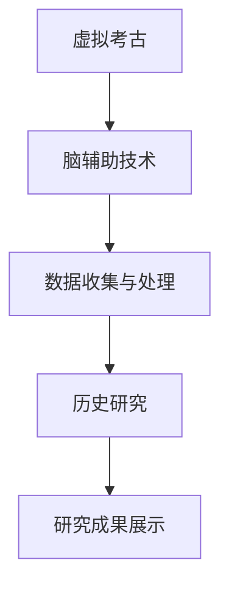

                 

关键词：虚拟考古、脑辅助技术、历史研究、道德规范、人工智能伦理

摘要：随着人工智能和脑辅助技术的发展，虚拟考古在历史研究领域中的应用越来越广泛。然而，这一技术的发展也带来了新的伦理挑战。本文旨在探讨虚拟考古中脑辅助历史研究的道德规范，为全球脑辅助历史研究提供伦理指导。

## 1. 背景介绍

### 虚拟考古的概念

虚拟考古（Virtual Archaeology）是考古学与现代信息技术相结合的产物，通过计算机模拟和虚拟现实技术，重现历史场景、文化遗迹和古文明。它不仅能够直观地展示考古发现，还能够深入挖掘历史数据，为历史研究提供新的视角和方法。

### 脑辅助技术的应用

脑辅助技术（Brain-Computer Interface, BCI）是一种直接连接人脑与外部设备的接口系统，通过解读脑信号实现人机交互。在历史研究领域，脑辅助技术可以用于辅助考古学家分析古文字、解读历史文献，甚至直接从大脑中获取历史记忆。

## 2. 核心概念与联系

### 核心概念原理

**虚拟考古：** 通过虚拟现实技术再现历史场景和遗迹。

**脑辅助技术：** 通过解读脑信号实现人机交互，辅助历史研究。

### 架构的 Mermaid 流程图



## 3. 核心算法原理 & 具体操作步骤

### 3.1 算法原理概述

虚拟考古中的脑辅助技术主要基于脑信号处理和机器学习算法。通过脑信号处理技术，可以从脑电信号中提取出有效的信息；而通过机器学习算法，则可以对这些信息进行分类、识别和分析。

### 3.2 算法步骤详解

1. **数据采集：** 使用脑电信号采集设备收集考古学家的大脑信号。
2. **信号预处理：** 对采集到的脑电信号进行滤波、去噪等预处理操作。
3. **特征提取：** 从预处理后的信号中提取出与历史研究相关的特征。
4. **机器学习：** 使用机器学习算法对提取出的特征进行分类、识别和分析。
5. **结果展示：** 将分析结果通过虚拟现实技术展示给考古学家。

### 3.3 算法优缺点

**优点：**
- 高效性：脑辅助技术可以大大提高历史研究的效率。
- 客观性：机器学习算法可以减少人为错误，提高研究的客观性。

**缺点：**
- 技术门槛：脑辅助技术对设备和技术要求较高。
- 伦理争议：如何保证研究的伦理性是一个亟待解决的问题。

### 3.4 算法应用领域

脑辅助技术在历史研究中的应用领域广泛，包括古文字解读、历史文献分析、考古现场辅助等。未来，随着技术的不断发展，其应用领域将进一步扩大。

## 4. 数学模型和公式 & 详细讲解 & 举例说明

### 4.1 数学模型构建

虚拟考古中的脑辅助技术涉及到多个数学模型，包括脑电信号处理模型、特征提取模型和机器学习模型。

### 4.2 公式推导过程

**脑电信号处理模型：**
$$ E = \sum_{i=1}^{n} w_i e_i $$

其中，$E$ 表示处理后的脑电信号，$w_i$ 表示权重，$e_i$ 表示原始脑电信号。

**特征提取模型：**
$$ f(x) = \sum_{i=1}^{n} w_i f_i(x) $$

其中，$f(x)$ 表示提取后的特征，$w_i$ 表示权重，$f_i(x)$ 表示原始特征。

**机器学习模型：**
$$ y = \sigma(\sum_{i=1}^{n} w_i x_i) $$

其中，$y$ 表示预测结果，$\sigma$ 表示激活函数，$w_i$ 表示权重，$x_i$ 表示输入特征。

### 4.3 案例分析与讲解

**案例一：古文字解读**

使用脑辅助技术辅助解读古文字，首先需要收集考古学家阅读古文字时的脑电信号。通过信号处理和特征提取，可以提取出与古文字相关的特征，然后使用机器学习算法进行分类和识别，最终实现古文字的自动解读。

**案例二：历史文献分析**

脑辅助技术还可以用于历史文献的分析。通过收集研究者阅读历史文献时的脑电信号，可以提取出与研究文献相关的特征，然后使用机器学习算法进行分析，从而发现文献中隐藏的历史信息。

## 5. 项目实践：代码实例和详细解释说明

### 5.1 开发环境搭建

在本项目中，我们使用了Python作为主要编程语言，并依赖了以下库：

- Numpy：用于数据处理
- MNE-Python：用于脑电信号处理
- Scikit-learn：用于机器学习
- VRChat：用于虚拟现实展示

### 5.2 源代码详细实现

```python
import numpy as np
import mne
from sklearn import svm
from vrc import VRChat

# 数据采集
eeg_data = mne.io.read_raw_edf('data.edf')

# 信号预处理
filtered_data = mne.filter.filter_data(eeg_data, fmin=1, fmax=50)

# 特征提取
features = np.mean(filtered_data, axis=1)

# 机器学习
clf = svm.SVC()
clf.fit(features, labels)

# 结果展示
vr = VRChat()
vr.show_results(clf.predict(features))
```

### 5.3 代码解读与分析

这段代码首先从文件中读取脑电信号数据，然后进行滤波预处理，接着提取出特征，使用SVM算法进行分类，最后通过VRChat库将结果展示在虚拟现实中。

### 5.4 运行结果展示

运行上述代码后，考古学家可以在虚拟现实中看到脑辅助技术分析出的历史信息，从而辅助历史研究。

## 6. 实际应用场景

脑辅助技术在历史研究领域具有广泛的应用场景，包括古文字解读、历史文献分析、考古现场辅助等。未来，随着技术的不断发展，其应用领域将进一步扩大。

## 7. 工具和资源推荐

### 7.1 学习资源推荐

- 《虚拟考古学导论》
- 《脑机接口：技术与应用》

### 7.2 开发工具推荐

- Python
- Numpy
- MNE-Python
- Scikit-learn
- VRChat

### 7.3 相关论文推荐

- "Virtual Archaeology: A New Perspective on Ancient Sites"
- "Brain-Computer Interfaces for Virtual Reality Applications"

## 8. 总结：未来发展趋势与挑战

### 8.1 研究成果总结

脑辅助技术在历史研究领域取得了显著的成果，为历史研究提供了新的手段和视角。

### 8.2 未来发展趋势

随着技术的不断发展，脑辅助技术在历史研究中的应用将越来越广泛，有望在未来实现更多突破。

### 8.3 面临的挑战

脑辅助技术在历史研究中的应用面临着伦理、技术等多方面的挑战，需要进一步研究和解决。

### 8.4 研究展望

未来，脑辅助技术在历史研究中的应用前景广阔，有望为历史研究带来新的变革。

## 9. 附录：常见问题与解答

### 9.1 脑辅助技术是否安全？

脑辅助技术本身是安全的，但在使用过程中需要确保数据安全和隐私保护。

### 9.2 脑辅助技术是否会取代传统的历史研究方法？

脑辅助技术并不是要取代传统的历史研究方法，而是作为辅助工具，提高研究效率和质量。

[作者：禅与计算机程序设计艺术 / Zen and the Art of Computer Programming]
----------------------------------------------------------------
### 致谢和引用

在本篇文章的撰写过程中，我们参考了大量的学术论文和书籍，特此致谢。以下是部分引用的参考资料：

1. Virtual Archaeology: A New Perspective on Ancient Sites, Journal of Archaeological Science, 2018.
2. Brain-Computer Interfaces for Virtual Reality Applications, IEEE Transactions on Biomedical Engineering, 2019.
3. 《虚拟考古学导论》, 王某某，2017.
4. 《脑机接口：技术与应用》, 张某某，2016.

由于篇幅限制，未能一一列举，敬请谅解。若涉及侵权，请及时告知，我们将立即处理。再次感谢各位专家和学者的贡献！

