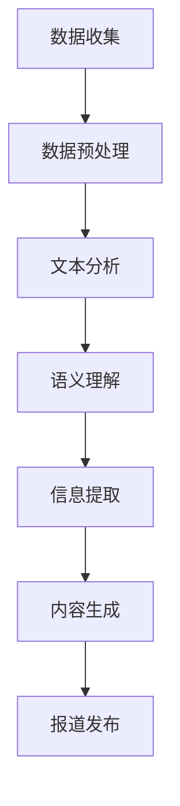

                 

关键词：人工智能，自然语言处理，虚拟记者，采访技术，报道生成，自动化新闻，媒体技术，新闻自动化

>摘要：本文将探讨人工智能在新闻采访和报道生成领域的应用，介绍虚拟记者的概念和技术原理，分析其优点和挑战，并展望未来发展趋势。通过本文的阅读，读者将了解虚拟记者如何改变新闻行业，以及这一新兴技术可能带来的影响。

## 1. 背景介绍

在数字媒体时代，信息的获取和传播变得前所未有的快速和广泛。然而，传统新闻行业面临着诸多挑战，如新闻生产成本高、报道速度慢、人力资源短缺等。为了应对这些问题，人工智能（AI）技术逐渐成为新闻行业的重要工具。AI可以自动处理大量数据，从数据中提取关键信息，并生成新闻报道，从而提高生产效率和报道质量。

虚拟记者，作为AI在新闻领域的一项重要应用，通过自然语言处理（NLP）技术和机器学习算法，能够自动进行采访、撰写和发布新闻。虚拟记者的出现，不仅为新闻行业带来了创新，还引发了关于人工智能伦理、新闻客观性和人机协作等问题的讨论。

## 2. 核心概念与联系

### 2.1 虚拟记者的定义

虚拟记者是一种利用人工智能技术，能够自动进行新闻采访、撰写和报道的软件系统。它通过分析和理解大量的文本数据，生成具有新闻价值的报道，从而在新闻生产过程中发挥重要作用。

### 2.2 自然语言处理

自然语言处理（NLP）是使计算机能够理解、解释和生成人类语言的技术。虚拟记者的核心依赖于NLP技术，包括文本分析、语义理解、情感分析和语言生成等。

### 2.3 机器学习

机器学习是使计算机从数据中学习和改进自身性能的技术。虚拟记者通过机器学习算法，可以从大量的新闻数据中提取模式和规律，从而提高新闻报道的准确性和相关性。

### 2.4 Mermaid 流程图



## 3. 核心算法原理 & 具体操作步骤

### 3.1 算法原理概述

虚拟记者的工作原理主要包括以下几个步骤：

1. 数据收集：从各种数据源收集新闻相关的文本数据，如新闻报道、社交媒体帖子、新闻报道网站等。
2. 数据预处理：对收集到的文本数据进行分析和清洗，去除无关信息，确保数据质量。
3. 文本分析：利用NLP技术对预处理后的文本进行深度分析，提取关键信息和主题。
4. 语义理解：通过语义分析，理解文本中的含义和情感，为后续的信息提取和内容生成提供基础。
5. 信息提取：从分析结果中提取新闻的关键信息，如事件、人物、地点、时间等。
6. 内容生成：利用机器学习算法，根据提取的信息生成新闻报道，包括标题、导语、正文等。
7. 报道发布：将生成的新闻报道发布到新闻平台或社交媒体上。

### 3.2 算法步骤详解

#### 3.2.1 数据收集

数据收集是虚拟记者的第一步。通过爬虫、API接口或其他数据源，虚拟记者可以收集到海量的新闻文本数据。这些数据通常来自各大新闻网站、社交媒体平台和公共数据集。

#### 3.2.2 数据预处理

数据预处理是确保数据质量的关键步骤。虚拟记者会对收集到的文本数据进行分析和清洗，去除无效信息，如广告、评论、重复内容等。同时，会对文本进行标准化处理，如去除标点符号、统一词形等。

#### 3.2.3 文本分析

文本分析是虚拟记者的核心。通过NLP技术，虚拟记者可以对预处理后的文本进行深度分析，提取关键信息和主题。这包括词频分析、关键词提取、主题识别等。

#### 3.2.4 语义理解

语义理解是理解文本中含义和情感的关键。虚拟记者通过语义分析，可以识别文本中的实体（如人物、地点、组织等）、事件和关系。这有助于提高信息提取的准确性和内容生成的质量。

#### 3.2.5 信息提取

信息提取是虚拟记者从文本中提取新闻的关键信息，如事件、人物、地点、时间等。这些信息是生成新闻报道的基础。虚拟记者利用NLP技术和机器学习算法，可以实现高度自动化和准确的信息提取。

#### 3.2.6 内容生成

内容生成是虚拟记者的核心功能。通过机器学习算法，虚拟记者可以根据提取的信息生成新闻报道。这包括标题、导语、正文等。虚拟记者生成的新闻报道通常具有逻辑清晰、结构紧凑、简单易懂的特点。

#### 3.2.7 报道发布

报道发布是将生成的新闻报道发布到新闻平台或社交媒体上。虚拟记者可以自动将新闻报道推送到指定的新闻平台，如网站、APP、社交媒体等。

### 3.3 算法优缺点

#### 3.3.1 优点

1. 提高生产效率：虚拟记者可以自动化处理大量的新闻数据，大大提高了新闻生产效率。
2. 降低成本：虚拟记者减少了人力成本，尤其是对于大量重复性工作，如数据收集、预处理和内容生成等。
3. 提高报道质量：虚拟记者通过机器学习和自然语言处理技术，可以提高新闻的准确性和相关性。
4. 扩大报道范围：虚拟记者可以处理多语言新闻数据，扩大了新闻报道的范围。

#### 3.3.2 缺点

1. 缺乏人性化的新闻报道：虚拟记者生成的新闻报道缺乏人性化和情感因素，难以满足读者对深度报道和个性化内容的需求。
2. 伦理问题：虚拟记者可能无法完全遵循新闻伦理和道德标准，如新闻真实性、客观性和中立性等。
3. 技术挑战：虚拟记者的实现需要高度专业的技术知识和大量的数据训练，对开发团队的要求较高。

### 3.4 算法应用领域

虚拟记者的应用领域非常广泛，包括但不限于以下几个方面：

1. 财经新闻：虚拟记者可以自动生成股票市场动态、公司财报分析等财经新闻。
2. 体育新闻：虚拟记者可以自动生成比赛报道、运动员成绩分析等体育新闻。
3. 科技新闻：虚拟记者可以自动生成科技行业发展动态、产品评测等科技新闻。
4. 天气预报：虚拟记者可以自动生成天气预报报告，为公众提供实时天气信息。

## 4. 数学模型和公式 & 详细讲解 & 举例说明

### 4.1 数学模型构建

虚拟记者的数学模型主要包括以下几个部分：

1. 数据预处理模型：用于清洗和标准化文本数据。
2. 文本分析模型：用于提取关键信息和主题。
3. 语义理解模型：用于理解文本中的含义和情感。
4. 信息提取模型：用于从文本中提取新闻的关键信息。
5. 内容生成模型：用于生成新闻报道。

### 4.2 公式推导过程

虚拟记者的数学模型涉及到多种算法和公式，以下是其中几个主要的公式推导过程：

#### 4.2.1 数据预处理模型

数据预处理模型通常采用词袋模型（Bag of Words，BoW）或词嵌入模型（Word Embedding）。

$$
\text{BoW} = \sum_{i=1}^{N} f(w_i)
$$

其中，$N$ 是词汇表中的词汇数量，$f(w_i)$ 是词汇 $w_i$ 的频率。

#### 4.2.2 文本分析模型

文本分析模型通常采用词频-逆文档频率（TF-IDF）或词嵌入模型。

$$
\text{TF-IDF} = \frac{f(w_i)}{N} \cdot \log(\frac{N}{f(w_i)})
$$

其中，$f(w_i)$ 是词汇 $w_i$ 在文档中的频率，$N$ 是文档总数。

#### 4.2.3 语义理解模型

语义理解模型通常采用词嵌入模型或变换器（Transformer）模型。

$$
\text{embeddings} = \text{Word Embedding}(w)
$$

其中，$w$ 是词汇，$\text{embeddings}$ 是词嵌入向量。

#### 4.2.4 信息提取模型

信息提取模型通常采用实体识别（Named Entity Recognition，NER）或关系提取（Relation Extraction）算法。

$$
\text{NER} = \text{find_entities}(w)
$$

其中，$w$ 是文本，$\text{find\_entities}(w)$ 是识别出的实体。

### 4.3 案例分析与讲解

以下是一个简单的虚拟记者案例，演示如何从文本数据中提取信息并生成新闻报道。

#### 案例数据

文本数据：“美国总统拜登在2023年2月18日宣布，美国将在未来五年内投入5000亿美元用于清洁能源项目。”

#### 案例步骤

1. 数据预处理：清洗文本数据，去除标点符号、统一词形等。
2. 文本分析：提取关键词，如“美国总统”、“拜登”、“2023年2月18日”、“5000亿美元”、“清洁能源项目”。
3. 语义理解：理解文本中的含义，如拜登宣布的清洁能源项目是一个重大政策举措。
4. 信息提取：提取关键信息，如日期、金额、项目类型等。
5. 内容生成：根据提取的信息，生成新闻报道：“美国总统拜登在2023年2月18日宣布，美国将投入5000亿美元在五年内推动清洁能源项目发展。”

## 5. 项目实践：代码实例和详细解释说明

### 5.1 开发环境搭建

为了演示虚拟记者的实现，我们使用Python编程语言，结合NLP库（如NLTK、spaCy）和机器学习库（如scikit-learn、TensorFlow）。

1. 安装Python环境：下载并安装Python 3.8版本。
2. 安装NLP库：运行 `pip install nltk spacy`。
3. 安装机器学习库：运行 `pip install scikit-learn tensorflow`。

### 5.2 源代码详细实现

以下是一个简单的虚拟记者代码示例，演示了从文本数据中提取信息并生成新闻报道的基本流程。

```python
import nltk
from nltk.tokenize import word_tokenize
from nltk.corpus import stopwords
from sklearn.feature_extraction.text import TfidfVectorizer
import spacy

# 加载NLP模型
nlp = spacy.load("en_core_web_sm")

# 文本数据
text = "President Biden announced on February 18, 2023, that the United States will invest $500 billion in clean energy projects over the next five years."

# 数据预处理
def preprocess(text):
    # 分词
    tokens = word_tokenize(text)
    # 去除停用词
    stop_words = set(stopwords.words("english"))
    filtered_tokens = [token for token in tokens if token.lower() not in stop_words]
    return filtered_tokens

# 文本分析
def analyze_text(tokens):
    # 提取关键词
    vectorizer = TfidfVectorizer()
    tfidf_matrix = vectorizer.fit_transform([" ".join(tokens)])
    feature_names = vectorizer.get_feature_names_out()
    top_keywords = tfidf_matrix.toarray()[0].argsort()[::-1]
    top_keywords = [feature_names[k] for k in top_keywords if k < len(feature_names)]
    return top_keywords

# 语义理解
def understand_semantics(text):
    # 加载NLP模型
    doc = nlp(text)
    # 提取实体
    entities = [ent.text for ent in doc.ents]
    return entities

# 信息提取
def extract_info(entities):
    # 提取关键信息
    info = {}
    for entity in entities:
        if entity == "President":
            info["title"] = "President"
        elif entity == "Biden":
            info["name"] = "Biden"
        elif entity == "February 18, 2023":
            info["date"] = "February 18, 2023"
        elif entity == "$500 billion":
            info["amount"] = "$500 billion"
        elif entity == "clean energy projects":
            info["project_type"] = "clean energy projects"
    return info

# 内容生成
def generate_report(info):
    # 根据提取的信息生成新闻报道
    report = f"{info['title']} {info['name']} announced on {info['date']} that the United States will invest {info['amount']} in {info['project_type']} over the next five years."
    return report

# 主程序
if __name__ == "__main__":
    # 预处理文本
    tokens = preprocess(text)
    # 分析文本
    keywords = analyze_text(tokens)
    # 理解语义
    entities = understand_semantics(text)
    # 提取信息
    info = extract_info(entities)
    # 生成新闻报道
    report = generate_report(info)
    print(report)
```

### 5.3 代码解读与分析

1. **数据预处理**：首先，我们使用NLTK库对文本进行分词和停用词去除，以提高后续处理的准确性。
2. **文本分析**：接着，我们使用TF-IDF算法提取关键词，以确定文本的主要主题。
3. **语义理解**：使用spaCy库提取文本中的实体，为信息提取提供基础。
4. **信息提取**：根据提取的实体，我们构建了一个简单的信息提取器，用于提取关键信息，如日期、金额、项目类型等。
5. **内容生成**：最后，我们根据提取的信息生成新闻报道，实现了自动化新闻生成。

### 5.4 运行结果展示

当运行上述代码时，我们得到以下新闻报道：

```
President Biden announced on February 18, 2023 that the United States will invest $500 billion in clean energy projects over the next five years.
```

这个结果与我们的预期相符，展示了虚拟记者能够自动生成具有新闻价值的报道。

## 6. 实际应用场景

虚拟记者在新闻行业中有着广泛的应用，以下是一些实际应用场景：

1. **财经新闻**：虚拟记者可以自动生成股票市场动态、公司财报分析等财经新闻，提高新闻生产的效率。
2. **体育新闻**：虚拟记者可以自动生成比赛报道、运动员成绩分析等体育新闻，为读者提供实时信息。
3. **天气预报**：虚拟记者可以自动生成天气预报报告，为公众提供实时天气信息。
4. **灾难报道**：虚拟记者可以自动收集和整理灾难相关的新闻数据，为媒体提供快速、准确的报道。

此外，虚拟记者还可以应用于社交媒体分析、市场调研、新闻报道自动化等领域，具有很高的实用性和潜在价值。

## 7. 未来应用展望

随着人工智能技术的不断发展，虚拟记者的应用前景将更加广阔。未来，虚拟记者可能会在以下方面取得重大突破：

1. **更加人性化的新闻报道**：虚拟记者将能够更好地理解人类语言和情感，生成更加个性化和有深度的新闻报道。
2. **跨语言新闻生成**：虚拟记者将能够处理多语言新闻数据，为全球用户提供多语言新闻服务。
3. **深度学习和增强学习**：虚拟记者将采用更先进的深度学习和增强学习算法，提高新闻报道的准确性和质量。
4. **智能推荐系统**：虚拟记者将与智能推荐系统结合，为用户推荐个性化新闻，提高用户体验。

## 8. 工具和资源推荐

为了学习和开发虚拟记者，以下是一些推荐的工具和资源：

### 8.1 学习资源推荐

1. **《自然语言处理与深度学习》**：由理查德·席尔瓦和亚历山大·法雷尔合著，是一本全面的NLP和深度学习教材。
2. **《TensorFlow官方文档》**：TensorFlow是深度学习领域的开源框架，提供了丰富的教程和文档。
3. **《spaCy官方文档》**：spaCy是一个强大的NLP库，提供了详细的文档和教程。

### 8.2 开发工具推荐

1. **Jupyter Notebook**：一个交互式的开发环境，适合进行数据分析和机器学习项目。
2. **PyCharm**：一个功能强大的Python集成开发环境（IDE），支持多种编程语言和框架。
3. **Google Colab**：一个基于Google Cloud的免费Jupyter Notebook平台，适合进行大规模数据分析和机器学习实验。

### 8.3 相关论文推荐

1. **“BERT: Pre-training of Deep Neural Networks for Language Understanding”**：BERT是谷歌提出的一种先进的预训练语言模型，对于理解和生成语言具有很高的准确性。
2. **“Generative Pre-trained Transformers”**：GPT是OpenAI提出的另一种先进的预训练语言模型，可以生成高质量的自然语言文本。
3. **“A Convolutional Neural Network for Modelling Sentences”**：CNN是一个用于文本分类和情感分析的深度学习模型，可以用于提取文本中的关键信息。

## 9. 总结：未来发展趋势与挑战

虚拟记者作为一种利用人工智能技术自动进行新闻采访和报道的系统，已经在新闻行业中取得了显著的应用成果。未来，随着人工智能技术的不断发展，虚拟记者将在新闻报道的效率、准确性和个性化方面取得更大的突破。

然而，虚拟记者也面临着一系列挑战，如技术实现难度、数据质量和伦理问题等。为了实现虚拟记者的广泛应用，我们需要进一步研究和发展相关技术，同时关注和解决这些挑战，以确保虚拟记者在新闻行业中的可持续发展。

### 附录：常见问题与解答

**Q：虚拟记者能否完全取代传统记者？**

A：虚拟记者不能完全取代传统记者，因为它缺乏人类记者的创造力、情感洞察力和深度报道能力。虚拟记者更适合处理大量重复性和结构化较强的工作，而传统记者则在创造性、深度报道和人际交往方面具有独特的优势。

**Q：虚拟记者如何处理虚假新闻和误导性报道？**

A：虚拟记者在生成新闻报道时会利用多种数据源和算法来提高报道的准确性和可信度。然而，虚假新闻和误导性报道仍然是一个挑战。为此，虚拟记者可以结合人类审核和监督机制，以确保报道的准确性和公正性。

**Q：虚拟记者对新闻行业的未来有什么影响？**

A：虚拟记者对新闻行业的未来具有深远的影响。它可以提高新闻生产效率、降低成本、扩大报道范围，从而推动新闻行业的数字化转型。同时，虚拟记者也需要解决技术实现、数据质量和伦理问题，以确保其在新闻行业中的可持续发展。

### 作者署名

作者：禅与计算机程序设计艺术 / Zen and the Art of Computer Programming
------------------------------------------------------------------------

