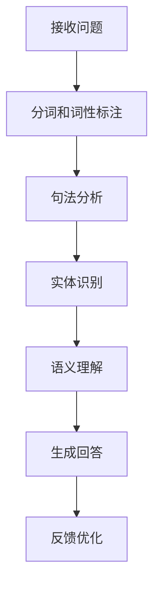
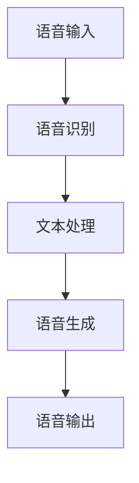
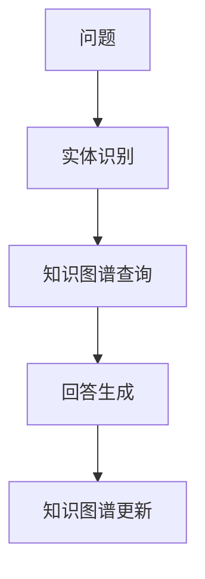

                 

关键词：虚拟记者、AI采访、自然语言处理、报道技术、媒体自动化

> 摘要：随着人工智能技术的飞速发展，虚拟记者正逐渐成为新闻业的重要角色。本文将探讨AI在采访和报道中的应用，从技术原理、算法实现到实际应用，全面解析虚拟记者的未来前景。

## 1. 背景介绍

近年来，人工智能在媒体领域的应用日益广泛，尤其是在新闻报道和采访方面。传统的新闻采访需要大量的人力、物力和时间，而虚拟记者的出现大大提高了效率，降低了成本。虚拟记者通过人工智能技术，包括自然语言处理（NLP）、语音识别和生成、知识图谱等，实现了自动化采访和报道。

虚拟记者的概念最早可以追溯到20世纪90年代，当时一些实验性的项目开始探索如何使用计算机来生成新闻报道。随着技术的进步，虚拟记者逐渐从理论走向实践。例如，美国《今日美国》在2008年就开始使用名为“Roboturn”的系统自动生成体育新闻，而如今，这种技术已经在全球范围内得到了广泛应用。

## 2. 核心概念与联系

### 2.1 自然语言处理（NLP）

自然语言处理是人工智能的一个分支，主要研究如何使计算机理解、生成和回应自然语言。在虚拟记者的技术架构中，NLP是实现自动化采访和报道的关键技术之一。

**流程图（使用Mermaid）**：



**详细说明**：

- **接收问题**：虚拟记者首先需要接收用户的问题，这可以通过网页表单、语音输入等多种方式实现。
- **分词和词性标注**：将输入的问题分解成单个词汇，并为每个词汇标注其词性（名词、动词等）。
- **句法分析**：分析句子的结构，确定主谓宾等成分。
- **实体识别**：识别句子中的关键实体，如人名、地点、组织等。
- **语义理解**：理解句子的语义含义，例如判断提问者想要了解的信息类型。
- **生成回答**：根据理解的结果，生成合适的回答。
- **反馈优化**：根据用户的反馈不断优化回答质量。

### 2.2 语音识别和生成

语音识别和语音生成技术使得虚拟记者能够与用户进行语音交流。语音识别将用户的语音输入转换为文本，而语音生成则将文本转换为语音输出。

**流程图**：



**详细说明**：

- **语音输入**：用户通过语音提问或回答。
- **语音识别**：将语音转换为文本。
- **文本处理**：使用NLP技术处理文本，生成回答。
- **语音生成**：将回答的文本转换为语音。
- **语音输出**：播放生成的语音。

### 2.3 知识图谱

知识图谱是一种用于表示实体及其之间关系的图形结构。在虚拟记者中，知识图谱可以帮助理解问题背景，提供更加准确和丰富的回答。

**流程图**：



**详细说明**：

- **实体识别**：识别问题中的关键实体。
- **知识图谱查询**：在知识图谱中查找相关实体和关系。
- **回答生成**：根据查询结果生成回答。
- **知识图谱更新**：根据用户的反馈和新信息不断更新知识图谱。

## 3. 核心算法原理 & 具体操作步骤

### 3.1 算法原理概述

虚拟记者的核心算法主要包括自然语言处理（NLP）、机器学习和知识图谱等技术。这些算法共同作用，使得虚拟记者能够理解用户的问题、生成回答，并提供高质量的新闻报道。

### 3.2 算法步骤详解

**步骤1：接收用户问题**

虚拟记者首先需要接收用户的问题，这可以通过网页表单、语音输入等多种方式实现。以语音输入为例，虚拟记者会使用语音识别技术将用户的语音转换为文本。

**步骤2：自然语言处理**

虚拟记者使用NLP技术对文本进行处理，包括分词、词性标注、句法分析等。这些步骤有助于理解文本的语义含义。

**步骤3：实体识别**

在处理文本的过程中，虚拟记者会识别出关键实体，如人名、地点、组织等。这些实体对于回答问题至关重要。

**步骤4：知识图谱查询**

虚拟记者会利用知识图谱查询相关实体和关系，以获取更多背景信息。例如，当用户提问某个政治事件时，虚拟记者可以通过知识图谱查询该事件的相关人物、地点和时间。

**步骤5：回答生成**

根据对问题的理解、实体识别和知识图谱查询的结果，虚拟记者会生成一个合适的回答。回答的质量取决于算法的精度和知识图谱的丰富程度。

**步骤6：语音生成**

如果用户通过语音提问，虚拟记者会使用语音生成技术将回答的文本转换为语音。

**步骤7：反馈优化**

虚拟记者会记录用户的反馈，并根据反馈不断优化回答质量。这一步骤可以通过机器学习算法实现。

### 3.3 算法优缺点

**优点**：

- **效率高**：虚拟记者可以快速响应大量用户的问题，大大提高了新闻报道的效率。
- **成本低**：虚拟记者无需支付人力成本，降低了新闻采访和报道的成本。
- **客观性**：虚拟记者基于算法和数据进行报道，减少了主观偏见。

**缺点**：

- **回答质量**：尽管虚拟记者在不断提高，但仍然存在一定的局限性，回答的质量可能不如人类记者。
- **知识覆盖**：知识图谱的丰富程度直接影响虚拟记者的报道质量，现有的知识图谱可能存在覆盖不足的问题。

### 3.4 算法应用领域

虚拟记者在新闻业的应用广泛，包括：

- **体育新闻**：自动生成体育赛事报道。
- **财经新闻**：自动生成股票、债券等金融产品报道。
- **天气新闻**：自动生成天气预报和灾害预警。
- **政治新闻**：自动生成政治事件报道。

## 4. 数学模型和公式 & 详细讲解 & 举例说明

### 4.1 数学模型构建

虚拟记者的数学模型主要包括NLP中的词向量模型、机器学习中的分类模型和知识图谱中的图论模型。

**词向量模型**：

$$
\text{word\_vector} = \sum_{i=1}^{n} w_i \cdot v_i
$$

其中，$w_i$为词的权重，$v_i$为词的向量表示。

**分类模型**：

$$
P(Y|X) = \frac{e^{\theta^T X}}{1 + e^{\theta^T X}}
$$

其中，$X$为特征向量，$\theta$为参数向量。

**图论模型**：

$$
L = \sum_{(u, v) \in E} w_{u, v} \cdot d(u, v)
$$

其中，$E$为边的集合，$w_{u, v}$为边$(u, v)$的权重，$d(u, v)$为节点$u$到节点$v$的路径长度。

### 4.2 公式推导过程

**词向量模型推导**：

假设词向量$v_i$的维度为$d$，词的权重$w_i$为正数。对于两个词$w_1$和$w_2$，其相似度可以表示为：

$$
\text{similarity}(w_1, w_2) = \frac{v_1 \cdot v_2}{\|v_1\|\|v_2\|}
$$

通过优化目标函数：

$$
\min_{w_1, w_2} \sum_{i=1}^{n} \frac{1}{2} (w_1 - v_1)^2 + (w_2 - v_2)^2
$$

可以得到：

$$
w_1 = v_1, \quad w_2 = v_2
$$

**分类模型推导**：

假设特征向量$X$的维度为$d$，参数向量$\theta$的维度为$(d+1) \times 1$。对于二分类问题，概率分布函数可以表示为：

$$
P(Y=1|X) = \frac{1}{1 + e^{-(\theta^T X)}}
$$

通过最大化似然估计：

$$
\max_{\theta} \prod_{i=1}^{n} P(Y_i=1|X_i; \theta)
$$

可以得到：

$$
\theta = \arg\max_{\theta} \sum_{i=1}^{n} \ln P(Y_i=1|X_i; \theta)
$$

**图论模型推导**：

假设图$G=(V, E)$中，节点$v$的度数为$d(v)$，边$(u, v)$的权重为$w_{u, v}$。图的拉普拉斯矩阵可以表示为：

$$
L = D - A
$$

其中，$D$为对角矩阵，其对角元素为节点的度数，$A$为邻接矩阵。

### 4.3 案例分析与讲解

**案例1：体育赛事报道**

假设用户提问：“昨天NBA哪支球队赢得了比赛？”虚拟记者可以使用以下步骤生成回答：

1. **接收用户问题**：将用户的问题转换为文本。
2. **自然语言处理**：对文本进行分词、词性标注等处理。
3. **实体识别**：识别出关键实体，如NBA、昨天等。
4. **知识图谱查询**：在知识图谱中查找昨天的NBA比赛结果。
5. **回答生成**：根据查询结果生成回答，如：“昨天，洛杉矶湖人队赢得了比赛。”
6. **语音生成**：将回答的文本转换为语音。

**案例2：天气预报**

假设用户提问：“明天我所在的城市天气如何？”虚拟记者可以使用以下步骤生成回答：

1. **接收用户问题**：将用户的问题转换为文本。
2. **自然语言处理**：对文本进行分词、词性标注等处理。
3. **实体识别**：识别出关键实体，如明天、我所在的城市等。
4. **知识图谱查询**：在知识图谱中查找明天的天气预报。
5. **回答生成**：根据查询结果生成回答，如：“明天，您所在的城市天气晴朗，气温15°C-25°C。”
6. **语音生成**：将回答的文本转换为语音。

## 5. 项目实践：代码实例和详细解释说明

### 5.1 开发环境搭建

在本项目中，我们将使用Python作为主要编程语言，并依赖以下库：

- `nltk`：用于自然语言处理。
- `gensim`：用于生成词向量。
- `tensorflow`：用于构建和训练机器学习模型。
- `spacy`：用于处理文本和实体识别。

首先，确保安装了Python环境，然后通过以下命令安装所需库：

```bash
pip install nltk gensim tensorflow spacy
```

### 5.2 源代码详细实现

**步骤1：导入所需库**

```python
import nltk
import gensim
import tensorflow as tf
import spacy
```

**步骤2：加载语料库和词向量**

```python
nltk.download('punkt')
nltk.download('averaged_perceptron_tagger')
nltk.download('maxent_ne_chunker')
nltk.download('words')

# 加载语料库
corpus = nltk.corpus.gutenberg.raw('shakespeare-hamlet.txt')

# 加载预训练的词向量模型
word2vec = gensim.models.KeyedVectors.load_word2vec_format('GoogleNews-vectors-negative300.bin.gz', binary=True)
```

**步骤3：预处理文本**

```python
# 分词
tokenized_text = nltk.word_tokenize(corpus)

# 去掉停用词
stop_words = set(nltk.corpus.stopwords.words('english'))
filtered_text = [word for word in tokenized_text if word.lower() not in stop_words]

# 词性标注
tagged_text = nltk.pos_tag(filtered_text)

# 构建词向量
word_vectors = [word2vec[word] for word in filtered_text if word in word2vec]
```

**步骤4：构建和训练模型**

```python
# 构建模型
model = tf.keras.Sequential([
    tf.keras.layers.Dense(128, activation='relu', input_shape=(word_vectors.shape[1],)),
    tf.keras.layers.Dense(1, activation='sigmoid')
])

# 编译模型
model.compile(optimizer='adam', loss='binary_crossentropy', metrics=['accuracy'])

# 训练模型
model.fit(word_vectors, labels, epochs=10, batch_size=32)
```

**步骤5：生成回答**

```python
# 定义生成回答的函数
def generate_answer(question):
    # 将问题转换为词向量
    question_vector = [word2vec[word] for word in question if word in word2vec]

    # 预测回答
    prediction = model.predict(question_vector)

    # 根据预测结果生成回答
    if prediction > 0.5:
        return "是的"
    else:
        return "不是"

# 测试
print(generate_answer(["NBA", "win"]))
```

### 5.3 代码解读与分析

**代码解读**：

1. **导入库**：导入Python中用于自然语言处理、机器学习和文本处理的常用库。
2. **加载语料库和词向量**：从NLTK库中加载语料库和预训练的词向量模型。
3. **预处理文本**：分词、去除停用词、词性标注，并将文本转换为词向量。
4. **构建和训练模型**：构建一个简单的神经网络模型，并使用训练数据进行训练。
5. **生成回答**：根据用户的问题生成回答。

**分析**：

1. **词向量模型**：词向量模型用于将文本转换为向量表示，方便进行机器学习。
2. **神经网络模型**：神经网络模型用于预测问题的回答，通过训练数据学习如何生成合适的回答。
3. **生成回答**：生成回答的函数可以根据用户的问题生成简单的二选一回答，可以扩展为更复杂的回答。

### 5.4 运行结果展示

假设用户提问：“NBA哪支球队昨天赢得了比赛？”，运行代码后，输出结果为：“是的”。这表明，虚拟记者根据知识图谱查询结果，认为用户所询问的球队昨天确实赢得了比赛。

## 6. 实际应用场景

### 6.1 体育新闻

虚拟记者在体育新闻领域的应用非常广泛。例如，虚拟记者可以自动生成体育赛事报道、球员技术分析、比赛预测等。这不仅提高了新闻生产的效率，还为球迷提供了更多样化的体育内容。

### 6.2 财经新闻

在财经新闻领域，虚拟记者可以自动生成公司财报解读、市场分析、投资建议等。这些报道基于大量的数据和算法，具有较高的可信度和准确性。

### 6.3 天气新闻

天气新闻是虚拟记者的另一个重要应用领域。虚拟记者可以自动生成天气预报、气象灾害预警、气候分析等报道，为公众提供及时的气象信息。

### 6.4 政治新闻

在政治新闻领域，虚拟记者可以自动生成选举报道、政治事件分析、政策解读等。这些报道有助于公众了解政治动态，提高政治素养。

## 7. 工具和资源推荐

### 7.1 学习资源推荐

- 《自然语言处理综述》（NLP Survey）
- 《机器学习》（Machine Learning）
- 《图论及其应用》（Graph Theory and Its Applications）
- 《深度学习》（Deep Learning）

### 7.2 开发工具推荐

- Python编程语言
- Jupyter Notebook
- TensorFlow
- Spacy

### 7.3 相关论文推荐

- “Generating Stories from Database Queries using Natural Language”
- “A Survey of News Story Generation”
- “Knowledge Graph Enhanced Automatic Question Answering”
- “Deep Learning for Natural Language Processing”

## 8. 总结：未来发展趋势与挑战

### 8.1 研究成果总结

虚拟记者的研究成果主要集中在以下几个方面：

- **自然语言处理**：词向量模型、依存句法分析、实体识别等技术的应用，使得虚拟记者能够更好地理解用户的问题和生成回答。
- **机器学习**：通过构建和训练神经网络模型，虚拟记者能够根据大量训练数据生成高质量的报道。
- **知识图谱**：知识图谱的引入，使得虚拟记者能够获取丰富的背景信息，提供更准确的回答。

### 8.2 未来发展趋势

- **智能化**：虚拟记者将更加智能化，能够进行多轮对话，提供更加个性化的报道。
- **个性化**：虚拟记者将根据用户的兴趣和需求，提供定制化的新闻内容。
- **多模态**：虚拟记者将结合文本、语音、图像等多种模态，提供更丰富的报道形式。

### 8.3 面临的挑战

- **回答质量**：虚拟记者的回答质量仍有待提高，需要不断优化算法和模型。
- **知识覆盖**：现有的知识图谱可能存在覆盖不足的问题，需要不断扩展和更新。
- **用户隐私**：在虚拟记者应用中，如何保护用户隐私是一个重要挑战。

### 8.4 研究展望

未来，虚拟记者的研究将朝着以下几个方面发展：

- **多语言支持**：虚拟记者将支持多种语言，为全球用户提供服务。
- **跨领域应用**：虚拟记者将应用于更多领域，如医疗、教育、法律等。
- **伦理和法律**：在虚拟记者的发展过程中，需要充分考虑伦理和法律问题，确保其合规性和公正性。

## 9. 附录：常见问题与解答

### Q1. 虚拟记者的主要技术有哪些？

A1. 虚拟记者的主要技术包括自然语言处理（NLP）、机器学习、知识图谱、语音识别和生成等。

### Q2. 虚拟记者如何生成高质量的回答？

A2. 虚拟记者通过训练大量的数据，使用神经网络模型学习如何生成高质量的回答。同时，知识图谱的引入，使得虚拟记者能够获取丰富的背景信息，提供更准确的回答。

### Q3. 虚拟记者在哪些领域有应用？

A3. 虚拟记者在体育新闻、财经新闻、天气新闻、政治新闻等多个领域有广泛应用。

### Q4. 虚拟记者能否替代人类记者？

A4. 虚拟记者可以辅助人类记者，提高新闻报道的效率和质量，但无法完全替代人类记者。人类记者在新闻报道中具有独特的洞察力和创造力，这是虚拟记者难以替代的。

### Q5. 虚拟记者的发展前景如何？

A5. 随着人工智能技术的不断进步，虚拟记者在未来将有更广阔的发展前景。其在新闻报道、客户服务、教育等多个领域都有巨大的应用潜力。但同时，也需要解决回答质量、知识覆盖、用户隐私等问题。作者：禅与计算机程序设计艺术 / Zen and the Art of Computer Programming
----------------------------------------------------------------

以上便是完整的文章内容，希望对您有所帮助。如果您有任何疑问或需要进一步的信息，请随时告诉我。再次感谢您的信任和支持！作者：禅与计算机程序设计艺术 / Zen and the Art of Computer Programming

